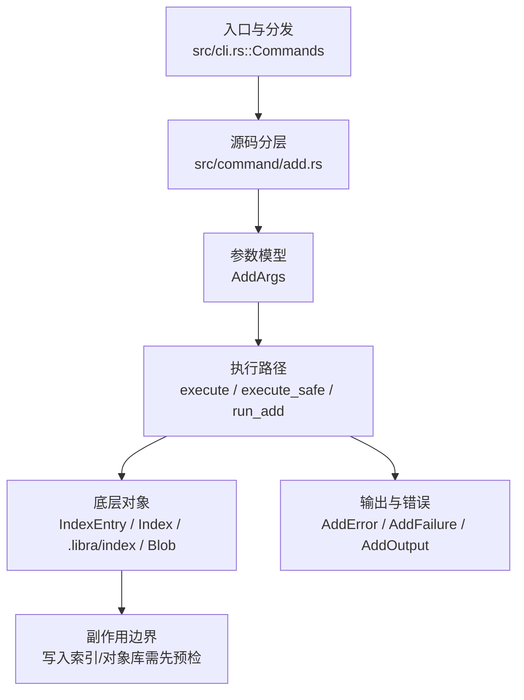

# `libra add` 开发设计

## 命令实现目标

`libra add` 的目标是把工作区中的文件变化写入索引，为下一次 `libra commit` 准备快照。实现需要覆盖路径规格、忽略规则、`--dry-run` 预览、`--refresh` 重新检查已跟踪条目、`-A` 全量暂存以及 LFS 指针文件暂存，同时保证路径解析不会越过仓库根目录。

## 对比 Git 与兼容性

- 兼容级别：`partial`。sparse-checkout flag unsupported

- 当前矩阵明确仍是部分兼容；未覆盖的 Git surface 必须显式列在“还未实现的功能”。

## 设计方案

- 入口与分发：已公开接入 `src/cli.rs::Commands`；已由 `src/command/mod.rs` 导出。CLI 层在 `src/cli.rs` 把解析后的参数交给命令模块，命令模块负责把领域错误转换为 `CliError` / `CliResult`。
- 源码分层：主要实现文件为 `src/command/add.rs`。参数/子命令类型包括：`AddArgs`；输出、错误或状态类型包括：`AddError`、`AddFailure`、`AddOutput`；主要执行函数包括：`execute`、`execute_safe`、`run_add`。patch mode hunk 引擎（src/internal/patch_mode/）提供 `FileDiff`/`Hunk` 模型、`s` 拆分、选中 hunk 重组，以及 `apply_selected_hunks_to_blob` 三种模式表（`Stage` / `ResetHead` / `ResetNotHead`）。add -p 自动前进会话状态机在 `src/internal/patch_mode/session.rs`：公开 `-p/--patch` 与 `--[no-]auto-advance`、按行读取 stdin、`y/n/q/a/d/j/J/k/K/g/'/'/s/e/p/P/?`（`s` 仅在可拆分时出现；`e` 仅在可编辑时出现），会话结束时一次性写入索引。关闭自动前进（--no-auto-advance）时的导航状态机停留在当前 hunk、回显 `(was: y|n)`、在多文件时提供 `>`/`<` 循环切换，并在全部决定后于 `?` 帮助追加 `HUNKS SUMMARY`。patch mode `s` 拆分规则：仅当 `splittable_into > 1` 时提示 `s`；成功输出 `Split into N hunks.` 并用子 hunk 替换当前 hunk（随后只重印 `@@` 头与内容）；不可拆分输出 `Sorry, cannot split this hunk`。导航后子 hunk 决定保留。patch mode `e` 手工编辑 hunk：缓冲区写入 gitdir `ADD_EDIT.patch`，头部为 `# Manual hunk edit mode -- see bottom for a quick guide.`，去掉 `#` 行后重算并 `apply --check` 等价检查；可应用则标记使用并前进，不可应用提示重试，清空则放弃编辑，删除与 mode 变更报 `Sorry, cannot edit this hunk`。
- 源码意图：源码模块注释说明该命令会解析 pathspec 与模式标志，套用 Git/Libra ignore 策略，按工作区和索引分类路径，写入 blob 对象，最后保存更新后的索引。
- 执行路径：`execute_safe` 负责 CLI 安全包装、错误映射和输出配置；核心领域逻辑集中在 `run_add`；索引路径会加载、比较、刷新或保存 `.libra/index`；对象路径会解析 revision 并读写 blob/tree/commit/tag 等对象；LFS 路径会按 Git/Libra attributes 来源生成 pointer、锁或 batch 请求。

- 流程图：以下流程图按当前源码分层展示主路径和底层对象边界，便于维护者把代码入口、执行函数和副作用范围对应起来。

- 底层操作对象：`IndexEntry`（索引条目，承载路径、mode、object id 和 stat 元数据）；`Index` / `.libra/index`（暂存区状态、路径条目和刷新/保存边界）；`Blob`（文件内容或 LFS pointer 写入对象库后的 blob 对象）；LFS pointer / lock / batch 对象（Git/Libra attributes 来源驱动的大文件路径）
- 输出与错误契约：人类输出、`--json` / `--machine` 输出和 quiet/verbose 分支必须继续走现有 `OutputConfig` / `emit_json_data` / `CliError` 路径；新增失败模式要补稳定错误码、用户提示和回归测试。
- 副作用边界：凡是写入索引、对象库、refs/HEAD、reflog、SQLite/D1、工作树或远端的路径，都必须先完成参数校验和 dry-run/预检分支，再执行持久化，避免部分写入后静默成功。

## 实现历史
- 2026-09-20（plan-20260918 SW-06）：`add` 支持 skip-worktree 稀疏条目：`--sparse` 放行更新并保留位；未指定时稀疏诊断 + exit 1；候选集在 `validate_pathspecs` 中剔除稀疏条目（`--sparse` 且工作树文件存在时纳入）。

- 本节依据本地 main 分支提交历史重写，筛选与该命令实现、测试或文档路径直接相关的提交；以下是归纳后的实现脉络。
- 2025-11-12 `dceab279`（`feat: 为 add 命令提供 --force 并统一 ignore 策略 (#38)`）：基础实现节点：为 add 命令提供 --force 并统一 ignore 策略 (#38)；当前实现的主要轮廓可追溯到该提交。
- 2026-06-12 `57dc1cf8`（`feat(p0-rejection): add -p/--patch flag rejection across add, commit, checkout, restore, reset, rebase, stash`）：功能演进：add -p/--patch flag rejection across add, commit, checkout, restore, reset, rebase, stash；注意：当前 `src/command/add.rs` 已不含 `-p`/`--patch` 拒绝逻辑，该改动后续被回退。
- 2026-06-03 `d22736ef`（`feat(add): implement --renormalize (tracked-only), --pathspec-from-file/--pathspec-file-nul, --ignore-missing (dry-run) (v0.17.1281)`）：功能演进：implement --renormalize (tracked-only), --pathspec-from-file/--pathspec-file-nul, --ignore-missing (dry-run) (v0.17.1281)；注意：`--pathspec-from-file`/`--pathspec-file-nul` 一直保留；`--renormalize` 与 `--ignore-missing` 曾被回退，现已随 `--chmod` 一并重新落地（见缺口表“✅ 已实现”）。
- 2026-06-07 `5c2961e7`（`fix(add): close compatibility plan gaps`）：实现修正：close compatibility plan gaps；该节点把边界行为、错误处理或兼容差异纳入当前实现约束。
- 2026-07-09（plan-20260708 P1-01）：`add` 的位置 pathspec、`--pathspec-from-file`、`--refresh`、`--chmod`、`--renormalize` 与普通暂存候选统一接入 `src/utils/pathspec/`。当前支持 plain prefix、wildcard、`:(top)`/`:/`、`:(glob)`、`:(literal)`、`:(icase)`、`:(exclude)`、`:!`、`:^`，并按 `core.ignorecase` 作为默认大小写策略；wildcard-looking pattern 仍匹配同名字面路径或目录前缀（Git bracket-file / bracket-directory 行为）；ignore/missing 校验改为对共享 matcher 的正向规格逐一确认。回归守卫：`compat_pathspec_magic::add_honors_shared_pathspec_magic` 与 `command_test pathspec`。
- 2026-09-19（plan-20260918 OI-01）：回归守卫：v0.22.17 已修复的进程内 generation 锁争用根因（issue #469：后台消费者在 SQLite 重试期间持有仓库级 generation 锁，饿死同进程前台发布方）补上单元与集成回归守卫。修复定位：消费者改为只取 OID 分片锁（`client_storage.rs` 消费者路径，2026-09-19 重刷锚点 `:655-660`），延迟注入钩子 `LIBRA_TEST_OBJECT_INDEX_UPDATE_DELAY_MS`（`:620-628`）。守卫：单元 `client_storage::tests::queued_update_never_takes_generation_lock`（测试构建计数钩子 `GENERATION_LOCK_ACQUISITIONS` 断言消费者不取 generation 锁）；集成 `add_test::test_add_batch_survives_slow_index_consumer`（M-GUARD G1：延迟注入 50ms × 300 修改文件，exit 0 全暂存、无锁超时、无排空告警）与 `add_test::test_add_batch_with_stale_lock_files`（M-GUARD G3：132 个零字节旧锁文件 + 33 文件）。无用户可见行为变化。
- 2026-09-19（plan-20260918 IA-01）：显式 ignored 路径的退出状态（ADR-IA-02）：混合 ignored 形态（部分路径被暂存/报告 + 显式 ignored pathspec）在完成暂存、渲染、warning 记录与 `VCS_EVENT_POST_ADD` 分发后以 `silent_exit(1)` 结束（Git parity，M-EXIT E1-E2）；「仅 ignored」形态保持 `LBR-ADD-001` / 128（E3，有意差异 ADR-IA-04-1）；`-f`/目录/整树/`-A`/`-u` 预览不受影响（E4-E7）；`--ignore-errors`、`--exit-code-on-warning`（1 优先于 9）、子目录形态（E8/E10/E11）覆盖；人读 ignored 块删除过时 `libra restore --staged` hint（M-IGN O2）。`docs/error-codes.md` 的 `LBR-ADD-001` 退出码列更正为 128。守卫：`add_test::{test_add_ignored_with_others_stages_others_and_fails, test_add_dry_run_ignored_with_others_fails, test_add_ignored_report_unaffected_forms, test_add_ignored_report_flags_matrix, test_add_ignored_block_hints_and_quiet, test_add_ignored_dispatch_before_exit_one}`；`add_json_test::json_mixed_ignored_emits_data_and_exits_one`。
- 2026-09-19（plan-20260918 OI-05）：marker 注册失败错误契约（ADR-OI-05）：保持原子失败（exit 128 / `LBR-IO-002`，暂存区不变）并把三条存储路径（单对象 `put`、批量 flush、agent blob）统一为单一前缀规范文案（`object_index_marker_registration_error`）：「对象负载已安全写入、未暂存任何路径、直接重试即可且不会重复写入负载、无需删除锁文件」；锁超时情形拼接 OI-02 持有者诊断（pid/用途/持有时长 + 锁文件说明）。`--json` error envelope `details` 新增 `stored_objects` 与 `staged: 0`（add 自身路径经 `AddError::ObjectIndexBatchFlush{stored_objects,..}`/`ObjectSave` 附着，快照路径经 `SnapshotError::MarkerBatchFlush` + middleware 分类附着）。快照双重前缀移除：`SnapshotError::Facet` 改「state facet error」不再重复「capture failed」；middleware 对 marker 注册失败直接透传规范文案（不再重写为「failed to store object:」）。`agent_indexing_fails_before_enqueue_when_marker_cannot_be_persisted`、`test_add_reports_marker_registration_failure_without_panicking`、`update_index_test::add_returns_marker_registration_failure_without_saving_the_index` 断言同步新文案。
- 2026-09-19（plan-20260918 OI-04）：批量发布 repair marker（ADR-OI-04）：新增批量接口——批量激活期间（`begin_object_index_batch`/`end_object_index_batch`，按 db_path 键控）`put`/`ensure_existing_object_index` 先累积，满 256 个（`INDEX_REPAIR_MARKER_BATCH`）或批次结束时在**一次** generation 锁持有期间原子写入整批 marker 再逐个入队；单对象 `put` 保持既有语义（等价批大小 1）。`add`（`execute_safe` 包裹 + 各 `index.save` 前 flush，保证 marker 不晚于索引内容持久化）与操作日志快照 `capture`（blob/tree 写入）改用批量接口。不变式：每个 marker 在消息入队前已持久化；删除栅栏与回放在批与批之间可取得 generation 锁；批内失败时已写入 marker 保留并返回错误（B2，重试经 `ensure_existing_object_index` 幂等再注册）。调试构建计数钩子 `GENERATION_LOCK_ACQUISITIONS`（`LIBRA_TEST_OBJECT_INDEX_GENERATION_LOCK_COUNT_PATH` 报告）与 `BATCHED_MARKER_PUBLICATIONS`。3000 文件 add 由每对象锁改为 ⌈3000/256⌉+常数 次锁（实测 31 次，耗时 6.5s 持平）。无用户可见行为变化。
- 2026-09-19（plan-20260918 OI-03）：锁等待退避与只读预检回放（ADR-OI-03）：等待改为 Git 式二次退避（1ms × attempt²，±25% 抖动，单次休眠上限 1 秒），发布方/回放方预算由 2 秒延长到 10 秒（测试构建保持 100ms）；`require_complete=false` 的命令（普通仓库命令）预检回放在 generation 锁忙时静默跳过（不等待、不告警、debug 日志），`require_complete=true`（`cloud sync`、破坏性 `agent clean`）保持阻塞等待并 fail-closed。守卫：`client_storage::tests::{lock_wait_uses_bounded_quadratic_backoff, test_lock_wait_budget_stays_short_in_test_builds, nonblocking_preflight_skips_busy_generation_lock}`；`cli::tests::preflight_replay_skips_busy_generation_lock_without_warning`；集成 `add_test::test_add_waits_for_foreign_generation_lock_holder`（W1：外部持有 5 秒后 add 成功）与 `add_test::test_status_loop_during_batch_add_emits_no_replay_warning`（W4/W5：锁忙期间 status 不等待、无回放告警）。
- 2026-09-19（plan-20260918 OI-02）：锁持有者元数据与超时诊断（ADR-OI-02）：获取 generation 锁或分片锁成功后写入一行 JSON 元数据 `{pid, purpose, started_at_ms, invocation}`（`purpose` ∈ `marker_publication` / `queued_update` / `replay` / `deletion_fence`；写入失败仅 debug 日志，不影响加锁）；超时后读取（上限 1 KiB）并分类：同进程持有→内部争用缺陷提示（附 issue 链接）、存活的其它进程→报 pid/用途/持有时长并提示等待其结束、元数据缺失/不可读/pid 已死→无法判定；所有文案附「锁文件本身不阻塞、不要删除」说明（D4）。守卫：`client_storage::tests::{lock_timeout_reports_live_foreign_holder, lock_timeout_reports_same_process_holder（在 object_index_repair_lock_wait_is_bounded 内）, lock_timeout_without_metadata_is_undetermined, lock_metadata_write_failure_does_not_fail_acquire, lock_metadata_read_failure_falls_back_to_undetermined}`；集成 `add_test::test_add_lock_timeout_names_foreign_holder`（外部进程持 generation 锁，`add` 超时文案指名 pid+purpose）。
- 历史结论：当前文档应以这些提交之后的代码、测试和兼容矩阵为准；更早的迁移式文档只保留为背景，不再作为事实来源。

## 当前状态

- 公开状态：已公开；模块状态：已导出。
- 用户文档：`docs/commands/add.md`。
- Synopsis：`libra add [OPTIONS] [PATHSPEC...]`。
- 公开参数/子命令包括：`[PATHSPEC...]`、`-A, --all`、`-u, --update`、`--refresh`、`-f, --force`、`-n, --dry-run`（`-n` 对齐 Git；`-d` 保留为 Libra 兼容短别名，经 `visible_short_alias`）、`-v, --verbose`、`--ignore-errors`、`--pathspec-from-file`、`--pathspec-file-nul`、`--chmod=(+|-)x`、`--renormalize`、`--ignore-missing`、`--resolved`、`--sparse`、`-N, --intent-to-add`（隐藏；展示面与公开由 WT-06/WT-07 承接）。
- plan-20260708 P1-01 后，`add` 使用共享 pathspec engine：plain prefix、wildcard、`:(top)`/`:/`、`:(glob)`、`:(literal)`、`:(icase)`、`:(exclude)`、`:!`、`:^` 均由 `PathspecSet::from_workdir_with_default_icase` 编译；候选集统一通过 `matches_path` 过滤，未命中的正向规格由 `unmatched_positive_specs` 报错或在 `--dry-run --ignore-missing` 下进入 ignore 分类（命中 ignore 规则者改入 `ignored`，见 ADR-IA-03）或作为 `missing` 跳过；包含 wildcard metachar 的 pathspec 仍先匹配同名字面候选或目录前缀，再走 regex 匹配。
- plan-20260708 P0-11 后，工作树 symlink 会按链接本身暂存：`gen_blob_from_file` 经 `read_worktree_blob_bytes` 读取 link target bytes，index mode 由 `IndexEntry::new_from_file` 记录为 `120000`，不会跟随目标文件；`--ignore-missing` 与路径分类使用 `symlink_metadata`，dangling symlink 仍视为存在路径。回归守卫：`compat_symlink_basic::add_symlink_stores_mode_and_target_blob`。

## 还未实现的功能

| 类别 | 未完成项 | 当前处理 |
|---|---|---|
| 兼容矩阵说明 | sparse-checkout 标志不支持 | 按当前兼容矩阵保留；实现状态变化时同步 `_compatibility.md` 和测试证据。 |
| 兼容差异项 | Intent to add | 原始对照：git add -N / --intent-to-add；当前说明：实现中——写入面已落地（空 blob + index v3 `intent_to_add` 扩展位，已跟踪路径 no-op，未命中 pathspec 128 零写入），`-N` 暂时隐藏；展示面由 WT-06、写入面与公开由 WT-07 承接。回归：`add_test::test_add_intent_to_add_matrix`、`add_json_test::json_add_intent_to_add_field`、`add::test::intent_to_add_entry_shape`。 |
| ✅ 已实现 | Interactive patch (`-p`/`--patch`) | 原始对照：git add -p / --patch。公开 `-p/--patch`、`--[no-]auto-advance`、`s` 拆分与 `e` 手工编辑。回归：`add_patch_test`。 |
| ✅ 已实现 | `add -u` index-known pathspec | 原始对照：git add -u + `dir.c:report_path_error`；当前说明：`-u` 的可匹配候选为索引任意 stage 路径，未跟踪工作树文件在暂存前以 `LBR-CLI-003` 拒绝（`known to the index`）；glob 无匹配仍用 `did not match any files`；`--ignore-errors` 跳过该校验。回归：`add_test::test_add_update_untracked_pathspec_fails_atomically_matrix`。 |
| ✅ 已实现 | Unmerged path staging | 原始对照：git `add_files_to_cache` / `remove_file_from_index`；当前说明：`add`/`-A`/`.`/`-u` 把仅有冲突 stage 的路径纳入候选，写入 stage 0 时删除 1–3，工作树缺失则删除全部 stage；普通 add 不检查冲突标记。回归：`add_test::test_add_resolves_unmerged_entries_matrix`。 |
| ✅ 已实现 | Default add silent off-TTY | 原始对照：git add 默认无 stdout；当前说明：stdout 非终端时默认摘要静默，`-v`/`--dry-run` 仍输出。回归：`add_test::test_add_default_output_silent_when_not_terminal_matrix`。 |
| ✅ 已实现 | Resolved unmerged paths (`--resolved`) | 原始对照：git add --resolved（git@1630431f32 `builtin/add.c:392-452`，`t/t2207-add-resolved.sh`）。独立于普通 `add`/`-u`/`-A` 候选集：收集索引 stage 1–3 路径，工作树普通文件按 Git `has_conflict_markers`（标记长度固定 7，DEFER `conflict-marker-size`）检查，残留标记整组 `LBR-CONFLICT-001`/128 且零写入；通过后写入 stage 0 并删除 stage 1–3，工作树缺失则删除全部 stage。与 `-u`/`-A` 互斥，文案为 Git `cannot be used together`，`LBR-CLI-002`/129（Git 同组合为 128）。不要求 pathspec。回归：`command::add` 单测 + `add_test::test_t2207_add_resolved_matrix`。 |
| ✅ 已实现 | Chmod (`--chmod=±x`) | 原始对照：git add --chmod=+x；当前说明：`--chmod=+x`→index mode `100755`、`--chmod=-x`→`100644`，经 `apply_chmod` 对 pathspec 命中的 tracked 普通 blob 强制改 mode（保持 blob 不变；非普通条目（符号链接 `120000`/gitlink `160000`）记为拒绝，条目不变且继续处理其余路径；非法值报 `LBR-CLI-002`）；mode 仅变更也计入 modified。**CH-01**：拒绝在渲染后逐行输出 `error: cannot chmod (+|-)x '<path>'` 到 stderr 并以 exit 1 结束（`--json` 改为 `AddOutput.chmod_rejected: [{path, flip}]`，stderr 无人读行），与 ignored 报告共用「渲染后非零」模型；Git 为 255 属有意差异。**CH-02**：无 pathspec（且无 `-A`/`-u`/`--refresh`/`--renormalize`/`--resolved`）时为零操作成功 exit 0、零索引/零对象写入（非法值仍 129）。**为使 chmod-only 改动可提交**，`status::changes_to_be_committed_safe` 改用 `get_plain_items_with_mode` 比对 HEAD tree 与 index 的 mode（经 `index_mode_to_tree_item_mode` 归类），mode 不同即记为 staged-modified（此前只比 hash，纯 mode 改动会被 status/commit 视为无变更）。带集成测试 `test_add_chmod_sets_and_clears_exec_bit`/`test_add_chmod_invalid_value_errors`/`test_add_chmod_rejects_nonregular_dry_run_tc0008`/`test_add_chmod_rejects_nonregular_but_updates_others`/`test_add_chmod_staged_symlink_is_rejected`/`test_add_chmod_rejects_gitlink_entry`/`test_add_chmod_rejection_flag_matrix`/`test_add_chmod_noop_cases_unchanged`/`test_add_chmod_empty_pathspec_is_noop` 与 `add_json_test::json_add_chmod_rejected_field_and_exit`。 |
| ✅ 已实现 | Sparse pathspec (`--sparse`) | plan-20260918 SW-06：pathspec 分类把只命中 skip-worktree 条目的 spec 记为 `sparse`（`--sparse` 时除外），渲染后打印稀疏诊断（头部 + 各 pathspec + hint）并 `silent_exit(1)`；JSON 输出 `AddOutput.sparse_paths`。`--sparse` 时修改的工作树内容经 `utils::index_ext` 替换 helper 暂存并保留 skip-worktree 位；删除的稀疏条目保持常规 pathspec 不匹配错误；同时命中非稀疏条目的 spec 不产生诊断。回归：`add_test::test_add_sparse_path_advice_matrix`、`test_add_dense_and_sparse_pathspec_no_advice`、`add_json_test::json_add_sparse_paths_field`。 |
| ✅ 已实现 | Renormalize (`--renormalize`) | 原始对照：git add --renormalize；当前说明：隐含 `-u`（仅 tracked），经 `renormalize_entry` 对每个命中的 tracked 文件强制重写 blob 并更新 index（内容不变也重写；已删除则 stage 删除；目录 no-op），从不 stage 未跟踪文件。带集成测试 `test_add_renormalize_only_tracked`/`test_add_renormalize_stages_tracked_deletion`。 |
| ✅ 已实现 | Pathspec from file (`--pathspec-from-file`/`--pathspec-file-nul`) | 原始对照：git add --pathspec-from-file / --pathspec-file-nul；当前说明：`AddArgs` 含 `pathspec_from_file: Option<String>` 与 `pathspec_file_nul: bool`（clap `requires = "pathspec_from_file"`）；`execute_safe` 读取该文件并按换行或 NUL 切分（空行忽略）；命令行不得同时给出 pathspec（PSF-03）。**PSF-01**：值为 `-` 读 stdin（绝不打开工作树里名为 `-` 的文件），stdin 读取有界（16 MiB）；换行模式去掉每行末尾一个 `\r`（CRLF 可用），NUL 模式保留每个字节含 CR；非 UTF-8 或不可读为 128 + `LBR-IO-001`、零写入（不再静默跳过）；空 from-file 走既有空 pathspec 规则（129，与 Git exit 0 属有意差异，ADR-PSF-04 P10）。单测 `parse_pathspec_file_splits_and_strips_cr`；集成 `test_add_pathspec_from_file_stdin_and_delimiters`。**PSF-02**：换行模式对以 `"` 开头的行做 Git C-style 引号解码（复用 `utils::text::decode_c_quoted`，ADR-PSF-02，无第二套状态机；NUL 模式不解码）；引号格式错误（未闭合/多余字节/未知转义）为 128 + `LBR-IO-001`、零写入。单测 `utils::text::tests::decode_c_quoted_matches_git_unquote_semantics`；集成 `test_add_pathspec_from_file_cquote`。**PSF-03**：与 `-p`/`--patch`、`--edit`、`--interactive`、命令行 pathspec 互斥（`cannot be used together`；129 + `LBR-CLI-002`、零写入；Git 为 128 属 P8 退出码差异）；`--edit` 为 clap 未知参数（129），`--interactive` 保留既有 477 declined-flag 拒绝（128 + `LBR-UNSUPPORTED-001`）。集成 `test_add_pathspec_from_file_rejects_interactive`。 |
| ✅ 已实现 | Ignore missing (`--ignore-missing`) | 原始对照：git add --ignore-missing；当前说明：clap `requires = "dry_run"`（与 git 一致，必须配 `--dry-run`）；`validate_pathspecs` 对没有匹配 add 候选的 pathspec 按 ignore 规则分类（ADR-IA-03）：命中 ignore 规则（`.libraignore`/`.gitignore`）→ 进入 `ValidatedPathspecs.ignored`（沿用原始 spec 拼写，借 IA-01 的 exit 1），未命中 → `ValidatedPathspecs.missing`（text 模式 stderr 警告；JSON 模式作为机器可读 `missing` 列表输出）；`--force` 跳过 ignore 分类。带集成测试 `test_add_ignore_missing_dry_run_skips` 及 `test_add_dry_run_ignore_missing_ignored_path_tc0004`、`test_add_dry_run_ignore_missing_output_tc0005`、`test_add_ignore_missing_rule_matrix`、`test_add_ignore_missing_force_and_mixed`、`test_add_ignore_missing_only_ignored_is_add_001`。ADR-IA-04 差异 4–5 已同步到四面前文档：未被 ignore 的缺失 pathspec 仍输出跳过 warning（Git 静默）、目录 pathspec 下已存在的被忽略父目录不额外列出（Git 会列出）。 |
| ✅ 已实现 | Symlink staging | 原始对照：Git 把 symlink 作为 mode `120000` blob，内容为 link target；当前说明：`libra add` 读取 symlink target bytes 入库，不跟随或打开目标路径，dangling symlink 可正常暂存。带 compat 测试 `compat_symlink_basic`。 |
| ✅ 已实现 | Shared pathspec magic | 原始对照：git pathspec magic；当前说明：`add` 位置参数与 `--pathspec-from-file` 条目统一走 `src/utils/pathspec/`，支持 plain prefix、wildcard、`top`/`glob`/`literal`/`icase`/`exclude` 等高价值 magic，并继承 `core.ignorecase`。带 compat 测试 `compat_pathspec_magic::add_honors_shared_pathspec_magic`。 |

## 维护要求

- 改进本命令前，必须先阅读并遵循 [docs/development/commands/_general.md](_general.md)；这是命令设计、实现、测试和文档同步的强制要求。
- 任何行为变更都要先核对实现源码，再同步 `COMPATIBILITY.md`、`docs/commands/<cmd>.md` 和相关测试。
- 新增 Git 兼容参数时必须明确 tier、错误码、JSON/机器输出契约和回归测试。
- 2026-09-20（plan issues/470 FM-04）：`check_file_status`/`stage_a_file` 将「仅 mode 变化」（`core.fileMode=true` 且普通文件 owner-execute 位与索引不同、内容未变）视为已修改并重写条目；`--dry-run` 预览同源。
- 2026-09-20（plan-20260918 WT-05，`-N` 暂时隐藏）：新增 `-N/--intent-to-add`——按 pathspec 命中的未跟踪路径写入空 blob（`e69de29…`）+ 零 stat + index v3 `intent_to_add` 扩展位，已跟踪路径 no-op，未命中 pathspec 保持 128 零写入，`--dry-run` 只预览（`add: <path>`）；`AddOutput.intent_to_add` 承载 JSON 字段；真实暂存路径改用 `index_ext::update_preserving_file_mode_except_intent` 清除该位（ADR-SW-03），全部清除后索引回 v2。
