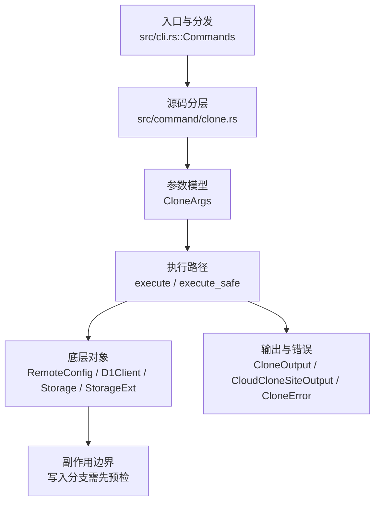

# `libra clone` 开发设计

## 命令实现目标

`libra clone` 的目标是从本地、SSH、HTTPS 或 Libra cloud 来源创建新仓库，并初始化对象、refs、配置和工作区。当前实现覆盖 Git 远程浅克隆（`--depth`；本地 Libra 源 fail-closed，见 P0-03）、单分支克隆（`--single-branch`）、裸仓库（`--bare`）、分支检出（`-b/--branch`）、URL 脱敏和安全边界检查，同时明确子模块与 sparse checkout 的延后决策；origin 命名 `-o`、引用仓库 `--reference`/`--shared`/`--dissociate`、镜像 `--mirror`、以及局部克隆过滤 `--filter` 与浅历史 `--shallow-since`/`--shallow-exclude`（接受式 no-op，见下）均已处理。

## 对比 Git 与兼容性

- 兼容级别：`partial`。`--depth` 对能协商 shallow boundary 的 Git 远程 supported；本地 Libra 源不能声明 shallow boundary，`clone --depth` 经 fetch 层在对象传输前返回 `LBR-REPO-002`、不创建 broken target（PD-06 决策维持 fail-closed 为终态，见 _compatibility.md D20）。`--single-branch`/`--no-single-branch`（toggle，`--no-single-branch` 撤销 `--single-branch`，last-wins，默认克隆所有分支故单独为 no-op）、`--no-checkout`（克隆后不检出 HEAD 到工作区，仍设置 objects/refs/HEAD）、`-o`/`--origin <NAME>`（标准克隆用 NAME 命名远端及 `refs/remotes/<NAME>/*`，取代默认 `origin`；libra+cloud 克隆仍用 `origin`）supported; `--sparse` unsupported (see [docs/development/commands/_compatibility.md#d10-clone---sparse-与顶层-sparse-checkout-命令](docs/development/commands/_compatibility.md#d10-clone---sparse-与顶层-sparse-checkout-命令)); `--recurse-submodules` unsupported (see [docs/development/commands/_compatibility.md#d4-clone---recurse-submodules](docs/development/commands/_compatibility.md#d4-clone---recurse-submodules))

- 当前矩阵明确仍是部分兼容；未覆盖的 Git surface 必须显式列在“还未实现的功能”。

## 设计方案

- 入口与分发：已公开接入 `src/cli.rs::Commands`；已由 `src/command/mod.rs` 导出。CLI 层在 `src/cli.rs` 把解析后的参数交给命令模块，命令模块负责把领域错误转换为 `CliError` / `CliResult`。
- 源码分层：主要实现文件为 `src/command/clone.rs`。参数/子命令类型包括：`CloneArgs`；输出、错误或状态类型包括：`CloneOutput`、`CloudCloneSiteOutput`、`CloneError`；主要执行函数包括：`execute`、`execute_safe`。
- 源码意图：源码模块注释说明该命令会解析 URL、通过协议客户端获取对象、检出工作树，并写入初始 refs/config；执行层生成 `CloneOutput`，渲染层按 `OutputConfig` 输出。
- 执行路径：`execute_safe` 负责 CLI 安全包装、错误映射和输出配置；对象路径会解析 revision 并读写 blob/tree/commit/tag 等对象；引用路径会读取或更新 SQLite refs、HEAD 与 reflog；网络路径会解析 remote 配置、协商协议并处理 pack/idx 数据；数据库路径会通过 SeaORM/SQLite 或 D1 客户端持久化元数据。

- 流程图：以下流程图按当前源码分层展示主路径和底层对象边界，便于维护者把代码入口、执行函数和副作用范围对应起来。

- 底层操作对象：`RemoteConfig`（remote URL、refspec 和凭据配置）；pack / idx 对象（传输包、索引、delta 和完整性校验）；`D1Client`（Cloudflare D1 元数据读写）；`Storage` / `StorageExt`（对象存储抽象，覆盖本地、remote 和 publish 存储）；SeaORM / `.libra/libra.db`（配置、refs、reflog、AI/发布元数据等 SQLite 表）；`Branch` / branch store（SQLite refs 上的分支读写、过滤和上游关系）；`Head`（SQLite 中的 HEAD 指向、当前分支和 detached 状态）；`Tree`（由索引或对象遍历生成的目录树对象）；`Commit`（提交对象、父提交关系和提交消息载荷）；`Blob`（文件内容或 LFS pointer 写入对象库后的 blob 对象）；`TreeItem` / `TreeItemMode`（tree 中的路径项和 mode）；`ReflogContext` / `with_reflog`（SQLite reflog 写入和动作记录）
- 输出与错误契约：人类输出、`--json` / `--machine` 输出和 quiet/verbose 分支必须继续走现有 `OutputConfig` / `emit_json_data` / `CliError` 路径；新增失败模式要补稳定错误码、用户提示和回归测试。
- 配置 schema 保护（MIG-04，更新 P0-12 的 CLI preflight 描述）：dispatch 前通过 `utils::client_storage::inspect_configuration_schema_issues` 只读检查 GlobalConfig 与 SystemConfig 的角色化元数据。当前 manifest 已知的 Repository-only receipt 不造成配置 future；真正配置 future 或未注册／名称不匹配的 receipt 在命令需要该作用域时以 `LBR-CONFIG-001`（category `config`，exit 128）fail-closed。完整 process/repo-local storage 配置可使 GlobalConfig 不再必需（`cloud` 还需满足 D1 配置），但不能豁免 SystemConfig 问题。`--offline` 或 `LIBRA_READ_POLICY=offline|local` 仅用于明确的本地对象访问，warning 一次，不授权远端同步。诊断保留二进制路径／版本、配置 DB 路径、当前／支持版本和升级命令，并标明 scope/ledger/reason，不输出配置值、未信任 receipt 名称或 `vault.env.*` secret。回归测试：`compat_global_config_schema_future`。完整契约见 [config 设计](config.md)、[role map](../internal/database-migration-scope.md) 与[用户 clone 文档](../../commands/clone.md)；旧 Global helper 仍用于既有 cascade 路径，不代表 CLI preflight 仍是 Global-only。
- 副作用边界：凡是写入索引、对象库、refs/HEAD、reflog、SQLite/D1、工作树或远端的路径，都必须先完成参数校验和 dry-run/预检分支，再执行持久化，避免部分写入后静默成功。

## 实现历史

- 本节依据本地 main 分支提交历史重写，筛选与该命令实现、测试或文档路径直接相关的提交；以下是归纳后的实现脉络。
- 2026-01-25 `3703bfab`（`feat(clone): add --depth parameter for shallow clone (#165)`）：基础实现节点：add --depth parameter for shallow clone (#165)；当前实现的主要轮廓可追溯到该提交。
- 2026-06-04 `98e5f47b`（`feat(clone): atomic remote/branch config write and credential redaction`）：功能演进：atomic remote/branch config write and credential redaction；该节点扩展了当前命令可用的参数或行为。
- 2026-06-04 `d03e2902`（`feat(clone): add --filter partial clone with promisor config`）：该提交曾引入**真正的** `--filter` partial clone 与 promisor 配置，但随后被回退。**当前 `CloneArgs` 重新加入了 `filter` 字段，但作为接受式 no-op**（libra 无 partial-clone/promisor 支持 → 忽略 + 告警、不应用该优化、仅按 `--depth` 限定；云端拒绝），而非真正的 partial clone；clone.rs 仍无 promisor 逻辑。详见下方“还未实现的功能”缺口表中 `--filter`/`--shallow-since`/`--shallow-exclude` 的 ✅ no-op 行。
- 2026-06-07 `38e31be2`（`fix(clone): close compatibility plan gaps`）：实现修正：close compatibility plan gaps；该节点把边界行为、错误处理或兼容差异纳入当前实现约束。
- 2026-07-09 P0-03：`clone --depth` 指向本地 Libra 源时 fail-closed（`fetch::FetchError::UnsupportedShallowLocalLibra` → `LBR-REPO-002`），避免本地源按 depth 截断 commit 但不写 `.libra/shallow` 造成缺父提交仓库；测试 `compat_clone_shallow_integrity::clone_depth_from_local_libra_source_fails_without_broken_target`。
- 历史结论：当前文档应以这些提交之后的代码、测试和兼容矩阵为准；更早的迁移式文档只保留为背景，不再作为事实来源。

## 当前状态

- 公开状态：已公开；模块状态：已导出。
- 用户文档：`docs/commands/clone.md`。
- Synopsis：`libra clone [OPTIONS] <REMOTE_REPO> [LOCAL_PATH]`。
- 公开参数/子命令包括：`<REMOTE_REPO>` (required)、`[LOCAL_PATH]`、`-b, --branch <BRANCH>`、`--single-branch`、`--no-single-branch`、`--bare`、`-l, --local`、`--no-local`、`--depth <N>`、`--reject-shallow`、`--reference <repo>`、`--reference-if-able <repo>`、`--shared`/`-s`、`--dissociate`、`--mirror`、`--filter <spec>`、`--shallow-since <date>`、`--shallow-exclude <rev>`、`--tags`/`--no-tags`、`--no-progress`、`--no-checkout`、`-o, --origin <NAME>`（其中 `--reference`/`--reference-if-able`/`--shared`/`--dissociate` 为对象-alternates no-op、`--filter`/`--shallow-since`/`--shallow-exclude` 为 fetch-优化 no-op、`--mirror` 见缺口表 ✅ 行，详见各自“还未实现的功能”说明）。`-o`/`--origin` 在标准路径用 `remote_name` 命名远端（`RemoteConfig.name`），经 `setup_repository` 传导到 `refs/remotes/<name>/*`、`branch.<b>.remote`、`remote.<name>.url` 与 `tagOpt`；cloud 路径固定 `origin`。`--no-checkout` 把普通路径 `setup_repository` 的 `checkout_worktree` 设为 `!args.bare && !args.no_checkout`（并同步抑制 “Checking out working copy” 消息），cloud-publish 路径把工作区 `restore` 块包进 `if !args.no_checkout`；objects/refs/HEAD 仍设置，仅跳过工作区检出。`--no-progress` 经 `fetch::apply_no_progress` 把传给 clone fetch（`fetch::fetch_repository_with_result`）的 child output 的 `progress` 强制为 `ProgressMode::None`，抑制 “Receiving objects” 进度条，对齐 `git clone --no-progress`。CloneArgs 无 `Default` 派生，故 `no_progress: false`/`no_single_branch: false` 被加入全部 full-literal 构造点（src + test）。`--no-single-branch`（经 clap `overrides_with` 与 `--single-branch` 互为最后一个生效；读 `single_branch` 字段，`no_single_branch` 不直接读取）选择克隆所有分支，撤销先前的 `--single-branch`；默认即所有分支故单独为 no-op。

## 还未实现的功能

| 类别 | 未完成项 | 当前处理 |
|---|---|---|
| 兼容矩阵说明 | `--depth` 仅对 Git shallow 协商路径支持，本地 Libra 源 fail-closed (`LBR-REPO-002`)；`--single-branch`/`--no-single-branch`(toggle) 支持; `--sparse` 不支持 (see [docs/development/commands/_compatibility.md#d10-clone---sparse-与顶层-sparse-checkout-命令](docs/development/commands/_compatibility.md#d10-clone---sparse-与顶层-sparse-checkout-命令)); `--recurse-submodules` 不支持 (see [docs/development/commands/_compatibility.md#d4-clone---recurse-submodules](docs/development/commands/_compatibility.md#d4-clone---recurse-submodules)) | P0-03 测试 `compat_clone_shallow_integrity` 固定本地 Libra 浅克隆不得留下 broken target；实现状态变化时同步 `_compatibility.md` 和测试证据。 |
| ✅ 已实现 | `objects_fetched` / `bytes_received` JSON 字段 | clone 改为调用 `fetch::fetch_repository_with_result` 捕获 `FetchRepositoryResult`（新增 `bytes_received` = fetch pack 字节数，`objects_fetched` = `pack_object_count`），写入 `CloneOutput.objects_fetched`/`bytes_received`（`Option<usize>`，`skip_serializing_if=Option::is_none`）。Git 源为 `Some(...)`；`libra+cloud://`（从 R2 下载索引对象而非 pack 流）为 `None`（省略）。带回归测试 `test_clone_json_reports_fetch_transfer_counts`。 |
| 功能缺口 | sparse is intentionally 不支持 | 后续实现时需要同步源码、测试和兼容矩阵。 |
| 功能缺口 | `--sparse` 未实现（不在 `CloneArgs` 中）；audit-driven decision is to keep --sparse 延后 | 后续实现时需要同步源码、测试和兼容矩阵。 |
| 功能缺口 | recurse-submodules is intentionally 不支持 | 后续实现时需要同步源码、测试和兼容矩阵。 |
| 功能缺口 | `--recurse-submodules` 未实现（不在 `CloneArgs` 中）；不支持，详见 [docs/development/commands/_compatibility.md#d4-clone---recurse-submodules](docs/development/commands/_compatibility.md#d4-clone---recurse-submodules) | 后续实现时需要同步源码、测试和兼容矩阵。 |
| ✅ 已实现 | `--no-checkout`（克隆后不检出工作区） | `CloneArgs.no_checkout`；普通路径把 `setup_repository` 的 `checkout_worktree` 从 `!args.bare` 改为 `!args.bare && !args.no_checkout`，cloud-publish 路径把 `restore` 检出块包进 `if !args.no_checkout`。objects/refs/HEAD 仍设置，仅跳过工作区 restore。带集成测试（`no_checkout_skips_working_tree`，本地克隆 + 正常克隆对照）。 |
| ✅ 已实现 | `--deps-of <path>` / `--deps-depth-limit <N>`（依赖过滤克隆，lore.md 3.2，intentionally-different） | `CloneArgs.deps_of: Vec<String>` / `deps_depth_limit: Option<usize>`（`--deps-of` `conflicts_with_all=[no_checkout,bare,mirror]`，`--deps-depth-limit requires=deps_of`；cloud 路径在 `validate_cloud_clone_option_compatibility` 硬拒）。全量 commit-safe checkout **之后**由 `apply_deps_of_view` 处理：fetch 隐含 `--notes`（`!args.deps_of.is_empty()` 传入 `fetch_repository_with_result`）导入 `refs/notes/deps`，`DependencyStore::transitive_closure(HEAD, roots, Forward, depth)` 算前向闭包，经 `sparse_include_pattern`（锚定 `/` + 转义 `\*?[]`）转成 include pattern 后 `SparseViewStore::replace` 设 sparse VIEW，并记 `remote.<name>.fetchNotesDeps=true`。**对象绝不 wire 过滤、全树在盘**（磁盘收窄延后 D18）；仅本地 Libra 源能旅行图（否则不设窄 VIEW、发响亮 warning，D17）；空图 absence-tolerant（VIEW=roots-only + warning，exit 0）。带集成测试（`clone_deps_of_scopes_view_but_keeps_commit_safe_full_checkout` 含改-add-commit 断言 out-of-closure 文件存活 + 元字符名 `a[1].txt` 证锚定转义、`clone_deps_of_depth_limit_*`、`clone_deps_of_empty_graph_*`、`clone_deps_of_is_rejected_for_cloud_sources`、`clone_deps_of_conflicts_with_no_checkout_and_bare`）。 |
| ✅ 已实现 | `-o`/`--origin <NAME>`（命名远端而非 `origin`） | `CloneArgs.origin: Option<String>`；标准路径用 `remote_name = args.origin.unwrap_or("origin")` 构造 `RemoteConfig.name`，`setup_repository` 据此写 `refs/remotes/<name>/*`、`branch.<b>.remote`、`remote.<name>.url`；`--no-tags` 的 `remote.<name>.tagOpt` 也用该名。libra+cloud 路径的 `cloud.origin.*` 为固定 schema，仍用 `origin`（已在 help 与文档说明）。带集成测试（`origin_flag_names_the_remote`）。 |
| ✅ 已实现 | `-l`/`--local` 与 `--no-local` | 接受式 no-op（`CloneArgs.local`/`no_local`，`overrides_with` 互斥、last-wins，无 execute 逻辑）：git `--local` 请求本地优化（复制/硬链接代替传输）、`--no-local` 强制走传输避免硬链接。libra **从不硬链接**（始终复制），且读取本地源的方式由源类型决定（本地 Libra 源直接读对象，本地 Git 源经 `LocalClient` **进程内**读取其 refs 与对象，不依赖系统 `git-upload-pack`）而非这两个 flag，故均按 no-op 接受、不影响结果。本地源 clone 用任一形式均成功（带集成测试 `test_clone_local_flag_accepted_for_local_source`）。 |
| ✅ 已实现 | `--reject-shallow` | 拒绝未经请求即变浅的克隆（即源仓库为浅克隆），对齐 `git clone --reject-shallow`。fetch 后在新仓库 cwd 下读 `.libra/shallow`，纯判定 `clone_should_reject_shallow(reject, is_shallow, depth) = reject && is_shallow && depth.is_none()`；命中则恢复 cwd 后返回 `CloneError::RejectShallow`（exit 128），由既有 `cleanup_failed_clone` 删除半成品。**相对 Git 收窄**：Git 拒绝浅 SOURCE 与 `--depth` 无关，但 libra 无协议信号区分源浅与 `--depth` 浅（都只留 `.libra/shallow`），故对支持 shallow 协商的远程，带 `--depth` 时不触发 post-fetch reject。P0-03 另行收紧本地 Libra 源：该源根本不能声明 shallow boundary，`--depth` 在对象传输前返回 `LBR-REPO-002`，不进入上述 post-fetch 判断。带纯单元测试（判定四组合）+ 集成测试（正常源放行、本地 Libra `--depth` fail-closed）。 |
| ✅ 已实现 | `--reference <repo>`/`--reference-if-able <repo>`/`--shared`/`-s`/`--dissociate` | 对象 alternates 族：Libra 无 alternates、总是把每个对象拷贝进克隆，故克隆天然自包含。均按 no-op 接受（`object_alternates_warning`）：`--reference`/`--shared` 追加一条说明性 warning（进 `CloneOutput.warnings`，human+JSON），`--reference-if-able`（Git 的优雅降级语义：引用不可用即忽略）与 `--dissociate`（已自包含，无可 dissociate）静默。`--reference`/`--reference-if-able` 为 `Vec<String>`（可多次）。带回归测试 `test_clone_object_alternates_flags_are_noops`。 |
| ✅ 已实现（收窄） | `--mirror` | 隐含 `--bare`（`execute_safe` 入口设 `args.bare=true`）。fetch 后经 `normalize_mirror_refs`：把每个 remote-tracking 分支提升为 verbatim 本地 `refs/heads/<name>`（剥离 `refs/remotes/<remote>/` 前缀）、删除 tracking 命名空间、写 `remote.<remote>.mirror=true` 标记；tags（`refs/tags/*`）原样保留。**两点收窄 vs Git**：(1) Git 原样镜像 `refs/*:refs/*`，但 libra 只镜像其 fetch 传输的内容（每个 tracking ref 提升为 `refs/heads/*`）；`refs/notes/*` 等未 fetch 的命名空间不镜像。fetch 把 `refs/heads/mr/*` 与 `refs/mr/*` 折叠进同一 tracking 命名空间、出处丢失，故不过滤（过滤会静默丢掉真实的 `mr/*` 分支），这类 ref 一律镜像为 `refs/heads/mr/*`；(2) 不写 `+refs/*:refs/*` refspec（libra fetch 不会honor，写了会误导），`mirror=true` 仅为标记，`libra fetch` 尚不感知镜像。`libra+cloud://` 拒绝（`validate_cloud_clone_option_compatibility` 在 `--bare` 前先查 `--mirror`）。带 `test_clone_mirror_maps_all_refs_and_sets_config` + cloud 拒绝单测。注：默认分支/HEAD 选择沿用 clone 既有行为（pre-existing）。 |
| ✅ 已实现（接受式 no-op） | `--filter <spec>`、`--shallow-since <date>`、`--shallow-exclude <rev>` | 这些是 libra 缺失的 fetch 优化（partial-clone/promisor、deepen-since/deepen-not）。对 Git 远程：按 no-op 接受、忽略该优化（克隆仍取回这些 flag 本会裁剪的内容，仅在同时给出 `--depth` 时按 `--depth` 限定；不带 `--depth` 即完整克隆——被过滤/浅克隆结果的正确超集），每个给出的 flag 经 `unsupported_fetch_optimization_warnings` 追加一条 warning（进 `CloneOutput.warnings`，human+JSON）——与 Git 在服务器不支持 `--filter` 时告警回退到完整克隆一致。`--filter`/`--shallow-since` 为 `Option<String>`，`--shallow-exclude` 为 `Vec<String>`（可多次）。对 `libra+cloud://`：与 `--depth` 一样**拒绝**（`validate_cloud_clone_option_compatibility`，云恢复必须下载完整对象集）。带集成测试 `test_clone_unsupported_fetch_optimizations_warn_and_full_clone` + 3 个 cloud 拒绝单测。 |
| 兼容差异项 | Malformed URL or 不支持 scheme | 原始对照：LBR-CLI-003；相关参数/替代：129；当前说明："check the clone URL or scheme"。 后续实现时需要补对应回归测试并同步兼容矩阵。 |

## 维护要求

- 改进本命令前，必须先阅读并遵循 [docs/development/commands/_general.md](_general.md)；这是命令设计、实现、测试和文档同步的强制要求。
- 任何行为变更都要先核对实现源码，再同步 `COMPATIBILITY.md`、`docs/commands/<cmd>.md` 和相关测试。
- 新增 Git 兼容参数时必须明确 tier、错误码、JSON/机器输出契约和回归测试。

## pkt-line boundary classification

The `clone` boundary maps detected pkt-line errors to `LBR-NET-002`, including
empty HTTP(S) discovery advertisements. Match `GitError::NetworkError(detail)`
using the shared `PKT_LINE_PROTOCOL_ERROR_PREFIX` on the raw detail, before
timeout or host-key heuristics. Object-transfer IO carriers, plus the
clone/ls-remote/pull discovery IO carriers, use `fetch::is_pkt_line_io_error`,
which compares a bounded Display prefix without allocating a second complete
message. Marker matching itself is O(prefix length); normal user-message
formatting still costs O(message length). Never classify using a formatted outer
error, a remote URL, case folding, trimming, or a substring search.

The same protocol classification and hint apply during object transfer, including
a truncated pkt-line header or payload. An ordinary IO failure without a pkt-line marker during discovery
remains `LBR-IO-001`; host-key diagnostic handling is described in the SSH section below.

Marker discovery/transfer-setup errors use the exact `check that the remote serves Git data and that a proxy has not altered the response`
hint. Non-marker network failures retain `LBR-NET-001`; clone discovery's ordinary
IO errors retain `LBR-IO-001`. Authentication, local metadata errors and existing
non-marker host-key handling follows the SSH section below. Other untyped discovery parsing
errors retain existing classification (DEFER-04); this change does not complete
strict async header validation or the later Git/SSH reader work.

The default tests exercise all command conversions with raw carriers and parser
errors, preserve the fetch PacketRead no-hint contract, and prove empty
advertisements reach all four actual command handlers. The clone transfer case
checks both discovery requests and a POST containing the advertised wanted OID.
Its local HTTP fixture runs the production HttpsClient path; it does not exercise
TLS negotiation or certificate validation.

Pack completeness is separate from pkt-line framing: an incomplete pack ending
at a clean frame boundary keeps clone's existing `LBR-NET-001` transfer error and
network retry hint. Fetch and pull report that completeness failure as `LBR-NET-002`.

The prefix sink avoids allocating a full Display output itself; the Display
implementation (including OS-error formatting) or earlier diagnostic redaction
may still allocate. The two HTTP fixtures use a two-worker Tokio runtime so
synchronous configuration lookup does not stop the cached pool and server.

## Git and SSH advertisement frame boundaries

The Git/SSH pkt-line advertisement readers reject declared lengths `0001` through
`0003`, incomplete four-byte headers, and EOF inside a declared payload. Flush
`0000`, empty-payload `0004` and maximum-size `ffff` frames retain their behavior.
Their typed pkt-line errors classify as `LBR-NET-002` at the reader boundary;
ordinary transport IO and idle timeouts remain `LBR-NET-001` when classified.

During the `git://` object-fetch advertisement, fetch, clone and pull already
report these failures as `LBR-NET-002`, including a zero-byte advertisement. The
hint is `check that the remote serves Git data and that a proxy has not altered the response`.
Lengths 1–3 previously could panic; truncated advertisements previously returned
`LBR-NET-001` with a network/transfer hint. Git discovery can still report `LBR-NET-001`. SSH advertisement propagation
and bounded cleanup are described below; complete ASCII-hex header validation
remains separate work.

This advertisement is distinct from an upload-pack response after negotiation:
HTTP(S) framing and empty upload-pack response classifications are unchanged.
Tests exercise real local TCP object-fetch advertisement reads and the public
fetch/clone/pull error conversions, without claiming full command execution or
bounded SSH cleanup. Check the remote Git service or proxy for malformed frames.

The shared `pkt_frame_payload_len` is called before allocating a non-flush payload.
`pkt_line_read_error` maps `UnexpectedEof` at the exact header/payload read into
`InvalidData` with a downcastable `PktLineError`; ordinary IO keeps its cause.
SSH retains its existing ordinary-read context. No duplicate frame-reason enum is
introduced. The private loops accept `AsyncRead + Unpin`; concrete TCP/child-stdout
callers remain unchanged. Only cfg(test) module helpers expose the reader to the
cross-client tests. No production visibility is broadened for tests.

The ten named PKT-08 gates cover both clients' invalid lower bounds, flush, empty
payload and upper bound plus paired payload/header EOF cases. The latter also pin
ordinary reset/idle-timeout classification. They execute the actual reader loop
with deterministic AsyncRead inputs, including a pending duplex stream for idle
timeout, and inspect the typed source before the public CliError conversion.
The invalid-length and two EOF gates also run actual local TCP GitClient::fetch_objects
advertisement reads, verify the service request and typed source, and convert each
result through public fetch/clone/pull errors. These are transport-plus-conversion
tests, not complete command or SSH-process tests. Header ASCII-hex checks and the
remaining Git discovery wrapper propagation are separate later work. The new per-frame
checks are O(1); existing advertisement collection still scales with input size.

## SSH advertisement error handling

SSH advertisement lengths `0001` through `0003`, incomplete headers (including
zero-byte EOF), and truncated payloads return `LBR-NET-002`. The fixed protocol
reason and marker are retained without captured SSH stdout/stderr.

An incomplete required header has one host-trust exception: local SSH exit status
255 together with a recognized host-key diagnostic in the first 64 KiB of stderr
returns fixed host-verification guidance and `LBR-NET-001`. This classification
does not verify the remote fingerprint. Other missing advertisements, including
authentication failures, still use `LBR-NET-002`; an available non-zero local exit
status adds `SSH exited with status N` and fixed connectivity, trusted-host,
ssh-agent and repository-access guidance. Original SSH diagnostic text is hidden.

After an incomplete required header, Libra allows up to 100 milliseconds to
observe the SSH exit status, then requests termination if needed. Other read
errors request termination immediately. The status window, direct-child reap and
output collection share a two-second cleanup deadline. Protocol and typed
host-trust errors take precedence over secondary cleanup warnings. Ordinary IO
and timeout errors keep their transport classification and may include a fixed
local cleanup warning. Termination can change the observed exit status. This
does not promise cleanup of arbitrary descendant processes.

Clone places targeted host-verification guidance in its structured hints. The
other command boundaries retain fixed host guidance in the message and their
existing `LBR-NET-001` network hint. Human, JSON and machine diagnostics omit raw
captured remote stderr in either case.

The `git://` object-fetch path already classifies the listed frame errors as
`LBR-NET-002`; Git discovery and non-ASCII/non-hex async header classifications
remain separate work. HTTP(S) framing behavior is unchanged.

## SSH authentication and captured diagnostics

Libra invokes SSH with `BatchMode=yes` for both terminal and non-terminal callers.
It does not prompt for a private-key passphrase or an interactive host-key
decision during a Libra command. Load or unlock an encrypted key in `ssh-agent`
before retrying. For host trust, verify the fingerprint through a trusted
provider console or another trusted channel before manually updating
`~/.ssh/known_hosts`. Alternatively, make a separate interactive SSH connection
and compare the displayed fingerprint before accepting it. For example,
`ssh -T git@github.com` uses GitHub; use the actual repository SSH user, host and
port. Do not accept a fingerprint that has not been verified.

`ssh.strictHostKeyChecking` retains its existing `ask`, `yes`, `accept-new` and
`no` values. `ask` leaves that SSH option to the user's SSH configuration;
`BatchMode=yes` still prevents interactive decisions. Explicit values are
forwarded to SSH. Choose a host-trust policy appropriate to your repository.

SSH stderr is always captured, including in terminal sessions. It is drained
from process startup, retaining at most 64 KiB while counting and hashing the
remaining bytes. User-facing errors contain fixed text and a local exit status
when available. Raw remote stderr is neither printed nor logged. Debug diagnostics
contain only the status, total and retained byte counts, and a SHA-256 digest of
the collected stream. Failed or cancelled collection may prevent these metadata
from being reported; no completed digest is claimed in that case. Hashing work
is proportional to the number of bytes drained.

SSH reference advertisements and receive-pack responses each have a 16 MiB
aggregate limit. An oversized advertisement fails with `LBR-NET-001` and guidance
to use the repository’s HTTPS URL if available, or ask its maintainer to reduce refs. An oversized push response fails with `LBR-NET-001`
and guidance to push fewer refs; it is not accepted as a truncated success.
These limits can affect repositories with very large ref sets or updates. The
streamed fetch pack is not subject to this cap. A failed push response does not
prove that the server rolled back its refs: inspect the remote state before
retrying. Existing IO timeouts still apply.

After a complete discovery advertisement, Libra allows up to 100 milliseconds
for SSH to exit before requesting termination, within a two-second total
cleanup deadline. Captured-output tasks are cancelled when their owner exits or
their deadline expires, including when a descendant keeps a pipe open.

## SSH capture validation scope

The twelve named PKT-11 library gates retain the original plan names. They cover
fixed diagnostics and metadata-only tracing, both service argument lists, three
non-zero-exit paths, malformed-advertisement cleanup and all six capture paths
under stderr floods. The flood gate also covers retained-prefix/full-stream
digest accounting, collector cancellation, and oversized advertisement and push
response rejection. The host-trust gate covers native exit 255, typed primary
error preservation through a secondary cleanup warning, the internal discovery
carrier and an actual local fake-SSH clone command. Existing fetch/push CLI cases
retain their names and test human, JSON and machine output plus remote-ref safety.
The terminal gate uses a real local PTY. The passphrase gate creates an encrypted
local key without an agent and exercises a simulated SSH failure; it does not
claim live OpenSSH network authentication. Actual run IDs and results belong in
plan-20260901.md after execution; the existence of these tests is not acceptance.

### SSH host identity and diagnostic collection

SSH host identity changes retain a distinct fixed warning: the change may
indicate interception or legitimate key rotation. Verify the new fingerprint
through a trusted channel before replacing an existing known_hosts entry; do not
bypass host-key checking. Unknown and changed host keys both use LBR-NET-001,
but their fixed messages and guidance differ.

A stderr collection timeout does not by itself discard complete protocol output
and an observed local exit status. Non-zero exit status and primary read errors
still fail the operation. Unavailable diagnostics produce only a fixed debug
notice, without fabricated empty-stream counts or digests. Stdout collection or
process-wait failures retain their normal error handling.

### SSH limits and host-classification boundaries

These fixed 16 MiB advertisement and receive-pack response limits apply only to
Libra's SSH transport. The HTTPS and Git transports do not impose this particular
cap. If the server provides an HTTPS endpoint, use its HTTPS remote URL when an
SSH advertisement exceeds the cap; this does not require a read-only user to
change the server's refs. Otherwise, ask the repository maintainer to reduce the
advertised ref set. The streamed fetch pack remains outside this aggregate cap.

Host-trust classification requires an incomplete first header with no stdout
bytes observed, local exit 255 and a recognized retained stderr pattern. Once
any stdout byte arrives, including a partial header, host-like stderr cannot
select host-specific guidance. Failures after a complete advertisement retain
fixed generic diagnostics. The pre-advertisement pattern remains a diagnostic
heuristic, not fingerprint verification.

A successful discovery whose child waits for a request normally incurs the full
100 ms native-exit observation window, once per discovery operation. This is
separate from the two-second direct-child cleanup budget; no benchmark or
arbitrary-descendant cleanup guarantee is implied.
