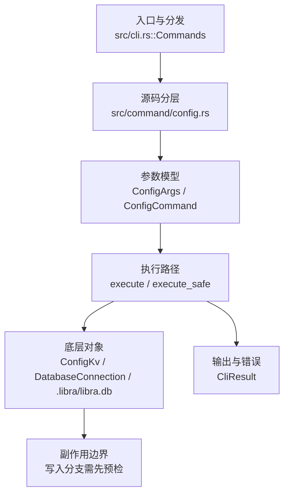

# `libra config` 开发设计

## 命令实现目标

`libra config` 的目标是读取和修改 Libra 配置，覆盖 local/global/system 作用域、多值项、section、类型化输出和机器可读格式。实现需要尊重 SQLite/Vault 存储边界，避免把配置安全性降级为可任意文本编辑，并把 Git 文本配置中的编辑、includeIf 等差异列为兼容缺口（`-z`/`--null` 输出已实现）。

## 对比 Git 与兼容性

- 兼容级别：`partial`。vault-backed local/global config 已支持；section 操作 `--remove-section <name>` / `--rename-section <old> <new>`（事务化，采用 Git 的 section/subsection 身份而非裸前缀——`--remove-section branch` 删除 `branch.<key>` 但不动 `branch.feature.*` 子节）已支持；`-z`/`--null` NUL 分隔输出（get/get-all 输出 `value\0`，`--get-regexp`/`--list` 输出 `key\nvalue\0`，`--name-only` 输出 `key\0`，`--show-origin` 前缀 `origin\0`）已支持；读取与设置时的类型规范化 `--type=<bool|int|path>` 及 `--bool`/`--int`/`--path` 快捷方式（bool 变体→true/false、int 的 k/m/g 1024 倍率、path 的 `~`/`~/` 展开；set 时在存储前校验+规范化，非法值报错不写入）已支持；`--system` 作用域（`/etc/libra/config.db`，可经 `LIBRA_CONFIG_SYSTEM_DB` 覆盖，级联优先级最低；vault 加密密钥与 `import` 在该作用域被拒绝）已支持；editor round-trip 和 includeIf 尚未完整支持。global 作用域路径为 `<XDG_CONFIG_HOME 或 ~/.config>/libra/config.db`（各平台一致，含 macOS；本仓库 2026-09-19 GCX-01），legacy `<home>/.libra/config.db` 在自动迁移版本前仍是活动回退（`migration_pending`），`LIBRA_CONFIG_GLOBAL_DB` 仍是逐字覆写；`config path --json` / `doctor --global-schema` 的 `path_source` 取 `LIBRA_CONFIG_GLOBAL_DB`/`xdg`/`home`/`legacy`，并新增 `legacy_path`/`legacy_exists`/`migration_pending` 字段。

- 裸读 `libra config <key>`（单个位置参数、无值）是**读取**，与 `git config <key>` 一致：`resolve_command_typed` 的兜底分支解析为 `ResolvedCommand::Set { value: None, explicit_set: false }`，`handle_set` 在「无值」分支把普通 key 转 `handle_get`（`reveal=false`），因此多值取末值、级联与 `config get` 同序、加密值渲染 `<REDACTED>`、未设置 key 为 exit 1 + `LBR-CLI-002`；`-z`/`--null` 也经 `ResolvedCommand::Set.null` 透传给 `handle_get`，使 `config -z <key>` 与 `config -z get <key>` 逐字节相同（此前裸读硬编码换行结尾）。**有意差异**：受保护 key（`is_sensitive_key`）保留交互式安全赋值路径而非读取，非交互环境报 protected-key 错误 + exit 2，已登记进 `COMPATIBILITY.md` 的 config 行。`has_encrypted`（该 key 已存有密文）**只在显式赋值**（`config set <key>` / `--add`，即 `explicit_set=true`）时才推断为赋值意图——否则一个普通 key 一旦存了密文就再也读不出来，只会报「missing value for protected key」。回归：`tests/command/config_test.rs` 的 13 个 `config_bare_read_*`（含 `config_bare_read_encrypted_is_redacted`、`config_bare_read_sensitive_key_never_leaks_value`、pty 驱动的 `config_bare_read_protected_key_interactive_pty`）。

- 当前矩阵承诺常用 Git 行为已支持；新增语义必须同步矩阵、用户文档和测试。

## 设计方案

- Schema 角色与恢复：global/system 配置连接使用 `DatabaseRole::GlobalConfig/SystemConfig` 及独立 configuration ledger，不运行 Repository migration；local 配置仍属于 Repository。`doctor --global-schema` 在 `src/command/config/doctor.rs` 只读诊断，默认 `repair_eligible=false`。配对的 `--repair --confirm <canonical-path>` 由独立 `repair.rs` 处理，仅在已注册 producer-format 指纹、私有 Unix 路径与锁检查通过后执行一致性备份；备份验证后，在同一物理连接的 SQLite 写事务内重验并初始化 configuration ledger，调用唯一 `db::write_configuration_barrier`。不读配置值、不打开 Vault/System/Repository DB；不运行自动升级或 Repository recovery。CLI 的 Repository scope census 保持只读以绕过仓库资源，但明确 repair 的 operation class 是 `LibraStateMutation`，不可把它当作无副作用诊断。
- 恢复契约与验证：完整边界见 [database-migration-scope.md](../internal/database-migration-scope.md) 和[用户 config 文档](../../commands/config.md)。格式 attestation 不证明历史 writer，未知/超长/内嵌 NUL 元数据拒绝；backup、原子事务、WAL、并发拒绝与 secret-free 门归 `compat_global_config_schema_future` / `db_migration_test`；hash-pinned 旧 reader 拒写由 `old_reader_oracle_test` 的显式 opt-in gate 证明。故障门仅在 `test-upgrade` + `LIBRA_TEST=1` 下编译/启用，release 不含 hook；测试仅使用临时 fixture。
- 入口与分发：已公开接入 `src/cli.rs::Commands`；已由 `src/command/mod.rs` 导出。CLI 层在 `src/cli.rs` 把解析后的参数交给命令模块，命令模块负责把领域错误转换为 `CliError` / `CliResult`。
- 源码分层：主要实现文件为 `src/command/config.rs`。参数/子命令类型包括：`ConfigArgs`、`ConfigCommand`；输出、错误或状态类型包括：`ConfigListEntry`、`ConfigImportSummary`、`ConfigSshKeyEntry`、`ConfigGpgKeyEntry`（`--json` 序列化），错误通过 `CliError` / `CliResult` 统一传播；主要执行函数包括：`execute`、`execute_safe`、`execute_inner`、`resolve_command`。
- 执行路径：`execute_safe` 负责 CLI 安全包装、错误映射和输出配置；数据库路径会通过 SeaORM/SQLite 或 D1 客户端持久化元数据。

- 流程图：以下流程图按当前源码分层展示主路径和底层对象边界，便于维护者把代码入口、执行函数和副作用范围对应起来。

- 底层操作对象：`ConfigKv`（配置键值持久化行）；配置层（local/global/system、remote、identity 和运行时设置）；`DatabaseConnection`（SeaORM 数据库连接）；SeaORM / `.libra/libra.db`（配置、refs、reflog、AI/发布元数据等 SQLite 表）；Vault/libvault（身份、密钥或 vault-backed 签名边界）
- 输出与错误契约：人类输出、`--json` / `--machine` 输出和 quiet/verbose 分支必须继续走现有 `OutputConfig` / `emit_json_data` / `CliError` 路径；新增失败模式要补稳定错误码、用户提示和回归测试。
- 副作用边界：凡是写入索引、对象库、refs/HEAD、reflog、SQLite/D1、工作树或远端的路径，都必须先完成参数校验和 dry-run/预检分支，再执行持久化，避免部分写入后静默成功。

## 实现历史
- 2026-09-20（plan issues/470 FM-03）：新增共享读取 `internal::config::core_file_mode()`（大小写不敏感读 `core.fileMode`/`core.filemode`，Unix 默认 true、非法值 fail-closed 并沿用 `commit.verbose` 的 `CliError::command_usage` 映射）；`index_ext::update_preserving_file_mode` 在 `false` 时保留旧条目 mode、新路径 100644；接入 `add`/`commit -a`/`update-index <path>`，`status` 仅做非法值校验。纯解析函数 `resolve_core_file_mode` 带单测。

- 本节依据本地 main 分支提交历史重写，筛选与该命令实现、测试或文档路径直接相关的提交；以下是归纳后的实现脉络。
- 2026-07-15（plan-20260708 P0-12 回归修复）：`internal::config` 的两条级联读取（`read_cascaded_config_value_strict` 与 `global_config_value`）在 global scope 读取失败时，改为先经 `utils::client_storage::inspect_global_config_schema_future_at_path` 做类型化 future-schema 探测：命中则复用 P0-12 的去重警告（`emit_global_config_schema_future_warning`）并把 global scope 视为未设置继续级联；其它失败保持 fail-closed 原样传播（`LBR-IO-001` 契约不变）。此前 P1-05 家族给 `status`/`branch`/`tag`/`merge`/`commit`/`fetch`/`init`/`diff`/`log` 等命令加的配置默认读取会把 schema-newer 的全局库当普通 I/O 失败，破坏 P0-12「本地命令警告一次并继续」的既定行为（回归由 `compat_global_config_schema_future::local_command_warns_once_and_continues` 钉住）。
- 2026-01-07 `a1366d77`（`feat(config): add --global/--local/--system scope support (#108)`）：基础实现节点：add --global/--local/--system scope support (#108)；当前实现的主要轮廓可追溯到该提交。
- 2026-06-03 `05250fe2`（`feat(config): implement git config parity — multi-value, sections, typed values, output flags (v0.17.1277)`）：功能演进：implement git config parity — multi-value, sections, typed values, output flags (v0.17.1277)；该节点扩展了当前命令可用的参数或行为。
- 2026-05-18 `d1f61a92`（`feat(config): expose resolve_env_sync + wire into libra code provider bootstrap`）：功能演进：expose resolve_env_sync + wire into libra code provider bootstrap；该节点扩展了当前命令可用的参数或行为。
- 2026-05-29 `0d7ae4d9`（`fix(config): reject global key generation`）：实现修正：reject global key generation；该节点把边界行为、错误处理或兼容差异纳入当前实现约束。
- 2026-06-02 `ac845f79`（`docs(config): document git config compatibility matrix and decision ledger (v0.17.1276)`）：文档与兼容口径：document git config compatibility matrix and decision ledger (v0.17.1276)；当前文档按该节点之后的实现状态校准。
- 历史结论：当前文档应以这些提交之后的代码、测试和兼容矩阵为准；更早的迁移式文档只保留为背景，不再作为事实来源。

## 当前状态

- 公开状态：已公开；模块状态：已导出。
- 用户文档：`docs/commands/config.md`。
- Synopsis：`libra config [OPTIONS] [key] [value] [COMMAND]`。
- 公开参数/子命令包括：`set`、`get`、`list`、`unset`、`import`、`path`、`edit`、`generate-ssh-key`、`generate-gpg-key`、`--local`、`--global`、`-d, --default <DEFAULT>` 等（另含隐藏 Git 兼容标志 `--get`、`--get-all`、`--unset`、`--unset-all`、`-l, --list`、`--add`、`--import`、`--get-regexp`、`--show-origin`、`--remove-section`、`--rename-section`、`-z`/`--null`、`--type`/`--bool`/`--int`/`--path`）。`--type`/`--bool`/`--int`/`--path`（互斥；`resolve_value_type`）对 get/get-all/get-regexp（读时规范化）与 set（写时校验+规范化，与 git `config --type` 一致：`yes`→`true`、`1k`→`1024`、`~/x`→展开路径；非法值报错且不写入）有效，其它模式报 129。`--remove-section <name>` / `--rename-section <old> <new>` 经 `ScopedConfig::get_connection` + sea-orm 事务执行：先 `begin()`，再在事务内 `get_by_prefix_with_conn` 取候选并用 `key_in_section` 过滤为精确 section 成员（Git section/subsection 身份，非裸前缀），rename 先 `add_with_conn` 到 `new.<name>` 再 `unset_all_with_conn` 旧 key，全部一个事务内提交；空 section 报 “No such section”（exit 128），rename 同名（exit 2）或目标 section 已存在（exit 128，避免合并与加密标志继承）均拒绝。`--system` 已支持：作用域 DB 为 `/etc/libra/config.db`（可经 `LIBRA_CONFIG_SYSTEM_DB` 覆盖），级联优先级最低（`CASCADE_ORDER = [Local, Global, System]`）；`get_config_path`/`ensure_config_exists`/`get_connection`（经 `SYSTEM_CONFIG_CONN` 缓存）镜像 Global 实现，写入通常需提升权限。级联读取在 `path.exists()` 处跳过不存在的系统 DB，且 `should_skip_config_scope_read_error` 对 System 一律跳过（避免不可读的 `/etc/libra/config.db` 破坏所有读取）。vault 加密密钥（`vault.*`/`--encrypt`）在 System 作用域被拒绝（root 拥有的 unseal key 的权限隔离问题）；SSH/GPG key 生成沿用 `reject_global_key_generation`（仅 local）。详见下方缺口表。

## 还未实现的功能

| 类别 | 未完成项 | 当前处理 |
|---|---|---|
| 功能缺口 | 不支持编辑器编辑：Libra 使用 SQLite 存储，不能安全地通过文本编辑器往返修改；详见设计方案。 | 后续实现时需要同步源码、测试和兼容矩阵。 |
| ✅ 已实现 | `--system` 作用域 | 原始对照：git config --system；当前说明：已实现纯配置的系统级作用域 `/etc/libra/config.db`（可经 `LIBRA_CONFIG_SYSTEM_DB` 覆盖），级联优先级最低（`[Local, Global, System]`），镜像 Global 的 path/ensure/connection（`SYSTEM_CONFIG_CONN` 缓存）；纯配置 `get`/`set`/`list`/`unset`/`path` 支持。vault 加密密钥（`vault.*`/`--encrypt`）在该作用域被拒绝（`LBR-CLI-002`，root 拥有的 unseal key 权限隔离问题），且 `import --system` 整体被拒绝（import 会对敏感键自动加密）；`handle_set` 在任何 DB 访问前对 system vault 写入做预检，使被拒写入不会创建 `/etc/libra/config.db`。带集成测试 `test_cli_config_system_read_write`、`test_config_system_scope_roundtrip_and_vault_rejection`、`test_config_cascade_system_is_lowest_precedence`、`test_config_scope_system_errors`（vault + import 拒绝）、`test_config_system_rejected_vault_write_does_not_create_db`。 |
| 兼容差异项 | 编辑器编辑 | 原始对照：git config -e；相关参数/替代：jj config edit；当前说明：不支持 (SQLite 存储)。 后续实现时需要补对应回归测试并同步兼容矩阵。 |
| ✅ 已实现 | 类型转换（读取与设置时） | `--type=<bool\|int\|path>` 与 `--bool`/`--int`/`--path` 快捷方式（`resolve_value_type` + `canonicalize_typed_value`）：bool（yes/true/on/1→`true`，no/false/off/0 与显式空值→`false`，否则报错；不裁剪空白，故 ` true ` 报错）、int（可选 k/m/g 1024 倍率，非整数/含空白报错）、path（`~`/`~/` 展开 home，`~user` 不支持原样返回）。作用于 get/get-all/get-regexp（含 `--default`，读时规范化）**与 set（写时）**：set 路径在 `handle_set` 中于加密前用同一 `canonicalize_typed_value` 校验+规范化 `resolved_value`（非法值报错且不存储），与 git `config --type` 在 set 上的行为一致。applicability 检查移至 `resolve_command` 包装器（resolve 后判定 cmd 是否 Get/Set）；非 get/set 模式仍报 129；未知 `--type` 报 129。与 `-z`/`--json` 组合正常。带集成测试 `test_config_typed_get`（读）与 `test_config_typed_set`（写：bool yes→true、int 1k→1024、path ~/ 展开、非法不存、`--type --unset`→129）。 |
| ✅ 已实现 | NUL 分隔输出 `-z`/`--null` | `ConfigArgs.null`（`global=true`）线程到 `ResolvedCommand::{Get,List}` 与 `handle_get`/`handle_list`：get/get-all → `value\0`；`--get-regexp`/`--list` → `key\nvalue\0`；`--name-only` → `key\0`；`--show-origin` 前缀 `origin\0`。`--json` 优先于 `-z`。`-z` 与 Libra 专有的 `--ssh-keys`/`--gpg-keys`/`--vault` 汇总视图组合时报 `command_usage`（exit 129，无 `key\nvalue\0` 映射），仅作用于标准 key/value 输出。带集成测试 `test_config_null_terminated_output`（精确字节断言）。 |
| ✅ 已实现 | 重命名/删除 section | 采用 Git section/subsection 身份（`key_in_section`：section=首个 `.` 前、name=末个 `.` 后、subsection=两者之间）。`--remove-section <name>` 删除该 section 的 key（`--remove-section branch` 只删 `branch.<key>`，不动 `branch.feature.*`）；`--rename-section <old> <new>` 把 old section 的 key 搬到 new（保留 value 与加密标志，多值顺序由 `get_by_prefix_with_conn` 的 `(Key,Id)` 排序稳定保留，目标 section 已存在则拒绝以避免合并/标志继承）。均在单个 sea-orm 事务内（含存在性检查），空 section→exit 128，rename 同名/目标已存在→exit 2/128。带集成测试 `test_config_remove_and_rename_section`/`test_config_section_ops_exact_git_semantics`/`test_config_rename_section_preserves_multivalue_order`。 |
| 兼容差异项 | 条件配置 | 原始对照：includeIf；相关参数/替代：[[when]] blocks；当前说明：不支持。 后续实现时需要补对应回归测试并同步兼容矩阵。 |
| ✅ 已实现（Libra-only，intentionally-different） | 保留命名空间 `upgrade.*`（plan-20260714 §A.3） | 自动升级配置存储在 `{LIBRA_HOME}/upgrade/settings.json`（`internal::upgrade::settings`，原子写 + Unix 0700/0600 权限；`resolve_libra_home()` 与 install.sh 的 `LIBRA_HOME`/`HOME` 规则一致），绝不落入 SQLite。`execute_inner` 在 `resolve_command` 之后经 `route_upgrade_namespace` 拦截所有可到达该命名空间的拼写：仅允许 `--global` 单值 `set`/`get`/`unset`（`set` 仅接受 `auto`/`manual`/`off` 大小写不敏感；`get` 文件缺失读 `off`、损坏报 `LBR-UPGRADE-001`；`unset` 写 `mode=off` 保留文件）；local/system、`--add`、`--get-all`、`--unset-all`、`--type`、`--encrypt`/`--plaintext`/`--stdin`、`--default`、`--remove-section`/`--rename-section`、多 action 拼写组合（`upgrade_conflicting_action_spelling`）、带空白 key/value、能匹配 `upgrade.mode` 的 `--get-regexp` 模式（`regexp_reaches_upgrade_mode`，与 `get_regexp_with_conn` 同一 `regex::is_match` 语义）一律 fail-closed（用法错误 `LBR-CLI-002`/exit 129；`LBR-UPGRADE-001` 专用于 settings 文件损坏/不可读）。`resolve_libra_home()` 顺序：`LIBRA_HOME` > `LIBRA_CONFIG_GLOBAL_DB` 父目录（仅用于显式隔离场景的测试隔离契约，不再描述默认布局）> `$HOME/.libra`（HOME 缺失时不退回 /tmp，报可操作错误——与 install.sh 有意偏差，见 home.rs 模块文档）。`list`（含 `--show-origin`，origin 为 `file:{path}`）渲染文件条目并抑制 SQLite 中陈旧 `upgrade.*` 行；`--get-regexp` 同样抑制；`import` 跳过保留键并 warning（`ignored_reserved` 计数进 JSON）。升级流程自身经 `effective_mode_for_upgrade()` 宽松读取（损坏视为 `off` + 一次性 warning）。带集成测试 `test_config_upgrade_mode_*`（roundtrip、拒绝矩阵、unset 保留文件、损坏严格报错、list/get-regexp 抑制、import 跳过）与 `internal/upgrade` 单元测试。 |

## 维护要求

- 改进本命令前，必须先阅读并遵循 [docs/development/commands/_general.md](_general.md)；这是命令设计、实现、测试和文档同步的强制要求。
- 任何行为变更都要先核对实现源码，再同步 `COMPATIBILITY.md`、`docs/commands/<cmd>.md` 和相关测试。
- 新增 Git 兼容参数时必须明确 tier、错误码、JSON/机器输出契约和回归测试。

## SSH authentication and captured diagnostics

Libra invokes SSH with `BatchMode=yes` for both terminal and non-terminal callers.
It does not prompt for a private-key passphrase or an interactive host-key
decision during a Libra command. Load or unlock an encrypted key in `ssh-agent`
before retrying. For host trust, verify the fingerprint through a trusted
provider console or another trusted channel before manually updating
`~/.ssh/known_hosts`. Alternatively, make a separate interactive SSH connection
and compare the displayed fingerprint before accepting it. For example,
`ssh -T git@github.com` uses GitHub; use the actual repository SSH user, host and
port. Do not accept a fingerprint that has not been verified.

`ssh.strictHostKeyChecking` retains its existing `ask`, `yes`, `accept-new` and
`no` values. `ask` leaves that SSH option to the user's SSH configuration;
`BatchMode=yes` still prevents interactive decisions. Explicit values are
forwarded to SSH. Choose a host-trust policy appropriate to your repository.

SSH stderr is always captured, including in terminal sessions. It is drained
from process startup, retaining at most 64 KiB while counting and hashing the
remaining bytes. User-facing errors contain fixed text and a local exit status
when available. Raw remote stderr is neither printed nor logged. Debug diagnostics
contain only the status, total and retained byte counts, and a SHA-256 digest of
the collected stream. Failed or cancelled collection may prevent these metadata
from being reported; no completed digest is claimed in that case. Hashing work
is proportional to the number of bytes drained.

SSH reference advertisements and receive-pack responses each have a 16 MiB
aggregate limit. An oversized advertisement fails with `LBR-NET-001` and guidance
to use the repository’s HTTPS URL if available, or ask its maintainer to reduce refs. An oversized push response fails with `LBR-NET-001`
and guidance to push fewer refs; it is not accepted as a truncated success.
These limits can affect repositories with very large ref sets or updates. The
streamed fetch pack is not subject to this cap. A failed push response does not
prove that the server rolled back its refs: inspect the remote state before
retrying. Existing IO timeouts still apply.

After a complete discovery advertisement, Libra allows up to 100 milliseconds
for SSH to exit before requesting termination, within a two-second total
cleanup deadline. Captured-output tasks are cancelled when their owner exits or
their deadline expires, including when a descendant keeps a pipe open.

## SSH capture validation scope

The twelve named PKT-11 library gates retain the original plan names. They cover
fixed diagnostics and metadata-only tracing, both service argument lists, three
non-zero-exit paths, malformed-advertisement cleanup and all six capture paths
under stderr floods. The flood gate also covers retained-prefix/full-stream
digest accounting, collector cancellation, and oversized advertisement and push
response rejection. The host-trust gate covers native exit 255, typed primary
error preservation through a secondary cleanup warning, the internal discovery
carrier and an actual local fake-SSH clone command. Existing fetch/push CLI cases
retain their names and test human, JSON and machine output plus remote-ref safety.
The terminal gate uses a real local PTY. The passphrase gate creates an encrypted
local key without an agent and exercises a simulated SSH failure; it does not
claim live OpenSSH network authentication. Actual run IDs and results belong in
plan-20260901.md after execution; the existence of these tests is not acceptance.

### SSH host identity and diagnostic collection

SSH host identity changes retain a distinct fixed warning: the change may
indicate interception or legitimate key rotation. Verify the new fingerprint
through a trusted channel before replacing an existing known_hosts entry; do not
bypass host-key checking. Unknown and changed host keys both use LBR-NET-001,
but their fixed messages and guidance differ.

A stderr collection timeout does not by itself discard complete protocol output
and an observed local exit status. Non-zero exit status and primary read errors
still fail the operation. Unavailable diagnostics produce only a fixed debug
notice, without fabricated empty-stream counts or digests. Stdout collection or
process-wait failures retain their normal error handling.

### SSH transport configuration awaits the shared database

Transport construction awaits host-key policy, vault key/unseal-key, legacy key and fetch timeout configuration on the caller's Tokio runtime. It must not create a nested runtime and synchronously join it: that can strand the task returning the cached SQLite pool's only connection. Environment/config precedence, best-effort optional values, required vault-entry errors and public CLI options remain unchanged. The existing current-thread host-trust and timeout-precedence tests exercise configuration immediately after database writes, without a test-only yield or extra runtime workers.

### SSH limits and host-classification boundaries

These fixed 16 MiB advertisement and receive-pack response limits apply only to
Libra's SSH transport. The HTTPS and Git transports do not impose this particular
cap. If the server provides an HTTPS endpoint, use its HTTPS remote URL when an
SSH advertisement exceeds the cap; this does not require a read-only user to
change the server's refs. Otherwise, ask the repository maintainer to reduce the
advertised ref set. The streamed fetch pack remains outside this aggregate cap.

Host-trust classification requires an incomplete first header with no stdout
bytes observed, local exit 255 and a recognized retained stderr pattern. Once
any stdout byte arrives, including a partial header, host-like stderr cannot
select host-specific guidance. Failures after a complete advertisement retain
fixed generic diagnostics. The pre-advertisement pattern remains a diagnostic
heuristic, not fingerprint verification.

A successful discovery whose child waits for a request normally incurs the full
100 ms native-exit observation window, once per discovery operation. This is
separate from the two-second direct-child cleanup budget; no benchmark or
arbitrary-descendant cleanup guarantee is implied.
