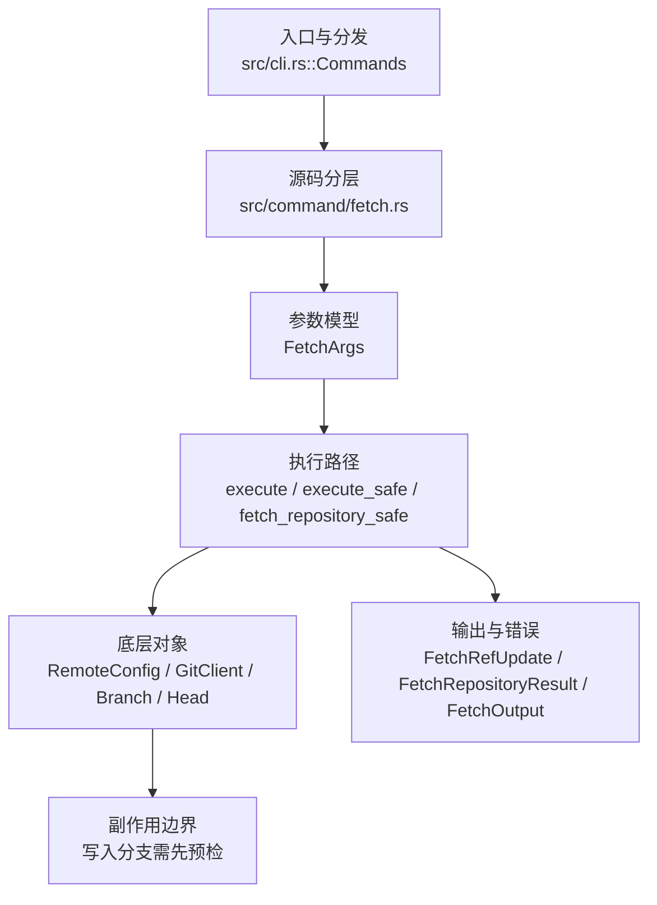

# `libra fetch` 开发设计

## 命令实现目标

`libra fetch` 的目标是从远端下载对象和 refs，并按 refspec、FETCH_HEAD、tag 策略、浅边界和 dry-run/porcelain 规则更新本地状态。实现需要支持 ref 更新原子回滚、prune、force、append 和远端诊断，同时避免网络/pack 流处理出现静默失败；独立的 `--atomic` 选项仍为延后 surface（`--set-upstream`/`--update-head-ok`/`--refmap` 已公开，见下文）。

## 对比 Git 与兼容性

- 兼容级别：`partial`。repository/refspec（短 source、精确 `<src>:<dst>`、单通配符配置映射）与大小写不敏感的 `remote.<name>.fetch`、`--all`、`--depth`（Git shallow 协商路径支持；本地 Libra remote fail-closed，`LBR-REPO-002`）、`--dry-run`、`-v/--verbose`、`--porcelain`、`--tags`/`--no-tags`、`--prune`/`-p`/`--no-prune` 以及 `FETCH_HEAD` 写入与 `--append` 已公开；`--refmap`、`--set-upstream`、`--update-head-ok` 已公开，shallow 扩展参数（`--shallow-since` / `--shallow-exclude` / `--update-shallow`）与 `--atomic` 仍未公开。`--prune`/`-p` 在 fetch 完成后按有效 refspec 展开的 tracking destination（一次性显式 refspec 也保留当前配置映射与普通 advertised 范围）分类并删除非存活的 `refs/remotes/<remote>/*`；删除 + 审计 reflog 在单事务内，失败回滚；`--dry-run` 只预览不写；远端 advertise 空 refs 时跳过；本地分支、tag、`refs/remotes/<remote>/HEAD` 与其它远端不受影响。`--prune`/`--no-prune` 为 last-one-wins toggle，并覆盖 Git 兼容的 `remote.<name>.prune` → `fetch.prune` 配置默认（严格 local→global→system 级联；未配置默认 false，与 Git 出厂一致；无效值 `LBR-CLI-002`、local/global 读取失败 `LBR-IO-001`，均在联网前 fail-closed，`--all` 时先校验所有远程再开始第一个 fetch）。

- 当前矩阵承诺常用 Git 行为已支持；新增语义必须同步矩阵、用户文档和测试。

## 设计方案

- 入口与分发：已公开接入 `src/cli.rs::Commands`；已由 `src/command/mod.rs` 导出。CLI 层在 `src/cli.rs` 把解析后的参数交给命令模块，命令模块负责把领域错误转换为 `CliError` / `CliResult`。
- 源码分层：主要实现文件为 `src/command/fetch.rs`。参数/子命令类型包括：`FetchArgs`；输出、错误或状态类型包括：`FetchRefUpdate`、`FetchRepositoryResult`、`FetchOutput`、`RemoteSpecErrorKind`、`FetchError`；主要执行函数包括：`execute`、`execute_safe`、`fetch_repository_safe`。
- 源码意图：源码模块注释说明该命令负责远端协商、下载 pack、更新 remote-tracking refs，并处理 prune/depth 选项。
- 执行路径：`execute_safe` 负责 CLI 安全包装、错误映射和输出配置；核心领域逻辑集中在 `fetch_repository_safe`；对象路径会解析 revision 并读写 blob/tree/commit/tag 等对象；引用路径会读取或更新 SQLite refs、HEAD 与 reflog；网络路径会解析 remote 配置、协商协议并处理 pack/idx 数据；数据库路径会通过 SeaORM/SQLite 或 D1 客户端持久化元数据。

- 流程图：以下流程图按当前源码分层展示主路径和底层对象边界，便于维护者把代码入口、执行函数和副作用范围对应起来。

- 底层操作对象：`RemoteConfig`（remote URL、refspec 和凭据配置）；`GitClient` / protocol client（Git wire 协议协商）；SSH transport（SSH remote 连接和认证）；HTTPS transport（HTTP(S) remote 连接和认证）；pack / idx 对象（传输包、索引、delta 和完整性校验）；`Branch` / branch store（SQLite refs 上的分支读写、过滤和上游关系）；`Head`（SQLite 中的 HEAD 指向、当前分支和 detached 状态）；`ReflogContext` / `with_reflog`（SQLite reflog 写入和动作记录）；`ObjectHash`（SHA-1/SHA-256 对象 ID 和 revision 解析结果）；`Commit`（提交对象、父提交关系和提交消息载荷）；SeaORM / `.libra/libra.db`（配置、refs、reflog、AI/发布元数据等 SQLite 表）；Vault/libvault（身份、密钥或 vault-backed 签名边界）
- 输出与错误契约：人类输出、`--json` / `--machine` 输出和 quiet/verbose 分支必须继续走现有 `OutputConfig` / `emit_json_data` / `CliError` 路径；新增失败模式要补稳定错误码、用户提示和回归测试。
- 本地 upstream（`branch.<name>.remote=.`）：无参数 `fetch` 在 `get_current_remote` 返回 `.` 时于建立连接 / 写 `FETCH_HEAD` 前零写入拒绝，`LBR-CLI-003` / exit 129，文案指向 issues/480 HP-16（HF-30 / ADR-HF-08 第 4 条）。显式 `libra fetch .` 仍报 `remote '.' not found`。Git 2.54 的 `fetch` 可用，属有意差异（DEFER-08）。
- 配置 schema 保护（MIG-04，更新 P0-12 的 CLI preflight 描述）：dispatch 前通过 `utils::client_storage::inspect_configuration_schema_issues` 只读检查 GlobalConfig 与 SystemConfig 的角色化元数据。当前 manifest 已知的 Repository-only receipt 不造成配置 future；真正配置 future 或未注册／名称不匹配的 receipt 在命令需要该作用域时以 `LBR-CONFIG-001`（category `config`，exit 128）fail-closed。完整 process/repo-local storage 配置可使 GlobalConfig 不再必需（`cloud` 还需满足 D1 配置），但不能豁免 SystemConfig 问题。`--offline` 或 `LIBRA_READ_POLICY=offline|local` 仅用于明确的本地对象访问，warning 一次，不授权远端同步。诊断保留二进制路径／版本、配置 DB 路径、当前／支持版本和升级命令，并标明 scope/ledger/reason，不输出配置值、未信任 receipt 名称或 `vault.env.*` secret。回归测试：`compat_global_config_schema_future`。完整契约见 [config 设计](config.md)、[role map](../internal/database-migration-scope.md) 与[用户 fetch 文档](../../commands/fetch.md)；旧 Global helper 仍用于既有 cascade 路径，不代表 CLI preflight 仍是 Global-only。
- 副作用边界：凡是写入索引、对象库、refs/HEAD、reflog、SQLite/D1、工作树或远端的路径，都必须先完成参数校验和 dry-run/预检分支，再执行持久化，避免部分写入后静默成功。

## 实现历史

- 本节依据本地 main 分支提交历史重写，筛选与该命令实现、测试或文档路径直接相关的提交；以下是归纳后的实现脉络。
- 2026-04-06 `30bed711`（`feat(remote): land batch-5 remote and fetch UX (#341)`）：基础实现节点：land batch-5 remote and fetch UX (#341)；当前实现的主要轮廓可追溯到该提交。
- 2026-06-05 起 `a501ddd` / `2c2ad76` / `10d8744` / `470e275`（`feat(fetch): --dry-run` / `-v,--verbose` / `--porcelain` / `FETCH_HEAD + --append`）：这些本地（不依赖 shallow/tag/prune 子系统）的参数在一次 reconcile 中被误丢。2026-06-18 已在当前（已分叉、回退过的）fetch 代码上重新恢复：`--dry-run`（仅基于发现的 refs 预览 remote-tracking 更新，不下载、不写入）、`-v/--verbose`（stderr 公告远端）、`--porcelain`（拒绝与 `--json` 同用）、`FETCH_HEAD` 写入与 `--append`。
- 2026-06-05 `7d75d886`（`feat(fetch): add --refmap to override fetched-ref destinations`）：历史节点：曾尝试新增 `--refmap`；`FetchArgs` 现已公开该参数（issues/480 HP-03）——仅允许配合命令行 refspec，空值抑制 tracking 更新（FETCH_HEAD only），非空映射替换用于推导跟踪目标的 `remote.<name>.fetch`。
- 2026-06-05 `b005e9ee`（`feat(fetch): add --atomic with rollback pack cleanup`）：历史节点：曾尝试新增 `--atomic`；当前 `FetchArgs` 仍未公开该参数——它依赖回退过的多步事务/pack 回滚基础设施，属于 deferred。
- 2026-06-05 起 `479cd0b` / `916edc2` / `5a05f0f`（`--shallow-since/--shallow-exclude` / `--update-shallow` / `-f,--force`）：历史节点；shallow 扩展仍未公开（依赖回退过的 `ShallowOptions` 浅边界基础设施）；`-f/--force` 与 `--tags`/`--no-tags` 此后均已重新落地（force 见「当前状态」`-f`/`--force` 条目；tags 见 PR-10a）：发现层保留 `refs/tags/*`，`current_have_safe` 把本地 tag（含 annotated peel）纳入 `have` 以避免重复下载，`update_references` 以 `kind=Tag` 落库（create-if-absent，不强制覆盖）。
- 2026-06-07 `b21dc6fd`（`fix(fetch): close compatibility plan gaps`）：实现修正：close compatibility plan gaps；该节点把边界行为、错误处理或兼容差异纳入当前实现约束。
- 2026-07-09 P0-03：`fetch_repository_with_result` 在 remote discovery 后、对象请求前拒绝本地 Libra remote 的 `--depth`（`FetchError::UnsupportedShallowLocalLibra` → `LBR-REPO-002`），因为该路径不能返回 `shallow <oid>` 边界（在此拒绝之前的历史实现会截断 commit walk 产出 broken 仓库；PD-06 决策后维持 fail-closed 为已决终态，见 `_compatibility.md` D20）；测试 `compat_clone_shallow_integrity::fetch_depth_from_local_libra_remote_fails_before_shallow_metadata`。
- 2026-07-11（plan-20260708 P1-05c）：`fetch.prune`/`remote.<name>.prune` 配置默认接入。CLI 意图三态化（`--prune`→Some(true)、`--no-prune`→Some(false)、未给→None），`resolve_prune_mode` 在两个调用点（单远程与 `--all` 循环）于联网前解析生效值；`configured_fetch_prune` 按「远程作用域优先」顺序经 `read_cascaded_config_value_strict` 读取，无效值 `LBR-CLI-002`、读取失败 `LBR-IO-001`。`fetch_repository_with_result` 签名保持 `prune: bool`。同片订正 doc-truth：`--prune` clap help 的「Before fetching」改为「After the fetch」（实现自始为 fetch 后修剪）；用户文档 FETCH_HEAD 补 tag 行形态、JSON schema 补 `forced` 与 `pruned[]` 字段、prune 行补 `refs/mr/*`、「Git ships fetch.prune=true」误导表述改写；zh-CN fetch.md 全量重写至与 EN parity（此前声称 `--prune` 未公开且缺 9 个选项与 4 个章节）。布尔解析用共享 `internal::config::parse_git_config_bool`（`git_config_bool` 语义：true/yes/on 与任意非零整数（含 k/m/g 后缀）为真、false/no/off 与 0 为假、空值按 P1-05 族约定拒绝），并同步接入 merge/commit（`history_config`）与 pull 读取器。回归：`compat_config_defaults_semantics` 新增 7 个 fetch-prune 用例——`fetch_prune_config_removes_stale_tracking_ref_without_cli_flag`、`remote_scoped_prune_config_overrides_fetch_prune`、`remote_scoped_prune_wins_across_scopes`、`fetch_cli_prune_flags_override_configured_prune`、`fetch_prune_accepts_git_numeric_booleans`、`fetch_prune_invalid_config_fails_before_fetch`、`fetch_all_invalid_prune_config_fails_before_any_fetch`——另有 `pull_rebase_accepts_git_numeric_boolean`；`compat_config_history_defaults` 新增 `history_defaults_accept_git_numeric_booleans_and_keep_only`。
- 2026-07-13（plan-20260708 P1-06）：新增 `FetchRefspec`/`FetchRefPlan` 解析与映射层。显式 refspec 只请求并更新指定 source，`<src>:<dst>` 精确写目标；未显式指定时大小写不敏感地读取多值 `remote.<name>.fetch`（支持每侧一个匹配 `*`），没有配置才走所有 heads/mr 的默认 tracking 映射。多目标 ref + reflog + remote HEAD 在同一事务内，非 FF 需 `+`/`--force`，任一 worktree checkout 的本地目标分支拒绝写入；prune 按映射后的 tracking destination 判断存活，完整 fetch 会删除默认 source 已不再映射的 stale remote HEAD；`FETCH_HEAD` 记录全部选中 source（含 up-to-date），普通 fetch 不碰 `ORIG_HEAD`。回归：`compat_fetch_remote_refspec`。
- 历史结论：当前文档应以这些提交之后的代码、测试和兼容矩阵为准；更早的迁移式文档只保留为背景，不再作为事实来源。

## 当前状态

- 公开状态：已公开；模块状态：已导出。
- 用户文档：`docs/commands/fetch.md`。
- Synopsis：`libra fetch [OPTIONS] [<repository> [<refspec>]]`。
- refspec 当前语义（P1-06）：短 source 归一为 `refs/heads/<name>`；显式 `<src>:<dst>` 覆盖配置；无显式 refspec 时大小写不敏感地读取 `remote.<name>.fetch`，支持精确与单通配符映射。目标限于内部可无损表达的 `refs/heads/*` 与 `refs/remotes/<remote>/*`；tag 目标由 `--tags` 管理，其它命名空间 fail-closed。重复的完全相同映射去重，不同 source 竞争同一 destination 时拒绝。`FetchRefUpdate.remote_ref` 是实际本地目标，JSON key-set 不变。
- 公开参数/子命令包括：`[<repository>]`、`[<refspec>]`、`-a, --all`、`--depth <N>`（Git shallow 协商路径支持；本地 Libra remote 在对象传输前返回 `LBR-REPO-002`，不写 `.libra/shallow` / refs / FETCH_HEAD）、`--dry-run`、`--append`、`-v, --verbose`、`--porcelain`、`--tags`、`--no-tags`、`--no-auto-gc`（接受式 no-op：Libra 的 fetch 从不触发自动 gc，故无可禁用；字段 `no_auto_gc` 在解构 `FetchArgs` 时以 `_` 绑定、不被读取）、`--no-progress`（**实际生效**：经 `apply_no_progress` 把 `OutputConfig.progress` 强制为 `ProgressMode::None`（并 `progress_preference=None`）后再下传，从而抑制 `read_fetch_stream` 的 “Receiving objects” 进度 spinner 与 NDJSON 进度事件，对齐 `git fetch --no-progress`；带单元测试 `apply_no_progress_forces_progress_mode_off`）、`-p, --prune`（**实际生效**：fetch 后按有效 refspec 展开得到的 `refs/remotes/<remote>/*` destination 集合，经 `classify_stale_tracking_branches`（与 `remote prune` 共用）找出不再存活的 tracking refs；一次性显式 refspec 额外保留普通 full-remote advertise 范围与其自定义 destination。`prune_stale_remote_refs` 在单事务内逐条写审计 reflog（`<old> -> 0…0`，`ReflogAction::Fetch`）再删除，失败整体回滚；`pruned` 结果进入 human/porcelain/JSON 输出。`--dry-run` 只 classify 不删；远端 advertise 空 refs 时整体跳过 prune）、`--no-prune`（显式关闭修剪并覆盖配置默认；`--prune`/`--no-prune` 经 clap `overrides_with` 组成 last-one-wins toggle，二者均未给出时按 `remote.<name>.prune` → `fetch.prune` 配置默认解析，见下）。
- prune 配置默认（P1-05c，**实际生效**）：`resolve_prune_mode(remote, prune_cli)`——CLI 三态优先；否则 `configured_fetch_prune` 依次读 `remote.<name>.prune`、`fetch.prune`（`read_cascaded_config_value_strict`，local→global→system，大小写不敏感、加密值解密、legacy 行回退、system 不可读跳过），命中即按 `parse_git_config_bool` 解析（true/yes/on 与任意非零整数含 k/m/g 后缀为真、false/no/off 与 0 为假、空值拒绝），无效值 `LBR-CLI-002` + hint、读取失败 `LBR-IO-001`，都发生在联网前；两键皆未设→false（Git 出厂默认）。`--all` 路径先对全部远程解析（任一无效在第一个 fetch 前失败），单远程路径在 `fetch_repository_with_result` 调用前解析；函数签名保持 `prune: bool` 不变。测试（`compat_config_defaults_semantics` 共 7 个 fetch-prune 用例）：`fetch_prune_config_removes_stale_tracking_ref_without_cli_flag`（local+global 级联）、`remote_scoped_prune_config_overrides_fetch_prune`、`remote_scoped_prune_wins_across_scopes`（GLOBAL remote 键胜 LOCAL fetch.prune，双向）、`fetch_cli_prune_flags_override_configured_prune`、`fetch_prune_accepts_git_numeric_booleans`（`fetch.prune=2` 真、`remote.origin.prune=0k` 假且胜出）、`fetch_prune_invalid_config_fails_before_fetch`（两键、129、tracking ref 不前进）、`fetch_all_invalid_prune_config_fails_before_any_fetch`（`--all` 预校验）。
- tag 处理（每 remote 解析：CLI flag > `remote.<name>.tagOpt` > 默认 **auto-follow**）。默认 auto-follow：协商时发送 `include-tag` capability，fetch 后把「对象/目标已落本地」的远端 tag 持久化到共享 `refs/tags/*`（lightweight 看 commit 是否到位，annotated 看 tag 对象是否经 include-tag 到位）。`--tags` 抓全部远端 tag（显式 `want` `refs/tags/*`）；`--no-tags` 一个都不抓。本地已存在同名 tag 时 create-if-absent / 相同跳过 / 不同则跳过并 warning，`-f`/`--force` 时 clobber。tag 不写 reflog。
- `-f` / `--force`：允许非 fast-forward 更新并 clobber 指向别处的本地 tag；输出对非 FF/clobber 标 `+`（porcelain）/`(forced update)`（human）。FF 判定由 `commit_is_ancestor_if_known` 提供；真实更新在 ancestry 不可判时 fail-closed，dry-run 则不把预下载的未知 ancestry 误报为 forced。未带 `+` 的 refspec 对 remote-tracking 分支同样拒绝 non-FF，因此 `forced` 同时是输出标记和实际更新闸门。
- `--notes`（lore.md 3.2，**实际生效**）：额外经**专用旁路**导入文件依赖图 `refs/notes/deps`。`FetchArgs.notes` 透传到 `fetch_repository_with_result`，在 `update_references` 之后门控 `(--notes ∨ remote.<name>.fetchNotesDeps) ∧ RemoteClient::Local ∧ is_libra_source()`：`LocalClient::export_deps_notes()`（LibraRepo 臂在 `with_repo_current_dir`+HashKindRestoreGuard 内 `notes::list` + 读 blob，per-note 容错）→ `DependencyStore::import_notes()`（DepsDoc 校验 + 每边 `normalize_edge_path` + union-merge + per-note warn-skip 坏 doc/缺 commit）。默认 OFF（Git parity）；网络/foreign-Git 远端发诚实延后 warning 不导入图（D17）。note 不搭 pack（Libra note = loose blob + SQLite 行，非 commit 可达）。带集成测试（`deps_travel_test.rs`：本地往返、无 --notes 空图、union-merge 不 clobber、foreign-Git 延后 warn）。
- HTTPS ref 发现退避与脱敏（`lore.md` §0.2）：`HttpsClient::discovery_reference`（`info/refs` GET，幂等）经 `utils::backoff::RetryPolicy`（默认 5 次、200ms 基延迟、10s 单次上限、60s 总预算、全抖动）对 `429`/`503` 与连接级失败自动退避重试并解析/钳制 `Retry-After`；发送与读体错误消息统一经 `utils::redact::redact_url_credentials` 脱敏，`user:token@host` 形式的凭证不再进入日志/错误。仅重试只读发现请求，pack 拉取流不在此重试范围内。

## 还未实现的功能

| 类别 | 未完成项 | 当前处理 |
|---|---|---|
| 兼容差异项 | `--atomic` | 原始对照：`git fetch --atomic`；当前说明：不公开。普通 fetch 的本地多 ref 更新已事务化，但 pack/tag/prune 全流水线的 `--atomic` 回滚仍需独立设计；`--refmap` 已公开（issues/480 HP-03）。 |
| 兼容差异项 | Git shallow 扩展参数 | 原始对照：`--deepen` / `--shallow-since` / `--shallow-exclude` / `--update-shallow` / `--unshallow` 等；当前说明：不支持——依赖回退过的 `ShallowOptions` 浅边界基础设施。 后续实现时需要补对应回归测试并同步兼容矩阵。 |

## 维护要求

- 改进本命令前，必须先阅读并遵循 [docs/development/commands/_general.md](_general.md)；这是命令设计、实现、测试和文档同步的强制要求。
- 任何行为变更都要先核对实现源码，再同步 `COMPATIBILITY.md`、`docs/commands/<cmd>.md` 和相关测试。
- 新增 Git 兼容参数时必须明确 tier、错误码、JSON/机器输出契约和回归测试。

## Async pkt-line lengths and EOF

Fetch's async reader uses `pkt_frame_payload_len` before allocating a payload.
Lengths one through three carry `PktFrameError` through `io::ErrorKind::InvalidData`;
flush, length-four and `ffff` frames retain their wire semantics. An EOF after any
header byte or within a payload carries the existing `PktLineError::TruncatedHeader`
or `TruncatedPayload`, with its leading marker and fixed reason, to `LBR-NET-002`.
Only EOF before the first header byte remains a normal frame-boundary EOF. Other
I/O errors preserve their original kind; ordinary `PacketRead` failures use
`LBR-NET-001` and the existing network hint. UTF8/hex-header decoding errors also carry the existing
fixed `PktLineError` reasons: the new post-pack reader must not expose remote bytes.
All async readers now use the shared strict ASCII-hex header decoder.

A malformed or truncated frame takes precedence over `IncompletePack`, even after
some pack bytes arrive. It reports the precise pkt-line reason without a byte
count or additional CLI hint. `IncompletePack` and its retry hint remain for an
unfinished pack ending at a clean frame boundary; both paths are `LBR-NET-002`.

Once the pack checksum is verified, `read_fetch_stream` makes one nonblocking
observation of the buffered or first immediately available transport chunk. It
validates every frame beginning in that chunk, including any remainder spanning
later chunks, without appending trailer payloads to the completed pack. It then
returns; it does not drain a continually ready stream of new chunks. No available
frame bytes (Pending, boundary EOF or a boundary transport error) retains the
previous completed-pack success behavior. A read error after observing a frame
byte still propagates. This bounds trailing work to the observed chunk plus at
most one frame, while preserving completion without an idle connection closing.
Flush still terminates the packet sequence, so bytes after it are not parsed.
An observed partial frame must still complete or fail. Existing network idle
timeouts can fail this read with `LBR-NET-001`; no new timeout is introduced and
the partial frame is not silently accepted merely because the pack was complete.

## Malformed HTTP(S) discovery responses

During HTTP(S) reference discovery, Libra rejects a zero-byte advertisement and
malformed pkt-line frames, including short or non-hexadecimal headers, frame
lengths below four, and truncated payloads. A valid `0000` flush remains distinct
from an absent response; a valid empty-repository advertisement is supported.
An unsupported object-format capability reports the fixed message
`Unsupported object format capability` without echoing its remote value.
Check that the URL points to a Git smart HTTP service and that a proxy has not
truncated or replaced the response; then retry.

The buffered parser preserves typed pkt-line failures as raw `GitError::NetworkError`
details with the shared leading marker. Empty discovery responses use the same
marker. `map_fetch_discovery_error` matches the raw detail with `starts_with`
and maps these pkt-line discovery errors to `LBR-NET-002`; it does not search the
formatted outer error. Non-marker network errors remain `LBR-NET-001`, including
the fixed unsupported-object-format capability diagnostic. The other command adapters now follow the same raw-marker classification;
streaming readers also enforce the shared strict ASCII-hex header grammar.

The marker branch attaches the fixed hint
`check that the remote serves Git data and that a proxy has not altered the response`.
Other non-marker discovery parse errors also remain `LBR-NET-001`; fully typing
those errors is deferred under DEFER-04. The raw-marker mapping applies whenever
a transport supplies that marker, including asynchronous header-reader failures.

## pkt-line boundary classification

The `fetch` boundary maps detected pkt-line errors to `LBR-NET-002`, including
empty HTTP(S) discovery advertisements. Match `GitError::NetworkError(detail)`
using the shared `PKT_LINE_PROTOCOL_ERROR_PREFIX` on the raw detail, before
timeout or host-key heuristics. Object-transfer IO carriers, plus the
clone/ls-remote/pull discovery IO carriers, use `fetch::is_pkt_line_io_error`,
which compares a bounded Display prefix without allocating a second complete
message. Marker matching itself is O(prefix length); normal user-message
formatting still costs O(message length). Never classify using a formatted outer
error, a remote URL, case folding, trimming, or a substring search.

Object-transfer setup reports detected pkt-line errors with the same protocol
hint. A truncated header or payload while reading the fetch stream retains
`LBR-NET-002` with no extra CLI hint. An incomplete pack ending at a clean frame
boundary retains its byte count and `the connection dropped mid-transfer — retry
the fetch` hint. A transport reset while reading a packet is `LBR-NET-001`.

An upload-pack EOF at a frame boundary before pack data begins, including a
zero-byte POST response, returns `LBR-NET-001` with
`check network connectivity and retry`. An empty discovery advertisement remains
`LBR-NET-002`.

Marker discovery/transfer-setup errors use the exact `check that the remote serves Git data and that a proxy has not altered the response`
hint. Non-marker network failures retain `LBR-NET-001`; clone discovery's ordinary
IO errors retain `LBR-IO-001`. Authentication, local metadata errors and existing
non-marker host-key handling follows the SSH section below. Other untyped discovery parsing
errors retain existing classification (DEFER-04). Shared strict ASCII-hex
validation and Git/SSH reader propagation are described below.

The default tests exercise all command conversions with raw carriers and parser
errors, preserve the fetch PacketRead no-hint contract, and prove empty
advertisements reach all four actual command handlers. The clone transfer case
checks both discovery requests and a POST containing the advertised wanted OID.
Its local HTTP fixture runs the production HttpsClient path; it does not exercise
TLS negotiation or certificate validation.

The prefix sink avoids allocating a full Display output itself; the Display
implementation (including OS-error formatting) or earlier diagnostic redaction
may still allocate. The two HTTP fixtures use a two-worker Tokio runtime so
synchronous configuration lookup does not stop the cached pool and server.

## Git and SSH advertisement frame boundaries

The Git/SSH pkt-line advertisement readers reject declared lengths `0001` through
`0003`, incomplete four-byte headers, and EOF inside a declared payload. Flush
`0000`, empty-payload `0004` and maximum-size `ffff` frames retain their behavior.
Their typed pkt-line errors classify as `LBR-NET-002` at the reader boundary;
ordinary transport IO and idle timeouts remain `LBR-NET-001` when classified.

During the `git://` object-fetch advertisement, fetch, clone and pull already
report these failures as `LBR-NET-002`, including a zero-byte advertisement. The
hint is `check that the remote serves Git data and that a proxy has not altered the response`.
Lengths 1–3 previously could panic; truncated advertisements previously returned
`LBR-NET-001` with a network/transfer hint. Git discovery now preserves these protocol errors through the command boundary.
SSH propagation and bounded cleanup are described below. All readers require
four ASCII hexadecimal header digits.

This advertisement is distinct from an upload-pack response after negotiation:
HTTP(S) discovery framing and empty upload-pack response classifications are unchanged.
Reader tests exercise local TCP object-fetch advertisements and public error
conversions. Separate command tests exercise malformed Git discovery and SSH
cleanup with local fixtures, not live OpenSSH authentication. Check the remote
Git service or proxy for malformed frames.

The shared `pkt_frame_payload_len` is called before allocating a non-flush payload.
`pkt_line_read_error` maps `UnexpectedEof` at the exact header/payload read into
`InvalidData` with a downcastable `PktLineError`; ordinary IO keeps its cause.
SSH retains its existing ordinary-read context. No duplicate frame-reason enum is
introduced. The private loops accept `AsyncRead + Unpin`; concrete TCP/child-stdout
callers remain unchanged. Only cfg(test) module helpers expose the reader to the
cross-client tests. No production visibility is broadened for tests.

The ten named PKT-08 gates cover both clients' invalid lower bounds, flush, empty
payload and upper bound plus paired payload/header EOF cases. The latter also pin
ordinary reset/idle-timeout classification. They execute the actual reader loop
with deterministic AsyncRead inputs, including a pending duplex stream for idle
timeout, and inspect the typed source before the public CliError conversion.
The invalid-length and two EOF gates also run actual local TCP GitClient::fetch_objects
advertisement reads, verify the service request and typed source, and convert each
result through public fetch/clone/pull errors. These are transport-plus-conversion
tests, not complete command or SSH-process tests. The additional PKT-13 gates cover shared ASCII-hex validation and actual
Git discovery command execution. The new per-frame
checks are O(1); existing advertisement collection still scales with input size.

## SSH advertisement error handling

SSH advertisement lengths `0001` through `0003`, incomplete headers (including
zero-byte EOF), and truncated payloads return `LBR-NET-002`. The fixed protocol
reason and marker are retained without captured SSH stdout/stderr.

An incomplete required header has one host-trust exception: local SSH exit status
255 together with a recognized host-key diagnostic in the first 64 KiB of stderr
returns fixed host-verification guidance and `LBR-NET-001`. This classification
does not verify the remote fingerprint. Other missing advertisements, including
authentication failures, still use `LBR-NET-002`; an available non-zero local exit
status adds `SSH exited with status N` and fixed connectivity, trusted-host,
ssh-agent and repository-access guidance. Original SSH diagnostic text is hidden.

After an incomplete required header, Libra allows up to 100 milliseconds to
observe the SSH exit status, then requests termination if needed. Other read
errors request termination immediately. The status window, direct-child reap and
output collection share a two-second cleanup deadline. Protocol and typed
host-trust errors take precedence over secondary cleanup warnings. Ordinary IO
and timeout errors keep their transport classification and may include a fixed
local cleanup warning. Termination can change the observed exit status. This
does not promise cleanup of arbitrary descendant processes.

Clone places targeted host-verification guidance in its structured hints. The
other command boundaries retain fixed host guidance in the message and their
existing `LBR-NET-001` network hint. Human, JSON and machine diagnostics omit raw
captured remote stderr in either case.

The `git://` discovery and object-fetch paths preserve the listed frame errors as
`LBR-NET-002`. All asynchronous readers reject non-ASCII/non-hexadecimal headers
with fixed protocol reasons. HTTP(S) discovery/advertisement framing is unchanged.

## SSH authentication and captured diagnostics

Libra invokes SSH with `BatchMode=yes` for both terminal and non-terminal callers.
It does not prompt for a private-key passphrase or an interactive host-key
decision during a Libra command. Load or unlock an encrypted key in `ssh-agent`
before retrying. For host trust, verify the fingerprint through a trusted
provider console or another trusted channel before manually updating
`~/.ssh/known_hosts`. Alternatively, make a separate interactive SSH connection
and compare the displayed fingerprint before accepting it. For example,
`ssh -T git@github.com` uses GitHub; use the actual repository SSH user, host and
port. Do not accept a fingerprint that has not been verified.

`ssh.strictHostKeyChecking` retains its existing `ask`, `yes`, `accept-new` and
`no` values. `ask` leaves that SSH option to the user's SSH configuration;
`BatchMode=yes` still prevents interactive decisions. Explicit values are
forwarded to SSH. Choose a host-trust policy appropriate to your repository.

SSH stderr is always captured, including in terminal sessions. It is drained
from process startup, retaining at most 64 KiB while counting and hashing the
remaining bytes. User-facing errors contain fixed text and a local exit status
when available. Raw remote stderr is neither printed nor logged. Debug diagnostics
contain only the status, total and retained byte counts, and a SHA-256 digest of
the collected stream. Failed or cancelled collection may prevent these metadata
from being reported; no completed digest is claimed in that case. Hashing work
is proportional to the number of bytes drained.

SSH reference advertisements and receive-pack responses each have a 16 MiB
aggregate limit. An oversized advertisement fails with `LBR-NET-001` and guidance
to use the repository’s HTTPS URL if available, or ask its maintainer to reduce refs. An oversized push response fails with `LBR-NET-001`
and guidance to push fewer refs; it is not accepted as a truncated success.
These limits can affect repositories with very large ref sets or updates. The
streamed fetch pack is not subject to this cap. A failed push response does not
prove that the server rolled back its refs: inspect the remote state before
retrying. Existing IO timeouts still apply.

After a complete discovery advertisement, Libra allows up to 100 milliseconds
for SSH to exit before requesting termination, within a two-second total
cleanup deadline. Captured-output tasks are cancelled when their owner exits or
their deadline expires, including when a descendant keeps a pipe open.

## SSH capture validation scope

The twelve named PKT-11 library gates retain the original plan names. They cover
fixed diagnostics and metadata-only tracing, both service argument lists, three
non-zero-exit paths, malformed-advertisement cleanup and all six capture paths
under stderr floods. The flood gate also covers retained-prefix/full-stream
digest accounting, collector cancellation, and oversized advertisement and push
response rejection. The host-trust gate covers native exit 255, typed primary
error preservation through a secondary cleanup warning, the internal discovery
carrier and an actual local fake-SSH clone command. Existing fetch/push CLI cases
retain their names and test human, JSON and machine output plus remote-ref safety.
The terminal gate uses a real local PTY. The passphrase gate creates an encrypted
local key without an agent and exercises a simulated SSH failure; it does not
claim live OpenSSH network authentication. Actual run IDs and results belong in
plan-20260901.md after execution; the existence of these tests is not acceptance.

### SSH host identity and diagnostic collection

SSH host identity changes retain a distinct fixed warning: the change may
indicate interception or legitimate key rotation. Verify the new fingerprint
through a trusted channel before replacing an existing known_hosts entry; do not
bypass host-key checking. Unknown and changed host keys both use LBR-NET-001,
but their fixed messages and guidance differ.

A stderr collection timeout does not by itself discard complete protocol output
and an observed local exit status. Non-zero exit status and primary read errors
still fail the operation. Unavailable diagnostics produce only a fixed debug
notice, without fabricated empty-stream counts or digests. Stdout collection or
process-wait failures retain their normal error handling.

### SSH limits and host-classification boundaries

These fixed 16 MiB advertisement and receive-pack response limits apply only to
Libra's SSH transport. The HTTPS and Git transports do not impose this particular
cap. If the server provides an HTTPS endpoint, use its HTTPS remote URL when an
SSH advertisement exceeds the cap; this does not require a read-only user to
change the server's refs. Otherwise, ask the repository maintainer to reduce the
advertised ref set. The streamed fetch pack remains outside this aggregate cap.

Host-trust classification requires an incomplete first header with no stdout
bytes observed, local exit 255 and a recognized retained stderr pattern. Once
any stdout byte arrives, including a partial header, host-like stderr cannot
select host-specific guidance. Failures after a complete advertisement retain
fixed generic diagnostics. The pre-advertisement pattern remains a diagnostic
heuristic, not fingerprint verification.

A successful discovery whose child waits for a request normally incurs the full
100 ms native-exit observation window, once per discovery operation. This is
separate from the two-second direct-child cleanup budget; no benchmark or
arbitrary-descendant cleanup guarantee is implied.

## Strict pkt-line headers

A pkt-line header must contain exactly four ASCII hexadecimal digits (`0`–`9`,
`a`–`f` or `A`–`F`). Fetch streaming, `git://` advertisements and SSH advertisements
reject leading signs such as `+004`, whitespace, non-hexadecimal text and invalid
UTF-8. These failures return `LBR-NET-002` (exit 128), with fixed reasons that do
not echo the header or payload. A peer that previously sent a signed or otherwise
nonconforming header must send four hexadecimal digits before retrying.

Git discovery also preserves protocol classification for lengths `0001`–`0003`,
missing or partial required headers and truncated payloads. The same discovery
classification reaches clone, fetch, pull, ls-remote and push. Check the remote
Git service or proxy response. Their existing structured error fields remain;
push retains its own protocol hint and the other commands retain theirs.

Flush `0000`, empty-data `0004` and maximum-length `ffff` frames keep their existing
meaning. Ordinary network errors and timeouts retain their existing categories.
An empty fetch data stream before any complete pack remains a network failure;
EOF after a completed pack keeps the existing success behavior. The SSH host-trust
exception, captured-diagnostic limits and cleanup deadlines described above remain.

## Header validation scope

The ten named PKT-13 gates retain the plan's original names. The shared header
decoder is used by the synchronous parser and all three asynchronous readers;
the bounded IO marker classifier has one implementation in `git_protocol`, with
a crate-visible fetch re-export for existing callers. Synchronous failure still
leaves the input untouched. Four-byte validation does constant work without
allocating or rendering peer bytes. Existing allocation and buffering behavior
is unchanged: SSH advertisements retain their 16 MiB cap; Git TCP advertisements
have no total-size cap.

Direct reader fixtures cover strict UTF-8/ASCII-hex errors, valid case variants,
flush/empty/maximum frames and typed CLI conversion. The Git discovery gate uses
14 malformed byte sequences across five real `execute_safe` command paths (70
cases), checking the service request, protocol reason, exact command hint, all
three renderings and tracking-ref safety. The server tasks and listeners are
bounded and cancelled on drop. Another gate exercises a real idle TCP peer to
preserve the ordinary network wrapper. Fetch no-echo and empty-stream cases use
`read_fetch_stream`; they are not fabricated marker-only errors. No new Cargo
target or shared test helper is introduced. These are local fixtures, not live
OpenSSH authentication;
actual execution and release acceptance are recorded in plan-20260901.md.

## Empty-repository discovery framing

An HTTP(S) advertisement that declares an empty repository still has all remaining
pkt-line frames checked. A malformed header, an unsupported length 1..3, or a truncated
payload after the zero object ID returns `LBR-NET-002` (exit 128), with a fixed
reason that does not echo the remote bytes. It is no longer reported as a
successful empty response. Check the remote Git service or proxy response before
retrying. Valid empty repositories, supported SHA-1/SHA-256 advertisements,
existing command hints and structured error fields retain their behavior.

This check reuses the shared pkt-line reader only before the zero-object-ID
early return. It preserves capability validation and earlier error precedence.
Each successful iteration consumes at least four bytes of the already buffered
response; work is linear in the remaining frames, using byte slices without
copying their payloads. Existing HTTP body buffering and transport limits are
unchanged. This is framing validation, not a new advertisement content grammar:
a missing final flush at a frame boundary and well-framed semantically unused
tail data retain their existing treatment. Git/SSH readers already validate the
framing of the advertisement buffer before calling the shared parser.

## Issue #477 notes

本地 upstream（remote=.）fail-closed
