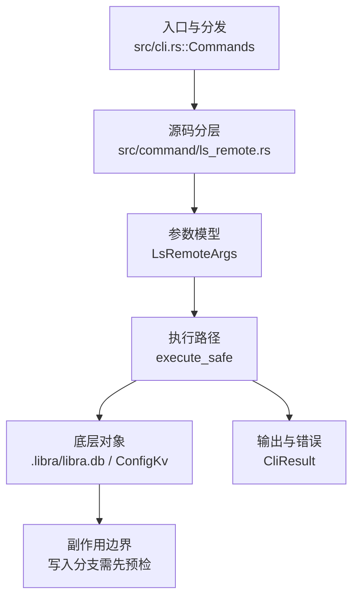

# `libra ls-remote` 开发设计

## 命令实现目标

`libra ls-remote` 的目标是列出远端引用，并支持 URL 或已配置 remote 名解析、`--heads`/`--tags`/`--refs` 过滤、ref 模式匹配、URL 解析、排序和脚本化 exit code 等能力。实现需要保证不需要完整 clone 也能诊断远端引用，同时把网络错误和认证错误区分清楚。

## 对比 Git 与兼容性

- 兼容级别：`partial`。heads/tags/refs filtering、patterns、`--get-url`、`--sort=refname` / `--sort=version:refname`、`--exit-code` 和 `--symref` 已支持。`--symref` 优先解析 discovery capabilities（`symref=<from>:<to>`，通常为 `HEAD`）；capability 缺失时（尤其本地 Libra 源），复用 fetch 的默认分支解析器按 HEAD OID / branch tips 合成可见的 `HEAD` 符号行。

- P1-06 现状复核确认 `--symref` 已正确从 Git upload-pack capability 输出 `ref: refs/heads/<branch>\tHEAD`，无需重写；`compat_fetch_remote_refspec::ls_remote_symref_matches_git_advertised_head_shape` 以真实本地 Git bare remote 固定该契约。
- 当前矩阵承诺常用 Git 行为已支持；新增语义必须同步矩阵、用户文档和测试。

## 设计方案

- 入口与分发：已公开接入 `src/cli.rs::Commands`；已由 `src/command/mod.rs` 导出。CLI 层在 `src/cli.rs` 把解析后的参数交给命令模块，命令模块负责把领域错误转换为 `CliError` / `CliResult`。
- 源码分层：主要实现文件为 `src/command/ls_remote.rs`，辅助模块包括 `ls_remote_filter.rs`（pattern/filter/sort）、`ls_remote_redaction.rs`（URL 脱敏和错误清洗）和 `ls_remote_tests.rs`（单元契约）。参数/子命令类型包括：`LsRemoteArgs`；输出、错误或状态类型包括：`LsRemoteOutput`、`LsRemoteEntry`、`LsRemoteError`；主要执行函数包括：`execute_safe`、`run_ls_remote`。
- 执行路径：`execute_safe` 负责 CLI 安全包装、错误映射和输出配置；`--get-url` 只解析 remote 名/URL 并输出脱敏后的 URL，不联系远端；普通网络路径会解析 remote 配置、协商协议并处理 pack/idx 数据；数据库路径仅通过 `ConfigKv::remote_config` 做一次只读 SQLite 查询，把 remote 名解析为 URL，不写入任何元数据，也不使用 D1。

- 流程图：以下流程图按当前源码分层展示主路径和底层对象边界，便于维护者把代码入口、执行函数和副作用范围对应起来。

- 底层操作对象：SSH transport（SSH remote 连接和认证）；`ConfigKv` / `.libra/libra.db`（仅只读查询 `remote.<name>.url` 配置行，解析 remote 名为 URL，不访问 refs/reflog/AI/发布等表）
- 输出与错误契约：人类输出、`--json` / `--machine` 输出和 quiet/verbose 分支必须继续走现有 `OutputConfig` / `emit_json_data` / `CliError` 路径；新增失败模式要补稳定错误码、用户提示和回归测试。
- 副作用边界：凡是写入索引、对象库、refs/HEAD、reflog、SQLite/D1、工作树或远端的路径，都必须先完成参数校验和 dry-run/预检分支，再执行持久化，避免部分写入后静默成功。

## 实现历史

- 本节依据本地 main 分支提交历史重写，筛选与该命令实现、测试或文档路径直接相关的提交；以下是归纳后的实现脉络。
- 2026-05-11 `5d36ac37`（`feat(remote): add ls-remote command (#365)`）：基础实现节点：add ls-remote command (#365)；当前实现的主要轮廓可追溯到该提交。
- 2026-06-06 `5d0754a6`（`feat(ls-remote): add --symref/--get-url/--sort/--exit-code and offline URL resolution`）：该提交记录的 `--get-url/--sort/--exit-code` 已在当前源码 `LsRemoteArgs` 中；`--symref` 一度从源码丢失，现已在 `LsRemoteArgs.symref` + `parse_symrefs` 中重新实现（解析 discovery capabilities 的 `symref=<from>:<to>`）。文档以当前源码暴露的参数为准。
- 2026-06-07 `0bf8ca90`（`fix(ls-remote): close compatibility plan gaps`）：实现修正：close compatibility plan gaps；该节点把边界行为、错误处理或兼容差异纳入当前实现约束。
- 历史结论：当前文档应以这些提交之后的代码、测试和兼容矩阵为准；更早的迁移式文档只保留为背景，不再作为事实来源。

## 当前状态

- 公开状态：已公开；模块状态：已导出。
- 用户文档：`docs/commands/ls-remote.md`。
- 公开参数/子命令包括：`--heads`、`-t, --tags`、`--refs`、`--get-url`、`--exit-code`、`--sort <KEY>`、`--symref`、`<repository>`、`[patterns]...`。`--sort` 当前支持 `refname`、`-refname`、`version:refname` / `v:refname` 和对应反向形式；未知 key 返回 `LBR-CLI-002`。`--exit-code` 在 discovery 成功但没有匹配 ref 时静默返回 2。`--symref` 先解析 capability，仅对过滤后仍存在的 name 输出 `ref: <target>\t<name>`；若 capability 缺失，则从 discovery 的 HEAD / heads 解析默认分支。本地 Libra 因而也可输出 `HEAD`；无可解析符号引用时 JSON 省略 `symrefs`。

## 还未实现的功能

| 类别 | 未完成项 | 当前处理 |
|---|---|---|
| 设计取舍 | `--symref` 在传输不通告 `symref=` 时需要推断默认分支。 | capability 始终优先；fallback 按 HEAD OID 匹配，再按 `main`、`master`、首个分支，复用 fetch 解析器；无可解析结果时 JSON 省略 `symrefs`。 |

## 维护要求

- 改进本命令前，必须先阅读并遵循 [docs/development/commands/_general.md](_general.md)；这是命令设计、实现、测试和文档同步的强制要求。
- 任何行为变更都要先核对实现源码，再同步 `COMPATIBILITY.md`、`docs/commands/<cmd>.md` 和相关测试。
- 新增 Git 兼容参数时必须明确 tier、错误码、JSON/机器输出契约和回归测试。

## pkt-line boundary classification

The `ls-remote` boundary maps detected pkt-line errors to `LBR-NET-002`, including
empty HTTP(S) discovery advertisements. Match `GitError::NetworkError(detail)`
using the shared `PKT_LINE_PROTOCOL_ERROR_PREFIX` on the raw detail, before
timeout or host-key heuristics. Object-transfer IO carriers, plus the
clone/ls-remote/pull discovery IO carriers, use `fetch::is_pkt_line_io_error`,
which compares a bounded Display prefix without allocating a second complete
message. Marker matching itself is O(prefix length); normal user-message
formatting still costs O(message length). Never classify using a formatted outer
error, a remote URL, case folding, trimming, or a substring search.

This classification applies to reference discovery. SSH authentication and host-trust errors are described below; local
configuration read errors keep their existing error codes.

Marker discovery/transfer-setup errors use the exact `check that the remote serves Git data and that a proxy has not altered the response`
hint. Non-marker network failures retain `LBR-NET-001`; clone discovery's ordinary
IO errors retain `LBR-IO-001`. Authentication, local metadata errors and existing
non-marker host-key handling follows the SSH section below. Other untyped discovery parsing
errors retain existing classification (DEFER-04); this change does not complete
strict async header validation or the later Git/SSH reader work.

The default tests exercise all command conversions with raw carriers and parser
errors, preserve the fetch PacketRead no-hint contract, and prove empty
advertisements reach all four actual command handlers. The clone transfer case
checks both discovery requests and a POST containing the advertised wanted OID.
Its local HTTP fixture runs the production HttpsClient path; it does not exercise
TLS negotiation or certificate validation.

The prefix sink avoids allocating a full Display output itself; the Display
implementation (including OS-error formatting) or earlier diagnostic redaction
may still allocate. The two HTTP fixtures use a two-worker Tokio runtime so
synchronous configuration lookup does not stop the cached pool and server.

## SSH advertisement error handling

SSH advertisement lengths `0001` through `0003`, incomplete headers (including
zero-byte EOF), and truncated payloads return `LBR-NET-002`. The fixed protocol
reason and marker are retained without captured SSH stdout/stderr.

An incomplete required header has one host-trust exception: local SSH exit status
255 together with a recognized host-key diagnostic in the first 64 KiB of stderr
returns fixed host-verification guidance and `LBR-NET-001`. This classification
does not verify the remote fingerprint. Other missing advertisements, including
authentication failures, still use `LBR-NET-002`; an available non-zero local exit
status adds `SSH exited with status N` and fixed connectivity, trusted-host,
ssh-agent and repository-access guidance. Original SSH diagnostic text is hidden.

After an incomplete required header, Libra allows up to 100 milliseconds to
observe the SSH exit status, then requests termination if needed. Other read
errors request termination immediately. The status window, direct-child reap and
output collection share a two-second cleanup deadline. Protocol and typed
host-trust errors take precedence over secondary cleanup warnings. Ordinary IO
and timeout errors keep their transport classification and may include a fixed
local cleanup warning. Termination can change the observed exit status. This
does not promise cleanup of arbitrary descendant processes.

Clone places targeted host-verification guidance in its structured hints. The
other command boundaries retain fixed host guidance in the message and their
existing `LBR-NET-001` network hint. Human, JSON and machine diagnostics omit raw
captured remote stderr in either case.

The `git://` object-fetch path already classifies the listed frame errors as
`LBR-NET-002`; Git discovery and non-ASCII/non-hex async header classifications
remain separate work. HTTP(S) framing behavior is unchanged.

## SSH authentication and captured diagnostics

Libra invokes SSH with `BatchMode=yes` for both terminal and non-terminal callers.
It does not prompt for a private-key passphrase or an interactive host-key
decision during a Libra command. Load or unlock an encrypted key in `ssh-agent`
before retrying. For host trust, verify the fingerprint through a trusted
provider console or another trusted channel before manually updating
`~/.ssh/known_hosts`. Alternatively, make a separate interactive SSH connection
and compare the displayed fingerprint before accepting it. For example,
`ssh -T git@github.com` uses GitHub; use the actual repository SSH user, host and
port. Do not accept a fingerprint that has not been verified.

`ssh.strictHostKeyChecking` retains its existing `ask`, `yes`, `accept-new` and
`no` values. `ask` leaves that SSH option to the user's SSH configuration;
`BatchMode=yes` still prevents interactive decisions. Explicit values are
forwarded to SSH. Choose a host-trust policy appropriate to your repository.

SSH stderr is always captured, including in terminal sessions. It is drained
from process startup, retaining at most 64 KiB while counting and hashing the
remaining bytes. User-facing errors contain fixed text and a local exit status
when available. Raw remote stderr is neither printed nor logged. Debug diagnostics
contain only the status, total and retained byte counts, and a SHA-256 digest of
the collected stream. Failed or cancelled collection may prevent these metadata
from being reported; no completed digest is claimed in that case. Hashing work
is proportional to the number of bytes drained.

SSH reference advertisements and receive-pack responses each have a 16 MiB
aggregate limit. An oversized advertisement fails with `LBR-NET-001` and guidance
to use the repository’s HTTPS URL if available, or ask its maintainer to reduce refs. An oversized push response fails with `LBR-NET-001`
and guidance to push fewer refs; it is not accepted as a truncated success.
These limits can affect repositories with very large ref sets or updates. The
streamed fetch pack is not subject to this cap. A failed push response does not
prove that the server rolled back its refs: inspect the remote state before
retrying. Existing IO timeouts still apply.

After a complete discovery advertisement, Libra allows up to 100 milliseconds
for SSH to exit before requesting termination, within a two-second total
cleanup deadline. Captured-output tasks are cancelled when their owner exits or
their deadline expires, including when a descendant keeps a pipe open.

## SSH capture validation scope

The twelve named PKT-11 library gates retain the original plan names. They cover
fixed diagnostics and metadata-only tracing, both service argument lists, three
non-zero-exit paths, malformed-advertisement cleanup and all six capture paths
under stderr floods. The flood gate also covers retained-prefix/full-stream
digest accounting, collector cancellation, and oversized advertisement and push
response rejection. The host-trust gate covers native exit 255, typed primary
error preservation through a secondary cleanup warning, the internal discovery
carrier and an actual local fake-SSH clone command. Existing fetch/push CLI cases
retain their names and test human, JSON and machine output plus remote-ref safety.
The terminal gate uses a real local PTY. The passphrase gate creates an encrypted
local key without an agent and exercises a simulated SSH failure; it does not
claim live OpenSSH network authentication. Actual run IDs and results belong in
plan-20260901.md after execution; the existence of these tests is not acceptance.

### SSH host identity and diagnostic collection

SSH host identity changes retain a distinct fixed warning: the change may
indicate interception or legitimate key rotation. Verify the new fingerprint
through a trusted channel before replacing an existing known_hosts entry; do not
bypass host-key checking. Unknown and changed host keys both use LBR-NET-001,
but their fixed messages and guidance differ.

A stderr collection timeout does not by itself discard complete protocol output
and an observed local exit status. Non-zero exit status and primary read errors
still fail the operation. Unavailable diagnostics produce only a fixed debug
notice, without fabricated empty-stream counts or digests. Stdout collection or
process-wait failures retain their normal error handling.

### SSH limits and host-classification boundaries

These fixed 16 MiB advertisement and receive-pack response limits apply only to
Libra's SSH transport. The HTTPS and Git transports do not impose this particular
cap. If the server provides an HTTPS endpoint, use its HTTPS remote URL when an
SSH advertisement exceeds the cap; this does not require a read-only user to
change the server's refs. Otherwise, ask the repository maintainer to reduce the
advertised ref set. The streamed fetch pack remains outside this aggregate cap.

Host-trust classification requires an incomplete first header with no stdout
bytes observed, local exit 255 and a recognized retained stderr pattern. Once
any stdout byte arrives, including a partial header, host-like stderr cannot
select host-specific guidance. Failures after a complete advertisement retain
fixed generic diagnostics. The pre-advertisement pattern remains a diagnostic
heuristic, not fingerprint verification.

A successful discovery whose child waits for a request normally incurs the full
100 ms native-exit observation window, once per discovery operation. This is
separate from the two-second direct-child cleanup budget; no benchmark or
arbitrary-descendant cleanup guarantee is implied.
