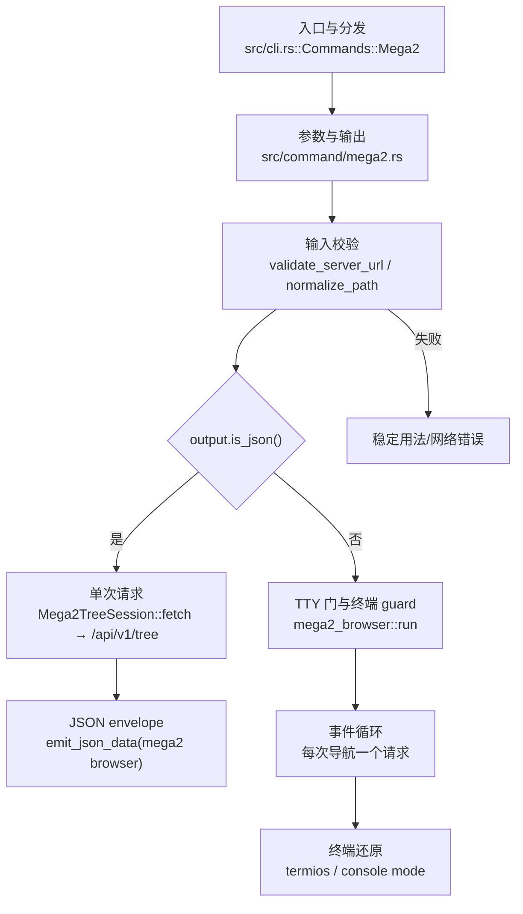

# `libra mega2 browser` 开发设计

## 命令实现目标

`libra mega2 browser` 是本计划（plan-20260912）唯一公开的 Mega2 远端浏览入口：
把已校验的远端 listing 以「可恢复终端生命周期的交互浏览」或「单次请求的机器
可读输出」两种模式呈现给用户与自动化。它是 Libra 专属扩展，重点是**有界、
无秘密、可测**的读取面，不对应任何 Git 原生命令。

唯一行为轴是「可被使用者与自动调用者消费的 Mega2 browser public surface」；本卡
（MB-03）只注册 `browser` 一个子命令，不预留、不注册、不文档化第二个子命令。

## 对比 Git 与兼容性

- 兼容级别：`intentionally-different`。远端 Mega2 metadata browser，Git 无等价
  契约；本地对象检视请使用 `libra ls-tree`。
- 浏览只读且匿名：`GET /api/v1/tree` 不携带 `Authorization`；写入（建目录/删除/
  移动/tag）属于后续卡（MB-04/05、MB-07/08、MB-10/11），不在此命令。
- `COMPATIBILITY.md` 与 `docs/development/commands/_compatibility.md` 均登记为
  Libra-only、无 Git 等价面。

## 设计方案

- 入口与分发：已公开接入 `src/cli.rs::Commands::Mega2`；`command_preflight` 归类为
  `CommandPreflight::none()`（不打开仓库数据库/对象存储），`command_scope` 归类为
  `CommandScope::ReadOnly`，但 `operation_class_for_command` 在通用映射之前显式早退
  为 `MutationClass::ExternalOrUnknown`：命令可在仓库外运行，唯一可被修改的是远端
  状态（MB-05 的 `create-entry`）。
- 源码分层：
  - CLI/参数与输出：`src/command/mega2.rs`（`Mega2Args`、`Mega2Subcommand::Browser`、
    `BrowserArgs`、`execute_safe`、机器 payload `BrowserData`/`BrowserItem`）。
  - 交互状态机与终端生命周期：`src/command/mega2_browser/`（`BrowserState`、
    `Key`/`parse_key`、`render`、`sanitize`、`ensure_tty`/`tty_required`、`run`、
    `perform_create`；Unix 采用 `terminal_unix.rs` 的 termios RAII guard，Windows
    采用 `terminal_windows.rs` 的 windows-sys console guard）。MB-05 增加 `+` 键的单行编辑器，MB-08 扩展为统一 modal `Editor`；MB-11 追加 `t` tag 面板（`tag_panel.rs`，页面/编辑器状态与 `TagPanelAction`）
    （`+` 建目录、`d` 删除确认、`m` 移动、`R` 同层改名；输入即消毒、长度受
    `MAX_NAME_BYTES` 限制，`Esc` 取消零网络，文件与根均惰性）。
  - 有界传输与 wire 校验：`src/internal/protocol/mega2_tree.rs`（URL/path/name
    校验、`Mega2TreeClient`/`Mega2TreeSession`、`ListingCache`、上限常量）。
  - 非交互执行（plan-20261001 MN-02 起）：`src/command/mega2_browser/noninteractive.rs`
    维护唯一的操作登记表 `OPERATIONS`（每个操作一行：flag、`mega2_diag` 端点、读/写与
    目录/tag 类别），ADR-MN-08 的通用规则按类别实现一次（不碰终端、不读 stdin、本地校验后
    恰好一次请求、不 reload/preflight/重试、读操作拒绝 token flag 且不读 `LIBRA_MEGA2_TOKEN`）；
    `BrowserArgs` 的互斥参数组 `operation` 选择操作（MN-02 `--list`，MN-03 `--create-dir`）；
    写类操作由类别规则拒绝 `--ref`（R8），在 MN-11 之前与读操作一样拒绝 token flag，
    经 `Mega2EntryClient::create_directory` 匿名发一次 POST，`create-dir` payload 把本地
    `target` 与服务端 `receipt` 分开。
- 执行路径：
  1. `execute_safe` → `validate_server_url` + `normalize_path`（都在终端/网络之前）；
  2. 带操作 flag，或 `output.is_json()` 为真（等同 `--list`）→ `noninteractive::execute`：
     类别规则 → `Mega2TreeSession::new` + `fetch`（恰好一个请求）→ `--json`/`--machine` 经
     `emit_json_data("mega2 browser", …)` 输出 `{ ok, command, data }`（`data.operation` 为
     `list`），人读为每项一行 `dir  <name>`/`file  <name>`（经 `sanitize`，`--quiet` 不输出）；
  3. 否则（人读且无操作 flag）`mega2_browser::run`：`ensure_tty` → 终端 guard → 首屏 fetch → 事件循环
     （每个导航动作恰好一个请求）→ 退出时强制还原终端；`+` 确认后经 MB-04
     `perform_create` 发一次 POST 并重载一次。
  4. Token 解析（ADR-MB-03）只在交互路径发生：`--token-file` →
     `LIBRA_MEGA2_TOKEN` → `--token`；与 `--json`/`--machine` 组合会以
     `StableErrorCode::CliInvalidArguments` 拒绝（机器模式永不 POST）。
  4. `--quiet` 与交互模式组合被视为不相容调用（会破坏交互/机器消费），以
     `StableErrorCode::CliInvalidArguments` 拒绝并给出 `--machine` 提示。
- 输出与错误：所有失败映射为稳定 `LBR-*` 码（用法 `LBR-CLI-002`、网络
  `LBR-NET-*`、协议 `LBR-NET-002`、不可用 `Unsupported`/`LBR-CLI-003` 等）；错误
  信息不回显响应体、URL credentials、token 或未校验路径。
- 失败诊断（plan-20261001 MN-01）：四个协议客户端发请求的八个公开方法（tree 的
  `fetch_listing`，create-entry 的 `create_directory`，mutate 的 `delete_directory`、
  `move_entry`，tag 的 `list_tags`、`create_tag`、`get_tag`、`delete_tag`）都把原函数体放进
  共享 helper `src/internal/protocol/mega2_diag.rs` 的 `run` 作用域（tokio `task_local!`），
  唯一一次发送经 `mega2_diag::send`，它记录状态码或传输失败类别。作用域在请求发出后返回的
  任何错误上附加 `details`：`method`、`route`（`mega2_diag` 中的路由模板常量），以及
  `http_status`（收到状态码之后的失败，含 2xx 响应体不合规与读取响应体时断连）或
  `transport`（`timeout`/`connect`/`request`）。发请求之前的本地校验错误原样返回；stable
  code、message、hint 与退出码不变（错误构造代码原地保留）。键契约见 `docs/error-codes.md`
  「Command-specific details」。
- 流程图：

## 测试

- 单元：`cargo test --lib command::mega2`（canonical server、机器 payload schema、
  参数解析）与 `cargo test --lib command::mega2_browser`（状态机、渲染消毒、
  TTY 门、pty 还原始末状态）。
- 集成（真实二进制 + loopback mock）：`cargo test --test command_test
  mega2_browser_cli` 覆盖默认值、`--ref`/path 查询编码、JSON 与 NDJSON schema、
  非 TTY 拒绝且零请求、URL 四类拒绝、HTTP 500 与坏 schema（无响应体泄漏）、
  仓库外零本地写入、help 面（仅 `browser`，无 mkdir）；`mega2_browser_mkdir` 覆盖
  `+` 编辑器（文件选择拒绝、`Esc` 零网络、敌意名称不发 POST）、成功路径
  （1 POST + 1 重载 GET）、401/400/403/409 保持最后安全列表且无 token/响应体泄漏、
  token flag 与 `--json` 互斥；`mega2_browser_tag` 覆盖 `t` 面板（第 1 页单次匿名 GET、显式翻页、create 名称+可选 message、delete 确认、敌意名不发请求、面板关闭恢复目录视图、渲染消毒）；`mega2_browser_mutate` 覆盖 `d`/`m`/`R`
  （确认行、Esc 取消零网络、文件惰性、改名=同层移动、敌意目标不发 POST、
  1 POST + 1 重载 GET、help 无 rmdir/mv）。
- 失败诊断（MN-01）：`cargo test --lib internal::protocol::mega2_diag`（作用域的四种附加分支、
  发请求前的错误原样返回、返回的仍是原错误）；`cargo test --test command_test --
  mega2_tree_transport_test::failure_details_ mega2_entry_transport_test::failure_details_
  mega2_mutate_transport_test::failure_details_ mega2_tag_transport_test::failure_details_`
  在八个「方法 + 路由」上各验证起点（500）、中段（读取响应体时断连）与终点（2xx 上的最后一道
  校验，用 201）；`mega2_browser_cli_test::json_error_envelope_carries_http_details` 以真实二进制
  验证 stderr JSON 信封的 `details`。
- 非交互操作（plan-20261001 MN-02 起）：`cargo test --test command_test
  mega2_browser_noninteractive_test` 以真实二进制（清空环境、stdin 为 `/dev/null`）对 loopback
  mock 断言请求记录；ADR-MN-08 的规则按函数写一次，由 `op_rule!` 宏展开为
  `op_rule_<op>_<rule>`（`list`：R1–R6；`create_dir`：R1–R5b、R7、R8），另有各操作的请求记录、
  payload、人读输出与本地拒绝/服务端失败 fixture；`cargo test --lib command::mega2` 覆盖登记表
  与 CLI 操作 flag 一一对应、payload 形状，以及帮助、命令文档与网站页（`LIBRA_SITE_MEGA2_DOC`，
  被忽略的测试需显式运行）示例的 PATH 都 rooted。
- 架构守衛：`compat_agent_architecture_guard` 保证不引入
  ratatui/crossterm/`internal::tui`；`compat_matrix_alignment` 保证
  `COMPATIBILITY.md` / `docs/development/commands/README.md` 与 CLI 同步；
  `compat_command_docs_examples_section` 保证用户文档含 Examples 段落。

## 边界与延后

- 不读 blob、不递归、不带 token（GET）、不持久化配置；不修改 mega2。
- 终端渲染不引入第三方 TUI 依赖（G-05）。
- 目录删除/移动/tag 属后续卡（MB-07/08、MB-10/11）；不带操作 flag 的 `--json` 与
  `--list` 是「一次 GET」；写操作的非交互形式由 plan-20261001 MN-03 起各卡以操作 flag
  加入（MN-03：`--create-dir`），仍没有 `mega2 mkdir` 一类子命令。
