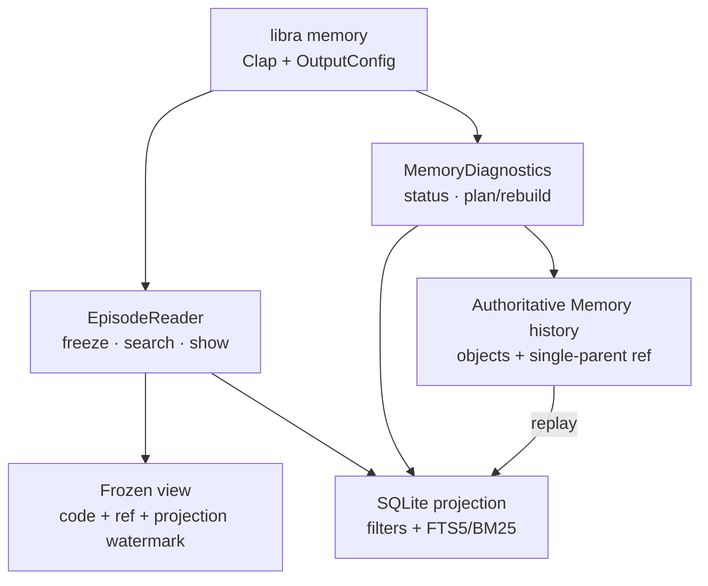

# `libra memory` development design

## Purpose

`libra memory` is the operator and agent-readable diagnostic surface for M2
Task/Intent Episodes. It is a Libra-only command with no Git equivalent.

## Module seams

The command adapter in `src/command/memory.rs` owns Clap parsing, human/JSON
rendering, and conversion to stable `CliError` codes. It crosses two Memory
interfaces:

- `EpisodeReader`: freezes one authenticated code/ref/projection view, searches
  the FTS projection, applies structured filters and Git applicability, and
  resolves one authorized revision with optional evidence expansion.
- `MemoryDiagnostics`: reads ref/projection/job/FTS status and validates or
  rebuilds the projection from authoritative history.

The adapter opens the existing repository database and object storage, but it
does not issue Memory SQL or manipulate the Memory ref/tree. Search and show
load an existing repository digest key through the read-only
`RepositoryKeyedDigest::load_existing` entry; they never initialize a key.



## Side-effect and lock contract

| Invocation | Command scope | Persistent effect |
| --- | --- | --- |
| `search` / `show` / `status` | read-only | none |
| `rebuild --dry-run` | read-only | validates and reduces history; zero writes |
| `rebuild` | repository | replaces only rebuildable Repo-scope projection and FTS rows |

The authoritative ref and objects are never moved by any `memory` command.
There is no branch/worktree/global scope selector in this slice.

## Output contract

- Human search output is compact and includes note/revision identity,
  applicability, evidence count, outcome, code-change status, BM25 score, and
  summary.
- JSON uses the shared success envelope and command identifiers
  `memory.search`, `memory.show`, `memory.status`, and `memory.rebuild`.
- `show --evidence` contains only authorized, redacted fragments plus explicit
  omission reasons. Each reference is checked against the authenticated
  repository-system principal and the frozen view's repository scope before
  its source object is opened.
- `status` contains counters and hashes only, including active/expired lease
  counts; job owner/fence tokens and Memory content are excluded.
- `status` reads only the current head manifest, projection watermark, and
  at most 4,096 compile-job rows. `jobs.scan_limit` and `jobs.truncated` make
  the bound explicit; full object-closure validation belongs to
  `rebuild --dry-run`, keeping status independent of history size.
- The Memory ref and projection watermark are read in one short SQLite
  transaction. A concurrent automatic compiler advance therefore produces
  either the complete old status or the complete new status, never a mixed
  false-stale diagnostic.

## Frozen show and SQLite connection ownership

Repository SQLite pools intentionally contain one connection. `show` therefore
does not keep a transaction checked out while evidence resolution queries Agent
history through the same pool. It validates and resolves the immutable note
revision in one short transaction, expands evidence after releasing that
connection, then revalidates the frozen view in a second short transaction. A
ref or projection change during expansion fails the read instead of returning a
mixed view.

## Agent runtime boundary

Lifecycle wakes are coalesced behind one session-local maintenance worker.
Repeated terminal events set a dirty bit and request at most one additional
bounded pass; they do not create an unbounded queue of Tokio tasks waiting on a
mutex. The outer serialized runtime is the single turn-completion wake point.

Context recall may omit Memory when no candidate is usable or an ordinary
reader failure occurs. Once selection reaches the audit gate, failure to append
the context-selection receipt aborts the Agent request before the provider or
tool loop starts. An injected Memory section is therefore always backed by a
durable receipt.

## Error mapping

Reader/writer error kinds map to the stable Memory family:

- invalid query/filter → `LBR-MEMORY-QUERY-INVALID`;
- missing note/revision → `LBR-MEMORY-NOT-FOUND`;
- absent linked FTS5 → `LBR-MEMORY-FTS-UNAVAILABLE`;
- unavailable digest key → `LBR-MEMORY-001`;
- contract/policy/corruption/storage → `LBR-MEMORY-002` through `005`;
- frozen ref/projection mismatch → `LBR-MEMORY-PROJECTION-STALE`.

No reader failure falls back to stale rows or an unaudited view. Rebuild
corruption errors add a bounded `details.damage_point` containing only a head
OID or event sequence/object IDs; no note body or evidence payload is copied
into diagnostics.

Read commands and `rebuild --dry-run` inspect schema without applying
migrations. A known older schema can still be inspected where its required
tables exist; an actual `libra memory rebuild` applies known pending migrations.
A schema newer than the running binary is rejected as `LBR-MEMORY-002` with an
instruction to upgrade Libra.

## Verification

Focused verification belongs to the existing lib and `command_test` targets:

```bash
LIBRA_SKIP_WEB_BUILD=1 cargo test --lib command::memory
LIBRA_SKIP_WEB_BUILD=1 cargo test --test command_test memory_search_show_status_rebuild
LIBRA_SKIP_WEB_BUILD=1 cargo test --test memory_episode_test cli_json_schema_and_errors
LIBRA_SKIP_WEB_BUILD=1 cargo test --test memory_episode_test rebuild_dry_run_zero_writes
LIBRA_SKIP_WEB_BUILD=1 LIBRA_ENABLE_TEST_PROVIDER=1 cargo test --features test-provider \
  --test code_ui_scenarios memory_public_cli_lifecycle_after_agent_terminal \
  -- --test-threads=1
LIBRA_SKIP_WEB_BUILD=1 cargo run -- memory --help
```

The command-level fixture seeds a Task Episode and exercises the four command
surfaces. The public lifecycle fixture drives a deterministic Agent through a
terminal Task boundary, waits for automatic compilation, uses only public
Memory commands for status/search/show, removes all Repo-scope rebuildable
tables and FTS postings as fault injection, proves dry-run is write-free,
rebuilds from authoritative objects/ref, and searches the same note/revision
again.
