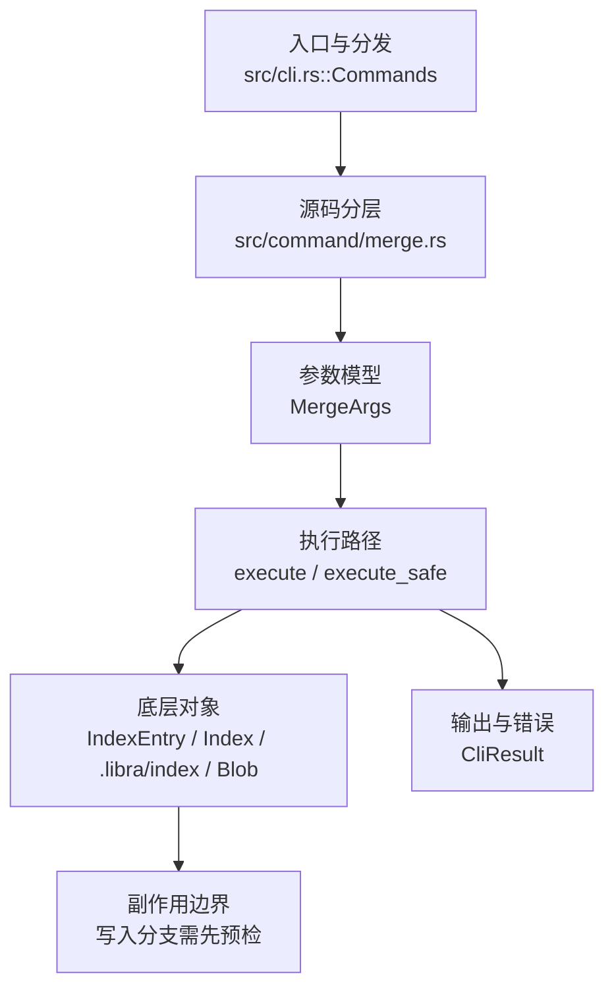

# `libra merge` 开发设计

## 命令实现目标

`libra merge` 的目标是把其他提交或分支合入当前 HEAD，覆盖 fast-forward、单头 three-way、`ours` strategy、冲突侧偏好与无关历史合并。实现需要处理冲突生命周期、autostash、rename detection、签名/策略兼容参数和 JSON 输出；`--ff`/`--ff-only`/`--no-ff`、`-s ours`、`-X ours/theirs`、`--allow-unrelated-histories`、`--log[=<n>]` 与 `merge.ff`/`merge.log`/`merge.verifySignatures` 配置默认已支持，同时把 octopus、其它 strategy/option、`--rerere-autoupdate` 和 merge-commit signing 作为未完成差异。

## 对比 Git 与兼容性

- 兼容级别：`partial`。fast-forward、单头 three-way、`-s ours`、`-X ours/theirs`、`--allow-unrelated-histories`、`--log[=<n>]`/`--no-log`、冲突 lifecycle、autostash、历史 config 与现有签名/显示 flags 已支持；octopus、其它 strategy/option、`--rerere-autoupdate` 与 merge-commit signing 延后。
- three-way 冲突仍由 `merge_tree_items` + `diffy` 行级合并处理；`-X` 只替换冲突 region，clean hunk 继续合并。`--dry-run` 仍在首次持久写前返回，strategy/option 与虚拟空 base 都只在内存计算；JSON `strategy` 对 `-s ours` 为 `ours`，真实输出不新增其它 schema key。
- `--restart` 继续对记录的 `state.target` 确定性重跑；recovery-critical 的 `allow_unrelated_histories` 从 fsynced state 重放，其它原始展示/策略 option 仍使用默认。`--no-commit` 的干净 state 继续由 `RestartWithoutConflicts` 拒绝。
- P1-07b 实现边界：`MergeStrategy::Ours` 记录双父并复用当前 tree；`MergeFavor::{Ours,Theirs}` 对 add/add、modify/delete 和内容冲突统一选侧，内容冲突使用不可与输入碰撞的动态 marker 只抽取冲突区段。LCA 缺失且显式允许时使用空 item map，`MergeState.base: Option<String>` 的 `None` 表达虚拟 base，不写伪对象。

- 当前矩阵明确仍是部分兼容；未覆盖的 Git surface 必须显式列在“还未实现的功能”。

## 设计方案

- 入口与分发：已公开接入 `src/cli.rs::Commands`；已由 `src/command/mod.rs` 导出。CLI 层在 `src/cli.rs` 把解析后的参数交给命令模块，命令模块负责把领域错误转换为 `CliError` / `CliResult`。
- 源码分层：主要实现文件为 `src/command/merge.rs`。参数/子命令类型包括：`MergeArgs`；输出、错误或状态类型包括：`PullMergeSummary`（别名 `MergeOutput`）、`PullMergeError`（别名 `MergeError`）、`MergeState`；主要执行函数包括：`execute`、`execute_safe`。
- 执行路径：`execute_safe` 负责 CLI 安全包装、错误映射和输出配置；索引路径会加载、比较、刷新或保存 `.libra/index`；对象路径会解析 revision 并读写 blob/tree/commit/tag 等对象；引用路径会读取或更新 SQLite refs、HEAD 与 reflog；数据库路径会通过 SeaORM/SQLite 或 D1 客户端持久化元数据。

- 流程图：以下流程图按当前源码分层展示主路径和底层对象边界，便于维护者把代码入口、执行函数和副作用范围对应起来。

- 底层操作对象：`IndexEntry`（索引条目，承载路径、mode、object id 和 stat 元数据）；`Index` / `.libra/index`（暂存区状态、路径条目和刷新/保存边界）；`Blob`（文件内容或 LFS pointer 写入对象库后的 blob 对象）；`Commit`（提交对象、父提交关系和提交消息载荷）；`TreeItem` / `TreeItemMode`（tree 中的路径项和 mode）；`Tree`（由索引或对象遍历生成的目录树对象）；`Branch` / branch store（SQLite refs 上的分支读写、过滤和上游关系）；`Head`（SQLite 中的 HEAD 指向、当前分支和 detached 状态）；`ReflogContext` / `with_reflog`（SQLite reflog 写入和动作记录）；`DatabaseTransaction`（需要原子性的数据库写入事务）；SeaORM / `.libra/libra.db`（配置、refs、reflog、AI/发布元数据等 SQLite 表）；`ObjectHash`（SHA-1/SHA-256 对象 ID 和 revision 解析结果）
- 输出与错误契约：人类输出、`--json` / `--machine` 输出和 quiet/verbose 分支必须继续走现有 `OutputConfig` / `emit_json_data` / `CliError` 路径；新增失败模式要补稳定错误码、用户提示和回归测试。
- 副作用边界：凡是写入索引、对象库、refs/HEAD、reflog、SQLite/D1、工作树或远端的路径，都必须先完成参数校验和 dry-run/预检分支，再执行持久化，避免部分写入后静默成功。
- Hook 边界：`pre-merge-commit` 经 `internal::repo_hooks` required sandbox 在自动 merge commit 前 blocking 运行；随后 `prepare-commit-msg`/`commit-msg` 通过精确可写的 `.libra/COMMIT_EDITMSG` 修改 merge 消息。每个 blocking hook 后都再次校验工作树与 untracked overwrite，避免 hook 修改在 ref 更新后才被覆盖。commit/ref 更新与 reset 成功后 advisory `post-commit`，共享 pull wrapper 再为成功 merge/fast-forward/squash advisory 运行 `post-merge`。`--no-verify` 写入 `MergeState.skip_hooks`，因此全部 merge lifecycle hooks 可跨冲突继续并由 `merge --continue --no-verify` 显式覆盖。

### 递归虚拟祖先（plan-20260903 MG-02 / ADR-MG-04）

- **入口判定**：`merge_base_commits`（原 `lca_commit`）返回 `merge_base::merge_bases` 的**全集**（升序 hex），不再只取第一个。up-to-date / fast-forward / `--ff-only` 三个判定改写在**集合**上（`merge_is_up_to_date`、`merge_head_is_sole_base`、`merge_is_fast_forward`）：某侧是另一侧祖先时它支配全部共同祖先，因此这三种形态恰好等价于「唯一 base 且等于该侧 tip」；多 base 必然是真分叉，永不 ff。`preflight_merge_gitlinks` 与引擎共用同一组判定（GC-02）。
- **gitlink 前置 gate 先于折叠**（MG-00 → MG-02 依赖边）：`ensure_merge_gitlinks_uniform` 对**每一个** merge base 各跑一次 MG-00 的 `ensure_gitlinks_not_arbitrated`。两个 base 之间对某 gitlink 不一致时，折叠自身就会去裁决它——因此逐 base 校验既是「所有输入一致」的等价表述，又保证 fail-closed 发生在折叠写任何对象**之前**。折叠内部因此永远看不到需要裁决的 gitlink，item map 里也不含 gitlink（由 pass-through 集合单独承载）。
- **折叠算法**（`virtual_merge_base` → `fold_merge_bases`，对齐 git@`3cb9185f6` `merge-ort.c:5313`）：base 按 hex 升序两两左折；每一步的 base 由 `merge_bases_of_folded` 给出，再递归折叠。递归深度 = Git 的 `call_depth`（用户的合并为 0，折叠 base 的合并为 1，折叠「base 的 base」为 2……）。
- **`merge_bases_of_folded` 为什么不读虚拟提交**：Git 用 `make_virtual_commit` 串起虚拟提交，下一轮再对它调 `get_merge_bases()`。本实现改为从**真实** base 推导——虚拟祖先的可达集恰好是它们可达集的并，故 `common(virtual, next) = ⋃ᵢ (anc(baseᵢ) ∩ anc(next))`，而并集的极大元必在各部分极大元之中，即 `⋃ᵢ merge_bases(baseᵢ, next)` 再跨部分做支配过滤（`merge_base::is_ancestor`）。结果集合与 Git 相同，但折叠不必把自己写出的对象再读回来，`--dry-run` 因此可以**一个字节都不写**。
- **折叠内部的判定**（`merge_virtual_items` / `virtual_conflict_resolution`）：虚拟祖先是合成输入，折叠必须总能产出内容，所以它不上抛冲突。逐条对齐 git@`3cb9185f6`：
  - `-X ours/theirs` 在 `depth > 0` 一律关闭（`merge-ort.c` 在 `call_depth` 非 0 时置 `ll_opts.variant = 0`）；
  - change/delete（仅单侧存活）取 base 版本（git@`3cb9185f6` `merge-ort.c` `process_entry:4374-4381`：`call_depth` 非 0 时选择 original entry；旧版 Git 曾在已删除的 `merge-recursive.c` 中把它表述为「reuse the base version for virtual merge base」）；
  - 两侧**类型不同**（`S_IFMT` 不同，Git 的 `handle_content_merge` 直接 assert 同类型）或两侧都是符号链接：取 base 条目——`merge-ort.c` 在 `call_depth` 下 `result->mode = o->mode; oidcpy(&result->oid, &o->oid)`，**无 base 即该路径在祖先中不存在**；
  - 任一侧是二进制（`merge_input_is_binary`：Git `merge-ll.c` `ll_xdl_merge` 的两条判据——`xdiff-interface.c` `buffer_is_binary` 前 8000 字节含 NUL，或输入超过 `xdiff/xdiff.h` `MAX_XDIFF_SIZE` = 1023 MiB，Codex R6）：取 base 的**内容**，无 base 时取**空 blob**——`merge-ll.c` 的 `ll_binary_merge` 在 `virtual_ancestor` 下 steal `orig`，而 `read_mmblob` 读 null oid 得到空缓冲；记空 blob 而非「不存在」，是为了不把外层的 add/add 降级成单侧新增；`try_merge_blob_contents` 在 `depth > 0` 遇二进制直接返回 `None` 把判定让给这条规则（depth 0 的行为**未改动**，那是另一条轴）；
  - 其余（两侧同为普通文件、非二进制）按当前 `merge.conflictStyle` 渲染成带标记的内容并落为 blob；base 类型与两侧不同的情况按 Git 的 `two_way` 当作无 base 做两路合并（mode 规则仍看真实 base）；
  - mode 取 git@`3cb9185f6` `merge-ort.c` `handle_content_merge:2211-2217` 的规则（`virtual_merged_mode`：两侧同 mode 或 ours 未改 → 取 theirs，否则取 ours；旧版 Git 的已删除 `merge-recursive.c` 曾在 `merge_mode_and_contents` 中使用同一判定）。
  - 配套：`relabel_conflict_markers` 改为**逐字节**改标签（原先经 `String::from_utf8_lossy`），因为折叠会处理「Git 判为文本但非 UTF-8」的内容，lossy 转换会把这些字节改写成 U+FFFD。
- **标记宽度随深度**：`conflict_marker_length_at_depth = unambiguous_conflict_marker_length(sides) + 2 × depth`——Git 的 `DEFAULT_CONFLICT_MARKER_SIZE + call_depth * 2`（`merge-ort.c` 传 `extra_marker_size`，`ll_xdl_merge` 相加）叠加 Libra 既有的「按内容加宽」。深度 0 与改动前完全一致。折叠内的标记标签用 Git 的 `Temporary merge branch 1/2`（`relabel_conflict_markers` 增加 `ours_label` 参数，外层仍是 `HEAD`/commit 缩写）。
- **一次性对象与 GC**（ADR-MG-04）：`materialize_virtual_ancestor` 在 `persist`（即非 `--dry-run`）时把折叠结果写成 tree + 合成 commit，parents = 到目前为止折叠过的**真实** base（可达集与 Git 的链式虚拟提交一致），author/committer 为确定性的 `Libra <virtual-merge-base@libra.invalid>`、时间戳取 parents 的最大 committer 时间、时区 `+0000`——所以同一段历史每次折叠出的对象 id 相同。它**不进 `merge-state.json`**：`recorded_merge_base` 只在「唯一真实 base」时写 `base` 字段，因此 `merge_state_gc_oids` 不会把虚拟对象登记成 GC root，`maintenance gc` 可以在冲突合并进行中回收它们而不触发 sidecar 的 fail-closed 悬空判定；恢复只走 `--restart` 重算（`--continue` 从索引收尾，本就不需要 base 对象）。折叠合成的 **blob** 另有一份内存副本（`VirtualBlobs`，`load_merge_blob` 优先命中），这是 `--dry-run` 不写对象仍能算出同一结果的原因；真实合并里它们同时落盘，并由冲突路径的 stage-1 索引条目充当 GC root。
- **`merge_bases_of_folded` 的工作量**（Codex R3）：`internal::merge_base` 只暴露逐次调用的 API（每次新建图读取源，MG-01 的有意设计，本卡只消费不改），所以第 `k` 步折叠要做 `k−1` 次 merge-base 染色；单个已折叠 base 时直接返回 `merge_bases`（不做任何支配过滤——单一部分的结果本就互不支配），多部分时只在**不同部分**的候选之间做 `is_ancestor`。宽度由 `MAX_VIRTUAL_ANCESTOR_BASES = 32` 封顶（`ensure_virtual_ancestor_width`），在**三处**生效（Codex R4）：`merge_base_commits` 拿到裸 id 后、加载任何 base commit/tree 之前（`will_fold` = `merge_options_will_fold`：默认策略且非 `--ff-only`；`-s ours` 不折叠、分叉的 `--ff-only` 先以 NonFastForward 拒绝，两者都不受宽度限制——Codex R5）；`fold_merge_bases` 入口；`merge_bases_of_folded` 内对已折叠 base 数以及**逐个收集候选时**的候选数——候选超限即拒绝，不做任何两两 `is_ancestor`。超限报 `VirtualAncestorTooWide`→`LBR-UNSUPPORTED-001`；深度上限管嵌套、宽度上限管一层的 base 数与候选数，两者合起来才是确定性的工作量上界。端到端：`merge_crisscross_more_bases_than_the_width_ceiling_is_refused_before_loading`（33 个独立祖先，拒绝且零写入，`-s ours` 放行）。
- **与 Git 的已知差异（五项，用户文档与 `COMPATIBILITY.md` 同步登记）**：⓪ 同层 base 数上限 32（Git 无上限；见上一条）；① 折叠顺序固定为 hex 升序，Git 用 `get_merge_bases()` 的遍历顺序——≥3 个 base 且折叠不可交换时结果可能与 Git 不同（换来的是可复现，`--restart` 才能重算出同一个祖先）；② 递归深度上限 20（`MAX_VIRTUAL_ANCESTOR_DEPTH`），超限报 `LBR-UNSUPPORTED-001`，Git 无上限；③ 多 base 时 `merge.conflictStyle` 提前解析（折叠内容依赖它），因此非法值会拦下一个本来会干净完成的交叉合并；④ 合成 commit 的 parents 是「全部已折叠真实 base」而非 Git 的两两链式，可达性等价、对象 id 不同。

### 增量树合并：目录剪枝（plan-20260903 MG-03）

- **问题**：`commit_tree_split` → `TreeExt::get_plain_items_with_mode` 把三棵树全量拍平成 `HashMap<PathBuf, MergeTreeEntry>`，每次合并读取三侧**全部** tree 对象（O(全树)），与改动量无关。
- **新路径**（`perform_incremental_three_way_merge` / `incremental_merge_trees` / `incremental_merge_walk`，对齐 git@`3cb9185f6` `merge-ort.c:1259` `collect_merge_info_callback` 的判定形状）：三棵树按目录**同步下降**，每个目录先比三侧 tree id 再决定是否打开——三侧一致不打开；一侧等于 base 则**整体采纳**另一侧的子树（结果里是一条 `TreeItemMode::Tree` 条目，`create_tree_from_items_map` 原样写入，不展开）；两侧同改一致采纳；单侧新增/删除按 id 决定；其余才递归。叶子仍走 `resolve_three_way`，因此两条路径对每个文件的判定**相同**（`merge::tree::incremental_and_flattening_paths_agree*` 逐叶对拍，含 mode/symlink/exec/目录换文件/add-add/modify-delete）。
- **读取面**（`TreeSource` trait；生产 `ObjectStoreTrees` 每 id 读一次并计数，单测用计数的内存图）：三侧一致的子树永不打开；「一侧等于 base」的子树只在**另一侧不同的路径上**逐层打开——`files_changed` 计数用一次剪枝 diff（`pruned_subtree_diff`：只打开 id 不同的目录，每层每侧一次）。`a_subtree_only_we_changed_is_adopted_with_only_the_gates_reads` 钉住「三个根 + 只读 gate 沿差异链每侧每层一次（4 层 × 2 个不同的侧 = 8），合并 walk 本身零新增读取、零 blob 读取」；`pruned_subtrees_are_not_read` 钉住「共享子树零读取 + 采纳子树只沿差异路径（3 + 8）」；`synthetic_large_tree_reads_scale_with_changes_not_size` 在 10^5 文件 / 1% 改动的合成树上断言读取数 ≤ 根 + 差异目录×2 侧，且不足全树 tree 数的一半。
- **ADR-MG-01 在剪枝下的两档 —— 独立的只读 gate 先行**（Codex R1；CLI 级用例 R7 补齐：`merge_gitlink_nested_changed_pointer_inside_a_pruned_subtree_is_refused` / `merge_gitlink_nested_identical_pointer_inside_a_pruned_subtree_passes_through`——gitlink 埋在 ours 与 base 相同的 `deps/vendor/` 之下，theirs 改指针即拒绝且零写入，三侧相同则随剪枝子树原样通过、stats seam 证明 `deps/` 从未打开）：`incremental_gitlink_gate` / `gitlink_gate_walk` 在合并 walk **之前**跑一遍只读遍历：三侧 id 相同的目录不打开（内部不可能有分歧），其它目录在每个持有它的侧打开——新增/删除的子树因此被完整枚举（那正是被合并的改动本身）；遇到 gitlink 条目，**三侧齐全且相同**才算 pass-through，否则登记为裁决；全部裁决路径排序后报最小者（与拍平路径 `ensure_gitlinks_not_arbitrated` 的选择一致）。这条规则与拍平路径逐点等价，且覆盖所有快捷采纳臂（`b==o`/`b==t`/`o==t`/单侧新增/单侧删除）——它们不再各自扫描。gate 先于 walk，所以 walk 里 `persist_merged_blobs` 写出的自动合并 blob 绝不会在被拒绝的合并里落盘；两者共用同一个 `ObjectStoreTrees`，walk 打开的目录 gate 已缓存，对象库读取不重复。`preflight_merge_gitlinks`（单/无 base）同样改用该 gate（不再 `commit_gitlink_entries` 拍平），多 base 保留 `ensure_merge_gitlinks_uniform`。用例：`gitlinks_inside_pruned_subtrees_follow_adr_mg_01`（共享子树零读取放行 / theirs 改隐藏指针拒绝 / 可见新增拒绝）+ `merge_gitlink*` 全部集成用例默认经剪枝路径。
- **消费者与写入顺序**（Codex R5）：干净路径只需要树（采纳子树原样写入），索引/工作树由 `reset_index_and_workdir_to_tree` 从最终 tree 重建——这是合并躲不掉的唯一一次全量读取（Git 亦然）。增量路径把这次检出**提前到 commit 与 HEAD 写入之前**：`rebuild_index_from_tree` 在保存索引前就读完结果树携带的全部 tree/blob，因此缺失/损坏的对象（含 walk 未打开、HEAD 自有的共享 tree）在 HEAD、索引、工作树与 merge-state 都未改动时失败——拍平路径靠「拍平时读遍」得到的这层保护，这里由写入顺序给出。精确口径（Codex R7）：在此之前已经落盘的只有**内容寻址的对象**——`create_tree_from_items_map` 写出的结果 tree 与 walk 里自动合并的 blob——它们在失败时无任何引用、可被 `maintenance gc` 回收，与拍平路径在同一时点写出的对象完全相同；「零持久写入」指的是引用/索引/工作树/状态面。崩溃窗口随之改变：拍平路径是「commit+HEAD 已写、树未检出」，增量路径是「结果已检出并暂存、HEAD 仍旧、无 merge-state」（表现为已暂存改动，commit 或 reset 即可恢复；Git 同样先写索引/工作树）。hook 仍在检出之前运行（否则 hook 之后的 `ensure_clean_status` 会把已暂存的结果判为脏）。冲突路径需要逐文件索引条目与工作树文件，故 `expand_adopted_subtrees` 把**所有**携带的子树展开成叶子（冲突索引列出每个文件）——冲突路径的读取量因此是 O(全树)，与拍平路径相同；剪枝的收益在判定与干净路径；未跟踪碰撞检查（`adopted_aware_write_paths`）只考虑**结果引入的**子树（采纳自 theirs 或 theirs 新增，`IncrementalMergeResult::adopted_from_theirs`）——ours 本就拥有的子树（三侧一致或 ours 自有）不写任何文件，其下的未跟踪路径不会被覆盖，故不展开（一个巨大的未改动子树即使下面有未跟踪文件也不会被打开，Codex R8；stats 端到端用例在 `shared/` 下放了未跟踪文件仍守住读取界）；对引入的子树先用 `worktree::paths_conflict` 做**对称**前缀筛（未跟踪文件 `p` 与采纳目录 `p/q` 也算碰撞，与拍平路径逐叶 `paths_conflict` 一致），只有命中时才展开该目录再走原有 `ensure_no_untracked_conflicts`；该计算在**每个**检查点（合并前、`pre-merge-commit` 之后、消息 hook 之后）按当时的未跟踪集合重算，hook 在采纳目录下新建的文件因此不会漏判（Codex R2）。`files_changed` 由 walk 累计：叶子按「结果 ≠ ours」计数，冲突路径按「ours 有条目」计数（与 `count_item_map_changes(ours, merged)` 完全一致），采纳子树用剪枝 diff 计数。
- **适用范围与开关**：单 base 与无 base（unrelated）走新路径；多 base（MG-02 递归虚拟祖先）保留拍平路径——它构造虚拟祖先时已读全三侧，拍平不再增加读取。`LIBRA_TEST=1` + `LIBRA_TEST_MERGE_TREE_WALK=flat` 强制旧路径（与 `am`/`stash` 失败点同一哨兵形状；`incremental_tree_walk_enabled_for` 纯函数钉住：无哨兵时 `flat` 无效），供对拍与回归；旧拍平实现按卡内约定保留，下线随 DEFER-05。
- **未打开 tree 的不变量（取代 R3 的写前逐 tree 校验，Codex R4）**：结果里按 id 携带、而 walk **未打开**的每个 tree，都已被 `ours`（HEAD）引用——gate 会递归进入三侧不全相同的每个目录，因此它没打开的目录在所有在场侧（含 ours）id 相同；采纳自 theirs 的子树内部同理（gate 只在 theirs 的嵌套 tree 等于 base 的、而 base 等于 ours 处停下）；新增目录没有对侧，被完整枚举。所以增量路径**不可能**引入一个拍平路径本会发现的不可读 tree：walk 没打开的 tree 若缺失，那是已检出提交本身的损坏，两条路径都在检出时同样失败。基于此不再做「读遍采纳子树」的校验（那会把读取量退回到仓库规模）；`merge::tree::unopened_trees_are_heads_own` 钉住该不变量，`merge_tree_walk_refuses_an_added_subtree_with_a_missing_nested_tree` 钉住「新增子树的嵌套 tree 缺失在任何写入前被 gate 发现（`LBR-REPO-002`）」。**`--dry-run`**（Codex R8/R9）：真实合并由检出读遍携带的 tree 并在写入前失败，预演没有检出，因此自己做一次只读探测（`probe_carried_trees_readable`：以**真实合并会用的视角**读携带子树下的全部 tree（只读 tree 不读 blob）：无冲突时真实合并会检出，检出经 `load_object` 应用嵌套 `refs/replace`，故预演用 `ObjectStoreTrees::as_checkout_sees_them()`；有冲突时真实合并不检出、而是经 walk 的 raw 源展开子树写冲突状态，故预演也用同一 raw 源（Codex R11：否则「别处冲突 + 悬空的嵌套 replace」会让预演报 `TreeLoad` 而真实合并成功写出冲突状态）；walk 与 gate 仍是 raw 视角、与拍平路径一致，两种视角各自成源、不混缓存）——预演结论与真实合并一致，代价即拍平路径的预演本就要读的那批 tree（`merge_tree_walk_dry_run_matches_the_real_verdict_on_a_missing_shared_tree`、`merge_tree_walk_dry_run_follows_nested_replacements_like_the_checkout`、`merge_tree_walk_conflicted_dry_run_matches_the_real_conflict_path_under_a_dangling_replace`）。
- **`refs/replace` 口径**：拍平路径对**根** tree 用 `load_object`（应用 replace）、对嵌套 tree 用 `Tree::load`（不应用）；增量路径逐点对齐——根 id 经 `replace::resolve`，`ObjectStoreTrees` 用 `load_object_raw` 读嵌套 tree，两路径看到并记录同一批 id（合并输入是否应一致地尊重 replace 是另一条轴，本卡只保证两路径一致）。
- **G6–G8 的 CLI 承载**（Codex R9）：`merge_tree_walk_preserves_a_mode_only_change_on_both_walks` / `merge_tree_walk_preserves_a_symlink_change_on_both_walks` / `merge_tree_walk_preserves_an_added_executable_on_both_walks`——theirs 一侧用 plumbing（`update-index --cacheinfo` + `write-tree` + `commit-tree`）构造，因为 porcelain `add` 不识别裸 `chmod`（mode-only 改动在 `status`/`add` 里不可见，与本卡无关的既有限制）；每个用例在默认与 `flat` 两种 walk 下各跑一遍，断言合并后 `ls-tree -r HEAD` 与 `ls-files -s` 的 mode（100755 / 120000，符号链接指向新目标 blob），并断言两种 walk 留下**相同**的工作树。
- **已登记残留（MG-03 登记，**已由 MG-04 R7 解决**）**：merge 的检出写工作树时不应用可执行位、也不重写已存在的符号链接目标——MG-04 把全部工作树写入改为 `write_workdir_entry`（类型 + 权限随条目）后此残留消除，`merge_tree_walk_preserves_*` 三个用例与 `merge_preserves_symlinks_and_executable_bits_when_it_writes` 共同覆盖。
- **后处理的复杂度（Codex R3）**：`resolve_df_conflicts` 对候选是线性的——一次排序扫描出存活目录、一次建好的 modify/delete 槽位表，不逐候选扫描冲突列表（候选数可随树线性增长）；`resolve_df_conflicts_scales_linearly_with_the_candidate_count` 以 4000 个候选 + 时间预算钉住。
- **可度量的复杂度界**：合并判定（gate + walk + 剪枝 diff）的 tree 读取数 ≤ Σ 每个改动路径的目录深度 × 不同的侧数，preflight 与引擎各一遍（各自缓存）——即 O(改动路径 × 深度 × 侧数) × 2，与仓库大小无关（`synthetic_large_tree_reads_scale_with_changes_not_size` 与 stats 端到端用例按此界断言）；检出与冲突路径仍是 O(全树)。
- **不变量**：merge-state schema 不变；JSON `files_changed`/`conflicted_paths` 不变；`--dry-run` 零写入不变（采纳子树不写、剪枝 diff 只读）。**对拍精度**：两路径对每个**叶子**的判定相同；被原样采纳的子树内若含空 tree，会随子树保留（拍平路径只产出叶子、从不重建空 tree）——这是 Git 亦有的「采纳即原样」语义，登记为已知差异而非缺陷。
- **生产入口的证据 seam**：`LIBRA_TEST=1` + `LIBRA_TEST_MERGE_TREE_STATS=<file>` 时，`perform_incremental_three_way_merge` 把 `{"walk":"incremental","tree_reads":N}`（拍平路径写 `{"walk":"flat"}`）写到该文件；`N` 是进程内**全部** `ObjectStoreTrees` 对对象库的 tree 读取**尝试**数（`MERGE_TREE_STORE_READS`，失败的读取同样计入；失败退出不写 stats，因为引擎在出口才写），在引擎每个**出口**（预演返回、冲突返回、squash/no-commit/干净路径的检出之前）写出——即在最后一个读源的消费者（未跟踪复检、冲突展开、预演探测）之后；preflight gate 与引擎各一遍、各自缓存，故整个合并的界是「每遍 ≤ 根 + 差异路径 × 侧数」的两倍；端到端用例据此断言**默认合并**确实走了剪枝路径且读取数受改动路径约束，而不只靠内存图单测。

### D/F（目录/文件）冲突（plan-20260903 MG-04）

- **问题**：一侧 `foo` 为文件、另一侧 `foo/` 为目录时，拍平后 `foo` 与 `foo/bar` 是两个无关 key，合并把二者都写进结果——一个 tree 在同一名字下同时持有 blob 与子树，索引/工作树写出「半合」状态且无冲突提示（GAP-05）。
- **判定（两条引擎共用一个后处理 `resolve_df_conflicts`，对齐 git@`3cb9185f6` `merge-ort.c:4100-4198`）**：候选 `DfCandidate { path, file_side, file, base_file }` = 恰好一侧持有文件、而其下（结果或任一输入）还有路径的 path——不论该文件自己的解析结果是保留、冲突还是（被 `-X` 裁决）删除都登记。拍平引擎（`merge_tree_items`）把结果 + 冲突 + 两侧输入的路径按**组件序排序后单趟扫描**得到候选（`foo/…` 在组件序中紧跟 `foo`，不做二次方扫描），空目录标记不算文件、base 的标记不进 `base_file`（Codex R2）；增量引擎在 walk 的「一侧目录一侧文件」分支登记候选（`IncrementalMergeResult::df_candidates`）。后处理在**结果仍列出全部目录条目时**运行（拍平的空目录标记剥离之前、增量的采纳子树展开之前，Codex R2），且只在**目录内容存活**时动作（Git 的 `ci->merged.result.mode != 0`），三种形态：① path 自己的解析是 modify/delete 冲突 → 改成 `FileDirectory { modify_delete: true }`（Git 先搬迁再跑 modify/delete 分支）；② 文件自己保留在结果里（单侧新增，或 `-X` 偏袒了它）→ 移出结果、`FileDirectory { modify_delete: base 有文件且被改过 }`；③ 文件侧改过而 `-X` 偏袒了删除 → 仍按 `modify_delete: true` 重新升起（`directory_is_in_the_way` 把候选路径也当作前缀参与扫描，被删掉的 `foo` 才能与结果里的 `foo/bar` 配对）（Git 实测 `-X theirs`/`-X ours` 下 D/F + modify/delete 依旧是冲突；Libra 对**无目录**的普通 modify/delete 仍按既有 `-X` 语义裁决，与 Git 的差异先于本卡、属策略选项轴，登记不改）。目录合并为空则文件留在原地（Git 的「directory no longer in the way」）；文件在两侧都被删除、或一侧未动另一侧换成目录时不动作（`file == base_file`）。
- **两种形态（Git 实测 git@`3cb9185f6`，`merge-ort.c:4120-4198` 的 D/F 搬迁先于 `:4374` 的 modify/delete 分支）**：① 仅一侧新增的文件 → `ConflictKind::FileDirectory`（`AU foo~HEAD`，只有自己一侧的 stage，原样写出）；② base 已跟踪、文件侧修改过 → 解析本身已是 `OursModifiedTheirsDeleted` / `TheirsModifiedOursDeleted`，**种类不变、只换落点**（`df_file_side`：目录存活时按修改侧决定 `~HEAD` / `~<branch>`；`foo~HEAD` 带 stage 1 base + stage 2/3 修改侧，与 `git ls-files -s` 实测一致；`--dry-run` 报 `modify-delete` + `original_path`；Codex R1：同时打印 Git 的第二行 `CONFLICT (modify/delete): <moved> deleted in <dir 侧> and modified in <file 侧>.  Version <file 侧> of <moved> left in tree.`，文件按该行所说**原样**写到落点，不再套 Libra 的 modify/delete 标记）；③ 一侧未动、另一侧换成目录 → 干净删除、无提示（实测 `Merge made by the 'ort' strategy`，`delete mode 100644 foo`）——增量 walk 的 `b==o` 采纳臂天然给出该结果。
- **落点（`conflict_placements`，每条引擎**只算一次**并随 `MergeConflictInput::placements` 传给写入器——公告、未合并路径列表、stage 与工作树写入同源，Codex R2）**：文件写到 `unique_df_path` = `<path>~<branch>`（分支名 `/`→`_`，与 Git `add_flattened_path` 一致），名字被**任一输入**（base/ours/theirs，含两侧都删掉、结果里已不存在的路径）或结果的任何路径**或其祖先目录**占用时追加 `_0`、`_1`……（`df_occupied_names` / `occupied_names`：Git 的 `opt->priv->paths` 登记全部输入路径与目录条目——已跟踪的 `foo~HEAD/bar` 或仅 base 有过的 `foo~HEAD` 都让文件落到 `foo~HEAD_0`，两者 git 实测一致；Codex R1/R2 P1）；折叠内部的 `relocate_virtual_df_files` 用同一占用集（三侧 map + 结果）；增量引擎只在存在 D/F 搬迁时才枚举三侧输入的全部路径（`incremental_df_occupancy`：叶子与目录、含空目录，经 walk 自己的已缓存源；真实冲突路径本就 O(全树)，`--dry-run` 出现 D/F 冲突时也付这一次读取，且在 stats seam 之前完成）（Git `unique_path` 只查该 map，不查工作树；工作树里的未跟踪同名文件由 `ensure_no_untracked_conflicts` 拒绝——`paths_to_write` 含落点路径，两者合起来与 Git「先算名、检出时拒绝覆盖」等价）。分支标签：我方 `HEAD`、对方为被合并 ref 的名字（`df_branch_label`，与冲突标记标签同源；Git 用 `opt->branch1/branch2`）。`conflict_placements` 是未合并路径列表、未跟踪碰撞检查、索引 stage 与工作树写入的**唯一**来源。
- **索引 stage 布局**（`write_conflicted_merge_state`）：落点路径上，文件所在侧 stage 2（ours）/ stage 3（theirs），base 在原路径有**文件**时其 stage 1（都取自 `FileDirectory` 自带的 `file` / `base_file`，不再回查三侧 map——空目录标记因此永远进不了 stage，Codex R2；普通冲突的回退查找同样过滤标记：base 的空 `foo/` 与两侧各自新增的 `foo` 是无 stage 1 的 add/add，Codex R3）；目录侧的 stage 一律不写（Git 把目录相关 stage 清零）；不写 stage 0。原路径 `foo` 在索引里不再出现（只剩目录下的叶子）。工作树：所有搬迁的冲突（`FileDirectory` 与换落点的 modify/delete）都按 `moved_file_content` 把存活侧条目**原样**写到落点（`write_workdir_entry`：`120000` 落成真正的符号链接（目标按**原始字节**经 `OsStr::from_bytes` 还原，不做 UTF-8 校验——Codex R4：非 UTF-8 目标此前会在状态已写出后失败）、`100755` 显式 `0755`、其余 `0644`——Git 在落点检出的就是原类型；pre-review P1：此前一律写成普通文件，符号链接会被静默变成含目标文本的文件）——即 Git 的「Version X of path left in tree」，未搬迁的 modify/delete 仍用 Libra 既有标记呈现（本卡不改）。冲突路径的工作树写入改为**先删后写**（`write_conflicted_merge_state`：先移除结果不再持有的已跟踪路径，再写合并文件与冲突文件——与 `reset_workdir_tracked_only` 同序；此前先写后删，`foo/bar.txt` 在文件 `foo` 仍在时 `create_dir_all` 报 `File exists`）；`write_workdir_file` 新增「目标是**空目录**则先删再写」：`--abort` 把 `foo/` 恢复成文件 `foo` 时，其下已跟踪文件刚被移除、目录已空；非空目录（未跟踪内容）由 untracked-overwrite 检查在写入前拒绝。
- **消息**：`announce_df_conflicts` 在冲突状态**写成之后**（写入器的未跟踪碰撞 / 符号链接 / 目录接管预检都通过后，pre-review P1：此前先打印后预检，被拒绝的合并已经声称文件被移走并「left in tree」，而 Git 此时什么都不打印）逐个打印 Git 原文 `CONFLICT (file/directory): directory in the way of <old> from <branch>; moving it to <new> instead.`，换落点的 modify/delete 再打印 Git 的 `CONFLICT (modify/delete): …  Version … left in tree.`；**仅人读输出**——`output.is_json()`（`--json`/`--machine`）直接返回，stdout 保持机器可读，冲突由 stderr 的 `LBR-CONFLICT-002` 信封承载（Codex R1 P1：此前 `info_println!` 只看 `quiet`，`--json` 的真实合并会把提示行混进 stdout；`merge_df_conflict_json_keeps_stdout_machine_clean` / `pull_test::test_pull_df_conflict_json_keeps_stdout_clean` 钉住），随后仍退出 128。 冲突列表在算落点前按路径排序（Git 的 `process_entries` 走排序路径），因此消息顺序、`conflicted_paths`（merge-state 与 `--json`）与 `Would conflict in:` 都与 Git 一致，落点后缀的分配顺序也确定。
- **删除集（Codex R3 / pre-review）**：冲突路径只删除**当前索引跟踪、且结果（已合并 + 落点）不含**的路径（gitlink 除外）——此前并入 base/ours/theirs 的历史路径，会把用户后来重建的未跟踪 `foo~HEAD` 一并删掉；历史里有、现在没跟踪的路径不是合并的东西。存在性判断一律用 `fs::symlink_metadata`（不跟随）：`exists()` 会跟随符号链接，**悬空**的已跟踪链接因此不会被删除，随后写它下面的路径就以 `File exists` 失败——而拍平引擎在干净路径上已经写完 commit 并移动了 HEAD，留下 HEAD/索引/工作树三者不一致（pre-review P1，`reset_workdir_tracked_only` 与冲突写入器两处；`merge_dangling_tracked_symlink_gives_way_to_a_directory_cleanly` 双 walk 钉住干净路径）。
- **`--abort`**：`restore_pre_merge_state` 除恢复索引与工作树外，删除恢复后的索引**不跟踪**的冲突路径——移位文件 `foo~HEAD` 由此清理（存在性判断用 `symlink_metadata`：`is_file()` 会跟随链接，**悬空**或指向目录的移位符号链接因此不会被清掉，而恢复后的索引也不跟踪它——Codex R5）；合并创建的目录随恢复消失。**腾空目录的清理（Codex R1 P1）**：`reset_workdir_tracked_only` 与冲突路径的删除循环在移除每个已跟踪文件后 `prune_empty_parents`（逐级向上删空目录、到工作树根为止，非空即停——与 Git 检出一致），`write_workdir_file` 接管的目录改为 `remove_empty_dir_tree`（只含空目录的树才删，遇到任何文件报错、绝不删未跟踪内容）；否则嵌套的 `foo/a/` 会留下空 `foo/a`，恢复文件 `foo` 时 `Directory not empty`（`merge_df_conflict_occupied_name_and_nested_directory_restart_and_abort` 钉住 `--restart` 与 `--abort`）。`--continue`：用户把 `foo~HEAD` 暂存到 stage 0 即可收尾，合并提交同时含目录与移位文件（与 Git 相同，不替用户裁决）。
- **`--dry-run`**：`conflict_kinds` 字段（`Vec<ConflictReport { path, kind, original_path }>`，为空不序列化，真实合并永不带）——`kind` ∈ `content` / `modify-delete` / `file-directory`（`FileDirectory { modify_delete }` 决定后两者），`original_path` 仅 D/F 有；`conflicted_paths` 列落点名。预演不做任何写入（候选判定与落点计算都是纯函数；增量引擎的占用集枚举只读）。
- **「挡路」的精确判据（`directory_is_in_the_way`，实测 git@`3cb9185f6` + `git mktree`；Codex R1 提出、pre-review 纠正）**：① 路径**之下**存在存活的**文件**条目 → 挡路（常规情形）；② 之下只有空 tree（没有任何文件）时，**仅当 merge base 在该路径上什么都没有**才算挡路——Git 对「相对 base 全新的目录」走 `collect_merge_info_callback` 的 `possible_trivial_merges` 延迟采纳、整棵原样收下（result.mode = S_IFDIR），而 base 已有该路径时 Git 会真的遍历、发现没有文件，于是文件留在原地。实测三种形态：base 无 `foo` + ours 新增文件 `foo` + theirs 新增 `foo/bar`（空 tree）→ `foo~HEAD`；base 有文件 `foo`、ours 修改、theirs 换成 `foo/bar`（空 tree）→ 普通 `CONFLICT (modify/delete): foo`（stage 1+2 在 `foo`，不搬迁）；theirs 的 `foo` 自身就是空 tree → 干净保留 ours 的文件。③ 增量引擎把整棵子树按 id 携带（`TreeItemMode::Tree`），因此判据用回调 `subtree_holds_a_file` 读**碰撞路径之下**的携带子树（只有碰撞才付这次读取）；拍平引擎的唯一 tree 条目是空目录标记，回调恒为 `false`。为让拍平引擎看见「对侧到底有没有目录」，拍平与折叠改用 merge 自有的 `commit_tree_split_for_merge` / `flat_items_with_empty_dirs`（叶子之外把**空**子树记为一条标记条目，读取面与共享 flattener 相同，但**可失败**：嵌套 tree 缺失/损坏返回 `PullMergeError::TreeLoad` 而不是 `TreeExt::load` 的 panic——Codex R6；`commit_gitlink_entries` 也改走这条路径，`merge_flat_walk_reports_a_missing_nested_tree_instead_of_panicking` 钉住），`sides_without_empty_dir_beside_file` 让「与文件同路径的空目录」不参与三路判定；`merge_tree_items` 在后处理后 `retain` 掉标记（拍平结果仍只有叶子——MG-03 登记的口径不变），而**虚拟祖先保留标记**（外层合并需要知道 base 曾有目录，`create_tree_from_items_map` 原样写出），`count_item_map_changes` 把标记视为不存在。`DfCandidate.base_present`（拍平：base 路径排序后前缀查找；增量：walk 在目录/文件分支直接看 base 侧）承载 ②。**不挡路时的清理（Codex R8）**：文件留在结果里的同时，其下若还留着采纳来的空子树条目，结果树会在同一名字下既有 blob 又有目录——后处理按前缀清掉它们（此时它们必然不含文件），增量与折叠两处都做，拍平引擎的 `retain` 等效。单测 `merge::df::a_directory_is_in_the_way_exactly_as_git_decides`、`merge::df::a_carried_subtree_is_read_to_decide_whether_it_holds_a_file`、`merge::tree::an_empty_subtree_is_in_the_way_only_when_the_base_had_nothing_there`（双引擎三形态）。
- **写入即替换目录项 + 类型/权限随条目（Codex R5/R7）**：`clear_write_target` 对已存在的**普通文件**先 `remove_file` 再写——`git merge` 实测重写已跟踪文件后 inode 改变、仓库外的硬链接别名保留旧内容与旧权限；原地 `fs::write` 会截断同一 inode，破坏别名并留下过期权限位。既然每次写入都是**新建**文件，类型与权限就不能再从磁盘上原有文件继承：合并的**全部**工作树写入（冲突路径的已合并文件、D/F 落点、`reset_workdir_tracked_only` 的检出）统一走 `write_workdir_entry(workdir, path, mode, content)`——`120000` 建真符号链接（目标原始字节）、`100755` 显式 `0755`、其余 `0644`（Codex R7：R5 的 unlink 让符号链接条目退化成含目标文本的普通文件、可执行位退化成 umask 默认）。**这同时消掉了 MG-03 登记的残留**「merge 检出写入器不应用可执行位、不重写符号链接目标」——现由 `merge_preserves_symlinks_and_executable_bits_when_it_writes`（双 walk）钉住。
- **符号链接安全（Codex R2/R3）**：工作树写入器 `write_workdir_file` 先 `refuse_symlink_components`——路径上任何一级目录是符号链接（`symlink_metadata`，不跟随）即拒绝（Git 的「beyond a symbolic link」；被忽略的 `foo -> /别处` 对未跟踪扫描不可见，否则会把 `foo/bar.txt` 写到工作树之外）；恰好在目标路径上的符号链接被 `remove_file`（删链接本身）后再写文件，空目录（写前预检允许它、非空的已被拒）由 `clear_write_target` → `remove_empty_dir_tree` 接管（Codex R4：符号链接分支此前对目录调 `remove_file`，在 merge state 与索引都已写出之后报 `EISDIR`）；`remove_empty_dir_tree` 先拒绝符号链接、遍历时用 `file_type()`（不跟随）。写前预检 `refuse_symlink_traversal(writes, removals)` 检查**写入与删除**两组路径的祖先：唯一放行的是本次合并**自己要删除的已跟踪符号链接**（ours 的链接 `foo` 让位给 theirs 的目录 `foo/`——删除先于写入，写 `foo/bar` 时链接已不在），其它任何链接祖先（如被忽略的 `gone -> /别处` 之上的历史文件 `gone/file`，删它会删掉外部文件）都拒绝整个合并。检查点：冲突路径（`paths_to_write` + 删除集，保存 state/索引之前）、`reset_workdir_tracked_only`（新索引路径 + 删除集，删除之前）、拍平引擎的干净路径（它先写 commit/HEAD 再检出，故在其首次写入之前预检，并在 `pre-merge-commit` 与消息 hook 之后**各复检一次**——hook 可能植入被忽略的链接；增量引擎检出先于 HEAD，天然覆盖），拒绝时 HEAD/索引/merge-state 均未改动（`merge_refuses_to_write_through_an_ignored_symlinked_directory` 双 walk、`merge_df_conflict_replaces_an_ignored_symlink_at_the_moved_name`）。同一预检还负责**目录→文件的接管**（pre-review P1）：写入路径在工作树里是目录时，其中除本次合并自己要删除的已跟踪文件外不得有任何东西（`directory_content_outside`，不跟随符号链接），否则在任何改动前拒绝并指名挡路者——此前该判断发生在写入阶段的 `remove_empty_dir_tree` 里，被忽略的构建产物会让合并中途失败（`merge_refuses_to_replace_a_directory_holding_ignored_content` 双 walk）。祖先检查带记忆化（`cleared`），避免对同一目录重复 `lstat`。
- **递归折叠内部（MG-02 虚拟祖先）**：`merge_virtual_items` 末尾跑 `relocate_virtual_df_files`——同一候选规则，但不登记冲突、直接把文件移到 `<path>~Temporary merge branch 1|2`（Git 在 `call_depth > 0` 下同样走 `unique_path`，标签即 `opt->branch1/2` = 临时分支名）。没有这一步，虚拟祖先 tree 会在同一名字下带 blob 与子树，外层合并把用户重建的 `foo` 误判为「对方删除」（`merge_crisscross_df_collision_inside_the_fold_moves_the_file_like_git` 钉住）。
- **被忽略文件的处置（Codex R4/R9 提出，git 实测判定为**有意一致**）**：落点（以及任何合并写入路径）上的**被忽略**文件会被直接替换，挡在合并要创建的**目录**位置上的被忽略文件同样被替换成目录（`clear_ancestor_files` 在 `create_dir_all` 之前清掉路径上的普通文件——**文件与符号链接两个写入分支都做**，Codex R10；git 实测 `create mode 100644 foo/bar.txt`、`foo` 变目录。此前 `create_dir_all` 会在写入中途失败，而拍平引擎此时 HEAD 已经移动 → 历史/索引/工作树不一致，Codex R9 P1）——`git merge` 实测同样如此（D/F 落点与普通新增文件两种形态都覆盖；只有**未跟踪且未被忽略**的文件才让合并整体拒绝，`untracked_workdir_paths` 用 `IgnorePolicy::Respect` 正是这个语义）。因此不改行为，只在 EN/zh 用户文档与 COMPATIBILITY 写明「被忽略路径不受保护」，并用 `merge_df_conflict_replaces_an_ignored_file_at_the_moved_name_like_git` 钉住。
- **本卡实测暴露的既有缺陷（本卡外，登记）**：① `libra checkout` 不能把同一路径在文件与目录之间切换——文件→目录 `LBR-IO-001 failed to read worktree`，目录→文件 `LBR-REPO-003 local changes would be overwritten`（Git 可以）；② 已跟踪文件被目录替换后 `status` / `add -A` 失败（`LBR-REPO-002 … Is a directory` / `LBR-IO-001 cannot inspect`），需先 `libra rm <file>` 再建目录；③ 本卡之前 merge 的冲突写入器在 D/F 场景直接 `LBR-IO-002`（`failed to write foo: Is a directory` / `failed to create foo: File exists`）——由本卡的落点搬迁 + 冲突路径先删后写 + 空目录接管修复。①② 属 checkout / status 轴，测试夹具以 `root` 中转分支 + `libra rm` 绕行，待独立立卡；⑤（预审实测）`libra rm` 不接受未合并路径（`pathspec 'foo~HEAD' did not match any files`），因此 D/F 冲突里「丢弃被移走的文件」只能靠 `--abort`（Git 用 `git rm foo~HEAD`）——属 `rm` 命令面，用户文档只承诺可行路径；④（Codex R3 实测）已跟踪文件的父目录被换成符号链接时 `status` 报 `LBR-IO-001 cannot inspect 'gone/file'`（io_error），而合并前的干净检查并未因此拦下——本卡之前的 merge 在该形态下会**穿过链接删掉外部文件**（实测），现由 `refuse_symlink_traversal` 在任何写入前拒绝；status 对该形态的报告属 status 轴，另行登记。
- **与 Git 的已知差异**：① Git 的 `unique_path` 在外层（`call_depth == 0`）之外不检查工作树，Libra 也不检查，但 Libra 在写入前以未跟踪碰撞检查拒绝整个合并（零写入），而 Git 会在检出阶段报错——结果都是不覆盖，错误面不同；② Git 把 D/F 与 rename 交互（`rename/directory`）一并处理；MG-05 之后 Libra 已有 per-side 改名检测（见下节），但**由改名引发的 D/F 交互**仍不裁决——改名目标是对侧的目录时按 `DestinationTaken` 退回、由本节的 D/F 通道处理（git 实测同形态给出 `<path>~HEAD`，结果一致），目录级 rename 推断留给 MG-07。
- **用例**：`command::merge_test::merge_df_conflict_*`（双向、两行消息、stage、`--abort`、`--continue`、`--restart`、flat walk 对拍、目录合并为空不挡路、占用名 `_0` + 嵌套目录、仅 base 有过的路径仍占名（双 walk）、人工空 tree 挡路（双 walk）、`-X ours/theirs` 仍冲突、`--json` stdout 干净、被忽略的符号链接被替换 / 穿链接写入被拒）、`merge_df_unchanged_*`、`pull_test::test_pull_df_conflict_json_keeps_stdout_clean`、`merge_dry_run_reports_a_df_conflict_with_its_kind` / `merge_dry_run_reports_content_conflict_kind`（G9/G10）、`merge_crisscross_df_collision_inside_the_fold_moves_the_file_like_git`（折叠内部）、`--lib merge::df`（`unique_df_path` 后缀、折叠标签、后处理只在目录存活时动作）。

### per-side rename 检测接入（plan-20260903 MG-05）

- **内容与 mode 分开裁决（Codex R2，git 实测）**：`try_merge_blob_contents` 不再因为 mode 不同就放弃——三侧都是普通文件时照常做行级合并，mode 单独裁决（两侧相同取之；只有一侧改则取改动侧；两侧改成不同值才冲突），因此「一侧改名 + `chmod +x`、另一侧改内容」干净合并并保留 `100755`（与 `git merge` 同一个 blob id，`merge_rename_with_mode_change_merges_cleanly_and_keeps_the_mode` 双 walk 钉住）。
- **形状**：对合并的每一侧各跑一次 `rename_detect::match_pairs`（与 `diff`/`status` 同一引擎，ADR-MG-03），快照的 `old_map` = 该侧相对 base **删除**的路径、`new_map` = 该侧**新增**的路径——「另一侧是否有该路径」一律按**是否有文件**判断，空目录标记不算「有」（Codex R4，`git merge-tree` 实测：`old.txt` 移到原本是空 tree 的路径上仍被识别为改名并干净合并；反过来，源路径被换成空目录则算删除，git 报 `CONFLICT (rename/delete)`，MG-05 按 `SourceDeleted` 退回并打 notice，交给 MG-06）；gitlink 与目录标记本身不进快照——裁决 submodule 早已被 ADR-MG-01 拒绝；内容由 `MergeRenameSource` 经 `MergeRenameReader` 读取：**两侧共用一个** reader，按 object id 缓存（同一 blob 每次合并只读一次），走 `diff` 同款的 `ObjectReadBudget`（可杀死的 worker + `OBJECT_READ_DEADLINE`，`Completed` 类跳过再回落进程内读取），并且**先查虚拟祖先的内存 blob**——多 base 的 `--dry-run` 把折叠出来的 blob 只留在内存里，否则预演与真实合并会配出不同的改名（Codex R1 P1）。对齐 git@`3cb9185f6` `merge-ort.c:3429` `detect_regular_renames` 与 `:2913` `process_renames`。
- **配置（Codex R1 收紧、R5 提前）**：在**任何持久化之前**读取（多 base 合并会先折叠出虚拟祖先并落盘一次性对象，非法的 `merge.renames` 必须在此之前失败，`merge_rejects_rename_config_before_folding_a_virtual_ancestor` 以「拒绝前后 loose object 集合不变」钉住）；一律走**严格级联**读取（`read_cascaded_config_value_strict`，与 `status`/`diff` 的同名键同源，覆盖 local→global→system 并做解密），并用 Git 的布尔/整数规则解析：`merge.renames` 回退 `diff.renames`（`copy`/`copies` 按 Git 视为「开启改名」，Libra 不做 copy 检测；**无法解析的值报错**而不是静默开启），`merge.renameLimit` 回退 `diff.renameLimit`（默认 **7000**＝Git 的 merge 默认值，`<= 0`（含 `0` 与负数）一律回落该默认值，接受 Git 的 `1k` 等写法，只有非整数才报错——详见下面的「`merge.renameLimit` 的 Git 口径」）；错误用专属的 `InvalidRenameConfig` / `RenameConfigRead`（不再借用 conflictStyle 的变体），merge 与 pull 两条 CLI 映射都登记。相似度阈值固定 Git 默认的 50%（内部 30000/60000）。超限时引擎跳过 inexact 阶段但保留精确/同名配对，合并**不失败**，`announce_rename_notices` 打印一条 notice（人读输出；`--json`/`--machine` 静默）。
- **接受的形态与拒绝的形态**（`decide_renames`，一处规则供两条引擎与单测共用）：接受「一侧改名 a→b、另一侧仍持有 a」；拒绝并打印 notice 的四种交给 MG-06——两侧改到不同路径（`DivergentRenames`）、两侧改到同一路径（`SameDestination`）、对侧删除了源（`SourceDeleted`、rename/delete）、目标已被占用（`DestinationTaken`、rename/add）。**占用判定按路径分量、且只算一次**（Codex R2/R3）：两条引擎各自**预先建一次索引**（`rename_destination_occupancy` / `other_adds` + `merged_ancestors`：每个**文件**路径及其全部祖先目录），改名裁决因此是一次哈希查找而非逐对扫描——精确改名不受 `renameLimit` 限制，成百上千对改名不能让判定变成二次方（Codex R3 P1）。目标路径本身被占用，或**对侧**在其之下有条目（即目标在对侧是个目录）都算占用；占用一律只算**合并后仍然幸存**的内容——base 自己的条目从不算数，对侧原样承接自 base 的条目也不算（改名侧必然已把目标之下清空，因此这些路径会被合并删掉），详见下面的「占用集只算幸存者」；**空目录标记不算占用**——git 实测（ours 把 `old.txt` 改名为 `new`、theirs 改内容并加一棵空的 `new` tree）干净合并且改名生效，两条引擎因此都把 `TreeItemMode::Tree` 的空标记排除在占用之外（增量侧对结果里携带的子树另用 `carried_subtree_holds_a_file` 判断，空子树同样不算，读不出来的树按错误上报而不是当成「占用」，Codex R3/R5）；增量侧的占用集还包含**冲突路径**及其祖先（Codex R5 P1：拍平引擎能从三侧 map 看到未合并路径，walk 只在冲突列表里有它们——否则改名会盖住目标下的未合并文件，并在写入阶段被 `clear_ancestor_files` 删掉）；后者退回后正好由 MG-04 的 D/F 通道处理——git 实测同一形态给出 `CONFLICT (file/directory) … new~HEAD`，Libra 逐字节一致。增量引擎的占用判定用**输入事实**（候选清单 + 结果中的后代路径），不看 `merged`：对侧的新增若自身冲突，`merged` 里根本没有条目，此前会误判为「未占用」并把对侧内容悄悄丢掉（Codex R2 P1）。被拒绝时映射不动，合并回到「一删一增」的既有行为。
- **拍平引擎**：解析**之前**重映射——`apply_renames` 把 base 与对侧在 `a` 的条目搬到 `b`，`a` 从三张表消失，随后普通三路匹配在 `b` 处看到一个三元组（内容合并落新路径、冲突 marker 与 stage 也落新路径，stage 1 自然是 base 在原路径的内容）。
- **增量引擎（剪枝 walk）**：候选**在 walk 与它本就要跑的剪枝 diff 中收集**（`IncrementalMergeResult::rename_sources/rename_dests`，`SubtreeDiff` 顺带记录单侧叶子）；**读取口径（Codex R10 订正）**：不是「零额外读取」——某一侧缺少可能的源或可能的目标时确实零额外读取，两者都有时才打开 walk 跳过的 `Unexplored` 子树，且只打开**该侧与 base 不同**的那些，即该侧自身 diff 的范围（git 的 per-side 检测同样要读该侧完整 diff）；两侧相同的子树永不打开。由 `merge::tree::rename_collection_reads_only_the_subtrees_that_differ` 钉住：~2.4 万文件的合成树上，检测新增读取 ≤ 差异子树成本，且无目标可配对时新增读取为 0；walk 主动跳过、MG-03 本来也不打开的子树（采纳 ours、两侧同改、单侧新增、单侧删除）只登记为 `Unexplored`，**仅当该侧同时可能有改名源与改名目标时才真正枚举**（`UnexploredKind` 分类：只可能有源 / 只可能有目标 / 两者皆可能）——没有改名的合并因此读取量与 MG-03 完全相同（Codex R2 P1：此前无条件展开这些子树，违反本卡「不增加读取」的承诺）。被整体采纳/删除/新增的子树内部的改名仍能配对（`merge_rename_into_an_adopted_subtree_is_detected_on_both_walks` 钉住）。walk 已按各自路径解析完毕，所以配对后由 `apply_incremental_renames` 做一次**事后重解析**（重解析前先用 `expand_subtrees_covering` 把**覆盖改名路径的携带子树**展开成叶子——Codex R2 P1：否则结果里会同时留下 `shared` 的 tree 条目与 `shared/moved.txt` 叶子，写出的 tree 在同一名字下有两条记录；只展开被覆盖的那几棵）：移除源与目标两处结果，用 (base[a], 改名侧在 b, 对侧在 a) 三元组重新 `resolve_three_way` 落到 `b`，并把冲突路径的 stage 查找表（`tree_leaves` 得到的三侧 map）用同一 `apply_renames` 重映射，否则冲突只会写出改名侧一条 stage。
- **`files_changed`（Codex R1 修正）**：口径为「重映射后 `count_item_map_changes(ours, merged)` + **对侧**做的每个已接受改名各 +1」——重映射之后 ours 的条目已经在新路径上，纯改名因此在比较里看不见，而合并确实在工作树里移动了文件（Git diffstat 记作一处 `old => new`）。增量引擎按同一口径修正 walk 已经计入的部分（ours 改名 walk 计 0、theirs 改名 walk 计 2），两条路径对同一形态的 `--dry-run` 摘要逐字段相同（`merge_rename_files_changed_agrees_across_walks_in_both_directions` 双向钉住）。
- **改名源发生类型变化＝删除（本地对抗预审，数据丢失）**：base 的 `old` 是普通文件、ours 改名为 `new`、theirs 把 `old` 换成**符号链接**时，此前两条引擎都接受该配对，于是被重映射到 `new` 的符号链接成了唯一改动、三路匹配直接取用——**被改名文件的内容整个消失，且退出码为 0**。git 2.50.1 实测把类型变化当作删除：报 `CONFLICT (modify/delete): new deleted in th and modified in HEAD`，`new` 保留 stage 1/2 的原内容、`old` 留下符号链接。修正：`decide_renames` 与增量裁决都要求对侧在源路径上持有与改名目标**同类**的条目（`same_entry_kind`：普通文件/符号链接/目录/gitlink 四类），否则按 `SourceDeleted` 退回并打 notice；用例 `merge_rename_whose_source_became_a_symlink_keeps_the_content`（双 walk）。
- **D/F 结算必须晚于改名修补（本地对抗预审）**：剪枝 walk 过去在 `incremental_merge_trees` 末尾就结算 D/F，而改名修补在其后运行——一个被接受的改名把目录里最后一个文件搬走之后，该目录早已被判为「挡路」。git 实测（base `dir/y` + `new/child`，ours 改 `new/child`，theirs 把 `dir/y` 改名为 `new`、`new/child` 改名为 `a`）干净合并，结果是 `a` 与普通文件 `new`；拍平引擎（顺序一向是改名→解析→D/F）与 git 一致，剪枝 walk 却报 `new~theirs`。修正：结算搬到 `settle_incremental_df_conflicts`，由调用方在 `apply_incremental_renames` **之后**执行；同时丢弃「路径正是某个已接受改名的源」的候选——那条冲突正是被改名消化掉的（拍平引擎因为先重映射所以从不会看到它）。用例 `merge_rename_that_empties_a_directory_leaves_no_df_conflict`（双 walk）。
- **两侧同改子树里的「对侧条目」（本地对抗预审）**：`o == t` 分支登记 `Unexplored` 时把 **base** 条目当成了对侧条目，于是「两侧都删掉的源」在剪枝 walk 上逃过 rename/delete 判定被静默接受，而拍平引擎打 notice——两条引擎输出不一致。修正：`Unexplored` 带上 `other_holds_left`，只有 `left` 确实就是对侧（`b == t` / `b == o` / 采纳子树等分支）时才记 `Some`；`o == t` 分支记 `None`。两侧真的做了同一个改名时，`SameDestination` 在判定顺序上先于 `SourceDeleted`，因此仍报同一条 notice。用例 `merge_rename_whose_source_both_sides_deleted_is_declined_on_both_walks`（双 walk）。
- **`merge.renameLimit` 的 Git 口径（本地对抗预审 + git 源码）**：默认值取 **7000** 而非 1000，且 `<= 0` 一律回落到该默认值——依据 git@`3cb9185f6` `merge-ort.c:3452-3453` 与 `:5504`，并经实测复核（`git -c merge.renameLimit=0` 仍会检测）。**注意这不是逐字节的 parity（Codex R14）**：git 只对 `0` 与 `-1`（它自己的「未设置」哨兵）成功，`-2`/`-3` 会命中 `merge-ort.c:5042` 的 `assert(opt->rename_limit >= -1)` 并让进程 abort（实测 exit 134）；Libra 把所有非正值都当默认值接受，是**有意的安全扩展**，不复刻该崩溃。只有**非整数**才是硬错误，对应 git 的 `fatal: bad numeric config value`。**仍存在的有意偏离**：超限判据本身不同。Libra 走 `rename_detect` 的 §B.7 逐侧规则（`sources > L || destinations > L`，`diff`/`status` 共用）；git 用矩阵判据 `(d <= L || s <= L) && d*s <= L²`，且 merge-ort 只把**与本次合并相关**的源计入 `s`。实测（30 删 30 增、对侧只动其中 1 个）：git 在 `L=5` 跳过并提示「至少设为 30」、在 `L=6` 就恢复检测，正是 `30*1 <= 6²` 的分界。要完全对齐需要 merge-ort 的 relevant-source 剪枝，超出本卡范围，已登记为 plan-20260903 的 **DEFER-15**。
- **空 blob 的排除只属于「检测」，不属于「报告」（Codex R21）**：git 合并时 `rename_empty = 0`，但它的 diffstat 是一次普通 diff，照常配对空 blob——ours 把 `old` 清空、theirs 纯改名为 `new` 时，`git merge` 仍报 `1 file changed`。收尾计数沿用了合并检测的快照，于是预演报 1、`--continue` 报 2。修正：`rename_snapshot` 增加 `allow_empty`，检测走 `detect_side_renames`（排除空 blob，保住 R13 的修复），报告走 `detect_side_renames_for_report`（配对空 blob）。两条规则各有用例：`merge_does_not_pair_empty_blobs_as_renames`（检测面）与 `merge_files_changed_pairs_an_emptied_rename_when_reporting`（报告面），均双 walk。
- **`files_changed` 的第三种情形：配对已不再像改名（Codex R20）**：R19 定下「同时改了内容的改名不再 +1」，但还漏了反向的边界——ours 先删掉大半内容后，HEAD→结果的相似度掉到阈值以下，git 的 diffstat 就**不再把它渲染成改名**，而是一删一增两处变化。实测（base `old` 十二行，ours 删掉 0–7 行，theirs 改名为 `new` 并改 9–11 行）：`git merge` 报 `2 files changed`（`new` 新建、`old` 删除，无 rename 行）。规则收敛为一句：**只有当「内容变了」且「配对仍读作改名」时才不 +1**，其余（内容没变、或已不读作改名）都 +1。判定用 `pair_reads_as_a_rename`——对单一配对再跑一次同一套引擎与同一份配置，两次（带缓存的）blob 读取，两条引擎共用同一判据。
- **收尾计数不得让已开始的合并失败（Codex R20）**：R19 的「只有同时存在删除与新增才解析配置」在用户于 `--continue` 前**自己 stage 一次移动**时失效——`-s ours --no-commit` 成功、`--continue` 却因非法 `merge.renames` 报 LBR-REPO-003，而 git 两条都成功（git 的 `--continue` 就是一次 commit，根本不解析该键）。修正：这个数字是**报告**，配置读不出来就回落到原始计数，绝不因此让命令失败。用例 `merge_continue_survives_an_unusable_rename_config`。
- **补上真正的计数承载（Codex R20）**：此前的两个夹具一个把改名放在 ours（HEAD 里已有）、一个让 theirs 只做纯移动，都没走到 R19/R20 的分支。新增 `merge_incoming_rename_files_changed_matches_git_across_modes`：theirs 改名并改内容（git 报 1）与低相似度（git 报 2）两种形态 × 预演/`--no-commit`/`--continue` × 双 walk，期望值全部取自实测 git 输出。
- **前缀必须是「文件」才算 base-present（Codex R19）**：R18 统一口径时用 `base.contains_key(前缀)` 判断，把**空目录标记**也算成了「base 在此处有东西」——base 有空 tree `d`、ours 把 `old` 改名到 `d/new` 时，git 与剪枝侧都报冲突，拍平侧却干净提交。修正：前缀只认非 `Tree` 条目（严格在该路径之上）。两种前缀形态各有用例：`merge_rename_destination_is_not_re_settled_as_a_collision`（前缀是文件 → 干净合并）与 `merge_rename_under_an_empty_base_directory_is_declined`（前缀是空目录 → 拒绝），均双 walk。
- **`files_changed` 的 +1 只属于「看不见的改名」（Codex R19）**：口径原本是「重映射比较 + 对侧每个已接受改名 +1」，但**同时改了内容的改名**在重映射比较里已经被记为一次变化，再 +1 就重复计数。git 实测（theirs 把 `old` 改名为 `new` 并改一行、ours 改无关文件）为 `1 file changed`。修正：仅当「结果在新路径上与 ours 的条目相同」（即纯改名、比较看不见）时才 +1，两条引擎同步；`unseen_renames_by` 取代 `accepted_renames_by`，增量侧的 walk 计数修正同步收紧。
- **`--continue` 的计数不得引入新的配置失败（Codex R19）**：新加的收尾计数会无条件解析改名配置，于是 `merge -s ours --no-commit` 成功、`merge --continue` 却因非法 `merge.renames` 失败（git 两条都成功）。修正：只有当比较里**同时**存在删除与新增时才可能有改名可折叠，否则直接返回原始计数——`-s ours` 的结果等于 HEAD，因此在解析任何配置之前就返回了。
- **两条引擎的 base-presence 口径必须一致（Codex R18）**：拍平侧用 `occupied_names(base.keys())`（base 的每条路径 + 其上层目录）回答「base 在此处有没有东西」，这套集合表达不了第三种情形——**base 在该路径的某个前缀上是一个文件**（base 有文件 `d`、目标是 `d/new`）。剪枝侧的 `base_holds_anything_at` 顺着路径分量走 base 树，会正确答「有」。于是同一形态 git 与剪枝侧干净合并、拍平侧却在 `old` 与 `d/new~HEAD` 处报冲突。修正：统一为 `base_holds_anything`，三种情形一并覆盖（就在该路径 / 在其之下 / 路径前缀是文件），base 名称集合仍只算一次，判定代价是路径深度而非重扫 base。同时把 R17 的用例从「被编辑的 blob 还在某个 stage 上」加强为「两条 walk 都干净合并、`d/new` 的 stage 0 就是那个 blob」——过弱的断言正是让两条引擎分歧整整一轮没被发现的原因。
- **`--continue` 的 `files_changed` 也要按改名计一次（Codex R18 P2）**：收尾时比较的是「合并前的树」与「索引」，改名在那里表现为一删一增，于是预演与 `--no-commit` 报 1、`--continue` 报 2。修正：`count_changes_following_renames` 用同一套引擎与同一份 `merge.renames`/`merge.renameLimit` 配置做一次检测，每对改名减 1，与 Git diffstat 的 `old => new` 一致；检测关闭或没有改名时计数原样不变。用例 `merge_rename_is_consistent_across_dry_run_squash_and_no_commit` 现在对 `--continue` 也断言该数字。
- **重写后的三处收口（Codex R17）**：① **只能释放真正被计入的条目**——`side_occupancy` 会跳过「对侧原样承接自 base」的条目，释放路径却没跟着跳，于是释放一个从未计数的源把别人的计数减到 0，让被挡的改名放行并提交了同名的文件与目录（`ls-files` 报 EISDIR）。释放与加回改用与计数完全相同的判据（`counted_at`）。② **对侧的独立新增要单独记账**——把结果条目改成「只记祖先」虽然让改名不再挡住自己，却也抹掉了「对侧在目标上独立新增了一个文件、且合并按对侧解析」这种情形：结果里那条条目分不出是谁的，于是 `-X theirs` 下改名把对侧的文件覆盖掉并退出 0。对侧的新增是**输入事实**，恢复为独立的 `other_adds` 项。③ **已接受改名的目标同样是过期的 D/F 候选**——此前只丢弃「源」侧候选，目标侧的候选仍会在结算时用改名前的 blob 覆盖已解析内容，把修改从所有 stage 上抹掉；现在两端都丢弃。用例 `merge_rename_destination_is_not_re_settled_as_a_collision`（双 walk，断言被编辑的 blob 无论裁决如何都还留在某个 stage 上）。
- **占用改为「计数 + 不动点」，两条引擎共用一套规则（Codex R16 重写）**：R15 的「释放一次、判定一次」在四个方向上都错，且引入二次复杂度。① **多个兄弟同时搬走**：`new/child` 与 `new/second` 都改名走人时，任何一个单独看都还有别的条目在，于是「还有没有别的条目」式的扫描对两者都答「有」，谁都不释放；② **被挡住的改名不该释放**：目标被占的改名根本不会发生，它的源留在原地，却已经被当作走人处理——于是依赖它的改名也被接受，索引里同时出现文件 `new` 与目录 `new/child`，`ls-files` 直接 EISDIR（剪枝侧还把对侧对 `old` 的修改从所有 stage 上弄丢了）；③ 释放实现是「每个源扫一遍整张表」，N 个改名即 Θ(N²)（实测预演 1000/2000/4000：开检测 0.707/1.775/5.017 秒 vs 关检测 0.510/0.981/1.933 秒）；④ base-presence 探测每次都克隆并线性搜索 base 根，同样是 Θ(N²)。重写为一套共用机制：`DestinationOccupancy` 按**计数**记录「每条路径之下还剩多少幸存条目」（文件与空目录标记分开计，标记只记其上层目录，且带 MG-04 的 base-presence 条件）；裁决是**不动点**——先释放所有可成立改名的源，再把目标确实被占的改名逐个挡回去并把源加回计数，只重查「加回这条路径可能影响到的」那些改名（每个改名最多被挡一次，因此必然收敛，代价是路径深度而非改名数的平方）；剪枝侧的结果条目按「只记祖先」计入——walk 在目标上解析出的那条条目**正是改名要产生的东西**，不能挡住它自己；`BasePresence` 同时缓存目录清单与逐路径答案。实测修正后同形态预演 1000/2000/4000：开检测 0.807/1.578/3.115 秒 vs 关检测 0.930/1.820/3.030 秒（线性，且开检测不比关检测贵）。用例 `merge_three_renames_emptying_one_directory_all_apply` 与 `merge_a_blocked_rename_keeps_its_source_occupied`（双 walk，后者断言两条 walk 的索引逐行相同、且不存在文件与目录共用 `new`）。
- **互相腾位的两个改名（Codex R15）**：被改名移走的路径不再占位——`apply_renames` 会把对侧在那里的条目一并搬到新路径，那里什么都不剩，因此两个改名可以互相腾出目标。实测（base 有 `old` + `new/child`，ours 同时把 `old`→`new` 与 `new/child`→`z`，theirs 两个源都改）git 干净合并并保留两处修改，而把 `new/child` 当占位会在 `old` 处留下假的 modify/delete 冲突。修正：拍平引擎用 `release_occupancy` 把「可成立的改名源」及其因此空掉的祖先从占用集里摘掉；剪枝 walk 把同一事实用在**结果祖先**与**冲突占用**两处（两处都要，缺一仍会拒）。用例 `merge_two_renames_that_free_each_other_both_apply`（双 walk）。
- **空目录标记要带上 MG-04 的 base-presence 条件（Codex R15）**：R14 只补了「标记在目标之下就挡路」的一半。git 的完整规则是：base 在该路径上**什么都没有**时，这个新目录被整体采纳，因而挡路；base **原本有东西**时，git 会遍历该目录、发现没有文件，于是不挡路。实测（base 有 `old` + `new/gone`，ours 删掉 `new/gone` 并把 `old`→`new`，theirs 改 `old` 并把 `new/gone` 换成空的 `new/sub`）`git merge-tree` 退出 0、无消息。修正：拍平引擎用 `occupied_names(base.keys())` 判断；剪枝 walk 不持有完整 base 映射，改为把结果里的**文件祖先**与**标记祖先**分开，只有标记祖先才用 `base_holds_anything_at` 顺着路径分量探一次 base 树（深度次读取，且仅在没有文件占位时才探）。用例 `merge_rename_onto_an_emptied_directory_the_base_had_is_used`（双 walk，plumbing 构造）。
- **空目录标记：在目标「之上」不挡路，在目标「之下」挡路（Codex R14）**：占用集此前把所有 `TreeItemMode::Tree` 标记一律排除，于是 theirs 加一棵空的 `new/sub` 时拍平引擎照样采纳改名并干净提交。两个事实各自实测：空 tree **就在目标上**（`new` 本身）不挡路，git 干净合并并采用改名；空 tree **在目标之下**（`new/sub`）挡路，因为它让目标成为真目录——`git merge-tree --write-tree --messages` 报 `CONFLICT (file/directory): directory in the way of new` 并把文件移到 `new~<branch>`，正是 MG-04 那条「base 没有的目录整体采纳」的规则。修正：`rename_destination_occupancy` 对空标记只登记它**上面**的目录、不登记它自身。用例 `merge_rename_onto_a_nested_empty_directory_is_declined`（双 walk，plumbing 构造）。
- **路线判定要建索引（Codex R15）**：R14 的「只展开路线」实现是**逐条目扫描改名列表**，N 个改名落进 N 个携带目录时是 Θ(N²) 次路径比较，而精确改名不受 `renameLimit` 约束（实测预演 1000/2000/4000 个精确改名：开检测 0.076/0.155/0.406 秒 vs 关检测 0.034/0.043/0.063 秒）。修正：先把所有目标路径的祖先建成一次哈希集合，下降时按 O(1) 查表。
- **改名修补只展开「到目标的那条路」（Codex R14，读取预算）**：`expand_subtrees_covering` 此前把覆盖目标的携带子树**整棵**展开，递归读掉里面每一棵树。实测（`shared/` 下 100 个未改动的兄弟子树，ours 把 `old` 改名进 `shared/new`）：关掉检测 10 次树读取，打开检测 110 次，而两者结果完全相同。修正：沿目标路径逐层下降，路线之外的兄弟按原样重新登记（子树仍是一条携带的 tree 条目、叶子仍是叶子），只打开路线上的那个子节点；同形态实测修正后为 **10 / 10**（`LIBRA_TEST_MERGE_TREE_STATS` 计数）。
- **空 blob 不参与改名配对（Codex R13，本卡引入的回归）**：git 合并时把改名检测对空 blob 关掉（`merge-ort.c:3449` `rename_empty = 0`）——任意两个空文件都是 100% 相似，占位文件会和任何东西配上。实测（base 有空 `old`，ours 把它移成空 `new`，theirs 往 `old` 里写内容）：git 报 `CONFLICT (modify/delete)` 并把 theirs 的内容留在 `old` 的 stage 3；MG-05 之前的已发布版本行为与 git 一致，本卡引入后却配成改名、把内容搬到 `new`、删掉 `old` 并退出 0 —— 冲突与内容一起消失。修正：`rename_snapshot` 在两侧都排除空 blob（`Blob::from_content_bytes(Vec::new()).id`），过滤放在 merge 的适配层，`diff`/`status` 保持 git 自己的默认（`rename_empty = 1`）。用例 `merge_does_not_pair_empty_blobs_as_renames`（双 walk）。
- **虚拟祖先折叠内部也要做改名检测（FIX-MG05-02，既有缺陷）**：折叠本身就是一次合并。此前 `merge_virtual_items` 不做改名检测，于是虚拟祖先停在**旧路径**上而两侧都拿着新路径，外层合并把每一侧与「新路径上什么都没有」的 base 比较，结果**把一侧已经明确回退掉的内容悄悄复活**。实测（base 为 A「`old`→`new`」与 B「改第 2 行」，ours 合并两者后回退 B 的改动，theirs 合并两者后改第 7 行）：git 保住回退，Libra 复活 `B edit`；已发布的 v0.22.15 同样复现，故为既有缺陷。修正：`fold_merge_bases`/`merge_virtual_items` 接收 `MergeRenameConfig` 并在合并前跑一次 `detect_and_apply_renames`（notice 丢弃——git 在虚拟合并里什么都不打印，用户也没选择这些输入）。用例 `merge_criss_cross_fold_detects_renames_and_keeps_a_revert`。
- **`--dry-run` 仍要报改名 notice（Codex R13 P2）**：把 notice 推迟到写入预检之后以后，两条预演分支都在 announce 之前返回，于是预演只说「Would merge cleanly」而真合并会报改名被拒。预演不写任何东西、也就没有预检可等，因此在预演返回前 announce（`--json`/`--machine` 依旧静默）。用例 `merge_dry_run_reports_rename_notices`（双 walk）。
- **观察（未修，非本卡轴）**：plain modify/delete 的**工作区呈现**与 git 不同——git 把被修改的一侧原样留在工作区（`Version <side> of f.txt left in tree`），Libra 写冲突标记。该差异早于本卡（已发布的 v0.22.15 同样如此），属冲突呈现轴，登记为观察项交后续的冲突精化卡。
- **`-X ours` / `-X theirs` 不裁决 modify/delete（FIX-MG05-01，既有缺陷）**：策略选项只settle**内容 hunk**。此前 `resolve_three_way` 对 modify/delete 也套用 favor，`-X ours` 把「对侧修改 + 本侧删除」按删除解决——**对侧的修改被一次退出码 0、不留任何记录的合并静默销毁**。git 2.50.1 实测（两个方向 × 两个选项）一律 `CONFLICT (modify/delete)` 并把被修改的一侧留在 stage 上；Libra 的用户文档本来就写着「策略选项只settle内容 hunk，目录下的 modify/delete 仍是冲突」，即代码与自身文档矛盾。该缺陷**早于本卡**——在已发布的 v0.22.15 二进制上同样复现（证据：`libra merge -X ours` 干净合并且 `f.txt` 消失）。经 Codex R12 从 MG-05 的 D/F×改名形态发现后就地修复：两条 modify/delete 分支不再看 favor，恒为冲突。用例 `strategy_option_never_resolves_a_modify_delete`（双 walk × 双选项 × 双方向）与 `strategy_option_keeps_a_modify_delete_under_a_relocated_directory`（R12 报告的原形态：`new/child` 保 stage 1/3，文件搬到 `new~HEAD`，与 git 的 blob id 逐一相同），单测同步改为断言冲突。
- **改名 notice 晚于写入预检（Codex R12 P2）**：两条引擎此前在裁决处就打 notice，于是被未跟踪文件覆盖检查拒掉的合并也会先打一条改名说明，而 git 在拒绝时什么都不打印。改为与 MG-04 的 `announce_df_conflicts` 同一时机：`detect_and_apply_renames` / `apply_incremental_renames` 只返回 `RenameOutcome`，由引擎在预检通过后（冲突分支在写完 merge state、清洁分支在 `ensure_no_untracked_conflicts` / `refuse_symlink_traversal` 之后）统一announce。用例 `a_refused_merge_prints_no_rename_notice`（双 walk）。
- **无效改名配置的稳定错误码（Codex R12 P2）**：生产把 `InvalidRenameConfig` 映射为 `RepoStateInvalid`（`LBR-REPO-003`），与同族的 `merge.autostash`、`merge.conflictStyle` 一致；但用户文档那句「无效配置以 `LBR-CLI-002` 失败」把整族都写成了 CLI-002（在本卡之前就已不准）。EN/zh merge 文档改为逐键列明（`merge.ff`/`merge.verifySignatures` → `LBR-CLI-002`；`merge.autostash`/`merge.conflictStyle`/`merge.renames`/`merge.renameLimit` → `LBR-REPO-003`；读不出来 → `LBR-IO-001`），pull 的错误码表补一行继承项。
- **严格配置的读取时机（Codex R7/R8）**：改名配置在**任何仓库变更之前**读取——早于陈旧 autostash sidecar 的回收（它会把遗留 stash 推入共享 stash 列表并删除 sidecar），也早于 autostash 本身（stash 提交 + sidecar + 重置工作树）。读取时机严格对齐 git 实测口径：快进、already-up-to-date、`-s ours`，以及**可快进**历史上的 `--squash` / `--no-commit` 都不解析该键（git 走自己的快进通道，实测成功）；同一历史加 `--no-ff` 则是真合并，git 报 `fatal: bad boolean config value`。`merge_reaches_three_way_engine` 与 `three_way_rename_config` 两处按同一口径判断，判不出来时一律「否」，把错误交回合并本身。用例：`merge_rejects_rename_config_before_autostash_touches_the_repository`、`merge_rejects_rename_config_before_recovering_a_stale_autostash`、`merge_ignores_an_invalid_rename_config_on_a_fast_forward`、`merge_squash_over_a_fast_forwardable_history_ignores_the_rename_config`。
- **冲突列表只剪一次（本地对抗预审 P2）**：`apply_incremental_renames` 过去在每条已接受改名里 `conflicts.retain(...)` 扫全表——精确改名不受 `renameLimit` 限制，改名多时是树规模的二次方；改为先收集受影响路径、循环前一次性剪除。
- **占用集只算「幸存者」（Codex R7 P1）**：拍平引擎原先把 **base** 的占用集也算进 `DestinationTaken`，于是「base 有 `dir/other`、两侧都删掉它、ours 把 `old` 改名为 `dir`、theirs 改 `old`」被判为目标被占用并退化成 `old` 处的冲突，而剪枝 walk（只看对侧新增、结果祖先、冲突路径）干净合并——两条引擎分歧，且拍平侧与 git 不一致。git 2.50.1 实测（`git merge-tree --write-tree --messages` 与真跑 `git merge`）该形态干净合并，结果只有 `dir` 且带上 theirs 的修改（blob `679f60f4…`）。修正：`decide_renames` 去掉 base 占用项（`base` 形参随之移除）——真正幸存的占用一定经由**对侧**出现，因为改名侧不可能同时持有文件 `dir` 与路径 `dir/child`；双 walk 用例 `merge_rename_onto_a_path_only_the_base_occupied_is_used`。
- **严格配置早于 autostash（Codex R7 P1）**：R5 把改名配置的读取提到虚拟祖先折叠之前，但 `--autostash` 比折叠更早落盘——它写 stash 提交、写 sidecar 并重置工作树，非法的 `merge.renames` 因此仍会留下 4 个无引用对象。修正：在 autostash 之前做一次**预检**，且只在真正会走三路引擎时预检——git 2.50.1 实测口径为：快进合并、already-up-to-date、`-s ours` 都**不解析** `merge.renames`（成功退出），`--ff-only` 在分叉历史上报非快进错误而非配置错误，只有真三路合并才 `fatal: bad boolean config value`。`merge_reaches_three_way_engine` 逐条对齐这四种情形，判不出来时一律返回「否」，把错误交回合并本身。用例：`merge_rejects_rename_config_before_autostash_touches_the_repository`（对象集、sidecar、脏工作树三不变）与 `merge_ignores_an_invalid_rename_config_on_a_fast_forward`。
- **嵌在原路径之下的目标（Codex R6，实测判定不修改）**：`old` 改名为 `old/new`、对侧修改 `old` 时，R6 主张 git 必报 `CONFLICT (file/directory)` 并把修改留在 `old~HEAD`。git 2.50.1 双路实测（`git merge-tree --write-tree --messages` 与工作区里真跑 `git merge`）均**干净合并**：无冲突消息，退出 0，结果为 `100644 679f60f4… old/new`，即 git 采纳改名并让修改跟随。改名本身移除了 `old`，占用检查看到的祖先因此不再是文件，与实现一致，故不作修改；双 walk 用例 `merge_rename_into_a_subdirectory_of_its_own_path_merges_cleanly` 钉住该口径，证据存档 `libra-plan-review/mg05-r6-git-ground-truth.log`。
- **用例**：`command::merge_test::merge_rename_*`（改名+对侧修改干净落新路径、改名+冲突在新路径且 stage 1 为原路径 base 内容 + `--abort`、双侧改名 notice、`--json` 静默、`merge.renames=false` 退化、采纳子树内的改名、`--dry-run`/`--squash`/`--no-commit`+`--continue` 组合）与 `--lib merge::rename`（快照只含删除/新增且排除 gitlink、接受时的重映射、四种拒绝形态、超限退化仍保留精确配对）。

### --autostash（lore.md 1.8）

- 合并属主状态机（非 pull 的 push/pop 包裹）：`stash::create_held_stash_commit`（tracked-only，写 stash 提交对象与已落盘的 index-parent tree 但**不入 refs/stash**）→ sidecar `merge-autostash.json`（原子+fsync，MERGE_AUTOSTASH 模拟；held 提交仅由此文件可达，`maintenance gc` 将其作为 fail-closed reachability root）→ 硬重置 → 合并。统一 finalize（每个动作后运行）：无 merge-state → 回贴（干净→以独立 three-way merge 恢复 staged index 与 unstaged worktree 后删 sidecar；冲突→`store_stash_commit` 提升入 stash list + 通知，写工作树前完成冲突/碰撞预检，并保留纯添加 vs 未跟踪文件碰撞守卫；其它错误→警告+保留 sidecar，合并结果不变）；有 merge-state → held。`--restart` 以 `preserve_held_autostash` 跳过陈旧回收（否则 held stash 会被误降级）。陈旧 sidecar（崩溃残留）在下次合并启动时提升入 stash list（警告注明可能与已回贴内容重复）。配置 `merge.autostash` git-bool，非法值硬错误；`--dry-run` 下配置启用被静默抑制（dry-run 零写入契约）。`libra commit` 不终结合并（Libra 需 `merge --continue`，故 sidecar 不会被普通 commit 触发回贴）；并发合并进程间 sidecar 无锁（与 merge-state.json 同级暴露）。

## 实现历史

- 2026-09-05（plan-20260903 MG-03）：三路树合并从全量拍平改为目录剪枝的增量遍历（见「设计方案 › 增量树合并」）。回归 target：`--lib merge::tree`（读取计数 / 两路径对拍 / 开关 / 剪枝下 gitlink 两档 / 10^5 文件 benchmark）、`command::merge_test::`（全部既有用例默认走新路径，另以 `LIBRA_TEST_MERGE_TREE_WALK=flat` 复跑对拍）。

- 2026-09-04（plan-20260903 MG-02）：多 merge base 的递归虚拟祖先落地（见「设计方案 › 递归虚拟祖先」）。`merge_base_commits` 返回全集，三个 ff/up-to-date 判定改写在集合上；`ensure_merge_gitlinks_uniform` 把 MG-00 的 gate 扩到每个 base 且排在折叠之前；`TreeMergeContext` 把 persist/favor/depth/虚拟 blob 收成一个上下文穿过 `merge_tree_items` → `resolve_three_way` → `try_merge_blob_contents` → `load_merge_blob`。回归 target：`command::merge_test::merge_crisscross*`（干净折叠 / 冲突 / 单 base 不变 / 无关历史不变 / `--restart` 重算 / gc 回收后 `--restart` 恢复 / 旧 state schema / `--dry-run` 零写入）与 `--lib merge::recursive`（折叠顺序、深度上限、标记宽度、change/delete 与二进制回退、mode 规则、state 不记录虚拟 base）。

- 2026-07-31：修复所有 merge commit 的身份写错。三处 merge commit 构造点（三方合并、`--no-ff`/`-s ours`、`--continue`）此前都走 `Commit::from_tree_id`，该构造函数把 author 与 committer 硬编码为 `mega <admin@mega.org>`，导致配置的 `user.name`/`user.email` 与 `GIT_AUTHOR_*`/`GIT_COMMITTER_*` 被静默丢弃（仓库历史里多个 merge commit 因此署名错误）。改为新增 `build_merge_commit`，经 `commit::create_commit_signatures` 解析身份，与 `libra commit` 同源；无身份时以新增的 `PullMergeError::IdentityMissing` 失败，映射到与 `CommitError::IdentityMissing` 相同的 `AuthMissingCredentials` 与配置提示（`pull` 侧同步补 match 臂）。同批放开 `--continue` 的 `-m`：Libra 的 merge 从不打开编辑器，冲突合并的消息此前完全不可达，`-m` 覆盖 merge 开始时记录的 `MergeState.message`，未给时行为不变。回归 target：`command_test` 的 `test_merge_commit_carries_configured_identity`（覆盖三条路径）与 `test_merge_continue_accepts_message_override_and_configured_identity`。
- 2026-07-14（plan-20260708 P1-10）：新增 sandboxed `pre-merge-commit` → `prepare-commit-msg` → `commit-msg` → advisory `post-commit` / `post-merge` 与 `--no-verify`；覆盖自动 three-way/ours/continue、fast-forward、squash、消息修改、blocking 原子性、post failure 不回滚及 pull 共享路径。回归 target：`compat_libra_hooks_lifecycle`。
- 2026-07-10（plan-20260708 P1-05b）：新增 `history_config` 严格级联解析，`merge.ff=true|false|only`、`merge.log=true|false|<n>`、`merge.verifySignatures=true|false` 在任何 merge 写入前解析；CLI `--ff`/`--no-ff`/`--ff-only` 与正反签名 flag 优先。自动 merge message 通过 `merge_message` 追加目标侧 subject shortlog，显式 `-m` 抑制。回归 target：`compat_config_history_defaults`。同片 codex review 收口四项：签名验证提升到 `run_merge_for_pull_with_options` 顶部（目标解析+验签先于 stale-sidecar 恢复与 autostash 对象写入，验签对象即合并对象，pull 路径恒不验签）；`MergeState` 新增可选 `message` 字段（serde 默认，旧 state 兼容），冲突与 `--no-commit` 路径持久化解析后消息、`--continue` 原样重放（`-m`/shortlog 不再丢失）；`ff_only`（flag 或 `merge.ff=only`）仅在 LCA 证明分叉时拒绝，可快进的 `--squash`/`--no-commit` 放行（对齐 Git）；`commit --no-gpg-sign` 的 clap help 补 `commit.gpgSign` 优先级说明并以 `commit_help_documents_gpgsign_precedence` 钉住。
- 2026-07-13（P1-07a shared autostash safety）：held-stash 的 index-parent tree 先写入对象库；终态改用 `apply_held_stash_commit` 分别 three-way 恢复 staged index 与 unstaged worktree，补 `test_merge_autostash_restores_staged_and_worktree_layers`，消除 staged-only 内容在成功后变成不可达对象的数据丢失风险。
- 2026-07-13（P1-07b non-interactive merge controls）：新增 `-s ours`、重复且 last-wins 的 `-X ours/theirs`、`--allow-unrelated-histories`、`--log[=<n>]`/`--no-log`。虚拟空 base 与 allow 位进入原子 fsynced merge state，冲突可 restart/continue；显式 `-m --log` 的解析后消息跨 continue 保持。回归 target `compat_noninteractive_history_controls` 扩展至 21 项（含 `-s ours --no-commit` → `--continue`），并补 marker-like/no-final-newline 的选侧单测与旧 merge-state schema 兼容单测。

- 本节依据本地 main 分支提交历史重写，筛选与该命令实现、测试或文档路径直接相关的提交；以下是归纳后的实现脉络。
- 2026-05-23 `9b01fe78`（`feat(merge): wire MERGE_EXAMPLES into clap after_help (v0.17.814)`）：基础实现节点：wire MERGE_EXAMPLES into clap after_help (v0.17.814)；当前实现的主要轮廓可追溯到该提交。
- 2026-06-06 `0c7604f9`（`feat(pull): forward merge flags + depth, gate unsupported rebase strategies (#1388)`）：功能演进：forward merge flags + depth, gate unsupported rebase strategies (#1388)；该节点扩展了当前命令可用的参数或行为。
- 2026-06-03 `f4994c4f`（`feat: improve merge handling and embedded libra skill`）：功能演进：improve merge handling and embedded libra skill；该节点扩展了当前命令可用的参数或行为。
- 2026-06-07 `564cff05`（`fix(merge): close compatibility plan gaps`）：实现修正：close compatibility plan gaps；该节点把边界行为、错误处理或兼容差异纳入当前实现约束。
- 历史结论：当前文档应以这些提交之后的代码、测试和兼容矩阵为准；更早的迁移式文档只保留为背景，不再作为事实来源。

## 当前状态

- 历史默认值：`merge.ff=true|false|only`、`merge.log=true|false|<n>`、`merge.verifySignatures=true|false` 按 local→global→system 严格级联读取；对应 CLI flag 优先，无效/不可读 local/global 值在副作用前失败。`--ff` 已公开用于覆盖 `merge.ff=false|only`。`ff_only`（flag 或 `merge.ff=only`）仅拒绝真正分叉的历史，可快进的 `--squash`/`--no-commit` 放行；解析后的 merge 消息持久化于 `MergeState.message`（可选字段，旧 state 回退普通格式），`--continue` 原样重放；签名验证在目标解析后、autostash/恢复变更前执行。

- 公开状态：已公开；模块状态：已导出。
- 用户文档：`docs/commands/merge.md`。
- 冲突状态持久化（`lore.md` §7.7）：`MergeState.save` 经 `utils::atomic_write::write_atomic`（临时文件 → fsync → rename → fsync 父目录）原子且 fsync 写 `.libra/merge-state.json`——崩溃只会留下完整或缺失的 state，绝不残留半截文件破坏 `--continue`/`--abort` 恢复。
- Synopsis：`libra merge [--ff | --ff-only | --no-ff] [-s ours | -X ours/theirs] [--allow-unrelated-histories] [--log[=<n>] | --no-log] [--squash | --no-commit] [-m <msg>] [--no-verify] [--verify-signatures | --no-verify-signatures] [--dry-run] <branch>` / `libra merge --continue [-m <msg>] [--no-verify]` / `libra merge --abort` / `libra merge --restart`。
- 公开参数/子命令包括：`<branch>`、`--continue`、`--abort`、`--ff-only`、`--no-ff`、`-m, --message <MSG>`、`--squash`、`--no-commit`、`--no-edit`（接受为 no-op，Libra 从不为 merge 打开编辑器，行为等同默认；不提供 `--edit`）、`--stat`/`-n`/`--no-stat`（last-wins 切换：`--stat` 在合并完成后打印「合并前 HEAD↔新提交」的 diffstat（经 `command::diff::diff_stat_between_commits` 复用 `diff --stat` 渲染，仅人类输出，up-to-date/aborted/冲突/squash-no-commit 不打印）；`--no-stat`/`-n` 与默认不打印）、`--no-progress`（接受为 no-op：Libra 的 merge 从不渲染进度条；`no_progress` 字段解析后不被读取）、`--verify-signatures`（在 `run_merge_for_pull_with_options` 顶部、任何 autostash/恢复变更之前解析被合并 tip、调 `commit::verify_commit_signature` 重建签名内容并经 `vault::pgp_verify` 校验，已加载的 commit 直接传入合并——验签对象即合并对象；未签名→`UnsignedMergeCommit`、校验失败→`BadMergeSignature`，均在写任何内容前中止。仅能验证本仓库 vault PGP key 所签，无外部 keyring，故他处签名/SSH 签名视为不可验证。pull 路径恒传 `verify_signatures=false`）、`--no-verify-signatures`（默认；与 `--verify-signatures` 组成 `overrides_with` toggle，`no_verify_signatures` 字段解析后不被读取）、`--no-rerere-autoupdate`（接受为 no-op：Libra 无 rerere，无可更新；`no_rerere_autoupdate` 字段解析后不被读取。Git 的反向 `--rerere-autoupdate` 未公开）、`--no-gpg-sign`（接受为 no-op：Libra 的 merge 从不签名；`no_gpg_sign` 字段解析后不被读取。Git 的 `-S`/`--gpg-sign` 未实现）、`--dry-run`（Libra 扩展：零写入预演，见「对比 Git 与兼容性」）、`--restart`（Libra 扩展：abort+确定性重跑，见同节）。
- P1-07b 参数：`-s ours` / `--strategy=ours`；`-X ours|theirs` / `--strategy-option=<...>`（可重复、最后值生效，与 `-s` 互斥）；`--allow-unrelated-histories`；`--log[=<n>]` / `--no-log`（last-wins，bare 为 20）。`-s ours` 保留整个当前 tree，`-X` 只偏向冲突区段；其它 enum 值由 clap 在副作用前以 usage error 拒绝。JSON 仅复用 `strategy`/`parents`/`files_changed` 既有字段。
- `--ff-only`：仅当当前分支可 fast-forward 到目标时才合并，否则失败（非快进退出错误）。`--no-ff`：即使可以 fast-forward 也强制生成两亲合并提交。`-m, --message <MSG>`：覆盖合并提交消息（默认 `Merge <upstream> into <head>`）。`--squash`：执行合并并把结果写入 index/worktree，但**不创建提交、不移动 HEAD、不记录 merge 信息**（永不 fast-forward），随后用普通 `commit` 收尾生成单亲提交。`--no-commit`：执行合并并暂存结果但**停在提交之前**（永不 fast-forward），写入 `MergeState`（无冲突路径），随后用 `libra merge --continue` 收尾两亲提交。**刻意差异**：与 Git 不同，`--no-commit` 后用普通 `commit` 只会记录单亲，必须用 `merge --continue` 收尾。`--squash` 与 `--no-commit` 互斥，且都与 `--continue`/`--abort` 互斥；与 `--ff-only` 可组合（P1-05b 起对齐 Git）：可快进时放行，仅真分叉被拒。这些 flag 底层复用 pull 已有的 `PullMergeOptions` 引擎路径（`message`/`squash`/`no_commit` 在 `perform_three_way_merge` 计算出 merged tree 后提前返回；`--no-commit` 复用 `merge --continue` 的 MergeState 机制）。

- gitlink（submodule）安全默认值（plan-20260903 MG-00 / ADR-MG-01 / `_compatibility.md` D24）：三路合并输入的 tree 拍平不再静默丢弃 `160000` 条目。`command::merge::split_gitlink_entries` 把 gitlink 从可合并条目中分出，`command::merge::ensure_gitlinks_not_arbitrated` 是 merge / rebase / cherry-pick **共用的唯一校验入口**（GC-02）：任一侧 object id 与 base 不同（含单侧新增/删除）→ 在 `ensure_clean_status` 之后、任何 index/worktree/merge-state 写入之前返回 `PullMergeError::GitlinkUnsupported`（rebase 为 `ReplayErrorKind::GitlinkUnsupported`，cherry-pick 为 `CherryPickSingleError::GitlinkUnsupported`），统一映射到 `StableErrorCode::Unsupported`（`LBR-UNSUPPORTED-001`），消息含路径；三侧一致则作为 pass-through 返回，`perform_three_way_merge` 在算完 `files_changed` **之后**把它们注入 `merged_items`，因此未变动的 submodule 既不进三路决策也不计入变更数。索引承载：`add_blob_index_entry` 对 `TreeItemMode::Commit` 以 size 0 直接登记（submodule 的 commit 对象不在本仓库对象库），`reset::rebuild_index_from_tree` 与 rebase 的 `rebuild_index_from_tree` 同样登记而不再分别 panic / 报错；引擎内 gate 位于 `ensure_clean_status` 之后、首次写入之前；另有三道**前置 gate**（更早，位于各入口的第一次写入之前）（`pull` 的两条集成路径继承：merge 侧共用 `run_merge_for_pull_with_options`，`pull --rebase` 侧 `rebase::run_rebase_for_pull` 单独挂同一道 gate）：merge 在 `--autostash` 之前（`preflight_merge_gitlinks`，复用 `merge_is_up_to_date`/`merge_is_fast_forward` 只对真正会裁决的三路合并生效），rebase 在 `prepare_rebase_aux` 之前、cherry-pick 在首个 pick 与 `resume_picks` 写 sequencer 行之前（两者是多步重放，改用保守的全序列一致判据 `ensure_gitlinks_uniform_across_inputs`）——引擎内 gate 晚于各入口的首次写入，只有前置 gate 能兑现「任何写入前」。工作树侧一律跳过（Libra 不 materialize submodule 工作树）。指针路径的 untracked 判定按**精确路径**匹配：目录内的文件属于 submodule 自己的检出，既不阻塞也不被删除；但恰好落在该路径上的普通文件/符号链接会被 `restore` 的目录占位替换，因此在 HEAD 移动之前以 `LBR-CONFLICT-002` 拒绝（`ensure_no_untracked_conflicts` 的 gitlink 参数、`utils::worktree::untracked_overwrite_path`）。fast-forward 另在 ref 更新**之前**调用只读的 `restore::preflight_worktree_restore_to_commit`：restore 刻意排在指针更新之后，因此它会拒绝的情形（最典型是目标树不再声明该 gitlink 而目录非空）必须提前判定，否则分支会跑到索引/工作树前面。restore 自身的 gitlink 语义不变——空占位目录清除，非空目录在改动任何其它路径前拒绝，`status::changes_to_be_staged*` 对 gitlink 索引条目跳过内容比对——否则每个 submodule 都会被判成 deleted（或在目录存在时把整个 status 拖成「无法 hash 目录」硬失败），而该判定喂给 `ensure_clean_status`，会让含 submodule 的仓库连 `switch`/`merge`/`rebase` 都跑不起来。

## 还未实现的功能

| 类别 | 未完成项 | 当前处理 |
|---|---|---|
| 兼容矩阵说明 | fast-forward、单头三方、`-s ours`、`-X ours/theirs`、`--allow-unrelated-histories`、`--log[=<n>]`/`--no-log` 及既有 merge flags 已支持；octopus、其它 strategy/option、`--rerere-autoupdate`/`-S`/`--gpg-sign` 延后 | 按当前兼容矩阵保留；实现状态变化时同步 `_compatibility.md` 和测试证据。 |
| ✅ 已实现 | 增量树合并（目录剪枝） | MG-03 落地：单/无 base 合并按目录同步下降，三侧一致不打开、一侧等于 base 整体采纳；读取数随改动路径而非全树。证据：`--lib merge::tree`。多 base 路径保留拍平（见设计方案）。 |
| ✅ 已实现 | D/F（目录/文件）冲突 | MG-04 落地：目录保留路径，文件移到 `<path>~HEAD` / `<path>~<branch>`（`_N` 去重）并打印 Git 的 `CONFLICT (file/directory)` 行；stage 2/3 + base 文件 stage 1；`--abort` 清理移位文件；`--dry-run` JSON 加 `conflict_kinds`；折叠内部移到 `~Temporary merge branch N`。证据：`command::merge_test::merge_df_conflict*`、`merge_dry_run_reports_*`、`--lib merge::df`。 |
| ✅ 已实现 | 多 merge base（criss-cross）递归虚拟祖先 | MG-02 落地：全部 merge base 按 hex 升序两两折叠成虚拟祖先再做最终三方合并，取代「只取 hex 最小者」。证据：`command::merge_test::merge_crisscross*`、`--lib merge::recursive`。 |
| 兼容差异项 | 递归深度上限 20 / 同层 base 数上限 32 / 折叠顺序固定 hex 升序 / 多 base 时提前解析 `merge.conflictStyle` / 合成 commit parents 为全部已折叠真实 base | **有意差异**，五项逐条见「设计方案 › 递归虚拟祖先」的「与 Git 的已知差异」。深度上限是防栈溢出的硬边界（Git 无上限）；顺序固定换取 `--restart` 可重算同一祖先。 |
| 已登记残留（本卡外） | `--dry-run` 的「零写入」只覆盖 merge 自有表面（对象库/索引/工作树/HEAD/reflog/merge-state/autostash sidecar）；CLI 分发层在任何命令前做的仓库级例行维护（`src/cli.rs` 的仓库 preflight：schema 自动升级、object-index 修复、`maintenance.lock`）不在其内 | **有意不改**（Codex MG-02 R4 判定）：这是所有命令共有的分发层行为，先于本卡存在、与本卡行为轴无关，且 `src/cli.rs` 属 T-1 表面；用户文档已把预演契约的范围写明。若要让 `--dry-run` 绕过分发层维护，需单独立卡。 |
| 永久非目标 | submodule / gitlink 内容合并（`_compatibility.md` D24、ADR-MG-01） | 裁决触及即 fail-closed（`LBR-UNSUPPORTED-001`，消息含路径）；三侧一致原样带过。证据：`command::merge_test::merge_gitlink*`、`--lib merge::ensure_gitlinks_not_arbitrated_*`。 |
| ✅ 已实现 | Squash `--squash` | 执行合并并写入 index/worktree，但不创建提交、不移动 HEAD（永不 ff），随后用普通 `commit` 收尾。复用 pull 引擎路径。 |
| ✅ 已实现 | 提交消息 `-m <msg>` | 覆盖默认 `Merge <branch> into <head>` 消息。 |
| ✅ 已实现 | `--no-edit` | 接受为 no-op：Libra 从不为 merge 打开编辑器（带集成测试 `test_merge_no_edit_accepts_default_message`）。 |
| ✅ 已实现 | `--stat` / `-n` / `--no-stat` | last-wins 切换。`--stat` 在合并完成后打印「合并前 HEAD↔新提交」的 diffstat（复用 `diff --stat` 渲染，经 `diff_stat_between_commits`；仅人类输出，up-to-date/aborted/冲突/squash-no-commit 不打印）；默认与 `--no-stat`/`-n` 不打印。带集成测试（`test_merge_stat_prints_diffstat_for_three_way`、`..._for_fast_forward`、`test_merge_stat_no_stat_toggle_last_wins`、`test_merge_stat_suppressed_in_json_machine_and_quiet_modes`、`test_merge_no_stat_short_n_and_long_are_accepted`）。 |
| ✅ 已实现 | `--no-progress` | 接受为 no-op：Libra 的 merge 从不渲染进度条（带集成测试 `test_merge_no_progress_is_accepted_noop`）。 |
| ✅ 已实现 | `--verify-signatures` / `--no-verify-signatures` | `overrides_with` toggle（last-wins，默认不验证）。`--verify-signatures` 在合并前验证被合并分支 tip 的 PGP 签名（`commit::verify_commit_signature` 重建签名内容 + `vault::pgp_verify`），未签名/校验失败即中止；仅验证本仓库 vault key 所签（无外部 keyring）。带集成测试（`test_merge_no_verify_signatures_is_accepted_noop`、`test_merge_verify_signatures_accepts_signed_rejects_unsigned`）。 |
| ✅ 已实现 | `--no-rerere-autoupdate` | 接受为 no-op：Libra 无 rerere，无可更新（带集成测试 `test_merge_no_rerere_autoupdate_is_accepted_noop`）。Git 的反向 `--rerere-autoupdate` 未公开。 |
| ✅ 已实现 | `--no-gpg-sign` | 接受为 no-op：Libra 的 merge 从不签名（带集成测试 `test_merge_no_gpg_sign_is_accepted_noop`）。Git 的 `-S`/`--gpg-sign` 未实现。 |
| 兼容差异项 | Octopus merge | 原始对照：不支持；相关参数/替代：不支持；当前说明：不适用。 后续实现时需要补对应回归测试并同步兼容矩阵。 |
| ✅ 已实现（限定集合） | Strategy / strategy option | `-s ours` 与 `-X ours/theirs` 已实现并有 parent/tree/hunk 回归；其它 strategy/option 明确拒绝，仍是后续兼容缺口。 |
| ✅ 已实现 | 无关历史 | `--allow-unrelated-histories` 使用虚拟空 base；冲突 state 的 allow 位可跨 restart/continue。 |
| ✅ 已实现 | Merge shortlog CLI | `--log[=<n>]`/`--no-log` 覆盖 `merge.log`、last-wins，解析后消息跨 continue。 |
| ✅ 已实现（vault-key 范围） | 验证签名 | `--verify-signatures` 已实现：对被合并 tip 做 vault-key PGP 验证，未签名/校验失败中止。受限于无外部 GPG keyring——仅能验证本仓库 vault key 所签的提交（他处签名或 SSH 签名视为不可验证），与 `tag -v` 同源。 |

## 维护要求

- 改进本命令前，必须先阅读并遵循 [docs/development/commands/_general.md](_general.md)；这是命令设计、实现、测试和文档同步的强制要求。
- 任何行为变更都要先核对实现源码，再同步 `COMPATIBILITY.md`、`docs/commands/<cmd>.md` 和相关测试。
- 新增 Git 兼容参数时必须明确 tier、错误码、JSON/机器输出契约和回归测试。
