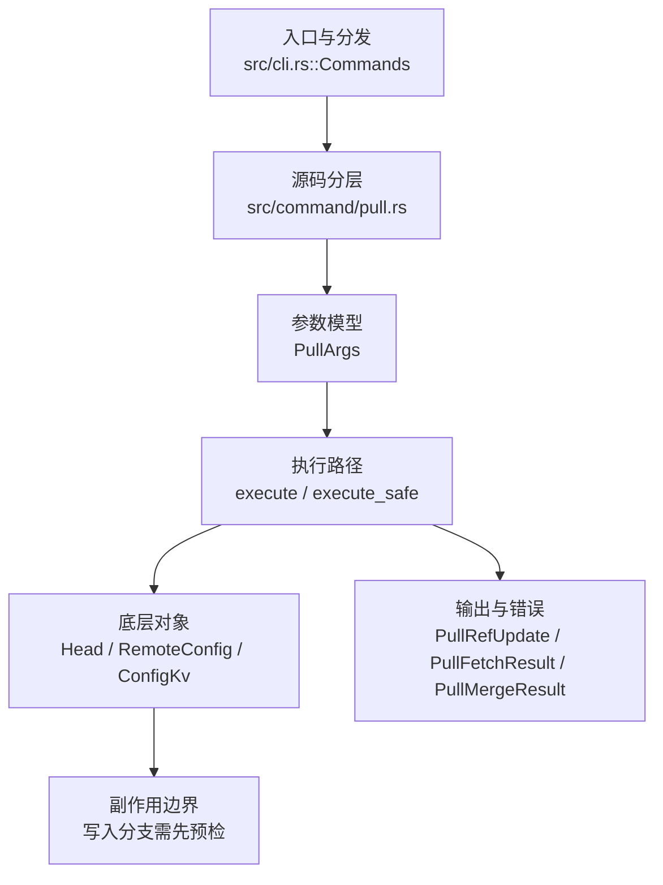

# `libra pull` 开发设计

## 命令实现目标

`libra pull` 的目标是先 fetch 再把远端变化整合进当前分支。实现需要支持 fast-forward、three-way merge、`--ff-only`/`--ff`/`--no-ff`/`--rebase`/`--no-rebase`、`pull.rebase`/`branch.<name>.rebase`/`pull.ff` 默认值、`--squash`/`--no-commit`/`--commit`、`--autostash` 与 fetch `--depth`（含本地 Libra upstream fail-closed 边界），并明确 octopus/自定义策略（`--strategy`/`-X`）的缺口。

## 对比 Git 与兼容性

- 兼容级别：`partial`。fetch + fast-forward/three-way merge supported; `--ff-only`、`--rebase`、`--no-rebase`（撤销先前的 `--rebase`，last-wins）、`--no-ff`、`--ff`、`pull.rebase`/`branch.<name>.rebase`/`pull.ff`、fetch `--depth`（Git shallow 协商路径支持；本地 Libra upstream 继承 fetch 的 `LBR-REPO-002` fail-closed）、`--squash`、`--no-commit`、`--commit` 与 `--autostash`（集成前 stash 已跟踪改动、之后 pop 回，复用 `stash::autostash_push`/`autostash_pop`，无需复杂状态机）exposed。配置默认值按 local → global → system 读取，变量名大小写不敏感；本地/全局加密值先解密；`pull.rebase=merges|interactive`（及 `m|i`）明确拒绝为 unsupported。无效或空值在 fetch/integration 前返回 `LBR-CLI-002`，本地/全局读取失败返回 `LBR-IO-001`，system scope 读取失败或不支持时跳过。

- 当前矩阵明确仍是部分兼容；未覆盖的 Git surface 必须显式列在“还未实现的功能”。

## 设计方案

- 入口与分发：已公开接入 `src/cli.rs::Commands`；已由 `src/command/mod.rs` 导出。CLI 层在 `src/cli.rs` 把解析后的参数交给命令模块，命令模块负责把领域错误转换为 `CliError` / `CliResult`。
- 源码分层：主要实现文件为 `src/command/pull.rs`。参数/子命令类型包括：`PullArgs`；输出、错误或状态类型包括：`PullRefUpdate`、`PullFetchResult`、`PullMergeResult`、`PullRebaseResult`、`PullOutput`、`PullError`；主要执行函数包括：`execute`、`execute_safe`。
- 执行路径：`execute_safe` 负责 CLI 安全包装、错误映射和输出配置；引用路径会读取或更新 SQLite refs、HEAD 与 reflog；网络路径会解析 remote 配置、协商协议并处理 pack/idx 数据。

- 流程图：以下流程图按当前源码分层展示主路径和底层对象边界，便于维护者把代码入口、执行函数和副作用范围对应起来。

- 底层操作对象：`Head`（SQLite 中的 HEAD 指向、当前分支和 detached 状态）；`RemoteConfig`（remote URL、refspec 和凭据配置）；`ConfigKv`（配置键值持久化行）
- 输出与错误契约：人类输出、`--json` / `--machine` 输出和 quiet/verbose 分支必须继续走现有 `OutputConfig` / `emit_json_data` / `CliError` 路径；新增失败模式要补稳定错误码、用户提示和回归测试。
- 配置 schema 保护（MIG-04，更新 P0-12 的 CLI preflight 描述）：dispatch 前通过 `utils::client_storage::inspect_configuration_schema_issues` 只读检查 GlobalConfig 与 SystemConfig 的角色化元数据。当前 manifest 已知的 Repository-only receipt 不造成配置 future；真正配置 future 或未注册／名称不匹配的 receipt 在命令需要该作用域时以 `LBR-CONFIG-001`（category `config`，exit 128）fail-closed。完整 process/repo-local storage 配置可使 GlobalConfig 不再必需（`cloud` 还需满足 D1 配置），但不能豁免 SystemConfig 问题。`--offline` 或 `LIBRA_READ_POLICY=offline|local` 仅用于明确的本地对象访问，warning 一次，不授权远端同步。诊断保留二进制路径／版本、配置 DB 路径、当前／支持版本和升级命令，并标明 scope/ledger/reason，不输出配置值、未信任 receipt 名称或 `vault.env.*` secret。回归测试：`compat_global_config_schema_future`。完整契约见 [config 设计](config.md)、[role map](../internal/database-migration-scope.md) 与[用户 pull 文档](../../commands/pull.md)；旧 Global helper 仍用于既有 cascade 路径，不代表 CLI preflight 仍是 Global-only。
- Hook 边界（P1-10）：merge 路径复用完整 merge lifecycle；rebase 路径在 fetch 后、本地 history/ref 改写前运行 required-sandbox `pre-rebase`，成功重写后运行 `post-rewrite rebase`。pull 的 child `OutputConfig` 在 parent quiet/JSON/machine 下保持静默，hook stdout/stderr 不得污染 parent envelope；无专用 `--no-verify`，仅由 `LIBRA_NO_HOOKS` 显式绕过。回归：`command_test::test_pull_rebase_runs_pre_rebase_before_moving_local_history`。
- 副作用边界：凡是写入索引、对象库、refs/HEAD、reflog、SQLite/D1、工作树或远端的路径，都必须先完成参数校验和 dry-run/预检分支，再执行持久化，避免部分写入后静默成功。

## 实现历史

- 2026-07-14（plan-20260708 P1-10）：pull merge/rebase 两条集成路径接入同一 sandboxed repository-hook lifecycle；补齐 `pull --rebase` 在本地历史移动前的 blocking pre hook、JSON child output 隔离与 HEAD 原子性回归。
- 本节依据本地 main 分支提交历史重写，筛选与该命令实现、测试或文档路径直接相关的提交；以下是归纳后的实现脉络。
- 2026-05-28 `c8c47040`（`feat(pull): add --rebase flag for diverged history`）：基础实现节点：add --rebase flag for diverged history；当前实现的主要轮廓可追溯到该提交。
- 2026-06-06 `0c7604f9`（`feat(pull): forward merge flags + depth, gate unsupported rebase strategies (#1388)`）：功能演进：forward merge flags + depth, gate unsupported rebase strategies (#1388)。该提交曾被一次 reconcile 误丢内容。2026-06-18 已恢复其中在当前（已分叉）merge 引擎上仍然适用的子集：`--no-ff`、`--ff` 与 fetch `--depth`。其后 `--squash` / `--commit` / `--no-commit`（透传到 `merge::PullMergeOptions`）与 `--autostash`（stash-before/pop-after，复用 `stash::autostash_*`）均已实现并公开，不再 deferred。
- 2026-07-09 P0-03：`pull --depth` 继续只透传到 fetch；当 upstream 是本地 Libra remote 时，fetch 在对象传输前返回 `LBR-REPO-002`，pull 不进入 merge/rebase 集成阶段。详见 `docs/development/commands/fetch.md`。
- 2026-05-30 `8e987801`（`feat(pull): support ff-only`）：功能演进：support ff-only；该节点扩展了当前命令可用的参数或行为。
- 2026-06-09 `17d26c76`（`fix(pull): avoid fast-forward hang from whole-worktree restore`）：实现修正：avoid fast-forward hang from whole-worktree restore；该节点把边界行为、错误处理或兼容差异纳入当前实现约束。
- 2026-06-01 `17be24e0`（`test(compat): pin pull --ff-only/--rebase surface and fix matrix row (v0.17.1215)`）：测试契约：pin pull --ff-only/--rebase surface and fix matrix row (v0.17.1215)；相关行为已有回归守卫，后续变更需要继续满足。
- 2026-07-10（plan-20260708 P1-05a）：`run_pull` 先解析当前分支，再合成 `EffectivePullOptions`。CLI 标志优先；未传 rebase 标志时按 local → global → system 读取的 `branch.<name>.rebase` 覆盖 `pull.rebase`；未传 ff 标志时 `pull.ff=true|false|only` 分别映射默认快进、强制 merge commit、仅快进。变量名大小写不敏感，本地/全局加密值会解密；`merges`/`interactive`（及短写）返回明确 unsupported 诊断。`--commit` 仅与 `--rebase`/`--squash` 冲突，和 `--no-commit` 按最后出现者生效；它可与三种 ff 策略组合且不自行覆盖快进策略。空值/无效配置返回 `LBR-CLI-002`，本地/全局读取失败返回 `LBR-IO-001`，system scope 读取失败或不支持时跳过，均在 fetch / merge / rebase 前完成。回归测试 `compat_config_defaults_semantics`、`compat_config_defaults_edge_cases` 覆盖真实 rebase、JSON 配置选中路径、CLI 覆盖、加密值、legacy fallback、system skip、转换分支和副作用边界。
- 2026-09-11（plan-20260903 MG-11）：merge 路径的 `PullMergeOptions` 不设置 CLI normalization override，因此真正三路合并继承 strict-cascade `merge.renormalize`，并贯穿 flat/incremental/recursive/rename/external-driver 内容路径；fast-forward/up-to-date 不读取。pull 不公开 `-X`。阶段性配置拒绝前 fetch 已可能更新对象与 remote-tracking ref；HEAD/index/worktree/merge state 仍未变。回归测试 `command::pull_test::test_pull_inherits_merge_renormalize_config`。
- 历史结论：当前文档应以这些提交之后的代码、测试和兼容矩阵为准；更早的迁移式文档只保留为背景，不再作为事实来源。

## 当前状态

- 公开状态：已公开；模块状态：已导出。
- 用户文档：`docs/commands/pull.md`。
- Synopsis：`libra pull [--ff-only] [--ff] [--no-ff] [--rebase] [--no-rebase] [--allow-unrelated-histories] [--depth <n>] [--squash] [--no-commit] [--commit] [--autostash] [--no-progress] [<repository> [<refspec>]]`。
- 公开参数/子命令包括：`[<repository>]`、`[<refspec>]`、`-r, --rebase`、`--no-rebase`、`--allow-unrelated-histories`、`--ff-only`、`--ff`、`--no-ff`、`--depth <n>`、`--squash`、`--no-commit`、`--commit`、`--autostash`、`--no-progress`。`--depth` 不在 pull 层实现浅历史，而是原样透传给 fetch；本地 Libra upstream 的 fail-closed 行为在 fetch 层发生，失败后不进入集成阶段。`--autostash` 在 fetch 之后、整合（merge/rebase）之前 stash 已跟踪改动（`stash::autostash_push`，无改动时返回 false 不 stash），整合完成（成功或失败）后再 `stash::autostash_pop` 回；为此 `run_pull` 把整合结果捕获为 `integrate_result` 以便失败时也能先 pop 再传播错误。pop 失败映射为 `PullError::Autostash`，提示用 `libra stash pop` 恢复。`--no-progress` 把进度抑制转发给 fetch：`run_pull` 用 `fetch::apply_no_progress` 把传给 fetch 的 child output 的 `progress` 强制为 `ProgressMode::None`，从而抑制 fetch 的 “Receiving objects” 进度条，对齐 `git pull --no-progress`。`--no-rebase`（经 clap `overrides_with` 与 `-r`/`--rebase` 互为最后一个生效）选择 merge 路径并覆盖 `pull.rebase`；CLI 未指定 rebase/ff 行为时，`branch.<name>.rebase`、`pull.rebase` 与 `pull.ff` 按 local → global → system 级联参与合成有效选项；无效/空值在任何 fetch 或集成副作用前失败。
- `--commit`：提交 merge 结果；与 `--no-commit` 互为 last-one-wins（命令行最后出现者生效），与 `--squash`/`--rebase` 冲突。它可与 `--ff`/`--no-ff`/`--ff-only` 组合且不自行覆盖快进策略；`--ff-only` 也可与 `--squash`/`--no-commit` 组合，对齐 Git 的参数表面。配置选中的 rebase 会在成功 JSON 中表现为 `data.rebase`，即使命令行没有 `--rebase`；有效 rebase 不读取 merge-only 的 `pull.ff`。
- 无 upstream 的 `libra pull`：保留 `LBR-REPO-003` / exit 128，但 human stderr 使用 Git 风格 advisory block（无 `error:` 前缀），包含 `libra pull <remote> <branch>` 和 `libra branch --set-upstream-to=...`；当且仅当配置里只有一个 remote 时，set-upstream 示例使用该 remote 名，否则保留 `<remote>/<branch>` 占位。
- 本地 upstream（`branch.<name>.remote=.`，由 HF-07 的 `branch -u` 写入）：在解析到跟踪配置后、查找 `remote.<name>` / 建立连接之前零写入拒绝，`LBR-CLI-003` / exit 129，文案指向 issues/480 HP-16（HF-30 / ADR-HF-08 第 4 条）。显式 `libra pull .` 仍报 `remote '.' not found`。Git 2.54 的 `pull` 可用，属有意差异（DEFER-08）。

## 还未实现的功能

| 类别 | 未完成项 | 当前处理 |
|---|---|---|
| ✅ 已实现 | `--ff-only` / `-r,--rebase` / `--no-rebase` / `--ff` / `--no-ff`、`--allow-unrelated-histories`、fetch `--depth`、`--squash`、`--no-commit`、`--commit` 已公开并生效（`--no-ff` 强制生成 merge commit，`--depth` 透传到 fetch 浅历史；本地 Libra upstream 由 fetch fail-closed，`--squash` 暂存合并树但不提交、不移动 HEAD，`--no-commit` 合并后暂停并记录 merge state 由 `libra merge --continue` 收尾，`--commit` 强制提交、与 `--no-commit` last-one-wins） | `--squash` / `--no-commit` 透传到 `merge::PullMergeOptions`；`--commit` 通过 clap `overrides_with` 清除 `--no-commit`（无新逻辑，merge 路径仍读 `no_commit`），带单元测试（`commit_flag_conflicts_and_last_one_wins`）。 |
| ✅ 已实现 | Autostash `--autostash` | 集成前 stash 已跟踪改动、之后 pop 回（复用 `stash::autostash_push`/`autostash_pop`，无需复杂状态机）；整合失败时也先 pop 再传播。带集成测试 `pull_autostash_flag_is_accepted`（编排端到端依赖 remote，归 L2）。 |
| ✅ 已实现 | `--notes`（lore.md 3.2，导入依赖图） | `PullArgs.notes` 透传到 `fetch::fetch_repository_with_result` 的 `notes` 参数，复用 fetch 的 `refs/notes/deps` 旁路导入（本地 Libra 源、default OFF、network/foreign 延后 D17）。详见 `docs/development/commands/fetch.md` 的 `--notes` 项。 |
| ✅ 已实现 | `pull.rebase` / `branch.<name>.rebase` / `pull.ff` 默认值 | CLI 标志优先；配置按 local → global → system 级联读取且变量名大小写不敏感；本地/全局加密值先解密；未传 rebase 标志时分支级 `branch.<name>.rebase` 覆盖 `pull.rebase`；未传 ff 标志时 `pull.ff=only` 等价 `--ff-only`，`pull.ff=false` 等价 `--no-ff`，`pull.ff=true` 保持快进默认；有效 rebase 不读取 merge-only 的 `pull.ff`。`merges`/`interactive`（及短写）明确 unsupported；空值/无效值返回 `LBR-CLI-002`，本地/全局读取失败返回 `LBR-IO-001`，system scope 失败/不支持时跳过，均在 fetch 前完成；显式 mode 冲突和 JSON 配置选中 rebase 有回归覆盖。 |

## 维护要求

- 改进本命令前，必须先阅读并遵循 [docs/development/commands/_general.md](_general.md)；这是命令设计、实现、测试和文档同步的强制要求。
- 任何行为变更都要先核对实现源码，再同步 `COMPATIBILITY.md`、`docs/commands/<cmd>.md` 和相关测试。
- 新增 Git 兼容参数时必须明确 tier、错误码、JSON/机器输出契约和回归测试。

## pkt-line boundary classification

The `pull` boundary maps detected pkt-line errors to `LBR-NET-002`, including
empty HTTP(S) discovery advertisements. Match `GitError::NetworkError(detail)`
using the shared `PKT_LINE_PROTOCOL_ERROR_PREFIX` on the raw detail, before
timeout or host-key heuristics. Object-transfer IO carriers, plus the
clone/ls-remote/pull discovery IO carriers, use `fetch::is_pkt_line_io_error`,
which compares a bounded Display prefix without allocating a second complete
message. Marker matching itself is O(prefix length); normal user-message
formatting still costs O(message length). Never classify using a formatted outer
error, a remote URL, case folding, trimming, or a substring search.

The fetch phase uses this classification for discovery and object-transfer
setup. A truncated header or payload while reading the fetch stream returns
`LBR-NET-002` with no extra CLI hint; an incomplete pack at a clean frame boundary
retains its byte count and `the connection dropped mid-transfer — retry the pull`
hint. A packet-read connection reset is `LBR-NET-001`. These errors keep
`details.phase = "fetch"` in JSON output.

An upload-pack EOF at a frame boundary before pack data begins, including a
zero-byte POST response, returns `LBR-NET-001` with
`check network connectivity and retry`. An empty discovery advertisement remains
`LBR-NET-002`.

Marker discovery/transfer-setup errors use the exact `check that the remote serves Git data and that a proxy has not altered the response`
hint. Non-marker network failures retain `LBR-NET-001`; clone discovery's ordinary
IO errors retain `LBR-IO-001`. Authentication, local metadata errors and existing
non-marker host-key handling follows the SSH section below. Other untyped discovery parsing
errors retain existing classification (DEFER-04). Shared strict ASCII-hex
validation and Git/SSH reader propagation are described below.

The default tests exercise all command conversions with raw carriers and parser
errors, preserve the fetch PacketRead no-hint contract, and prove empty
advertisements reach all four actual command handlers. The clone transfer case
checks both discovery requests and a POST containing the advertised wanted OID.
Its local HTTP fixture runs the production HttpsClient path; it does not exercise
TLS negotiation or certificate validation.

The prefix sink avoids allocating a full Display output itself; the Display
implementation (including OS-error formatting) or earlier diagnostic redaction
may still allocate. The two HTTP fixtures use a two-worker Tokio runtime so
synchronous configuration lookup does not stop the cached pool and server.

## Git and SSH advertisement frame boundaries

The Git/SSH pkt-line advertisement readers reject declared lengths `0001` through
`0003`, incomplete four-byte headers, and EOF inside a declared payload. Flush
`0000`, empty-payload `0004` and maximum-size `ffff` frames retain their behavior.
Their typed pkt-line errors classify as `LBR-NET-002` at the reader boundary;
ordinary transport IO and idle timeouts remain `LBR-NET-001` when classified.

During the `git://` object-fetch advertisement, fetch, clone and pull already
report these failures as `LBR-NET-002`, including a zero-byte advertisement. The
hint is `check that the remote serves Git data and that a proxy has not altered the response`.
Lengths 1–3 previously could panic; truncated advertisements previously returned
`LBR-NET-001` with a network/transfer hint. Git discovery now preserves these protocol errors through the command boundary.
SSH propagation and bounded cleanup are described below. All readers require
four ASCII hexadecimal header digits.

This advertisement is distinct from an upload-pack response after negotiation:
HTTP(S) discovery framing and empty upload-pack response classifications are unchanged.
Reader tests exercise local TCP object-fetch advertisements and public error
conversions. Separate command tests exercise malformed Git discovery and SSH
cleanup with local fixtures, not live OpenSSH authentication. Check the remote
Git service or proxy for malformed frames.

## SSH advertisement error handling

SSH advertisement lengths `0001` through `0003`, incomplete headers (including
zero-byte EOF), and truncated payloads return `LBR-NET-002`. The fixed protocol
reason and marker are retained without captured SSH stdout/stderr.

An incomplete required header has one host-trust exception: local SSH exit status
255 together with a recognized host-key diagnostic in the first 64 KiB of stderr
returns fixed host-verification guidance and `LBR-NET-001`. This classification
does not verify the remote fingerprint. Other missing advertisements, including
authentication failures, still use `LBR-NET-002`; an available non-zero local exit
status adds `SSH exited with status N` and fixed connectivity, trusted-host,
ssh-agent and repository-access guidance. Original SSH diagnostic text is hidden.

After an incomplete required header, Libra allows up to 100 milliseconds to
observe the SSH exit status, then requests termination if needed. Other read
errors request termination immediately. The status window, direct-child reap and
output collection share a two-second cleanup deadline. Protocol and typed
host-trust errors take precedence over secondary cleanup warnings. Ordinary IO
and timeout errors keep their transport classification and may include a fixed
local cleanup warning. Termination can change the observed exit status. This
does not promise cleanup of arbitrary descendant processes.

Clone places targeted host-verification guidance in its structured hints. The
other command boundaries retain fixed host guidance in the message and their
existing `LBR-NET-001` network hint. Human, JSON and machine diagnostics omit raw
captured remote stderr in either case.

The `git://` discovery and object-fetch paths preserve the listed frame errors as
`LBR-NET-002`. All asynchronous readers reject non-ASCII/non-hexadecimal headers
with fixed protocol reasons. HTTP(S) discovery/advertisement framing is unchanged.

## SSH authentication and captured diagnostics

Libra invokes SSH with `BatchMode=yes` for both terminal and non-terminal callers.
It does not prompt for a private-key passphrase or an interactive host-key
decision during a Libra command. Load or unlock an encrypted key in `ssh-agent`
before retrying. For host trust, verify the fingerprint through a trusted
provider console or another trusted channel before manually updating
`~/.ssh/known_hosts`. Alternatively, make a separate interactive SSH connection
and compare the displayed fingerprint before accepting it. For example,
`ssh -T git@github.com` uses GitHub; use the actual repository SSH user, host and
port. Do not accept a fingerprint that has not been verified.

`ssh.strictHostKeyChecking` retains its existing `ask`, `yes`, `accept-new` and
`no` values. `ask` leaves that SSH option to the user's SSH configuration;
`BatchMode=yes` still prevents interactive decisions. Explicit values are
forwarded to SSH. Choose a host-trust policy appropriate to your repository.

SSH stderr is always captured, including in terminal sessions. It is drained
from process startup, retaining at most 64 KiB while counting and hashing the
remaining bytes. User-facing errors contain fixed text and a local exit status
when available. Raw remote stderr is neither printed nor logged. Debug diagnostics
contain only the status, total and retained byte counts, and a SHA-256 digest of
the collected stream. Failed or cancelled collection may prevent these metadata
from being reported; no completed digest is claimed in that case. Hashing work
is proportional to the number of bytes drained.

SSH reference advertisements and receive-pack responses each have a 16 MiB
aggregate limit. An oversized advertisement fails with `LBR-NET-001` and guidance
to use the repository’s HTTPS URL if available, or ask its maintainer to reduce refs. An oversized push response fails with `LBR-NET-001`
and guidance to push fewer refs; it is not accepted as a truncated success.
These limits can affect repositories with very large ref sets or updates. The
streamed fetch pack is not subject to this cap. A failed push response does not
prove that the server rolled back its refs: inspect the remote state before
retrying. Existing IO timeouts still apply.

After a complete discovery advertisement, Libra allows up to 100 milliseconds
for SSH to exit before requesting termination, within a two-second total
cleanup deadline. Captured-output tasks are cancelled when their owner exits or
their deadline expires, including when a descendant keeps a pipe open.

## SSH capture validation scope

The twelve named PKT-11 library gates retain the original plan names. They cover
fixed diagnostics and metadata-only tracing, both service argument lists, three
non-zero-exit paths, malformed-advertisement cleanup and all six capture paths
under stderr floods. The flood gate also covers retained-prefix/full-stream
digest accounting, collector cancellation, and oversized advertisement and push
response rejection. The host-trust gate covers native exit 255, typed primary
error preservation through a secondary cleanup warning, the internal discovery
carrier and an actual local fake-SSH clone command. Existing fetch/push CLI cases
retain their names and test human, JSON and machine output plus remote-ref safety.
The terminal gate uses a real local PTY. The passphrase gate creates an encrypted
local key without an agent and exercises a simulated SSH failure; it does not
claim live OpenSSH network authentication. Actual run IDs and results belong in
plan-20260901.md after execution; the existence of these tests is not acceptance.

### SSH host identity and diagnostic collection

SSH host identity changes retain a distinct fixed warning: the change may
indicate interception or legitimate key rotation. Verify the new fingerprint
through a trusted channel before replacing an existing known_hosts entry; do not
bypass host-key checking. Unknown and changed host keys both use LBR-NET-001,
but their fixed messages and guidance differ.

A stderr collection timeout does not by itself discard complete protocol output
and an observed local exit status. Non-zero exit status and primary read errors
still fail the operation. Unavailable diagnostics produce only a fixed debug
notice, without fabricated empty-stream counts or digests. Stdout collection or
process-wait failures retain their normal error handling.

### SSH limits and host-classification boundaries

These fixed 16 MiB advertisement and receive-pack response limits apply only to
Libra's SSH transport. The HTTPS and Git transports do not impose this particular
cap. If the server provides an HTTPS endpoint, use its HTTPS remote URL when an
SSH advertisement exceeds the cap; this does not require a read-only user to
change the server's refs. Otherwise, ask the repository maintainer to reduce the
advertised ref set. The streamed fetch pack remains outside this aggregate cap.

Host-trust classification requires an incomplete first header with no stdout
bytes observed, local exit 255 and a recognized retained stderr pattern. Once
any stdout byte arrives, including a partial header, host-like stderr cannot
select host-specific guidance. Failures after a complete advertisement retain
fixed generic diagnostics. The pre-advertisement pattern remains a diagnostic
heuristic, not fingerprint verification.

A successful discovery whose child waits for a request normally incurs the full
100 ms native-exit observation window, once per discovery operation. This is
separate from the two-second direct-child cleanup budget; no benchmark or
arbitrary-descendant cleanup guarantee is implied.

## Strict pkt-line headers

A pkt-line header must contain exactly four ASCII hexadecimal digits (`0`–`9`,
`a`–`f` or `A`–`F`). Fetch streaming, `git://` advertisements and SSH advertisements
reject leading signs such as `+004`, whitespace, non-hexadecimal text and invalid
UTF-8. These failures return `LBR-NET-002` (exit 128), with fixed reasons that do
not echo the header or payload. A peer that previously sent a signed or otherwise
nonconforming header must send four hexadecimal digits before retrying.

Git discovery also preserves protocol classification for lengths `0001`–`0003`,
missing or partial required headers and truncated payloads. The same discovery
classification reaches clone, fetch, pull, ls-remote and push. Check the remote
Git service or proxy response. Their existing structured error fields remain;
push retains its own protocol hint and the other commands retain theirs.

Flush `0000`, empty-data `0004` and maximum-length `ffff` frames keep their existing
meaning. Ordinary network errors and timeouts retain their existing categories.
An empty fetch data stream before any complete pack remains a network failure;
EOF after a completed pack keeps the existing success behavior. The SSH host-trust
exception, captured-diagnostic limits and cleanup deadlines described above remain.

## Header validation scope

The ten named PKT-13 gates retain the plan's original names. The shared header
decoder is used by the synchronous parser and all three asynchronous readers;
the bounded IO marker classifier has one implementation in `git_protocol`, with
a crate-visible fetch re-export for existing callers. Synchronous failure still
leaves the input untouched. Four-byte validation does constant work without
allocating or rendering peer bytes. Existing allocation and buffering behavior
is unchanged: SSH advertisements retain their 16 MiB cap; Git TCP advertisements
have no total-size cap.

Direct reader fixtures cover strict UTF-8/ASCII-hex errors, valid case variants,
flush/empty/maximum frames and typed CLI conversion. The Git discovery gate uses
14 malformed byte sequences across five real `execute_safe` command paths (70
cases), checking the service request, protocol reason, exact command hint, all
three renderings and tracking-ref safety. The server tasks and listeners are
bounded and cancelled on drop. Another gate exercises a real idle TCP peer to
preserve the ordinary network wrapper. Fetch no-echo and empty-stream cases use
`read_fetch_stream`; they are not fabricated marker-only errors. No new Cargo
target or shared test helper is introduced. These are local fixtures, not live
OpenSSH authentication;
actual execution and release acceptance are recorded in plan-20260901.md.

## Empty-repository discovery framing

An HTTP(S) advertisement that declares an empty repository still has all remaining
pkt-line frames checked. A malformed header, an unsupported length 1..3, or a truncated
payload after the zero object ID returns `LBR-NET-002` (exit 128), with a fixed
reason that does not echo the remote bytes. It is no longer reported as a
successful empty response. Check the remote Git service or proxy response before
retrying. Valid empty repositories, supported SHA-1/SHA-256 advertisements,
existing command hints and structured error fields retain their behavior.

This check reuses the shared pkt-line reader only before the zero-object-ID
early return. It preserves capability validation and earlier error precedence.
Each successful iteration consumes at least four bytes of the already buffered
response; work is linear in the remaining frames, using byte slices without
copying their payloads. Existing HTTP body buffering and transport limits are
unchanged. This is framing validation, not a new advertisement content grammar:
a missing final flush at a frame boundary and well-framed semantically unused
tail data retain their existing treatment. Git/SSH readers already validate the
framing of the advertisement buffer before calling the shared parser.

## Issue #477 notes

本地 upstream（remote=.）fail-closed
