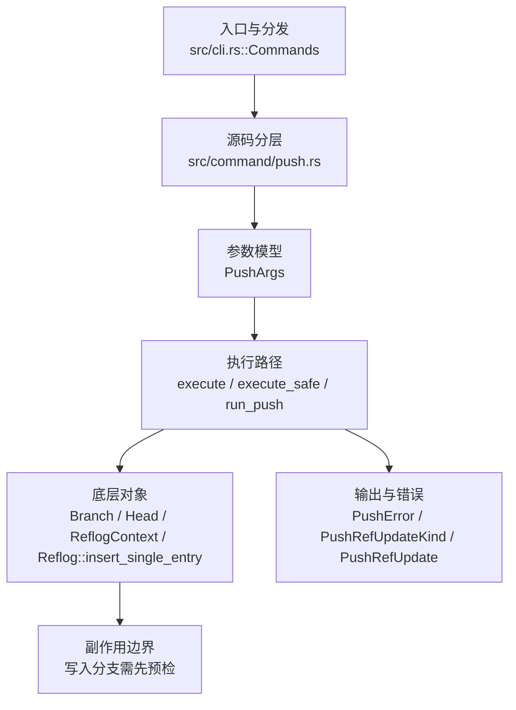

# `libra push` 开发设计

## 命令实现目标

`libra push` 的目标是把本地 branch/tag 更新和相关对象发送到远端。实现需要覆盖多 refspec、delete、`--tags`、`--mirror`、dry-run、force 和本地 file remote 的有意拒绝。

## 对比 Git 与兼容性

- 兼容级别：`partial`。branch/tag update, multi-refspec, delete (`-d`/`--delete` 或 `:<ref>` refspec), `--tags`, and `--mirror` supported; `--force-with-lease[=<ref>[:<expect>]]`（发送前校验远端仍匹配 tracking-ref/expected OID，与 `--force` 互斥）和 `--porcelain`（机器可读的每 ref 行，与 `--json`/`--machine` 互斥）supported；`--atomic` supported（经 `resolve_atomic_capability` 在远端 discovery 通告 `atomic` 时附加该 capability，使远端要么全部更新要么全部不更新；远端未通告则提前以 `PushError::AtomicUnsupported` 拒绝）；`--push-option`/`-o <opt>` supported（经 `resolve_push_options_capability` 在远端通告 `push-options` 时附加 capability + 在命令 flush 后经 `encode_push_options` 追加 push-options 段；未通告则 `PushError::PushOptionsUnsupported`）；`--follow-tags` supported（经 `collect_follow_tag_refs`：列出 annotated tag，其 target 经 `is_ancestor` 可达任一被推送 ref 的 tip 且远端缺失时，由 `follow_tag_should_push` 选中并加入推送计划）；`--signed` supported（经 `resolve_push_cert_nonce` 在远端通告 `push-cert[=<nonce>]` 时取 nonce，`build_push_certificate` 构造 `certificate version 0.1` 文本，复用 vault `pgp_sign`/`signature_to_armored` 签名，`encode_push_cert_section` 以 `push-cert\0<caps>` … `push-cert-end` 帧封装；未通告则 `PushError::PushSignUnsupported`，无签名密钥则 `PushSignNoKey`）；`--no-progress` supported（经 `progress_output_config(output, args.no_progress)` 在 `--no-progress` 时把传给 “Compressing objects”/“Writing objects” `ProgressReporter` 的 output 的 `progress` 强制为 `ProgressMode::None`，抑制进度条，对齐 `git push --no-progress`）；`--force-if-includes`、`--thin`/`--no-thin` 与 `--no-verify`（Git 兼容接受入口；Libra 的 push 不运行客户端 `pre-push` hook，且 Git hooks bridge 按 D3 拒绝，故无可绕过）作为 **no-op** 接受。local file remote rejected — intentional (see [docs/development/commands/_compatibility.md#d2-本地-file-remote-的-push](docs/development/commands/_compatibility.md#d2-本地-file-remote-的-push))

- 当前矩阵明确仍是部分兼容；未覆盖的 Git surface 必须显式列在“还未实现的功能”。

## 设计方案

- 入口与分发：已公开接入 `src/cli.rs::Commands`；已由 `src/command/mod.rs` 导出。CLI 层在 `src/cli.rs` 把解析后的参数交给命令模块，命令模块负责把领域错误转换为 `CliError` / `CliResult`。
- 源码分层：主要实现文件为 `src/command/push.rs`。参数/子命令类型包括：`PushArgs`；输出、错误或状态类型包括：`PushError`、`PushRefUpdateKind`、`PushRefUpdate`、`PushOutput`；主要执行函数包括：`execute`、`execute_safe`、`run_push`。
- 源码意图：源码模块注释说明该命令读取 remote 配置、与服务器协商，并发送本地 refs 与 pack 数据完成远端更新。
- 执行路径：`execute_safe` 负责 CLI 安全包装、错误映射和输出配置；核心领域逻辑集中在 `run_push`；对象路径会解析 revision 并读写 blob/tree/commit/tag 等对象；引用路径会读取或更新 SQLite refs、HEAD 与 reflog；网络路径会解析 remote 配置、协商协议并处理 pack/idx 数据；数据库路径会通过 SeaORM/SQLite 或 D1 客户端持久化元数据。
- 对象裁剪：`collect_advertised_haves` 读取 discovery 的全部 refs，仅把本地能解析并加载的 OID 作为共享 negative haves；commit tips（包括 annotated tag 的 peeled `^{}` ref）以一次多源遍历形成可达历史边界，direct advertised object 也可复用。未知/本地缺失的 OID 被忽略以保持保守发送。新 ref 指向已通告 commit 时对象数为零，但真实 receive-pack 仍收到 hash-kind 正确的 pack v2 空包（SHA-1 32 字节、SHA-256 44 字节）；`test_push_multi_refspec_delete_tags_and_mirror_dry_run` 钉住真实服务端往返，`advertised_haves_*` 单测覆盖同 tip、后代 delta、annotated tag、未知 have 与两种空包 checksum。

- 流程图：以下流程图按当前源码分层展示主路径和底层对象边界，便于维护者把代码入口、执行函数和副作用范围对应起来。

- 底层操作对象：SSH transport（SSH remote 连接和认证）；pack / idx 对象（传输包、索引、delta 和完整性校验）；`Branch` / branch store（SQLite refs 上的分支读写、过滤和上游关系）；`Head`（SQLite 中的 HEAD 指向、当前分支和 detached 状态）；`ReflogContext` / `Reflog::insert_single_entry`（在数据库事务内直接写入 SQLite reflog 和动作记录）；`Commit`（提交对象、父提交关系和提交消息载荷）；`Tree`（由索引或对象遍历生成的目录树对象）；`Blob`（文件内容或 LFS pointer 写入对象库后的 blob 对象）；`TreeItem` / `TreeItemMode`（tree 中的路径项和 mode）；SeaORM / `.libra/libra.db`（配置、refs、reflog、AI/发布元数据等 SQLite 表）；`ObjectHash`（SHA-1/SHA-256 对象 ID 和 revision 解析结果）；`ConfigKv`（配置键值持久化行）
- 输出与错误契约：人类输出、`--json` / `--machine` 输出和 quiet/verbose 分支必须继续走现有 `OutputConfig` / `emit_json_data` / `CliError` 路径；新增失败模式要补稳定错误码、用户提示和回归测试。
- 配置 schema 保护（MIG-04，更新 P0-12 的 CLI preflight 描述）：dispatch 前通过 `utils::client_storage::inspect_configuration_schema_issues` 只读检查 GlobalConfig 与 SystemConfig 的角色化元数据。当前 manifest 已知的 Repository-only receipt 不造成配置 future；真正配置 future 或未注册／名称不匹配的 receipt 在命令需要该作用域时以 `LBR-CONFIG-001`（category `config`，exit 128）fail-closed。完整 process/repo-local storage 配置可使 GlobalConfig 不再必需（`cloud` 还需满足 D1 配置），但不能豁免 SystemConfig 问题。`--offline` 或 `LIBRA_READ_POLICY=offline|local` 仅用于明确的本地对象访问，warning 一次，不授权远端同步。诊断保留二进制路径／版本、配置 DB 路径、当前／支持版本和升级命令，并标明 scope/ledger/reason，不输出配置值、未信任 receipt 名称或 `vault.env.*` secret。回归测试：`compat_global_config_schema_future`。完整契约见 [config 设计](config.md)、[role map](../internal/database-migration-scope.md) 与[用户 push 文档](../../commands/push.md)；旧 Global helper 仍用于既有 cascade 路径，不代表 CLI preflight 仍是 Global-only。
- 副作用边界：凡是写入索引、对象库、refs/HEAD、reflog、SQLite/D1、工作树或远端的路径，都必须先完成参数校验和 dry-run/预检分支，再执行持久化，避免部分写入后静默成功。

## 实现历史

- 本节依据本地 main 分支提交历史重写，筛选与该命令实现、测试或文档路径直接相关的提交；以下是归纳后的实现脉络。
- 2025-11-27 `a4e9881b`（`feat: add force push support to push command (#69)`）：基础实现节点：add force push support to push command (#69)；当前实现的主要轮廓可追溯到该提交。
- 2026-06-07 `6b11a315`（`feat(push): add atomic push safety`）：功能演进：add atomic push safety；该节点新增的 `--atomic` 等 flag 已在后续提交回退，当前 `PushArgs` 不再公开。
- 2026-06-06 `e507dc57`（`feat(push): add --force-with-lease, --porcelain, and no-op compat flags (#1389)`）：功能演进：add --force-with-lease, --porcelain, and no-op compat flags (#1389)；该节点新增的 `--force-with-lease` / `--porcelain` / `--force-if-includes` / `--thin`/`--no-thin` 等 flag 曾被一次 reconcile 丢失内容，已于 2026-06-18 恢复到当前代码（lease 校验 + porcelain 输出 + no-op 兼容 flag），`PushArgs` 重新公开这些参数。
- 2026-05-29 `3a4990e8`（`fix(push): set upstream for up-to-date refspec`）：实现修正：set upstream for up-to-date refspec；该节点把边界行为、错误处理或兼容差异纳入当前实现约束。
- 历史结论：当前文档应以这些提交之后的代码、测试和兼容矩阵为准；更早的迁移式文档只保留为背景，不再作为事实来源。

## 当前状态

- 公开状态：已公开；模块状态：已导出。
- 用户文档：`docs/commands/push.md`。
- Synopsis：`libra push [OPTIONS] [<repository> [<refspec>...]]`。
- 公开参数/子命令包括：`[<repository>]`、`[<REFSPEC>...]`、`-u, --set-upstream`、`-f, --force`、`-d, --delete`、`--force-with-lease[=<ref>[:<expect>]]`、`--force-if-includes`、`--thin`、`--no-thin`、`--no-verify`（Git 兼容接受入口；接受式 no-op，字段 `no_verify` 解析后不被读取，Libra 的 push 不运行客户端 `pre-push` hook，且不支持 `.git/hooks` / `core.hooksPath` bridge）、`--no-progress`（**实际生效**：经 `progress_output_config` 把进度 output 强制为 `ProgressMode::None`，抑制 “Compressing/Writing objects” 进度条）、`--porcelain`、`-n, --dry-run`、`--tags`、`--mirror`。`-d`/`--delete` 在 `execute_safe` 入口经纯函数 `apply_delete_flag` 把每个位置 REFSPEC（须为不含 `:` 的纯 ref 名）改写为 `:<ref>` 删除请求，复用既有删除路径；缺少 ref、含 `:` 的 refspec、或与 `--set-upstream`/`--tags`/`--mirror` 组合均报错。

## 还未实现的功能

| 类别 | 未完成项 | 当前处理 |
|---|---|---|
| 边界 | `--signed` 与 `-o`/`--push-option` 同时使用 | push 证书段取代普通命令段，故 signed 路径暂不另发 push-options 段（罕见组合）；如需可后续把 push-option 行并入证书。 |
| 运行期校验 | push-cert 线格式的真实服务端往返 | `build_push_certificate`/`encode_push_cert_section` 已按 git pack-protocol 实现并单测（证书文本 + 帧字节 + capability 门控），实际服务端接受属 L2（需支持 push-cert 的服务器）。 |

（push 标志全部已实现：`--atomic`/`--push-option`(`-o`)/`--follow-tags`/`--signed`。`resolve_atomic_capability`/`resolve_push_options_capability`/`resolve_push_cert_nonce` 在远端 discovery 通告对应 capability 时附加，未通告则以 `PushError::AtomicUnsupported`/`PushOptionsUnsupported`/`PushSignUnsupported` 拒绝；push-options 段经 `encode_push_options`、push-cert 段经 `encode_push_cert_section` 写入；`--follow-tags` 经 `collect_follow_tag_refs` + `is_ancestor` + `follow_tag_should_push`。）

## 维护要求

- 改进本命令前，必须先阅读并遵循 [docs/development/commands/_general.md](_general.md)；这是命令设计、实现、测试和文档同步的强制要求。
- 任何行为变更都要先核对实现源码，再同步 `COMPATIBILITY.md`、`docs/commands/<cmd>.md` 和相关测试。
- 新增 Git 兼容参数时必须明确 tier、错误码、JSON/机器输出契约和回归测试。

## pkt-line protocol errors

Malformed pkt-line frames in HTTP(S) reference discovery, or in receive-pack
status responses over HTTP(S) or SSH, fail with `LBR-NET-002`. An absent HTTP(S) discovery advertisement also
uses `LBR-NET-002`. These errors have a fixed `pkt-line protocol error: ` reason
and do not include the malformed header or payload. Check the remote Git service
and any proxy that may truncate or replace its response, then retry. Other
discovery connectivity failures and transport configuration errors retain
`LBR-NET-001`; authentication and timeout handling retain their existing behavior.

## Receive-pack status reports

An unexpected receive-pack status line returns `LBR-NET-002` (exit 128), with
`pkt-line protocol error: unexpected receive-pack status line`. The diagnostic
does not echo that status line. Every report must reach an explicit `0000`
flush before its unpack/ref statuses are interpreted. An empty response or EOF
before that flush returns `LBR-NET-002` with the fixed reason
`missing receive-pack status flush`, including truncated unpack/`ng` rejections.
Both cases use `check the remote Git service or proxy response and retry`.

Ordinary transport failures retain `LBR-NET-001`. Completely framed server-declared unpack failures
and `ng` ref rejections retain `LBR-NET-002` with their existing server-log or
branch-protection hints; valid `ng` reasons remain visible. Local remote-tracking
refs are updated only after successful status validation. A failed response
does not prove the server rolled back its refs: inspect the remote state before
retrying an update.

The status parser first checks framing through the first explicit flush, using
the shared pkt-line reader over a zero-copy Bytes clone. It rejects exhaustion
before that flush even when an unpack/`ng` status would otherwise return early.
The standalone reader empty-buffer behavior and trailing-byte handling after
the first flush remain unchanged. The extra scan takes O(frame count) work
without copying payloads or collecting another response buffer; existing
semantic parsing still scales with response size. The unexpected-line diagnostic
uses the shared marker and a fixed reason; existing `ng` parsing/rendering rules
belong to PKT-14.

Four named PKT-09 library gates cover the error variant, the updated locked
expectation, status-code consistency, omitted flush and zero-echo rendering.
The local HTTP receive-pack fixture exercises actual push discovery and POST
through HttpsClient, submits a delete-only transaction, checks its old/zero OIDs
and ref name, and verifies malformed responses leave the local tracking ref
unchanged. It uses a temporary repo, a two-worker Tokio runtime, scoped local
storage selection, a bounded request body, command timeout and server shutdown.
It is not a TLS or real SSH integration test.

## SSH advertisement error handling

SSH advertisement lengths `0001` through `0003`, incomplete headers (including
zero-byte EOF), and truncated payloads return `LBR-NET-002`. The fixed protocol
reason and marker are retained without captured SSH stdout/stderr.

An incomplete required header has one host-trust exception: local SSH exit status
255 together with a recognized host-key diagnostic in the first 64 KiB of stderr
returns fixed host-verification guidance and `LBR-NET-001`. This classification
does not verify the remote fingerprint. Other missing advertisements, including
authentication failures, still use `LBR-NET-002`; an available non-zero local exit
status adds `SSH exited with status N` and fixed connectivity, trusted-host,
ssh-agent and repository-access guidance. Original SSH diagnostic text is hidden.

After an incomplete required header, Libra allows up to 100 milliseconds to
observe the SSH exit status, then requests termination if needed. Other read
errors request termination immediately. The status window, direct-child reap and
output collection share a two-second cleanup deadline. Protocol and typed
host-trust errors take precedence over secondary cleanup warnings. Ordinary IO
and timeout errors keep their transport classification and may include a fixed
local cleanup warning. Termination can change the observed exit status. This
does not promise cleanup of arbitrary descendant processes.

Clone places targeted host-verification guidance in its structured hints. The
other command boundaries retain fixed host guidance in the message and their
existing `LBR-NET-001` network hint. Human, JSON and machine diagnostics omit raw
captured remote stderr in either case.

The `git://` discovery and object-fetch paths preserve the listed frame errors as
`LBR-NET-002`. All asynchronous readers reject non-ASCII/non-hexadecimal headers
with fixed protocol reasons. HTTP(S) discovery/advertisement framing is unchanged.

## SSH authentication and captured diagnostics

Libra invokes SSH with `BatchMode=yes` for both terminal and non-terminal callers.
It does not prompt for a private-key passphrase or an interactive host-key
decision during a Libra command. Load or unlock an encrypted key in `ssh-agent`
before retrying. For host trust, verify the fingerprint through a trusted
provider console or another trusted channel before manually updating
`~/.ssh/known_hosts`. Alternatively, make a separate interactive SSH connection
and compare the displayed fingerprint before accepting it. For example,
`ssh -T git@github.com` uses GitHub; use the actual repository SSH user, host and
port. Do not accept a fingerprint that has not been verified.

`ssh.strictHostKeyChecking` retains its existing `ask`, `yes`, `accept-new` and
`no` values. `ask` leaves that SSH option to the user's SSH configuration;
`BatchMode=yes` still prevents interactive decisions. Explicit values are
forwarded to SSH. Choose a host-trust policy appropriate to your repository.

SSH stderr is always captured, including in terminal sessions. It is drained
from process startup, retaining at most 64 KiB while counting and hashing the
remaining bytes. User-facing errors contain fixed text and a local exit status
when available. Raw remote stderr is neither printed nor logged. Debug diagnostics
contain only the status, total and retained byte counts, and a SHA-256 digest of
the collected stream. Failed or cancelled collection may prevent these metadata
from being reported; no completed digest is claimed in that case. Hashing work
is proportional to the number of bytes drained.

SSH reference advertisements and receive-pack responses each have a 16 MiB
aggregate limit. An oversized advertisement fails with `LBR-NET-001` and guidance
to use the repository’s HTTPS URL if available, or ask its maintainer to reduce refs. An oversized push response fails with `LBR-NET-001`
and guidance to push fewer refs; it is not accepted as a truncated success.
These limits can affect repositories with very large ref sets or updates. The
streamed fetch pack is not subject to this cap. A failed push response does not
prove that the server rolled back its refs: inspect the remote state before
retrying. Existing IO timeouts still apply.

After a complete discovery advertisement, Libra allows up to 100 milliseconds
for SSH to exit before requesting termination, within a two-second total
cleanup deadline. Captured-output tasks are cancelled when their owner exits or
their deadline expires, including when a descendant keeps a pipe open.

## SSH capture validation scope

The twelve named PKT-11 library gates retain the original plan names. They cover
fixed diagnostics and metadata-only tracing, both service argument lists, three
non-zero-exit paths, malformed-advertisement cleanup and all six capture paths
under stderr floods. The flood gate also covers retained-prefix/full-stream
digest accounting, collector cancellation, and oversized advertisement and push
response rejection. The host-trust gate covers native exit 255, typed primary
error preservation through a secondary cleanup warning, the internal discovery
carrier and an actual local fake-SSH clone command. Existing fetch/push CLI cases
retain their names and test human, JSON and machine output plus remote-ref safety.
The terminal gate uses a real local PTY. The passphrase gate creates an encrypted
local key without an agent and exercises a simulated SSH failure; it does not
claim live OpenSSH network authentication. Actual run IDs and results belong in
plan-20260901.md after execution; the existence of these tests is not acceptance.

### SSH host identity and diagnostic collection

SSH host identity changes retain a distinct fixed warning: the change may
indicate interception or legitimate key rotation. Verify the new fingerprint
through a trusted channel before replacing an existing known_hosts entry; do not
bypass host-key checking. Unknown and changed host keys both use LBR-NET-001,
but their fixed messages and guidance differ.

A stderr collection timeout does not by itself discard complete protocol output
and an observed local exit status. Non-zero exit status and primary read errors
still fail the operation. Unavailable diagnostics produce only a fixed debug
notice, without fabricated empty-stream counts or digests. Stdout collection or
process-wait failures retain their normal error handling.

### SSH limits and host-classification boundaries

These fixed 16 MiB advertisement and receive-pack response limits apply only to
Libra's SSH transport. The HTTPS and Git transports do not impose this particular
cap. If the server provides an HTTPS endpoint, use its HTTPS remote URL when an
SSH advertisement exceeds the cap; this does not require a read-only user to
change the server's refs. Otherwise, ask the repository maintainer to reduce the
advertised ref set. The streamed fetch pack remains outside this aggregate cap.

Host-trust classification requires an incomplete first header with no stdout
bytes observed, local exit 255 and a recognized retained stderr pattern. Once
any stdout byte arrives, including a partial header, host-like stderr cannot
select host-specific guidance. Failures after a complete advertisement retain
fixed generic diagnostics. The pre-advertisement pattern remains a diagnostic
heuristic, not fingerprint verification.

A successful discovery whose child waits for a request normally incurs the full
100 ms native-exit observation window, once per discovery operation. This is
separate from the two-second direct-child cleanup budget; no benchmark or
arbitrary-descendant cleanup guarantee is implied.

## Strict pkt-line headers

A pkt-line header must contain exactly four ASCII hexadecimal digits (`0`–`9`,
`a`–`f` or `A`–`F`). Fetch streaming, `git://` advertisements and SSH advertisements
reject leading signs such as `+004`, whitespace, non-hexadecimal text and invalid
UTF-8. These failures return `LBR-NET-002` (exit 128), with fixed reasons that do
not echo the header or payload. A peer that previously sent a signed or otherwise
nonconforming header must send four hexadecimal digits before retrying.

Git discovery also preserves protocol classification for lengths `0001`–`0003`,
missing or partial required headers and truncated payloads. The same discovery
classification reaches clone, fetch, pull, ls-remote and push. Check the remote
Git service or proxy response. Their existing structured error fields remain;
push retains its own protocol hint and the other commands retain theirs.

Flush `0000`, empty-data `0004` and maximum-length `ffff` frames keep their existing
meaning. Ordinary network errors and timeouts retain their existing categories.
An empty fetch data stream before any complete pack remains a network failure;
EOF after a completed pack keeps the existing success behavior. The SSH host-trust
exception, captured-diagnostic limits and cleanup deadlines described above remain.

## Header validation scope

The ten named PKT-13 gates retain the plan's original names. The shared header
decoder is used by the synchronous parser and all three asynchronous readers;
the bounded IO marker classifier has one implementation in `git_protocol`, with
a crate-visible fetch re-export for existing callers. Synchronous failure still
leaves the input untouched. Four-byte validation does constant work without
allocating or rendering peer bytes. Existing allocation and buffering behavior
is unchanged: SSH advertisements retain their 16 MiB cap; Git TCP advertisements
have no total-size cap.

Direct reader fixtures cover strict UTF-8/ASCII-hex errors, valid case variants,
flush/empty/maximum frames and typed CLI conversion. The Git discovery gate uses
14 malformed byte sequences across five real `execute_safe` command paths (70
cases), checking the service request, protocol reason, exact command hint, all
three renderings and tracking-ref safety. The server tasks and listeners are
bounded and cancelled on drop. Another gate exercises a real idle TCP peer to
preserve the ordinary network wrapper. Fetch no-echo and empty-stream cases use
`read_fetch_stream`; they are not fabricated marker-only errors. No new Cargo
target or shared test helper is introduced. These are local fixtures, not live
OpenSSH authentication;
actual execution and release acceptance are recorded in plan-20260901.md.
