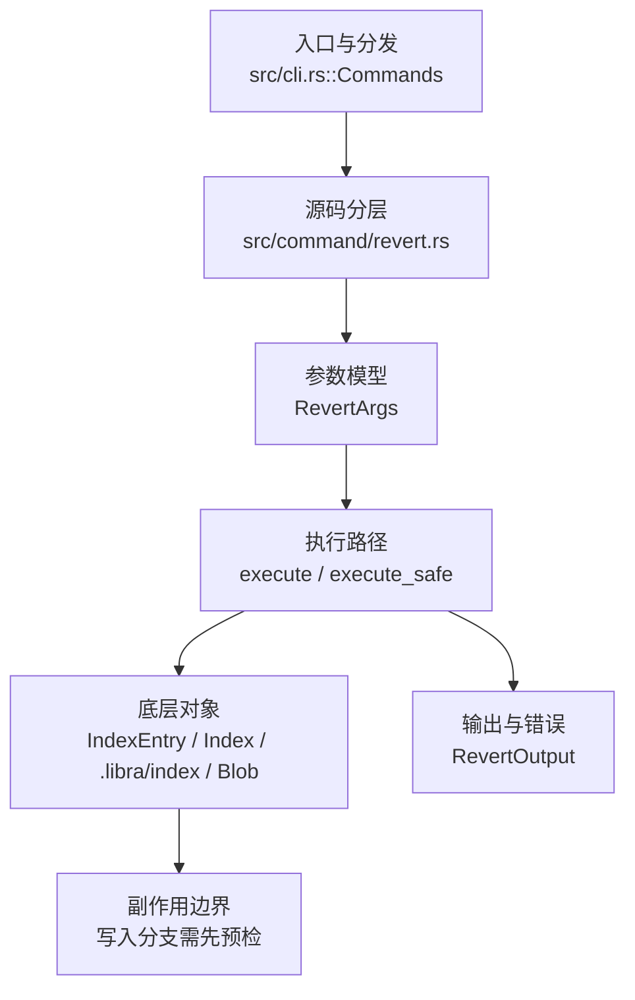

# `libra revert` 开发设计

## 命令实现目标

`libra revert` 的目标是生成抵消已有提交的反向变更，并保留冲突处理和提交控制的清晰边界。当前实现支持单/多提交、mainline、no-commit、冲突 sequencer、可重复 last-wins 的 `-X/--strategy-option ours|theirs`，以及 `--cleanup=<strip|whitespace|verbatim|scissors|default>`。`-X` 复用 merge 的 hunk resolver，只偏向重叠 region并保留 clean inverse hunk；cleanup 与 favor 都进入 `RevertState`，可跨 conflict→continue。自动提交使用当前 author/committer，并从去签名正文生成 subject。自定义 `--strategy` 仍未实现。

## 对比 Git 与兼容性

- 兼容级别：`partial`。既有 revert surface、`-X ours/theirs`、`--cleanup=<mode>` 与冲突 sequencer 已支持；favor/cleanup/edit/remaining 队列均在 fsynced `RevertState` 中向后兼容持久化。`--rerere-autoupdate` 与自定义 `--strategy` 尚未公开。
- MG-08：`three_way_revert_blob` 接收路径并复用 merge 的 strict-cascade `merge.default`、既有 gitattributes 引擎与 `merge_bytes_with_driver`；内建 text/binary/union，未知名称回退 text。union clean 结果直接生成 blob；binary 无 favor 时保存 ours 原文并保持 conflicted。被 revert 的提交删除路径、后续历史又重建不同内容时，binary/union 以空 base 处理该 add/add inverse。仅存在真正内容分歧时读取配置，普通 revert 路径不增加 config 失败面。
- MG-10：`three_way_revert_blob` 不再硬编码 diff3，而是消费 merge/cherry-pick 共用的 `merge.conflictStyle=merge|diff3|zdiff3` 与 refinement/EOL renderer；默认输出因此改为 Git 兼容的 refined merge style，`diff3` 显式恢复完整 `||||||| original` base 段，`zdiff3` 保留该段并移出双方共同前后缀。未知/不可读值暂用默认 style 判断是否真的冲突：干净 inverse merge 保持成功，真实冲突通过专属 `InvalidConflictStyle` / `ConflictStyleRead` 在 index/worktree 写入前 fail-closed，并有稳定错误码、actionable hint 与 Display pin。无 favor 的 revert 走 `merge_bytes_with_refined_driver`，`-X` 仍只改变冲突选择。

- 当前矩阵承诺常用 Git 行为已支持；新增语义必须同步矩阵、用户文档和测试。

## 设计方案

- 入口与分发：已公开接入 `src/cli.rs::Commands`；已由 `src/command/mod.rs` 导出。CLI 层在 `src/cli.rs` 把解析后的参数交给命令模块，命令模块负责把领域错误转换为 `CliError` / `CliResult`。
- 源码分层：主要实现文件为 `src/command/revert.rs`。参数/子命令类型包括：`RevertArgs`；输出、错误或状态类型包括：`RevertOutput`；主要执行函数包括：`execute`、`execute_safe`。
- 执行路径：`execute_safe` 负责 CLI 安全包装、错误映射和输出配置；索引路径会加载、比较、刷新或保存 `.libra/index`；对象路径会解析 revision 并读写 blob/tree/commit/tag 等对象；引用路径会读取或更新 SQLite refs、HEAD 与 reflog。

- 流程图：以下流程图按当前源码分层展示主路径和底层对象边界，便于维护者把代码入口、执行函数和副作用范围对应起来。

- 底层操作对象：`IndexEntry`（索引条目，承载路径、mode、object id 和 stat 元数据）；`Index` / `.libra/index`（暂存区状态、路径条目和刷新/保存边界）；`Blob`（文件内容或 LFS pointer 写入对象库后的 blob 对象）；`Commit`（提交对象、父提交关系和提交消息载荷）；`TreeItem` / `TreeItemMode`（tree 中的路径项和 mode）；`Tree`（由索引或对象遍历生成的目录树对象）；`Branch` / branch store（SQLite refs 上的分支读写、过滤和上游关系）；`Head`（SQLite 中的 HEAD 指向、当前分支和 detached 状态）；`ObjectHash`（SHA-1/SHA-256 对象 ID 和 revision 解析结果）
- 输出与错误契约：人类输出、`--json` / `--machine` 输出和 quiet/verbose 分支必须继续走现有 `OutputConfig` / `emit_json_data` / `CliError` 路径；新增失败模式要补稳定错误码、用户提示和回归测试。
- 副作用边界：凡是写入索引、对象库、refs/HEAD、reflog、SQLite/D1、工作树或远端的路径，都必须先完成参数校验和 dry-run/预检分支，再执行持久化，避免部分写入后静默成功。

## 实现历史

- 本节依据本地 main 分支提交历史重写，筛选与该命令实现、测试或文档路径直接相关的提交；以下是归纳后的实现脉络。
- 基础实现节点：当前 HEAD 支持单父提交的反向变更（`<commit>` + `-n/--no-commit`），并通过 `revert_single_commit` 中的 mainline 选择逻辑支持 merge commit revert（`-m/--mainline`）。
- 2026-05-21 `752c516f`（`test(revert): pin RevertError Display + stable_code surfaces (v0.17.703)`）：测试契约：pin RevertError Display + stable_code surfaces (v0.17.703)；相关行为已有回归守卫，后续变更需要继续满足。
- 2026-06-18：恢复 `-m/--mainline` merge commit revert（原始内容由一次 reconcile 丢弃，仅遗留提交消息），重新应用 `b5af38a` 的源码、错误变体（`MainlineRequired` / `MainlineForNonMerge` / `InvalidMainline`，全部 exit 128）、测试与文档。
- 历史结论：当前文档应以这些提交之后的代码、测试和兼容矩阵为准；更早的迁移式文档只保留为背景，不再作为事实来源。

## 当前状态

- 公开状态：已公开；模块状态：已导出。
- 用户文档：`docs/commands/revert.md`。
- Synopsis 在既有 surface 上新增 `[-X <ours|theirs>] [--cleanup=<mode>]`。
- 公开参数新增可重复 `-X/--strategy-option <ours|theirs>`（last-wins）与 `--cleanup=<mode>`；前者经 `merge::merge_bytes_with_favor` 做 hunk-level 偏向，后者复用 commit cleanup parser，并在任何 sequencer action 前校验。两者随 `RevertState` 续作。
- **冲突 sequencer**：`three_way_revert_blob` 使用 base=被 revert blob / ours=当前 / theirs=选定 parent，并在内容合并前按路径选择 text/binary/union；text 无 `-X` 时重叠区域写 marker，有 `-X` 时共享 hunk resolver。`RevertState` 通过 atomic+fsynced JSON 保存 orig/reverted/signoff/edit/cleanup/strategy_option/remaining/conflicted paths；`--continue`/`--skip` 续作保持相同策略。driver 由当次工作树 attributes/config 重新选择，不写入 state。
- apply、root revert、`--skip`/`--abort` 恢复路径都对不可读/损坏的 index fail-closed（`LBR-REPO-002`），不会再把 load failure 当作空 index 后覆盖工作树；state 保留供修复后重试。
- unmerged-index start guard（#477 HF-03，ADR-HF-04）：新的 revert 在 `run_revert` 解析目标之前复用 `cherry_pick::unmerged_index_paths()` 检查索引；存在未合并条目即以 `RevertError::UnmergedIndex`（`LBR-CONFLICT-001`，128）拒绝并列出最多 10 条路径，零写入；该检查只拦截新开始的 revert，`--continue`/`--skip`/`--abort` 在检查之前分派，而这次拒绝不写 revert state，控制动词对它无从作用。

## 还未实现的功能

| 类别 | 未完成项 | 当前处理 |
|---|---|---|
| ✅ 已实现 | `-e`/`--edit` 与 `--no-edit` | `--edit` 在默认 `Revert "<subject>"` 消息上打开编辑器（`edit_revert_message`：`editor::resolve_editor` 解析 `$GIT_EDITOR`/`core.editor`/`$VISUAL`/`$EDITOR`，`editor::edit_message` 打开，结果剥离 `#` 注释行 + trim，空→`EmptyMessage`，无编辑器→`Editor` 错误，均 129）；编辑在 `resolve_revert_message`（默认消息→`edit_revert_message`）中**在改动工作树之前**完成（`create_revert_commit`/`create_empty_revert_commit` 只接收最终消息），故编辑器失败/空消息不会留下半应用的 revert；直接路径用 `args.edit`、`--continue` 经 `RevertState.edit`（`#[serde(default)]`，向后兼容）、root 路径用 `resolve_root_revert_message`。与 git 不同 Libra revert 默认不打开编辑器，`--edit` 为 opt-in，与 `--no-edit`（默认行为的 no-op）`conflicts_with` 互斥。带集成测试 `test_revert_edit_opens_editor`（`core.editor` 脚本改写消息 + `--edit --no-edit` 冲突）。 |
| ✅ 已实现 | `--no-rerere-autoupdate` | 接受式 no-op：Libra 无 rerere，无可更新（带集成测试 `test_revert_no_rerere_autoupdate_is_accepted_noop`）。Git 的反向 `--rerere-autoupdate` 未公开。 |
| ✅ 已实现 | 编辑消息 `-e`/`--edit` | 见上方 `-e`/`--edit` 与 `--no-edit` 行：在生成消息上打开编辑器（opt-in，与 git 默认不同）。 |
| ✅ 已实现 | Skip 当前 commit | `--skip`：`run_revert_skip` 经 `restore_to_orig_head` 丢弃当前冲突提交后用 `revert_sequence` 续作 `RevertState.remaining`；剩余为空时清理 state 不建提交。与 `--continue`/`--abort` 互斥。带回归测试 `test_revert_skip_continues_with_remaining` / `test_revert_skip_with_nothing_remaining`。 |
| ✅ 已实现 | 多提交冲突自动续作 | 冲突时把剩余提交队列存入 `RevertState.remaining`；`--continue`/`--skip` 经共享 `revert_sequence` 自动续作其余提交（此前剩余提交会被静默丢弃）。带回归测试 `test_revert_continue_drains_remaining_commits`。 |
| ✅ 已实现 | `-X ours/theirs` | 可重复且 last-wins；modify/modify 只偏向冲突 hunk，add/add 与 modify/delete 选择整侧；effective favor 随 `RevertState.strategy_option` 持久化。E2E `revert_strategy_option_is_hunk_level_and_last_wins` 固定 parent/tree。 |
| ✅ 已实现 | `--cleanup=<mode>` | 复用 commit cleanup modes；无 editor 时 default/scissors→whitespace，有 editor 时按 mode 清理；非法值在 control action 前失败；`RevertState.cleanup` 保证 conflict→continue round-trip。E2E `revert_cleanup_survives_conflict_continue` 固定 scissors 截断、parent 与 state cleanup。 |
| ✅ 已实现 | P0-08 identity/subject 保真 | `create_revert_commit` / `create_empty_revert_commit` 不再使用 `Commit::from_tree_id` 的固定 `mega <admin@mega.org>` 身份，而是走 `commit::create_commit_signatures(None, None)`；`build_revert_message` 使用 `parse_commit_msg` 后的首行作为 `Revert "<subject>"`。带 compat 测试 `compat_sequencer_message_author::revert_uses_current_identity_and_strips_signed_subject`。 |
| 兼容差异项 | 策略 | 原始对照：--strategy <s>；相关参数/替代：不适用；当前说明：不支持。 后续实现时需要补对应回归测试并同步兼容矩阵。 |

## 维护要求

- 改进本命令前，必须先阅读并遵循 [docs/development/commands/_general.md](_general.md)；这是命令设计、实现、测试和文档同步的强制要求。
- 任何行为变更都要先核对实现源码，再同步 `COMPATIBILITY.md`、`docs/commands/<cmd>.md` 和相关测试。
- 新增 Git 兼容参数时必须明确 tier、错误码、JSON/机器输出契约和回归测试。

- external conclusion of a stopped sequence item by reset（#477 HF-01，ADR-HF-03 第 1、4、5 条）：无 pathspec 的整树 `reset` 成功后调用 `command::cherry_pick::conclude_stopped_cherry_pick`（内部走通用的 `sequencer::conclude_stopped_sequence`）与 `command::revert::conclude_stopped_revert`：待办为空（单提交或停在最后一项）时清除状态，否则保留剩余待办并标记被停项已被外部结束——两边都用 `#[serde(default)]` 的附加字段 `stop_concluded` 表达（cherry-pick 写在 `sequence_state.payload` 的选项 JSON 里，revert 写在 `revert-state.json` 里），`current_oid` 与行结构保持有效，旧版本仍能读该行（ER-HF-02 降级可读性）；任何位置写入都会清除该标记。标记与空待办同时出现属损坏行，`--continue`/`--skip` 以 `CherryPickError::CorruptState`（`LBR-REPO-002`）fail-closed 且不改状态，`--abort`/`--quit` 仍可清理。rebase、am、bisect 状态不动；带 pathspec 的 reset 不触发。收尾失败不回滚 reset，只追加 warning（exit 0）指明残留状态与收尾命令。HF-01 窗口内 `--continue` 对被标记的状态拒绝（cherry-pick `CherryPickError::StopConcluded`、revert `RevertError::StopConcluded`，均为 `LBR-REPO-003`），由 HF-02 改为直接处理剩余待办。收尾按 ADR-HF-03 第 5 条有序执行：cherry-pick 一步失败即停止，不再触碰 revert 状态（`LIBRA_TEST_RESET_FAIL_CONCLUDE_CHERRY_PICK` 注入该失败）。收尾对状态行/侧车做围栏写入（Codex R5）：cherry-pick 侧以读到的快照全列作为 `DELETE`/`UPDATE` 的 `WHERE` 条件，revert 侧比对侧车原始字节，任一不匹配即判 `ExternalConclusion::Superseded`，放弃收尾并原样保留新属主的状态——并发 `--quit` 后新开的 pick/revert 不会被过期快照删除或覆盖；`LIBRA_TEST_SEQUENCER_RECLAIM_BEFORE_CONCLUDE` 与 `LIBRA_TEST_REVERT_RECLAIM_BEFORE_CONCLUDE` 两个 `LIBRA_TEST` 门控缝在读写之间重写状态，使该竞态可确定性回归。收尾只结束 reset 真正观察到的那个停止项（Codex R6）：状态在 `perform_reset` **之前**快照（`snapshot_stopped_cherry_pick` 与 `snapshot_stopped_revert`），reset 成功后只对该快照做围栏写入，因此 reset 完成后才新开的 pick/revert 绝不会被它收尾（`LIBRA_TEST_RESET_START_SEQUENCE_AFTER_RESET` 缝在该窗口内新起序列以做确定性回归）。revert 侧车另加排他 advisory 锁 `.libra/revert-state.lock`（std `File::lock`：Unix 为 flock、Windows 为 LockFileEx，与 `internal::layer` 同一原语，发布的各平台均生效；`LIBRA_TEST_REVERT_CONCLUDE_READY_FILE` 缝在快照后、取锁前落就绪标记，供跨进程回归）：`RevertState::save`/`cleanup` 与收尾的「读—校验—写」全程持锁，使其成为真正的 CAS 而非 check-then-act。快照读取失败本身也是残留状态（Codex R7）：两半各自保留 `Result`，读不出来时按 ADR-HF-03 第 5 条追加具名 warning（cherry-pick 指向 `libra cherry-pick --quit`、revert 指向 `libra revert --abort`）并就地停止后续收尾，绝不静默当成「无可收尾」；`LIBRA_TEST_RESET_FAIL_SNAPSHOT_CHERRY_PICK`/`..._REVERT` 两个缝注入该失败。围栏内再读侧车时只把「内容已变」与 `NotFound` 判为 `Superseded`，其余读取错误原样上抛，经 reset 的 warning 指明 `libra revert --abort`（Codex R8）；`LIBRA_TEST_REVERT_UNREADABLE_BEFORE_CONCLUDE` 缝把侧车换成目录，让真实 `fs::read` 失败以做回归。读不懂的选项 JSON 不再静默当作「已标记」：`mark_payload` 可失败，错误经 reset 的 warning 路径指明 `libra cherry-pick --quit`，行保持字节一致。
