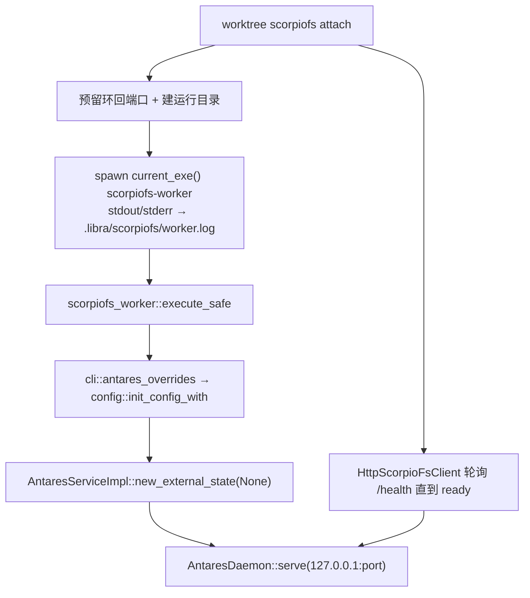

# `libra scorpiofs-worker` 开发设计

## 命令实现目标

`libra scorpiofs-worker` 是隐藏的常驻 worker（`hide = true`），不面向用户直接调用。它存在的唯一理由是生命周期不匹配：Libra 的公开 CLI 是短命进程，而一次 FUSE 挂载必须在 `libra worktree scorpiofs attach` 返回之后继续存活。因此 attach 从 Libra 自己的可执行文件（`std::env::current_exe()`）拉起这个子命令，由它持有 FUSE 会话。

worker 直连 ScorpioFS crate，只监听一个环回控制端点（`--bind 127.0.0.1:<port>`，端口由 attach 预留后传入）。内嵌的 ScorpioFS 服务被显式配置为**不持久化、不自恢复**状态：权威的期望状态始终留在 Libra 侧（`.libra/scorpiofs/` 下的 `LibraScorpioFsState`），worker 崩溃后由下一次 attach 重建，而不是由 ScorpioFS 自己恢复。

## 对比 Git 与兼容性

- 兼容级别：`intentionally-different`。Git 没有对应命令。
- 平台/特性门：仅在 `target_os = "linux"` 且启用 `scorpiofs-direct` feature 时可用。其他组合下命令本身仍然存在（保持 CLI 表面稳定），但立刻以 `LBR-UNSUPPORTED` 拒绝，并提示改用 `worktree scorpiofs attach --endpoint <url>` 的兼容 HTTP 模式。
- 参数全部是必填的内部契约，不做用户级校验糖：`--config-path`、`--bind`、`--upper-root`、`--cl-root`、`--mount-root`、`--runtime-state-file`。
- 命令作用域（`src/cli.rs::command_scope`）登记为 `Repository`——与 `libra service` 同形态：按写者归类以免作用域被低估；同时它被列入 `command_holds_shared_maintenance_lock` 的长驻豁免名单，否则挂载存活期间会一直持有共享 maintenance 锁，饿死每一个删除阶段。

## 设计方案

- 入口与分发：`src/cli.rs::Commands::ScorpiofsWorker`（`hide = true`）→ `command::scorpiofs_worker::execute_safe`。
- 源码分层：`src/command/scorpiofs_worker.rs` 只做参数转译与错误包装；挂载编排、期望状态与回滚都在 `src/internal/scorpiofs_backend.rs`，后者实现 `src/internal/worktree_backend.rs` 定义的后端中立接口。
- 配置优先级：路径类参数经 `scorpiofs::cli::antares_overrides` 转成 config override map 后交给 `util::config::init_config_with`，以保持 ScorpioFS 文档承诺的 `CLI > env > file > default` 次序，而不是事后改写 `AntaresPaths`。
- 日志：attach 侧把 worker 的 stdout/stderr 追加重定向到 `.libra/scorpiofs/worker.log`，worker 自身不另开日志文件。

## 当前状态

- 已实现：托管 worker 的拉起、健康探测、失活检测（worker 消失时把 `ManagedCrate` 传输的挂载标记为 `RecoverableError` 并要求重新 attach）、detach 时在最后一个挂载消失后停止 worker。
- 依赖：`scorpiofs = "=0.4.0"`（Linux-only、optional）。

## 还未实现的功能

- worker 自身没有重启/看门狗：进程消失后由下一次 attach 重建，期间已挂载路径不可用。
- 没有多仓库共享 worker：运行目录按 storage 路径哈希隔离，每个仓库一个 worker。
- 非 Linux 平台没有直连模式，只能走 `--endpoint` 兼容 HTTP 模式。
