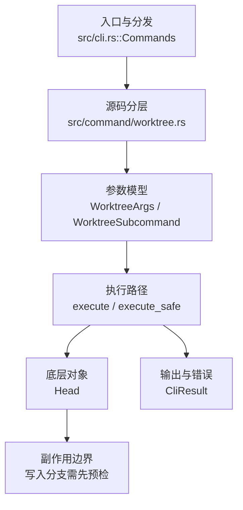

# `libra worktree` 开发设计

## 命令实现目标

`libra worktree` 的目标是管理同一仓库状态的附加工作目录。实现需要明确 Libra worktree 的隔离布局：多个 worktree 共享同一个 `.libra` SQLite 数据库、对象存储、branch/tag/remote refs 和配置，但每个 linked worktree 拥有自己真实的 `.libra` gitdir（本地目录，非 symlink），保存私有 HEAD、index 和 HEAD reflog，并记录 `commondir` 指针与稳定 `worktree_id`；sequencer 家族（cherry-pick/am/revert/merge/bisect/rebase）自 W1（v0.19.42）起在 linked worktree 以 per-worktree DB scope 运行，`bisect_state` 的 lazy DDL 已由正式迁移 `2026072301` 收编；dirty-set cache 自 W1（迁移 `2026072302`）起 per-worktree（`dirty`/`status --scan/--cached/--check-dirty` 在 linked 可用且互不干扰；service 的无 scope dirty-mark 请求在多 worktree 仓库拒绝）；layer 注册表自 W1（迁移 `2026072303`）起 per-worktree（同名 layer/同路径可在不同 worktree 独立存在；仅当目录随 `--delete-dir` 删除或已消失时 remove/prune 才清理该 scope 的 layer 行——保留的目录继续持有 ownership 行、overlay 文件保持不可暂存；legacy 全局行仅在无 linked worktree 时归 main、否则迁移 fail-closed）；sparse view 自 W1（迁移 `2026072304`）起 per-worktree（patterns 与 enabled toggle 按 scope 隔离，`sparse.enabled` config 键已废弃、投影到 `sparse_view_meta`，remove/prune 的清理同 layer 的目录消失规则）；stash 自 W2（§C.4.3）起在 linked 可用——stack（refs/stash+reflog）有意 repository 共享,push/apply/pop 只快照/改写当前 worktree 的 index/workdir,栈突变经跨平台 stack lock 串行、pop/branch 经 by-id CAS `do_drop` 删除(CAS 失败保留 entry 并报告,不回滚已成功 apply),`pull --rebase --autostash` 守卫同步解除——至此无任何命令因 repository-global 状态在 linked worktree 被拒。由更早版本创建的 worktree 可能仍是旧共享 `.libra` symlink 布局。remove 默认保留磁盘目录，只有 `--delete-dir` 执行 Git 风格删除。

## 对比 Git 与兼容性

- 兼容级别：`intentionally-different`。`remove` keeps disk dir by default (no implicit data loss). Use `--delete-dir` for Git-style behavior; the flag refuses on a dirty worktree

- 该命令或行为属于 Libra 扩展/有意差异；重点是清晰边界、结构化输出和可测试错误，而不是 Git 完全同形。

## 设计方案

- 入口与分发：已公开接入 `src/cli.rs::Commands`；已由 `src/command/mod.rs` 导出。CLI 层在 `src/cli.rs` 把解析后的参数交给命令模块，命令模块负责把领域错误转换为 `CliError` / `CliResult`。
- 源码分层：主要实现文件为 `src/command/worktree.rs`。参数/子命令类型包括：`WorktreeArgs`、`WorktreeSubcommand`；输出、错误或状态类型包括：`WorktreeError` 枚举与 `WorktreeResult<T>` 别名，以及输出结构 `WorktreeListOutput`、`WorktreeAddOutput`、`WorktreeLockOutput`、`WorktreeUnlockOutput`、`WorktreeMoveOutput`、`WorktreePruneOutput`、`WorktreeRemoveOutput`、`WorktreeRepairOutput`、`WorktreeUmountOutput`（均为 crate 私有）；主要执行函数包括：`execute`、`execute_safe`。
- 源码意图：源码模块注释说明该命令管理 linked worktree 元数据和文件系统布局，并保护 main worktree 的安全不变量。
- 执行路径：`execute_safe` 负责 CLI 安全包装、错误映射和输出配置；引用路径会读取或更新 SQLite refs、HEAD 与 reflog；工作树路径会显式处理目录、注册表和删除/保留语义。

- 流程图：以下流程图按当前源码分层展示主路径和底层对象边界，便于维护者把代码入口、执行函数和副作用范围对应起来。

- 底层操作对象：worktree registry / filesystem layout（附加工作区登记、路径和删除边界）；`Head`（SQLite 中的 HEAD 指向、当前分支和 detached 状态）
- 输出与错误契约：人类输出、`--json` / `--machine` 输出和 quiet/verbose 分支必须继续走现有 `OutputConfig` / `emit_json_data` / `CliError` 路径；新增失败模式要补稳定错误码、用户提示和回归测试。
- 副作用边界：凡是写入索引、对象库、refs/HEAD、reflog、SQLite/D1、工作树或远端的路径，都必须先完成参数校验和 dry-run/预检分支，再执行持久化，避免部分写入后静默成功。

## 实现历史

- 本节依据本地 main 分支提交历史重写，筛选与该命令实现、测试或文档路径直接相关的提交；以下是归纳后的实现脉络。
- 2026-02-16 `e9d4d3b1`（`feat(worktree): document and wire worktree subcommand (#206)`）：基础实现节点：document and wire worktree subcommand (#206)；当前实现的主要轮廓可追溯到该提交。
- 2026-06-07 `14be6a89`（`feat(worktree): add prune --dry-run (registry-preserving preview, v0.17.1408)`）：该提交尝试为 `prune` 增加 `--dry-run` 预览；当前 HEAD 的 `WorktreeSubcommand::Prune` 仍无该参数、`prune_worktrees()` 也无 dry-run 分支，故该参数尚未进入当前代码事实面。
- 2026-05-15 `6f649767`（`feat(worktree): structure umount output`）：功能演进：structure umount output；该节点扩展了当前命令可用的参数或行为。
- 2026-05-24 `38edd4c9`（`fix(docs): align worktree Alias line with the other 12 aliased command docs (v0.17.932)`）：实现修正：align worktree Alias line with the other 12 aliased command docs (v0.17.932)；该节点把边界行为、错误处理或兼容差异纳入当前实现约束。
- 2026-05-31 `0ba844ee`（`docs(worktree): add zh-CN command docs and harden fuse worktrees`）：文档与兼容口径：add zh-CN command docs and harden fuse worktrees；当前文档按该节点之后的实现状态校准。
- 历史结论：当前文档应以这些提交之后的代码、测试和兼容矩阵为准；更早的迁移式文档只保留为背景，不再作为事实来源。

## 当前状态

- 公开状态：已公开；模块状态：已导出。
- 用户文档：`docs/commands/worktree.md`。
- Synopsis：`libra worktree <subcommand>`（`add | list | lock | unlock | move | prune | remove | umount | repair`）。
- 公开参数/子命令包括：`add <path>`、`list [--porcelain]`、`lock <path> [--reason <TEXT>]`、`unlock <path>`、`move <src> <dest>`、`prune`、`remove <path> [--delete-dir]`、`umount <path> [--cleanup]`（Unix，别名 `unmount`）、`repair [<path>]`（无参数：registry 去重 + main entry 兜底 + W3-s1b 恢复引擎——回放 stale intent journal、重试 tombstone 清理、按 registry 重建 detached 标记；带 path：按 registry v2 持久化的 stable `worktree_id` 重写目标 linked worktree 的 `.libra/worktree_id` 并补建 `commondir` 指针，绝不猜测身份 — 未注册路径、main worktree 与 v1 registry 拒绝）。W3-s1b lifecycle：keep-dir remove 分离（detached_from_registry,scoped rows 保留 + gitdir 标记 fail-closed,`add` 按身份校验重挂接）；`--delete-dir` 删除+fsync 父目录后才清 scoped rows,失败留 tombstone;add/move/remove/prune 先写 durable intent journal(迁移 2026072402,down 在存在 lifecycle/journal 状态或 linked-scope sequencer/rebase/bisect 状态时拒绝;workspace lease 随 W4 加入守卫)。`list --porcelain` 经共享 `format_worktree_porcelain`（worktree.rs，被 worktree-fuse.rs 复用）为每个 worktree 输出 `worktree <path>`、该 worktree 自己 scope 的 `HEAD <sha>` 与 `branch <ref>`/`detached` 行（经 `Head::head_for_worktree_scope` 按 `worktree_id` 解析）、被锁定时 `locked [reason]`，条目间空行分隔；HEAD 无法解析（legacy symlink 布局或缺失/损坏 scope）的 entry 省略 HEAD 行，绝不把其它 worktree 的 sha 标给它。
- 在 `worktree-fuse` 特性下（`src/command/worktree-fuse.rs`），`add` 子命令额外提供：`-f`/`--fuse`、`--branch <BRANCH>`、`-b`/`--create-branch <CREATE_BRANCH>`、`--from <FROM>`、`--privileged`、`--allow-other`。

## 还未实现的功能

| 类别 | 未完成项 | 当前处理 |
|---|---|---|
| 兼容矩阵说明 | `remove` keeps disk dir by default (no implicit data loss). Use `--delete-dir` for Git-style behavior; the flag refuses on a dirty worktree | 按当前兼容矩阵保留；实现状态变化时同步 `_compatibility.md` 和测试证据。 |
| 兼容差异项 | 创建 detached 工作树 | 原始对照：不支持；相关参数/替代：worktree add --detach <path> <commit>；当前说明：不适用。 后续实现时需要补对应回归测试并同步兼容矩阵。 |
| 兼容差异项 | 每 worktree 独立分支 | 原始对照：不支持；相关参数/替代：Automatic (new branch or existing)；当前说明：Automatic (new working copy commit)。 后续实现时需要补对应回归测试并同步兼容矩阵。 |

## 维护要求

- 改进本命令前，必须先阅读并遵循 [docs/development/commands/_general.md](_general.md)；这是命令设计、实现、测试和文档同步的强制要求。
- 任何行为变更都要先核对实现源码，再同步 `COMPATIBILITY.md`、`docs/commands/<cmd>.md` 和相关测试。
- 新增 Git 兼容参数时必须明确 tier、错误码、JSON/机器输出契约和回归测试。
