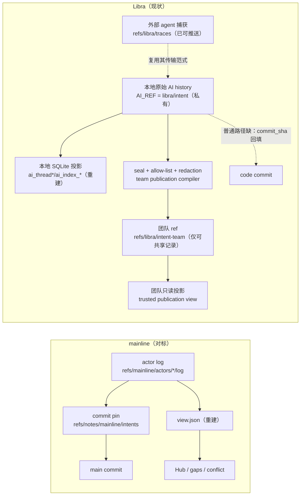
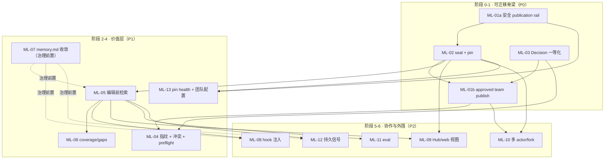
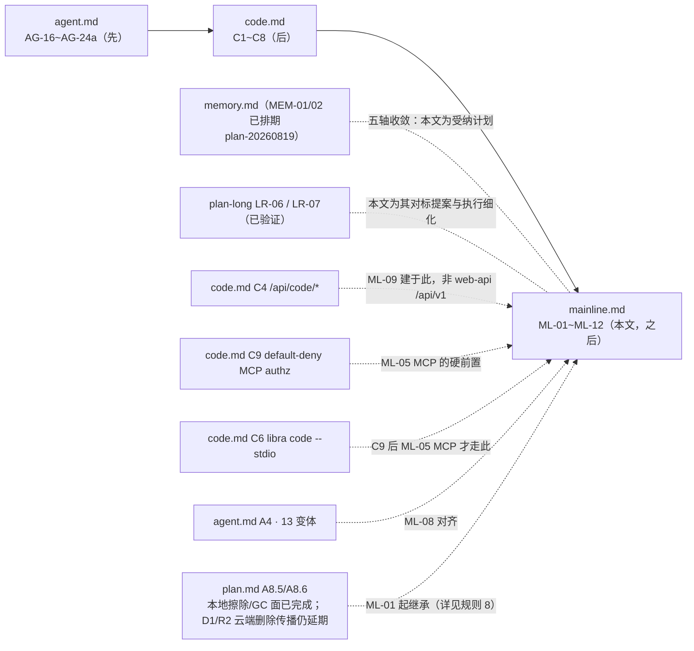

# `mainline` 对标改进计划：为 Libra 打通 git-native 可迁移意图记忆（Intent Portability & Pin）

## 文档职责

本文是 `docs/development/gap/` 目录下的**独立对标提案**（draft proposal），职责是：以竞品项目 **mainline**（Go 实现的 "Git for the AI era"，把工程意图——目标 / 决策 / 被否方案 / 约束 / 风险 / 遗留项 / 语义指纹——存进 **Git refs + Git notes**，随 fetch / branch / merge / fork 天然流转）为参照系，逐能力对照 Libra 现有与计划中的 AI 意图 / agent / projection 基础设施，给出一份**可落地执行**的改进计划，并明确它相对同目录其他计划的**先后顺序与依赖**。设计权威文件仍位于 `../tracing/`。

- 本文是**提案草稿**，与 `memory.md` / `sandbox.md` / `web-api.md` 同类，**不属于** [`plan.md`](../tracing/plan.md) 固定的 `agent.md → code.md`（AG-16~AG-24a → C1~C8）执行链条。按 `plan.md` §0 规则，本文不得从 `memory.md` / `sandbox.md` / `web-api.md` 引入验收标准；可引用的设计权威只有 [`agent.md`](../tracing/agent.md) 与 [`code.md`](../tracing/code.md)（以及它们背后的源码事实源 `docs/development/internal/code-agent-runtime.md`）。
- 本文与 [`memory.md`](../tracing/memory.md) 存在**五轴重叠**（意图记忆 / 决策证据记录 / 上下文注入 / 约束 / Hub 读视图）。二者的收敛策略在 §9 明确：本文成为「意图可迁移 / commit-pin / recall」这一轴的**受纳计划（committed schedule）**，`memory.md` 由其 owner 对齐，避免出现第三条平行平面。
- §5.1 / §15 纳入的开源 Agent Memory 调研只增加安全与可回放约束，**不**把通用 `MemoryObject`、`Memory Compiler`、M0–M3、外部 sidecar 或新的 `refs/libra/memory*` 排期偷偷塞进本文；这些仍须经过 ML-07 与 `memory.md` owner 的收敛。
- **完成判定以代码为准**：本文所有源码锚点均在撰写时经过实测核对（见 §11 源码事实索引）；任何实现推进都必须重新核对锚点，且更新代码时同步更新本文。

### 基线声明（本轮 = 第一次定期刷新，2026-08-27）

| 项 | 值 |
|---|---|
| 竞品 checkout | `/Volumes/Data/competition/mainline/mainline` |
| 竞品 revision | `5704305`（2026-08-06，`fix(preflight): 限制单条文件证据大小 #207`）；最近发布 **v0.5.1**（2026-07-27，`CHANGELOG.md:41`） |
| 竞品漂移量 | 相对上轮基线 `c6397b9`（2026-07-12）共 **13** 个提交、24 文件、`+1876 / −129` |
| Libra 基线 | `main` HEAD **`89081277a`**，`Cargo.toml` version **0.21.27** |
| 上轮核对日期 | 2026-07-12 / 2026-07-13（见 §14 / §15） |
| 本轮校验日期 | **2026-08-27**（逐条修正与待复核项见 §16） |
| 实现状态 | **ML-01 ~ ML-13 全部未实现**（实测：`src/cli.rs` 无 `Commands::Intent`、无 `src/command/intent.rs`、全 `src/` 无 `intent-team`/`intent_team`）；本轮为事实刷新，不改变任何 ML-* 的范围、优先级与顺序 |

## 命令实现目标

Libra 已经拥有 mainline 所需的**绝大部分底层机件**（内容寻址 AI 对象、孤儿分支、CAS 追加、git notes、可推送自定义 ref、SQLite 投影重建、MCP、外部 agent 捕获）。因此本计划的目标**不是移植 mainline 的实现**，而是：

1. 把 Libra 已有的、**局部（local-only）**的意图 / 决策记录，编译成**可审查、白名单、脱敏后随仓库流转的团队级可迁移意图平面**；绝不直接发布原始 AI history；
2. 补齐 Libra 缺失的三块高价值能力——**seal + intent↔commit 绑定（pin）**、**决策的「被否方案 + 理由」一等结构**、**改动前意图检索（intent-before-code）**；
3. 在此基础上增量补齐冲突检测、coverage/gaps、hook 上下文注入、Hub 读视图，最后再做多 actor / fork 协作与 eval。

## 对比 Git 与兼容性

- 兼容级别：`intentionally-different`。这是 Libra 的 AI 扩展平面，不是 Git 命令；不追求与任何 Git 子命令同形。
- 与 mainline 的关系是**概念对标**，不是二进制或线格式兼容：Libra 复用**自身**的 `refs/libra/traces` + `history.rs` 传输/存储范式，**不采用** mainline 的 `refs/notes/mainline/*` 机制（原因见 §5 核心设计决策）。

---

## 1. mainline 是什么（对标对象速览）

mainline 的核心论点：**Git 记录了代码「改了什么」，mainline 把「为什么这么改」也放回 Git**，让下一个 agent 在动手前先读到历史判断（被放弃的路线、被取代的决策、跨越代码本身的约束），从而不重复踩坑、不撤销昨天的决策、不违反没见过的硬约束。

其对象与存储模型：

| mainline 概念 | 内容 | 存储位置 |
|---|---|---|
| Intent（意图记录） | goal / summary(what,why,decisions,rejected) / fingerprint / lifecycle | actor 事件日志 `refs/mainline/actors/<id>/log`（append-only JSON-lines） |
| Materialized view | 由重放 actor 日志重建的只读视图 | `.mainline/view.json`（派生、gitignored） |
| Commit pin | sealed intent ↔ main commit 的绑定 | git notes `refs/notes/mainline/intents`（tree_hash / commit_hash / merge_parent / subject / branch_in_message / goal_text 级联，另有 GitHub PR 后验、backfill、同树 fan-out、manual pin） |
| 持久信号 | constraint（人类确认硬约束，永不截断，按文件重叠继承）/ risk（顾问式，open/resolved/expired）/ followup（显式遗留） | actor 日志事件 |
| Coverage | 每个 main commit ∈ {covered, skipped, uncovered} | 由 pin + skip trailer 派生；`gaps` 命令 |
| Conflict | phase-1 指纹重叠（加权 Jaccard）/ phase-2 agent 语义判定（`check --prepare/--submit`） | 引擎计算 |

其工作流（agent 视角）：`preflight → context(--current/--files/--query) → 读决策/约束/生命周期告警 → 校验意图 vs 代码 → 编辑 → append → seal(--prepare/--submit) → sync（自动 fetch+rebuild+auto-pin+overlap 告警）`。人类侧：`status --actionable / log / show / trace / gaps / hub open`。协作侧：`publish`（推 actor 日志）、`actor import` / `pr-import`（fork 贡献者意图的上游信任导入，只接受 author-seal）。另有 Hub（意图视图的静态 HTML 导出 + GitHub Pages）与 eval（8 场景×3 seed×2 模式，量化「intent-first vs code-first」的价值）。



---

## 2. 对比结论（Libra 现状 vs mainline）

经本轮对 `/Volumes/Data/competition/mainline/mainline` 与 Libra 当前源码的逐锚点核对，四条承重结论：

1. **Libra 不缺 git-native 存储，缺的是安全的意图发布平面。** 所有 AI 对象（`Intent`/`Task`/`Run`/`Plan`/`PatchSet`/`Evidence`/`ToolInvocation`/`Provenance`/`Decision`/`ContextFrame`）已经是内容寻址 Git 对象，挂在孤儿分支 `libra/intent`（`src/internal/ai/history.rs:92`，以 kind='Branch'、name='libra/intent' 存于 SQLite reference 表），CAS 追加、GC-root 保护，模块文档明言「可经同一协议传输」。**正因为此 ref 还含 Run、工具调用、context 和 hook/session 捕获，它必须继续保持本地私有，绝不可把整条 ref 当作团队意图频道推送。** `libra/intent` 目前也确实不在默认 push/fetch/clone 中出现（2026-08-27 实测 `src/command/{push,fetch,clone}.rs` 均无 `libra/intent`；`clone.rs:3598,3651` 刻意不写 `+refs/*:refs/*`）。相反，`refs/libra/traces` 已经有可用的**传输机件**：`libra agent push` 以 `refspec = "{TRACES_BRANCH}:refs/libra/traces"` 推送（`src/command/agent/push.rs:30,36`），并在 `--force-rewrite` 时以上次推送 tip 构造 `--force-with-lease`（`:49-83`；默认路径 `:82` 无 lease）。ML-01 应复用其 lease / tracking 机制，但新增经 policy 验证的 `refs/libra/intent-team` 导出，而不是「把管线接到 AI_REF」。

2. **中心问题的答案是「是」，但要走 Libra 自己的 traces/history.rs 范式，不走 mainline 的 git-notes。** 详见 §5。

3. **单点最高价值缺口是 intent↔commit 绑定（pin）。** 常规 IntentSpec 持久化在 plan 期写入 `commit_sha: None // Will be set when completed`（`src/internal/ai/intentspec/persistence.rs:54`），当前终态 orchestration 路径也没有把它可靠地回填；虽然 MCP 的 Intent API 已支持带 result commit SHA 的事件，正常 seal/commit 路径并未接线。结果是意图与它所授权的 diff 在默认工作流中仍是**两个互不相连的对象**。没有 pin，就没有 coverage、没有 seal 时刻的指纹、没有「这段代码为何如此」的可追溯性。

4. **Libra 的决策记录缺「被否方案」结构**——恰是 mainline 的核心价值主张。`agent_run::MergeDecision` 只有单一 verdict（`src/internal/ai/agent_run/decision.rs`），`ai_final_decision` 只存不透明的 `summary_json`（`src/internal/model/ai_final_decision.rs`）；「权衡了哪些备选 / 为何选 X 弃 Y」不可查询。

另有两条工程约束必须贯穿全程：

- **不要在 `agent_run` 模块上盖楼**（2026-08-27 复核：结论保留，**理由已变**）。~~它藏在 `subagent-scaffold` feature 后~~ —— 该 feature gate 已失效：`src/internal/ai/mod.rs:59-67` 明言模块「is unconditionally available」，其 `AgentRunId` / `AgentRunEvent` / `AgentRunEventEnvelope` / budget / permission 已被生产路径引用（`agent/runtime/sub_agent.rs:38`、`agent/runtime/sub_agent_dispatcher.rs:73`、`investigate/runner.rs:51`、`agent_bridge/vcs.rs:653`、`agent/profile/spec.rs:11`）。禁止在其上建 Decision 的**当前**理由是：`MergeDecision` / `MergeDecisionPayloadV0`（`src/internal/ai/agent_run/decision.rs:113,137`）仍是 CEX-S2-13 未填充的 schema stub——实测除 `agent_run/` 内部（`mod.rs`/`event.rs`/`decision.rs`/`evidence_query.rs`）外零引用，且 CP-4 门控未解除。真正可用（live、已接线）的平面仍是 orchestrator + `intentspec/persistence.rs` + git-internal AI 对象 + `ai_index_*` SQLite 投影 + `runtime/phase4.rs`。
- **Libra 的 hook 是「只捕获」方向**（`src/internal/ai/hooks/runtime.rs` 的 `ingest_agent_traces_payload`），与 mainline「向 agent 注入上下文」正好相反；注入是净新增、只读、绝不 mint 意图。

---

## 3. 能力差距矩阵

按类别归并（源自逐能力对照）。`状态`：has-current（已具备）/ partial（部分）/ absent（缺失）/ different（有意不同）。`价值`/`工作量`：对 Libra 而言。锚点为实测源码位置或计划锚。

### 3.1 存储与传输（storage）

| mainline 能力 | Libra 状态 | Libra 锚点 | 差距与代价 | 价值/量 |
|---|---|---|---|---|
| 经批准、脱敏的 sealed intent/decision/pin 随 fetch/push/fork 流转 | absent | `history.rs:3-5,92`（混合 AI history 可传输；常量 2026-08-27 由 `:72` 漂移至 `:92`）；`publish/ai_export.rs` 有 allow-list/redaction 先例 | 必须构建 `refs/libra/intent-team` 发布物；**不能**照搬 traces 来镜像原始 `AI_REF` | 高 / L |
| commit pin（notes 绑定意图↔commit，抗 squash/rebase/merge） | **absent** | `persistence.rs:54`（commit_sha=None） | 最大单点缺口；**不走 notes**，走 `history.rs` 结构化事件；需覆盖 mainline 的六级 cascade、GitHub PR 后验、backfill、同树 fan-out、manual pin | 高 / L |
| log→view 重放式物化视图 | has-current | `projection/rebuild.rs:135`（事务化销毁重建） | 已等价；弱点：无 built-from 水位线，判新鲜度需全量重建 | 低 / S |
| per-actor append-only 日志 + CAS ref 更新 | has-current | `history.rs`（CAS）；`agent_run/event_store.rs:82`（run JSONL） | CAS 有；缺**多 actor 身份合流**（traces 单属主 first-writer-wins） | 中 / M |
| note upsert-merge（同一 squash commit 多意图共存） | different | `notes.rs:101`（无 NOTES_MERGE worktree，2-way 行合并） | notes 不用于 pin；同树 fan-out 去重要在 pin writer 里重写 | 中 / M |
| refspec 接线（经验证的团队发布物随显式 push/fetch 走） | partial | `agent/push.rs`（traces 可推）；`fetch.rs:605,775,1227`（显式 refspec 参数）+ `fetch.rs:1533-1550`（`remote.<n>.fetch` 配置化） | 2026-08-27 订正：fetch **不再**硬编码 heads/tags/mr，已支持显式与配置化 refspec；但 `validate_fetch_destination`（`fetch.rs:1448-1471`）**只允许目的地在 `refs/heads/*` 或 `refs/remotes/<remote>/*`**（`refs/tags/` 显式拒绝），无显式目的地时源必须是 `refs/heads/*` 或 `refs/mr/*`（`default_fetch_destination`，`fetch.rs:1434-1446`）。因此 `refs/libra/intent-team:refs/libra/intent-team` 会被直接拒绝——ML-01a 的隔离 tracking ref 必须二选一：(a) 落到 `refs/remotes/<remote>/…`，或 (b) 扩展该目的地白名单。出站 lease / tracking 可复用；入站仍须加 manifest 验证与单独 team projection | 中 / M |
| 历史重写后 notes 恢复（migrate notes 重键） | absent | 无 | pin 落地后重写会悬挂 pin，需重键路径；pin 存在前不急 | 低 / M |

### 3.2 生命周期（lifecycle）

| mainline 能力 | Libra 状态 | Libra 锚点 | 差距与代价 | 价值/量 |
|---|---|---|---|---|
| drafting→sealed→proposed→merged→abandoned/superseded/reverted | partial | `intentspec/types.rs`（Active + IntentEvent + 修订链） | 有本地生命周期；缺团队可见的 seal/proposed/merged 推进 | 中 / M |
| **seal**（在 commit/PR 边界冻结 summary+fingerprint） | **absent** | `persistence.rs:25`（plan 期存 Active，从不冻结） | 关键拱心石；pin/指纹/coverage 的前置 | 高 / L |
| 决策记「被否方案+理由」为一等字段 | **absent** | `decision.rs`（单 verdict）；`ai_final_decision.rs`（不透明 summary_json） | mainline 核心价值；需在 **live 平面**的 git-internal Decision 对象上加结构 | 高 / M |
| 持久信号 constraint/risk/followup（open/resolved/expired + 继承） | partial | `intentspec/types.rs`（声明式 per-task 约束）；`profiles.rs`（风险档默认） | 有静态 per-spec 策略块；缺团队共享、带生命周期的信号队列与跨意图继承 | 中 / L |
| backfill（`--commits/--range` 认领既有 commit） | absent | 无 | pin 存在后便宜；救援/coverage 用 | 低 / S |
| abandon/supersede 团队可见事件 | partial | `repair.rs`；`new_revision_chain` | 本地够用；缺随 view 流转的 reason/provenance | 低 / S |

### 3.3 检索 / 冲突 / coverage（retrieval / conflict / coverage）

| mainline 能力 | Libra 状态 | Libra 锚点 | 差距与代价 | 价值/量 |
|---|---|---|---|---|
| 编辑前三模检索（--current/--files/--query） | **absent** | 无（context_budget 是 prompt 窗口分配，非意图检索） | mainline 量化价值集中处；可作为 memory.md recall 在 sealed intent 上的落地 | 高 / L |
| 确定性加性相关度打分器（无 embedding） | absent | `intentspec/scope.rs`（仅文件重叠原语） | 净新增、自包含、可测 | 中 / M |
| 确定性 Context Bundle + 选择回执 | partial | `ContextFrame` / `ContextSnapshot` / ContextBudget 已记录局部来源、trust、token 与 omission | 缺固定 code/ref/projection/policy 快照、scorer 版本、排序理由、bundle hash 和可验证重放；raw frame/attachment 不可当团队回执发布 | 高 / M |
| 检索态分类（current/superseded/abandoned/stale） | absent | 无 | 需文件 churn 索引 + supersede 边 | 中 / M |
| 高危继承约束在 seal 时浮现 + 确认 | absent | `intentspec/types.rs`（约束仅 per-task） | Hub「改此文件前先读」的承重面 | 中 / L |
| phase-1 确定性指纹重叠冲突检测（加权 Jaccard） | absent | `scope.rs`（仅文件维度） | 依赖 sealed fingerprint 存在 | 中 / L |
| phase-2 agent 语义冲突判定 | absent | 无 | 需 phase-1 在先；可复用 orchestrator | 低 / L |
| 语义指纹（files/subsystems/arch/behavioral/api/tags） | partial | `types.rs`（touchHints/inScope）；`scope.rs` | 有路径 hint，无多维指纹；seal 时挂指纹是冲突+检索共同前置 | 中 / M |
| coverage 分类（covered/skipped/uncovered） | absent | 无（checkpoint 记 parent_commit 但无 rollup） | 硬依赖 pin | 中 / M |
| gaps + 可逆序救援建议 | absent | 无 | coverage 存在后便宜 | 低 / S |

### 3.4 协作 / hooks / Hub-eval / CLI

| mainline 能力 | Libra 状态 | Libra 锚点 | 差距与代价 | 价值/量 |
|---|---|---|---|---|
| 多 actor 身份 + fork 信任导入（author-seal-only） | absent | `agent/push.rs`（单属主）；`publish/ai_export.rs`（单向托管） | 最大工作量、与现模型最不契合；殿后。2026-08-27 补：mainline 现把 fork 侧拆成两条路径——**只读预览** `internal/engine/pr_fork.go:12,37-47`（provenance kind `fork_actor_log_preview`，同 intent_id 跨 actor 冲突整条丢弃，不写 accept 事件，仅供 `pr.go:72` 生成 PR 评论）与**写入型导入** `actor_import.go`（写 accept provenance）。Libra ML-10 的信任边界应照此二分 | 中 / XL |
| team digest 滚动汇总 | absent | 无 | 依赖多 actor 合并视图 | 低 / S |
| hook 作上下文提供者：会话开始注入意图/团队快照 | partial | `hooks/runtime.rs`（只捕获，不回注） | 方向相反；加 SessionStart 只读注入，高价值、增量 | 高 / L |
| skill 分发 + AGENTS.md 托管块 | absent | `internal/ai/skills/`（内部 loader，非外部分发） | 仅在采用 provider 模型时需要 | 低 / M |
| 多 agent hook 适配（Claude/Codex/Cursor/Pi） | partial | `src/internal/ai/hooks/providers/{claude,gemini,codex,opencode}/mod.rs`（2026-08-27 复核：**四家已接**，非旧稿的「claude+gemini」）；CHECK 仍容 7 种（`sql/migrations/2026050303_agent_capture.sql:16-19`：claude_code/cursor/codex/gemini/opencode/copilot/factory_ai）；`agent.md` roster | 差距缩小为 cursor/copilot/factory_ai 三家；agent.md 已跟踪 roster | 低 / S |
| 静态 HTML Hub / 意图读视图 + 团队健康 | partial | `publish/ai_export.rs`（单向）；`code.md` C4（`/api/code/*` observe-only） | 复用 web 基建；**必须建在 C4 `/api/code/*`**，不用 web-api.md `/api/v1` | 中 / L |
| webhook 领域事件扇出 | absent | 无 | 净新增、可后置 | 低 / M |
| eval 证明意图记忆可度量价值 | absent | 无（有 L1/L2/L3 分层但无意图价值 eval） | 值得借来立项 + 守检索质量 | 中 / M |
| 统一 JSON envelope + 新鲜度门控 auto-sync | partial | `utils/output.rs`（--json/--machine）；无 auto-sync | 无 team-sync 可门控；传输落地后才相关 | 低 / S |
| doctor / migrate-notes 修复 + 信任诊断 | partial | `agent/`（doctor/clean 已有）；无 notes-migrate | pin + 共享视图存在后再做 | 低 / M |

| preflight 开工门禁（sync stale / base-behind / dirty / overlap） | **absent** | 无 | mainline `preflight.go` 在编辑前阻断 stale view、base-behind、proposed overlap；Libra 无等价 stop-line | 高 / M |
| pin health / 历史重写后 repair-migrate | absent | 无 | mainline `notes_recovery.go` + `doctor`；Libra 不用 notes 但仍需 pin 悬挂诊断与重键 | 中 / M |
| 团队配置（skip patterns / coverage baseline / sync freshness） | absent | `internal/config.rs`（Git config，非 intent 专用） | mainline `.mainline/config.toml` 的 `[mainline.skip]`/`[mainline.coverage]`/`[sync]` 驱动 coverage 与 auto-sync | 中 / S |

**兜底声明（no silent caps）**：本矩阵按类别归并了 **36** 行逐能力对照（§3.1~3.4 各表 + 上表 3 行补遗），未丢弃 mainline 源码中任何承重能力；被降优先级的（migrate-notes、phase-2、digest、webhook、skill 分发、多 agent roster 扩展、lint/trace/log/read、agents.md 托管块、webhook 扇出）在上表或 §14 均保留为独立行并标注了「后置/依赖」，不得被理解为「已覆盖」。

---

## 4. Libra 已具备的可复用机件（避免重复造轮子）

落地前必须先认清 Libra **已有**什么，任务卡一律优先复用：

| 机件 | 源码锚点 | 复用于 |
|---|---|---|
| AI 对象内容寻址 + 孤儿分支 `libra/intent` + CAS 追加 | `src/internal/ai/history.rs`（`AI_REF`、`create_append_commit`、`update_ref_if_matches`） | ML-01 的**本地源**、ML-02 pin 事件、ML-03 Decision；不是可整体推送的团队 ref |
| `refs/libra/traces` 传输范式（refspec + tracking tip；force-with-lease **仅 `--force-rewrite`**） | `src/command/agent/push.rs:30,36`（const + refspec）、`:49-83`（lease 分支，默认路径 `for_refspecs()` 在 `:82` 无 lease） | ML-01 传输；ML-01a 若要 lease 须自行构造 |
| allow-list + 深度 redaction 的发布导出 | `src/internal/publish/ai_export.rs`（`AI_HISTORY_OBJECT_TYPE_SPECS`、递归字段脱敏） | ML-01 publication classifier / manifest；现有导出不等于 Git-remote authz，须补团队 policy |
| SQLite 投影事务化重建 | `src/internal/ai/projection/rebuild.rs:135`、`resolver.rs`、`scheduler.rs` | ML-01 fetch 后重投影、各读模型 |
| IntentSpec 规范化/草稿/校验/评审/scope | `src/internal/ai/intentspec/{canonical,draft,validator,review,scope}.rs` | ML-02 seal、ML-04 指纹（scope 文件维） |
| git-internal Intent/Decision 对象 + MCP create | `src/internal/ai/mcp/`、`intentspec/persistence.rs`、`workflow_objects.rs` | ML-02/ML-03 |
| 外部 agent 捕获 + redaction | `src/internal/ai/hooks/runtime.rs` | ML-08 注入（复用 Redactor） |
| ContextFrame / ContextSnapshot + local reviewed MemoryAnchor + shared local receipt ledger | `context_budget/{frame,memory_anchor,receipt,receipt_store}.rs`、`runtime/phase0.rs` | `ContextSelectionReceiptV1`、SQLite 账本与 retention 已落地；ML-05 仍需把 intent 检索结果接入该写入器。当前仍无 branch-aware team recall；receipt 保持 local-only |
| 嵌入式 Next.js + 单向 publish 导出 + C4 observe-only API | `src/internal/publish/ai_export.rs`、`src/internal/ai/web/`（C4 /api/code/*） | ML-09 Hub |
| 稳定错误码 + `--json/--machine` 输出 | `src/utils/{error,output}.rs` | 全部命令 |

> 关键取舍已在 §5 定论：**git notes 不复用于 pin**。Libra 的 notes 是「blob 存对象库、(notes_ref,object)→blob 映射存 SQLite `notes` 表」（`src/internal/notes.rs:3-4`），且无 NOTES_MERGE worktree（`notes.rs:101`），不按 git 标准 notes-tree 往返；`ConfigKind` 仅 Branch/Tag/Head（`src/internal/model/reference.rs:37`，无 Note/Intent 种类）。

---

## 5. 核心设计决策：私有 AI history 与团队 intent publication 分离；流转复用 traces/history.rs 范式，不走 git-notes

这是本计划的拱心石决策，所有存储类任务卡都以它为前提。

**中心问题**：Libra 是否应把意图 / 决策记录从「SQLite 本地」变为「git-native 团队可迁移」？若是，能否直接传输 `AI_REF = libra/intent`？

**结论：前者是，后者不是。** 通过 Libra 自己的 `history.rs` 提交链、CAS、refspec、lease 与 projection 范式实现，但只发布一条新生成的、经审核和脱敏的团队 ref；既不移植 mainline 的 `refs/notes/mainline/*`，也不镜像原始 `AI_REF`。

理由（均经实测）：

1. **mainline 的 notes 机制在 Libra 里有硬摩擦**：Libra 的 ref 存于 SQLite（`ConfigKind` 仅 Branch/Tag/Head，无「Note」种类，`reference.rs:37`），没有 git 客户端可见的磁盘 `refs/notes/*` fanout tree；Libra notes 的映射在 SQLite 侧表、且做的是非 git 的 2-way 行合并（`notes.rs:3,101`）。把 pin 建在 notes 上会立刻撞上这层摩擦，且无法与外部 git 客户端标准 notes 互操作。
2. **`AI_REF` 是混合、私有的原始 history，而不是 intent-only channel**：`history.rs` 把 Intent、Task、Run、Plan、PatchSet、Evidence、ToolInvocation、Provenance、Decision、ContextFrame 等同置于该 ref；hook 的 `AiIntent` 目标还会写入带 `raw_hook_events` 的 `ai_session`。直接 mirror 会扩大工具参数、上下文、证据和 session 捕获数据的读取范围；`--force-with-lease` 只能防并发覆盖，不能提供授权、可见性或脱敏。
3. **Libra 已有可复用但不足以单独保证安全的机件**：`refs/libra/traces` 是可用的提交链结构化存储（`history.rs` 的 write-tree / CAS），且已经经 `libra agent push` 以 `--force-with-lease` 流转；`publish/ai_export.rs` 已实现 allow-list 和递归 redaction。这些是 ML-01 的传输/导出先例，不是把所有 AI object 自动宣布为团队安全数据的许可证。
4. **因此**：本地 `Pin` / `SealedEvent` 仍写在 `AI_REF` 上；仅在显式 policy 通过后，publication compiler 才由其生成不含原始对象的 `TeamIntentManifestV1` + `TeamIntentRecordV1` + `TeamIntentRevocationV1` JSON blobs，放入 sibling `refs/libra/intent-team`。Git 不能同时保留一个 ref 及其子 ref，因此**不得**命名为 `refs/libra/intent/team`。接收端将远端 ref 存为独立 tracking ref，验证 manifest 后重建 team read projection，绝不把导入记录 append 回私有 `AI_REF`。

团队 publication 的最小硬边界：

- 仅允许 `sealed_intent`、`pin` 与经字段白名单/脱敏后的 `decision` 投影；`Run`、`ToolInvocation`、`Evidence`、`ContextFrame`、`ContextSnapshot`、`ai_session`、raw hook payload、完整 query/prompt/attachment 一律不能因它们「可引用」而进入团队 ref。
- 每一条记录须带 `visibility=team`、`review_state=approved`、`sensitivity`、`trust`、publication/redaction policy hash 和 content hash；unknown schema/kind/policy/visibility、redaction 失败或敏感度不允许时一律 fail-closed，既不投影也不注入。
- `sync` 只是 fetch + validate + isolated read-model rebuild；默认 `auto_publish=false`、`auto_pin_after_sync=false`，远端记录初始 trust 为 `remote_team_asserted`，不可自动提升为 Policy/Constraint/Skill 或直接写入 prompt。
- `unpublish --reason`（后续命令）只能发出 future-read/injection tombstone；它不承诺物理删除远端、D1/R2 或既有 clone 中的对象，仍受 A8.5 retention/GC 约束。

可选再向 code commit 写一个 `Libra-Intent:` trailer，仅为纯 Git 可见性；它不是 publication policy、也不替代 TeamIntentRecord 的 provenance。

**边界与继承的约束**：任何被推送的团队 publication 都继承 Libra 现有的合规面口径。**2026-08-27 订正**：[`plan.md`](../tracing/plan.md) **Task A8.5** 的**本地**合规实现面（audit 表 / `--allow-raw` / retention / GC / 本地 erasure）**已完成**（`plan.md` §10 执行记录 2026-07-06、v0.18.12；stderr 保留期 GC 由 A8.6 于 2026-07-08 补齐），不再是「延期项」；**仍延期的是云端 durable tier（D1/R2）的删除 / tombstone 传播**（`plan.md:1047` 明写 "D1/R2 deletion propagation 维持 explicitly deferred"，另见 [`agent.md`](../tracing/agent.md) 关于 disable 不删除已捕获数据的约束）。本计划不得对可迁移意图平面宣称云端强删除，也不得宣称比现有 traces 平面更强的擦除保证。此外，Libra 现有的声明式 provenance/seal 字段（`types.rs` 的 `embedIntentSpecDigest`/`requireSlsaProvenance`/`transparencyLog`）是**策略位，无人计算摘要/签名**；唯一真正落地的完整性原语是内容寻址对象 id。ML-02 若要宣称「sealed / 防篡改」，必须落地真实的 digest/seal 步骤（当前缺失）。

### 5.1 开源 Agent Memory 调研的定位：补充约束，不扩张本文边界

附文调研的核心结论应受纳为：**任何现有 Memory 框架都不能成为 Libra 的权威存储层。** Libra 的内容寻址对象、code commit、pin、证据和可重建投影仍是 source of truth；外部系统最多提供 compiler、检索、图、文件投影或 UX 的参考。它不改变 §7/§8 的执行顺序，也不凭本节绕过 ML-07 的治理门槛。

| 外部洞见 | 本文的具体受纳点 | 明确不采纳 / 所有权边界 |
|---|---|---|
| Statewave 的 compile-then-use、token-bounded bundle、assembly receipt | ML-05/08 追加确定性 ContextBundle / ContextReceipt | 不引入其 Postgres/pgvector 后端；只保证选择与渲染输入可审计/可重放，不承诺 provider 输出逐字节重放 |
| ReMe 的人类可读文件投影 | ML-09 的只读 Markdown/static export | Markdown 不是权威层，也不能直写 Policy；编辑须形成受审计对象/事件 |
| Graphiti 的双时间与 supersedes | ML-12 未来 Fact/signal 的 schema 约束 | 不引入图数据库；Git 分支图用有效 commit anchor + recorded time，不能伪装成简单线性时间区间 |
| Letta Code 的 Git 化 memory UX | ML-03/10/12 的 propose → validate → authorize/review → append-only 流程 | Agent 不得原地改写 Policy/Skill/Constraint；共享须经 visibility/trust policy |
| LangGraph/LangMem 的 checkpoint 与 long-term store 分离 | 明确 Run/Checkpoint/ContextFrame 不会自动晋升为团队 intent | 不新造第二个 runtime；M0/M1/M2/M3 的通用实现仍属于 `memory.md` 收敛面 |
| PowerMem/MemOS 的 Experience→Skill | 仅作为 `memory.md` procedural/skill 后续候选 | 不新增 ML-14；时间衰减最多影响排序，不能删除 pin 或审计历史 |
| Cognee、Mem0、A-MEM、HippoRAG | 未来 sidecar / benchmark / retrieval algorithm 候选 | 只能返回带 provenance 的候选，不可写 Libra 真源或决定 branch truth |

M0 Trace、M1 Fact、M2 Episode、M3 Skill/Profile/Policy 不是本文新增的第六实施轴。本文只消费有 seal/pin/provenance 的高置信对象；通用 Fact、长期 Skill、分类/归并、Markdown projection 和独立 memory refs 必须由 `memory.md` owner 与 ML-07 先完成收敛。

---

## 6. 改进任务分解（ML-01 ~ ML-13）

每张卡格式：目标 / 范围（触达文件）/ 依赖 / 迁移与兼容 / 稳定错误码 / 验收与测试 / 风险。优先级 P0=可迁移脊梁，P1=价值层，P2=协作与外围。

### ML-01（P0）建立 `intent-team` 安全发布通道（复用 traces 范式，不镜像 AI_REF）

- **目标**：把“团队可迁移”拆为两个安全阶段：**ML-01a** 先建立拒绝原始 history 的 transport rail、manifest validator、tracking/ref 水位线与只读 team projection；**ML-01b** 在 ML-02 产生经批准的 sealed/pin 投影后，才允许实际 publish/sync。完成 ML-01a 不得宣称 `libra/intent` 或任何 AI history 已可团队传输。
- **范围**：
  - ML-01a：新增本地生成 ref 与远端 ref `refs/libra/intent-team`（不是 `refs/libra/intent/team`，也不是 `AI_REF`）；定义 `TeamIntentManifestV1` / `TeamIntentRecordV1` 的 allow-list、schema/version、visibility/sensitivity/trust/review policy 与 `TeamIntentRevocationV1` tombstone。复用 `src/command/agent/push.rs` 的 refspec + `--force-with-lease` / tracking-tip 机制，复用 `publish/ai_export.rs` 的 field allow-list/redaction 先例；但 publication compiler 必须从 local sealed object **重新生成**白名单记录，不能复制原始 blob。
  - ML-01a：`libra intent sync` 只 fetch `intent-team`、验证 manifest、写隔离的 remote tracking ref、重建单独 team read projection，并记录 publication/ref/projection built-from watermark；绝不 append imported record 到 `AI_REF`，不 auto-pin、不 auto-publish、不 auto-inject。
  - ML-01b：在 ML-02 的 local seal + explicit `team-approved` 投影存在后，实现 `libra intent publish`（`push` 可为兼容 alias）和双仓库 round trip。默认只接受 `sealed_intent`、`pin` 和字段级脱敏后的 `decision`；禁止 `Run`、`ToolInvocation`、`Evidence`、`ContextFrame`、`ContextSnapshot`、`ai_session`、raw hook/session payload、attachment、完整 query/prompt 进入团队 tree/pack。
- **依赖**：ML-01a 无依赖（traces 传输 + history.rs + publish allow-list 机件已在）；ML-01b **依赖 ML-02**，因为只有 seal/pin/approval 才能定义可发布记录。**2026-08-27 新增治理依赖**：`plan-long.md:282` 要求 LR-06（= 本文 ML-01/02/03 轴）的团队发布先过 Memory 的晋升 / Trust 门禁 **MEM-03**（`plan-long.md:318`，状态「已验证」），避免原始 transcript 直接共享；ML-01b 不得绕过该门。另注：ML-01a 的隔离 tracking ref 受 `validate_fetch_destination` 白名单约束（见 §3.1 与 §12.8）。
- **迁移与兼容**：新增 ref 命名空间为增量；原始 `AI_REF=libra/intent` 永远 local-only。未知 `TeamIntentManifestV1` / record schema、kind、visibility、policy 或 redaction version 是团队 ingress 的 **fail-closed** 错误，不能沿用 local AI object “旧 reader 跳过 unknown field” 的兼容策略。无远端时命令 no-op 且明确提示。
- **稳定错误码**：新增 `LBR-INTENT-00x`（publication policy 拒绝 / redaction 失败 / manifest 不受支持或完整性失败 / 远端拒绝 / lease 失配 / 非快进发散），登记 `docs/error-codes.md`（`compat_error_codes_doc_sync` 守卫）。
- **验收与测试**：新增 `tests/ai_intent_transport_test.rs`：ML-01a 拒绝把 AI_REF 作为 refspec、拒绝未批准/secret-like/未知 schema 记录、拒绝 malformed manifest、验证 raw `Run`/`ToolInvocation`/`Evidence`/`ContextFrame`/`ai_session` 不在 outgoing tree/pack；ML-01b 覆盖两仓库 publish→fetch→team projection 往返、lease 拒绝非快进、远端记录初始为 `remote_team_asserted` 且不能自动进入 retrieval/injection、watermark 一致。三门禁（fmt/clippy/`cargo test --all`）全绿。
- **风险**：`--force-with-lease` 不是授权；C6 stdio 不是 authz。C9 的 production McpAuthorizer 落地前，publication 与任何 mutating intent 操作均只走 CLI；多 actor 合流不在本卡（ML-10）。

### ML-02（P0）seal + intent↔commit pin（关闭 `commit_sha=None`）

- **目标**：新增 seal 转移——在 commit/PR 边界冻结 IntentSpec + summary + fingerprint，并写一个把它绑定到 code commit SHA + tree hash 的 `Pin`；这是 mainline 单点最高价值能力。
- **范围**：扩展 `src/internal/ai/intentspec/persistence.rs` 在 seal submit 时回填 `commit_sha`；在私有 `AI_REF` 上经 `history.rs` 新增 `Pin`/`SealedEvent` 结构化对象（**非 git note**），具体 schema 见 §12.6.1；pin writer 必须实现 mainline 源码中实际存在的策略集合：`tree_hash`、`commit_hash`、`merge_parent`、`subject`、`branch_in_message`、`goal_text`、GitHub PR 后验 `gh_pr_merge`、`backfill_commits` 覆盖、同树 direct-neighbor fan-out、以及 manual pin 兜底。额外产出需经过显式 `team-approved` + redaction policy 的 `TeamIntentRecordV1` 候选，供 ML-01b 发布；不得把包含 worktree/raw refs/actor metadata 的本地 sealed event 整体复制出去。可选在 `src/command/commit.rs` 写 `Libra-Intent:` trailer 供纯 Git 可见。fingerprint 文件维复用 `intentspec/scope.rs::effective_write_scope`。落地真实 digest/seal 步骤（见 §5 边界）。
- **依赖**：ML-01a 的 publication contract 可先落；ML-02 是 ML-01b 允许真实团队 publication 的前置。
- **迁移与兼容**：存量以 `commit_sha=None` 持久化的 IntentSpec 需可读且可被 backfill（见 ML-06 backfill）；trailer 为增量、不改 commit 语义。
- **稳定错误码**：`LBR-INTENT-01x`（seal 于脏工作树未 --allow-dirty / pin 目标 commit 不存在 / 同 commit 冲突意图）。
- **验收与测试**：`tests/ai_intent_seal_pin_test.rs`：seal submit 后普通完成路径写入 commit SHA，summary/fingerprint 不可变、pin 绑定 commit+tree、squash 后同树 fan-out 仍命中、rebase 后 subject 命中、merge commit 第二父命中、GitHub merge-message branch 命中、manual pin 兜底可审计、trailer 可解析；另测只有 approved + non-sensitive + redacted record 才能生成 `TeamIntentRecordV1`，不能从本地 raw object 泄露字段。
- **风险**：seal 触发时机要清晰（commit / PR 边界，类比 mainline `seal --submit`）；「防篡改」宣称必须有真实 digest/seal 步骤支撑，且 local seal 不等于 team visibility。

### ML-03（P0）决策一等化：结构化「被否方案 + 理由」

**目标**：把「权衡了哪些备选 / 为何选 X 弃 Y」提升为 git-internal Decision 对象的一等字段，随本地意图平面 seal/pin；需要团队可见时再生成经批准、字段级脱敏的 publication 投影。
- **范围**：扩展 **live 平面**的 git-internal `Decision` 对象 + orchestrator/`persistence.rs`，携带 `alternatives[] { option, rationale, rejected_reason }`；在 `ai_final_decision` 旁加投影列/表供查询；在 seal/pin 中关联 commit。团队 ref 只可带通过 policy 的 redacted alternatives/summary，原始 rationale 和 evidence refs 默认 local。**严禁**建在 `agent_run`（2026-08-27 订正理由：模块已**无条件编译**，见 `src/internal/ai/mod.rs:59-67`，但其 `MergeDecision`/`MergeDecisionPayloadV0`（`agent_run/decision.rs:113,137`）仍是 CEX-S2-13 未接线的 schema stub 且受 CP-4 门控；live Decision 平面在 `runtime/phase4.rs` 与 git-internal Decision 对象上）。
- **依赖**：与 ML-02 配套；独立于 ML-01。
- **迁移与兼容**：`ai_final_decision.summary_json` 保留，新增结构化字段为叠加；投影列走 `sql/migrations/` 幂等前向 + `_down.sql`。
- **稳定错误码**：复用 seal 路径错误码；无新增网络码。
- **验收与测试**：`tests/ai_decision_alternatives_test.rs`：可写入/查询 rejected 备选与理由、随 pin 流转、本地投影可重建；publication test 确认未批准或敏感 alternatives 不会出现在 `intent-team`；`rg -n "alternatives" src/internal/ai/agent_run` 应仍为空（未误建在 scaffold）。
- **风险**：勿触碰 CP-4 门控的 scaffold；决策来源需标注 provenance。

### ML-04（P1）语义指纹 + phase-1 冲突 + preflight 开工门禁

- **目标**：sealed intent 带多维指纹后，在 seal/sync 时用加权 Jaccard 对「并发竞争工作」出粗粒度告警（screen）；并提供 `libra intent preflight` 作为 agent 编辑前的 stop-line（对应 mainline `preflight.go`）；phase-2 语义评审留作后续。
- **范围**：
  - 给 sealed IntentSpec 加 fingerprint 结构（files/subsystems 从 `scope.rs` 派生；behavioral/api 尽力而为）；新增加权 Jaccard 打分器（full fingerprint 权重对齐 mainline `conflict.go`：files .30、subsystems .25、architecture .15、behavioral .15、api .10、tags .05；draft partial 用 0.40 file + 0.40 keyword + 0.20 subsystem），在 seal/sync 时对 proposed + base 之后 merged 的意图跑重叠；置于 `src/internal/ai/intentspec/` 或新 `intent/conflict` 兄弟模块。
  - 新增 `libra intent preflight`（`src/command/intent.rs`）：至少覆盖 mainline 的 `not_initialized`、`identity_missing`、`sync_stale`、`branch_drift`、`active_intent_base_behind`、`dirty_without_commit_diff`、`proposed_overlap`、`upstream_merged_overlap`、`goal_text_overlap`，以及 **2026-08-27 新增的第 10 种 overlap `sibling_draft_overlap`**（`preflight.go:26`，兄弟 worktree 的 drafting intent 文件重叠；`PreflightResult.SiblingWorktreeDrafts`，`preflight.go:57`）；输出 `ok_to_continue` + `findings[]` + `overlaps[]` + `recommended_next[]`（JSON 形态对齐 mainline `PreflightResult`）。单条 overlap 的证据须有界并保留完整计数：mainline 的 `matched_files` 上限 8（`preflightMatchedFileLimit`，`preflight.go:36`），另带 `matched_file_count` / `omitted_matched_files` / `matched_keywords` / `worktree_path` / `goal_match` 字段（`preflight.go:98-118`），排序与阻断仍用完整重叠集。同步只读取已验证的 `intent-team` projection，且在 ranking 前先应用 visibility/trust/sensitivity filter。Libra 无 notes，**不实现** `notes_rewrite_drift`，改以 `projection_stale` / `pin_dangling` 等价诊断（见 ML-13）。
  - 新增 `libra intent check [--prepare|--submit]` 作为 phase-2 入口（prepare 生成候选对，submit 写 judgment event）；本卡只搭入口与事件 schema，语义判定可后置。
- **依赖**：ML-02（seal/fingerprint）；ML-01a（team projection watermark / ingress validation）。
- **稳定错误码**：`LBR-INTENT-02x`（preflight hard-stop / check prepare 无效输入）。
- **验收与测试**：`tests/ai_intent_conflict_phase1_test.rs` + `tests/ai_intent_preflight_test.rs`：指纹重叠命中/阈值/假阳性调参；preflight 在 sync_stale/base_behind/proposed_overlap 时 `ok_to_continue=false`；未验证、未授权或敏感的团队记录在打分前被排除；确定性、无 embedding。
- **风险**：假阳性调参；behavioral/subsystems 派生的可靠性是难点；preflight 必须在 ML-05 检索之前可用（否则 agent 会在 stale view 上检索）。

### ML-05（P1）改动前意图检索（context modes + 相关度打分器）

- **目标**：给 agent「编辑前先读相关 sealed intent/decision」的读面——确定性（无 embedding）加性打分器 + 检索态叠加（current/superseded/abandoned/stale）+ 可审计的 ContextBundle / selection receipt。这是 mainline 量化价值集中处（eval CF-IF delta）。作为 `memory.md` recall 在 sealed intent 上的**具体落地**，而非平行系统。
- **范围**：在本地 sealed + 已验证 team projection 上建读面（query/files/current 三模）；先以 scope、visibility、trust、sensitivity 和 ACL 过滤，再按 `scope.rs` 文件重叠 + subsystem + title/what/why/decision 关键词 + open risk/followup + recency + same-thread + supersession lineage 打分，保持确定性、无 embedding。检索态分类器（stale 由 age/file-churn，superseded 由 lineage）。
  - 复用共享 `ContextSelectionReceiptV1`（owner：`src/internal/ai/context_budget/receipt.rs`，由 [`plan-20260819.md`](../plan/plan-20260819.md) 任务 M2-02R 建立），**不扩展**现有带 raw content/attachment、`deny_unknown_fields` 的 ContextFrame wire schema，也**不**新建平行类型。
    - **【已替代，2026-08-27】** 本卡原稿的 `IntentContextSelectionReceiptV1`（配套表 `ai_intent_context_receipt`）被 `plan-20260819.md` **ADR-M2-10（Accepted）** 取代：统一为共享 `ContextSelectionReceiptV1` + 唯一 local-only append-only 账本 `context_selection_receipt`。原名保留在本文作为历史条目（编号与条目不删除），实现时一律以 ADR-M2-10 为准。
    - receipt 默认 local-only，关联可选 `frame_id`，记录 ADR-M2-10 冻结的 envelope：`receipt_id/schema_version/source_kind/repository_id/digest_key_id/principal_hmac/query_hmac/effective_at/code_commit/full_branch_ref/source_heads/projection_watermarks/policy_hash/selector_version/selected/omissions/token_budget/bundle_hash/reproducibility_state/recorded_at`；raw query、正文与可逆 principal 不入账。本卡原稿自造的 `query_hash` 改用 ADR-M2-11 的 `RepositoryKeyedDigest`（`src/internal/ai/keyed_digest.rs`）派生的 `query_hmac`。`recorded_at` / 生成的 UUID 不进入 canonical selection hash。
    - **pending handoff**：`plan-20260819.md` 的 `DEP-M2-OUT-01`（outgoing）明确要求 mainline ML-05/ML-08 复用 `ContextSelectionReceiptV1`、`context_selection_receipt`、`RepositoryKeyedDigest` 与 shared selector，**不得重建平行类型/表**；本文尚无对应日期计划，故在此登记为 **pending handoff**（接收方未启动，owner 仍为 Memory 侧）。
  - 对同一规范化输入快照，receipt 必须得到相同 selected IDs、顺序、reason codes 和 bundle hash；若 policy/watermark/source object 缺失或 stale，则返回 `non_reproducible` / `stale`，不得静默换用别的对象。它只承诺选择与渲染输入可审计/可重放，不承诺外部 provider 的完整 prompt/输出逐字节一致。
  - CLI 是初始入口。C9 建立真实 default-deny McpAuthorizer、覆盖 tools/list 和所有 calls 前，**不注册** read 或 mutating intent MCP tool；C9 完成后，MCP 才能走 `code.md` C6 的 `libra code --stdio`，仍不用 `memory.md` 提议的 `libra mcp --stdio`。
- **依赖**：ML-02（有 sealed 记录可检索）；projection（has-current）；**与 memory.md recall/inject 收敛**（§9）。
- **验收与测试**：`tests/ai_intent_retrieval_test.rs` + `tests/ai_intent_context_receipt_test.rs`：三模检索、打分确定性可复现、检索态正确、abandoned/superseded/stale 命中告警、superseded lineage 不被阈值误丢、human-promoted constraint 永不截断；冻结输入下 receipt 重放一致，ref/config/policy 变化使 receipt 改变，缺对象 fail loud，未授权/未脱敏对象绝不进入结果。C9 之前断言没有 intent MCP tool；之后才测 C6 stdio 面。
- **风险**：receipt 可能泄露 query hash、对象选择与工作范围，故默认 local-only；与 memory.md 重叠必须先按 §9 定案再实现。

### ML-06（P1）coverage / gaps over main commits

- **目标**：pin 到位后回答「哪些 main commit 没有意图记录」，并给可逆序救援（backfill/skip）。
- **范围**：coverage 分类器（有 live local sealed pin=`local-covered`；有 trusted/published pin=`team-covered`；pre-Libra baseline=skipped，读 `.libra/intent.toml` 的 `[intent.coverage] baseline_commit`；`Libra-Skip:` trailer 或 `[intent.skip] patterns` 匹配 subject=skipped；否则 uncovered；**covered 优先于 skip**，对齐 mainline `coverage.go`）+ `libra intent gaps` 命令；skip trailer 必须带非空 reason；abandoned/reverted intent 的 pin 不算 covered；复用 `agent_checkpoint.parent_commit` 约定；附带 backfill（`--commits/--range` 认领既有 commit，对应 ML-02 存量回填）。CLI 必须区分 local 与 team coverage，不得把未发布本地 pin 声称为团队已覆盖。
- **依赖**：ML-02（pin）；ML-13（团队配置 baseline/skip patterns）。
- **验收与测试**：`tests/ai_intent_coverage_test.rs`：local-covered/team-covered/skipped/uncovered、team coverage 只接受 validated publication、covered 优先级高于 skip、空 skip reason 不生效、baseline skip、生效 pin 指向 abandoned intent 时转 uncovered、gaps 列表、backfill 认领后转 covered。
- **风险**：硬依赖 pin。

### ML-07（P1）与 memory.md 收敛，确立 mainline.md 为该轴受纳计划

- **目标**：解决 §9 五轴重叠，避免第三条平行平面。把 ML-01~ML-06 表述为 `memory.md` Phase A（可审计存储）+ Phase B/C（recall/inject）在「意图-pin 轴」的具体优先落地，本文成为该轴 committed schedule；`memory.md` owner 随后对齐其枚举（A4 已加 SubagentStart/End=13 变体，`memory.md` 的 11 变体断言过时）、MCP 传输（C6 `libra code --stdio`，但须以 C9 真实 authz 为前置）、web 契约（C4 /api/code/*）。
- **范围**：文档级——本文引用 agent.md/code.md 为唯一设计权威；对五轴逐条给「subsume（收纳）/ defer（各自保留）」决策；固定 M0 Trace 与 M1 Fact/M2 Episode/M3 Skill/Profile/Policy 的边界，标注 memory.md 欠对齐的枚举/MCP/web 项。各平面可复用 hardened transport/lease/validation primitives，**不得**共享原始 ref 或复制 Decision/pin schema。具体执行清单见 §12.7。
- **依赖**：无（是 ML-05/ML-08/ML-09 的治理前置）。
- **验收**：§9 决策表落定；§12.7 跨文档收敛执行清单完成；`memory.md` 头部补 out-of-scope banner（由其 owner 执行，本文只声明冲突项）。

### ML-08（P2）hook 上下文注入：会话开始向外部 agent 注入意图快照

- **目标**：给 `hooks/runtime.rs` SessionStart 增加「按 receipt 渲染并发出上下文块」（脱敏后的意图/决策/约束快照），把 mainline eval 证明有效的「写前先读」上下文给到外部 agent。方向与现有「只捕获」相反，是净新增。
- **范围**：扩展 `src/internal/ai/hooks/runtime.rs` 的 SessionStart 渲染（类比 mainline dispatcher 的 RenderSessionStartContext）：先做机械 sync/status/context selection，生成或关联 ML-05 receipt，再把只读 markdown/JSON 上下文交给 provider；记录 hook target、receipt id、redacted rendered-bundle hash、注入/截断计数。**2026-08-27 新增对齐项（mainline v0.5.1）**：注入必须有**固定字节预算 + 语义压缩 + 明确截断提示**——mainline 的 `sessionStartContextMaxBytes = 32 KiB`、`turnStartContextMaxBytes = 16 KiB`、`contextStringMaxBytes = 2 KiB`、`contextListLimit = 5`（`hooks/dispatcher.go:86-93`），先做语义压缩（`compactStatusJSON`/`compactProposalsJSON`，`:427,:615`），超限时**不静默截断**而是替换为指向 CLI 命令的紧凑警告（`boundHookContext`，`:663-672`）；其 Pi 扩展另有 stdout 256 KiB / 注入 48 KiB 上限。完整 ContextFrame/raw attachment 只留本地 session audit，不能跟团队 ref 流转；**严守只捕获边界**——注入只读、绝不 mint intent/append/seal，网页、tool output、prompt 或远端 publication 不能直接变成 Constraint/Policy/Skill；内容过 Redactor 且在选择前已做 scope/trust/ACL 过滤；尊重 A4 的 13 生命周期变体。
- **依赖**：ML-05（选注入什么）；与 memory.md `with_memory` 注入收敛（§9）。
- **验收与测试**：`tests/ai_hook_context_injection_test.rs`：SessionStart 注入只读、关联 receipt、脱敏、不写任何意图对象、13 变体对齐；SessionStart / TurnStart 各自的字节预算常量生效，超限时发出**可操作的替代提示**而非静默截断；没有 receipt、receipt stale 或 policy/ACL 无法验证时 fail closed / 明确阻断，绝不回退到 raw ContextFrame。
- **风险**：与 memory.md §8.5 `with_memory` 重叠；不得模糊捕获/注入边界，也不得把 hook 当 publication/promotion 写入器。

### ML-09（P2）Hub / web 意图读视图 + digest（建在 C4 /api/code/*）

- **目标**：把可迁移意图平面变成共享只读读面（按文件约束、决策、coverage、关系、team digest），即 mainline 的 Hub。
- **范围**：sealed intent/pin/decision 的 local + validated-team read model 与页面；扩展 C4 的 `/api/code/*` 路由（`src/internal/ai/web/`）与嵌入式前端；digest 汇总命令；可选扩展 `publish/ai_export` 做静态导出或人类可读 Markdown projection。所有页面/Markdown 都是权威对象的**只读派生物**，不能被直接编辑成 Policy 或回写 source。**必须建在 C4 observe-only `/api/code/*`**，**不采用** web-api.md 的 mutating `/api/v1`（plan.md 冲突）。
- **依赖**：ML-02（pin）、ML-05（检索/打分）。
- **验收与测试**：`tests/ai_intent_hub_test.rs` + C4 wire 测试扩展；确认无 `/api/v1` 引入。
- **风险**：必须复用 C4 契约，不得引入 web-api.md /api/v1。

### ML-10（P2）多 actor 合流 + fork 信任导入（殿后）

- **目标**：mainline 的 per-actor 日志 + fork 导入（author-seal-only 信任边界）；与 Libra 现「单属主 per-ref traces（first-writer-wins）」最不契合，工作量最大，放最后。
- **范围**：把单属主 traces 模型扩展为 `intent-team` publication 上的 per-actor namespace；跨 actor 的 merge/view-fold（类比 `projection/rebuild.rs` 但跨 actor）；导入命令带 author-seal-only + manifest/policy 校验边界，只接受对方 actor 自己写出的已批准 sealed/superseded/abandoned **publication record**，要求 source head 不漂移、目标 ref 祖先检查、import staging ref 与 provenance event。**2026-08-27 补（对齐 mainline 新增二分）**：fork 侧须显式区分「只读预览」与「写入型导入」两条路径——mainline 的 `pr_fork.go`（provenance kind `fork_actor_log_preview`，只读、不写 accept 事件、同 intent_id 跨 actor 冲突整条丢弃）对应 Libra 的只读子面，`actor_import.go`（写 accept provenance）对应写入型导入；Libra 不得把预览通道的记录当作已信任导入。禁止抓取/append 对方私有 AI_REF；跨 actor receipt、memory candidate、skill proposal 默认 deny，不能因 import 自动提权。触达面大（history.rs / protocol / projection）。
- **依赖**：ML-01、ML-02（传输 + sealed 记录）。
- **验收与测试**：`tests/ai_intent_multiactor_test.rs`：多 actor publication 合并成一致视图、fork 导入只接受 author-seal + approved manifest、拒绝漂移 source head、foreign raw object、fork 侧约束/风险/skill/receipt 提权。
- **风险**：需扩展单属主模型；面大，务必在单仓库脊梁（ML-01~06）验证后再动。

### ML-11（P2）eval 谐架：证明并守护意图记忆价值

- **目标**：借 mainline 的方向性证据谐架（fixtures + 检索前置 + LLM-as-judge + CF-IF delta）立项并回归守护检索质量。契合 Libra L1/L2/L3 分层。
- **范围**：fixture 目录 + 基于 ML-05 检索的确定性检索前置打分器 + receipt replay / policy / ACL / poisoning fixture + 可选 LLM-as-judge（L3，`test-live-ai` 门控）；新 `tests/` 区。外部项目自报 benchmark 只能作为设计灵感，不能当作 Libra 成效证据。
- **依赖**：ML-05（检索面）。
- **验收**：确定性部分 L1 可跑，含 receipt 选择重放和 remote publication 不可污染注入面的 fixture；live-judge 部分缺 key 打印 skip 不失败（`env_var_is_set` 模式）。

### ML-13（P1）pin health / repair + 团队 intent 配置

- **目标**：补齐 mainline `doctor` + `notes_recovery.go` 在 Libra pin / team-publication 模型下的等价能力；并提供团队级 skip/coverage/sync/publication 配置，驱动 ML-06 coverage 与 ML-01 安全 freshness 门禁。
- **范围**：
  - `libra intent doctor` 扩展：诊断 private local pin / `intent-team` publication watermark 滞后、远端 tracking tip 发散、历史重写（rebase/filter-branch）后 pin 悬挂、同 commit 多 pin 冲突、publication policy/redaction version 不兼容或 tombstone 未应用。
  - `libra intent repair [--migrate-pins]`：对悬挂 pin 尝试 cascade 重匹配（复用 ML-02 pin writer）；失败列出需 manual pin 的 commit。
  - 团队配置：新增 `.libra/intent.toml`（提交到仓库）+ `.libra/intent-local.toml`（gitignore，per-developer actor 身份），字段对齐 mainline `domain/config.go` 的子集：`[intent.coverage] baseline_commit`、`[intent.skip] patterns`、`[sync] freshness_seconds`（默认 300）、`[check] phase1_threshold`（默认 0.10），并增加 `[publication] auto_publish=false`、允许 visibility/sensitivity、受信 remote actor/key/policy version。读取入口 `src/internal/ai/intent/config.rs`。
- **依赖**：ML-02（pin cascade）；ML-01（tracking tip / watermark）。
- **验收与测试**：`tests/ai_intent_doctor_repair_test.rs`：rebase 后 doctor 报告 dangling pin、repair 重键成功或给出 manual 建议；baseline_commit 使祖先 commit 分类为 skipped；unsupported remote policy/manifest 和未应用 revocation 明确报错、不产生可注入 team projection。
- **风险**：repair 不得静默丢弃 pin；迁移必须可审计。

### ML-12（P2，可选）持久信号 constraint/risk/followup 生命周期

- **目标**：把 IntentSpec 的静态 per-task 约束升级为团队共享、带 open/resolved/expired 生命周期的信号队列，含人类确认的 guard 层、按文件重叠的继承和面向未来 Fact 的时间锚点。
- **范围**：在意图平面加信号事件（constraint/risk/followup）+ 生命周期状态机 + seal 时高危继承约束浮现（配合 ML-05 检索）。若创建 Fact/signal，至少带 `recorded_at`、`effective_from_commit`、可选 `effective_until_commit`、`resolved_at` / `superseded_by` 与 evidence source；分支图不是线性时间，不能把 `commit A..D` 当作跨 branch 的通用有效期。mainline 源码已把 durable signal 写入与 seal 解耦：constraint 只能由 human guard 创建，risk/followup 需结构化 validation，seal 只能原子 resolve 风险/遗留项；Libra 若实现 ML-12，必须保留这个边界，不能让模型在 seal summary 里直接创建硬约束。
- **依赖**：ML-02、ML-05；**与 memory.md `procedural.*` 规则轴重叠，先按 §9 收敛再建**。
- **风险**：最易与 memory.md 重复；未收敛前不得实现。

---

## 7. 内部执行顺序（阶段图）



固定内部序：**(0) ML-01a 安全 publication rail →(1) seal+pin+Decision ML-02/03 →(1b) ML-01b approved team publish →(2) 指纹/冲突/preflight ML-04 →(2b) pin health+团队配置 ML-13 →(3) 检索 + receipt ML-05 →(4) coverage ML-06 →(5) hook 注入 & Hub ML-08/09 →(6) 多 actor/fork & eval & 信号 ML-10/11/12**。理由：只有 seal/approval 才能定义可发布的团队记录，故 transport rail 可以先建但不能先泄露 raw AI history；preflight 必须在检索前；冲突/检索/coverage/Hub/注入都依赖「经验证、可流转的 sealed publication」；多 actor 是最大工作量、与单属主模型最不契合，殿后。ML-07 是 ML-05/08/12 的**治理前置**（先与 memory.md 定案再动重叠轴）。

---

## 8. 相对同目录其他计划的先后顺序（跨文档 ordering）

本文严格遵守 [`plan.md`](../tracing/plan.md) §0 的执行纪律，九条约束（另见第 10 条：与 `plan-long.md` 的长期编号对应）：

1. **整体排在 plan.md 固定链之后**：mainline.md 必须排在 `plan.md` 已受纳的 `agent.md`（AG-16~AG-24a 外部捕获）**整体完成** → `code.md`（C1~C8 内部 runtime）**整体完成**之后，且**不得**与其中任一阶段交错插入。plan.md §0/§10 以代码+测试判完成，新平面不得插队或劈开在途的 Agent/Code 环。**2026-08-27 复核：该前置已满足**——A9（AG-24 closeout）于 2026-07-06 完成（v0.18.14），C4/C7/C8 分别为 v0.18.16 / v0.18.19 / v0.18.20，`plan.md` §10 执行记录 C8 行明写「**Code 阶段 C1-C8 全部完成**」。剩余唯一硬阻塞是 C9（见第 6 条）。
2. **内部严格阶段序**：见 §7（0→6）。
3. **不得引入三份 out-of-scope 草稿的验收项**：mainline.md 不得从 `memory.md` / `sandbox.md` / `web-api.md` 引入验收标准或实现项；可引用的设计权威仅 `agent.md` / `code.md`（plan.md §0 明确三者为 out-of-scope draft 且有已知冲突）。**例外（非验收引入）**：`plan-long.md` 与其日期计划 `plan-20260819.md` 属于路线图治理层而非本目录草稿，其 ADR（如 ADR-M2-10 的共享 receipt 类型）是**规范性收敛结论**，本文按治理对齐命名与所有权，不视为从 memory.md 引入验收项。
4. **与 memory.md 五轴收敛**：把 ML-01~ML-06 作为「意图-pin/recall 轴」的 committed schedule，`memory.md` 对齐之，避免第三平面（§9）。**2026-08-27 订正**：`memory.md` 已不再是「未排期」——其 MEM-01 / MEM-02 在 `plan-long.md:316-317`（第九次竞品审计，2026-08-25）状态为「**已排期**」，日期计划为 [`plan-20260819.md`](../plan/plan-20260819.md)（M2 首个纵向切片：MemoryNote/MemoryEvent、MemoryWriter、FTS5/BM25、`libra memory` 命令面），`plan-long.md:121` 注明尚无实现合入。因此本条从「对齐一份未排期提案」升级为「与一份**已排期日期计划**的双向合同」。
5. **任何 Hub/web 视图建在 C4**：只用 `code.md` C4 的 observe-only `/api/code/*`，**绝不**用 `web-api.md` 的 mutating `/api/v1`（plan.md 已标为冲突并留待独立仲裁）。
6. **任何意图检索 MCP 面先过 C9 再走 C6**：C6 的 `libra code --stdio`（及 `libra code-control --stdio`）是 transport/control boundary，**不是授权**；在 C9 安装 default-deny production McpAuthorizer、覆盖 tools/list 与所有 calls 前，本文不注册任何 intent MCP tool，特别是 seal/pin/publish 等 mutating tool。C9 完成后才走 C6，**不用** `memory.md` 提议的 `libra mcp --stdio`。
7. **hook 注入对齐 A4 的 13 变体**：ML-08 必须对齐 `agent.md` A4 落地的 13 个 LifecycleEventKind（新增 SubagentStart/SubagentEnd）；~~memory.md 的 11 变体断言已过时~~ →**【已解决，2026-08-27】** `memory.md:3` banner 与 `memory.md:1566` 正文均已改为 13 变体，冲突关闭。注入严格只读、绝不 mint 意图，保持 hook 只捕获边界。
8. **继承合规面延期（Task A8.5）**：任何被推送的团队 publication（ML-01b 起）继承 plan.md 把擦除/保留期/GC 归入 Task A8.5 的合规面。**2026-08-27 订正**：A8.5 的**本地**合规实现已完成（`plan.md` §10：2026-07-06、v0.18.12——`agent_audit_log` append-only 迁移、`agent.retention.*`、`clean --gc`、`--allow-raw` 门禁、本地 erasure 三面一致），A8.6（stderr 保留期 GC）亦已完成（2026-07-08）。**仍延期的是云端 durable tier（D1/R2）的删除 / tombstone 传播**（`plan.md:1047` 明写 "D1/R2 deletion propagation 维持 explicitly deferred"）。本文对团队 publication 的擦除承诺只继承这一条：不得宣称云端强删除，也不得宣称比 traces 平面更强的擦除保证。
9. **先分类、后排序、后渲染**：visibility、ACL、trust、sensitivity、redaction 与 receipt policy 是 publication、preflight、retrieval、hook 注入的共同前置条件；任何外部 prompt / tool output / web 内容 / imported record 都不可因相关度高而越过此门。
10. **对应 `plan-long.md` 的长期编号 LR-06 / LR-07（2026-08-27 新增）**：本文的 ML-01/02/03 是 **LR-06**（Intent Seal、Intent-Commit Pin、安全团队发布）的对标提案与执行细化，ML-04/05 是 **LR-07**（开工前意图检索与语义冲突 Preflight）的对标提案与执行细化。二者在 `plan-long.md:263-264` 的状态均为「**已验证**」（P1），**尚无日期计划**；长期状态与优先级以 `plan-long.md` 为准，本文 ML-* 编号一律不动。`plan-long.md:133` 的 B 类执行顺序为 `SB-02/SB-04 → RT-01 收尾 → LR-06 → LR-07 → LR-10`；`plan-long.md:282` 另要求「Intent seal（LR-06）发布到团队前，应走 Memory 的晋升/Trust 门禁（MEM-03）」——该前置写入 ML-01b 的依赖。



---

## 9. 与 memory.md 的关系与五轴收敛

`memory.md` 是 Libra **自己**的近似提案：git-native `refs/libra/memory*`、`MemoryNote`/`MemoryEvent`、可重建 SQLite 投影、跨平面 `evidence_refs` 指向 git-internal Decision/Run/Evidence、branch-aware 查询、`with_memory` prompt 注入、Phase-E web 视图——与 mainline 在**五轴**重叠。

**2026-08-27 订正**：~~它未开始、未排期（out-of-scope of plan.md，无 §10 schedule）~~ —— 该前提已失效。`memory.md` 的 **MEM-01 / MEM-02 已由 [`plan-20260819.md`](../plan/plan-20260819.md) 排期**（`plan-long.md:316-317`，第九次竞品审计 2026-08-25 记为「已排期」），`plan-long.md:121` 同时确认**尚无 Memory 代码合入**。它相对 `tracing/plan.md` 仍是 out-of-scope draft，但在路线图层已有 owner 与日期计划，因此本文与它的关系从「单向受纳」变为**双向合同**：本文仍主导「意图-pin/recall 轴」，但共享原语的类型名、表名与 owner 以 `plan-20260819.md` 的 ADR 为准（见 ML-05 的 ADR-M2-10 / ADR-M2-11 与 `DEP-M2-OUT-01`）。为避免出现「memory.md 平面 + mainline 平面 + 现有 intentspec 平面」三条平行结构，收敛决策如下（ML-07 落定）：

| 重叠轴 | mainline 视角 | memory.md 视角 | 收敛决策 |
|---|---|---|---|
| 意图记忆存储（git refs + 投影重建） | sealed/pin 的 `intent-team` publication + team view | `refs/libra/memory*` + MemoryNote/Event | **共用 hardened primitive，不共用 raw ref/schema**：intent-team 只承载 portable sealed code intent；memory 可有独立 ref/object，但必须复用 ML-01 的 classification、lease、validation、tracking/watermark primitives，不复制 transport 实现 |
| 决策/证据记录 | Decision(rejected/rationale) | `evidence_refs` 指向 Decision/Run/Evidence | **本文主导**：ML-03 在 live git-internal Decision 上加结构；memory 的 evidence_refs 指向同一对象，不重定义 |
| 上下文注入 | hook 会话开始注入 | `with_memory` prompt 注入 | **合流为一条注入管线**：ML-08 SessionStart 注入 = memory `with_memory` 的落地；先按本轴定案再实现（ML-07 前置 ML-08）。2026-08-27 补：选择回执共用 `ContextSelectionReceiptV1` / `context_selection_receipt`（ADR-M2-10），不建第二种 receipt |
| 约束 | constraint/risk/followup 队列 | `procedural.*` 规则轴 | **先收敛后建**：ML-12 与 memory 的 procedural 规则轴重叠，未定案不实现 |
| Hub / 读视图 | 静态 HTML Hub | Phase-E web 视图 | **共用 C4**：都建在 code.md C4 `/api/code/*`；ML-09 与 memory Phase-E 合为一个读面 |

**归属**：本文成为「portable sealed intent / pin / recall / 注入 / 约束」这些轴的 **committed schedule**；M0 Trace、M1 Fact、M2 Episode、M3 Policy/Skill/Profile 不是新增的第六 implementation axis，且 Run/Checkpoint/ContextFrame 不会自动晋升为长期/team memory。只有 seal/pin/provenance 完整且通过相应 policy 的高置信对象可以被本文消费。`memory.md` 头部**已有** out-of-scope banner。**【已解决，2026-08-27 复核】** 原先待 owner 对齐的三项冲突现已全部完成：枚举描述已为 13 变体（`memory.md:3` banner + `memory.md:1566` 正文）、MCP 面已改走 `libra code --stdio` 且以 C9 authz 为前置（`memory.md:3,1757`）、web 契约已改为共用 C4 `/api/code/*` 且明写不建平行 `/api/v1`（`memory.md:204`）。修订 memory.md 的设计断言仍由其 owner 负责，不在本文范围；本文只登记冲突关闭。

---

## 10. 风险与未闭环项

| 类别 | 风险 | 当前处理 |
|---|---|---|
| 原始 history 误发布 | AI_REF 含 Run/ToolInvocation/Evidence/ContextFrame/ai_session；直接 mirror 会扩大工具参数、上下文和 session 捕获的读取范围 | ML-01 只生成 `intent-team` 白名单 publication；原始 AI_REF 永远 local-only；manifest/policy/redaction ingress fail-closed |
| 传输与云删除 | 推送 team publication 后本地擦除或 unpublish 不保证传播到 D1/R2 / 已有 clone | 2026-08-27 订正：A8.5/A8.6 的**本地**合规实现已完成（v0.18.12 / 2026-07-08），**云端 durable tier（D1/R2）的删除/tombstone 传播仍显式延期**（`plan.md:1047`）；tombstone 只阻止 future read/injection；不宣称强擦除 |
| notes 误用 | 若有人用 git notes 实现 pin，会撞 ConfigKind/SQLite 侧表/无 NOTES_MERGE 摩擦 | §5 定论：pin 走 history.rs 结构化事件，**禁用** notes；ML-02 验收含「无 notes 依赖」检查 |
| 建错平面 | 在 `agent_run` 的 CEX-S2-13 stub 上建决策/pin 会落在未接线、CP-4 未解除的聚合上（2026-08-27 订正：模块本身已无条件编译，`src/internal/ai/mod.rs:59-67`，风险不再是 feature gate 而是 `MergeDecision`/`MergeDecisionPayloadV0` 仍无生产消费者） | §2/§4 明令用 orchestrator + persistence.rs + git-internal 对象 + `runtime/phase4.rs`；ML-03 验收含「scaffold 无 alternatives」反向检查（2026-08-27 复核：`rg -n "alternatives" src/internal/ai/agent_run` 仍为空） |
| seal 语义 | 无真实 digest/签名却宣称「防篡改」 | ML-02 必须落地真实 digest/seal；否则只宣称「内容寻址完整性」 |
| memory.md 重复 | 不收敛会造第三平面 | ML-07 治理前置，五轴决策先落定（§9） |
| memory/context poisoning | 外部网页、prompt、tool output、远端 publication 或低信任 trace 被固化/注入，改变未来行为 | visibility/ACL/trust/sensitivity/redaction 在 ranking 前执行；写入与可注入分离；Policy/Constraint/Skill 必须通过 review/authorization；ML-01/05/08/10/11 覆盖拒绝路径 |
| receipt 泄露 | ContextReceipt 或 ContextFrame 含 query、附件路径、对象选择或原始 content，团队同步会扩大读取范围 | Receipt 默认 local-only，仅存 hash/ID/脱敏元数据；raw frame/attachment 不进 team ref；任何未来共享需独立 policy |
| 时间/重放误导 | wall-clock stale、moving branch/ref、scorer/config/policy 改变可能让“重放”悄然换上下文 | ML-05 固定 as-of、code/ref/projection/index/policy snapshot 与 selector version；缺失或 stale 返回 non-reproducible/stale，不静默 fallback |
| MCP 授权空洞 | 当前 production McpAuthorizer 无 handler 时 allow-all；C6 stdio 不等于 authz | C9 default-deny + 全面工具/列表/call 覆盖是所有 intent MCP 面的硬前置；P0/P1 先走 CLI |
| 多 actor 契合度 | 现单属主 first-writer-wins（`hooks/runtime.rs:691`「AG-19 owner filtering: first-writer-wins by recorded owner agent」，skip 日志在 `:742`）与多 actor 合流不契合 | ML-10 殿后，单仓库脊梁验证后再动 |
| 冲突假阳性 | phase-1 指纹重叠误报干扰 agent | ML-04 定为粗筛 screen；阈值可调；phase-2 语义评审后置 |
| ref 命名一致性 | `reference.rs:13` 文档注释列出「Intent」种类，但 `ConfigKind` 枚举（:37）实为 Branch/Tag/Head——注释与实现漂移；另有 Git ref 与子 ref 不能共存的限制 | 实现以 `history.rs::AI_REF` 为私有源事实；ML-01 使用 sibling `refs/libra/intent-team`，不得用 `refs/libra/intent/team`，并顺手订正 `reference.rs:13` 注释漂移 |
| 历史重写悬挂 pin | rebase/filter 后 pin 悬挂 | migrate-notes 类重键路径列为后置（pin 落地并观察到重写后再做） |

---

## 11. 源码事实索引（撰写时实测核对）

以下锚点为本文承重结论的证据，实现推进前必须重新核对。**行号已按 2026-08-27 实测刷新**（Libra 基线 `89081277a` / 0.21.27）；标「✅ 复核仍成立」的条目结论未变，仅行号或表述订正。

- `src/internal/ai/history.rs:3-5,92` — `AI_REF = "libra/intent"`（常量 2026-08-27 由 `:72` 漂移至 **`:92`**；文件现 8113 行），所有 AI 对象（Intent/Task/Run/Plan/PatchSet/Evidence/ToolInvocation/Provenance/Decision/ContextFrame/...）挂此孤儿分支，以 kind='Branch'、name='libra/intent' 存于 reference 表（查询 `:6643-6644`，写入 `:7013`），CAS 追加、GC-root。它是**混合的私有 AI history**，不是 intent-only remote channel；完整类型清单见 `src/command/cat_file.rs:155-191`（`AI_OBJECT_TYPES` 声明于 `:156`，条目 `:157-191`，实测 **35 项**，含 `ai_session`/`context_frame`/`decision`/`tool_invocation`）。✅ 复核仍成立。
- `src/internal/ai/hooks/runtime.rs:71-73,80,3221-3260,3280,3330` — `HookTarget::AiIntent` 是 `refs/libra/intent` 的规范写入者（`:80`），`AI_SESSION_TYPE` / `AI_SESSION_SCHEMA="libra.ai_session.v2"` 在 `:71-73`，`persist_session_history` 把 blob append 到 AI history（`:3229`），payload 含 `raw_hook_events`（`:3280,:3330`），上限逻辑在 `hooks/lifecycle.rs:240-280`。这直接证明 ML-01 不能 raw-mirror AI_REF。✅ 复核仍成立（**原锚点 `:2166-2287` 已完全漂移**，该处现为 subagent tombstone 写屏障）。
- `src/command/{push,fetch,clone}.rs` — 实测**无** `libra/intent`（三文件 `grep -c` 均为 0）；`clone.rs:3598`（doc 注释）与 `:3651`（实现注释）刻意不写 `+refs/*:refs/*` → 原始 AI history 本地私有。当前尚无 `intent-team` 实现，本文将其列为 ML-01 的新增、显式 publication ref。✅ 复核仍成立（`clone.rs:3597` → `:3598`）。
- `src/command/fetch.rs:1434-1446,1448-1471,1533-1550`（2026-08-27 新增锚点）— `configured_fetch_refspecs` 读 `remote.<n>.fetch`；`default_fetch_destination` 要求无显式目的地时源为 `refs/heads/*` / `refs/mr/*`；`validate_fetch_destination` **只允许目的地在 `refs/heads/*` 或 `refs/remotes/<remote>/*`**，`refs/tags/` 显式拒绝。这是 ML-01a 的新增落地约束（见 §3.1 与 §12.8）。
- `src/command/agent/push.rs:30,36,49-83` — traces 传输范式：`TRACES_REMOTE_REF="refs/libra/traces"`（`:30`）、`refspec="{TRACES_BRANCH}:refs/libra/traces"`（`:36`）。**表述收紧（2026-08-27）**：`--force-with-lease` **只在 `--force-rewrite` 时构造**（`:49-83`，`for_refspecs_with_lease` 在 `:76`；无 last-pushed tip 时 fail closed），默认 push 走 `for_refspecs()` **无 lease**（`:82`）。ML-01 对齐时不得假设默认路径自带 lease。
- `src/command/agent/session.rs` — `libra agent session promote` 可把捕获的外部 agent session 手动复制到 `refs/libra/intent`，但这只是**人工**入库路径，不改变默认 push/fetch/clone 不传输 `libra/intent` 的事实。✅ 复核仍成立。
- `src/command/op.rs:368-384` — `prune_candidates` 保护内部 ref。**机制订正（2026-08-27，原锚点 `:634-658` 已大幅漂移）**：现在不是显式清单，而是 `!keep.contains(name) && !is_locked_branch(name) && !name.starts_with("libra/")` 的**命名空间前缀守卫**（`is_locked_branch` 在 `src/internal/branch.rs:60`，覆盖 `main`/`intent`/`traces`/`agent-traces` 裸名）。结论不变：`libra/intent`、`libra/traces`、`libra/src`、`libra/target` 仍禁止被 prune/restore 清理。
- `src/internal/ai/intentspec/persistence.rs:25,33-59` — 常规持久化 `persist_intentspec`（`:25`）初始化 `commit_sha: None, // Will be set when completed`（`:54`，另见 `:172`、`:215` 两处同样写法）；`src/internal/ai/mcp/resource.rs:927-968,1447-1524,1617-1683` 的 MCP API 已支持带 result commit SHA 的 IntentEvent（`CreateIntentParams:928`、`UpdateIntentParams:957`、`create_intent_impl:1447`、`update_intent:1618`/`update_intent_impl:1625`），但正常 seal/commit orchestration 未可靠接线（pin 缺口）。✅ 复核仍成立，锚点精确命中。
- `src/internal/ai/mod.rs:59-67` 与 `src/internal/ai/agent_run/decision.rs:113,137` — **2026-08-27 事实订正**：`agent_run` 模块**已不再受 `subagent-scaffold` feature 门控**（mod.rs 明言 "is unconditionally available"），其 `AgentRunId`/`AgentRunEvent`/`AgentRunEventEnvelope` 已生产接线。但 `MergeDecisionPayloadV0`（`:113`）与 `MergeDecision`（`:137`）仍是 CEX-S2-13 未接线的 schema stub（除 `agent_run/` 内部外零引用），CP-4 门控未解除——**禁止在其上建 Decision 的结论保留，理由改为「stub 未接线」**（旧锚点 `agent_run/mod.rs:5,13` 的 "gated on CP-4 / feature gate" 表述已部分失效）。
- `src/internal/ai/runtime/phase4.rs:500-524` — 内部 runtime 的 live `FinalDecision`（`:512-524`）同样只有 `verdict` + `FinalDecisionSummary { route, risk_score, rationale }`（`:500-508`），无 alternatives / rejected 结构，强化 ML-03 必须改 live 平面。✅ 复核仍成立（`:510-524` → `:500-524`）。**验证命令口径（2026-08-27 订正）**：`rg -n "alternatives" src/internal/ai src/internal/model` 实为 **3 处命中**，全在 `src/internal/ai/hooks/config.rs:31,76,237`（hook tool-name 的管道分隔备选模式，与 Decision 无关）；**Decision / FinalDecision 平面零命中**——这才是承重结论。
- `src/internal/model/reference.rs:37` — `ConfigKind` 仅 Branch/Tag/Head（无 Note/Intent 种类）；`reference.rs:13` 注释仍写 "Branch, Tag, Head, Intent"，与实现漂移。✅ 复核仍成立，锚点精确命中（新增的 `worktree_id` 字段在 `:25`，不影响结论）。
- `src/internal/notes.rs:3-4,99-101` — notes blob 在对象库、(notes_ref,object)→blob 映射在 SQLite `notes` 表（`:3-4`；`DEFAULT_NOTES_REF` 在 `:15`）、无 NOTES_MERGE worktree、2-way 行合并（`:99-101`；notes 不用于 pin 的依据）。✅ 复核仍成立。
- `src/internal/ai/projection/rebuild.rs:135` — `materialize_rebuild` 事务化销毁重建投影（log→view 已等价，has-current）。✅ 复核仍成立，锚点精确命中。
- `src/internal/publish/ai_export.rs:186-277,423-510,1099-1165` — 现有 publish 有 AI object allow-list（`AI_HISTORY_OBJECT_TYPE_SPECS:186-277`，实测**不含 `ai_session`**）和递归 redaction（`redact_history_payload:1099`，文件共 1165 行）；它是 ML-01 classification/export 的可复用先例，但其 Cloudflare visibility/authz 不能替代 Git-remote publication policy。✅ 复核仍成立（末段锚点 `1099-1178` 越界，已改为 `1099-1165`）。
- `src/internal/ai/agent_run/decision.rs`、`src/internal/model/ai_final_decision.rs` — 决策仅单 verdict / 不透明 summary_json（ML-03 依据）。✅ 复核仍成立。
- `src/internal/ai/hooks/runtime.rs`（`ingest_agent_traces_payload`）— hook 只捕获、不回注（ML-08 是反方向净新增）。✅ 复核仍成立。
- `src/internal/ai/context_budget/frame.rs:53-155` 与 `src/internal/ai/runtime/phase0.rs` — ContextFrame/ContextSnapshot 提供局部来源、trust、token、附件或 selection 的运行时/历史载体，但没有 query/ranking/policy/index snapshot；frame 还可带 raw content/attachment 且使用 `deny_unknown_fields`（`:55,111,122,141`），因此不能直接扩展/发布为团队 selection receipt。✅ 复核仍成立。
- `src/internal/ai/context_budget/memory_anchor.rs:11-485`、`src/internal/ai/session/jsonl.rs:24,231,2795-2796,2841-2895,5410,5432` — MemoryAnchor 已有 draft/confirmed/revoked/superseded、expiry 和 local prompt-render UX，但实际是 session JSONL replay（`load_memory_anchors` 在 `jsonl.rs:5432`），并无 repo/branch/team transport、source-evidence validation 或 ranked recall。✅ 复核仍成立（**原 `jsonl.rs:453-460` 已完全漂移**，该处现为 `TerminalFailure`/`IndeterminateSideEffect` 变体）。
- `src/internal/ai/mcp/server.rs:42-64,109-146` 与 `src/internal/ai/mcp/resource.rs:2945-3043` — production server 未安装 handler 时 allow-all（字段 `authz: Arc<Mutex<Option<Arc<dyn McpAuthorizer>>>>` 在 `:47`，doc 注释 `:42-46` 明写 "When `None` (the default), every MCP operation runs unauthenticated"；构造为 `Mutex::new(None)`，`:62,:77`；`set_authz` 仅 `:91`；`authorize_or_error` `:119`）；`create_context_frame_impl`（`resource.rs:2945`）与 `list_context_frames_impl`（`:2999`）**实测仍无 authorize 调用**。故 C9 default-deny/全覆盖不是可选 hardening，而是任何本文 MCP tool 的前置。✅ 复核仍成立（表述订正：源码写法是 `Mutex::new(None)`，不是字面 `authz: None`）。
- `src/internal/ai/intentspec/scope.rs:12`（`effective_write_scope`）— 文件重叠原语（ML-02 指纹文件维 / ML-04 Jaccard 复用）。✅ 复核仍成立。
- `src/internal/ai/intentspec/types.rs:663,667,686-687` 与 `profiles.rs:241-245` — `require_slsa_provenance` / `transparency_log` / `embedIntentSpecDigest` 是**策略位**，唯一消费者是 `profiles.rs` 设置默认值，全 `src/` **无摘要/签名计算**。✅ 复核仍成立（ML-02 若宣称 sealed/防篡改必须自建 digest 步骤）。
- 竞品事实源：`/Volumes/Data/competition/mainline/mainline` 的 `docs/specs/{intent-record-v0,agent-context-protocol-v0,agent-autonomy-stop-lines-v0,eval-fixtures-v0}.md`、`docs/reference.md`、`internal/engine/{seal,merge,notes,conflict,coverage,context_retrieval,preflight,pr_fork,worktree_drafts}.go`、`internal/cli/`、`internal/hub|webhook|eval/`（对标源，非 Libra 代码）。**路径订正（2026-08-27）**：`internal/engine` **没有 `pin.go`**——pin 逻辑在 `merge.go`，CLI 在 `internal/cli/pin.go`。mainline 实现比其 spec/CLI help 更完整：pin cascade 在 `internal/engine/merge.go:171-178` 已实现 6 策略 + GitHub PR 后验 + backfill + 同树 fan-out + manual；`internal/domain/types.go:148-153` 与 `internal/cli/pin.go:27` 的 help 文字**仍**只列旧 3 项（`tree_hash → commit_hash → goal_text` + manual，2026-08-27 复核未变），属于滞后来源，落地 Libra 时不得只按它们实现。

> 说明：本节锚点来自 2026-08-27 对 `/Volumes/Data/competition/mainline/mainline`（HEAD `5704305`）与当前 Libra 工作区（`89081277a` / 0.21.27）的直接源码核对。mainline 部分以源码实现为准，文档 spec 中仍有个别滞后表述（例如 pin cascade 只列 3 项，而 `internal/engine/merge.go` 已实现 6 项 + GitHub PR 后验 + manual/backfill/fan-out）；落地 Libra 时不得只按 spec 的旧简表实现。

---

## 12. 本轮完整性复核与落地补强

本轮结论：本文原先的大方向正确，但**还不完整到可以直接排期实现**。缺口集中在六类：pin 策略被简化、seal 安全契约不够细、sync/view 新鲜度未形成命令门禁、retrieval/coverage 的边界条件不足、多 actor / hook / signal 的信任边界没有写成验收项、以及缺少每个阶段的最小纵切执行顺序。以下补强项对 §6 任务卡生效；若前文简表与本节冲突，以本节为准。

### 12.1 mainline 源码事实核对摘要

| 子系统 | 已核对的源码事实 | 对 Libra 的直接要求 |
|---|---|---|
| Intent 生命周期 | `IntentStatus` 是 `drafting → sealed_local → proposed → merged`，旁路有 abandoned/superseded/reverted；`IntentSealedEvent` 固化 `code_commit/code_tree/summary/fingerprint/backfill/references/resolves_*`（`internal/domain/types.go:7-13,37-76`，`events.go:30-78`）。 | Libra 的 seal 不能只是回填 `commit_sha`；必须有独立 sealed event，并让 projection 能从 event 重建生命周期与 status evidence。 |
| Seal prepare/submit | prepare 记录 HEAD、branch、worktree、dirty files、starter schema；submit 在任何状态写入前完成 identity/config/JSON/lint/snapshot 校验，强制 `summary.user_goal` 来自 draft，不接受 legacy signal 字段（`seal.go:19-174,275-331,390-424,437-641`）。 | ML-02 必须实现 prepare snapshot 和 submit 前置校验；失败不能留下半 sealed 状态；`--allow-dirty` 只能审计记录，不能伪装 evidence complete。 |
| Pin | 实际策略是 `tree_hash, commit_hash, merge_parent, subject, branch_in_message, goal_text`，之后还有 `gh_pr_merge` 后验、`BackfillCommits`、同树 direct-neighbor fan-out、manual pin（`merge.go:143-178,391-466,560-589,701-781`）。**2026-08-27**：策略集未变（`pinStrategies` 仍在 `:171-178`），但 `48e0803` 在 `Pin()` 插入 7 行 backfill 复活守卫（`merge.go:291-298`：intent 已 merged 且有 `StatusEvidence.MergedMainCommit` 时不再回放旧 `BackfillCommits`，防 notes 迁移后在被重写的 pre-migration commit 上复活 notes），line 295 之后锚点整体 +7。 | ML-02 的测试必须覆盖每个策略；只实现 tree/hash/goal 会低估真实 merge/rebase/squash 场景。另需覆盖「历史重写后不得复活旧 backfill pin」这一新用例。 |
| Notes merge/repair | mainline 用 `refs/notes/mainline/intents`，并有 notes rewrite health/migrate；Libra 的 notes 是 SQLite `notes` 表 + blob，不是标准 notes tree（Libra `src/internal/notes.rs`）。 | Libra pin 坚持走 `history.rs` 结构化事件，但仍要做 pin health/repair/migrate 等价能力，不能因为不用 notes 就省掉历史重写诊断。 |
| Sync/view | sync 一次 fetch main、actor refs、legacy refs、notes；随后 rebuild view、auto-pin、再次 rebuild、写 proposed index、记录 last-sync、发 `sync_completed/conflict_detected`（`sync.go:34-209,515-592,625-864`）。 | ML-01 不能只做 push/fetch；必须定义 team manifest validation、view built-from 水位线、新鲜度状态，以及哪些命令运行前必须 auto-sync 或 stale-block。Libra 刻意**不**在 sync 自动写 local pin。 |
| Retrieval | 三模式 `current/files/query` 共用入口；默认 limit 5、decision limit 3、threshold 0.05、stale 90 天或文件后续触达 3 次；优先用 SQLite 反向索引，缺失时 JSON view fallback；abandoned/superseded 不丢，只降权；constraint 永不截断（`context_retrieval.go:184-373,482-539,561-725,765-919`）。 | ML-05 需要固定可测 scorer 权重、status 分类、supersession 排序、不截断 inherited constraints，并声明索引不可用时的 fallback。 |
| Conflict/check | phase-1 full fingerprint overlap 权重为 files .30、subsystems .25、architecture .15、behavioral .15、api .10、tags .05；draft partial fingerprint 另用 0.40 file + 0.40 keyword + 0.20 subsystem；phase-2 check 需要显式 prepare/submit（`conflict.go:25-148,227-330`，`check.go:16-236`）。 | ML-04 要拆清楚 draft preflight、seal-time warning、sync delta warning、phase-2 semantic check 四个面，避免把 advisory warning 当 hard block。 |
| Preflight | preflight 有初始化/身份/sync stale/notes drift/branch drift/base behind/dirty no commit diff，以及 proposed/upstream merged/goal_text overlap（`preflight.go:10-31,132-162,225-361,409-462`）。**2026-08-27**：文件由 541 行增至 **674 行**（`ad4410d`+`5704305`），新增**第 10 种 overlap `sibling_draft_overlap`**（`:26`）与 `PreflightResult.SiblingWorktreeDrafts`（`:57`）；`Preflight()` 移到 `:132`，`buildPreflightResult` 移到 `:225`。并新增**两种 coordination scope**：`team`（默认）与 `local_worktrees`——后者由 `preflightProposedLevel()`（`:376-382`）把 `proposed_overlap` 由 **block 降为 warn**，只有可验证的兄弟 worktree 文件重叠才 block（`preflightSiblingDraftOverlap`，`:429-462`），且 72h 无 turn 更新的 sibling draft 降为 warn（`worktree_drafts.go:29,127`）。单条 overlap 的 `matched_files` 上限 8（`:36`），另带 `matched_file_count`/`omitted_matched_files`/`matched_keywords`/`worktree_path`/`goal_match`（`:98-118`）。 | ML-04/05 之前就要定义 `libra intent preflight` 的 stop-line，否则 agent 仍会在 stale view 或 base-behind 状态下开工。**新增要求**：Libra 若照搬 mainline 的阻断级别，必须**显式选择默认 scope**（不能无条件 block），并让单条证据有界（上限 + 保留完整计数）。 |
| Coverage/gaps | covered 优先于 skip；baseline 其次；skip trailer/config 再次；空 `Mainline-Skip:` reason 不生效；abandoned intent 不算 covered（`coverage.go:16-199`）。 | ML-06 要有 baseline 与非空 skip reason，不能只写 covered/skipped/uncovered 三态名词。 |
| Explicit signals | constraint 是 human-promoted guard；risk 要 failure_mode + trigger/impact + mitigation/validation/owner；followup 要显式 source；seal summary 不得创建 durable signals，seal 只能原子 resolve（`domain/signals.go:17-132`，`events.go:111-164`）。 | ML-12 若后置，也必须提前保留 schema 边界；ML-02 seal schema 不得把 risks/followups/anti_patterns 重新塞回 summary。 |
| Actor import | fork/actor 导入先 fetch 到 staging ref，校验 expected source head、target ancestry、event type、actor_id、author-sealed intent，再写 accept provenance event、rebuild、auto-pin、push（`actor_import.go:42-225,232-299`，本轮未改动）。**2026-08-27 新增二分**：另有一条**只读预览**通道 `internal/engine/pr_fork.go`（236 行，`5158aee`）——从 fork 的 actor refs 读 PR-comment intents，provenance kind `fork_actor_log_preview`（`:12`），同 intent_id 跨 actor 冲突则整条丢弃（`:37-47`），只供 `pr.go:72` 生成 PR 评论，**不写 accept 事件**。 | ML-10 的安全边界不能只是“多 actor 合并”；必须显式拒绝非 author-sealed/approved TeamIntent record、漂移 source head 和任何 private raw object；Libra sync/import 不自动写 local pin。**新增**：须把「fork 评论预览（只读、不写 accept）」与「actor import（写 accept provenance）」明确分成两条路径与两级信任。 |
| Hooks | hooks 子进程不得生产语义内容；SessionStart 只做 sync/status/staleness 与上下文渲染，TurnStart 只做 status/proposals 轻量提醒，其余事件只走 webhook observer（`hooks/dispatcher.go:11-22,86-93,100-110,231-280,317-424,663-672`）。**2026-08-27**：文件由 **601 行**增至 **783 行**（实测 `git show c6397b9:internal/hooks/dispatcher.go \| wc -l` = 601；单一提交 `f771fcb`，含于 v0.5.1；`8803470` 只加配套测试、未改本文件）。新增**硬性上下文字节预算**：`sessionStartContextMaxBytes = 32 KiB`、`turnStartContextMaxBytes = 16 KiB`、`contextStringMaxBytes = 2 KiB`、`contextListLimit = 5`（`:86-93`），配合语义压缩（`compactStatusJSON:427` / `compactProposalsJSON:615`）与超限替换（`boundHookContext:663-672`，替换为指向 `mainline preflight/status/context/show` 的紧凑警告，而非静默截断）；Pi 扩展另有 stdout 256 KiB / 注入 48 KiB 上限。 | ML-08 必须是只读注入，不得自动 start/append/seal，也不得让 hook 替模型生成 goal/fingerprint；若支持 TurnStart，只能注入轻量状态提醒，不能替代 `context` 检索。**新增**：注入必须有**明确字节预算 + 语义压缩 + 可操作的截断提示**。 |

### 12.2 Libra 现状核对后的缺口判定

| Libra 现有面 | 已核对事实 | 缺口判定 |
|---|---|---|
| AI object history | `src/internal/ai/history.rs` 明确 `AI_REF = "libra/intent"`，所有 AI artifacts 都在同一孤儿分支，CAS append，可经同一协议传输；hook 还可把 `ai_session/raw_hook_events` 写入该平面。 | 存储机件足够，但**不能**作 default team transport；缺 allow-listed/redacted publication compiler、team ref、ingress validation、isolated tracking/projection 与 freshness watermark。 |
| IntentSpec persistence | `persist_intentspec` 创建 active intent 时 `commit_sha: None`。MCP `update_intent` 支持 commit/status，但当前 plan/seal 流程没有完成态回填。 | ML-02 是脊梁；否则 coverage/retrieval/conflict 都没有可靠 code anchor。 |
| External agent traces | `libra agent push` 已把本地 `traces` 推到 `refs/libra/traces`，并用 last-pushed tip 做 force-with-lease。 | ML-01 应复用 lease/tracking 模式，而不是 raw-mirror AI_REF；trace 仍是低信任 evidence，不自动变成 team intent。 |
| Notes | Libra notes 是 SQLite row + blob，`ConfigKind` 只有 Branch/Tag/Head。 | 不适合作为 mainline-style pin 底座；但可借鉴 notes health 的诊断思想。 |
| Projection | `projection/rebuild.rs` 可从 formal objects 重建线程投影并事务化物化。 | 缺 private/local 与 validated-team publication 分开的 watermark、跨 actor fold、pin/read-model 专用索引。 |
| Decision | live runtime 有 `ai_final_decision.summary_json` 和 git-internal Decision/MCP；`agent_run::MergeDecision` 仍是未接线的 schema stub（`agent_run/decision.rs:113,137`；模块本身自 2026-08 起已无条件编译，见 `src/internal/ai/mod.rs:59-67`）。 | ML-03 必须改 live Decision 平面（`runtime/phase4.rs:500-524` + git-internal Decision），不得建在 `agent_run`。 |
| Hooks | `hooks/runtime.rs` 当前主责是 capture/ingest；`HookTarget::AgentTraces` 已写 traces。 | ML-08 是反向只读注入，需要独立设计，不应改写捕获语义。 |
| ContextFrame / ContextSnapshot | 已保存局部选择、来源、token、附件或任意 context data，但无 query/ranking/policy/index receipt；部分载体含 raw content。 | ML-05 应复用共享 local-only `ContextSelectionReceiptV1`（`src/internal/ai/context_budget/receipt.rs`，ADR-M2-10；原稿的 `IntentContextSelectionReceiptV1` **已替代**），不能扩展/传播 raw ContextFrame，也不得新建平行类型。 |
| MCP authz | production `authz: None` 时 server allow-all，且部分 ContextFrame call 没有 authz。 | C9 default-deny/全工具覆盖是任何 intent MCP surface 的硬前置；本计划 P0/P1 走 CLI。 |

### 12.3 可执行最小纵切

按以下切片落地，任一切片不完整不得宣称该阶段完成。

| 切片 | 包含任务 | 必须交付的代码面 | 必须交付的测试/文档 |
|---|---|---|---|
| A. Safe publication rail | ML-01a | `refs/libra/intent-team` manifest validator、allow-list/redaction policy、lease、isolated tracking ref、team projection watermark、stale 判定；明确拒绝 AI_REF。 | raw object 不出 team tree/pack、unknown/malformed/secret-like/unapproved record fail-closed、lease 失配、无远端 no-op、stale view JSON、`COMPATIBILITY.md`/error codes/command docs。 |
| B. Seal + pin + approved export | ML-02 + ML-01b | prepare snapshot、submit 前置校验、local sealed event、commit/tree pin、全 pin cascade、manual/backfill、dirty audit、digest/seal、approved/redacted TeamIntentRecord。 | seal/pin 覆盖 clean/dirty/stale prepare、squash/rebase/no-ff/GitHub merge/backfill/manual、半失败无状态污染；两仓库只同步 approved/redacted publication。 |
| C. Decision + fingerprint/conflict/preflight | ML-03/04 | live Decision alternatives/rejected、sealed fingerprint、多维 overlap scorer、seal-time/sync warnings、`libra intent preflight`、`libra intent check` 入口。 | rejected alternatives 查询、scorer 权重固定、draft partial overlap、preflight stop-line（sync_stale/base_behind/overlap）、phase-2 prepare/submit。 |
| C2. Pin health + team config | ML-13 | `libra intent doctor --repair`、`.libra/intent.toml`、baseline/skip patterns。 | rebase 后 dangling pin 诊断、repair 重键或 manual 建议、baseline skip。 |
| D. Retrieval + coverage | ML-05/06 | current/files/query 检索、local ContextReceipt、索引 fallback、retrieval status、inherited constraints、local/team coverage/gaps/backfill/skip baseline。 | deterministic ranking/receipt replay、superseded lineage、constraint never truncated、coverage priority、abandoned pin uncovered、gaps rescue。 |
| E. Injection + Hub | ML-08/09 | SessionStart receipt-backed only-read context block、C4 `/api/code/*` read model、Hub/digest/static export if needed。 | no start/append/seal from hooks、redaction、receipt stale/ACL fail-closed、C4 observe-only wire tests、no `/api/v1` mutating route。 |
| F. Collaboration + eval + signals | ML-10/11/12 | per-actor fold/import trust boundary、eval fixtures、explicit signal lifecycle。 | actor import rejects drift/foreign actor/unsupported event, L1 deterministic eval, risk/followup/guard validation and resolution tests。 |

### 12.4 实施前源码复核命令

每个实现 PR 开工前先跑以下只读检查，确认本文锚点没有漂移：

```bash
# Libra fact checks
rg -n "AI_REF|libra/intent" src/internal/ai/history.rs src/internal/ai/mcp/server.rs
rg -n "ai_session|raw_hook_events|HookTarget::AiIntent" src/internal/ai/hooks/runtime.rs
rg -n "AI_HISTORY_OBJECT_TYPE_SPECS|redact" src/internal/publish/ai_export.rs
rg -n "commit_sha: None|CreateIntentParams|update_intent_impl" src/internal/ai/intentspec src/internal/ai/mcp/resource.rs
rg -n "refs/libra/traces|TRACES_REMOTE_REF|force-with-lease" src/command/agent/push.rs src/command/push.rs
rg -n "FinalDecision|summary_json|DecisionProposal|MergeDecision" src/internal/ai src/internal/model
rg -n "ConfigKind|refs/notes|DEFAULT_NOTES_REF" src/internal/model/reference.rs src/internal/notes.rs
rg -n "ContextFrameEvent|ContextSnapshot|MemoryAnchor" src/internal/ai/context_budget src/internal/ai/runtime
# 2026-08-27 订正：`authz: None` 已零命中（源码写法是 `Arc::new(Mutex::new(None))`）
rg -n "authz:|authorize_with_principal_or_error|set_authz" src/internal/ai/mcp
# 2026-08-27 新增：ML-01a tracking ref 必须先过 fetch 目的地白名单
rg -n "validate_fetch_destination|default_fetch_destination|configured_fetch_refspecs" src/command/fetch.rs
# 2026-08-27 新增：确认 agent_run 已无条件编译，且 MergeDecision 仍无外部消费者
rg -n "unconditionally available" src/internal/ai/mod.rs
rg -n "MergeDecision" src --glob '!src/internal/ai/agent_run/**'

# mainline comparison checks
rg -n "pinStrategies|gh_pr_merge|sameTreePinTargets|PinExplicit" /Volumes/Data/competition/mainline/mainline/internal/engine/merge.go
rg -n "SealPrepare|validateSealSnapshot|validateNoLegacySealSummarySignals|SealSubmitWithOptions" /Volumes/Data/competition/mainline/mainline/internal/engine/seal.go
rg -n "RetrieveContext|classifyRetrievalStatus|scoreIntentRelevance|BuildInheritedConstraints" /Volumes/Data/competition/mainline/mainline/internal/engine/context_retrieval.go
rg -n "CoverageWindow|SkipReasonFromMessage|liveIntents" /Volumes/Data/competition/mainline/mainline/internal/engine/coverage.go
rg -n "PreflightFinding|detectSyncConflicts|FingerprintOverlap|CheckPrepare" /Volumes/Data/competition/mainline/mainline/internal/engine
rg -n "ImportActorLog|knownImportedActorEventType|ActorLogAcceptedEvent" /Volumes/Data/competition/mainline/mainline/internal
```

### 12.5 不能落地的简化方案

以下方案看似省工，但会直接丢掉 mainline 的承重价值，禁止作为本文任务完成口径：

- 把 `libra/intent` / AI_REF 直接推上远端，即使同时记录 projection watermark、lease 或 stale/read-only 状态也不行；它是混合 raw history，不是 team intent export。
- 仅用 `--force-with-lease`、content hash 或 Git ref ACL 代替 visibility/sensitivity/trust、allow-list、redaction、approved manifest 和 ingress validation。
- 只在 IntentSpec 里写 `commit_sha`，没有 sealed event、prepare snapshot、dirty audit、summary/fingerprint freeze。
- 只实现 `tree_hash → commit_hash → goal_text`，缺 `merge_parent/subject/branch_in_message/gh_pr_merge/backfill/manual`。
- 把 pin 写到 Libra notes 表，绕开 `history.rs`，导致团队传输、repair、projection 都另起一套。
- 把 rejected alternatives 写进 `summary_json` 字符串，不给 query/projection 一等字段。
- 在 hook 里自动 start/append/seal 或生成 goal/fingerprint。
- 把 risks/followups/anti_patterns 放回 seal summary，由模型直接创建硬约束。
- 在 Hub/web 上引入 mutating `/api/v1`，绕开 `code.md` C4 observe-only 契约。

### 12.6 可执行落地补充：对象 Schema、CLI 面、MCP 面与迁移

前文已确定「做什么」与「不做什么」，本节把 P0/P1 阶段必须落地的接口写成可直接编码的规格，避免实现时再次发散。

#### 12.6.1 本地 git-internal 对象与团队 publication JSON Schema

本地 sealed/pin/decision/receipt 对象必须注册进 `src/command/cat_file.rs` 的 AI object type 列表，并在私有 `AI_REF` 的 `src/internal/ai/history.rs` tree 分区约定下存储。团队 ref 不复制该 tree：它只保存 `TeamIntentManifestV1`、白名单 `TeamIntentRecordV1` 和 `TeamIntentRevocationV1` JSON blob；接收端先 manifest-gate，再物化 team read projection。建议的私有顶层目录：

- `intent/` — 已有 `git-intent` 对象。
- `sealed/` — `IntentSealedEventV1`（内容寻址 blob，文件名即对象 id）。
- `pin/` — `IntentPinV1`。
- `decision/` — 已有 `decision` 对象；本计划新增 `DecisionV1` schema version（或扩展现有 schema），必须保证旧 reader 跳过未知字段。
- `context-receipt/` — **【已替代，2026-08-27】** 原稿的 local-only `IntentContextSelectionReceiptV1` 由 `plan-20260819.md` **ADR-M2-10** 取代为共享 `ContextSelectionReceiptV1`（owner `src/internal/ai/context_budget/receipt.rs`，唯一账本表 `context_selection_receipt`）。它不是 ContextFrame 的 wire 变体，也不属于 `intent-team` publication；本文不再自建 git-internal receipt 分区，改为向共享账本 append。

`IntentSealedEventV1` 最小字段（对应 mainline `IntentSealedEvent` + v0.3 审计字段）：

```json
{
  "schema_version": "libra.intent.sealed.v1",
  "intent_id": "<uuid/object-id of the sealed Intent>",
  "status": "sealed",
  "code_commit": "<sha1/sha256>",
  "code_tree": "<sha1/sha256>",
  "sealed_at": "2026-07-08T06:20:38Z",
  "sealed_by_actor": {"kind": "system", "id": "libra-seal"},
  "summary": {
    "user_goal": "<来自 draft.goal 的原始目标，seal 时强制覆盖>",
    "what": "...",
    "why": "...",
    "decisions": ["..."],
    "rejected_alternatives": [
      {"option": "...", "rationale": "...", "rejected_reason": "..."}
    ]
  },
  "fingerprint": {
    "files": ["src/foo.rs"],
    "subsystems": ["ai/intentspec"],
    "architecture": ["content-addressed-history"],
    "behavioral": ["..."],
    "api": ["..."],
    "tags": ["..."]
  },
  "backfill_commits": ["<sha>"],
  "references": {"fixes": [], "related_intents": []},
  "resolves_risks": [],
  "resolves_followups": [],
  "evidence_complete": false,
  "worktree_status": {"dirty_files": [], "untracked_files": []},
  "sealed_at_branch": "main",
  "allow_dirty": false
}
```

`IntentPinV1` 最小字段（每个命中策略写独立 pin 对象，便于 projection 索引与审计）：

```json
{
  "schema_version": "libra.intent.pin.v1",
  "intent_id": "<uuid>",
  "sealed_event_id": "<object-id of IntentSealedEventV1>",
  "target_commit": "<sha>",
  "target_tree": "<sha>",
  "match_strategy": "tree_hash|commit_hash|merge_parent|subject|branch_in_message|goal_text|gh_pr_merge|backfill|same_tree_neighbor|manual",
  "match_evidence": {
    "subject": "...",
    "branch_in_message": "...",
    "pr_number": "...",
    "manual_reason": "..."
  },
  "created_at": "...",
  "actor": {"kind": "...", "id": "..."}
}
```

`DecisionV1` 扩展（仅 live 平面；不得侵入 `agent_run` scaffold）：

```json
{
  "schema_version": "libra.intent.decision.v1",
  "decision_id": "<uuid>",
  "intent_id": "<uuid>",
  "verdict": "accept|reject|escalate",
  "alternatives": [
    {
      "option": "方案 A",
      "rationale": "...",
      "selected": false,
      "rejected_reason": "..."
    }
  ],
  "selected_rationale": "...",
  "risk_score": 0,
  "provenance": {"source": "orchestrator", "run_id": "<uuid>"}
}
```

IntentSealedEventV1 是 local source object。其 summary、references、worktree
status 和 actor metadata 都可能敏感；团队 publication compiler 必须重新渲染
field allow-list record，不能复制该对象、其 blob 或 local object ID。

TeamIntentManifestV1 是 intent-team ref 的根对象。未知 manifest/record schema、
kind、policy、visibility 或 redaction version 必须拒绝整个 publication；接收端
不得 best-effort 投影一个子集。

~~~json
{
  "schema_version": "libra.intent.team-manifest.v1",
  "publication_id": "<uuid>",
  "created_at": "<RFC3339>",
  "publisher": {"actor_id": "<id>", "kind": "human|agent"},
  "publication_policy_hash": "sha256:<hash>",
  "redaction_policy_hash": "sha256:<hash>",
  "entries": [
    {
      "record_id": "<opaque-public-id>",
      "kind": "sealed_intent|pin|decision|revocation",
      "content_hash": "sha256:<hash>",
      "visibility": "team",
      "review_state": "approved",
      "sensitivity": "public|internal",
      "trust": "local_verified"
    }
  ]
}
~~~

TeamIntentRecordV1 是 local sealed/pin/decision object 的 redacted、
field-white-listed projection。其 `kind` 必须与 manifest entry 一致，并按 kind
验证必需字段；它不得包含 raw prompt/query、session/frame/
attachment data、tool payload、full evidence、local source object ID、未脱敏 actor
metadata 或未批准 alternative。

~~~json
{
  "schema_version": "libra.intent.team-record.v1",
  "record_id": "<opaque-public-id>",
  "kind": "sealed_intent",
  "intent_id": "<stable-public-id>",
  "sealed_digest": "sha256:<digest>",
  "code_commit": "<sha>",
  "code_tree": "<sha>",
  "summary": {"what": "...", "why": "...", "decisions": []},
  "fingerprint": {"files": [], "subsystems": [], "tags": []},
  "pins": [{"target_commit": "<sha>", "strategy": "tree_hash"}],
  "visibility": "team",
  "review_state": "approved",
  "sensitivity": "internal",
  "provenance": {
    "source_kind": "local_seal",
    "publisher": "<actor-id>",
    "redaction_policy_hash": "sha256:<hash>"
  }
}
~~~

TeamIntentRevocationV1 是独立的 team-only tombstone；公开 ref 只携带脱敏的
`reason_code`，原始 `--reason` 留在本地审计事件。有效 manifest 中同一
`record_id` 的 tombstone 对未来 team retrieval/injection 幂等生效，MVP 不支持
以另一条普通 record 隐式“复活”它。

~~~json
{
  "schema_version": "libra.intent.team-revocation.v1",
  "kind": "revocation",
  "record_id": "<opaque-public-id>",
  "reason_code": "superseded|policy|privacy|other",
  "revoked_at": "<RFC3339>",
  "actor": {"actor_id": "<id>", "kind": "human|agent"},
  "policy_hash": "sha256:<hash>"
}
~~~

它只移除 future team read/injection，不能宣称物理删除 remote、existing clone
或 durable storage tier。

**【已替代，2026-08-27】** 下面的 `IntentContextSelectionReceiptV1` /
`libra.intent.context-receipt.v1` 草案由 `plan-20260819.md` **ADR-M2-10（Accepted）**
取代为共享 `ContextSelectionReceiptV1`（owner `src/internal/ai/context_budget/receipt.rs`，
唯一 local-only append-only 账本 `context_selection_receipt`）。原草案保留为历史条目
（治理规则：条目不删除），**实现时一律以 ADR-M2-10 的 envelope 为准**，差异点：

- `query.hash` → `query_hmac`（用 ADR-M2-11 的 `RepositoryKeyedDigest`，
  `src/internal/ai/keyed_digest.rs`，输出带 `key_id`），另加 `digest_key_id`、
  `principal_hmac`；
- 新增 `source_kind`、`repository_id`、`effective_at`、`full_branch_ref`、
  `source_heads`、`reproducibility_state`；
- `receipt_id` 用可排序 UUIDv7；retention 默认每仓 30 天 / 最多 10,000 行。

它仍是 local-only ML-05 audit object：不包含 raw query 或未选中的 sensitive
content，也不是 intent-team record。

~~~json
{
  "receipt_id": "<uuidv7>",
  "schema_version": 1,
  "source_kind": "intent",
  "repository_id": "<canonical-repository-id>",
  "digest_key_id": "<repository-key-generation-id>",
  "principal_hmac": "hmac-sha256:<key-id>:<digest>",
  "query_hmac": "hmac-sha256:<key-id>:<digest>",
  "effective_at": "<RFC3339>",
  "code_commit": "<oid>",
  "full_branch_ref": "refs/heads/<branch>",
  "source_heads": {"private_ai": "<oid>", "validated_team": "<oid>"},
  "projection_watermarks": {"private_ai": "<oid>", "validated_team": "<oid>"},
  "policy_hash": "sha256:<hash>",
  "selector_version": "intent-v1",
  "selected": [
    {"object_id": "<id>", "revision_oid": "<oid>", "summary_key": "<key>", "order": 0,
     "reason_codes": ["file_overlap"], "score_components": {"file_overlap": 1}}
  ],
  "omissions": [{"reason_code": "budget|scope|trust|stale", "count": 0}],
  "token_budget": 0,
  "bundle_hash": "sha256:<hash>",
  "reproducibility_state": "reproducible|stale|expired|non_reproducible",
  "recorded_at": "<RFC3339>",
  "frame_id": "<optional-local-context-frame-id>"
}
~~~

Canonical receipt/bundle hash 排除 `recorded_at` 和 `receipt_id`。引用 missing、
untrusted 或 stale source 的 receipt 必须报告该状态，不能静默换用其他 object。

#### 12.6.2 CLI 命令面（新增 `src/command/intent.rs`，在 `src/cli.rs` 注册为 `Commands::Intent`）

```text
libra intent publish [<remote>] [--force-with-lease]  # 只推 intent-team；push 可为兼容 alias
libra intent sync [<remote>] [--no-fetch] [--allow-stale-status]
libra intent seal [--prepare|--submit] [--allow-dirty] [--message <msg>] [<intent-id>]
libra intent pin <commit-ish> [--intent <intent-id>] [--manual-reason <reason>] [--backfill]
libra intent unpublish <record-id> --reason <reason>  # future-read/injection tombstone
libra intent preflight [--intent <intent-id>]         # ML-04：编辑前 stop-line
libra intent check [--prepare|--submit] [<intent-id>]
libra intent context [--current|--files <paths...>|--query <text>] [--limit N] [--status current|superseded|abandoned|stale|all]
libra intent gaps [--range <rev-range>] [--backfill|--skip-reason <reason>]
libra intent status [--actionable] [--json]
libra intent show <intent-id> [--json]
libra intent abandon <intent-id> [--reason <text>]
libra intent supersede <intent-id> --by <new-intent-id> [--reason <text>]
libra intent doctor [--repair] [--migrate-pins]       # ML-13
```

命令边界：

- `publish` / `sync`：`publish` 从 local sealed/pin/decision 重新渲染 `intent-team` manifest + records，再以 `refs/libra/intent-team:refs/libra/intent-team` refspec + `--force-with-lease` 推送（lease key 为上次 publish 见到的远端 tip，对齐 `agent/push.rs`）；它拒绝 AI_REF、未批准、无 policy、未脱敏或 secret-like 数据。`sync` = fetch `intent-team` + manifest validation + isolated team projection rebuild + 写 `last_sync` watermark；不得 auto-pin/auto-publish/auto-inject，也不得把 remote record 写回 AI_REF。二者共享 freshness 判定（默认 300s，见 §12.6.9）。
- `seal`：prepare 只产生 snapshot 与 dry-run 报告；submit 才写 `IntentSealedEventV1` + `IntentPinV1`。submit 必须在写入任何状态前完成 identity/config/JSON schema/snapshot contract 校验；失败不得留下半 sealed 状态。`--allow-dirty` 只能把 dirty files 写入审计字段，不能把 evidence 标为 complete。
- `pin`：manual pin 兜底；正常流程由 seal 产生，sync 绝不自动写 local pin。pin 写入前必须校验目标 commit 存在且非 dangling。`--backfill` 对应 mainline `start --commits` / `BackfillCommits`。
- `unpublish`：只写经 policy 审计的 team tombstone，阻止后续 team retrieval/injection；不能删除本地 seal/pin 或声称远端物理抹除。
- `preflight`：返回 `ok_to_continue`；hard findings（sync_stale、base_behind、identity_missing、manifest_invalid、policy_untrusted）默认阻断；overlap findings 为 advisory 但须在 JSON 中显式列出。运行前 freshness 已过时可尝试轻量 sync；失败时 preflight/check-submit/injection 必须 stale-block，不可静默继续本地数据。**2026-08-27 补（对齐 mainline v0.5.1 之后）**：mainline 的阻断级别现依赖 `[preflight] coordination_scope`——`team`（默认）保持 `proposed_overlap` 阻断，`local_worktrees` 把它降为 warn 且只让可验证的兄弟 worktree 文件重叠阻断（`preflight.go:376-382,429-462`）。Libra 若照搬，**必须显式选择默认 scope 并写进 help/测试**，不得无条件 block；单条 overlap 证据须有界（上限 + `matched_file_count`/`omitted_matched_files` 保留完整计数）。
- `check`：phase-2 语义冲突；prepare 输出候选 intent 对与 phase-1 score；submit 写 `CheckJudgmentEvent` 到私有 AI_REF（投影到 `ai_intent_check` 表，供 `show`/Hub 读取 `last_check`）。
- `context`：三模式入口；默认 `--limit 5`、decision limit 3、relevance threshold 0.05；先做 scope/visibility/trust/sensitivity/ACL 过滤，随后输出 local `context_receipt_id`；stale 判定 90 天或单文件 churn ≥3（对齐 mainline `context_retrieval.go`）；abandoned/superseded 降权但不丢弃；high-severity inherited constraint 不截断。
- `gaps`：coverage 三态；`--backfill` 把 range 内 commit 与指定 intent 建立 pin；`--skip-reason` 必须非空。skip trailer 键为 `Libra-Skip:`（Libra 命名空间，语义对齐 mainline `Mainline-Skip:`）。
- `status --actionable`：人类/agent 每日入口，聚合 recent sealed、open gaps、stale view 告警、suggested next steps（对齐 mainline `status --actionable`）。
- `abandon` / `supersede`：先写私有 lifecycle event；仅通过 approved publication 才成为团队可见记录。supersede 必须记录 `superseded_by_intent` 供检索降权。
- `doctor`：诊断 pin health、view staleness、历史重写后悬挂 pin；`--repair --migrate-pins` 尝试 cascade 重键（ML-13）。

#### 12.6.3 MCP 工具面（C9 完成前不注册；完成后才走 C6）

当前 production McpAuthorizer 在没有 handler 时 allow-all，且 tools/list 与部分
tool implementation 没有完整 authz 覆盖。因此 **C9 是硬前置，不是后续
hardening**：在 default-deny authorizer 安装、principal 贯通、tools/list/all tool
call 均有测试覆盖之前，不注册任何 intent MCP tool，尤其是
seal/pin/publish/unpublish/check-submit 等 mutating 工具；初期全部走 CLI。

C9 完成后，MCP 面才可在 code.md C6 的 libra code --stdio 上注册，并至少遵守：

- 每个 read 工具在返回前使用 scope/visibility/trust/sensitivity/ACL 过滤；
  receipt 默认 local-only，不能返回 raw ContextFrame/attachment。
- 每个 mutate 工具必须有显式 capability、actor、publication policy 与
  audit event；没有这些条件时 fail closed。
- MCP 不得 mint intent、替代 check --submit 的 judgment 写入，或绕过
  CLI 的 prepare/submit、redaction、team-approval 语义。

#### 12.6.4 SQLite 投影与迁移

新增/扩展表（`sql/migrations/` 幂等前向 + `_down.sql`）：

- `ai_intent_sealed` — sealed event 行：intent_id, sealed_event_object_id, code_commit, code_tree, status, sealed_at, summary_json, fingerprint_json, actor_kind, actor_id。
- `ai_intent_pin` — pin 行：pin_object_id, intent_id, sealed_event_id, target_commit, target_tree, match_strategy, evidence_json, actor_kind, actor_id, created_at。
- `ai_decision_alternative` — 决策备选：decision_id, option, rationale, selected, rejected_reason。
- `ai_intent_coverage` — coverage 状态：commit_sha, coverage_status（local-covered/team-covered/skipped/uncovered）, source_pin_id, publication_record_id, skip_reason, baseline。
- `ai_intent_team_publication` — 已验证 manifest：remote, publication_id, ref_head, policy_hash, redaction_policy_hash, publisher, received_at, validation_state, built_from。
- `ai_intent_team_record` — team record / tombstone 的只读投影：record_id, kind, intent_id, content_hash, visibility, review_state, sensitivity, trust, publication_id, revoked_at；未知字段/状态不得落表。
- ~~`ai_intent_context_receipt`~~ — **【已替代，2026-08-27】** 由 ADR-M2-10 的唯一共享账本 **`context_selection_receipt`**（+ `context_selection_receipt_retention`）承载，owner 为 `plan-20260819.md` 任务 M2-02R；本文**不得**新建平行 receipt 表。字段以 ADR-M2-10 为准（receipt_id/schema_version/source_kind/repository_id/digest_key_id/principal_hmac/query_hmac/effective_at/code_commit/full_branch_ref/source_heads/projection_watermarks/policy_hash/selector_version/selected/omissions/token_budget/bundle_hash/reproducibility_state/recorded_at）。
- 扩展 `ai_final_decision` 表或新增 `ai_decision_v1` 投影表，把 `alternatives` 从 JSON 字符串拆成结构化列/表；保留 `summary_json` 作为叠加字段。
- 扩展 `ai_index_*` 或新增 `ai_intent_retrieval_index` 用于文件/关键词反向索引；必须分别记录 private local 和 validated-team `built_from` watermark / index manifest，不能把 imported team record 混回 AI_REF projection。

迁移原则：

- 所有迁移文件命名 `YYYYMMDDNN_*.sql`，含幂等 `CREATE TABLE IF NOT EXISTS` 与 `_down.sql`。
- 现有 `commit_sha: None` 的 IntentSpec 保持可读，ML-02 提供 `libra intent pin --backfill` 手工回填路径；projection rebuild 时把 sealed event 与 pin 作为新表来源，不把旧 `commit_sha=None` 行自动升级。

#### 12.6.5 Ref 命名、传输与版本窗口

- 私有本地源：`AI_REF = libra/intent`（实现层 Branch ref；**从不**作为 team refspec 发送）。
- 团队 publication：local generated ref / remote ref 均为 `refs/libra/intent-team`；不能使用 `refs/libra/intent/team`，因为 Git 不能同时维持一条 ref 与其子 ref。
- 接收侧：将远端 `intent-team` 落入隔离 tracking ref（例如按 remote 命名），验证 `TeamIntentManifestV1` 后再建立 team read projection；不得 merge/append 到 private `AI_REF`。
- 传输 refspec：仅 `"refs/libra/intent-team:refs/libra/intent-team"`，并强制 `--force-with-lease`；lease key 记录远端上次见到的 publication head。普通 `libra push/fetch` 不自动包含此 ref。
- `libra intent sync` fetch 后必须写 `last_sync`、team ref head、manifest/policy/redaction version 和 projection watermark（建议 SQLite `config_kv`）；并判定 publication/projection 是否 stale。
- private AI object 的 schema 可以在 release window 内由旧 reader 忽略未知字段；**团队 ingress 不可以**：未知 `TeamIntentManifestV1`/record schema、kind、visibility、policy 或 redaction version 必须是显式 unsupported/fail-closed sync error。

#### 12.6.6 向后兼容与回滚

- 新增命令/flag/JSON 字段均为增量；不改现有 `libra/intent` 上已有 Intent/Task/Run 对象布局。
- `IntentSealedEventV1` / `IntentPinV1` 以新 blob 类型出现；旧 reader（如现有 MCP `read_intent`）跳过未知 sealed/pin 分区。
- `intent-team` 是独立、严格 version-gated 的 protocol：旧 client 不得把未知 TeamIntent record 当作可读取/注入数据；升级窗口应让不支持的 client 明确报错，而非退化为 permissive parse。
- 回滚：停止 publish、撤销/发布 tombstone、删除本地 `intent-team` generation ref 或 team read projection 可阻止未来本地 read；不要删除 private AI_REF 来“回滚 publication”。已推送远端的数据仍按 A8.5 合规面延期处理，本地删除不保证云端删除。

#### 12.6.7 工作流映射：mainline 命令 → Libra 等价物

Libra **不移植** mainline 的 actor-log + draft/turn 模型；下列映射说明概念等价与刻意差异，避免实现时误造平行平面：

| mainline 工作流 | Libra 等价 / 差异 | 任务卡 |
|---|---|---|
| `mainline start` / `append`（draft + turn 追加） | Libra 已有 IntentSpec draft/plan + orchestrator Task/Run；**不新增** turn JSONL。seal 前内容在 IntentSpec + `libra/intent` 上的 Intent/Task 对象 | 复用现有 intentspec；ML-02 seal 冻结 |
| `mainline seal --prepare/--submit` | `libra intent seal --prepare/--submit` 写 local seal/pin；team visibility 另需 approved/redacted publication | ML-02 |
| `mainline sync` + auto-pin | `libra intent sync` fetch + validate + isolated team projection；**不** auto-pin | ML-01/02 |
| `mainline publish`（推 actor log） | `libra intent publish`（仅推 `intent-team`，`push` 可为 alias；绝不推 AI_REF） | ML-01 |
| `mainline context` | `libra intent context` | ML-05 |
| `mainline preflight` | `libra intent preflight` | ML-04 |
| `mainline preflight`（`local_worktrees` scope，2026-08-27 新增） | Libra 目前**无** sibling-worktree claim 概念（worktree 面归 `plan-long` LR-01）。落地时二选一：映射到 Libra worktree 面，或在 §12.6.8 显式登记「不采纳 + 理由」；**不得**默认继承 mainline 的 block 语义 | ML-04（待定） |
| `mainline pr`（fork PR 评论意图**预览**，`pr_fork.go`） | ML-10 的**只读子面**：可读 fork actor refs 生成评论预览，provenance 标 `fork_actor_log_preview`，不写 accept 事件、不进 team projection | ML-10 |
| `mainline check` | `libra intent check` | ML-04（入口）/ 后置语义 |
| `mainline gaps` | `libra intent gaps` | ML-06 |
| `mainline actor import` / `pr-import` | `libra intent import`（只导入 approved intent-team publication，殿后） | ML-10 |
| `mainline hooks` SessionStart 注入 | `hooks/runtime.rs` SessionStart 只读块 | ML-08 |
| `mainline hooks` TurnStart 轻量提醒 | `hooks/runtime.rs` TurnStart 只读 status/proposals 摘要（可选，低优先级）；不得替代 `context` 检索 | ML-08 |
| `mainline hub` | C4 `/api/code/*` + 可选 publish 静态导出 | ML-09 |
| `mainline lint`（seal 前校验） | 并入 `libra intent seal --prepare` 的 schema/lint 校验（对齐 mainline `lint.go`） | ML-02 |
| `mainline trace` / `log` / `read` | `libra intent show` + `libra log`/`libra show` 组合；Hub 补团队视图 | ML-09 |
| `mainline eval` | `tests/intent_eval_*`（ML-11） | ML-11 |

#### 12.6.8 团队配置 Schema（`.libra/intent.toml`）

提交到仓库的最小配置（对齐 mainline `domain/config.go` 子集；2026-08-27 复核：mainline 本轮新增 `PreflightSection { coordination_scope }`，`config.go:229-235`，默认 `"team"`，`config.go:389-391`，已补入下表）：

```toml
[intent]
main_branch = "main"
remote = "origin"

[intent.coverage]
baseline_commit = "<sha>"   # 安装 Libra intent 前的 main HEAD；祖先 commit 分类为 skipped

[intent.skip]
patterns = ["^chore:", "^release:"]   # 匹配 subject 的 regex；与 Libra-Skip: trailer 二选一入口

[sync]
freshness_seconds = 300     # auto-sync 窗口；对齐 mainline 默认
stale_threshold_seconds = 86400
auto_check_after_sync = true
auto_pin_after_sync = false # 硬固定：sync 不能写 local pin

[publication]
auto_publish = false        # 硬默认：只有显式 publish 才可出站
required_review_state = "approved"
allowed_visibility = ["team"]
allowed_sensitivity = ["public", "internal"]
required_policy_version = "libra.intent.team-manifest.v1"

[check]
phase1_threshold = 0.10      # full fingerprint 冲突阈值；draft partial 用 0.25

# 2026-08-27 新增，对齐 mainline `domain/config.go:229-235,389-391` 的 PreflightSection
[preflight]
coordination_scope = "team"  # "team"（默认，proposed_overlap 阻断）| "local_worktrees"
                             #（proposed_overlap 降为 warn，只有可验证的兄弟 worktree
                             # 文件重叠才阻断，并跳过 preflight 的自动 sync）
                             # mainline 另支持 clone-local git config 覆盖
                             # `mainline.preflightCoordinationScope`（preflight.go:169）；
                             # Libra 若不采纳该项，须在此显式登记「不采纳 + 理由」

[hooks]
enabled = true
auto_sync_on_session_start = true
```

本地身份（`.libra/intent-local.toml`，gitignore）：

```toml
[actor]
id = "<uuid>"
name = "Developer Name"
```

seal/pin 事件的 `sealed_by_actor` / `actor` 字段读取此文件；缺失时 `preflight` 报 `identity_missing`（对齐 mainline `requireIdentity`）。

配置边界：`freshness_seconds` 驱动 auto-sync wrapper；`stale_threshold_seconds` 驱动 `status`/`preflight` 的 stale 标记；`auto_pin_after_sync` 必须保持 false，`auto_check_after_sync` 只能做只读 phase-1；`publication.*` 决定可生成/接受的 team record，不是“把 AI_REF 推出”的开关。若首 PR 只落 ML-01a，必须至少解析并保留这些字段；未实现的开关返回明确的 ignored/not-yet-implemented warning，不得静默丢弃配置。

#### 12.6.9 auto-sync 门禁命令列表

下列命令在运行前若超出 `sync.freshness_seconds` 窗口，须先执行轻量 `libra intent sync`。网络失败可对纯观察型 `status` / `show` 告警并返回明确 stale 状态；但 `preflight`、`check --submit`、任何 hook 注入和 team-visible publish 必须 fail closed / stale-block，`--no-sync` 不能绕过该硬门。列表分为两类：**A 类必须对齐 mainline `internal/cli/root.go:autoSyncCommands`**；**B 类是 Libra 可选强化**，若采用必须在命令 help/测试中说明理由，不能声称是 mainline 原样行为。

**A 类：对齐 mainline auto-sync 的命令**

| 命令 | 必须 fresh 的原因 |
|---|---|
| `libra intent check` | phase-1 须对比最新 validated team sealed intent |
| `libra intent status` / `status --actionable` | 「团队刚 shipped」误判为 idle；建议块依赖 staleness 状态 |
| `libra intent gaps` | 新 merge + publication pin 未重建会假阳性 team-uncovered |
| `libra intent preflight` | stale view 会漏掉 proposed overlap / base-behind |
| `libra intent digest`（若实现） | 团队摘要读面必须反映最新 validated sealed/pinned publication |
| Hub 导出 / Hub 打开 / C4 intent 读 API | 静态快照与 status 同失败模式 |
| `libra intent publish` / `libra intent pr-comment` / `libra intent import`（若实现 ML-10/PR 流程） | 发布或接受 team/fork record、生成 PR 说明前必须基于最新 upstream refs 和有效 publication policy |

**2026-08-27 复核**：mainline 的 `autoSyncCommands` 列表本身**未变**（`internal/cli/root.go:81-91`，仍为 check/status/gaps/preflight/digest/`hub export`/`hub open`/pr-comment/pr-import），因此上表保留。**但新增两道前置闸**：(1) `autoSyncEnabled(cfg)` 要求 `[sync] auto_sync = true`（`root.go:158-160`，在 `:131` 调用）；(2) `skipAutoSyncForCoordinationScope()` 在命令为 `preflight` 且 scope 为 `local_worktrees` 时**跳过** auto-sync（`root.go:162-164`，在 `:134` 调用）。Libra 若对齐 A 类，须同时对齐这两道门控——即 auto-sync 受**总开关 + preflight scope 例外**双重门控，而不是无条件包裹。

**B 类：Libra 可选强化**

| 命令 | 采用条件 |
|---|---|
| `libra intent seal --submit` | mainline `root.go` 未 auto-sync `seal`；Libra 的 seal 是 local-only，若随后要 team publish，publish 前必须 freshness/preflight 检查。不能写成“对齐 mainline”。 |

**刻意不 auto-sync**（对齐 mainline）：`libra intent context`（脚本友好）、`libra intent pin`（用户已指定 commit）、`libra intent show`、`libra intent log`（若实现，默认 instant；可提供 opt-in `--sync`）。但 context 必须在 receipt 中标为 stale/non-reproducible；它不能被 ML-08 用于注入，除非已满足 freshness/policy 门。

ML-01a 首 PR 若只实现 safe rail/sync，应先落 `status/preflight/gaps/check` 的 freshness helper 与 JSON 字段占位，或在 §12.8 中明确这些命令未注册前不启用 auto-sync wrapper；不得让 help 显示的命令绕开 freshness 规则，也不得启用 publish。

### 12.7 跨文档收敛执行清单（ML-07 落地版）

mainline.md 与 memory.md 的五轴重叠必须在实现 ML-05/ML-08/ML-12 之前以文档 + 代码方式收敛。清单如下：

| 重叠轴 | mainline.md 承担 | memory.md 必须对齐项 | 验证命令 |
|---|---|---|---|
| 存储底座 | `intent-team` safe publication（ML-01） | memory 可保留独立 `refs/libra/memory*` / object；复用 classification、lease、validation、tracking primitives，不共用 raw ref/schema | 断言没有 `AI_REF → refs/libra/intent-team` refspec；对 memory ref 的实现只复用共享 helper |
| 决策/证据 | live `DecisionV1` 加 alternatives（ML-03） | evidence_refs 指向同一 Decision 对象，不重定义 schema | `rg -n "alternatives" src/internal/ai/agent_run` 保持为空；`rg -n "DecisionV1\|ai_decision_alternative" src/internal/ai` 非空 |
| 注入管线 | SessionStart receipt-backed 只读上下文块（ML-08） | `with_memory` 注入合流到同一入口；不另开 `libra mcp --stdio`；raw frame 不跨 team | receipt 与 hook render hash 可关联；C9 前 intent MCP tools 为空；`rg -n "SessionStart.*context" src/internal/ai/hooks/runtime.rs` 非空 |
| 约束/规则 | ML-12 后置；先保留 schema 边界 | procedural 规则轴与 signal lifecycle 收敛前不得新建表 | `rg -n "ai_intent_signal\|constraint_event" src/internal/ai` 在 ML-12 前为空（2026-08-27 复核：仍为空 ✅）。补注：`plan-20260819.md` 的 M2 首切片只覆盖 Episode/Note/Event，**未**覆盖 procedural 轴；ML-12 的「先收敛后建」现指向其之后的 **MEM-03**（`plan-long.md:318,371`：draft → Trust Gate → 白名单 publication，且明写「复用 LR-06 安全发布边界」——即反向依赖本文 ML-01） |
| Hub/读视图 | C4 `/api/code/*`（ML-09） | Phase-E web 视图合到 C4；不引入 `/api/v1` | `rg -n "/api/v1" src/internal/ai/web/` 为空；`rg -n "api/code" src/internal/ai/web/` 非空（2026-08-27 复核：0 命中 / 18 命中 ✅） |
| 选择回执（2026-08-27 新增轴） | ML-05/ML-08 **复用** `ContextSelectionReceiptV1` 与账本 `context_selection_receipt` | 同一类型与同一账本（ADR-M2-10）；两侧都不新建平行 receipt 类型/表 | `rg -n "IntentContextSelectionReceiptV1\|ai_intent_context_receipt" src` 必须为空；`rg -n "ContextSelectionReceiptV1" src/internal/ai/context_budget/receipt.rs` 非空（M2-02R 落地后） |

执行动作：

1. 在 memory.md §0 out-of-scope banner 中追加本清单引用，并声明 memory.md 进入「按 mainline.md 收敛」状态。
2. ~~memory.md owner 在实现本轴任何重叠能力前，先提交 PR 把 memory.md 正文中 11 变体枚举改为 13 变体、把 `libra mcp --stdio` 改为 C9 后的 `libra code --stdio`、把 web 契约改为 C4 `/api/code/*`。~~ **【已完成，2026-08-27 复核】** 三项均已落地：13 变体（`memory.md:3,1566`）、`libra code --stdio`（`memory.md:3,1757`）、C4 `/api/code/*` 且不建平行 `/api/v1`（`memory.md:204`）。本条关闭。
3. mainline.md 实现者不得在 memory.md 对齐前实现 ML-05/ML-08/ML-12。**2026-08-27 补充**：ML-05 另须遵守 `plan-20260819.md` `DEP-M2-OUT-01` 的 handoff 合同（复用 `ContextSelectionReceiptV1` / `context_selection_receipt` / `RepositoryKeyedDigest` / shared selector，不重建平行类型与表）；本文当前状态为 **pending handoff**（接收方未启动，owner 仍在 Memory 侧）。
4. **（2026-08-27 新增，待 owner 处理）** `plan-20260819.md:653` 的 M2-01 验收项已勾选 `[x]`，声称已把 `mainline.md` 与 `memory.md` 统一到 `ContextSelectionReceiptV1`；实测两份文档在本轮之前均未出现该类型名（`memory.md` 用的是 `ContextReceipt` / `memory_context_receipt`）。本文已按 ADR-M2-10 完成命名对齐，但该验收项的准确性问题属 `plan-20260819` 自身，需由其 owner 复核；**本文不代改其他文档**。

### 12.8 启动切片：ML-01a safe publication rail 的最小可交付范围

ML-01a 是第一条可独立合入的纵切。它只证明“安全通道默认拒绝
原始 history”；没有 ML-02 的 seal/pin/approval 时，不能发布任何真实团队
intent。首 PR 必须同时包含以下代码、测试、文档，缺一不可：

**代码面（必须文件）**

- `src/command/intent.rs`：实现 `libra intent sync` 的 intent-team fetch,
  manifest validation、isolated projection/watermark；注册 `libra intent publish`
  命令形状，但在没有 approved record 时明确 no-op/error，绝不 fallback 到 AI_REF。
- 新 publication module：实现 TeamIntentManifestV1 parser、schema/version gate、
  allow-list、visibility/sensitivity/review checks 和 deterministic redaction
  contract；复用而不直接调用 `publish/ai_export.rs` 的 public-site 权限模型。
- 传输 helper：只支持 `refs/libra/intent-team` refspec + force-with-lease /
  remote tracking tip；**不得**新增 `push_ai_ref()` / `fetch_ai_ref()` 或普通
  push/fetch 的 AI_REF refspec。
- **【2026-08-27 新增必答项】fetch 目的地白名单**：`validate_fetch_destination`
  （`src/command/fetch.rs:1448-1471`）**只允许**目的地在 `refs/heads/*` 或
  `refs/remotes/<remote>/*`，`refs/tags/` 显式拒绝；无显式目的地时源必须是
  `refs/heads/*` / `refs/mr/*`（`fetch.rs:1434-1446`）。因此
  `refs/libra/intent-team:refs/libra/intent-team` **会被现有 fetch 直接拒绝**。
  首 PR 必须二选一并在 PR 描述中声明：**(a)** 隔离 tracking ref 落到
  `refs/remotes/<remote>/libra/intent-team` 命名空间（推荐，零 fetch 改动），或
  **(b)** 扩展该目的地白名单（须同步 `COMPATIBILITY.md`、错误码与 fetch 回归测试）。
  另注：`libra agent push` 的 `--force-with-lease` **只在 `--force-rewrite` 时构造**
  （`agent/push.rs:49-83`），默认路径（`:82`）无 lease——ML-01a 的 publish 若要求 lease，
  必须自己构造，不能假设默认继承。
- team projection/rebuild module：记录 remote/ref/manifest/policy/redaction
  built-from watermark；不写 AI_REF，不启用 auto-pin、auto-publish、auto-inject。
- `src/cli.rs` / `src/command/mod.rs`：注册 `Commands::Intent` 与本地 CLI
  help；不注册 MCP tool。

**测试面（必须 target，注册进 `Cargo.toml` + `tests/INDEX.md`）**

- `tests/ai_intent_transport_test.rs`：
  - 拒绝 AI_REF / `refs/libra/intent` 作为 publish refspec，且含 synthetic
    Run/ToolInvocation/Evidence/ContextFrame/ai_session marker 的 source 绝不进入
    outgoing team tree/pack。
  - malformed/unknown manifest、unknown visibility/policy/redaction version、
    unapproved 或 secret-like record 均 fail closed，不创建 team projection。
  - safe team-ref fixture 的 fetch + validation + isolated watermark、lease
    divergence、无远端 no-op/明确提示。
  - imported record 初始为 remote_team_asserted，不能自动进入 retrieval/injection。
- `tests/compat/intent_command_exists.rs`：验证 `libra intent --help`、
  `publish` / `sync` 的安全语义和普通 `libra push/fetch` 不包含 team/ref
  mapping。

**文档面**

- `docs/commands/intent.md`（含 zh-CN）：publish/sync 的分类、redaction、
  fail-closed、retention 和“非 AI_REF mirror”语义。
- `COMPATIBILITY.md`：新增命令及 explicit-only team ref 行为。
- `docs/error-codes.md`：登记 LBR-INTENT-001..00x（policy/redaction/manifest
  拒绝、远端拒绝、lease 失配、非快进）。
- `tests/INDEX.md`：新增 transport/command targets。

**门禁**

- `cargo +nightly fmt --all --check`
- `cargo clippy --all-targets --all-features -- -D warnings`
- `source .env.test && cargo test --all`
- 新增测试 `cargo test --test ai_intent_transport_test --test intent_command_exists`

**完成后可宣称**：安全的 intent-team publication rail、manifest gate 和 isolated
team projection 已就绪，并且明确拒绝 raw AI history；**不得**宣称
`libra/intent` 或真实团队 intent 已可传输。后一项只能在 ML-02 + ML-01b
通过 approved/redacted record 的两仓库测试后宣称。

---

## 13. 维护要求

- 改进本轴前，必须先阅读并遵循 [`docs/development/commands/_general.md`](../commands/_general.md) 与 [`plan.md`](../tracing/plan.md) §0 执行纪律。
- 本文是 out-of-scope draft：任何实现前，先按 §8/§9 确认它未插队 plan.md 固定链、未从 memory/sandbox/web-api 引入验收项、未违反 C4/C6/**C9**/A4 约束与 A8.5 合规面延期。
- 任何触达 public JSON、DB row、object layout、RPC、hook envelope、ref 命名空间的 PR，必须声明：变更边界、未触碰项、schema/protocol version 与 compat 窗口、migration/backfill 状态、用户可见行为、稳定错误码、回滚方式、测试命令。
- 落地判定以**代码 + 测试**为准，三门禁必须本地全绿后才算完成：`cargo +nightly fmt --all --check`、`cargo clippy --all-targets --all-features -- -D warnings`、`source .env.test && cargo test --all`（L2/L3 缺 key 打印 skip 不失败）。
- 新增命令/flag/JSON 字段/MCP tool/ref 命名空间/稳定错误码时，同步 `COMPATIBILITY.md`、`docs/commands/*`（含 zh-CN）、`docs/error-codes.md`、`tests/INDEX.md`，并把新测试 target 注册进 `Cargo.toml`。
- 本文源码锚点会随代码演进漂移；引用任何锚点前先 `rg` 复核，发现漂移先更新本文再推进（**代码为唯一事实源**）。

---

## 14. 完整性审计报告（2026-07-13，对照 mainline、Libra 源码与外部 Memory 调研复核）

本节记录对 `/Volumes/Data/competition/mainline/mainline` 与 Libra 当前工作区的**二次实测核对**结论，用于判定本文是否达到「可排期实现」标准。

### 14.1 核对方法

- 执行 §12.4 所列 `rg` 命令；Libra 锚点全部命中，mainline 锚点全部命中。
- 逐文件对照 mainline `internal/engine/{merge,seal,sync,context_retrieval,coverage,preflight,conflict,actor_import}.go`、`internal/cli/root.go`、`internal/domain/{types,config,signals}.go`。
- 对照 Libra `history.rs`、`agent/push.rs`、`intentspec/persistence.rs`、`projection/rebuild.rs`、`hooks/runtime.rs`、`phase4.rs`、`publish/ai_export.rs`、`context_budget/{frame,memory_anchor}.rs`、MCP authz；确认原始 `AI_REF` 是混合 history，`push.rs`/`fetch.rs` 仍无团队 publication ref。
- 复核附文引用的 Statewave、ReMe、Graphiti、Letta Code、LangGraph/LangMem、PowerMem、MemOS、Cognee、Mem0、A-MEM/HippoRAG 与 OWASP 一手资料；只将其作为机制/威胁模型参考，不把其自报 benchmark、后端或未证实上游 issue 当作 Libra 事实。

### 14.2 文档已正确覆盖的承重结论（经验证）

| 结论 | mainline 证据 | Libra 证据 | 判定 |
|---|---|---|---|
| pin cascade 6 策略 + gh_pr_merge + backfill + same-tree + manual | `merge.go:171-178,443,560,701`（2026-08-27 刷新；原 `:436,553,694` 因 `48e0803` 的 +7 行漂移） | 无 pin | ✅ 差距判定正确 |
| seal prepare/submit 契约含 dirty audit、legacy signal 拒绝 | `seal.go:19-641` | 常规 persistence/orchestration 路径以 `commit_sha: None` 起步且未可靠回填；MCP API 有可选 result SHA | ✅ ML-02 方向正确，表述已收紧 |
| 不走 git notes 走 history.rs | N/A（mainline 用 notes） | `notes.rs` SQLite 侧表 + 无 Note ConfigKind | ✅ §5 决策成立 |
| traces 传输的 lease/tracking 机件可复用 | N/A | `agent/push.rs:30-83` force-with-lease | ✅ 仅复用机件；raw AI_REF mirror 已明确禁止 |
| AI_REF 不可直接成为团队平面 | N/A | `history.rs` 混合对象 + hook `ai_session/raw_hook_events` | ✅ 新增 intent-team allow-list/redaction/manifest 边界 |
| ContextFrame 不是可发布 retrieval receipt | N/A | frame 可带 raw content/attachment，缺 policy/ranking/watermark | ✅ 复用 local-only `ContextSelectionReceiptV1` |
| MCP C6 不等于授权 | N/A | production authz None/allow-all，部分调用无 gate | ✅ C9 设为所有 intent MCP tool 的前置 |
| 决策缺 alternatives | mainline `IntentSummary.rejected` | `phase4.rs:500-524` 仅 rationale | ✅ ML-03 方向正确 |
| hook 只捕获 vs SessionStart/TurnStart 只读注入 | `hooks/dispatcher.go:16-22,100-110,317-424`（2026-08-27 刷新，文件增至 783 行；另见新增字节预算 `:86-93`） | `hooks/runtime.rs` ingest only | ✅ ML-08 方向正确；本次补充 TurnStart 轻量提醒边界；2026-08-27 再补字节预算边界 |
| retrieval 常量与 stale 规则 | `context_retrieval.go:184-214` | 无 intent retrieval | ✅ ML-05 可对齐 |
| coverage 优先级与 skip reason | `coverage.go:16-62` | 无 | ✅ ML-06 可对齐 |
| actor import 信任边界 | `actor_import.go:42-299` | 单属主 traces | ✅ ML-10 殿后合理 |

### 14.3 原稿缺口与本次补强（§12 修订摘要）

| 缺口 | 风险 | 本次补强 |
|---|---|---|
| 无 `preflight` 任务卡/CLI | agent 在 stale view 上检索/编辑 | ML-04 扩展 + §12.6.2 `preflight`；MCP 面须等 C9，而非提前注册 tool |
| 无 pin repair/migrate | rebase 后 pin 悬挂无救援 | 新增 ML-13 + `doctor --repair` |
| 无团队配置 schema | coverage baseline/skip/auto-sync 无法配置 | §12.6.8 `.libra/intent.toml` |
| 无 auto-sync 命令列表 | 各命令新鲜度门禁不一致 | §12.6.9 |
| 无 mainline→Libra 工作流映射 | 误造 turn/actor-log 平行平面 | §12.6.7 |
| 原稿把 AI_REF 当 intent-only remote ref | raw Run/tool/context/session 可能被团队复制，lease 不能弥补授权/脱敏缺口 | §5/ML-01/§12.6.1/§12.8 改为 ML-01a safe rail → ML-02 → ML-01b approved publication |
| 原稿缺 ContextBundle/receipt | 无法解释为何选中这组意图，且 raw ContextFrame 可能泄露 | ML-05 + §12.6.1 复用 local-only `ContextSelectionReceiptV1`、重放/缺失 fail-loud 测试 |
| 原稿把 C6 当 MCP 安全边界 | production authz allow-all，mutating seal/pin tool 可能无授权暴露 | §8/§12.6.3 改为 C9 default-deny/全覆盖前不注册任何 intent MCP tool |
| 矩阵遗漏 receipt 行 | 静默欠覆盖 | §3 补 ContextBundle/receipt 行，计数改 36 |
| `check` phase-2 无 schema | Hub `last_check` 无法落地 | §12.6.2 `check` + judgment event 说明 |
| auto-sync 列表与 mainline `root.go` 不完全一致 | 把 Libra hardening 误写成 mainline 对齐，导致验收口径漂移 | §12.6.9 拆为 A 类 mainline 对齐与 B 类 Libra 可选强化，补 `digest/pr-comment/pr-import`，把 `seal --submit` 标为可选强化 |
| hooks 只写 SessionStart，漏 TurnStart 轻量上下文 | ML-08 实现时可能缺 per-prompt reminder，或误把 TurnStart 做成语义注入 | §12.1/§12.6.7 补 TurnStart 只读 status/proposals 摘要，明确不得替代 `context` 检索 |

### 14.4 刻意后置 / 不在本计划承重面的 mainline 能力

以下能力在 mainline 存在，但按 Libra 架构**刻意不移植或 P2 后置**；实现者不得因「mainline 有」而悄悄塞进 P0：

| mainline 能力 | 后置理由 |
|---|---|
| per-actor JSONL log（`refs/mainline/actors/*/log`） | Libra 用 local content-addressed AI object + sanitized `intent-team` publication；多 actor 合流见 ML-10 |
| `.ml-cache/view.json` 物化 | Libra 已有 SQLite projection（等价） |
| `refs/notes/mainline/intents` | §5 定论不走 notes |
| webhook 扇出（`internal/webhook/`） | P2；团队可观测性，非 intent 脊梁 |
| agents.md 托管块（`agents_managed.go`） | P2；依赖 skill/provider 模型 |
| `mainline lint` 独立命令 | 并入 seal prepare（§12.6.7） |
| `binary_staleness` | 可选；可在 ML-08 SessionStart 注入时附带 |
| `mainline trace`/`log` 浏览命令 | 由 `show` + Hub + 现有 `libra log` 覆盖 |
| 通用 M0–M3 Memory、Memory Compiler、Skill promotion、图/向量 sidecar | 归 `memory.md` 收敛/后续实验面；本文只固定它们不得取代 Libra 权威对象或绕过 publication/review policy |

### 14.5 落地就绪判定

| 维度 | 修订前 | 修订后 |
|---|---|---|
| 存储/传输决策 | ❌ 把 raw AI_REF 当团队面 | ✅ local source + intent-team safe publication 分离 |
| seal/pin schema | ⚠️ 有 schema 缺 preflight/repair | ✅ §12.6.1 + ML-02/13 |
| CLI 面 | ⚠️ 缺 push/preflight/check/status | ✅ §12.6.2（publish/sync 明确 fail-closed；MCP 延后至 C9） |
| 任务分解 | ⚠️ 缺 ML-13、ML-04 过窄 | ✅ ML-04/13 |
| 首 PR 切片 | ❌ raw ref push 风险 | ✅ ML-01a safe rail（不发布真实 record） |
| 跨文档收敛 | ✅ §9/12.7 | ✅ ~~（memory.md 正文仍待 owner 对齐）~~ → **2026-08-27：memory.md 三项对齐已完成**（13 变体 / `libra code --stdio` / C4 `/api/code/*`，见 `memory.md:3,204,1566,1757`）；新增待办改为 ML-05 与 `plan-20260819` ADR-M2-10 的 receipt 类型/账本对齐（§12.7 第 4 条） |

**结论**：修订后本文达到**可排期实现**标准，但不意味着现有代码已实现任何新平面（2026-08-27 复核：ML-01~ML-13 全部未实现）。开工顺序：~~确认 `agent.md`+`code.md` 链完成~~ → **该前置已于 2026-07-06 满足**（A9 = v0.18.14，C1~C8 全部完成 = v0.18.20，见 `plan.md` §10）→ ML-01a 首 PR（§12.8）→ ML-02/03 → ML-01b approved publication → ML-04/13 → ML-07 治理 → ML-05/06；MCP 面另等 **C9（`code.md:331` 2026-08-27 复核：仍为「显式延期」——生产从不安装 handler、`tools/list` 未接入、若干 tool impl 无 authz）**。

### 14.6 Residual risk（实现时须持续核对）

- ~~`memory.md` 正文仍引用 11 变体与 `libra mcp --stdio`；ML-05/08/12 前必须由 owner 对齐。~~ **【已关闭，2026-08-27】** 三项对齐均已落地（`memory.md:3,204,1566,1757`）。取而代之的新 residual：ML-05 必须按 ADR-M2-10 复用 `ContextSelectionReceiptV1` / `context_selection_receipt`，且 `plan-20260819.md:653` 的 M2-01 验收记录准确性待其 owner 复核（§12.7 第 4 条）。
- Libra IntentSpec 与 mainline DraftIntent 字段不完全同构；seal 时 `user_goal` 必须强制来自 draft `goal`，不得从模型 summary 反写（对齐 mainline `validateSealSnapshot`）。
- `behavioral`/`architecture` 指纹维度在 Libra 无 mainline 同等派生源，ML-04 允许「尽力而为 + 测试固定样例」，不得假装与 mainline 同精度。
- 擦除/GC 合规面（2026-08-27 订正）：A8.5/A8.6 的**本地**实现已完成，**仍延期的是 D1/R2 云端 durable tier 的删除/tombstone 传播**；任何「团队可迁移」宣称不得暗示云端强删除。
- `AI_REF` 的对象边界、hook capture payload、publication allow-list/redaction 与 ref protocol 都可能随代码漂移；实现 ML-01 前必须以 §12.4 的实测结果重审一次，不能把本文 schema 当成源码既有能力。
- C9 若没有真正 default-deny authz、principal threading 与 tools/list/all-call coverage，则任何 intent MCP surface 仍是阻塞项，不得用 C6 stdio 代替。
- ContextReceipt 的 hash、object selection 和 work scope 仍可能构成敏感元数据；默认 local-only，未来共享须经过单独的 threat model / policy 审查。

---

## 15. 开源 Agent Memory 方案调研（2026-07-12 附文；2026-07-13 核验）

本节受纳用户提供的「开源 Agent Memory 方案调研：面向 Libra」。它是本文
mainline 对标的补充判断，不替代 §11 的 Libra 源码事实、也不把外部项目的
README、benchmark 或路线图变成实现验收标准。外部资料会快速演进；下面的
“可吸收”均表示设计机制，不是“已在 Libra 实现”或“可直接嵌入”的结论。

### 15.1 综合结论：Libra 应拥有权威层，外部 Memory 只提供可验证的候选

最合理的分层不是“选择一个 Memory SDK 当数据库”，而是：

~~~text
Libra-native source of truth
  private raw AI objects + code commits + evidence + local seal/pin
        ↓ explicit compiler / approval / redaction
validated local and team read models + ContextReceipt
        ↓ optional, provenance-carrying candidate providers
graph / vector / algorithm sidecars
~~~

这要求同时满足六项不可折中的判断：

1. **权威性**：Intent、Decision、Pin、Evidence、Provenance、code commit 与
   publication policy 必须可内容寻址、审计、回滚并关联到产生它们的 run；外部
   图/向量索引不能决定 branch truth。
2. **写入不等于可注入**：capture 到的 trace、网页、tool output、远端记录均是
   输入，不是未来 agent 的可信规则。promotion 与 prompt injection 各需独立门。
3. **团队共享不是原始 history 复制**：共享的是经过 team approval 的
   portable sealed record；AI_REF、ContextFrame、附件和 session payload 默认私有。
4. **可重放的是选择，不是模型行为**：固定的 ContextReceipt 可证明某次检索在
   某个 commit/ref/policy/scorer 下为何选择这些对象；它不能承诺外部模型回答
   的逐字节确定性。
5. **时间和分支都要显式**：未来 Fact/signal 至少区分 recorded time、有效的
   commit/branch anchor 与 supersession；不要把 Git DAG 粗暴压成单一线性时间。
6. **衰减不等于删除**：recency/score 可影响排序，不能静默删除 pin、审计事件或
   合规 tombstone；真正删除仍受 A8.5 和 durable tier 约束。

### 15.2 项目对照与采纳边界

| 方案 | 经核验、值得参考的机制 | 对 mainline / Libra 的处理 |
|---|---|---|
| [Statewave](https://github.com/smaramwbc/statewave) | provenance-tagged、可复现的 context bundle / receipt 与 compile-then-use 生命周期 | 采纳为 ML-05/08 的选择回执模型；不引入其 Postgres/pgvector 后端，也不把其确定性宣传为 provider 输出可重放。 |
| [ReMe](https://github.com/agentscope-ai/ReMe) | local/file-based memory、人类可读文件、压缩/归并、BM25 与向量混合召回 | 只启发 ML-09 的只读 Markdown projection 和后续 consolidation；Markdown 绝不是 source of truth，直接编辑也不能生效为 Policy。 |
| [Graphiti](https://github.com/getzep/graphiti) | episode provenance、事实有效期、时间/关键词/图混合检索 | 采纳有效 commit anchor、recorded time、supersedes 的 schema 思路；不引入图数据库作为权威层。Graphiti 的 [节点属性时间版本 issue](https://github.com/getzep/graphiti/issues/1166) 仅作为上游限制提醒。 |
| [Letta Code](https://github.com/letta-ai/letta-code) / [Letta](https://docs.letta.com/guides/core-concepts/stateful-agents) | Git 跟踪 context/memory、memory block、agent/project scoped skill、memory audit UX | 采纳 diff/history/review UX；拒绝 agent 无审查地原地改写 Policy、Skill 或 Constraint。 |
| [LangGraph persistence](https://docs.langchain.com/oss/python/langgraph/persistence) / [LangMem](https://github.com/langchain-ai/langmem) | thread checkpoint 与 cross-thread store 分离；hot path/background memory maintenance 的取舍 | 强化 Run/Checkpoint/ContextFrame 不自动 promotion 的边界；不新造第二套 runtime，也不重排本文 P0/P1。 |
| [PowerMem](https://github.com/oceanbase/powermem) / [MemOS](https://github.com/MemTensor/MemOS) | hybrid retrieval、多 agent scope、experience-to-skill、scheduler/feedback | 仅作为 memory.md 后续 procedural/skill 候选；Skill 必须有适用条件、成功/失败 evidence、代码版本复验和 rollback，衰减只影响排序。 |
| [Cognee](https://github.com/topoteretes/cognee) | 自托管 graph/vector knowledge、traceability、MCP、Rust client | 可作为外部文档/代码知识的只读 candidate provider；不能存放或决定 Run/Evidence/Decision 的权威状态。 |
| [Mem0](https://github.com/mem0ai/mem0) | scope/API/filter 的基线、混合检索与 entity linking | 用作 CRUD/Search API 和 benchmark baseline；其 [OSS v3 ADD-only 迁移](https://docs.mem0.ai/migration/oss-v2-to-v3) 的语义只适用于该版本语境，不代替 Libra 的 supersession/branch 规则。 |
| [A-MEM](https://github.com/agiresearch/a-mem) / [HippoRAG](https://github.com/OSU-NLP-Group/HippoRAG) | Zettelkasten-style linking、图与 Personalized PageRank 的多跳召回 | 仅是后续 Linker/Retriever 算法实验；MVP 不增加其存储依赖。 |
| [OWASP Agent Memory Guard](https://owasp.org/www-project-agent-memory-guard/) / [AI Agent Security Cheat Sheet](https://cheatsheetseries.owasp.org/cheatsheets/AI_Agent_Security_Cheat_Sheet.html) | 将 persistent memory 视为 prompt injection、完整性篡改、secret leakage 与跨会话污染的攻击面 | 直接受纳为 §10 和 ML-01/05/08/10/11 的威胁模型：hash 有助于完整性，但不能替代 scope、ACL、redaction、review、audit 与 fail-closed ingress。 |

### 15.3 M0–M3 的归属与本文的精确边界

| 层 | 示例 | 本文的处理 |
|---|---|---|
| **M0 Trace** | Run、ToolCall、PatchSet、Test、原始 hook/session/context | 作为 local/private evidence source；不会自动进入长期/team memory 或 prompt。 |
| **M1 Fact** | 项目事实、环境状态、实体关系、持久约束 | 交给 memory.md 的后续收敛；ML-12 只预留 commit-aware 时间/取代语义。 |
| **M2 Episode** | 某次 Task/Run 的目标、过程、结果、失败原因 | sealed Intent/Decision/Pin 是高置信关联源，但通用 Episode compiler 不在本文排期。 |
| **M3 Policy / Skill / Profile** | 稳定组织规则、可复用 procedure、agent/user preference | 不得由模型、imported trace 或 sidecar 自动获得写权；Policy 至少需要 human/signature approval，Skill 需要 verified outcome 与 revalidation。 |

因此，ContextReceipt 不是又一个长期 Memory object：它是一次选择/渲染的局部
审计证据。TeamIntentRecord 也不是原始 M0 的替代品：它是给团队协作的
受限、脱敏、可撤销 read projection。

### 15.4 额外治理与验收规则

- **候选先隔离**：sidecar、embedding、graph expansion 或外部 agent import 只能
  返回带 provenance 的 candidate；不能直接 append AI_REF、生成 pin、改变
  review_state，或写入 Policy/Skill。
- **选择前授权**：scope、visibility、ACL、trust、sensitivity 与 redaction 必须在
  相关度/recency 排序之前判定，避免“高相关的秘密”被模型看到。
- **投影可读但不可越权**：Markdown、Hub、C4 API 和 team projection 都是只读
  派生物。任何编辑/反馈必须走显式 proposal → validation → authorization/review
  → append-only event 的链条。
- **receipt 默认私有**：query hash、selected IDs、reason codes、范围和 bundle hash
  也可能泄露工作意图；未来共享必须有独立的 visibility/redaction/retention policy。
- **安全测试不是可选项**：L1 fixture 至少覆盖 raw history 外泄、malformed/unknown
  publication、跨 actor 提权、prompt/tool/web poisoning、stale receipt、ACL deny 和
  tombstone；不能用外部项目的自报 benchmark 代替。

### 15.5 资料时效与断言纪律

本节链接在 2026-07-13 核验。项目的 license、支持后端、默认模型、benchmark
与 issue 状态可能变化；实现 PR 应再次查一手资料。尤其不得把 README 的
“deterministic”、token saving 或 benchmark 数值当作 Libra 的验收结果，也不得把
第三方项目的开放 issue 泛化成已证实的行业结论。**2026-08-27 说明**：本轮定期刷新
**未**重新核验 §15 的外部链接，仍以 2026-07-13 为准（见 §16.6）。

---

## 16. 刷新记录（2026-08-27，第一次定期刷新）

> 本节只记录本轮的事实刷新与治理对齐，**不改变任何 ML-* 的范围、优先级与顺序，也不重编任何编号**。§14 / §15 是各自日期的历史审计记录，标题与编号保持原样。

### 16.1 本轮基线

见文首「基线声明」表（竞品 `5704305` / 2026-08-06 / v0.5.1；Libra `89081277a` / 0.21.27；漂移 13 提交、24 文件、`+1876 / −129`）。实现状态：**ML-01 ~ ML-13 全部未实现**（实测 `src/cli.rs` 无 `Commands::Intent`、无 `src/command/intent.rs`、全 `src/` 无 `intent-team`/`intent_team`）。

### 16.2 竞品侧修正要点

1. **pin cascade 结论不变**（`merge.go:171-178` 仍为 6 策略 + `gh_pr_merge` + backfill + same-tree + manual），但 `48e0803` 在 `Pin()` 插入 7 行 backfill 复活守卫，line 295 之后锚点整体 **+7**：§12.1 Pin 行改为 `merge.go:143-178,391-466,560-589,701-781`，§14.2 改为 `merge.go:171-178,443,560,701`。
2. **preflight 新增第 10 种 overlap `sibling_draft_overlap`** 与 `[preflight] coordination_scope`（`team` 默认 / `local_worktrees`）：后者把 `proposed_overlap` 由 block 降为 warn，只有可验证的兄弟 worktree 文件重叠才阻断，并跳过 preflight 的自动 sync；72h 无 turn 更新的 sibling draft 降为 warn。文件由 541 → 674 行，锚点改为 `preflight.go:10-31,132-162,225-361,409-462`。单条 overlap 证据上限 8 条路径 + `matched_file_count`/`omitted_matched_files` 保留完整计数。
3. **hook 注入获得硬字节预算**（v0.5.1）：SessionStart 32 KiB / TurnStart 16 KiB / 单字符串 2 KiB / 列表 5 项（`dispatcher.go:86-93`），超限做语义压缩并替换为指向 CLI 的紧凑警告（`:663-672`），Pi 扩展另有 stdout 256 KiB / 注入 48 KiB 上限。锚点改为 `dispatcher.go:11-22,86-93,100-110,231-280,317-424,663-672`。
4. **新增 fork PR 评论意图预览通道** `internal/engine/pr_fork.go`（只读 preview，provenance kind `fork_actor_log_preview`，`:12`；同 intent_id 跨 actor 冲突整条丢弃，`:37-47`；由 `pr.go:72` 调用），与写入型 `actor_import.go` 分属两条路径。
5. `autoSyncCommands` 列表**未变**（`root.go:81-91`），但新增 `sync.auto_sync` 总开关（`root.go:158-160`）与 preflight `local_worktrees` 例外（`root.go:162-164`）两道闸。
6. `internal/engine` **没有 `pin.go`**——§11 的路径列表已订正为 `merge.go`（CLI 在 `internal/cli/pin.go`）；`docs/specs/` 实为 4 份（补 `agent-autonomy-stop-lines-v0.md`、`eval-fixtures-v0.md`，均非本轮新增）。
7. **本轮未触碰**的 mainline 文件：`seal.go`、`conflict.go`、`coverage.go`、`context_retrieval.go`、`sync.go`、`actor_import.go`、`check.go`、`domain/{types,signals,events}.go`、`internal/cli/pin.go` —— §12.1 表中这些子系统的结论与行号**全部仍成立**，本轮未改。特别地，`types.go:148-153` 与 `cli/pin.go:27` 的 help 文字**仍**只列旧 3 项（滞后来源判定继续有效）。

### 16.3 Libra 侧修正要点

1. **`agent_run` 已不再受 `subagent-scaffold` feature 门控**（`src/internal/ai/mod.rs:59-67` 明言 "unconditionally available"，已被 `agent/runtime/sub_agent*.rs`、`investigate/runner.rs`、`agent_bridge/vcs.rs`、`agent/profile/spec.rs` 等生产路径引用）。「不要在其上盖楼」的结论**保留**，理由改为「`MergeDecision`/`MergeDecisionPayloadV0`（`agent_run/decision.rs:113,137`）仍是 CEX-S2-13 未接线的 stub，除 `agent_run/` 内部外零引用，CP-4 未解除」。
2. **`libra fetch` 已支持配置化/显式 refspec**（`fetch.rs:605,775,1227,1533-1550`），旧稿「硬编码 heads/tags/mr」失效；**但 `validate_fetch_destination`（`fetch.rs:1448-1471`）只允许 `refs/heads/*` 与 `refs/remotes/<remote>/*` 目的地**（`refs/tags/` 显式拒绝），`refs/libra/intent-team:refs/libra/intent-team` 会被直接拒绝。这是本轮新发现的落地约束，已写进 §3.1、§11 与 §12.8 的必答项。
3. **hook provider 已达 4 家**（claude / gemini / codex / opencode，`src/internal/ai/hooks/providers/`），非旧稿的「claude+gemini」；CHECK 仍容 7 种，差距缩小为 cursor/copilot/factory_ai。
4. **`libra agent push` 的 lease 表述收紧**：`--force-with-lease` 只在 `--force-rewrite` 时构造（`agent/push.rs:49-83`），默认路径（`for_refspecs()`，`:82`）无 lease。
5. **锚点漂移订正**，其中完全失效的三处：`hooks/runtime.rs:2166-2287` → `:71-73,80,3221-3260`；`op.rs:634-658` → `:368-384`（且机制由显式清单改为 `libra/` 命名空间前缀守卫 + `is_locked_branch`，`src/internal/branch.rs:60`）；`session/jsonl.rs:453-460` → `:24,231,2795-2796,5432`。另有越界一处：`ai_export.rs:1099-1178` → `:1099-1165`（文件仅 1165 行）。小幅漂移：`history.rs:72` → `:92`；`phase4.rs:510-524` → `:500-524`；`cat_file.rs:154-191` → `:155-191`；`notes.rs:101` → `:99-101`；`runtime.rs:650` → `:691`。
6. **复核确认仍成立的承重结论**：AI_REF 是混合私有 history；push/fetch/clone 不含 `libra/intent`；`commit_sha: None` 未回填；live Decision 无 alternatives（Decision/FinalDecision 平面零命中；`rg -n "alternatives" src/internal/ai src/internal/model` 的 3 处命中全在 `hooks/config.rs:31,76,237` 的 tool-name 备选模式，`src/internal/ai/agent_run` 内为 0）；`ConfigKind` 无 Note/Intent 且 `reference.rs:13` 注释仍漂移；notes 无 NOTES_MERGE；projection 无 built-from 水位线；MCP 生产 authz 未安装 handler 即 allow-all 且 ContextFrame create/list 仍无 authorize；`embedIntentSpecDigest`/`requireSlsaProvenance`/`transparencyLog` 仍是无实现的策略位；§12.7 的五条验证命令全部按预期。

### 16.4 计划治理对齐要点

1. **`memory.md` 的三项对齐已完成**（13 变体、`libra code --stdio`、C4 `/api/code/*`；`memory.md:3,204,1566,1757`）——§12.7 执行动作 2 关闭，§14.6 第一条 residual risk 关闭，§8 规则 7 与 §9 归属段同步。
2. **MEM-01 / MEM-02 已由 `plan-20260819.md` 排期**（`plan-long.md:316-317`，第九次审计 2026-08-25，尚无代码合入），§8 规则 4 与 §9「memory.md 未排期」的前提失效，已改为「与一份已排期日期计划的双向合同」。
3. **ML-05 的 receipt 类型被 ADR-M2-10 取代**：`IntentContextSelectionReceiptV1` / `ai_intent_context_receipt` → 共享 `ContextSelectionReceiptV1` / `context_selection_receipt`（owner `src/internal/ai/context_budget/receipt.rs`，`plan-20260819` 任务 M2-02R），`query_hash` 改用 ADR-M2-11 的 `RepositoryKeyedDigest` 派生的 `query_hmac`。原名保留为「已替代」条目。本文同时按 `DEP-M2-OUT-01` 标记 **pending handoff**。
4. **本文对应长期编号 LR-06（seal/pin/安全发布）与 LR-07（preflight/检索）**（`plan-long.md:263-264`，状态均为「已验证」，尚无日期计划）；`plan-long.md:133` 的 B 类顺序为 `SB-02/SB-04 → RT-01 收尾 → LR-06 → LR-07 → LR-10`；`plan-long.md:282` 要求 LR-06 的团队发布先过 MEM-03 Trust Gate——已写入 §8 新增第 10 条与 ML-01b 依赖。
5. **§8 规则 1 的排队前置已满足**：A9 = v0.18.14（2026-07-06），C4/C7/C8 = v0.18.16/0.18.19/0.18.20，`plan.md` §10 明写「Code 阶段 C1-C8 全部完成」。**C9 仍显式延期**（`code.md:331`），故 intent MCP 面仍不得注册。
6. **A8.5 / A8.6 的本地合规面已实现**（v0.18.12 / 2026-07-08），仍延期的是 **D1/R2 云端 durable tier 的删除 / tombstone 传播**（`plan.md:1047`）；本文擦除口径据此收紧（§5、§8 规则 8、§10、§14.6）。

### 16.5 本轮「已替代 / 已解决」登记（编号不重编、条目不删除）

| 原条目 | 处置 | 理由与证据 |
|---|---|---|
| ML-05 / §12.6.1 / §12.6.4 的 `IntentContextSelectionReceiptV1`、`libra.intent.context-receipt.v1`、`ai_intent_context_receipt` | **已替代** | `plan-20260819.md` ADR-M2-10（Accepted）统一为共享 `ContextSelectionReceiptV1` + 唯一账本 `context_selection_receipt`；`query_hash` 由 ADR-M2-11 `RepositoryKeyedDigest` 的 `query_hmac` 取代 |
| §2 / §6 ML-03 / §10 / §11 中「`agent_run` 藏在 `subagent-scaffold` feature 后」 | **事实已失效，结论保留** | `src/internal/ai/mod.rs:59-67`；禁建理由改为「`MergeDecision` 仍是未接线 stub + CP-4 未解除」 |
| §3.1 / §11「`fetch.rs` 硬编码 heads/tags/mr」 | **事实已失效，缺口更严格** | `fetch.rs:1533-1550` 已支持 `remote.<n>.fetch`；但 `validate_fetch_destination`（`:1448-1471`）会拒绝 `refs/libra/intent-team` 目的地 |
| §3.4「hooks/runtime.rs claude+gemini 已接」 | **事实已失效** | `src/internal/ai/hooks/providers/{claude,gemini,codex,opencode}/mod.rs` 四家已接 |
| §12.7 动作 2「memory.md 待改 11 变体 / `libra mcp --stdio` / web 契约」 | **已解决** | `memory.md:3,204,1566,1757` |
| §8 规则 1「需确认 agent.md+code.md 链完成」 | **前置已满足** | `plan.md` §10：A9 v0.18.14、C8 v0.18.20「Code 阶段 C1-C8 全部完成」 |
| §5 / §8 规则 8 / §10「A8.5 擦除/GC 合规面整体延期」 | **部分已实现** | A8.5（v0.18.12）与 A8.6（2026-07-08）本地面完成；仅 D1/R2 传播仍延期（`plan.md:1047`） |
| §12.6.9 A 类 auto-sync 列表 | **保留，条件收紧** | mainline 列表未变，但新增 `sync.auto_sync` 总开关与 preflight scope 例外两道闸 |

### 16.6 本轮未复核项（待复核）

- **§15 的外部 Agent Memory 项目链接**、license、支持后端、benchmark 与 issue 状态：本轮**未**重新核验，仍以 2026-07-13 为准；实现 PR 前须重查一手资料。§15 标题与日期按治理规则保持原样。
- **mainline `internal/{hub,webhook,eval}/`**：本轮只确认目录仍存在，**未逐文件比对**。三者均不在本轮 13 个提交的 diffstat 内，可高置信推定未变，但仍标为「未逐文件复核」。
- **`plan-20260819.md:653` 的 M2-01 验收准确性**：该项已勾选 `[x]` 并引用本文行号为证据，但实测本轮之前 `mainline.md` 与 `memory.md` 均未出现 `ContextSelectionReceiptV1`（memory.md 用的是 `ContextReceipt` / `memory_context_receipt`）。本文已按 ADR-M2-10 的规范性结论完成自身命名对齐；该验收记录本身的更正属 `plan-20260819` owner，**本轮不代改其他文档**（详见 §12.7 执行动作 4）。
- **mainline 各处 Go 行号的长期稳定性**：本轮刷新的锚点基于 `5704305`；下一轮须按 §12.4 的 `rg` 命令重跑，不得沿用本节行号。
- **本轮行号位移对下游跨文档引用的反向影响（已登记，已闭环）**：文首新增「基线声明」表使 §6 之后正文整体下移 12 行，`plan-20260819.md:645`（原引 `mainline.md:267,742-780`）与 `:896` / `:1559`（原引 `mainline.md:265-272`）三处证据锚点一度失效；2026-08-27 已重锚为 `:280` / `:277-284` / `:769`，实测分别命中 ML-05 receipt 的「已替代」条目、ML-05「编辑前先读相关 sealed intent/decision」段与文末「已替代」存档段，三处均已对准。**遗留规则**：跨文档互引今后一律用节号（如 §6 ML-05 / §12.6.1）而非行号，避免每轮事实刷新都产生悬挂锚点；§16.6 此前只登记「他文引用本文不准」，本条补齐反向的登记对称性。

### 16.7 复核订正（2026-08-27，同轮对抗式复核后回填）

本轮刷新完成后又做了一次独立对抗式复核（竞品 `5704305` / Libra `89081277a`），**6 处量化与锚点错误已就地修正**；无任何 ML-* 结论被推翻，编号、优先级、顺序均未动。**P2 精度订正（2026-08-27，第二轮复核后追加）**：第二轮复核判 FAIL 的唯一 P1（§12.1 Hooks 行内联复现命令未转义管道符，导致该三列表行被切成 4 格、第三列 ML-08 只读注入要求整段丢失渲染）已由主控就地转义为 `\|` 并重跑全表列数校验（全文零不符）；剩余两条 P2 在本节按实测处置——C-7 收窄 `FinalDecisionSummary` 锚点，另一条「跨文档行号悬挂未登记」经实测其「三处引用仍指错」的前提**已被证伪**（`plan-20260819.md:645/896/1559` 已重锚至 `:280` / `:277-284` / `:769` 且实测命中），故按事实改写为 §16.6 末条的**闭环登记 + 节号引用规则**，而非移交待办。

| # | 订正项 | 原写法 | 订正后 | 实测证据 |
|---|---|---|---|---|
| C-1 | §3.1 第一行 Libra 锚点 | `history.rs:72` | `history.rs:3-5,92` | `:72` 是 import 块的 `},`；`AI_REF` 常量在 `:92`。原写法与 §11、§16.3 第 5 条的订正自相矛盾，属改漏 |
| C-2 | §12.1 Hooks 行竞品行数 | 「由约 **541** 行增至 783 行」 | 「由 **601** 行增至 783 行」 | `git show c6397b9:internal/hooks/dispatcher.go \| wc -l` = 601。541 是同轮 `preflight.go` 的旧行数（§12.1 Preflight 行 541→674 实测正确），系跨行复制；并补注 `8803470` 只加测试、未改 dispatcher.go |
| C-3 | §11 phase4.rs 行的验证口径 | 「全 `src/internal/ai` + `src/internal/model` 无 `alternatives`」 | 「3 处命中全在 `hooks/config.rs:31,76,237`（tool-name 备选模式）；Decision/FinalDecision 平面零命中」 | `rg -n "alternatives" src/internal/ai src/internal/model` = 3 命中。承重结论不变，但原写法会让下一轮复核者看到 3 命中而误判。§16.3 第 6 条同步改口径 |
| C-4 | §11 AI 对象类型计数 | 「`cat_file.rs:155-191`（**36** 项）」 | 「声明于 `:156`，条目 `:157-191`，实测 **35** 项」 | `AI_OBJECT_TYPES` 自 `"agent_message"`（`:157`）至 `"snapshot"`（`:191`）共 35 条，数组闭合于 `:192` |
| C-5 | §2 / §4 / §11 / §12.8 / §16.3 的 `push.rs` 行号 | refspec `:37`、`for_refspecs()` `:84`、lease 块 `:49-84` | refspec `:36`、`for_refspecs()` `:82`、lease 块 `:49-83`（`for_refspecs_with_lease` 在 `:76`） | `:37` 与 `:84` 均为空行。§4 表格行同步把「force-with-lease」从传输范式的固有部分改为「仅 `--force-rewrite`」，与 §2/§11 的收紧一致 |
| C-6 | §8 mermaid 的 A8.5 节点标签 | 「plan.md A8.5 擦除/GC 合规面延期」 | 「A8.5/A8.6 本地面已完成；D1/R2 云端删除传播仍延期」 | 本轮已在 §5、§8 规则 8、§10、§14.6 四处按 `plan.md:1047` 改判，唯流程图节点未同步，属图文互斥 |
| C-7 | §11 `phase4.rs` 行的 `FinalDecisionSummary` 锚点 | `FinalDecisionSummary`（`:500-510`） | `FinalDecisionSummary`（`:500-508`） | `pub struct FinalDecisionSummary {` 在 `:500`、闭合 `}` 在 `:508`；`:509` 是空行、`:510` 已是 `FinalDecision` 的文档注释，原写法多包两行且与紧邻的 `FinalDecision`（`:512-524`，实测精确命中）区间语义重叠。条目开头的总范围 `phase4.rs:500-524` 作为区间正确，保留不动；承重结论（live 平面无 alternatives / rejected）不受影响 |

**遗留待复核（下一轮必查）**：

- 除 §12.1 preflight（541→674）、`pr_fork.go` 236、`merge.go` 802、`actor_import.go` 367、`root.go` 367、`config.go` 402 六项已复核为准确外，本文其余量化数字（尤其 §12/§14 中未标注实测命令的行数、条数）**未逐一重跑**；C-2、C-4 两处错误都属「未实测的复制数字」，下一轮应对所有计数类断言强制附实测命令。
- §16.6 的四条原有待复核项**仍然有效**，本次复核未触及。
