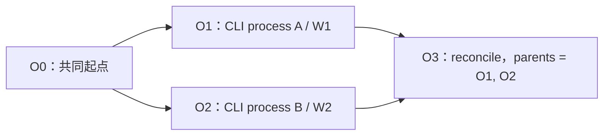
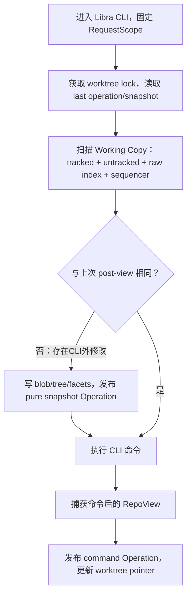
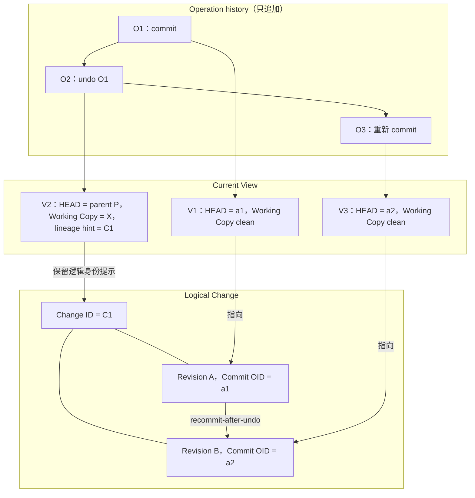
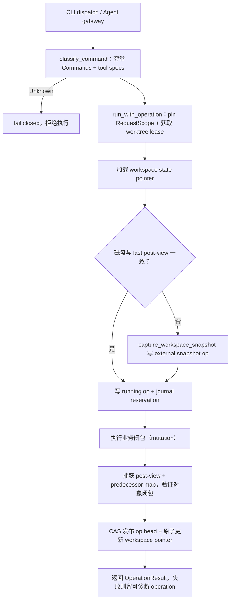

# Operation Log、Working Copy 快照与稳定 Change ID 设计

**面向读者：** Libra 维护者、贡献者与 CLI 功能开发者

## 1. 背景与设计选择

Libra 是一款AI版本控制工具，当前已经具备Git-compatible对象存储、Git命令、linked worktree、AI object model和部分Operation记录，但还不能完整回答三个问题：

- 一次 CLI 操作究竟修改了哪些仓库状态？
- 未提交文件、index、branch 或 rebase 中间态能否统一撤销？
- commit 经 amend/rebase 改写后，怎样继续识别同一项逻辑工作？

本方案借鉴 Jujutsu 的三项范式：

1. 全命令 Operation Log；
2. Working Copy Snapshot 与 Undo/Redo；
3. 稳定 Change ID 与 Rewrite Genealogy。

### 范围假设

本方案只处理 Libra CLI：

- Libra CLI 是唯一受支持的修改入口，每次可变命令对应一次Operation；
- 人工操作与Agent操作进入同一套AI版本控制模型，统一关联Intent及相关Plan、Task、Run、Invocation等因果对象；
- CLI入口负责把调用方提供的因果ID或缺失时创建的最小因果上下文规范化为同一结构；
- Operation保存这些AI对象的稳定ID链接，但AI对象本身继续由现有AI object store管理；
- Operation核心不根据调用者是人工还是Agent选择不同的Snapshot、Undo或Change ID逻辑；
- 编辑器、脚本或普通Git绕过Libra CLI产生的修改，在下一次Libra CLI入口被识别为external snapshot，但无法归因到某个Libra命令；
- 本方案不设计用户、Agent或命令权限模型，默认调用者拥有执行操作所需的最大权限。

“最大权限”只移除authorization、approval和sandbox设计，不移除数据一致性保护。ref lock、CAS、worktree lease、冲突检测和destructive-operation确认仍然需要，因为它们用于防止并发覆盖和数据丢失。

### Libra 与 jj 的区别

jj 不是 Git CLI 上增加几个命令，而是具有独立 repository view、operation store 和 working-copy 模型的版本控制系统。jj 可以使用 Git backend 保存 commit，但其上层语义与 Git 不同：Working Copy 被自动表示为 commit，核心模型没有 Git staging area，并使用 bookmark、workspace 和 Operation View 管理可见状态。

Libra 的定位不同。Libra 首先保持Git-compatible的CLI与仓库模型：

| 维度 | Libra | jj |
|---|---|---|
| 基础兼容目标 | 保留 Git refs、index、worktree、远端协议和现有 Git 工作流 | 提供新的 VCS 使用模型，可选择 Git backend 与 Git 互操作 |
| Working Copy | 需要精确保留 Git index、tracked/untracked 文件和 sequencer | Working Copy 自动成为 commit，核心模型不使用 Git staging area |
| 修改入口 | Libra CLI；Agent/automation也必须调用CLI | jj 命令与jj workspace |
| 并发模型 | 多CLI进程、Git linked worktree和现有ref/index语义 | jj Operation与jj workspace语义 |
| 语义模型 | 人工与Agent操作都关联Intent等AI对象，并连接Operation/Change | 以VCS仓库状态和命令模型为中心 |

### 为什么借鉴，而不取代现有 Git 后端

需要区分“使用 Git 对象保存 commit”和“采用 jj 的完整 repository model”。即使 jj 使用 Git backend，它仍然在 Git 之上维护自己的 Operation/View、Working Copy 和可见性语义。直接以 jj model 取代 Libra 当前后端，会同时改变 index、refs、worktree、命令和迁移边界。

Libra 选择保留现有 Git-compatible 后端，原因是：

- 现有仓库、refs、index、fetch/push 和 Git 工具可以继续工作；
- 复用 Libra 已有 blob/tree/commit、pack、对象校验和本地/远端分层存储；
- 避免把本项目扩大为一次完整 VCS 后端与命令体系迁移；
- Libra 仍需处理Git index精确恢复、linked worktree、AI因果对象和现有CLI兼容边界；
- Operation、Snapshot 和 Change ID 是状态模型能力，不要求更换底层源码对象格式。

因此，本方案采用“借鉴语义、重新实现边界”的方式：

- 借鉴 jj 的 Operation/View 思想，但只在Libra CLI顶层建立统一mutation boundary；
- 借鉴 Working Copy 自动快照，但使用 Git tree/blob、raw index 和 Libra State Facets 表达；
- 借鉴稳定Change ID与predecessor genealogy，并将Intent等AI对象稳定关联到Operation和Change。

## 2. 要引入的三项能力

### 全命令 Operation Log

每个经过 Libra 的持久修改都形成 Operation：

- CLI 在顶层 middleware 中对命令进行穷举分类；
- 人工、Agent或automation都通过同一CLI入口执行修改，不提供独立Agent Operation入口；
- Operation保存固定RequestScope、命令类型、父Operation、pre-view、post-view和Intent/Run/Invocation等因果ID；
- Operation 历史只追加不改写，并允许形成 DAG；
- 编辑器或普通 Git 的外部修改在下一次 Libra 入口被识别为 external snapshot operation。

Operation 记录的是一次完整状态变换，而不只是命令文本。

### 多 CLI 进程、多 worktree 下的 append-only DAG

Operation DAG 与 Git commit DAG 是两张不同的图。Git commit DAG描述源码版本的父子关系；Operation DAG描述仓库View经过哪些动作演进。一次Operation可以创建多个commit、只修改working copy，或者完全不创建commit。

每个Operation节点都是不可变的，至少包含：

- 一个或多个父Operation ID，表示动作开始时观察到的仓库状态；
- 操作后的RepoView；
- 发起动作的repository、worktree、CLI命令和统一AI因果上下文；
- 完整性与冲突receipt。

仓库维护当前可见的Operation head集合，每个worktree还保存自己最后采用的Operation/View指针。发布采用CAS，而不是“最后写入者覆盖前一个结果”。

Operation-head CAS只负责保护历史发布，不能代替底层状态锁。Git refs仍需使用ref transaction/CAS，index与物理working copy仍需worktree lease和固定锁顺序。底层写入若因并发而失败，该动作只能记录为失败或冲突Operation并重新读取最新View，不能发布一个与磁盘事实不一致的成功post-view。

假设CLI进程A在worktree W1、CLI进程B在worktree W2，二者都从O0开始。它们可以由两个人、两个人工/Agent混合调用者或两个Agent启动；进入CLI后都使用相同Operation模型：



具体过程如下：

1. A与B分别固定O0及各自RequestScope，并捕获自己的pre-view；
2. A完成修改，写入O1，并通过CAS把已知head从O0推进到O1；
3. B仍然基于O0完成修改；发布时发现head已经变化，因此不能用O2覆盖O1；
4. Libra保留O1和O2两个head，表示两个都真实发生、但尚未收敛的并发操作；
5. 如果两个操作修改的是不同worktree facet或互不冲突的repo-wide refs，Libra创建多父Operation O3；
6. O3的RepoView合并双方结果，head集合收敛为O3；O0、O1、O2仍然保留在历史中。

Reconcile只合并能够证明无歧义的状态：

| 并发情况 | 处理方式 |
|---|---|
| W1与W2各自修改自己的working-copy/index facet | 自动合并到多父Operation |
| 双方修改不同local refs | 可以自动合并 |
| 双方把同一ref设置为相同目标 | 可以收敛并记录双方父Operation |
| 双方把同一ref设置为不同目标 | 保留两个heads并报告冲突，不猜测胜者 |
| 双方修改同一个物理worktree | 通过worktree lease/generation串行化；旧写入者不得发布 |
| SQLite projection或运行时cache变化 | 不合并旧值，根据收敛后的事实源重建 |

因此，多Agent并不意味着允许两个Agent无保护地同时写同一个目录。它们仍然是多个Libra CLI进程：推荐每个Agent使用独立linked worktree；如果共享同一个worktree，只允许持有当前worktree lease的进程发布，其他进程需要重新读取最新View后重试。

Undo同样遵守append-only语义。假设当前head为O3，需要撤销O1的效果，系统不会删除O1，而是在O3之后创建O4：

```text
O0 ──┬── O1 ──┐
     └── O2 ──┴── O3 ── O4（undo O1）
```

O4以O3为父，只反向应用O1中属于W1或明确选择facet的变化，并保留O2的结果。如果O1的反向变化与O3之后的状态冲突，则停止并要求显式选择。这样，操作的发生事实、并发分叉、收敛和撤销过程全部可追溯。

### Working Copy Snapshot

#### jj 如何实现

jj把每个workspace的Working Copy表示为一个working-copy commit。大多数jj命令在读取仓库后、执行命令逻辑前，都会先调用统一的snapshot流程：

```text
load repo/workspace
        ↓
lock working copy
        ↓
compare stored operation/tree with current repo
        ↓
scan changed files and write a new tree
        ↓
rewrite working-copy commit
        ↓
write View + snapshot Operation
        ↓
publish Operation and update workspace operation pointer
```

实现上包含以下步骤：

1. Working Copy本地状态保存最近一次operation ID、workspace name、上次tree和文件状态缓存；
2. snapshot前获取working-copy lock，并重新读取状态，避免基于锁前的旧信息继续写；
3. 使用sparse matcher、filesystem monitor和文件状态缓存缩小扫描范围，递归扫描需要检查的目录；
4. 根据ignore和auto-track规则处理新增文件，把变化内容写入backend object store并构建新的MergedTree；
5. 如果tree发生变化，就在repository transaction中重写working-copy commit，并在正常情况下保留它的Change ID；
6. 更新View中的workspace→working-copy commit映射，将该事务标记为snapshot Operation并发布；
7. 最后把新的tree state和operation ID写回workspace本地状态，用于下一次stale检测。

如果Working Copy没有变化，jj不需要重写working-copy commit。若workspace保存的operation ID落后于仓库head，jj会比较Operation祖先关系和tree，判定它是fresh、stale还是sibling，再选择重新加载、更新或报错。

这一实现成立的前提是：jj的Working Copy本来就是commit，并且核心模型没有Git staging area。因此磁盘文件变化可以直接表示为“重写当前working-copy commit”。

#### Libra 准备如何借鉴

Libra借鉴jj的四个核心机制：

- 所有可操作Working Copy的CLI命令都经过统一入口snapshot；
- 为每个worktree保存last operation ID和last snapshot指针，用于stale检测；
- 使用内容寻址tree/blob保存文件内容，未变化内容不重复存储；
- Snapshot与Operation一起发布，命令结束后再更新worktree指针。

但Libra不照搬working-copy commit。自动snapshot不会移动Git HEAD，也不会创建用户可见commit：

| 语义 | jj | Libra方案 |
|---|---|---|
| Working Copy表示 | 一个自动维护的commit | WorkspaceSnapshot manifest |
| 文件内容 | backend tree/blob | 现有Git tree/blob |
| staging/index | 核心模型没有Git index | 同时保存semantic index和byte-exact raw index |
| snapshot产生的ID | working-copy Commit ID；rewrite通常保留Change ID | Operation ID + Snapshot manifest OID |
| 是否产生Change ID | working-copy commit本身属于一个change | 自动snapshot不产生Change ID |
| HEAD变化 | workspace的@指向新working-copy revision | Git HEAD保持不变，只有libra commit才移动HEAD/ref |

因此，Libra一次CLI调用的流程设计为：



具体实现边界如下：

1. CLI入口固定RequestScope，获取worktree lease/lock，并读取上次Operation与Snapshot指针；
2. 复用status的进程外bounded I/O executor扫描文件，避免慢挂载或不可取消I/O拖死CLI；
3. tracked文件按Git index与stat信息做增量比较，untracked默认捕获、ignored默认排除；
4. 变化文件写入Git blob并构建working-copy tree，同时保存byte-exact raw index；
5. HEAD/refs、sparse、sequencer和worktree generation写入版本化State Facets；
6. 若入口状态不同于上次post-view，先发布一个pure external snapshot Operation，再执行当前CLI命令；
7. 命令完成后捕获post-view，发布command Operation，并原子推进worktree的last-operation pointer；
8. 任一Facet读取失败、文件持续变化或容量超限时标记partial，不能发布为fully-restorable。

RepoView最终由以下State Facets组成：

- HEAD 与 refs；
- tracked/untracked working-copy 内容；
- semantic index tree 与 byte-exact raw index；
- sparse、sequencer 和 worktree 状态；
- 每个 Facet 的完整性与 restore policy。

这个设计保留了jj“每次CLI先同步磁盘状态、用operation pointer检测stale、内容寻址保存快照”的优点，同时避免把Libra的未提交状态自动变成Git commit。

因此ID边界是明确的：

- 普通自动Snapshot：产生Snapshot manifest OID和Operation ID，不产生Commit OID或Change ID；
- Undo commit恢复出的Snapshot可以携带已有Change ID的lineage hint，但不会分配新的Change ID；
- libra commit：在一个Command Operation中产生新的Commit OID和Change ID；
- amend/rebase：产生新的Commit OID，逻辑主线继续继承原Change ID；
- Undo Snapshot或Commit Operation：创建新的Operation，不修改已有Commit OID。

### 稳定 Change ID 与 Genealogy

Libra 将三种身份分开：

| 标识 | 含义 | 是否随 rewrite 改变 |
|---|---|---|
| Operation ID | 一次CLI动作（人工与Agent语义相同） | 每次动作都产生新ID |
| Commit OID | 一个具体 commit revision 的内容身份 | amend/rebase 产生新 OID |
| Change ID | 一项逻辑变更 | 同一逻辑变更的主线 rewrite 中保持稳定 |

#### Change ID生成算法

Change ID有两种生成路径，不能混为一种：

**jj当前实现。**

- 新建change时，JJRng使用ChaCha20Rng生成16个随机字节；正常运行由系统随机源初始化，测试/调试可配置固定seed；
- Git backend的Change ID长度固定为16字节；
- Git commit带有合法change-id header时直接读取；
- 没有header的Git commit使用deterministic synthetic ID：取Commit ID末尾16字节，反转字节顺序并反转每个字节的bit。该路径不是为新change生成内容哈希，而是让同一legacy commit重复导入时得到相同ID。

**Libra新建逻辑变更：使用随机ID。**

- canonical value是16个原始字节，即128 bit；
- production使用ring::rand::SystemRandom从操作系统CSPRNG一次填充16字节；
- 不使用commit内容、patch、message、时间或用户信息计算；
- 存储层保存原始16字节，CLI使用带change前缀的hex编码和唯一短前缀展示；
- 本地写入发现ID已被无关change占用时重新生成；导入发现碰撞时报告显式冲突，不能自动合并。

不直接使用UUIDv4作为canonical格式。UUIDv4虽然同样适合生成唯一ID，但version/variant位使随机有效位约为122 bit，并附带Libra不需要的UUID格式语义。Change ID只需要一个opaque 128-bit identity。

**导入没有Change ID的既有Git commit：使用确定性synthetic ID。**

```text
synthetic_change_id =
    first_16_bytes(
        SHA-256(
            "libra-change-id-v1\0"
            || git_object_format
            || commit_oid_bytes
        )
    )
```

同一个legacy commit在不同机器和重复导入时会得到相同Change ID。域分隔字符串和object format用于避免跨协议复用，并同时支持SHA-1与SHA-256 Git仓库。该commit第一次在Libra中被rewrite后，新revision继承这个synthetic Change ID，并将其写入Libra sidecar。根据 OL-00 spike 结论，Libra 不写入 commit header；已有合法 `change-id` header 仅可作为导入兼容信息读取。详见 [`change-id-header-spike.md`](change-id-header-spike.md)。

#### OL-00 spike 结论（2026-08-25）

OL-00 使用真实 Git 临时仓库验证了带 `change-id` header 的 commit 可以被 Git 读取、通过 fsck，并经本地 push/clone 保留；同时验证了 sidecar-only 路径的 Git object closure 可枚举且不改变 commit object。该证据足以确认 Git 互操作性，但不足以把未知 header 的跨工具 rewrite 行为当作 Libra 写入协议。

因此，Libra 的 canonical 写入路径冻结为 **sidecar-only**：新建和 rewrite 不修改 commit object，不写 `change-id` header；导入既有 commit 时可以读取合法 header 并记录 `origin=header`，但没有 header 时仍使用本节定义的 synthetic Change ID。OL-00 的完整测试与限制见 [`change-id-header-spike.md`](change-id-header-spike.md)。

#### OL-01 只读 Worktree I/O 抽取落地记录（2026-08-29）

OL-01 已在 `codex/ol-01-worktree-io` 分支完成本地实现，基线为 `upstream/main` 的 `995fc1fa`。`src/internal/worktree_io/` 现在是 status 之外可复用的内部只读边界：`protocol` 定义 `IoRequest`/`IoEvent`、frame codec、平台路径编码、请求预算和 lexical validation；`executor` 提供 `WorktreeIo`、`IoLimits`、`CancellationToken`、typed outcome/error、稳定排序的 bounded pool，以及 helper process-group kill/reap/recycle。executor 保持 8 个并发、64 个 pending、8 MiB frame 的既有上限；byte/frame/entry 限制仍由 request/protocol 和流式 handler 强制。

能力类型保持分离：`WorktreeRootCapability` 只接受绝对、词法 canonical 的 root 和严格 relative path；`ObjectStoreCapability` 只用于 local-only object read。wire 两端的 request validation 只检查 root/path/OID/size 的词法和格式，不因校验而探测文件系统；parent status session 与长寿命 helper 按 root 复用一次昂贵的 sealed capability，root key 变化时重新 seal。每次 worktree 文件/目录读取仍通过 `beneath::open_root` 及 no-follow beneath 操作，以保留符号链接逃逸和 TOCTOU 的 fail-closed 防护。helper 不提供写操作，也不持有 ODB、SQLite 或 refs 写权限；object-store 读取不创建目录、不 hydration。

`status_io_worker` 目前只是兼容适配层，但仍承载 handler、root session、deadline glue，并保留原有 crate-internal `deadline_*`、hidden worker entry、数据类型和输出路径，因此 status CLI 输出没有行为变化。partial/checkpoint、fail-closed、cache protection、timeout/cancellation、object read 和 rename 语义均由既有 status 路径继续负责；OL-01 不改变 OL-00 关于 `change-id-header-spike.md` 的结论，也不改动该文件。

本地落地提交为 `7a98b01a`（worker 契约测试）、`814a385b`（只读 protocol/capability）、`ea15cd6b`（bounded executor）、`7173adaa`（status 接入及 seal 缓存性能修复）和 `0efa4623`（stable 1.98 暴露的 `upstream/main` 既有测试 lint 兼容修复：两处 `collapsible_if` 与三个未使用 import，纯机械、无行为变化）。在同一 runner、5000 files、3 次 warmup、10 次正式运行下，status benchmark 从 clean `198.605 ms / 34,963,456 B`、dirty `203.079 ms / 35,299,328 B` 变为 clean `202.626 ms / 35,078,144 B`、dirty `202.620 ms / 35,430,400 B`，通过本卡性能阈值。stable `1.98`/nightly `1.100` 下，`internal::worktree_io` 为 13/13、`status_io_worker` 为 10/10，`cargo test --test command_test status` 为 289 passed / 0 failed / 2781 filtered（287.67s），`cargo test --test compat_serial_registry` 为 18/18，另有 12 个精确 status/diff 回归均通过；stable clippy `RUSTUP_TOOLCHAIN=stable LIBRA_SKIP_WEB_BUILD=1 cargo clippy --all-targets --all-features -- -D warnings` 通过，fmt 已通过。独立 `gpt-5.6-sol` 高推理强度 review、最终 upstream sync/retest、push/PR 尚待完成；本轮未运行全量 `cargo test --all`，不在本轮用户要求范围。

新逻辑变更不能使用内容哈希生成Change ID，因为amend、rebase、修改message或tree都会改变哈希，正好破坏“逻辑身份稳定”这一目标。Commit OID继续负责内容完整性，Change ID只负责逻辑身份。

新逻辑变更获得Change ID后，amend、reword、rebase继承；duplicate创建新Change ID；split与squash按显式规则处理。

每次 rewrite 在产生它的 Operation 中保存 typed successor-to-predecessor edge。该关系不同于 Git commit parent：parent 描述源码历史，predecessor 描述一个 revision 如何被另一个 revision 替代或演化。

Intent、Plan、Task、Run和Invocation等AI对象通过稳定ID关联Operation与Change，而不直接绑定某一个易变的Commit OID。这样无论操作由人工还是Agent发起，commit经过amend/rebase后仍可沿Change ID找到同一逻辑工作及其因果历史。

## 3. Undo 的语义以及与两种 ID 的关系

### Undo 的作用范围

Undo 只对已经形成完整、可恢复 Operation 的 Libra 状态生效。

| 状态/副作用 | 默认 Undo 行为 |
|---|---|
| 当前 worktree 的 HEAD、index、tracked/untracked 文件、sequencer | 自动恢复 |
| 当前 worktree 所属的 local ref 变化 | 随 Operation 恢复 |
| repo-wide refs 或其他 worktree | 必须显式选择并确认 |
| SQLite projection、stat cache等派生状态 | 不恢复旧值，根据事实源重建 |
| push、网络发布或其他外部系统副作用 | 只记录 receipt；本地 Undo 不承诺撤回外部结果 |

默认执行 op undo 时，目标是当前 RequestScope 的最近一个可恢复 Operation。指定历史 Operation 时，Libra应用该操作相对父Operation的反向状态变化；如果后续状态已产生冲突，则停止并给出冲突/选择，而不是覆盖后续工作。精确切换到某个完整历史View使用 op restore，反向合并历史效果使用 op revert。

### Undo 可以执行多少次

Undo 不设置固定的“最多 N 次”限制。用户可以连续Undo/Redo，或选择任意仍被保留且对象闭包完整的Operation。

但 Undo 不是数学意义上的无限：

- Operation metadata、pre/post View 和所引用对象必须仍在 retention 范围内；
- GC 不得删除被保留 Operation 引用的对象；
- 快照必须是完整且通过校验的；
- 存储容量、管理员策略或用户主动清理可以结束旧恢复点的生命周期；
- 发布前必须提供可查询的保留状态，不能在对象缺失时尝试“尽力恢复”。

因此，对外承诺应表述为：

> Undo 次数不受固定步数限制；可恢复深度由仍被保留且完整的 Operation 历史决定。

### 可以 Undo commit 吗

可以撤销“创建 commit 的那次 Operation”，但 Undo 不修改或删除 commit 对象。

假设提交前状态为：

```text
HEAD = parent P
index / working copy = change X
```

执行 commit 后：

```text
生成 revision A
Commit OID = a1
Change ID = C1
HEAD = a1
index / working copy = clean
```

紧接着 Undo 这次 commit：

```text
创建新的 Undo Operation
HEAD 恢复为 parent P
index / working copy 恢复为 change X
commit object a1 保持不变
Change C1 仍在历史中可追溯
```

如果随后 Redo，可以重新让当前 View 指向 a1，而不需要生成新的 Commit OID。a1 只有在超出 Operation retention、变成不可达且经过 GC 后才可能被回收。

这里需要区分“Redo”和“Undo后重新Commit”：

- **Redo：** 恢复原commit Operation的post-view，HEAD重新指向a1；Commit OID和Change ID都不变；
- **重新Commit：** 如果时间戳、message、tree、parent或header不同，会生成新Commit OID a2；
- Undo恢复Working Copy时会在WorkspaceSnapshot中携带已有C1的lineage hint，重新Commit默认继承C1并记录a2由a1演化；
- 如果用户明确把恢复出的内容作为一项全新逻辑工作提交，则生成新的Change ID；
- 如果只提交恢复内容的一部分，则按split规则处理，不能让两个独立可见change无意共享同一C1。

因此，Undo后“当前看到的Commit OID”可能变化，但已有commit object的OID不会变化。变化只表示当前View选择了父提交或一个新revision，不会破坏以Change ID为锚点的Intent、Operation和逻辑历史。

### Commit OID、Change ID 与 Undo 关系图

下面的例子表示：先创建revision A，Undo commit后恢复未提交内容，再重新Commit生成revision B。



这个图表达五条规则：

1. O1、O2、O3 是三次不同动作，因此有三个不同 Operation ID；
2. O2只让当前View从a1回到parent P，并恢复Working Copy X，不修改a1；
3. 重新Commit可能因时间戳、message或内容变化生成新的Commit OID a2；
4. A与B仍属于同一逻辑工作，因此都关联Change ID C1；
5. genealogy记录B由A在Undo后重新提交而来，Intent等上层对象继续绑定C1。

如果O2之后执行的是Redo而不是重新Commit，则不会产生B或a2，当前View直接重新指向A/a1。

### 三者的职责边界与影响

| 对象 | Undo commit时发生什么 | 是否受Commit OID变化影响 |
|---|---|---|
| Operation ID | Undo创建新Operation ID，原commit Operation保留 | 不受影响；Operation历史独立 |
| Commit OID | 原a1保持不变；HEAD可离开a1；重新Commit可能产生a2 | OID消费者需要识别这是不同revision |
| Change ID | C1保留；同一逻辑工作的a2继承C1 | 不受影响；这正是Change ID存在的目的 |
| Intent/Run/Invocation | 继续关联Operation和C1 | 不应只绑定易变Commit OID |
| Git ref/remote | 当前ref可能从a1回到P或前进到a2 | 会受影响，需要正常fetch/push/ref更新 |

所以影响是可控的：Git层仍把a1与a2视为两个不同commit；Libra层通过C1把它们视为同一逻辑change的不同revision，通过Operation DAG记录为什么从一个状态切换到另一个状态。

## 4. 实施路线与完成边界

| 阶段 | 主要结果 |
|---|---|
| 1. Operation/Snapshot 底座 | 固定 mutation/state census；实现不可变 View、Operation DAG、journal、CAS heads 和 bounded I/O |
| 2. 完整快照与 Undo | 覆盖 HEAD/refs/index/files/sequencer；接入全部CLI mutation并进行shadow验证；开放crash-safe undo/redo/restore |
| 3. Change ID 与 Genealogy | 接入amend/rebase/squash/split/duplicate，形成完整revision evolution，并关联Intent/Run/Invocation |
| 4. 并发、Web 与收口 | 支持多worktree Operation heads/reconcile；提供Operation/Change Web图；移除v1 Operation代码 |

实施遵循三个顺序：

- 先证明快照完整，再开放 Undo；
- 先证明单 worktree 恢复，再开放自动并发收敛；
- 先冻结后端事实源，再构建 Web projection。

第一版最小闭环是：在固定RequestScope下，完整记录单worktree的CLI修改及其Intent等AI因果链接，安全恢复最近或指定的可恢复Operation，并保证Undo commit不改变已有Commit OID。人工、Agent和automation只要调用Libra CLI，就自然获得相同能力，不需要第二套接入路径。具体结构体、函数设计与实现路径见第 5 节。

## 5. 具体实施方案（结构体、函数与实现路径）

本章把前面三节的设计落到具体代码结构：模块怎么切、结构体怎么定义、核心函数做什么、按什么顺序实现。所有落点都基于当前 Libra 源码（`src/cli.rs` 的 `enum Commands` 与 dispatch、`src/internal/operation_wrapper.rs`、`src/internal/operation.rs` 的 `OperationService`、`src/internal/db.rs:557-606` 的 operation schema、`src/internal/worktree_scope.rs` 的 `WorktreeScope`、`src/command/status_io_worker.rs`）以及 pinned Jujutsu 源码（外部参考仓库 `jj/`，见 `lib/src/op_store.rs`、`lib/src/transaction.rs`、`lib/src/local_working_copy.rs`、`lib/src/commit_builder.rs`、`lib/src/backend.rs`）。

### 5.1 模块划分与文件落点

当前 `src/internal/operation_wrapper.rs` 与 v1 `OperationService`、`operation_view*` 三表构成旧 operation 路径。最终方案仍**不维护 v1 长期兼容层或双写 adapter**；但 OL-02～OL-04 的安全基础窗口必须保持 active wrapper 可用。因此 migration 在单事务内以 copy-first 方式将 v1 表迁移到明确的 `legacy_operation*` 命名空间，再创建 v2 canonical schema；现有 v1 DAO/service 仅改为访问 legacy 表，新 `OperationStoreV2` 只访问 v2 表。OL-09/OL-15 完成 runtime cutover、回归和删除验收后，才移除 legacy 表与 v1 代码。

#### ADR-OL-01b：OL-02～OL-04 legacy staging

- **Status:** Accepted for the 2026-09-05 execution window
- **Atomic migration:** migration runner 在同一 SQLite 写事务中 claim version、创建 staging 表、copy v1 行、校验行数和关键字段、删除旧 source 并 rename 为 `legacy_*`，最后创建八张 v2 表；任一步失败都回滚 version claim、staging、rename 与数据。
- **No false genealogy:** v1 的 view/workspace 快照不能无损重建 `RepoViewV2`/`WorkspaceSnapshotV2`，因此旧行不转换成 v2 view、journal、head、change genealogy 或 AI link。无法无损映射的字段继续保留在 legacy 数据中。
- **Runtime boundary:** 本窗口 active operation logging 继续只读写 `legacy_operation*`；v2 store/codec 只读写 v2 表；禁止 v1/v2 双写。maintenance/object-root 路径也显式使用 legacy 命名空间，避免迁移后运行时断裂。
- **Deletion condition:** 只有 OL-09/OL-15 完成所有 CLI/Agent mutation cutover、active logging smoke、legacy 读写零命中守卫、object-root/maintenance 收口、备份与删除演练、兼容矩阵验收后，才允许单独删除 `legacy_*` 表、legacy model/service 和 fixture；在此之前不得删除或清空 legacy 数据。

| 新模块/文件 | 职责 | 借鉴的 jj 实现 |
|---|---|---|
| `src/internal/operation/mod.rs` | v2 operation 公共类型与 re-export | `jj/lib/src/op_store.rs` |
| `src/internal/operation/store.rs` | OperationV2 持久化、op heads CAS、journal | `jj/lib/src/op_store.rs`、`jj/lib/src/op_heads_store.rs` |
| `src/internal/operation/transaction.rs` | OperationTransactionCoordinator：锁→pre-scan→journal→mutation→post-scan→publish | `jj/lib/src/transaction.rs` 的 `write()` + `publish()` |
| `src/internal/operation/view.rs` | RepoViewV2 / WorkspaceSnapshotV2 canonical codec 与闭包校验 | `jj/lib/src/op_store.rs::View` |
| `src/internal/operation/facet.rs` | StateFacet trait、FacetRegistry、RestorePolicy | jj View 的各字段所有权划分 |
| `src/internal/operation/snapshot.rs` | working copy 扫描与捕获（复用 worktree_io） | `jj/lib/src/local_working_copy.rs` 的 `TreeState::snapshot` |
| `src/internal/operation/working_copy.rs` | workspace state pointer、stale/sibling 检测 | jj workspace 保存的 last operation ID |
| `src/internal/operation/middleware.rs` | CLI 顶层命令分类与统一 mutation 边界 | jj 几乎所有命令先 snapshot 再执行 |
| `src/internal/operation/restore.rs` | RestoreEngine、journal 前滚/回退、dry-run receipt | `jj/cli/src/commands/restore.rs` |
| `src/internal/operation/undo.rs` | undo/redo/revert 追加式语义 | `jj/cli/src/commands/undo.rs`、`redo.rs`、`revert.rs` |
| `src/internal/operation/doctor.rs` | 对象闭包、op heads、journal、workspace pointer 修复 | `jj debug operation` / `debug reindex` 思路 |
| `src/internal/change/identity.rs` | ChangeId 128-bit 类型、随机生成、legacy synthetic | `jj/lib/src/backend.rs::ChangeId` |
| `src/internal/change/store.rs` | change identity/revision 投影与查询 | jj 无直接对应；对应 `change_identity/change_revision` 表 |
| `src/internal/change/builder.rs` | ChangeRevisionBuilder，唯一 commit 构建/重写入口 | `jj/lib/src/commit_builder.rs` |
| `src/internal/change/genealogy.rs` | typed predecessor 多边与 evolution 查询 | `jj/lib/src/op_store.rs::Operation.commit_predecessors` |
| `src/internal/change/resolve.rs` | short-prefix 解析与歧义诊断 | `jj/lib/src/id_prefix.rs` |
| `src/internal/worktree_io/` | 从 `status_io_worker.rs` 抽取的通用 bounded 只读 I/O executor | jj 无直接对应（Libra 特有可靠性层） |
| `db.rs` v2 schema + `sql/` 表定义 | 替换 v1 operation 表与 model（开发期直接重建，不做 additive） | — |
| `src/internal/ai/tools/*`、`ai/libra_vcs.rs` | Agent tool mutation gateway（AGOP） | — |

### 5.2 核心结构体设计

所有 manifest 都是版本化 canonical serialization：map key 排序、禁止浮点/隐式默认值，hash 计算前先做 schema validation。内容寻址对象写入现有 `ClientStorage`（Git ODB），SQLite 只保存协调状态与可重建投影。

#### 5.2.1 StateFacet：所有可恢复状态的统一接口

```rust
// src/internal/operation/facet.rs
#[derive(Debug, Clone, Copy, PartialEq, Eq)]
pub enum RestorePolicy {
    AutoRestore,    // HEAD/refs/index/tracked/untracked/sequencer/sparse —— 普通 undo 自动恢复
    Rebuild,        // DerivedProjection —— 从事实源重建（object_index、stat cache、change projection）
    NeverRestore,   // EphemeralRuntime —— session memo、lease token 恢复会破坏并发控制
}

#[derive(Debug, Clone, PartialEq, Eq)]
pub struct FacetCapture {
    pub facet: FacetName,
    pub schema_version: u32,
    pub payload_oid: Option<ObjectHash>, // 写入 Git ODB 的 blob/tree OID
    pub meta: serde_json::Value,          // 有界、redacted 的 facet 元数据
}

pub trait StateFacet: Send + Sync {
    fn name(&self) -> FacetName;
    fn schema_version(&self) -> u32;
    fn restore_policy(&self) -> RestorePolicy;
    fn capture(&self, ctx: &FacetCaptureCtx) -> Result<FacetCapture, FacetError>;
    fn validate(&self, capture: &FacetCapture) -> Result<(), FacetError>;
    fn restore(&self, capture: &FacetCapture, ctx: &mut FacetRestoreCtx) -> Result<(), FacetError>;
    /// 计算 from -> to 的语义 delta，供 `op revert` 做逆向合并；restore 用完整 capture，revert 用 delta。
    fn diff(&self, from: &FacetCapture, to: &FacetCapture) -> Result<FacetDiff, FacetError>;
    fn roots(&self, capture: &FacetCapture) -> Vec<ObjectHash>; // GC/cloud-sync root 枚举
}
```

`FacetRegistry` 用 `FacetName -> Box<dyn StateFacet>` 注册所有 mutable state owner。新增 mutable state 若未注册，任何命令都不得把它标为 `fully_restorable`（fail closed）。当前 v1 的 `operation_view_ref` / `operation_view_workspace` 只是 HEAD/refs 快照，升级后这些信息由 RefStateFacet + WorkspaceFacet 表达。

本方案不设权限模型（第 1 节范围假设：CLI、Agent、automation 默认拥有最大权限），因此 `RestorePolicy` 只保留数据一致性与并发控制语义，不含 security/approval 类别；extension/security 配置作为普通 AutoRestore facet 处理。

#### 5.2.2 RepoViewV2 与 WorkspaceSnapshotV2

```rust
// src/internal/operation/view.rs
#[derive(Debug, Clone, Serialize, Deserialize)]
#[serde(rename_all = "snake_case")]
pub struct RepoViewV2 {
    pub schema_version: u32,
    pub repo_id: String,
    pub refs_facet_oid: ObjectHash,                          // repo-wide refs
    pub workspaces: BTreeMap<WorkspaceId, ObjectHash>,       // workspace_id -> WorkspaceSnapshotV2 manifest OID
    pub change_roots: Vec<ObjectHash>,                       // change genealogy roots（GC 用）
    pub extension_facets: BTreeMap<FacetName, ObjectHash>,   // extension/security/derived 分类
}

#[derive(Debug, Clone, Serialize, Deserialize)]
#[serde(rename_all = "snake_case")]
pub struct WorkspaceSnapshotV2 {
    pub schema_version: u32,
    pub workspace_id: WorkspaceId,
    pub head: HeadState,                       // symbolic（branch）或 detached OID
    pub index_tree_oid: ObjectHash,            // semantic index tree
    pub raw_index_blob_oid: ObjectHash,        // byte-exact raw index（含 intent-to-add/skip-worktree/stat 等位）
    pub working_copy_tree_oid: ObjectHash,     // tracked + untracked 的 Git tree
    pub untracked_manifest_oid: ObjectHash,    // untracked 路径清单 + capture policy
    pub sparse_facet_oid: Option<ObjectHash>,
    pub sequencer_facet_oid: Option<ObjectHash>,
    pub worktree_generation: u64,              // worktree lease/generation，用于 stale 与 takeover
    pub capture_policy: CapturePolicy,         // tracked | tracked+untracked | fail-closed 上限
    pub completeness: Completeness,            // Full | Partial
    pub facet_restore_policies: BTreeMap<FacetName, RestorePolicy>,
}
```

对应关系：jj 的 `View`（`jj/lib/src/op_store.rs:249-278`）用 `head_ids/local_bookmarks/tags/remote_views/git_refs/git_heads/wc_commit_ids` 表达仓库状态；Libra 的 `RepoViewV2` 用 refs facet + workspace map 表达同样的“repo 全貌”，而每个 workspace 的完整内容（jj 的 `wc_commit_ids` 只是 commit 指针）升级为 `WorkspaceSnapshotV2`。`raw_index_blob_oid` 是 byte-exact 恢复面，因为 Git tree 表达不了 intent-to-add、skip-worktree、assume-unchanged、split-index/stat cache 等 index 位；`index_tree_oid` 用于语义 diff、闭包验证与跨版本降级。

#### 5.2.3 OperationV2

```rust
// src/internal/operation/store.rs
#[derive(Debug, Clone, PartialEq, Eq)]
pub struct OperationV2 {
    pub op_id: String,                       // UUIDv7，时间有序（不承担内容身份）
    pub parent_op_ids: Vec<String>,          // 多父 DAG；Phase 1 可先只写一个父
    pub pre_view_oid: ObjectHash,            // mutation 前 RepoViewV2（pre-view 规则见 5.3.1）
    pub post_view_oid: ObjectHash,           // mutation 后 RepoViewV2
    pub kind: OperationKind,                 // Command | ExternalSnapshot | Undo | Redo | Restore | Revert | Reconcile
    pub status: OperationStatusV2,           // Running | Success | Failed | Partial | Aborted
    pub metadata: OperationMetaV2,           // redacted：command/args_digest/actor/causal ids
    pub restores_op_id: Option<String>,
    pub reverts_op_id: Option<String>,
    pub predecessor_map_oid: Option<ObjectHash>, // typed PredecessorEdge 清单（含 relation kind），供 genealogy 重建
}
```

对照 jj（`jj/lib/src/op_store.rs:358-413`）：`Operation { view_id, parents, metadata, commit_predecessors }`。Libra 增加 `pre_view_oid` 与 `restores/reverts_op_id`，因为 Libra 的 undo/restore 是显式状态变换，需要知道“从哪个 view 到哪个 view”，而不是 jj 那样把 undo 也做成一次普通 transaction 后靠 view diff 推断。`OperationMetaV2` 的 causal 字段（`session_id/run_id/tool_invocation_id/intent_id`）只保存 redacted ID 与 config provenance digest，不保存 prompt/transcript/secret/lease token。

#### 5.2.4 ChangeId、ChangeRevision 与 PredecessorEdge

```rust
// src/internal/change/identity.rs
#[derive(Debug, Clone, Copy, PartialEq, Eq, Hash, PartialOrd, Ord)]
pub struct ChangeId(pub [u8; 16]); // 128-bit opaque 逻辑身份

impl ChangeId {
    pub fn generate(rng: &mut impl RngCore) -> Self;       // production 用 ring::rand::SystemRandom
    pub fn synthetic_for_commit(commit_oid: &ObjectHash, format: GitObjectFormat) -> Self;
    pub fn to_hex(&self) -> String;                        // 32 hex chars
    pub fn short_prefix(&self, len: usize) -> String;
}

// src/internal/change/store.rs
pub struct ChangeRevision {
    pub change_id: ChangeId,
    pub commit_oid: ObjectHash,
    pub created_op_id: String,
    pub revision_ordinal: u64,
}

// src/internal/change/genealogy.rs
pub struct PredecessorEdge {
    pub successor_oid: ObjectHash,
    pub predecessor_oids: Vec<ObjectHash>,
    pub op_id: String,
    pub kind: RelationKind, // Amend | Rebase | CherryPick | Squash | Split | Duplicate | Import | ExternalReconcile
    pub ordinal: u64,
}
```

jj 的 `ChangeId` 是 `id_type!(ChangeId { reverse_hex() })`（`jj/lib/src/backend.rs:52-56`），`Commit` 结构自带 `change_id` 字段并在 rewrite 时默认继承（`jj/lib/src/commit_builder.rs:336-344` 的 `set_change_id` / `generate_new_change_id`）。Libra 不把 ChangeId 塞进 Git commit 对象格式（避免改动 OID），而是：随机新 ID 写入 sidecar/operation manifest；legacy import 用 `synthetic_for_commit`（`SHA-256("libra-change-id-v1\0" || object_format || commit_oid_bytes)` 前 16 字节）；`ChangeRevision` 投影记录 `(change_id, commit_oid)` 二元组，解决“一个 change 有多个 revision”的查询；`PredecessorEdge` 对应 jj `Operation.commit_predecessors`（`BTreeMap<CommitId, Vec<CommitId>>`），但加上 relation kind 以表达 squash/split/duplicate 多边语义。

#### 5.2.5 SQLite v2 表结构（legacy staging 后的 canonical schema）

v2 schema 是最终 canonical schema。OL-02～OL-04 不直接删除仍被 active wrapper 使用的 v1 表，而是先将 `operation / operation_parent / operation_view / operation_view_ref / operation_view_workspace` 在事务内迁移为 `legacy_operation / legacy_operation_parent / legacy_operation_view / legacy_operation_view_ref / legacy_operation_view_workspace`，再按下面定义创建 v2 八表。该 staging 不是长期双写兼容层：v1 runtime 仅为本窗口访问 legacy，所有新 v2 store 写入只落 v2；legacy 删除条件由 ADR-OL-01b 规定。

```sql
CREATE TABLE IF NOT EXISTS operation (
    op_id              TEXT PRIMARY KEY,
    repo_id            TEXT NOT NULL,
    format_version     INTEGER NOT NULL DEFAULT 2,
    kind               TEXT NOT NULL,          -- command|external_snapshot|undo|redo|restore|revert|reconcile
    status             TEXT NOT NULL,          -- running|success|failed|partial|aborted
    command_name       TEXT,
    description        TEXT,
    args_digest        TEXT,
    actor              TEXT,
    worktree_id        TEXT,
    scope_kind         TEXT NOT NULL,          -- main|linked|repository
    pre_view_oid       TEXT NOT NULL,
    post_view_oid      TEXT NOT NULL,
    restores_op_id     TEXT,
    reverts_op_id      TEXT,
    predecessor_map_oid TEXT,
    causal_context_id  TEXT,
    start_ts           INTEGER NOT NULL,
    end_ts             INTEGER
);

CREATE TABLE IF NOT EXISTS operation_parent (
    op_id        TEXT NOT NULL,
    parent_op_id TEXT NOT NULL,
    ordinal      INTEGER NOT NULL,
    PRIMARY KEY (op_id, parent_op_id)
);

CREATE TABLE IF NOT EXISTS operation_head (
    repo_id    TEXT NOT NULL,
    scope_key  TEXT NOT NULL,
    op_id      TEXT NOT NULL,
    generation INTEGER NOT NULL,
    PRIMARY KEY (repo_id, scope_key, op_id)
);

CREATE TABLE IF NOT EXISTS operation_journal (
    journal_id       TEXT PRIMARY KEY,
    op_id            TEXT NOT NULL,
    phase            TEXT NOT NULL,          -- reserved|pre_view|mutation|post_view|publish
    pre_view_oid     TEXT,
    target_view_oid  TEXT,
    owner            TEXT NOT NULL,
    updated_at       INTEGER NOT NULL,
    recovery_payload TEXT
);

CREATE TABLE IF NOT EXISTS change_identity (
    change_id    TEXT PRIMARY KEY,
    repo_id      TEXT NOT NULL,
    origin       TEXT NOT NULL,              -- random | synthetic | header
    created_op_id TEXT NOT NULL,
    created_at   INTEGER NOT NULL
);

CREATE TABLE IF NOT EXISTS change_revision (
    change_id       TEXT NOT NULL,
    commit_oid      TEXT NOT NULL,
    created_op_id   TEXT NOT NULL,
    visibility      TEXT NOT NULL,           -- visible | hidden
    revision_ordinal INTEGER NOT NULL,
    PRIMARY KEY (change_id, commit_oid)
);

CREATE TABLE IF NOT EXISTS change_predecessor (
    successor_oid   TEXT NOT NULL,
    predecessor_oid TEXT NOT NULL,
    op_id           TEXT NOT NULL,
    relation_kind   TEXT NOT NULL,
    ordinal         INTEGER NOT NULL,
    PRIMARY KEY (successor_oid, predecessor_oid, op_id)
);

CREATE TABLE IF NOT EXISTS ai_operation_link (
    operation_id    TEXT PRIMARY KEY,
    session_id      TEXT,
    run_id          TEXT,
    tool_invocation_id TEXT,
    intent_id       TEXT,
    repo_id         TEXT NOT NULL,
    worktree_id     TEXT,
    workspace_id    TEXT,
    lease_generation INTEGER,
    config_provenance_digest TEXT,
    redaction_version TEXT NOT NULL
);
```

`operation_head` 对应 jj 的 op heads store（`jj/lib/src/op_heads_store.rs`）：发布采用 CAS（比较旧 generation/旧 head 集合），并发分叉时允许多行存在，之后由 reconcile operation 收敛。v2 的 `op_id` 沿用 UUIDv7（时间有序、方便日志排序），不承担内容身份；`view_id` 从 v1 的 UUID 升级为 `RepoViewV2` manifest 的 `ObjectHash`（`view_oid` 是 canonical manifest 内容身份，SQLite row ID 不是）。v1 的 `restorable` 标志被 `completeness` + `facet_restore_policies` 取代，不再单独维护。

### 5.3 核心函数设计

#### 5.3.1 顶层 middleware：`run_with_operation` 与 `classify_command`

```rust
// src/internal/operation/middleware.rs
pub enum MutationClass {
    ReadOnly,            // log/show/diff：只做 stale scan，无变化不写 op
    WorkspaceMutation,   // add/rm/checkout/restore/apply_patch
    RepoMutation,        // branch/tag/commit/reset/fetch-import
    SequencerMutation,   // rebase/cherry-pick continue/abort：允许 running journal
    LibraStateMutation,  // worktree registry/sparse/AI checkpoint pointer
    ExternalOrUnknown,   // Agent shell/hook/外部 git：前后 scan，无法验证则 fail closed
    InternalWorker,      // hidden internal helper：不产生 Operation
}

pub async fn run_with_operation<T, F>(
    scope: &PinnedRequestScope,          // 入口一次性 pin，禁止中途重新解析 cwd
    meta: OperationMetaV2,
    class: MutationClass,
    f: F,                                // 业务闭包，接收 &mut OperationTxn
) -> Result<OperationResult<T>, OperationError>
where
    F: FnOnce(&mut OperationTxn) -> Pin<Box<dyn Future<Output = Result<T, OperationError>> + Send + '_>>;
```

实现顺序（对应 ADR-SNAP-02 与 jj 的“命令前先 snapshot”边界）：



pre-view 规则：命令 Operation 的 `pre_view_oid` 等于入口检测到外部变化时外部 snapshot op 的 `post_view_oid`；无外部变化时等于 last post-view。

`src/cli.rs` 的 `enum Commands`（`:336`）与各 dispatch match（`:1474/:1681/:2123`）改为先过 `classify_command`；Agent 侧在 `src/internal/ai/tools/*` 与 `ai/libra_vcs.rs` 的每个会产生持久修改的 tool call 前后调用同一入口。`InternalWorker` 在 `main` 进入 upgrade/recovery/middleware 之前分流，只执行 capability-scoped 只读 IPC，永不创建 Operation。

#### 5.3.2 快照：`WorkspaceSnapshotter` 与 `scan_working_copy`

```rust
// src/internal/operation/snapshot.rs
pub struct WorkspaceSnapshotter {
    scope: PinnedRequestScope,
    io: Arc<WorktreeIo>,                 // 抽取后的 bounded 只读 I/O executor
    pointer: WorkspaceStatePointer,      // last op id + last snapshot OID + generation
}

impl WorkspaceSnapshotter {
    /// 入口统一调用：锁 worktree -> 扫描 -> 变化则写 blob/tree/facets -> 发布 pure snapshot op。
    pub async fn capture(&mut self) -> Result<SnapshotOutcome, SnapshotError>;
    /// 增量扫描 tracked（stat + index）+ untracked（policy 控制），经 worktree_io 隔离挂死 syscall。
    pub async fn scan_working_copy(&self) -> Result<ScanResult, ScanError>;
}
```

对应 jj `TreeState::snapshot`（`jj/lib/src/local_working_copy.rs:1292-1423`）：jj 用 matcher（sparse × fsmonitor × force_tracking）限定访问范围、通道流式收集 tree entries/file states/untracked/deleted、最后 `MergedTreeBuilder::write_tree`。Libra 的差异点：扫描不重写 working-copy commit，而是（1）把变化文件写入现有 Git blob 并构建 `working_copy_tree_oid`；（2）byte-exact 保存 raw index；（3）HEAD/refs/sparse/sequencer/generation 写入各自 StateFacet；（4）把 facet 清单序列化为 `WorkspaceSnapshotV2` manifest 写入 `ClientStorage`；（5）发布 `ExternalSnapshot` 或 `Command` operation。扫描 I/O 全部走 `WorktreeIo`（从 `src/command/status_io_worker.rs` 抽取），协议带 root-relative capability 与 byte/frame 预算，helper 不持有 ODB/SQLite/refs 写权限。

`WorkspaceStatePointer`（`working_copy.rs`）每次入口读取，用于 stale 检测：

```rust
pub struct WorkspaceStatePointer {
    pub last_op_id: String,
    pub last_snapshot_oid: ObjectHash,
    pub generation: u64,
}

impl WorkspaceStatePointer {
    pub async fn load(scope: &PinnedRequestScope) -> Result<Self, PointerError>;
    pub async fn save(&self, scope: &PinnedRequestScope) -> Result<(), PointerError>;
    pub fn staleness(&self, head: &OpHeadsView) -> Staleness; // Fresh | Stale | Sibling
}
```

#### 5.3.3 持久化：`OperationStoreV2` 与 op-head CAS

```rust
// src/internal/operation/store.rs
pub struct OperationStoreV2 { /* ClientStorage + SQLite */ }

impl OperationStoreV2 {
    pub async fn write_view_manifest(&self, view: &RepoViewV2) -> Result<ObjectHash, StoreError>;
    pub async fn write_operation(&self, op: &OperationV2) -> Result<(), StoreError>;
    /// CAS：仅当 old_heads 仍是当前 head 时把 new_heads 发布；并发分叉时失败并返回当前 heads。
    pub async fn cas_update_op_heads(&self, repo_id: &str, scope_key: &str,
                                     old_heads: &[String], new_heads: &[String]) -> Result<(), StoreError>;
    pub async fn load_view(&self, view_oid: &ObjectHash) -> Result<RepoViewV2, StoreError>;
    pub async fn append_journal(&self, entry: &JournalEntry) -> Result<(), StoreError>;
    pub async fn read_heads(&self, repo_id: &str, scope_key: &str) -> Result<Vec<String>, StoreError>;
}
```

jj 的对应实现是 `UnpublishedOperation::publish`（`jj/lib/src/transaction.rs:231-237`）：先写 view 与 operation 对象，再持 op-heads store 锁调用 `update_op_heads(parent_ids, new_id)`。Libra 的 CAS 逻辑落在 `operation_head` 表上：发布时校验 `(repo_id, scope_key)` 下旧 head 集合与期望一致，不一致则保留两个 head 并报告并发；多父 reconcile operation 再把 head 集合收敛为单值。

#### 5.3.4 恢复：`RestoreEngine` 与 undo/redo/revert

```rust
// src/internal/operation/restore.rs
pub struct RestoreEngine {
    journal: RestoreJournal,   // operation_journal 表
    registry: FacetRegistry,
}

impl RestoreEngine {
    /// 把选择 facet 恢复为目标 view；先写 intent journal，再按固定锁序恢复，
    /// 每步幂等，失败可前滚到 target 或回到 pre-view。
    pub async fn restore(&self, target: &RepoViewV2, what: RestoreWhat) -> Result<RestoreReceipt, RestoreError>;
}
```

```rust
// src/internal/operation/undo.rs
pub async fn undo(scope: &PinnedRequestScope, op_ref: Option<&str>) -> Result<Receipt, OperationError>;
pub async fn redo(scope: &PinnedRequestScope, op_ref: Option<&str>) -> Result<Receipt, OperationError>;
pub async fn revert(scope: &PinnedRequestScope, op_ref: &str) -> Result<Receipt, OperationError>;
```

语义对照 jj CLI（`jj/cli/src/commands/undo.rs:47 cmd_undo`、`redo.rs:42 cmd_redo`、`restore.rs:104 cmd_restore`、`revert.rs:99 cmd_revert`）：

- `undo`：先 snapshot 当前磁盘，再取 target op 的 `parent -> target` 状态差，反向应用，写成新的 `Undo` operation；`undo` 自身可被再次 undo。
- `redo`：只重放与当前 lineage 可证明匹配的 undo；分叉/歧义返回稳定错误和候选，不猜测。
- `restore`：直接切换到某个历史 view（可选择 facet/scope）；repo-wide refs 需要显式确认。
- `revert`：把某 op 相对其父的逆向 delta 合并到当前 view，merge op 需要显式 parent。
- 所有命令支持 dry-run 与 JSON/machine receipt，receipt 列出会改的 facet、路径计数、ref diff、目标/新 op ID。

#### 5.3.5 Change ID 与 genealogy 核心函数

```rust
// src/internal/change/builder.rs
pub struct ChangeRevisionBuilder<'r> {
    repo: &'r mut Repo,
    draft: CommitDraft,                // tree/message/author/committer/parents
    change_id: ChangeId,
    predecessor: Option<CommitDraft>,  // 被重写的旧 revision
    rng: Arc<SystemRandom>,
}

impl<'r> ChangeRevisionBuilder<'r> {
    pub fn for_new_change(parents: Vec<ObjectHash>, tree: Tree) -> Self;   // 新随机 ChangeId
    pub fn for_rewrite(predecessor: &CommitDraft) -> Self;                 // 继承 ChangeId
    pub fn set_change_id(&mut self, id: ChangeId) -> &mut Self;
    pub fn generate_new_change_id(&mut self) -> &mut Self;                 // duplicate/新逻辑变更
    pub fn set_predecessors(&mut self, preds: Vec<ObjectHash>) -> &mut Self;
    pub async fn build(self, txn: &mut OperationTxn) -> Result<Commit, ChangeError>;
    // build 内：写 commit 对象 -> 插入 change_revision -> 记录 PredecessorEdge(kind) -> 返回 Commit
}
```

对照 jj `CommitBuilder`（`jj/lib/src/commit_builder.rs`）：`for_new_commit` 生成新 change ID（`commit_builder.rs:199`），`for_rewrite_from` 复制旧 commit 并保留 change_id（`commit_builder.rs:227-270`），`write()` 写对象后 `mut_repo.set_predecessors(commit.id(), predecessors)` 与 `set_rewritten_commit(old, new)`（`commit_builder.rs:398-425`）。Libra 要求所有 commit 构建/重写必须经过 `ChangeRevisionBuilder`，禁止调用点临时写 `change_predecessor` 表；`kind` 由调用方显式传入（amend/rebase/cherry_pick/squash/split/duplicate/import）。

```rust
// src/internal/change/resolve.rs
pub fn resolve_change_id_prefix(db: &DatabaseConnection, repo_id: &str,
                                prefix: &str) -> Result<ResolvedChangeId, ResolveError>;
// 结果：Exact(ChangeId) | Ambiguous(Vec<ChangeId>) | NotFound
```

`resolve_prefix` 对应 jj `id_prefix.rs`：human 输出用可辨识短前缀并处理歧义；JSON/machine 总是输出完整 canonical ID。

### 5.4 实现路径与阶段门

实施顺序与主计划（`/Users/jackie/ospp/libra-operation-log-change-id-plan-20260814.md`）的 Phase 0-8 依赖顺序保持一致：先证明快照完整，再开放 Undo；先单 worktree，再并发收敛；先冻结后端事实源，再做 Web projection。OL-02～OL-04 的落地窗口采用 ADR-OL-01b 的 legacy staging；最终仍不维护 v1 长期兼容层，OL-09/OL-15 完成切换后删除 legacy。

每个阶段进入下一阶段的 Gate 必要条件：本阶段验证入口的测试全部通过（含既有 `status`/CLI 回归与 fail-closed 守卫），任一未通过不得推进，不允许把未验证代码带进下一阶段。每阶段对应具体写集与验证入口：

| 阶段 | 落点（写集） | 验证入口 | 决策门 |
|---|---|---|---|
| 0 设计冻结 | 第 5 节结构体/函数定稿；OL-00 header spike | `cargo test --test commit_change_id_header_spike` | Gate-0：ADR 冻结、sidecar-only 写入决策；已有 header 仅作导入兼容 |
| 1 持久化与 I/O 底座 | `src/internal/worktree_io/`、`operation/{store,view,facet}.rs`、`db.rs` v2 schema + legacy staging（替换 v1 表的 canonical 角色） | `cargo test internal::operation::store`；`cargo test --test operation_dag`；status 零回归 benchmark | Gate-1：对象格式、journal phase、I/O 协议冻结 |
| 2 完整快照 | `operation/{snapshot,working_copy}.rs`、HEAD/refs/index/sequencer/sparse facet adapter | `cargo test --test workspace_snapshot_roundtrip`；`--test index_snapshot_roundtrip`；`--test sequencer_snapshot_roundtrip` | Gate-2：facet restore policy、untracked/ignored/large-file 政策 |
| 3 CLI + Agent 全修改记录 | `operation/middleware.rs`、`src/cli.rs` classification、`ai/tools/*` gateway | `cargo test --test operation_command_coverage`；`--test agent_shell_operation`；census zero-unclassified guard | Gate-3：shadow mismatch、失败 operation、lease takeover |
| 4 可逆用户工作流 | `operation/{restore,undo,doctor}.rs`、`src/command/op.rs` 新子命令 | `cargo test --test operation_restore_faults`；`--test op_undo_redo`；crash matrix | Gate-4：crash/数据安全 review、秒级 SLO、机器接口冻结 |
| 5 稳定逻辑身份 | `change/{identity,store,resolve}.rs`、commit serialization adapter | `cargo test internal::change::identity`；`--test change_id_resolution` | Gate-5：Change ID 格式、legacy synthetic、sidecar 投影与既有 header 导入语义 |
| 6 Rewrite 与 Agent 逻辑链接 | `change/{builder,genealogy}.rs`、commit/rebase/cherry-pick/squash 调用点、`ai_operation_link` | `cargo test --test change_genealogy_rebase`；`--test change_genealogy_squash_split` | Gate-6：relation 语义、hook/Git 兼容、AI FileHistoryStore 读取迁移（非 operation v1） |
| 7 并发与 Web 展示 | `operation/store.rs` 多 head reconcile、独立 Operation/Change read model | `cargo test --test operation_restore_multi_worktree`；web graph tests | Gate-7：multihead fallback、redaction、bounded graph |
| 8 移除 v1 与 GA | 删除 v1 代码/表/命令路径（`operation_wrapper.rs`、`operation_view*` 与 v1 model、v1 `op` 分支）、文档与测试收口 | `rg 'operation_wrapper|operation_view|restorable' src` 零命中；签名 release | Gate-8：v1 代码移除完成、默认值、retention 批准 |

依赖链：`worktree_io → store → snapshot → middleware → restore → undo`；`store → change/identity → change/builder → change/genealogy`；Agent gateway 消费 middleware 与 genealogy。每个生产 mutation surface 都由注册表穷举分类，未知/新增 mutation 默认 fail closed；所有跨介质窗口（对象/refs/index/worktree/SQLite/AI link）都有 journal phase 与 doctor 动作。

### 5.5 与现状代码的对应关系

| 现状（v1，`e9512516`） | 目标（v2） | jj 参考 |
|---|---|---|
| `with_operation_log`（`operation_wrapper.rs:405`，v1 最终删除） | `middleware::run_with_operation` | `jj/lib/src/transaction.rs::commit` |
| `OperationMeta`（`operation_wrapper.rs:60`，v1 最终删除） | `OperationMetaV2`（redacted causal ids） | `jj/lib/src/op_store.rs::OperationMetadata` |
| `ParentSelectionMode::SingleLatestSuccess`（`operation_wrapper.rs:46`，v1 最终删除） | `cas_update_op_heads` + 多父 reconcile | `jj/lib/src/op_heads_store.rs` |
| `OperationService::persist_operation_graph`（`operation.rs:1018`，v1 最终删除） | `OperationStoreV2::write_operation` + journal | `jj/lib/src/op_store.rs` |
| `operation_view*` 三表（`db.rs:581-605`，v1 删除） | `RepoViewV2` / `WorkspaceSnapshotV2` manifest OID | `jj/lib/src/op_store.rs::View` |
| 无（v1 不恢复 index/WC/sequencer） | `WorkspaceSnapshotter` / `RestoreEngine` | `jj/lib/src/local_working_copy.rs::TreeState::snapshot`、`jj/cli/src/commands/restore.rs` |
| 无（commit 只有 OID） | `ChangeId` / `ChangeRevision` / `PredecessorEdge` | `jj/lib/src/backend.rs::ChangeId`、`jj/lib/src/commit_builder.rs` |
| `FileHistoryStore`（AI apply_patch 前镜像） | 只读/迁移兼容，不再作为新 undo 实现 | jj 无直接对应 |
| `status_io_worker`（`command/status_io_worker.rs`） | `internal::worktree_io` 通用 executor + adapter | jj 无直接对应 |

## 参考资料

- [Jujutsu：Working copy](https://docs.jj-vcs.dev/latest/working-copy/)
- [Jujutsu：Git comparison](https://docs.jj-vcs.dev/latest/git-comparison/)
- [Jujutsu：Git compatibility](https://docs.jj-vcs.dev/latest/git-compatibility/)
- [Jujutsu：Tutorial and Change ID](https://docs.jj-vcs.dev/latest/tutorial/)
- [Jujutsu：Glossary / Rewrite](https://docs.jj-vcs.dev/latest/glossary/)
- Libra 当前 Operation：src/internal/operation_wrapper.rs、src/command/op.rs
- Libra 对象与分层存储：src/utils/storage/、src/utils/client_storage.rs
- Libra scope 与 bounded I/O：src/internal/worktree_scope.rs、src/command/status_io_worker.rs
