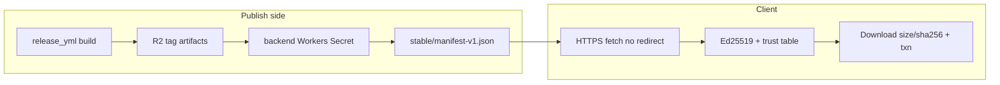
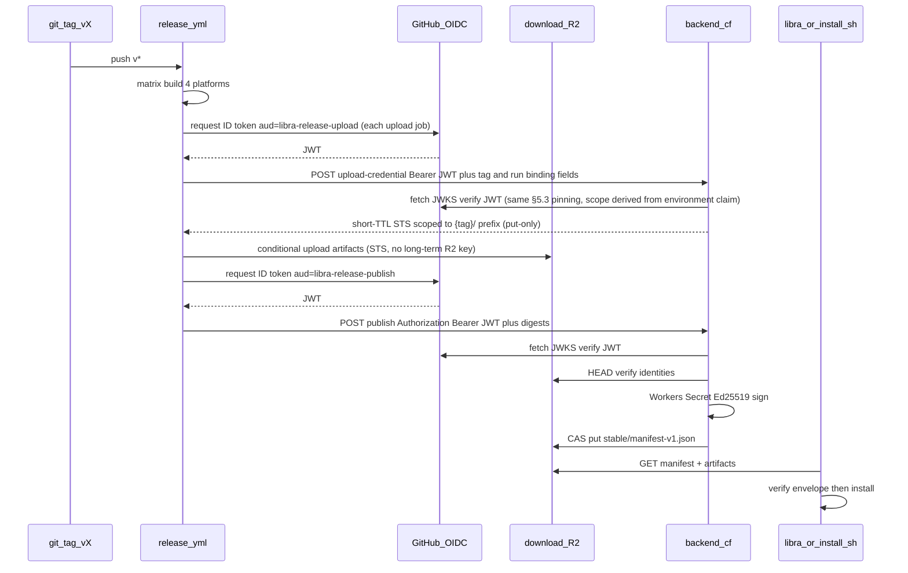
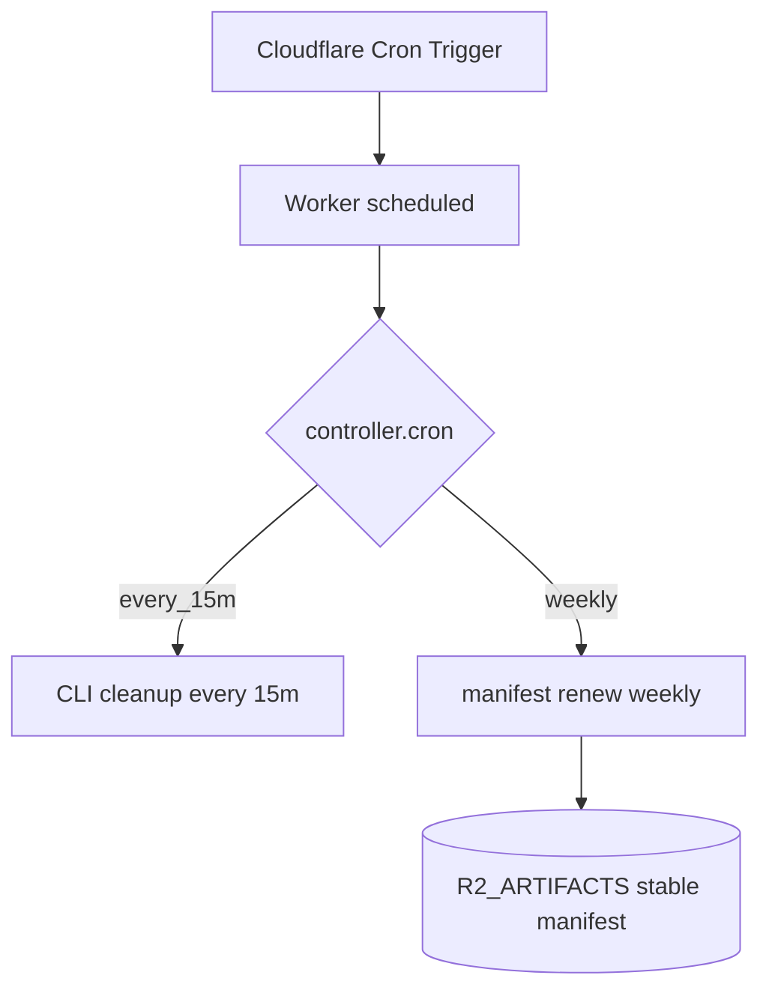
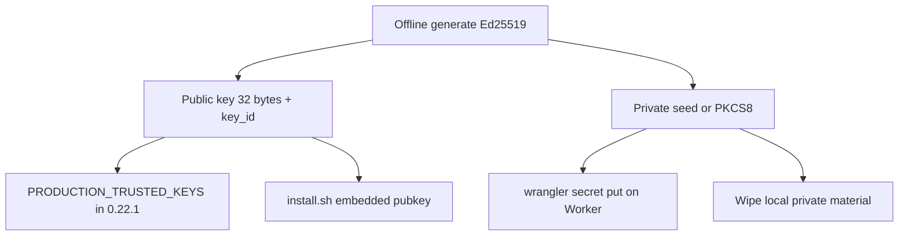
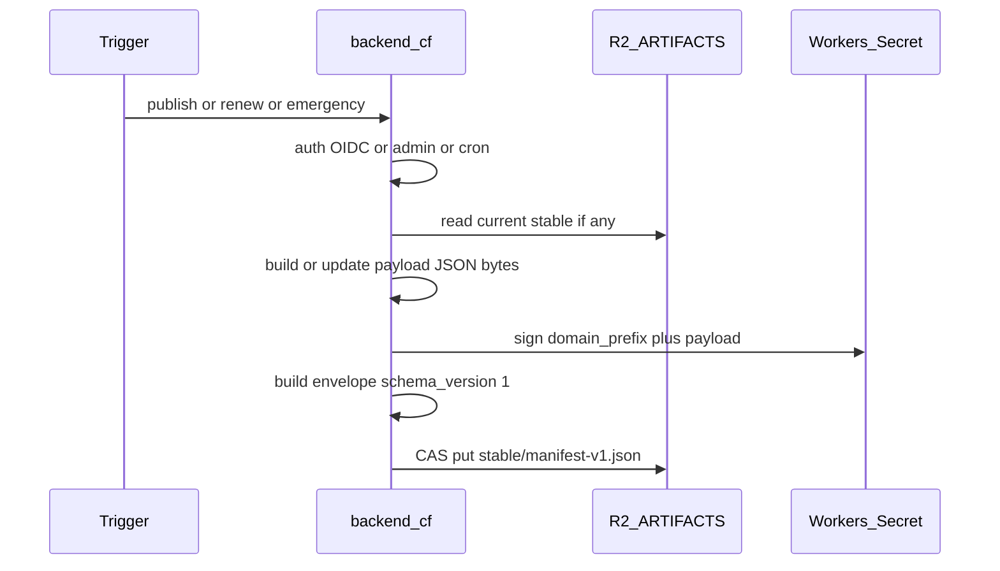

# UP-01 发布签名与自动升级链（设计讨论）

> Status: **design discussion**（架构讨论稿，非日期计划、非任务卡；可继续修订后再拆执行计划）
> Scope: 官方 Libra 二进制的 Ed25519 签名发布、`stable` manifest、以及客户端自动升级启用前置
> Long-track ID: [`plan-long.md`](../plan/plan-long.md) **UP-01**
> Client contract: [`docs/auto-upgrade.md`](../../auto-upgrade.md)、[`src/internal/upgrade/`](../../../src/internal/upgrade/)
> Publish CI: [`.github/workflows/release.yml`](../../../.github/workflows/release.yml)
> Backend: 兄弟仓库 `libra-backend` 分支 `cf`（Workers + D1 + R2）

变更记录：

1. 2026-08-21: 自讨论稿入库。冻结 D1（Action = `release.yml`）与 D2（私钥仅 Cloudflare Workers Secret）；写入 OIDC publish 流程与 Workers Cron renew 触发方式。
2. 2026-08-21: 冻结 **D3**——emergency（pause / revoke / 恢复）**必须**经 `libra-backend` Admin UI；禁止 GitHub `workflow_dispatch` 或其它旁路；Admin 界面为明确开发面。
3. 2026-08-21: 冻结 **D4**——Resume（`paused=false`）**不需要**双人审批；单 admin + 二次确认 + 审计即可。
4. 2026-08-21: 冻结 **D5**——download CDN 桶名为 **`artifacts`**；版本产物路径为 `libra/releases/v{tag}/…`；Backend binding 名为 **`R2_ARTIFACTS`**（与 Action rclone **同桶**）；与站点上传桶 `libra-backend`（`R2_BUCKET`）**分离**。`libra-backend` cf @ `baf869a` 已合入该 binding。
5. 2026-08-21: 冻结 **D6**——OIDC 钉死仓库为 **`libra-tools/libra`**（`repository_owner=libra-tools`，`repository=libra-tools/libra`）。
6. 2026-08-21: 冻结 **D7**——renew：Cron `0 6 * * 1`（UTC 周一 06:00）；若距 `expires_at` 仍 **> 60d** 则 Skip，否则续签。
7. 2026-08-21: 冻结 **D8**——Admin emergency 审计落 **D1**（不单独依赖 R2 append-only 作为唯一事实源）。
8. 2026-08-21: 冻结 **D9**——首个带非空 `PRODUCTION_TRUSTED_KEYS` 的客户端版本为 **`0.22.1`**。
9. 2026-08-21: 冻结 **D10**——第一份 production signed `stable/manifest-v1.json` 在 **实现本方案并上线** 时签发（与启用窗口绑定，不另择日历日）。
10. 2026-08-21: 补全 §7.2–7.3——密钥 ceremony 步骤与 publish/renew/emergency 共用 Ed25519 签名过程（domain prefix + envelope）。
11. 2026-08-21: Review 修订轮（合理性/完整性/安全核对；**不改**任何已冻结 D1–D10 的语义）：§5.3 修正「sha256 以存储侧为准」的过度声明（R2 不提供内容 sha256）并补 `expires_at ≤ key.not_after` 签名前置检查；§4/§4.1 修正 install.sh 现状描述、补 Windows 无后缀对象与 manifest 缓存头要求；§5.2/§8.2 补 OIDC 数字 ID 钉死、`v*` tag 保护、digest 汇总与 publish 串行化；§6.1/§6.2 补 renew 告警强度、emergency 爆炸半径与失效恢复面；§7 补 rotation 双签与密钥泄漏应对；§10 补实施测试预期；§10.1 更新待讨论项。
12. 2026-08-22: 第二轮独立 review（codex）修订——16 项 findings 全部处置：OIDC 强化为数字 ID 强制 + `event_name`/`ref_type` 强制 + body 与 token claims（`run_id`/`run_attempt`/`workflow_sha`）绑定 + `jti` 一次性消费建议（§5.3）；R2 对象 SHA-256 checksum 准确表述并列为目标态三方比对（§5.3/§8.2）；CAS 冲突必须重读→合并→重签（§5.3 第 14 步）；三操作全量 D1 审计、恢复面非控制字段来自权威状态（§5.3/§6.2，D8 扩展见 §10.1）；admin emergency 强制 step-up 认证 + 限速告警 + 成功后 purge URL（§6.2）；密钥泄漏 runbook 补「客户端持久化单调 floor」生效前提（§7）；rotation 双签的版本化密钥运维形态与量化退出条件（§7/§10.1）；私钥隔离残余面与 signing Worker 拆分建议（§7.2/§8.1）；release.yml workflow 卫生（action 钉 SHA、去 pipe-to-shell、上传携带 checksum）列为签名链前提（§8.2）；install.sh/install.ps1 回退事实修正与 bootstrap 信任锚（带外渠道）记录（§4/§10.1）；契约测试过 claim 修正（§2）；renew 续签窗口约 8 次/告警窗口约 4 次（§6.1）；Workers WebCrypto 钉死标准 `Ed25519` + PKCS8/JWK（§7.2）；concurrency 不承诺 FIFO（§8.2）；§4.1 补凭据边界与上线前加固三选一。
13. 2026-08-22: 第三轮独立 review（codex）修订——4 项 findings 全部处置：OIDC 改钉 `workflow_ref`/`workflow_sha`（官方语义：`job_workflow_ref` 仅存在于 reusable workflow job），补 `ref == refs/tags/{body.tag}` 与 token `sha` == body `commit_sha` 绑定（§4/§5.2/§5.3，reusable 备选见 §10.1）；§4.1 凭据边界重写——Action 凭据排除 stable 路径升为**强制项**（build job 按 run 签发 `v{tag}/` 前缀 STS 凭据、installer job 仅两个脚本对象精确写、版本对象条件创建），bucket lock 限定为 `v*` 版本前缀的额外保护（不可覆盖 stable、不区分身份），补「回放旧有效 envelope 攻击无 state 新客户端」的正确威胁表述，拆桶移 §10.1（需修订 D5）；§5.3 定义 `new == current` 幂等语义（实质字段一致 → 返回既有成功；不同 → 409）与 outbox 状态机（D1 `pending` → R2 CAS → 标 `applied`；恢复只认 `applied`，孤儿 `pending` 协调），消除 D1/R2 split-brain 与响应丢失歧义；§7.2 消除冷备份与 D2 的矛盾——Workers Secret 为唯一持久副本，escrow 仅可作为 D2 扩展补冻（§10.1）。
14. 2026-08-22: 第四轮独立 review（codex）修订——5 项 findings 全部处置：补 **credential broker** 设计（长期 R2 parent 凭据只存 Backend Workers Secret；upload jobs 经 OIDC `aud=libra-release-upload` 向 broker 换按 run 签发、精确前缀/对象、分钟级 TTL 的 STS 或 presigned PUT；§4.1/§4.2/§5.1/§5.2/§5.3 第 5 步同步）；`new == current` 幂等返回改为**以 D1 `applied` 行为门**（匹配 `pending` 须先核对 R2 digest/ETag 补记 `applied`，否则 fail-closed）；CAS 冲突重试必须**追加新 attempt**（或原子 supersede 旧行为 `aborted`），只有实际 ETag 匹配的 attempt 可标 `applied`，审计事件 append-only 与投递状态分表（§5.3 第 12/14 步、§6.2）；密钥泄漏 runbook 改正为可达顺序（两代 Secret 并存 → 双签 → 新客户端分发 → 抬 manifest floor → 抬编译期 floor → 销毁旧钥；立即停用旧钥 = 只能带外恢复，如实记录）；§7.2 改正 Secret 丢失恢复描述（丢失于新 key 被信任前 = 在线不可恢复，只能带外）；新增 **standby key 预置**建议（§7 第 5 条，trust table 内置 active+standby 两代公钥、私钥均只存 Workers Secret，与 D2/D9 兼容）作为密钥丢失/泄漏的在线恢复前提；§10 补「CAS 成功但标 `applied` 失败后重试」集成测试用例。
15. 2026-08-22: 第五轮独立 review（codex）修订——5 项 findings 全部处置：broker 授权根改正——普通 job token 无可靠 job 名 claim，body 自报 scope 不可信；改为三类特权面各配独立 GitHub **environment**（`release-artifacts`/`release-installers`/`release-publish`），Backend 从 `environment` claim **服务端派生 scope**，aud×environment 按端点联合钉死（§5.2 第 2 步/broker 段、§5.3 第 5 步、§8.2）；建议构建 leg 不带 `id-token`、产物经 GitHub artifact 交专用 uploader job 的纵深形态；broker body 补 `run_id`/`run_attempt`/`workflow_sha`/`commit_sha` 绑定。outbox ETag 语义改正——区分 `base_etag`（CAS 基准，首签为「不存在」哨兵）与 `result_etag`（写入成功后返回、标 `applied` 时记录），响应丢失重试按 payload/envelope digest 核对后补记（§5.3 第 14 步）；§10 补首签/正常更新/响应丢失三类用例。STS 能力表述修正——`PutObject`-only 须本地签发（预设 `object-read-write` 不满足），条件创建是客户端侧约束，平台级不可覆盖靠版本前缀 bucket lock 或逐对象 presigned PUT（条件/checksum/长度签进头）（§4.1/§5.2）。传播上界改条件化口径（活跃成功 ≈TTL+17min；失败退避 ≈TTL+1h；不活跃无墙钟上界）（§4.1）。standby key 限定为「隔离的 active-key 故障」——共同失陷仍属带外/KMS/escrow；补冻采用时 ceremony/客户端/两个安装器同步预置双公钥、定义有效期余量、定期存活演练与 standby 补位流程（§7 第 5 条、§7.2、§10.1）。
16. 2026-08-22: 第六轮独立 review（codex）修订——3 项 findings 全部处置：**占位符语义全文统一**（`{tag}` 含 `v` 前缀，如 `v0.20.3`；对象键 `libra/releases/{tag}/…`，消除 `v{tag}` 字面实现产生 `vv0.20.3` 的风险；§1 D5/§4/§4.1/§4.2/§5.2/§7.3 同步，契约用例入 §10）；时序图删除自报 `/prefix`（与「body 不含 scope」一致）；**bucket lock 写法修正**——规则前缀为字面 `libra/releases/v`（R2 不支持 glob，`v*` 不匹配任何对象），retention 钉 `Indefinite`，推论「同 tag 重跑/补传被拒、失败发布以新 tag 进行」如实记录，上线 smoke 含配置读取 + 覆盖拒绝验证（§4.1/§5.2/§10）；**presigned PUT 契约补齐**——broker 请求改为 run 绑定字段 + 逐对象 `{ object_key, size, sha256 }` 列表，Backend 校验对象键白名单与字段格式后逐对象签发一次性短 TTL URL（条件/checksum/长度签入），对象描述属待验证上传元数据而非授权 scope（§5.2）。
17. 2026-08-22: 第七轮独立 review（codex）修订——2 项 findings 全部处置：**presigned PUT「一次性」表述修正**——URL 在 TTL 内可重放，必须签死 `If-None-Match: *`（对象已存在则二次 PUT 返回 412 = 最多一次成功创建；签入普通 ETag 值不等价条件创建），必传头与值钉死（§5.2）；§10 补「首次 PUT 成功 / 同 URL 二次 PUT 412 / 删除篡改签名头报错」三类用例。**bucket lock 运行语义修正**——已有键不可覆盖/删除，但缺失键仍可首次创建：部分上传失败的缺失对象补传可恢复，全量重跑才因撞到已有键失败；「任何部分失败都换新 tag」如被采用属额外发布策略（workflow/backend 状态检查执行），不归因于 bucket lock（§4.1）；§10 smoke 同步补「缺失键首次补传仍可成功」。
18. 2026-08-22: 第八轮独立 review（hermes，代码事实核对）修订——3 项 findings 全部处置（**不改**任何已冻结 D1–D10 语义，仅消内部不一致）：§4 职责表补上 Windows `.sha256` 与无后缀副本为**待补改动**（原表述读作现状，与 §8.2 的「待补」矛盾）；§8.2 第 9 项修正「各 leg 统一改用已有模式」的过宽表述（该模式仅 `upload-install-scripts` 现有），并补**凭据过渡**如实记录（broker 上线前 upload jobs 仍持 `secrets.R2_*` 长期凭据，上线后删除，过渡期入上线检查清单）；§8.2 第 7 项把 digest 汇总与 §5.2 第 4 步机制显式挂钩（扩展现有 `homebrew-sha256-*` 到四平台并去掉 Unix leg 的 `continue-on-error`，Windows 补 `.sha256` artifact）。核对依据：`src/internal/upgrade/manifest.rs`（URL 四段式、`KeyWindowMismatch` 窗口）、`state.rs`（floor 不持久化）、`docs/auto-upgrade.md`（15min/1h 口径）、`release.yml`（pipe-to-shell 仅 linux leg、Windows 无 `.sha256` artifact）、`libra-backend` origin/cf @ `baf869a`（`R2_ARTIFACTS→artifacts`、`*/15` cron、`APP_BASE_URL`）。
19. 2026-08-31: ceremony smoke proof 改为独立 domain `b"libra-release-key-smoke-v1\0"`（末尾一个 NUL byte）。禁止用 client-valid release-manifest envelope 作为公钥配对测试：该 envelope 一旦被取得 `stable/` 写权限的主体重放，会成为可验证的错误 stable。smoke 仅证明 Worker 私钥与 public trust root 匹配；真正 `manifest-v1.json` 仍只在受 OIDC/CAS/outbox 保护的 publish/renew/emergency 流程签发。

20. 2026-08-31: A1-02 ceremony 的公开半边定值：`key_id=libra-release-1`、`generation=1`、raw Ed25519 public key hex=`68aa00ea9358d455645010d811d40702b3f67cec4bdff52d3d4fb8107afaeed3`、`not_before=2026-08-31T11:09:55Z`（`1788174595`）、`not_after=2027-08-31T00:00:00Z`（`1819670400`）。该公开值已同步至客户端 trust table 与两个安装器；私钥材料、Secret 内容及其任何编码均不记录。Worker Secret 配对及独立-domain public smoke proof 必须由部署后的公开 proof 单独验收，未完成前不得把此记录当作已启用签名链。
21. 2026-08-31: A1-02 的 Worker `libra-backend` 已部署（版本 `d64e1887-a990-4236-8539-143c9f524a49`）；其 `*/15` cron 已在 `artifacts` 写入公开、`Cache-Control: no-store` 的 [`ed25519-key-pair-v1.json`](https://download.libra.tools/libra/releases/smoke/ed25519-key-pair-v1.json)。客户端以 #20 的公钥直接验证 `b"libra-release-key-smoke-v1\0" || payload` 成功，并验证同一签名不能通过 manifest domain；这证明 Workers Secret 与 public trust root 配对，**不**表示已签发 stable manifest 或已启用 release 链。私钥材料、Secret 内容及其任何编码均不记录。
22. 2026-08-31: A1-03 本地 workflow 加固已落地：`release.yml` 的第三方 action 全部钉完整 commit SHA；Linux/macOS/Windows 以同一固定 rclone 版本的对应 archive 加 SHA-256 校验取代 pipe-to-shell、brew/choco；Windows 产出 `.sha256`、无后缀 `libra-windows-amd64` 副本和第四个 per-leg digest artifact，Unix artifact 不再 `continue-on-error`；upload jobs 显式最小权限且不含 `id-token`。真实 tag run / R2 HEAD 属 C/D 证据，仍按 D9 时序等待，不得据此宣称已发布。
23. 2026-09-01: `v0.22.1` 的首次真实 tag run 在 ARM64 leg、任何 R2 写入之前失败：workflow 顶层 `RCLONE_VERSION=1.75.0` 被 rclone 解析成它自己的 `--version` 选项，导致配置无效；matrix fail-fast 随后取消其余 build leg，installer / Homebrew job 未运行。修复将本 workflow 自有变量全部改为 `LIBRA_RCLONE_*`，仅保留已配置 remote 所需的 `RCLONE_CONFIG_R2_*`，并以 compat guard 覆盖 YAML、POSIX shell 与 PowerShell 赋值形式。该次失败未发布错误资产；更正发布必须使用新的 `v0.22.2` tag。

---

## 1. 已冻结决策

| ID | 决策 | 含义 |
|---|---|---|
| **D1** | 「libra action」= [`.github/workflows/release.yml`](../../../.github/workflows/release.yml) | 不指 CLI / `automation` 或其他 Action 面；后续同类 workflow 若参与发布，须遵守同一「无私钥」边界 |
| **D2** | 私钥只在 Cloudflare Workers Secret | GitHub Action / repo secrets / Environment secrets **永不**存放或读取签名私钥；Backend 是唯一签名者 |
| **D3** | emergency **必须**走 Admin UI | pause / 写入 `revoked_versions` / 恢复发布（`paused=false`）一律经 `libra-backend` 已登录 **admin** 会话；**禁止** `workflow_dispatch`、公开 cron、或仅持 OIDC 的 Action 调用 emergency |
| **D4** | Resume **不需要**双人审批 | 恢复发布由单一 admin 完成：UI 二次确认 + 审计记录即可；不引入第二审批人 / 双钥匙流程 |
| **D5** | download 桶 = **`artifacts`** | Action rclone 与 Backend **`R2_ARTIFACTS`** **同一 R2 桶** `artifacts`；对象前缀 `libra/releases/{tag}/`（`{tag}` 含 `v` 前缀，如 `v0.20.3`）存放该版本编译产物；与 Backend 现有上传桶 `libra-backend`（binding `R2_BUCKET`）**不得混用** |
| **D6** | OIDC 仓库 = **`libra-tools/libra`** | Backend 校验 GitHub OIDC 时钉死 `repository_owner == libra-tools` 且 `repository == libra-tools/libra`；其它 owner/repo（含 fork）一律 401/403 |
| **D7** | renew 周频 + Skip 阈值 | Workers Cron：`0 6 * * 1`（**UTC** 周一 06:00）；`expires_at - now > 60d` → Skip；否则读当前 stable → 验签 → 只改时间/`control_revision`/signatures → CAS 写回 |
| **D8** | emergency 审计存 **Cloudflare D1** | 每次 Admin pause / revoke / resume 写入 Cloudflare D1 审计行（谁、何时、旧/新控制字段、`control_revision`、payload digest）；Admin UI 只读列表读 D1 数据库；**不以** R2 对象为唯一审计事实源 |
| **D9** | 首个 trust 客户端 = **`0.22.1`** | `PRODUCTION_TRUSTED_KEYS` 首次非空合入并随 **`v0.22.1`** 发布；此前版本保持空表、自动升级构造性 inert |
| **D10** | 首份 stable 于 **方案实现上线时**签发 | 第一份 production signed `libra/releases/stable/manifest-v1.json` 在 Backend 签名链 + Action OIDC publish（及必要的 key ceremony）**实现并部署可用**后签发；指向当时已在 `artifacts` 的官方版本（预期含 `v0.22.1` 矩阵）；不另定独立日历日 |

架构因此定死：

**Action 只构建与上传不可变产物到 `artifacts`；Backend 是唯一签名与 `stable` manifest 发布者（写同一桶）；紧急控制只经 Admin 人机界面。**

---

## 2. 背景与现状

[`plan-long.md`](../plan/plan-long.md) 将 **UP-01** 列为下一执行任务：客户端自动升级已 code-complete，但因 `PRODUCTION_TRUSTED_KEYS` 为空而 **构造性 inert**；缺口是 release-key ceremony、发布侧签名、`install.sh` 验签。

完整规格曾整段迁移进 `plan-long`（commit `9438df97`，A.1–A.12），后被路线图改版冲掉，只剩一行摘要。讨论与实现仍应以该历史规格 + 当前代码契约为准。

| 层 | 事实 |
|---|---|
| 客户端 | [`src/internal/upgrade/manifest.rs`](../../../src/internal/upgrade/manifest.rs)：Ed25519 信封、`SIGNATURE_DOMAIN_PREFIX`、`MANIFEST_URL`、四平台 matrix、URL 绑定 |
| 发布 CI | [`release.yml`](../../../.github/workflows/release.yml)：tag `v*` → 四平台 build → rclone 上传 R2 → 上传 `install.sh`/`install.ps1`；**无签名、无 stable manifest** |
| 契约测试 | [`tests/upgrade_publish_contract_test.rs`](../../../tests/upgrade_publish_contract_test.rs) 钉死 envelope / matrix / `paused`·`revoked_versions` 的验签通过性；**尚无** publish/renew/emergency 状态变换实现及其不变式测试（缺口与补齐要求见 §10） |
| 后台 | `libra-backend` **cf**：Workers + D1；`R2_BUCKET`→`libra-backend`（用户上传）；**已绑定** `R2_ARTIFACTS`→`artifacts`（commit `baf869a`）；尚无 release publish/renew/emergency 写入代码路径 |
| CDN / 发布 | Action 经 rclone 写桶 **`artifacts`**；公开域 `download.libra.tools`；路径见 **D5** |

客户端用户面说明见 [`docs/auto-upgrade.md`](../../auto-upgrade.md)。

---

## 3. 客户端契约（方案不得改动）

这些是客户端已经实现的 fail-closed 合同，发布方案只能**满足**，不能重定义。



- **端点**：`https://download.libra.tools/libra/releases/stable/manifest-v1.json`
- **签名消息**：`b"libra-upgrade-manifest-v1\0" || payload_bytes`
- **私钥隔离（A.6 + D2）**：私钥只进 Cloudflare Workers Secret；`release.yml` 的 build/upload 与 request-manifest job **永不接触私钥**
- **Per-tag（A.9）**：四平台 artifact 齐全且 identity 正确后才可签 stable；条件创建、禁止覆盖；普通发布必须逐字节继承当前 `paused`/`revoked_versions`
- **续签 / 紧急**：每周 renew；pause/revoke 走更高权限路径；一律递增 `control_revision`
- **首期矩阵**：`linux-amd64`、`linux-arm64`、`darwin-arm64`、`windows-amd64`（Windows 发布但 auto-upgrade 返回 `UnsupportedPlatform`）

历史 UP-01 A.1–A.12 全文锚点：`plan-long` 迁移提交 `9438df97`（当前 `plan-long` 正文仅保留摘要，属文档债）。

---

## 4. 职责切分（已冻结）

| 组件 | 职责 | 明确不做 |
|---|---|---|
| **`release.yml`** | 四平台 build；上传 `libra/releases/{tag}/libra-{platform}[.exe]` + `.sha256`（Windows `.sha256` 与无后缀副本 `libra-windows-amd64` 为待补改动，见 §4.1/§8.2）；汇总 digest 表；用 **GitHub OIDC** 调用后台 **publish** API；继续上传 `install.sh`/`install.ps1`（可与签名解耦） | **不读私钥**；不写 `stable/manifest-v1.json`；不引入任何签名用 GH secret |
| **libra-backend（cf）** | 校验 OIDC（`aud` / `repository` / `workflow_ref` 等）；核对四平台对象存在且 size 一致、hash 与上传的 `.sha256` 交叉一致（口径见 §5.3 第 11 步）；组装 payload；用 Workers Secret 做 Ed25519 签名；CAS 写入 stable manifest；周 renew cron；admin/protected **pause/revoke**；审计日志 | 不编译 Rust；不把私钥下发给 Action |
| **CDN / download R2** | 桶 **`artifacts`**（D5）；binding **`R2_ARTIFACTS`**；服务 `download.libra.tools` | 与用户上传桶 `libra-backend`（`R2_BUCKET`）分离 |
| **客户端** | 验签、marker、anti-rollback（代码已有）；随 **`0.22.1`** 预置生产公钥（D9） | 不参与发布 |
| **install.sh / install.ps1** | 待补：预置公钥、拉取并验签 stable manifest、按 manifest 的 URL/sha256/size 下载。现状——install.sh：仅 sha256 校验（mirror 缺 `.sha256` 或本机无哈希工具时默认跳过，`LIBRA_REQUIRE_CHECKSUM=1` 才强制）；release API 不可达时**默认 fail-fast**，仅显式 `LIBRA_ALLOW_FALLBACK=1` 才回退**未签名** `DEFAULT_VERSION`。install.ps1：**无 release API 流程**，默认直接按静态 `$DefaultVersion` 下载，完全无校验 | 不参与发布；bootstrap 信任锚与回退策略见 §10.1 |

### 4.1 R2 对象布局（D5，已冻结）

桶名：**`artifacts`**。Backend binding：**`R2_ARTIFACTS`**（Action `R2_BUCKET_NAME=artifacts` 同桶；`libra-backend` cf @ `baf869a` 已配置）。

**占位符约定（全文统一）**：`{tag}` = 带 `v` 前缀的完整 tag（`github.ref_name`，如 `v0.20.3`）；`{version}` = 无 `v` 的 release SemVer（如 `0.20.3`）。对象键写作 `libra/releases/{tag}/…`，与客户端 URL 语法 `/libra/releases/v{version}/…` 一致（契约用例：`tag=v0.20.3` → 键 `libra/releases/v0.20.3/libra-linux-amd64`）。

| 键前缀 / 键 | 写入方 | 内容 |
|---|---|---|
| `libra/releases/{tag}/libra-{platform}` | Action `build-and-upload` | 该版本编译产物。**Windows 必须同时存在无后缀键** `libra-windows-amd64`（与 `.exe` 逐字节相同的副本）：客户端 URL 语法禁止 `.exe` 后缀（`manifest.rs` R0 严格语法，本方案不得改），签名行的 URL 必须是真实存在、可 HEAD 核对的键，否则 Backend 校验失败或签出 404 URL |
| `libra/releases/{tag}/libra-windows-amd64.exe` | Action（现有约定，供 `install.ps1` / Homebrew） | Windows 安装器下载面 |
| `libra/releases/{tag}/libra-{platform}.sha256` | Action（Unix 现有步骤；**Windows 待补**，见 §8.2） | 校验和 |
| `install.sh` / `install.ps1`（桶根） | Action `upload-install-scripts` | CDN 安装脚本 |
| `libra/releases/stable/manifest-v1.json` | **仅** Backend 经 `env.R2_ARTIFACTS`（publish / renew / Admin emergency） | 签名 envelope；写入时带短 `Cache-Control`（建议 `public, max-age=60`，与 install 脚本 `max-age=15` 同档）。**传播上界（条件化口径）**：对持续活跃且上次检查成功的客户端 ≈ CDN TTL + 17 min（冷却 + jitter）；处于失败退避的客户端可达 CDN TTL + 约 1 h（客户端 backoff 上限，`docs/auto-upgrade.md` 同口径）；不执行命令的客户端**无墙钟上界**——应急 SLA 与公告按此评估。R2 强一致不代表 CDN Cache 同步失效：emergency 与首签成功后须 **purge 精确 URL**；首签前的 404 响应须钉死短 TTL cache rule，避免 404 被长缓存拖住首份 manifest |

公开 URL 示例：`https://download.libra.tools/libra/releases/v0.20.0/libra-linux-amd64`。

**写入能力（代码核对，2026-08-21）：**

- 同账户 R2 Worker binding 默认具备 `put` / `get` / `head` / `delete` / `list`，**无需**再配 S3 access key。
- 当前仓库：仅完成 binding + `Env` 类型守卫；**尚无** `env.R2_ARTIFACTS.put(...)` 业务代码 → 配置上可写，产品路径尚未写入。
- `/api/upload` 仍只用 `R2_BUCKET`（`libra-backend`），**不得**改指 `R2_ARTIFACTS`。
- **凭据边界（如实记录 + 强制要求）**：Action 的 rclone S3 凭据（`R2_ACCESS_KEY_ID` 等）作用于整个 `artifacts` 桶、无对象前缀约束——`build-and-upload` 与 `upload-install-scripts` 两个 job 均持全桶写权限，技术上可覆盖 stable manifest 与桶根 install 脚本，故「Backend 唯一 stable 写者」当前是**业务约定 + GitHub secrets 保密**，不是平台权限边界。且威胁不止可用性：持桶权限者**回放仍在有效期内的旧签名 envelope**，无历史 state 的新客户端会接受（客户端 anti-rollback 只保护已见过更高 `control_revision` 的客户端）——可让新安装装上已落后、甚至已被后续 manifest 撤回的版本。**上线前强制项（不是三选一）**：所有 Action 凭据排除 stable 路径——长期 R2 凭据（parent credential）**只存 Backend Workers Secret**，Action 任何 job 不再持有；`build-and-upload` 与 `upload-install-scripts` 改用 **Backend credential broker** 签发的短期凭据：scope 由 token 的 `environment` claim **服务端派生**（body 自报一律不信任）、**本地签发的 `PutObject`-only** STS（Cloudflare 预设 `object-read-write` 不满足 put-only）、分钟级 TTL（见 §5.2 凭据 broker 段）。注意短期凭据**不强制条件创建**（`If-None-Match` 是上传请求头、非凭据策略，持证者可省略）：版本对象的平台级不可覆盖须叠加下述 bucket lock，或由 broker 改用逐对象 presigned PUT（把条件、sha256 checksum、`Content-Length` 签进签名头）。**bucket lock 的定位**：只能作为版本前缀的额外不可变保护——规则前缀是**字面前缀 `libra/releases/v`**（R2 bucket lock 的前缀为字面匹配、**不支持 glob**，写 `v*` 不匹配任何对象），retention condition 钉 **`Indefinite`**（历史版本永久不可覆盖/删除）；语义边界如实写明：**已有键不可覆盖/删除，缺失键仍可首次创建**——全量重跑会因撞到已有键而失败，但部分上传失败后的**缺失对象补传仍可恢复**；若项目要求「任何部分失败都换新 tag」，属额外发布策略（由 workflow/backend 状态检查强制执行），不归因于 bucket lock。它按前缀阻止一切主体的覆盖/删除、不区分 Action 与 Backend，**绝不能**覆盖 `stable/` 路径（会锁死 publish/renew/emergency），也不能替代上述凭据隔离。上线 smoke 须含：读取 bucket lock 配置确认生效 + 对现存测试对象的覆盖写入被拒。拆桶（stable/脚本独立桶）需修订 D5，移 §10.1 讨论，不作为现成选项。覆盖 install 脚本危及 bootstrap（§10.1）。

### 4.2 调用流（新版本）



---

## 5. OIDC 请求发布（具体流程）

目标：`request-stable-manifest` job **证明自己是官方 `release.yml` 的一次 tag 发布**，从而获权让 Backend 签名；**不**向 Action 下发签名私钥，也**不**用长期 `x-registry-internal-token` 一类共享秘密做发布鉴权（现有 `/api/internal/verify` 是另一条 HS256 登记面，不复用）。

### 5.1 角色与信任根

| 角色 | 持有什么 | 不持有什么 |
|---|---|---|
| GitHub OIDC Provider | 为每个 job 签发短命 JWT（`iss=https://token.actions.githubusercontent.com`） | 签名私钥、R2 写权限 |
| `release.yml` build/upload jobs | `id-token: write`（仅用于向 broker 换短期凭据）；构建产物 | 签名私钥；R2 parent 凭据；长期 Backend token |
| `release.yml` `request-stable-manifest` | `id-token: write`；可向 GitHub 要自定义 `aud` 的 JWT；持有 artifact digest 表 | 签名私钥；R2 parent 凭据；长期 Backend token |
| Backend Worker | GitHub JWKS 校验逻辑；Workers Secret（Ed25519 签名钥 + **R2 parent credential**，仅用于 broker 签发短期凭据）；`R2_ARTIFACTS` binding | GitHub PAT；构建产物源码 |

要点：Cloudflare 不必「把 OIDC 换成 CF API token」。Worker **本身就是 Relying Party**——验完 GitHub JWT 后，用本进程已有的 R2 binding + 签名 Secret 完成发布。

### 5.2 Action 侧步骤（`request-stable-manifest` job）

1. **触发前提**：`needs: build-and-upload` 全绿（四平台已上传到 `libra/releases/${{ github.ref_name }}/`）。
2. **权限与环境（job 级授权根）**：三类特权面各用独立 GitHub **environment**——普通 job 的 OIDC token 没有可靠的 job 名 claim，`environment` 是 Backend 区分 job 身份、服务端派生 scope 的唯一可钉依据：

   ```yaml
   # request-stable-manifest job
   permissions:
     id-token: write   # 向 GitHub 要 OIDC JWT
     contents: read    # 如需读仓库元数据；不要 contents: write
   environment: release-publish
   ```

   - `build-and-upload` → `environment: release-artifacts`；`upload-install-scripts` → `environment: release-installers`；本 job → `environment: release-publish`。environment 保护规则（required reviewers 等）在 GitHub 侧另行配置。
   - 任何 job 都**不得**持有 R2 parent 凭据或签名私钥；`id-token: write` 仅用于向 broker / publish 端点证明身份。
   - **纵深（建议）**：执行不可信构建代码（依赖、`build.rs`）的 leg 可改为不带 `id-token`，产物经 GitHub artifact 交给带 `release-artifacts` 环境的专用 uploader job——构建期代码执行面连 OIDC token 都拿不到。

3. **固定 audience**：向 GitHub 请求 ID token 时使用约定 `aud`，例如 `libra-release-publish`（**不是**默认的 repo owner URL）。示例：

   ```bash
   OIDC_JWT=$(curl -fsSL \
     "${ACTIONS_ID_TOKEN_REQUEST_URL}&audience=libra-release-publish" \
     -H "Authorization: Bearer ${ACTIONS_ID_TOKEN_REQUEST_TOKEN}" \
     | jq -r .value)
   ```

4. **组装 publish 请求体**（设计形态，字段可微调但语义固定）：
   - `version`：与 tag 一致的 release SemVer（无 `v` 前缀，对齐客户端 `ReleaseVersion`）
   - `tag`：`github.ref_name`（如 `v0.20.3`）
   - `artifacts[]`：四平台各 `{ platform, sha256, size }`（与 matrix 一致；URL 由 Backend 按契约拼出，不信任客户端自定义 host）
   - digest 汇总方式：matrix job 的 outputs 会互相覆盖，须走 per-leg artifact（扩展现有 `homebrew-sha256-*` 机制到四平台）后由本 job 下载汇总；**Windows leg 当前不产出 `.sha256`，须补**（pwsh 计算 + 上传 artifact）
   - `run_id` / `run_attempt` / `workflow_sha` / `commit_sha`：审计与绑定用；`run_id`/`run_attempt`/`workflow_sha` 必须与 token 同名 claims 一致，`commit_sha` 必须与 token 的 `sha` 一致（§5.3 第 8–9 步的请求体绑定）

5. **调用 Backend**：

   ```http
   POST https://libra.tools/api/internal/release/publish
   Authorization: Bearer <OIDC_JWT>
   Content-Type: application/json
   ```

   （具体 host 以生产 `APP_BASE_URL` 为准；路径前缀 `/api/internal/release/` 与现有 registry verify 隔离。）

6. **失败语义**：非 2xx → job 失败 → 整次 release 红。Artifact 可能已在 R2，但 **无 signed stable manifest** → 客户端 fail-closed 不升级（符合 UP-01）。

7. **禁止**：在该 job 或任何 job 配置签名私钥；本 job 唯一外呼是 Backend publish（及可选的只读 HEAD 自检）。

**凭据 broker（上传链，强制；与 §4.1 强制项对应）：** 长期 R2 凭据只存 Backend（Workers Secret），Action 不持有。各 upload job（含 `upload-install-scripts`）在上传前：

1. 用 `aud=libra-release-upload` 向 GitHub 请求 OIDC JWT；
2. `POST /api/internal/release/upload-credential`（`Authorization: Bearer` + `{ tag, run_id, run_attempt, workflow_sha, commit_sha }`）——body 只声明「这次 run 是谁」并接受绑定校验，**不含 scope**；
3. Backend 按 §5.3 同一套钉死校验（repo/数字 ID/`workflow_ref`/`event_name`/`ref`/`sha`/body 绑定），并**从 token 的 `environment` claim 服务端派生 scope**（body 自报 scope 一律忽略）：
   - `release-artifacts` → `libra/releases/{tag}/` 前缀、**本地签发的 `PutObject`-only** STS（Cloudflare 预设 `object-read-write` 不满足 put-only，须显式 actions 本地签发）。**条件创建（`If-None-Match`）只是客户端侧约束**、持证者可省略；要平台级禁止覆盖，叠加字面前缀 `libra/releases/v` + `Indefinite` 的 bucket lock（§4.1），或改用逐对象 **presigned PUT**——此时 broker 请求改为「同一 run 绑定字段 + 逐对象 `{ object_key, size, sha256 }` 列表」，Backend 校验对象键白名单（`{tag}` 下 `libra-{platform}` / `libra-{platform}.sha256` / `libra-windows-amd64.exe` 等预期键）与字段格式后，逐对象签发短 TTL PUT URL——注意 URL 在 TTL 内**可重放**，必须签死 **`If-None-Match: *`**（上传方必传该头；对象已存在则第二次 PUT 返回 412，实现「最多一次成功创建」；签入某个普通 ETag 值**不等价**于条件创建），sha256 checksum 与 `Content-Length` 同样签进签名头；对象描述属**待验证的上传元数据**，不作授权 scope（scope 仍只来自 environment）；
   - `release-installers` → 桶根 `install.sh` / `install.ps1` 两个精确对象写；
   - 其它或缺失 `environment` → 403。
4. 用短期凭据上传；TTL 分钟级，泄露窗口以分钟计。

broker 端点与 publish 一样**不复用** `/api/internal/verify` 的共享秘密。

**GitHub 侧配套（发布权限收口）**：OIDC 钉死的是「`release.yml` 的一次 tag 运行」，因此**能推 `v*` tag 即能发布**。仓库应用 ruleset 限制可创建/更新 `v*` tag 的角色，并禁止 tag 的 force-push 与删除；该配置不在本仓库代码内，实施时作为上线检查清单项记录。

### 5.3 Backend 侧校验顺序（fail-closed，全部通过才签名）

对 `Authorization: Bearer` 中的 JWT，按固定顺序：

1. **结构**：JWT 三段；`alg` 必须为 GitHub 使用的非对称算法（当前为 RS256）；拒绝 `none` / 对称 alg。
2. **JWKS**：从 `https://token.actions.githubusercontent.com/.well-known/jwks` 取钥（缓存 + 合理 TTL）；用 `kid` 选钥验签。
3. **时间**：校验 `exp` / `nbf` / `iat`（允许小时钟偏差，如 ±60s）；过期即 401。
4. **Issuer**：`iss == https://token.actions.githubusercontent.com`。
5. **Audience 与 environment（按端点联合钉死）**：publish 端点要求 `aud` 含 `libra-release-publish` **且** `environment == release-publish`；broker 端点要求 `aud` 含 `libra-release-upload` **且** `environment ∈ {release-artifacts, release-installers}`（scope 由 environment 派生，见 §5.2 broker 段）。`aud` 为数组则成员匹配；audience 不可互换，错误组合 → 401/403。
6. **仓库钉死（D6）**：`repository == libra-tools/libra` 且 `repository_owner == libra-tools`；其它仓库（含 fork）→ 401/403。**必须同时钉死数字 ID**（`repository_id` / `repository_owner_id`，GitHub 自定义 claims 建议同此），防仓库改名/转让后名字被抢注重用；数字 ID 的具体值在上线检查清单中登记（D6 扩展见 §10.1）。
7. **工作流钉死**：钉死 `workflow_ref` 精确匹配形态 `libra-tools/libra/.github/workflows/release.yml@refs/tags/vX.Y.Z`（`X.Y.Z` 为合法 release SemVer）。注意：`job_workflow_ref` / `job_workflow_sha` **仅存在于使用 reusable workflow 的 job**，当前 `release.yml` 非 reusable，必须用 `workflow_ref` / `workflow_sha`；`workflow_sha`（workflow 文件在该 ref 的 commit SHA）记录审计，可选追加 allowlist。
   - 允许：上述形态且 tag 名为合法 `vX.Y.Z`
   - 拒绝：其它 workflow、fork 的 `pull_request`、任意 `refs/heads/*`（首期只接受 **tag push** 触发的 release 运行；若未来把特权 publish job 抽成 reusable workflow，再改钉 `job_workflow_ref`/`job_workflow_sha`，见 §10.1）
8. **事件与提交钉死（强制）**：`event_name == push`、`ref_type == tag`；`ref` == `refs/tags/{body.tag}` 逐字符一致；token `sha` == body `commit_sha`（防止 token 被挪用于 tag 指向之外的提交）。
9. **Subject / actor / jti**：`sub`、`actor`、`jti` 记录审计；策略上以 `workflow_ref` + `repository`（含数字 ID）为主约束，`sub` 作为辅助。**请求体绑定（强制）**：body 的 `run_id` / `run_attempt` / `workflow_sha` 必须与 token 同名 claims 一致，token 不能挪用于其它 run 的请求体。**重放窗口**：OIDC JWT 短命（分钟级 `exp`）；「`new > current`」+ 幂等语义（第 12 步）+ CAS 使同体重放无害，异体重放被绑定检查拒绝；服务端另建议对 `jti` 做一次性消费（短 TTL 去重表）。

OIDC 通过后进入 **业务校验**（与 A.9 对齐，仍在签名之前）：

10. Body 四平台齐全、platform 唯一、`version`/`tag` 交叉一致。
11. 对每个 artifact：`R2_ARTIFACTS` `HEAD` 确认**对象存在且 `size` 一致**（不一致 → 409/422，不签名）。**sha256 核对口径（准确表述）**：R2 支持对象级 SHA-256 checksum（Workers binding `put` 的 `sha256` 选项 / S3 `x-amz-checksum-sha256`，经 `head()` 的 `checksums` 读回），但**仅当上传方提供**；当前 rclone 上传链未携带 → 现状对象无可用 checksum。目标态：上传必须携带 sha256 checksum（§8.2），Backend 比对 `head.checksums`、Action 声明值与已上传 `.sha256` 对象三者一致才采信，缺任一项 → 拒签；过渡期（checksum 未上线）以「存在 + size + `.sha256` 对象交叉一致」为下限并在 §10.1 记录。在 Worker 单请求内重哈希 4×≤128 MiB 产物不现实（内存/CPU 限制），不作为核对手段。最终完整性闸门是客户端 sha256（fail-closed）：digest 错 = 拒绝升级（可用性事件），而非安装错误二进制。
12. 读当前 `stable/manifest-v1.json`（若存在）：先验签（用 Workers Secret 对应公钥；失败 → 拒绝并告警，按 §6.2 恢复路径处理）；`new < current` → fail；**`new == current`**：仅当 D1 存在匹配的 **`applied`** 审计行、且全部实质字段（`version`/`channel`/`artifacts` identity/`min_key_generation`/`paused`/`revoked_versions`）与当前逐字节一致 → **幂等返回既有成功结果**（不递增 `control_revision`、不重签）；若存在匹配 **`pending`** 行（R2 写成功但标 `applied` 失败的场景）→ 先核对 R2 对象 payload digest/ETag 与该行的对应关系，成立则补记 `applied` 再返回成功，无法证明对应 → fail-closed 走恢复路径；同版本但实质字段不同 → 409 冲突。`new > current` 时从当前 payload **逐字节继承** `paused`/`revoked_versions`；递增 `control_revision`（首份从 **1** 起）；设 `expires_at = published_at + 90d`。**签名前置检查（fail-closed，复用客户端完整窗口规则）**：`not_before ≤ published_at ≤ not_after` **且** `expires_at ≤ not_after`——客户端要求密钥有效期窗口覆盖 manifest 全生命周期（否则 `KeyWindowMismatch` 全量拒收），余量不足时先 rotation（§7）再发布。
13. 用 Workers Secret 对 `b"libra-upgrade-manifest-v1\0" || payload_bytes` 做 Ed25519 签名，写 envelope。
14. **Outbox 状态机写入（D1 为权威日志；D1 与 R2 无跨存储原子事务，必须按序防 split-brain）**：先区分两个 ETag——`base_etag`（CAS 基准：读到的当前 stable 对象 ETag；首签无对象，以「不存在」哨兵表示，对应 `If-None-Match` 类条件）与 `result_etag`（写入成功后 R2 返回的新对象 ETag）；二者语义不同，**不可混用**（条件 ETag 与成功 PUT 返回的对象 ETag 是两回事）。
    1. D1 事务写入 `pending` attempt：幂等键（publish 用 `run_id`+`run_attempt`；renew 用新 `control_revision`+新 payload digest；admin 用操作 id）、触发方、完整新 payload、payload digest、envelope digest、`control_revision`、`base_etag`。**此步失败 → 整体失败，尚未触碰 R2**；
    2. 以 `base_etag` 为条件 CAS 写入 `libra/releases/stable/manifest-v1.json`；冲突则**重新读取当前 stable、按第 12 步重建 payload、重签**，并**追加一条与本次 attempt 精确绑定的新 `pending` 行**（或原子 supersede：旧 attempt 标 `aborted`）——旧 attempt 保留旧 payload/`base_etag`，**禁止**只改 R2 写法不改 D1；有界次数后失败；
    3. 写入成功后把**该 attempt** 标 `applied` 并记录 `result_etag`；**响应丢失重试**：用 attempt 的 payload/envelope digest 核对当前 R2 对象，一致则补记 `applied` + 当前 `result_etag`，不一致 → fail-closed 走恢复路径；
    4. 数据模型：不可变审计事件 **append-only**；`pending`/`applied`/`aborted` 投递状态独立成表（或状态转换同样建模为 append-only 事件），不与审计事件原地混写。恢复程序只以 `applied` 行为权威事实源，孤儿 `pending` 行由恢复程序协调（核对 R2 实况后重放或标记 `aborted`）。持久重试可用 Cloudflare Workflows 承载，但上述状态定义不变。
15. 响应 200 + `{ control_revision, version, payload_digest, signer_key_id }`；Action 只记日志/artifact，**不**拿到私钥材料。**三操作（publish/renew/emergency）均走第 14 步的 D1 审计**——D1 为权威日志，R2 stable 为可重建投影（D8 扩展见 §10.1）。

### 5.4 与现有 `internal/verify` 的边界

| | `/api/internal/verify`（现状） | `/api/internal/release/publish`（本方案） |
|---|---|---|
| 调用方 | registry / 设备流相关 | 仅 `release.yml` |
| 凭证 | `x-registry-internal-token` + 用户 HS256 JWT | **仅** GitHub OIDC JWT |
| 结果 | 返回 push/pull 权限 | 侧写签好的 stable manifest |
| 密钥 | registry secrets | Workers Ed25519 签名 Secret |

二者不得混用同一 gate secret，避免 registry 泄露波及发布签名。

---

## 6. 三操作语义：publish / renew / emergency

| 操作 | 何时 | 可变字段 | 不可变字段 |
|---|---|---|---|
| **publish** | 新 tag / 更高 `version` | `version`、`artifacts`、时间、`signatures`、`control_revision` | 须从当前 payload **逐字节继承** `paused` / `revoked_versions` |
| **renew** | 同一 `version` 仍为 stable，但需延长有效期 | 仅 `control_revision`、`published_at`、`expires_at`、`signatures` | `version` / `artifacts` / `channel` / `min_key_generation` / `paused` / `revoked_versions` |
| **emergency** | 暂停发布或撤回版本 | `paused` 和/或 `revoked_versions`，以及时间 / `control_revision` / `signatures` | `version` / `artifacts`（除非另有明确更高权限仪式） |

**Renew 的目的**：signed manifest 有 `expires_at`（普通发布为 `published_at + 90d`）。若线上最新版本长期无新 tag，不续签则 envelope 过期，客户端拒用。Renew **不是**发新版本。

**`min_key_generation` 的归属**：三操作默认都**不改** `min_key_generation`（renew 已在上表列为不可变）；仅密钥轮换/泄漏仪式中由 publish 或扩展 emergency 抬高（见 §7 第 4 条与 §10.1）。

### 6.1 Renew 在 Cloudflare 上如何触发

与 `libra-backend` cf 分支现状对齐：用 **Workers Cron Triggers**，不是公开 HTTP。

| 项 | 设计 |
|---|---|
| 机制 | [Workers Cron Triggers](https://developers.cloudflare.com/workers/configuration/cron-triggers/)：平台按 cron 表达式直接调用 Worker 的 `scheduled(controller, env, ctx)` |
| 配置落点 | `libra-backend` `apps/tanstack-app/wrangler.jsonc` 的 `triggers.crons`（现状已有 `*/15 * * * *` 做 CLI 清理） |
| 表达式（**D7**） | `"0 6 * * 1"`（**UTC** 周一 06:00）；与 `*/15` **并存**，在 `scheduled` 里用 `controller.cron` 分流 |
| Handler | 扩展 `src/server.ts` 的 `scheduled`：`cron === '0 6 * * 1'` → `runManifestRenew(env)`；`*/15` → 既有 CLI cleanup |
| 鉴权 | 平台调用，无 HTTP secret；handler 内直接使用 Workers Secret + `R2_ARTIFACTS`。**禁止**做成无鉴权的 `GET /api/cron/renew` |
| 幂等（**D7**） | 若 `expires_at - now > 60 days` → Skip（不写、不抬 `control_revision`）；否则读当前 stable → 验签 → 只改时间（`published_at`=续签时点、`expires_at`=续签时点 +90d）/`control_revision`/signatures → CAS 写回（冲突按 §5.3 第 14 步重读合并）。**前置检查**：与 §5.3 第 12 步同一完整窗口规则（`not_before ≤ published_at ≤ not_after` 且新 `expires_at ≤ not_after`），不满足则**不签**（客户端必以 `KeyWindowMismatch` 拒收）并立即告警、走 rotation（§7） |
| 失败 | `controller.noRetry()`（与 CLI cleanup 同口径）；**连续失败必须产生可操作告警，剩余有效期 < 30d 时升级告警**（不仅落 Workers 日志）——weekly cron 在续签窗口（剩余 60d→0）内约有 **8** 次执行机会，进入 30d 告警窗口后只剩约 **4** 次；静默失败会让 envelope 过期、全量客户端停止升级 |
| 本地验证 | `wrangler dev --test-scheduled` + `/__scheduled`，或 `/cdn-cgi/handler/scheduled` |



**明确不采用：**

- GitHub Actions 定时 `schedule:` 调 Backend renew（多一条 OIDC 面且无新 artifact）
- 公开 HTTP cron + 共享 secret（旧 Next 站模式；cf 已改成平台 Cron）

### 6.2 Emergency 必须经 Admin（D3，已冻结）

Emergency 覆盖的操作面（与 §6 表一致）：

| Admin 动作 | Manifest 效果 |
|---|---|
| 暂停升级 | `paused=true`，递增 `control_revision`，重签 |
| 撤回版本 | 追加 `revoked_versions`（是否补冻为「仅追加、禁止删除」见 §10.1），递增 `control_revision`，重签 |
| 恢复发布 | `paused=false`（单 admin + UI 二次确认 + 审计，**无**双人审批，见 D4），递增 `control_revision`，重签 |

**鉴权与通道（强制）：**

- 唯一入口：`libra-backend` **Admin UI**（已登录且 `role=admin` 的会话）→ 调用受保护的 admin/release emergency API → Worker 用 Workers Secret 签名并 CAS 写回 stable manifest。
- **禁止**：GitHub Actions `workflow_dispatch` / 任意 OIDC job 调用 emergency；公开 HTTP cron；长期 shared secret 旁路。
- **爆炸半径**：emergency 不能改 `version`/`artifacts`——即使 admin 账号被盗，攻击者也只能做可用性操作（pause / 过量 revoke），**无法投递任意二进制**；全部动作留痕（D8）。被盗 session 仍足以造成全局升级中断，故下条为强制而非建议。
- Admin 会话安全基线由 `libra-backend` admin 面既有约定承担（Secure/HttpOnly/SameSite Cookie、CSRF/Origin 校验、短会话）；emergency 类敏感操作**必须** step-up 认证（近期重认证 / WebAuthn），并配**调用限速与异常告警**。
- 每次 emergency 必须写 **Cloudflare D1 审计记录**（D8：谁、何时、旧/新 `paused` 与 `revoked_versions`、`control_revision`、payload digest）；审计事件 **append-only**，`pending`/`applied`/`aborted` 投递状态按 §5.3 第 14 步的数据模型独立建模。
- emergency 与首签成功后**必须 purge** stable manifest 的精确 URL，并按 §4.1 钉死 404 TTL 与传播上界验证。
- Admin UI 只读审计列表从 **Cloudflare D1** 查询（至少最近 N 次）。

**Admin UI 开发范围（`libra-backend` cf，明确交付面，非「可选」）：**

- 展示当前 stable manifest 摘要（version、`paused`、`revoked_versions`、`expires_at`、`control_revision`、signer）。
- 表单：Pause / Resume；向 `revoked_versions` 添加 SemVer（校验格式、禁止空操作）。
- 二次确认（Pause、Resume、撤回均须确认；**Resume 不要求双人审批**，D4）。
- 调用后端 emergency API；失败 fail-closed 并展示可读错误。
- 只读审计列表（读 **Cloudflare D1**，D8；至少能核对最近 N 次 emergency）。
- **恢复面（失效/丢失修复）**：提供「立即续签/重签」动作（仅改时间与 `control_revision`，逐字节继承全部控制字段）——用于 renew 长期失败导致 envelope 过期后的恢复；若 stable 对象丢失或验签失败，依据 **Cloudflare D1 `applied` 审计行**重建控制字段与 `control_revision`（孤儿 `pending` 行按 §5.3 第 14 步协调）。**非控制字段（`version`/`artifacts`）必须来自权威状态**——D1 `applied` 审计行（§5.3 第 14–15 步）加 R2 对象 HEAD 核对；admin **不得**手工输入或修改这些字段，否则「无法投递任意二进制」的爆炸半径声明不再成立。

实现落点预期在现有 admin 路由族下（如 `apps/tanstack-app/src/routes/.../admin/` + `/api/admin/...`），与仅供 `release.yml` 使用的 `/api/internal/release/publish` **分离**：publish 仍只认 OIDC；emergency **只认 admin session**。

---

## 7. 密钥与信任根

1. **Ceremony（一次性）**：离线生成 Ed25519；公钥进 `PRODUCTION_TRUSTED_KEYS` + `install.sh` 预置；**私钥只进 Cloudflare Workers Secret**（D2）；不进 GitHub repo / Environment secrets。细节见 §7.2。
2. **Rotation**：新 key `generation+1`；**overlap 期 Backend 用新旧两 key 双签**（envelope `signatures[]` 放两条，客户端接受任一可信且过 floor 的签名）。运维形态：Workers 侧以**版本化密钥对**持有两代私钥（如 `LIBRA_RELEASE_ED25519_SEED_G1` / `_G2` 两个独立 Secret，或单条版本化 keyring JSON），双签选择规则与旧钥销毁顺序在实施时钉死（量化退出条件见 §10.1）；新客户端版本把新 key 编入 trust table，并在确认普及后抬高编译期 `MIN_TRUSTED_KEY_GENERATION` 与 manifest `min_key_generation`。私钥轮换只改 Workers Secret + 客户端 trust table，不改 Action 密钥配置（Action 本无密钥）。
3. **启用阈值（D9 + D10）**：客户端 **`0.22.1`** 首次携带非空 `PRODUCTION_TRUSTED_KEYS`；此前保持 inert。第一份 production signed stable 在 **实现本方案并上线时**签发（D10）。
4. **密钥泄漏应对（runbook 要点）**：顺序必须保持「旧客户端始终可验证」——(a) 执行新 key ceremony（`generation+1`），**两代 Secret 并存**，旧 key 暂不销毁（立即替换 Secret 会让双签不可能、且新-key-only 签名在旧客户端上以 `NoTrustedSignature` 失败，反而断链）；(b) 双签过渡：每份 manifest 同时带新旧两条签名；(c) 发布携带新公钥与持久化单调 floor 实现的客户端，等待采用；(d) 经 admin emergency 抬 manifest `min_key_generation` 到新 generation（此后旧-key-only 签名被拒）；(e) 后续客户端抬编译期 `MIN_TRUSTED_KEY_GENERATION`，最后销毁旧 Secret。**若事故要求立即停用旧钥**（攻击者正在使用）：只信旧公钥的客户端无法在线获得新信任根，必须如实承认——该路径只能带外安装/人工升级恢复（预防手段见第 5 条 standby key）。**(d) 的生效前提**：客户端在 upgrade state 持久化**单调不降的最高 generation floor**。A1-01 的当前源码已实现该字段、旧 state 缺字段默认 0，并在验签时合并 manifest / 编译期 / persisted 三源 floor；install 失败/回滚/中止路径同样保留已验证的 floor（2026-09-01 C-T1 review 修复）。**已发布的 `v0.22.1`/`v0.22.2` 尚不包含持久化 floor（它随 A1-01 的下一次 patch 发布，合并基线上为 `0.22.6`）**，故在该版本实际发布并普及前，泄漏处置对存量客户端仍**不闭合**（如实记录为残余风险）。(f) 残余风险：未升级的老客户端仍信旧 key，但攻击者还须控制 `download.libra.tools` 投递面才能利用（HTTPS + host 钉死已抬高门槛），靠公告与版本普及收敛。仪式细节列入 §10.1 待讨论。
5. **（建议补冻）standby key 预置**：能力边界先钉死——standby **只覆盖「隔离的 active-key 故障」**（单 Secret 丢失或单 key 泄漏）；active 与 standby 同处 Workers 权限/代码面，**共同失陷（Worker 部署面失陷导致两把私钥同时泄漏）不在其内**，该情形仍属带外恢复 / KMS / escrow 范围（§10.1）。形态：trust table 自 **`0.22.1`** 起内置两代公钥（active + standby，`generation+1`）。若补冻采用，须同时满足：ceremony 产出两代密钥；客户端 trust table 与 **install.sh / install.ps1 都预置两代公钥**（否则 bootstrap 路径不信任 standby）；standby 私钥独立 Workers Secret 条目、日常不使用；standby 的 `not_after` 留足余量（客户端窗口规则同样适用于它——启用后签出的 manifest 全生命周期必须落在其窗口内）；**定期签名存活演练**（确认 Secret 可用且与公钥匹配）；启用 standby 后启动**下一代 standby 补位流程**。启用时：standby 已被全部在网客户端信任，可直接以 standby 双签过渡到新 key，避免「旧客户端无法在线获得新信任根」的断链（第 4 条、§7.2 第 4 步）。与 D9「非空 trust table」、D2「私钥只在 Workers Secret」语义均兼容。

### 7.1 首发启用顺序（已冻结）

| 步骤 | 状态 |
|---|---|
| 客户端 **`0.22.1`** 首次携带非空 `PRODUCTION_TRUSTED_KEYS`（及 `install.sh` 预置公钥） | **已冻结（D9）** |
| 第一份 production signed `stable/manifest-v1.json` | **已冻结（D10）**：在方案实现上线时签发；前置：`artifacts` 上已有可核对的官方版本产物（含 `v0.22.1`）、Workers Secret 与 `R2_ARTIFACTS` 可用、OIDC publish 路径可用 |
| 首签失败 | 保持无 stable / 客户端仍可依赖 inert 或仅本地安装；**不得**发布未签名或错误签名的 envelope；修复后重试签发 |

### 7.2 密钥 ceremony（一次性）

目标：建立官方 Ed25519 信任根，使客户端与 `install.sh` 能验签，私钥永不离开 Cloudflare Workers。



**推荐步骤（实施时照此执行；Secret 名可微调但语义固定）：**

1. **离线生成**（不在 CI、不在共享开发机上长期驻留）：
   - 生成 Ed25519 密钥对（例：`openssl genpkey -algorithm Ed25519` 或等价工具）。
   - 选定稳定 `key_id`（例：`libra-release-1`）。
   - 记录公钥 32 字节（raw）、`not_before` / `not_after`、`generation=1`。`not_after` 须留足余量：客户端要求 `expires_at ≤ not_after`（§5.3 前置检查），90d 滚动续签下 key 窗口即自动升级链的最长寿命，到期前必须完成 rotation。
2. **公钥入库（公开）**：
   - 在 `src/internal/upgrade/trusted_keys.rs` 填入 `PRODUCTION_TRUSTED_KEYS`（随 **`0.22.1`**，D9）。
   - `install.sh`（及后续 `install.ps1`）预置同一公钥（及 `key_id`），供 bootstrap 独立验签。
   - 若 §7 第 5 条 standby key 补冻采用：ceremony 须同时产出两代密钥，客户端 trust table 与**两个安装器**都预置 active + standby 两代公钥（及各自 `key_id`），否则 bootstrap 路径不信任 standby。
3. **私钥进 Workers（机密，D2）**：
   - 仅操作员在受控环境执行，例如：
     `cd apps/tanstack-app && pnpm exec wrangler secret put LIBRA_RELEASE_ED25519_SEED`
   - 存入形式钉死一种：Workers WebCrypto 已支持标准算法名 **`Ed25519`**（`NODE-ED25519` 为兼容别名，仅在确有兼容需求时使用），且 **WebCrypto 不支持 raw 私钥导入**——故钉死 **PKCS8（DER，base64）**（JWK 为备选）；raw 32-byte seed 仅在选用 `@noble/ed25519` 一类 JS 库时才有意义。无论哪种：**不得**写入 GitHub secrets / `.dev.vars` 提交 / 聊天记录；import/sign/verify 以部署环境集成测试验证。
   - Backend 启动或首次签名时 `importKey` 为 WebCrypto / 等价 Ed25519 签名钥；失败则 **fail-closed**（拒绝 publish/renew/emergency）。
4. **本地私钥销毁**：ceremony 结束后从操作员机器**彻底删除**私钥材料——Workers Secret 是唯一持久副本（D2 的绝对边界，不保留第二份）。如实记录推论：Secret 丢失/误删后，唯一私钥不在场则**无法双签、也无法让只信旧公钥的客户端接受新 key**——若丢失发生在客户端已信任新/standby key **之前**，在线信任链**不可恢复**，只能带外发布/人工重装；提前完成 rotation overlap 只能缩小发生窗口，不能事后补救。在线可恢复的前提是预置已被客户端信任的 standby key（§7 第 5 条，推荐）或先按 §10.1 补冻并实施 D2 escrow 扩展。任何离线 escrow（加密冷备份）都与 D2 冲突：如确有需要，须先作为 **D2 扩展**补冻并定义加密、分权保管、访问审计、恢复演练与销毁规则（§10.1）；补冻之前**禁止**保留任何形式的第二副本。
5. **校验**：Worker 对公开 key-pair smoke payload 使用独立 domain `b"libra-release-key-smoke-v1\0"`（末尾一个 NUL byte）签名；客户端测试以已填公钥直接验通该 domain 的签名，并断言同一签名**不能**通过 `manifest-v1.json` 的 `b"libra-upgrade-manifest-v1\0"` domain。不得用完整、client-valid 的 manifest envelope 作 smoke（它会成为可被 `stable/` 写权限者重放的签名发布物）。真正 release manifest 只在 publish/renew/emergency 的 OIDC/CAS/outbox 路径中用 `verify_envelope_bytes` 验收；再按 D10 发首份 production stable。

**私钥隔离的残余面（如实记录）**：Workers Secret 保护静态存储与控制台展示，但**运行中的 Worker 代码可读该值**——私钥的隔离粒度 = 承载它的 Worker 的代码面与 Cloudflare 部署权限。放进承载普通 API / Admin / D1 / R2 逻辑的通用 Backend，意味着任何生产部署权限或代码注入都可使用乃至外传私钥。加固路径（§8.1、§10.1）：拆分为独立最小 signing Worker（service binding 暴露严格签名接口、独立部署权限、双人审核）；若威胁模型包含 Worker 部署层失陷，Workers 无不可导出密钥能力，须用外部 KMS/HSM 代签（显著增加复杂度，首期不采纳，留作升级路径）。

**禁止：** 在 `release.yml` 任何 job 配置该 Secret；把私钥打进镜像、日志或 D1。

### 7.3 日常签名过程（publish / renew / emergency）

三者共用同一密码学步骤；差别只在 **谁触发** 与 **payload 哪些字段可变**（见 §6）。



**密码学（与客户端契约一致，不得改）：**

1. 序列化 **payload** JSON（UTF-8 字节，字段语义见客户端 `VerifiedManifest`）。
2. 构造待签消息：
   ```text
   message = b"libra-upgrade-manifest-v1\0" || payload_bytes
   ```
   （`SIGNATURE_DOMAIN_PREFIX`，见 `src/internal/upgrade/manifest.rs`。）
3. 用 Workers Secret 中的 Ed25519 私钥对 `message` 签名，得 64 字节签名。
4. 组装 **envelope**：
   ```json
   {
     "schema_version": 1,
     "payload": "<base64(payload_bytes)>",
     "signatures": [
       { "key_id": "libra-release-1", "signature": "<base64(sig)>" }
     ]
   }
   ```
5. 写入 `artifacts` 键：`libra/releases/stable/manifest-v1.json`（CAS / 条件写；带短 `Cache-Control`，见 §4.1）。
6. 客户端 / `install.sh`：取 envelope → 用 trust table 验签 → 再解析 payload → 再按 URL/sha256/size 下二进制。

**按触发器：**

| 操作 | 触发 | 签名前多做什么 |
|---|---|---|
| **publish** | `release.yml` OIDC → `/api/internal/release/publish` | HEAD 核对 `libra/releases/{tag}/…` 四平台；`version` 上升；继承 `paused`/`revoked_versions` |
| **renew** | Cron `0 6 * * 1` UTC（D7） | 若 `expires_at - now > 60d` Skip；否则只改时间与 `control_revision` |
| **emergency** | Admin UI → `/api/admin/release/...` | 改 `paused` / `revoked_versions`；写 **Cloudflare D1** 审计（D8） |

**Action 不参与签名：** 只上传产物并提交 digest；签名字节只在 Worker 内用 Secret 生成。

---

## 8. Backend / Action 能力面（设计级，非任务卡）

### 8.1 Backend

- 独立 R2 绑定 **`R2_ARTIFACTS`** → 桶名 **`artifacts`**（D5；cf @ `baf869a` 已合入）；勿与 `R2_BUCKET`→`libra-backend` 混用。
- Internal API `/api/internal/release/publish`：鉴权按 §5（仅 OIDC）；与 `/api/internal/verify` 隔离；**不**暴露 emergency。
- Cron：每周 renew（无 OIDC、无 HTTP）。
- **Admin UI + `/api/admin/release/...`（D3，必做）**：pause / revoke / resume + **Cloudflare D1 审计**（D8）；仅 admin session；签名仍用同一 Workers Secret，Action 永不接触。
- **（建议补冻）签名面拆分**：将签名能力拆为独立最小 **signing Worker**（仅暴露 publish/renew/emergency 三个严格接口，经 service binding 被主 Backend 调用；独立部署权限、变更双人审核、签名审计）——把私钥的代码面与部署权限面从通用 Backend 收窄到最小（残余面分析见 §7.2）；是否随首期落地或作为紧随的硬化项，见 §10.1。

### 8.2 `release.yml` 最小改动形状

在现有 `build-and-upload` **之后**增加 **无私钥** 的 `request-stable-manifest` job（细节见 §5）：

1. `needs: build-and-upload`（install-scripts 可并行或其后）
2. `permissions.id-token: write` + 自定义 `aud=libra-release-publish` + `environment: release-publish`（三类 job 的 environment 划分与 broker 见 §5.2；upload jobs 用 `aud=libra-release-upload`）
3. 收集四处 sha256/size → `POST .../publish` + `Authorization: Bearer <OIDC_JWT>`
4. 非 2xx 则整次 release 红（未签则客户端不升级）
5. **禁止**任何 `LIBRA_RELEASE_SIGNING_KEY` 类 GH secret
6. **串行化**：本 job 加 `concurrency` group（如 `libra-release-manifest`，`cancel-in-progress: false`），避免并发 tag 发布的无谓 CAS 冲突。注意 GitHub concurrency **不承诺 FIFO**：默认仅保留一个 pending run、新 run 会顶掉旧 pending——发布顺序的最终权威是 Backend 的单调 `version` + CAS（并发下「旧 tag 后完成 → publish 被拒 → release 红」是**正确**语义，重跑旧 tag 的 workflow 亦然）
7. **digest 汇总**：四平台 sha256/size 经 per-leg artifact 汇总（matrix outputs 会互相覆盖；现有 `homebrew-sha256-*` 机制已扩展到四平台并强制：Unix 三 leg 无 `continue-on-error`，Windows 已产出 `.sha256` 与对应 artifact），并额外上传无后缀副本 `libra-windows-amd64`（客户端 URL 语法禁 `.exe`，签名 URL 必须真实可 HEAD，见 §4.1）。真实 tag run / R2 HEAD 仍是未完成的 C/D 证据。
8. **上传完整性**：上传时对每个对象携带 SHA-256 checksum（S3 `x-amz-checksum-sha256`，或改经 Worker binding `put`），供 Backend `head().checksums` 三方比对（§5.3 第 11 步）；rclone 现状不携带，须换上传方式或包一层校验上传
9. **workflow 卫生（签名链安全前提，随本方案一并整改）**：第三方 action 已全部钉死完整 commit SHA（`actions/checkout@v5` 等可移动 major tag 不再接受）；pipe-to-shell、brew/choco rclone 路径已移除，各 leg 以固定版本 + 固定 SHA-256 的 archive 运行 rclone（Linux `sha256sum -c`、macOS `shasum -a 256 -c`、Windows `Get-FileHash`）；各 job 明确最小权限，upload jobs 不含 `id-token`。真实 tag run 是此实施的剩余 C/D 证据。**凭据过渡**：broker 上线前 upload jobs 仍持 `secrets.R2_*` 长期凭据（现状），broker 上线后这些 secrets 从 workflow 中删除、仅保留于 Backend Workers Secret；过渡期是已知的凭据暴露窗口，须记录在上线检查清单并限期收敛。OIDC 只能证明「某个 workflow run 发了请求」，构建链被劫持时 Backend 会为恶意二进制签出完全有效的官方签名——本项不落地则签名链不成立；更深层的 SLSA provenance/attestation 列入 §10.1 后续

---

## 9. 明确不采纳的备选

| 方案 | 状态 |
|---|---|
| 仅 GH protected env 签名 | **不采纳**（与 D2、经后台服务目标冲突） |
| Backend 编排、GH 持钥 | **不采纳**（与 D2 冲突；且易触犯 A.6 secret 可见约束） |
| Action 编译 + Backend 签名（本方案） | **已冻结** |

---

## 10. 文档债与后续

- [x] `plan-long` 已外链 UP-01 A.1–A.12 的唯一事实源：本文 D1–D10 / §10；不恢复全文，以免形成第二事实源（2026-08-31，A0-01）。
- 日期计划（未来）再拆：ceremony → Backend API/R2/OIDC → `release.yml` job → `install.sh` 验签 → 启用验收；**本文仍不定执行卡**。
- 可收成 **ADR-UP01-01**（职责切分 + D1/D2 + 契约引用）后再开日期计划。
- 实施测试预期：先实现纯 transition 函数（publish/renew/emergency 的 old→new payload 变换），再以字段级不变式测试钉死——renew Skip 阈值与完整窗口前置拒绝、publish 拒绝 version 回退、`paused`/`revoked_versions` 逐字节继承、CAS 冲突重读合并重签有界重试、emergency 只经 admin session（OIDC token 调 emergency 必拒）；扩 `tests/upgrade_publish_contract_test.rs` 及 backend 侧测试。补 Worker 集成测试：OIDC 拒绝矩阵（错 aud/iss/repo/workflow/event/数字 ID/environment 组合）、broker 端点拒绝矩阵（body 自报 scope 被忽略、缺失/错误 environment → 403）、并发 CAS、`jti` 重放、outbox 三类用例（首签·无 `base_etag`、正常更新、R2 CAS 成功但标 `applied` 失败的响应丢失重试——须先补记 `applied` 再返回成功）、R2 对象损坏/丢失后的 D1 重建恢复。另钉占位符契约用例（`tag=v0.20.3` → 对象键 `libra/releases/v0.20.3/libra-linux-amd64`，防 `vv` 双前缀回归）与 bucket lock 上线 smoke（读取配置确认字面前缀 `libra/releases/v` + `Indefinite` 生效、对现存测试对象覆盖写入被拒；缺失键首次补传仍可成功）。若采用 presigned PUT 形态，补三类用例：首次 PUT 成功、同 URL 第二次 PUT 返回 412、删除/篡改任一签名头返回签名错误。

### 10.1 仍待讨论的点

1. （运维可选）部署后对 `R2_ARTIFACTS` 做一次只读 `head` / 受控试写 smoke，确认生产 Worker 已拿到最新 binding。
2. （建议补冻为「仅追加、禁止删除」）`revoked_versions` 只允许追加：撤销一个已发布版本的撤回等于重新背书其完整性，安全语义上应通过发布新 patch 版本解决，而非解撤；publish/renew 的逐字节继承规则已与仅追加语义自洽。
3. `install.sh` 验签选型（openssl / 其它）与 **bootstrap 信任锚**：现状——POSIX 默认 fail-fast，仅显式 `LIBRA_ALLOW_FALLBACK=1` 回退未签名 `DEFAULT_VERSION`；`install.ps1` 无 release API 流程、按静态 `$DefaultVersion` 直接下载且完全无校验。**关键认知**：脚本本身从同一可写 CDN 未认证分发，脚本内嵌公钥不能防御「脚本被整体替换（连验签逻辑一起删除）」——bootstrap 信任锚必须来自带外渠道（GitHub repo 公布的脚本哈希/签名），CDN 仅作分发；首期若接受「信任 GitHub secrets + Cloudflare 投递面」须如实记录该信任假设。建议钉死：安装器预置公钥后，manifest 拉取/验签失败即 **fail-closed**（放弃未签名回退，或仅显式环境变量 opt-in）；`-v` 指定历史版本与自定义 mirror 无对应 stable manifest 可验，同样收敛为显式 opt-in 的未验签路径；POSIX 与 PowerShell 迁移到同一 fail-closed 契约。Workers Secret 存 raw seed 还是 PKCS8/JWK（§7.2 已收窄为钉死 PKCS8/JWK）。
4. ceremony 用的正式 `key_id` 字符串（建议稿 `libra-release-1`）与 `not_before`/`not_after` 窗口（`not_after` 决定自动升级链最长寿命，见 §7.2）。
5. 密钥泄漏仪式的细节：`min_key_generation` 抬升的 emergency 扩展形态、是否要求高于单 admin 的审批（D4 只豁免了 Resume 的双人审批）；客户端单调 floor 持久化的落点（§7 第 4 条，建议随 0.22.1）。
6. rotation 双签 overlap 的量化退出条件：建议钉死顺序「新公钥随新客户端分发 → 等待采用（按活跃安装遥测或 N 个版本周期）→ 抬 manifest `min_key_generation` → 抬编译期 `MIN_TRUSTED_KEY_GENERATION` → 销毁旧私钥 Secret」，每步的可观测判据在实施时定。
7. （建议补冻）**D6 扩展**：OIDC 钉死从仓库名扩展到 `repository_id`/`repository_owner_id` 数字 ID（具体值入上线检查清单）。
8. （建议补冻）**D8 扩展**：D1 审计从仅 emergency 扩展到 publish/renew/emergency 三操作全量（§5.3 第 15 步），D1 为权威日志、R2 stable 为可重建投影。
9. signing Worker 拆分（§8.1）随首期落地还是作为紧随的硬化项；外部 KMS/HSM 代签仅在威胁模型升级到含部署层失陷时再评估（§7.2）。
10. 构建 provenance/attestation（SLSA）作为 workflow 卫生（§8.2 第 9 项）之后的深层供应链加固。
11. （备选架构）把特权 publish job 抽为受保护 ref/SHA 上的 **reusable workflow**，届时 OIDC 改钉 `job_workflow_ref` / `job_workflow_sha`（当前非 reusable 结构钉 `workflow_ref`/`workflow_sha`，见 §5.3 第 7 步）；是否值得以此换取更强的调用方约束，实施前评估。
12. （D2 扩展，如需）私钥离线 escrow：只有在明确接受「第二持久副本」时才提出，须补冻并定义加密、分权保管、访问审计、恢复演练、销毁规则；未补冻前维持 D2 绝对边界（§7.2 第 4 步）。**优先替代**：standby key 预置（§7 第 5 条，建议补冻）——私钥不出 Workers Secret 即可覆盖**隔离的 active-key 故障**；active+standby 共同失陷（Worker 部署面失陷）不在其内，恢复只能靠带外 / KMS / 本条 escrow。
13. （D5 修订，如需）拆桶——stable manifest 与 install 脚本迁入独立桶、版本产物留在 `artifacts`：可进一步缩小凭据爆炸半径，但与已冻结 D5（同桶）冲突，仅在 §4.1 凭据边界的 STS 短期凭据强制项不足时提出。
