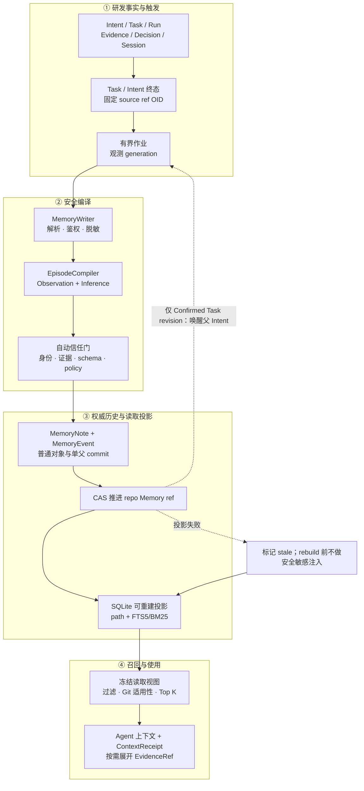
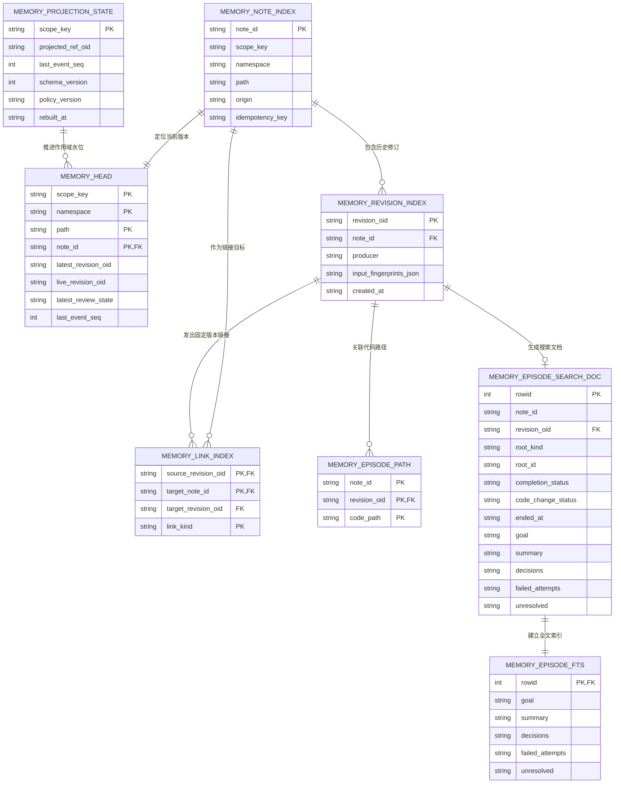
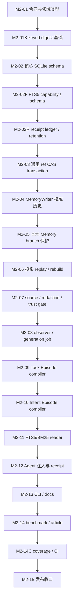

# M2 研发历程记忆首个纵向切片计划（2026-08-19）

**模板版本：** 依据 [`plan-template.md`](plan-template.md) `v2` 编写。模板中的 `GC-*`、`ER-*` 与 `G-*` 全部适用；本文只补充 M2 研发历程记忆（下文简称 M2）的领域约束、任务卡和验收口径。**v2.1（2026-08-21 生效）迁移例外：** 本计划在 v2.1 生效前成稿，按模板「模板版本与迁移政策」增量迁移，未触碰卡保持 v2 口径；继续按 REL-M2-01 的「批量发布组收口时一次 bump」执行（成员推送不 bump、M2-15 唯一发布点），例外登记见「修订历史」2026-08-21 行。本次对成员卡 `C/D coverage from` 的编辑仅为 v2 口径下的覆盖归属更正，不改变成员卡发布行为、不构成规范性修改，不触发逐卡 v2.1 迁移。

## 文档职责

本文承接 [`plan-long.md`](plan-long.md) 的 `MEM-01`、`MEM-02`，目标是交付一条可运行的纵向链路：Libra 在研发任务或需求迭代结束后，自动把已有的 Intent、Task、Run、证据、决策、会话与代码版本编译成结构化研发历程记忆，并让后续 Agent 能按任务、时间、代码路径和代码版本快速召回，再沿证据引用展开原始记录。

本文只规划任务，不宣称能力已经实现。每张任务卡开工前仍需刷新源码锚点、测试目标和外部参照 revision。

### 适用范围

- 仓库级 M2 研发历程记忆：任务研发历程摘要（Task Episode Summary）与需求迭代摘要（Intent Iteration Summary）。
- `MemoryNote` / `MemoryEvent` 自定义 JSON 对象、受保护的本地分支 `refs/heads/libra/memory/repo` 权威历史及唯一写入器（`MemoryWriter`）。
- 在现有 `.libra/libra.db` 中新增 Memory 投影表、Episode 检索表与有界自动编译作业状态；不增加第二个数据库文件或数据库服务。
- Task / Intent 终态触发、来源解析、授权与脱敏、结构化编译、追加式写入、投影重建、FTS5/BM25 召回、证据展开与 Agent 上下文注入。
- 最小稳定命令面：`libra memory search`、`show`、`status`、`rebuild`，以及对应人读、`--json`、错误码和 EN/zh 文档。
- 离线确定性 benchmark、核心纯逻辑覆盖率门、迁移/并发/故障恢复测试与发布证据。

### 非目标

- 本计划不实现 MCP Memory tools；该表面仍受 `SB-02` 的 default-deny authorizer 与 principal threading 前置约束。
- 本计划不实现向量检索、实体图、多跳推理、远端 embedding 或外部数据库。首个召回通道固定为 SQLite FTS5 + `bm25()`。
- 本计划不实现团队同步、跨仓库共享、Memory 导入导出、远端 publication、Global / Actor / Worktree / Branch scope；首个切片只开放 Repo scope、RepoLocal、local-only。普通 push/fetch/mirror 不传播该本地分支。
- 本计划不实现人工候选箱或人工批准流程。M2 的任务结果本身没有“好经验/坏经验”之分；自动编译器保留成功、失败、取消、部分完成和未改代码的尝试。
- 本计划不把会话全文、工具全部输出或补丁正文复制进 Memory。原始数据留在现有事实源，M2 只保存有界摘要和类型化证据引用。
- 本计划不提供跨版本批量语义回退命令。通用 `op restore` 不得回退 Memory ref；未来的 `memory revert` 另行设计为追加补偿事件。
- 本计划不实现 `memory consolidate`、taxonomy 自动扩展、onboarding、branch fork/merge/cherry-pick、UI 与协同 Memory。

### 成功定义

- Task 的 `Done`、`Failed`、`Cancelled` 终态或 Intent 的 `Completed`、`Cancelled` 终态写入后，运行时自动生成或修订对应的唯一 Episode。
- 每条 Episode 同时保留观察事实（Observation）与 Agent 推断（Inference），每项都能沿 `EvidenceRef` 回到现有 Run、Event、Decision、PatchSet、Session 片段或代码提交。
- 代码提交只是版本证据，不被当作 Task 结束信号；Task / Intent 终态事件才是自动编译触发点。
- 权威历史只存在于内容寻址对象、单父 Memory commit 与受保护 ref；删除全部 SQLite Memory 投影后可得到语义相同的重建结果。
- 同一 Task / Intent 永远只有一个稳定记忆单元格和一个稳定 `note_id`；重复触发不追加重复事件，新证据产生同一 note 的新 revision。
- 无 embedding、无外部服务时，Agent 仍可使用结构化过滤 + FTS5/BM25 在有界时间内找到相关摘要，并按当前 code commit 判断适用性。
- 自动注入使用一次冻结读取视图，并留下可重放的上下文选择回执（`ContextSelectionReceiptV1`，下文简称 `ContextReceipt`）；相同 view、query、selector 版本得到相同结果顺序与 bundle hash。
- 核心领域逻辑的约定范围达到 100% line + region coverage；fmt、clippy、全量测试、迁移、并发、隐私与 benchmark 门全部通过。

## 术语与边界

| 中文主名 | 英文 / 代码名 | 本计划中的含义 |
|---|---|---|
| 研发历程记忆 | Episode | 从现有研发事实编译出的 M2 记忆对象；不是新的研发事件事实源 |
| 任务研发历程摘要 | Task Episode Summary | 汇总一个 Task 下的多次 Run、决策、证据、代码变更和结果 |
| 需求迭代摘要 | Intent Iteration Summary | 汇总一个 Intent 下已固定 revision 的多个 Task Episode |
| 观察事实 | Observation | 可由来源记录直接支持的陈述，必须带证据引用 |
| Agent 推断 | Inference | Agent 对根因、设计取舍或因果链的解释，必须带置信度和证据引用 |
| 类型化证据引用 | EvidenceRefV1 | 指向既有事实源精确片段的结构化指针，携带 source plane、kind、对象 ID、source ref OID、类型化 locator、脱敏片段 digest、可见性和可选 code commit |
| 记忆单元格 | Cell | 由 `(scope, namespace, path)` 确定的稳定逻辑位置；通用 Cell 可包含多条存活 note。M2 让每个 Task / Intent 映射到固定 Cell，并以确定性 `note_id`、root 绑定和幂等键保证该 root 只有一条 Episode note |
| 权威历史 | authoritative history | `MemoryNote`、`MemoryEvent`、Memory commit 与 Memory ref；任何读取投影都不能覆盖它 |
| 读取投影 | projection | 为快速读取而保存在 SQLite 的可重建表、路径索引与 FTS 索引 |
| 冻结读取视图 | ResolvedMemoryView | 一次检索/注入使用的 repo、principal、code commit、ref OID、policy 与 projection watermark 快照 |
| 上下文选择回执 | ContextSelectionReceiptV1 / ContextReceipt | 记录实际选中了哪些记忆、为何选中、预算如何分配以及使用哪个冻结 view 的本地审计记录；由共享上下文层定义，不并入 `ContextFrame` |

Episode 是 Memory 平面的新派生对象；Intent、Task、Run、Evidence、Decision、PatchSet、Session 与 code commit 继续由既有 AgentRuntime / Git 平面拥有。两者只通过 `EvidenceRef` 和 code anchor 相连，不复制事实源正文。

`EvidenceRefV1.locator` 是封闭枚举：`object`、`event_seq`、`json_pointer`、`session_fragment`、`tool_call`、`code_range`。其中 Session 引用必须给出有界 fragment 序号区间，工具引用必须给出 invocation/output part，代码引用必须固定 commit/path/range。`fragment_digest` 只对解析、授权、脱敏后的规范片段计算；它用于复核定位是否漂移，不保存原文，也不能用未加盐 secret hash 替代。

## 核心链路



关键时序：

1. Task / Intent 终态写入先完成；自动编译不会阻塞原始研发事实的提交。
2. 触发器只提交受信任的 root kind / root ID、source ref OID 与已认证 principal，不把原始会话直接交给模型。
3. `MemoryWriter` 内部先解析有界来源窗口、鉴权和脱敏，再调用 `EpisodeCompiler`。输入指纹只基于脱敏后的规范输入。
4. 编译器只能提议 Episode 内容，不能决定 scope、namespace、path、root identity、`note_id` 或 ref。
5. Writer 从终态事实机械填充 completion、时间、related IDs 与 code anchor；自动信任门验证来源信任级别、EvidenceRef locator/digest、脱敏报告、schema、policy 和 prompt-injection reason code。通过才 Confirmed；未通过的经历仍以 Quarantined revision 保存，但不自动注入。
6. Writer 校验后追加不可变 revision 和事件，以 CAS 推进 repo Memory ref；同一幂等键命中时返回既有 revision，不追加事件。
7. 新 Confirmed Task revision 会由 Memory ref observer 唤醒对应的已终态父 Intent；输入指纹包含固定 Task revision 集，重复通知幂等，Intent revision 不再反向触发自己。
8. SQLite 保存快速读取投影。投影水位与 ref 不一致时，自动注入暂停，重建器从权威历史恢复。
9. 检索返回紧凑 Episode；只有 Agent 需要核查时，才沿 `EvidenceRef` 展开现有原始数据。

## 记录与存储结构

### M2 负载

`MemoryNote` 增加可选 `episode: Option<EpisodePayloadV1>`。由于仓库尚无 Memory writer 或已写入的 schema v1 对象，本计划在首个 writer 落地前修订 schema v1 的字段清单，而不制造一个从未发布过的空 v1 → v2 迁移。

| 字段 | 类型 | 语义 |
|---|---|---|
| `schema_version` | `u32` | Episode 负载 schema；首版为 1 |
| `root_kind` / `root_id` | `task \| intent` / 对象 ID | 由 trusted trigger 绑定，模型输出只允许回显且必须一致 |
| `related_intent_ids` | 有序 ID 列表 | 相关 Intent；Task Episode 通常含父 Intent，Intent Episode 含自身 |
| `related_task_ids` | 有序 ID 列表 | Task Episode 含根 Task；Intent Episode 含全部贡献 Task |
| `related_run_ids` | 有序 ID 列表 | 参与这次编译的 Run，稳定排序、去重 |
| `started_at` / `ended_at` | 可选时间戳 | 由来源事件时间机械计算的业务时间窗口 |
| `goal` | 文本 + EvidenceRef | 从 Task / Intent 目标字段提取，不由模型改写事实含义 |
| `completion_status` | 枚举 | 由终态事实机械映射为 `completed` / `failed` / `cancelled`；不允许模型输出 |
| `code_change_status` | 枚举 | 由 patch/code anchor 机械映射为 `changed` / `unchanged` / `unknown`，与任务完成状态正交 |
| `summary` | `EpisodeClaimV1` | 对本次历程的有证据综合；固定标记为 `inference` |
| `observations` | `{claim, evidence_refs}` 列表 | 可直接从来源记录支持的事实 |
| `inferences` | `{claim, confidence, evidence_refs}` 列表 | 对根因、需求、设计和代码修改原因的解释 |
| `decisions` | `EpisodeClaimV1` 列表 | 采用或放弃的方案及原因；每项都标记 observation/inference 并引用证据 |
| `failed_attempts` | `EpisodeClaimV1` 列表 | 做过什么、实际发生什么；每项都标记 observation/inference 并引用证据 |
| `unresolved` | `EpisodeClaimV1` 列表 | 尚未解决的问题；每项都标记 observation/inference 并引用证据 |
| `code` | `{base_oid, result_oid, branch_ref, paths}` | 这条 Episode 描述的代码版本区间与路径 |

`EpisodeClaimV1` 固定包含 `epistemic_status = observation | inference`、`claim`、非空 `evidence_refs`；Inference 额外要求 `confidence`，Observation 禁止伪装置信度。校验只能证明“引用存在、可见、定位和 digest 匹配”，不能宣称自然语言蕴含已被形式化证明；这项边界进入 benchmark 的 unsupported-claim / evidence-entailment 指标。

固定 Cell：

```text
Repo / default / episodic.tasks.<canonical-task-id>
Repo / default / episodic.intents.<canonical-intent-id>
```

Intent Episode 的 `MemoryNote.links` 固定每个贡献 Task Episode 的 `note_id + revision_oid`。因此之后 Task Episode 修订不会悄悄改写旧的 Intent 摘要；下一次 Intent 编译会显式产生新 revision。

`content_digest` 包含 Episode 的语义字段和 code anchor；排除 `revision_oid`、`parents`、`EvidenceRef` 中的存储 OID/hash 与 link 的 target revision OID。完整 JSON blob 的对象 OID仍覆盖全部字节。该规则同时修正文档中“明确包含 effective commit”与“排除任何 Git OID”的冲突。

### 权威对象布局

当前 `reference` 模型只支持 `ConfigKind::Branch/Tag/Head`，`HistoryManager` 的 CAS 只操作 `kind=Branch`。因此本计划采用真实可表示的本地分支全名 `refs/heads/libra/memory/repo`，SQLite 内部名称为 `libra/memory/repo`。它由 Libra-owned ref policy 隐藏和保护，普通 branch/checkout/restore/push/fetch/mirror 不能把它当用户分支；未来若引入真正的 `refs/libra/*` namespace，必须另做 reference model 与传输迁移。

```text
refs/heads/libra/memory/repo
└── single-parent commit chain
    ├── notes/<encoded-namespace>/<note-id>/<revision-oid>.json
    ├── events/<event-seq>-<event-id>.json
    └── manifest.json
```

- `MemoryNote` revision 与 `MemoryEvent` 都是普通 JSON blob，不向 `git-internal::ObjectType` 增加新枚举。
- 首次自动写入连续追加 `Created`、`Confirmed`；新来源版本连续追加 `Revised`、`Confirmed`。这里的 Confirmed 表示“来源、schema、策略和编译记录完整，可被读取”，不表示每条 Inference 都是客观真理。
- Observation 与 Inference 的边界由结构表达；推断置信度不影响是否保存该研发经历。
- 失败、取消和未改代码的结果照常写入。模型错误、schema 错误或授权失败不产生半条 note，只保留有界作业诊断。

### SQLite ER 图

下图只画首个纵向切片需要的核心读取关系和主外键；为保持可读性，实体框只列身份、水位与连接字段，完整列合同在图后的表格和 `memory.md`。`memory_compile_job` 是有界的本地运行状态，`context_selection_receipt` 是有界的本地审计账本；两者都不属于投影真源，因此在后续表格单列。



### SQLite 表职责

| 表 / 索引 | 类型 | 主要键 | 职责与恢复方式 |
|---|---|---|---|
| `memory_head` | 可重建投影 | `(scope_key, namespace, path, note_id)` | 完整沿用 `memory.md` 的 `latest_revision_oid/live_revision_oid/latest_action/latest_review_state/kind/lifecycle/confidence/trust/sensitivity/visibility/acl_policy_id/valid_from/valid_until/effective_from_commit/effective_until_commit/expires_at/rank_hint/last_event_seq/updated_at`；代码适用性由 reader 针对冻结 code commit 计算，不写入表中。M2 的每-root 单 note 约束由确定性 `note_id`/Cell 与幂等索引实现，不收窄通用 Cell 模型 |
| `memory_path_summary` | 可重建投影 | `(scope_key, namespace, path)` | 路径级数量和稳定预览；首个切片只维护 episodic 两个前缀 |
| `memory_note_index` | 可重建投影 | `note_id` 主键；Cell/Namespace 范围的 idempotency 唯一索引 | 反向定位稳定逻辑 note，并对同一 root 的确定性创建去重；不禁止通用 Cell 保存不同幂等键的多条 note |
| `memory_revision_index` | 可重建投影 | `revision_oid` | 按 producer / prompt / model / policy / input fingerprint 定位修订 |
| `memory_link_index` | 可重建投影 | source revision + target note + link kind | 固定 Intent Episode 使用的 Task Episode revision |
| `memory_projection_state` | 可重建水位 | `scope_key` | 保存 `projected_ref_oid`、`last_event_seq`、schema/policy 版本和 rebuilt time |
| `memory_episode_path` | 可重建投影 | `(note_id, revision_oid, code_path)` | 精确路径和路径前缀过滤 |
| `memory_episode_search_doc` | 可重建投影 | integer `rowid`；唯一 `(note_id, revision_oid)` | 保存 root / 时间 / completion / code-change 等结构化列及外部内容 FTS 的正文源 |
| `memory_episode_fts` | 可重建 FTS5 | 与 search doc 共用 `rowid` | 倒排索引 `goal/summary/decisions/failed_attempts/unresolved`，使用 `bm25()` 排序 |
| `memory_compile_job` | 有界本地运行状态 | 唯一 `(scope_key, root_kind, root_id)` | 保存 observed/processed generation、最新 terminal source object OID、规范输入指纹、lease owner/fence、retry 状态；输入指纹不变时重放不递增 generation |
| `memory_compile_observer_state` | 有界本地运行状态 | `(scope_key, source_ref_name)` | 分别保存已完整扫描的 `libra/intent` 与 `libra/memory/repo` first-parent OID；前者发现 Task/Intent 终态，后者只用已确认 Task revision 唤醒已终态父 Intent；和 job upsert 在同一 SQLite transaction 推进 |
| `context_selection_receipt` | 有界本地审计账本 | UUIDv7 `receipt_id` | 共享 Memory/mainline 的选择回执；保存 source kind、view/source heads、水位、策略与 selector 版本、`digest_key_id`、选中/省略项、预算、bundle hash 和重放状态，不保存 raw query/body；`recorded_at` 有索引 |
| `context_selection_receipt_retention` | 有界本地账本元数据 | `repository_id` | 保存 `pruned_before` 与最近 prune 时间；默认保留 30 天且每仓最多 10,000 行，append 时用索引删除过期/超额最旧行 |

Migration 只写入现有 `.libra/libra.db`。普通投影表使用 SeaORM entity；FTS5 虚拟表、作业/observer 状态和选择回执账本使用受测试保护的 raw SQL。终态事件和 `CompileRecord` 是作业丢失后的恢复依据；job、observer 与 receipt 都不是新的事实源，`rebuild` 不触碰回执账本。

## 召回算法

首个读取通道固定为：

```text
query + principal + current code commit
  -> 冻结 ResolvedMemoryView
  -> scope / live head / projection watermark 过滤
  -> Task / Intent / time / completion / code-change / path 结构化过滤
  -> FTS5 MATCH 产生候选
  -> bm25() ASC 排序（unicode61；固定列权重）
  -> Git ancestry + Episode paths 的代码适用性分级
  -> 稳定 tie-break（ended_at DESC, note_id, revision_oid）
  -> Top K + token budget
  -> Episode 摘要；按需展开 EvidenceRef
```

FTS 表固定 `tokenize='unicode61 remove_diacritics 2'`；`bm25()` 的列权重按 `goal=8, summary=5, decisions=4, failed_attempts=3, unresolved=2`，SQLite 分值越小越相关，所以使用 `ASC`。权重、tokenizer、query normalization 或 tie-break 任一变化都必须提升 selector version 并更新 benchmark baseline。

采用 FTS5/BM25 的原因：Libra 已使用 SQLite，数据规模以单仓研发历史为边界；FTS5 提供本地倒排索引，`bm25()` 提供无需模型和网络的确定性词项排序。Letta Code 与 Rekal 提供了 Git-backed / 版本关联的工程结构参考；`ldbd-sqlite-fts-baseline` 验证了 SQLite WAL、结构化 scope 过滤、FTS5、`bm25()` 与稳定回退可组成轻量基线。它们只作为实现证据，不替代本计划的 Libra 对象与权限契约。

代码适用性固定为五态：`exact`（current=result）、`descendant_unchanged`（result 是 current 祖先且所有 Episode path 的 tree entry 未变）、`descendant_path_changed`（祖先关系成立但至少一个相关 path 已变）、`diverged`（不在同一祖先链）、`unknown`（anchor/path 缺失、对象损坏或超出 512 paths / 2,048 commits 的预算）。默认自动注入只接收前两态；第三态可检索但带 stale 警告，后两态只允许显式诊断查询。路径检查比较 `result_oid` 与 current tree 上受限路径的 entry OID，不全量扫描仓库。

## 事实基线

> 核对日期：2026-08-19；checkout `f76e0c1d1a2ed8f32e8a1b0a8227e42bfb31b730`，crate `0.19.148`。行号在每卡开工时按 `ER-02` 刷新。

| 类别 | 当前事实 | 证据 |
|---|---|---|
| Memory 模块 | `src/internal/ai/` 尚无 `memory` Module | `src/internal/ai/mod.rs:53-160` |
| CLI | 顶层命令尚无 `Memory` variant | `src/cli.rs:670-743` |
| 数据模型 | SeaORM model registry 尚无 `memory_*` entity | `src/internal/model/mod.rs:1-42` |
| 迁移 | 最新注册版本为 `2026081301_approved_permission_provenance`；新增迁移必须集中注册 | `sql/migrations/README.md:90-114,123-176`；`src/internal/db/migration.rs:823+` |
| 现有 AI 事实图 | 已有 intent→task、task→run、run→event、run→patchset、intent→context frame 反向索引 | `src/internal/ai/projection/index.rs:1-110` |
| 终态触发点 | orchestrator 已集中追加 Task / Run 事件并记录 terminal Intent 结果 | `src/internal/ai/orchestrator/persistence.rs:2282,2313,4136` |
| 对象/ref 基础 | `HistoryManager` 已支持自定义 ref 与 SQLite CAS，但 companion-write 事务仍是私有实现 | `src/internal/ai/history.rs:967-1021,1098-1155,2017-2180` |
| 存储 | `ClientStorage::put` 先写对象，再登记/排队 object index；Memory 首个切片需 local-only durability policy | `src/utils/client_storage.rs:1645-1742` |
| 脱敏 | 已有不可任意构造的 `RedactedBytes` 与高置信 secret 规则；PII 和 Memory policy 仍需补齐 | `src/internal/ai/observed_agents/redaction.rs:1-220` |
| 操作恢复 | operation snapshot 会记录所有 local branch；restore 会逐条回写，当前会把未来 Memory ref 回退 | `src/internal/operation_wrapper.rs:1444-1475`；`src/command/op.rs:596-619` |
| 现有 MemoryAnchor | 仅为 session-local 上下文锚点，不是仓库级 M2 权威历史 | `src/internal/ai/context_budget/memory_anchor.rs`；`tests/ai_memory_anchor_test.rs` |
| FTS5 | 仓库尚无 FTS5/BM25 使用；首个切片需迁移、查询与 release-target 能力测试 | `rg -n "FTS5|bm25\\(" src sql tests`（核对日零实现命中） |
| 设计文档 | 已定义 MemoryNote/Event/Writer/ref/projection/Channel 0，但 M2 payload、自动 lifecycle 与 Task/Intent 触发尚未进入规范 | `docs/development/tracing/memory.md:498-636,736-975,1362-1378` |

### 外部参照（pin 到核对 revision）

| 项目 | Revision（2026-08-19 核对） | 只借鉴的机制 | 关键路径 |
|---|---|---|---|
| `letta-ai/letta-code` | `ee230f304a1a9415d949420c0835ff8583df26f7` | Git-backed memory filesystem、分层展开、按需读取 | `src/agent/memory-filesystem.ts`、`src/agent/memory-git.ts`、`src/agent/prompts/letta_local_memfs.md` |
| `rekal-dev/rekal-cli` | `aace7a29af3e120af874ddf9566e4949db93cd9c` | session / code version / path 索引、checkpoint 与查询组织 | `docs/db/overview.md`、`cmd/rekal/cli/checkpoint.go`、`cmd/rekal/cli/db/indexer.go` |
| `FantaSmallhamster/ldbd-sqlite-fts-baseline` | `945b2788cbc4da6de9f374e209233ae055eb05aa` | SQLite FTS5、`bm25()`、结构化过滤和确定性 baseline | `README.md`、`app/main.py` |

### 当前缺口

| ID | 缺口 | 影响 | 计划动作 |
|---|---|---|---|
| GAP-M2-01 | `MemoryNote` / `MemoryEvent` / `EpisodePayloadV1` 无 Rust 契约与 canonical 编码 | 无法写出跨版本稳定对象 | M2-01 |
| GAP-M2-01K | 幂等、principal/query 与 source-input HMAC 无共享 key owner/lifecycle | 各模块可能生成不一致或不可恢复的 digest | M2-01K |
| GAP-M2-02 | 无 Memory 核心投影、FTS5 能力、自动作业状态与共享回执账本 | 无法落库、重建、快速检索或重放注入选择 | M2-02、M2-02F、M2-02R |
| GAP-M2-03 | CAS + companion projection transaction 只在 `HistoryManager` 私有路径中 | 复制实现会产生两个并发语义 | M2-03 |
| GAP-M2-04 | 无唯一 `MemoryWriter` 与 repo Memory ref 历史 | 任意 Adapter 都可能形成半写入 | M2-04 |
| GAP-M2-05 | 通用 `op restore` 会裸回退未来 Memory ref | 破坏只追加事件和投影水位 | M2-05 |
| GAP-M2-06 | 无事件 replay / projection rebuild / stale 处理 | SQLite 损坏后无法恢复且可能读到旧数据 | M2-06 |
| GAP-M2-07 | 无从现有 AI 图解析有界 Episode 来源的 Adapter | 模型只能读散乱或无界会话 | M2-07 |
| GAP-M2-08 | 无 Task / Intent 终态到自动编译的可恢复触发 | 自动 Memory 会漏跑或重复跑 | M2-08 |
| GAP-M2-09 | 无 Task Episode 编译器 | Agent 无法解释一次任务的过程和根因 | M2-09 |
| GAP-M2-10 | 无 Intent Episode 编译器 | Agent 无法比较同一需求的多次任务迭代 | M2-10 |
| GAP-M2-11 | 无结构化 + FTS5/BM25 + Git applicability reader | 无法在本地有界时间召回 | M2-11 |
| GAP-M2-12 | 无共享冻结 view / receipt 注入路径 | 召回结果不可重放，预算责任不清 | M2-12 |
| GAP-M2-13 | 无稳定 CLI / JSON / 错误码 / 用户文档 | 无法诊断或供 Agent 以外调用 | M2-13 |
| GAP-M2-14 | 无 Episode/召回 benchmark 与 Memory scoped coverage/CI 证据 | 无法验证编译质量、召回、重建、隐私、性能与核心覆盖率 | M2-14、M2-14C |

## 与其它计划和文档的关系

| 计划 / 文档 | 关系 | 本计划处理 |
|---|---|---|
| [`plan-long.md`](plan-long.md) | 承接 `MEM-01` 与 `MEM-02` 的 Repo/local-only M2 纵切 | 把“Memory 首个日期计划”索引改为本文；不宣称 MEM-03..06 完成 |
| [`memory.md`](../tracing/memory.md) | Memory 对象、writer、存储、投影与 recall 的规范事实源 | M2-01 先补 Episode payload、自动 producer policy 与 digest 规则，再实现 |
| [`object-model-reference.md`](../../ai/object-model-reference.md) | Snapshot / Event / Projection 纪律 | Episode 作为 MemoryNote 扩展；不向 AgentRuntime typed object enum 增型 |
| [`mainline.md`](../gap/mainline.md) | 共享上下文选择与 receipt 方向 | M2-01 已把两份设计统一为共享 `ContextSelectionReceiptV1`；M2-02R 建唯一账本，M2-12 复用，不创建平行 receipt |
| `SB-02` | MCP/default-deny 安全前置 | 本计划不注册 Memory MCP，因此不被阻塞 |
| 现有 `MemoryAnchor` | session-local 兼容注入槽 | M2-12 只做本次上下文适配，不把 MemoryNote 复制并持久化为 Anchor |

## 评审结论与修订记录

| 维度 | 初稿结论 | 计划中的处理 |
|---|---|---|
| 合理性 | M2 直接回答“代码为何形成、此前为何失败、旧结论是否仍适用” | 只保留版本关联研发历程，不扩成通用知识库 |
| 可行性 | 复用现有 AI 事实图、对象存储、SQLite、CAS 与 redaction；新增部分均为本地模块 | 按 contract→schema→writer→compiler→reader→injection 拆分 |
| 任务卡粒度 | 18 张实现/迁移卡 + 1 个发布点，均为单一行为轴、S/M | 共享文件严格串行；无并发写集冲突 |
| 依赖与顺序 | Writer 前依赖 contract/schema/CAS；Intent 编译依赖 Task revision；注入依赖 reader | 依赖 DAG 见下节，无环 |
| 完整性 | 存储、自动触发、两级摘要、召回、注入、CLI、benchmark 均有承接卡 | MCP/vector/team/export 等明确延后 |
| 安全性 | 最高风险是原始 source 在脱敏前进入模型/hash/store | 来源解析与脱敏只存在于 Writer 内部，`RedactedEpisodeSource` 作为类型门 |
| 功能正确性 | 最高风险是并发首次创建产生两个 note、作业漏跑、投影 stale | Cell 幂等、CAS 重查、generation job 与重建测试覆盖 |
| 接口兼容 | 首次公开 `libra memory`，schema 尚无已发布对象 | 在首个 writer 前冻结 v1；CLI 从小表面开始 |
| 数据流与控制流 | 对象写在 CAS 前可留下不可达对象；ref 是权威、投影可前滚恢复 | 明确 crash window 与 stale watermark，禁止 SQLite 覆盖历史 |
| 性能与容量 | 单仓数据量适合 SQLite；原始会话无界扫描和 FTS 写放大需控制 | 有界 source window、每 root 单作业行、外部内容 FTS、benchmark 门 |
| 可靠性与容错 | LLM/进程/SQLite/CAS 均可能失败 | job lease/fence、稳定错误码、幂等 retry、rebuild/doctor 路径 |
| 可维护性 | 最大风险是 CLI/hook/compiler 直接写 ref 或复制 HistoryManager 私有 CAS | 两个小 Interface：MemoryWriter 与 EpisodeReader；其余均为 Adapter |

### 修订历史

| 日期 | 触发 | 变更内容 | 原卡 → 新卡 | 受影响引用 |
|---|---|---|---|---|
| 2026-08-19 | 初稿自审 | 把原先“一张 Episode 卡”拆成 source、job、Task compiler、Intent compiler 四个行为轴；把 op restore 保护独立成卡 | 初始草案 → M2-05, M2-07..M2-10 | DAG、测试矩阵、风险表 |
| 2026-08-19 | 开工前合同复核 | 冻结共享 `ContextSelectionReceiptV1` 的 owner、单一账本和字段 envelope；去掉 M2-12 的悬空依赖 | DEP-M2-04 → M2-01/M2-02/M2-12 | ADR-M2-10、SQLite schema、任务审计、风险表 |
| 2026-08-20 | 新 reviewer R1 | 对齐真实 branch ref；补齐可信字段、精确证据、自动信任门、observer cursor、五态适用性和 receipt retention；把 FTS 能力、回执账本、coverage/CI 拆成独立卡 | M2-02 → M2-02/M2-02F/M2-02R；M2-14 → M2-14/M2-14C | 全文合同、DAG、任务审计、测试矩阵、风险表 |
| 2026-08-20 | 新 reviewer R2 | 恢复通用 Cell 的多 note 合同；新增仓库级 keyed-digest owner；补齐三张迁移卡的旧 reader 测试、无发布副作用的四平台 FTS5 门和绝对召回门 | M2-01 → M2-01/M2-01K；新增 DEP-M2-CI-01 | ER、ADR-M2-08/10/11、DAG、任务卡、发布组、测试矩阵、完成判据 |
| 2026-08-20 | 新 reviewer R3 | 把现有 base CI 与 CodeQL 从“开工日再看”改为具名 workflow/job/ref/SHA/success predicate 的外部 D-01 合同 | 新增 DEP-M2-CI-02 | 依赖登记、M2-15、任务审计、review log |
| 2026-08-20 | 新 reviewer R4 | 闭合发布点等待远端门的 `remote-pending` 状态，并把四平台探针显式列入所有消费卡依赖 | 无拆卡 | DEP-M2-CI-02、M2-14C、M2-15、任务审计、review log |
| 2026-08-21 | 模板 v2.1 生效（ER-08/C 组与 G-07a 改为「每卡 `patch + 1` + 工具链 lockfile + `gh` 触发 release」） | 登记模板 v2.1 迁移例外：本计划在 v2.1 生效前成稿，按模板「模板版本与迁移政策」增量迁移，未触碰卡保持 v2 口径。继续按 REL-M2-01 的「批量发布组收口时一次 bump」执行（REL-M2-01 全体成员 M2-01, M2-01K, M2-02, M2-02F, M2-02R, M2-03..M2-14, M2-14C 推送不 bump、M2-15 唯一发布点）；下次触碰 REL-M2-01 发布模型时迁到本版 ER-08（每卡 `patch + 1` + 版本面五处 + 工具链刷新 `Cargo.lock` + `gh release create`）。M2-15 沿用「本计划不创建/推送 release tag，D-02 为 N/A，由 maintainer 后续 release 流程拥有」口径，作为本次例外的一部分。同批将全体成员卡 `C/D coverage from` 由 `self` 更正为 `M2-15`（D-01 不继承）：此为 v2 既有口径（成员卡 `Release write set: N/A`、REL-M2-01 登记「不 bump/tag」、版本面本由 M2-15 收口）的归属更正，不改变成员卡发布行为、不构成对成员卡的规范性修改，不触发逐卡 v2.1 迁移 | 无新卡 | 模板版本与迁移政策、REL-M2-01、全体成员卡 `C/D coverage from`、任务卡字段默认值、M2-15、发布分组与并发窗口 |

## 已决议设计决策

### ADR-M2-01：M2 是版本关联的研发过程记忆

- **Status:** Accepted
- **Context:** 现有 Memory 草案以长期事实/技能为主，mentor 需要 Agent 回顾软件研发迭代的完整因果链。
- **Decision:** M2 保存 Task / Intent 级研发历程，成功、失败、取消、部分完成和未改代码均进入摘要。Observation 与 Inference 分栏；不按“好/坏经验”过滤。
- **Alternatives considered:** 只保存成功经验；只保存 Markdown 文档；完整复制 transcript。三者分别丢失失败证据、结构/版本关系或造成无界冗余。
- **Consequences:** M2 是可审计的过程上下文，不保证推断绝对正确；Agent 必须能展开证据复核。
- **Revisit when:** Libra 引入更细粒度、已成为事实源的研发迭代对象。

### ADR-M2-02：两级摘要直接对齐 Intent / Task

- **Status:** Accepted
- **Context:** Episode 不是现有 Libra 对象，必须与现有对象图建立唯一映射。
- **Decision:** Task Episode 汇总 Task 下 Run；Intent Episode 汇总固定 revision 的 Task Episode。每个 root 使用固定 Cell 与稳定 `note_id`。
- **Alternatives considered:** 新增通用 Episode root；按 session 生成摘要。前者重复领域模型，后者无法稳定映射需求与任务。
- **Consequences:** Intent 摘要依赖 Task 摘要；session 只作为 EvidenceRef 来源。
- **Revisit when:** 出现无法归属 Task / Intent 的一等研发流程。

### ADR-M2-03：复用现有对象库与单个 SQLite 数据库

- **Status:** Accepted
- **Context:** Libra 是本地命令，不能依赖常驻数据库服务或第二套数据提供器。
- **Decision:** 权威历史写普通 blob/tree/commit + `refs/heads/libra/memory/repo`；投影、FTS 与有界 job/observer/receipt 行全部进入现有 `.libra/libra.db`。该分支使用现有 `kind=Branch` 存储，但由 Libra-owned policy 隐藏、保护且禁止普通远端传输。
- **Alternatives considered:** KurrentDB、Postgres、独立 vector DB、Rekal 式第二个 index DB。它们增加部署、同步或恢复边界。
- **Consequences:** SQLite 投影必须可重建；FTS5 是 release target 的必备能力。
- **Revisit when:** 单仓 benchmark 证明 SQLite 无法满足已冻结容量/延迟预算。

### ADR-M2-04：MemoryWriter 是唯一写入 Seam

- **Status:** Accepted
- **Context:** 多入口直接写 ref、对象和投影会复制安全、幂等和并发语义。
- **Decision:** 所有 mutating Adapter 只提交 `MemoryWriteRequest`；MemoryWriter Implementation 独占 source resolution、authorization、redaction、compiler 调用、schema/policy/trust validation、canonicalization、object persistence、CAS 与 projection mutation。权威审计由同一 commit 内的 `MemoryEvent + CompileRecord` 提供；不把命令级 operation graph 变成第二套 Memory 审计真源。
- **Alternatives considered:** compiler 先读 raw source 并返回完整 note；CLI/hook 各自调用 HistoryManager。两者都让敏感输入或 ref 更新绕过单点约束。
- **Consequences:** MemoryWriter 是深 Module；compiler 与 storage 是内部 Adapter，不暴露给命令层。
- **Revisit when:** 无。

### ADR-M2-05：终态事件触发，代码提交只作版本证据

- **Status:** Accepted
- **Context:** 一个 Task 可能有多个 commit，也可能不改代码；commit 无法表达完成、失败或取消。
- **Decision:** 只观察现有 `TaskEventKind::{Done, Failed, Cancelled}` 与 `IntentEventKind::{Completed, Cancelled}`；Episode 的 code 字段记录 base/result OID、branch 与 paths。没有“封闭 revision”这一隐式新事件。
- **Alternatives considered:** 每次 commit 扫描 session；固定时间定时全量扫描。前者语义错误且昂贵，后者延迟高并需无界去重。
- **Consequences:** 终态写入不等待 LLM；有界 job 状态保证最终收敛。
- **Revisit when:** 终态事件模型发生兼容性变更。

### ADR-M2-06：自动确认表示可用性，不表示推断真理

- **Status:** Accepted
- **Context:** M2 前提是 Agent 全自动，人不参与审核；当前 `memory.md` 对 LLM 产物默认限制为 Draft。
- **Decision:** Writer 内置确定性的 `AutoEpisodeTrustGateV1`。输入为 authenticated principal、source trust labels、EvidenceRef locator/digest 验证、redaction/injection scan report、compiler allowlist、schema/root/code anchor、ACL/sensitivity/policy version；输出为 `confirmed | quarantined | rejected` 与稳定 reason codes。只有全部门通过才连续写 `Created|Revised + Confirmed`；不可信外部片段、疑似 prompt injection、未解析 locator 或 SecretLike 进入 Quarantined/Rejected，绝不自动注入。Inference 自带置信度与证据，Confirmed 只表示“通过自动使用门”，不表示推断是真理。
- **Alternatives considered:** 人工 Trust Gate；所有模型输出直接视为 Verified。前者不满足自动化边界，后者混淆可用性和事实真值。
- **Consequences:** M2-01 必须修订 `memory.md` 的 producer policy；M2-07 实现 trust gate。失败经历仍可保留为 Quarantined revision，读取端按 state/trust/confidence 展示，默认注入只接受 Confirmed。
- **Revisit when:** 自动 policy gate 的离线误用率超过 benchmark 门槛。

### ADR-M2-07：自动作业使用每 root 单行 generation + lease/fence

- **Status:** Accepted
- **Context:** 终态写入不能被 LLM 延迟阻塞，也不能因进程退出漏掉编译。
- **Decision:** `memory_compile_job` 每个 `(scope, root_kind, root_id)` 最多一行。外部事实触发只接受声明的 Task/Intent 终态；另有一条内部依赖观测：从 Memory ref 看到新 Confirmed Task revision 时，只唤醒其已终态父 Intent，Intent revision 自身不再触发编译。Task 的规范输入指纹绑定 terminal source OID；Intent 的规范输入指纹绑定 terminal Intent OID + 有序贡献 Task revision OID（缺失项用稳定 marker）。只有指纹变化才递增 observed generation。`memory_compile_observer_state` 分别记录每个 scope/source ref 已完整扫描的 first-parent OID；observer 在同一 SQLite transaction 内幂等 upsert job 后推进水位。lease winner 处理到目标 generation，按 fence 推进 processed generation。
- **Alternatives considered:** 内存队列；每次触发一行永久 job；同步调用模型。三者分别会丢任务、无限增长或阻塞事实写入。
- **Consequences:** job 状态有界；终态事件 + CompileRecord 可用于 repair。
- **Revisit when:** Libra 建立通用持久作业调度 Module。

### ADR-M2-08：FTS5/BM25 是首个且唯一必需召回通道

- **Status:** Accepted
- **Context:** 首版需要高效、离线、确定性的本地召回。
- **Decision:** M2-02F（下文新增卡）拥有 release-target FTS capability 与 external-content schema；缺失时统一启用 bundled SQLite FTS5，不能降级成全表扫描。召回固定为结构化过滤 → FTS5 MATCH → `bm25()` ASC → 五态 Git applicability → stable tie-break；vector/graph 不参与 canonical result。
- **Alternatives considered:** `LIKE` 全表扫描；首版引入 embedding/vector DB。前者不可扩展，后者扩大依赖、非确定性和隐私面。
- **Consequences:** benchmark 必须单独报告 Recall@K、NDCG@K、P50/P95/P99 与索引体积；冻结 corpus 上的首发绝对门为 Recall@10 ≥ 0.80、NDCG@10 ≥ 0.70，任一未达即 no-go，不能靠低 baseline 通过。
- **Revisit when:** FTS baseline 在冻结数据集上不能达到 mentor 批准的召回门槛。

### ADR-M2-09：通用 operation restore 不回退 Memory ref

- **Status:** Accepted
- **Context:** 直接把 Memory ref 移回旧 OID 会绕过 MemoryEvent，令水位和审计失真。
- **Decision:** 共享 Libra-owned ref classifier；用户 branch 命令、operation snapshot/restore/prune 与普通 push/fetch/mirror 均识别并排除 `libra/memory/*`。未来语义回退只追加事件/新 revision。
- **Alternatives considered:** 让 `op restore` 变成 Memory-aware。该方案把通用 VCS 恢复与 Memory 状态机紧耦合。
- **Consequences:** code operation restore 与 Memory 历史独立；Agent 依靠 code anchor 判断旧 Episode 是否适用。
- **Revisit when:** 独立 `memory revert` 计划获批。

### ADR-M2-10：共享冻结 view 与 ContextSelectionReceiptV1

- **Status:** Accepted
- **Context:** 检索和注入若在一次请求内重新读取 HEAD/时间，会不可重放；现有 `ContextFrame` 可含 raw content/attachment 且使用严格 wire schema，不能直接扩成选择回执；`memory.md` 与 `mainline.md` 目前还保留两个草案类型/表名。
- **Decision:** 在 `src/internal/ai/context_budget/receipt.rs` 定义共享 `ContextSelectionReceiptV1`，在现有 `.libra/libra.db` 用唯一 local-only append-only 账本 `context_selection_receipt` 持久化。固定 envelope 包含 `receipt_id/schema_version/source_kind/repository_id/digest_key_id/principal_hmac/query_hmac/effective_at/code_commit/full_branch_ref/source_heads/projection_watermarks/policy_hash/selector_version/selected/omissions/token_budget/bundle_hash/reproducibility_state/recorded_at`，可选关联 `frame_id`；raw query、正文与可逆 principal 不入账。receipt ID 使用现有 `uuid` crate 的可排序 UUIDv7，不新增 ULID 依赖；默认每仓保留 30 天且最多 10,000 行，append 时按 `recorded_at` 索引裁剪。缺失 UUIDv7 的内嵌时间早于 `pruned_before` 返回 `expired`，来源快照或 digest key 缺失返回 `non_reproducible`。M2 reader 只贡献候选与引用，共享上下文层拥有最终 token budget、冻结 `ResolvedMemoryView`、回执写入、retention 与 bundle 交付。
- **Alternatives considered:** Memory 内自带第二套 prompt assembler；只打印日志不写 receipt。
- **Consequences:** M2-01 先同步修正 `memory.md` 与 `mainline.md` 的草案命名；M2-02R 创建共享账本与 retention 元数据；M2-12 与现有 ContextFrame/MemoryAnchor 适配，不能持久化复制 MemoryNote，也不修改 `ContextFrame` wire schema。
- **Revisit when:** 未来需要跨仓库发布 receipt；该能力需要独立 privacy/retention 设计。

### ADR-M2-11：仓库本地 keyed digest 使用单一密钥提供器

- **Status:** Accepted
- **Context:** `CompileRecord.idempotency_key`、receipt 的 principal/query digest 与 source 去重需要 keyed HMAC；如果各模块自行取密钥、换代或静默重建，会产生重复 note、不可重放回执或敏感摘要泄漏。
- **Decision:** M2-01K 在 `src/internal/ai/keyed_digest.rs` 提供唯一 crate-private `RepositoryKeyedDigest`。它通过现有 repository vault + encrypted local config 的固定条目 `memory.keyed_digest.v1` 保存一次生成的 32-byte seed、`generation=1` 与随机 `key_id`；只在确认仓库尚无 Memory 对象/receipt 时生成。每个用途用 ring HKDF-SHA256 和固定 info `libra/memory/idempotency/v1`、`libra/memory/principal/v1`、`libra/memory/query/v1`、`libra/memory/source-input/v1` 派生独立 HMAC-SHA256 key，输出 envelope 总带 `key_id`。首个切片不自动轮换；密钥缺失、解密失败或 generation 未知时不生成替代 key，新 Memory 写入/receipt 追加 fail-closed 为 `LBR-MEMORY-DIGEST-KEY-UNAVAILABLE`，旧 receipt replay 标为 `non_reproducible`，已有权威对象仍可按 OID 只读诊断。
- **Alternatives considered:** 用 repository ID 直接 hash；每个模块保存自己的 secret；密钥丢失后自动重建。它们分别不能隐藏低熵输入、制造多套生命周期，或破坏跨重启幂等。
- **Consequences:** seed/key 只存在于现有加密本地配置，不进入 SQLite 明文字段、Git 对象、日志、remote tier 或 CI artifact；未来轮换必须独立 migration 同时定义跨 generation 幂等和 receipt replay。
- **Revisit when:** 需要显式 rekey、跨设备 Memory publication 或 repository vault 生命周期变化。

## 全局工程约束

模板 v2 的 `GC-01..GC-12` 全部适用，另增加：

- **GC-M2-01 来源边界：** raw source 只能在 MemoryWriter 内部 resolver 中短暂存在；进入 compiler、hash、日志和存储的类型必须是 `RedactedEpisodeSource` 或等价不可绕过的强类型。
- **GC-M2-02 身份绑定：** root kind/id、scope、namespace、path、principal、terminal status/time、related IDs、code anchor 与 source ref OID 来自 trusted trigger/source resolver；模型不能创建或覆盖这些字段，Writer 必须逐项校验。
- **GC-M2-03 单一写入：** `src/command/**`、orchestrator hook、job runner、compiler 和 tests 的生产 helper 均不得直接更新 Memory ref 或 live projection。
- **GC-M2-04 双真相禁止：** 对象/ref 是权威历史；SQLite 只作投影或本地运行状态。投影 mismatch 不能用 SQLite 反写 ref。
- **GC-M2-05 有界输入：** 每个 Task/Intent source window 必须限制对象数、文本字节、单项大小和模型 token；超限用明确 omission 记录与 EvidenceRef 表达。
- **GC-M2-06 确定性读取：** 默认 reader 不使用访问次数、wall-clock 漂移、随机数或 provider 结果参与排序；所有 selector 版本与 tie-break 固定。
- **GC-M2-07 本地存储：** 首个切片不把 Memory branch、Confidential 正文、job、receipt 或 input HMAC 进入 remote durable tier；普通 push/fetch/mirror 明确排除 `refs/heads/libra/memory/*`。
- **GC-M2-08 错误边界：** 公开失败使用稳定 `LBR-MEMORY-*`；job 内只持久化稳定 code 和脱敏摘要，不存 provider 原始响应。
- **GC-M2-09 FTS 同步：** `memory_episode_search_doc` 与 external-content FTS5 表通过同一投影 transaction 更新；禁止单独把 FTS 当事实源修补。
- **GC-M2-10 核心覆盖：** 100% line + region 口径固定为 `domain.rs`、`canonical.rs`、`validation.rs`、`state.rs`、`trust.rs`、`applicability.rs`、`selector.rs`、`job_state.rs` 的纯逻辑；I/O Adapter、SeaORM entity、CLI glue 另走集成测试，并在 coverage 配置中具名说明。
- **GC-M2-11 证据定位：** 每个可注入 claim 必须有至少一个可解析且已授权的 `EvidenceRefV1` locator，解析结果的 redacted canonical fragment digest 必须匹配；只指向整段 Session 的宽引用不合格。
- **GC-M2-12 自动信任：** compiler 输出属于不可信 proposal；只有 `AutoEpisodeTrustGateV1` 的 confirmed 结果可进入默认注入，Quarantined 仍保留历史但不得因相关度高越过门禁。
- **GC-M2-13 keyed digest：** idempotency、principal、query 与 source-input HMAC 只能调用 ADR-M2-11 的 typed purpose API；禁止自定义 label、直接读取 seed、用普通 hash 代替或在密钥不可用时静默生成新 key。

## 执行检查必备需求（强制）

模板 v2 的 `ER-01..ER-12` 全部适用。计划特有开工门：

1. 每卡开工先确认工作树未覆盖用户改动，并刷新 HEAD、crate 版本、最新 migration version、Memory 设计锚点和相关测试 target。
2. M2-02F 负责固定 FTS5 build contract：本地先探测，缺失则启用 bundled SQLite FTS5；DEP-M2-CI-01 四个平台的实际能力证据是该卡 D-01 继续门，不复用 tag-only release workflow。
3. M2-04 以后任何写路径变更都必须带 CAS race、崩溃窗口、idempotency 与 stale projection focused test；任一缺失不得进入 review。
4. M2-07 以后任何模型调用前都必须有 secret probe 断言，证明 raw secret 不进入 request capture、input fingerprint、object、log 或 job row。
5. M2-11 以后每次排序变化都必须更新 selector version 与 benchmark baseline；禁止静默调权。
6. 每张代码卡实现与 focused tests 在同一卡完成；新增 test target 同步 `tests/INDEX.md`，必要时同步 `Cargo.toml`。

## 实施顺序



### 依赖登记表

| ID | direction | 类型 | 对象 | Owner | 产物与可用性判据 | 证据 | 超时与失败策略 |
|---|---|---|---|---|---|---|---|
| DEP-M2-CI-01 | incoming | 外部 D-01 执行面 | GitHub Actions 四平台 FTS5 probe | M2-02F / repository Actions | 新增 `.github/workflows/memory-portability.yml`；`pull_request` + `workflow_dispatch` 触发；job ID `memory-fts5-probe` 在 Linux amd64/arm64、macOS arm64、Windows amd64 对同一 head SHA 运行 `cargo test --locked --release --test fts5_capability_test -- --nocapture`；无 secrets、R2 upload、tag 或 release artifact | `gh run view <run-id> --json headSha,event,status,conclusion,jobs,url`；四个 matrix job 均 `success`，`headSha` 等于被审分支/PR SHA | push 后 24h 内允许因平台故障重跑一次；仍无四个绿色 job 时 M2-02F 保持 `Lifecycle=blocked / Acceptance=locally-accepted`，不得启动 M2-11 reader；不改用 tag-only `release.yml` |
| DEP-M2-CI-02 | incoming | 外部 D-01 执行面 | 现有 base CI + CodeQL | M2-15 / repository Actions | 对 base ref `main` 的 `pull_request`：`.github/workflows/base.yml` 的 job ID `format/clippy/web-check/compat-web-e2e/owner-liveness-macos/redundancy/test/command-tests/network-remotes` 全部运行；`.github/workflows/codeql.yml` 的 job `analyze` 在 `actions`、`rust` matrix 全部运行。每个 run 的 `headSha` 必须等于被审 PR head SHA，所有适用 job/matrix conclusion 必须为 `success`，不得以缺失、取消或旧 SHA 代替 | `gh pr checks <pr-number>`；分别用 `gh run view <run-id> --json workflowName,event,headBranch,headSha,status,conclusion,jobs,url` 保存 base/CodeQL run ID、URL、job 名与结论；开工/发布日再从 workflow `jobs:` 节点机械比对，发现漂移先修计划 | C 组推送后进入 `Acceptance=remote-pending`；24h 内允许对基础设施失败重跑一次。仍有缺失/失败 job 时 M2-15 保持 `Lifecycle=blocked / Acceptance=remote-pending`，按失败所属前置卡新增 FIX 卡并以前滚 commit 修复；不 force-push、不降低 required check |
| DEP-M2-OUT-01 | outgoing | 跨计划 handoff | mainline ML-05/ML-08 | 下一份 mainline 日期计划 / mentor | 复用 `ContextSelectionReceiptV1`、`context_selection_receipt`、`RepositoryKeyedDigest` 与 shared selector；不得重建平行类型/表 | 本计划 ADR-M2-10/11、M2-01、M2-01K、M2-02R、M2-12；核对 2026-08-20 | 不阻塞 M2；接收方未启动时保留 Memory owner，并在 `mainline.md` 标记 pending handoff |

### 发布分组与并发窗口

| ID | 形态 | 成员 | 唯一发布点 | 窗口与失败恢复 | 理由 |
|---|---|---|---|---|---|
| REL-M2-01 | batch-release | M2-01,M2-01K,M2-02,M2-02F,M2-02R,M2-03..M2-14,M2-14C | M2-15 | 正向严格按 DAG：每个成员 focused 门、三门、review 与用户批准后才精确暂存、签名提交并推送；不 bump/tag。失败恢复按逆 DAG `M2-14C → M2-14 → … → M2-01K → M2-01` 处理：可逆代码用新 revert commit，forward-only/compensating 数据卡按逆依赖顺序新增 FIX 卡前滚；不改写远端提交、不倒移已写对象/ref | 单张基础卡对用户无独立 release 价值；统一 patch 版本收口一次完整 M2 纵切 |

**并发声明：** 全串行。任务共享 `memory.md`、`src/internal/ai/memory/`、migration registry 或测试 target，不开启实现并发。

**发布者：** 当前计划的主执行代理是唯一发布者；每次提交/push 前必须等待用户 review 和明确批准。reviewer/subagent 不执行发布。

**发布窗口顺序：** 严格按 DAG；同一时刻仅一张卡进入暂存/提交/push 窗口。M2-15 做一次 patch 版本面收口并推送贡献分支；**本计划不创建或推送 release tag，release artifact 与 D-02 均为 N/A，由 maintainer 后续 release 流程拥有——这是本计划在「修订历史」2026-08-21 行登记的迁移例外对 ER-08 第 ⑨ 步（`gh release create` 触发 `release.yml`）的显式豁免**，不视为未完成的发布义务；下次触碰 REL-M2-01 发布模型时迁到完整 ER-08（每卡 `patch + 1` + 版本面五处 + 工具链刷新 `Cargo.lock` + `gh release create`）。D-01 以本次 branch/PR SHA 的实际 CI checks 为准。

**批量子卡状态：** 每张 batch child 即使本卡 D-01 已绿，在 M2-15 发布点完成前仍按模板保持 `Acceptance=locally-accepted`；D-01 绿色证据作为后继卡继续执行的门，不把子卡提前标成 `remote-pending/complete`。M2-15 完成版本面与统一收口后，前置子卡才可一并转为 `Acceptance=complete / Lifecycle=done`。

## Phase 划分

### Phase 0：合同冻结

- M2-01：将 M2 领域、schema v1 amendment、自动 producer policy 与 canonical digest 写进规范和 Rust 纯类型。
- M2-01K：以现有 repository vault/config 冻结单一 keyed-digest key owner、域分离和丢失语义。
- 退出门：无 release-blocking 开放问题；golden vectors 与 keyed-digest 跨重启 fixture 固定；新 reviewer 对计划与合同给出 PASS。

### Phase 1：权威历史与恢复

- M2-02、M2-02F、M2-02R、M2-03..M2-06：核心 schema、无副作用四平台 FTS capability、receipt retention、CAS primitive、MemoryWriter、本地 branch 保护与 projection replay/rebuild。
- 退出门：显式 deterministic proposal 可完成 write→read→delete projection→rebuild round-trip；CAS race、crash window 和 op restore 测试全绿。

### Phase 2：自动两级 Episode

- M2-07..M2-10：有界来源解析、自动 generation job、Task Episode、Intent Episode。
- 退出门：Task/Intent 终态最终各产生一个稳定 note；重复/并发/失败重试不产生重复权威摘要；secret probe 为零。

### Phase 3：召回、注入与公共诊断

- M2-11..M2-13：FTS5/BM25 reader、冻结 view/receipt、最小 CLI 与文档。
- 退出门：无 embedding 情况下可检索、展开证据并注入；projection stale fail-closed；`--json` schema 和错误码固定。

### Phase 4：评测与发布

- M2-14、M2-14C、M2-15：benchmark/文章、coverage/CI、release note、版本与远端证据。
- 退出门：确定性指标、延迟/容量、隐私、全量质量门与 reviewer PASS。

## 任务卡字段默认值与例外

- **Release boundary 默认：** `batch-release child of REL-M2-01`；M2-15 为唯一 `batch-release point`。
- **Task type 默认：** `implementation`。
- **Rollback mode 默认：** 未公开的代码卡为 `revert`；持久 schema/对象历史卡为 `forward-only` 或 `compensating`。
- **Migration and rollback 默认：** `N/A`。
- **Security and privacy 默认：** 继承 `GC-07`、`GC-11` 与 `GC-M2-*`。
- **Performance budget 默认：** 继承 `GC-10` 与本文「性能与容量摘要」。
- **Docs and compatibility impact 默认：** 同卡同步相关开发文档、EN/zh 用户文档、错误码、兼容矩阵和测试索引。
- **Version increment 默认：** batch child 为 `N/A`；M2-15 为 `patch`。
- **Release write set 默认：** batch child 为 `N/A`；M2-15 继承模板版本面与 `Cargo.lock`；tag/release artifact 为 N/A（迁移例外，见「修订历史」2026-08-21 行）。

默认覆盖：

| 任务 | 字段 | 取值与理由 |
|---|---|---|
| M2-01K | Rollback mode | `forward-only`：seed 一旦被后续数据引用只能保留并前滚修复，避免幂等/receipt 断链 |
| M2-02 | Rollback mode | `forward-only`：迁移可 down 于空数据；已有 Memory 数据时仅前滚，避免丢失权威引用 |
| M2-04 | Rollback mode | `compensating`：对象可不可达，已推进 ref 只通过后续事件/修订补偿 |
| M2-06 | Rollback mode | `forward-only`：投影错误删除并重建，不回滚权威 ref |
| M2-08 | Rollback mode | `forward-only`：job 状态从终态事实重新观测；不删除已产出的 Memory revision |
| M2-15 | Rollback mode | `immutable-release`：远端发布失败以前滚版本修复 |

无 `EX-*` waiver。任何任务扩到 L/XL 或 AC/VER 超限时先修订计划并拆卡。

### 任务卡粒度审计表

| 任务 | type | axis | recovery | complete | self-contained | AC | VER | landing / prod-files | scope | deps | writeset | release | split-from | exception |
|---|---|---|---|---|---|---|---|---|---|---|---|---|---|---|
| M2-01 | implementation | contract/domain | revert | yes | yes | 8/8 | 4/8 | 2/5 | M | none | no-overlap | batch child | N/A | N/A |
| M2-01K | implementation | repository keyed-digest lifecycle | forward-only | yes | yes | 7/8 | 4/8 | 3/4 | M | M2-01 | serialized | batch child | N/A | N/A |
| M2-02 | migration | core projection/job schema | forward-only | yes | yes | 8/8 | 6/8 | 4/12 | M | M2-01K | serialized | batch child | N/A | N/A |
| M2-02F | migration | FTS5 build/schema capability | forward-only | yes | yes | 8/8 | 6/8 | 4/10 | M | M2-02,DEP-M2-CI-01 | serialized | batch child | M2-02 | N/A |
| M2-02R | migration | receipt ledger/retention | forward-only | yes | yes | 8/8 | 6/8 | 3/8 | M | M2-02F | serialized | batch child | M2-02 | N/A |
| M2-03 | implementation | ref CAS primitive | revert | yes | yes | 7/8 | 4/8 | 2/4 | M | M2-02R | serialized | batch child | N/A | N/A |
| M2-04 | implementation | authority writer | compensating | yes | yes | 8/8 | 6/8 | 2/7 | M | M2-03 | serialized | batch child | N/A | N/A |
| M2-05 | implementation | local-only owned-ref policy | revert | yes | yes | 8/8 | 6/8 | 4/12 | M | M2-04 | serialized | batch child | N/A | N/A |
| M2-06 | implementation | projection replay | forward-only | yes | yes | 8/8 | 5/8 | 3/8 | M | M2-05 | serialized | batch child | N/A | N/A |
| M2-07 | implementation | compiler safety boundary | revert | yes | yes | 8/8 | 6/8 | 3/9 | M | M2-06 | serialized | batch child | N/A | N/A |
| M2-08 | implementation | durable trigger/job | forward-only | yes | yes | 8/8 | 6/8 | 3/8 | M | M2-07 | serialized | batch child | N/A | N/A |
| M2-09 | implementation | Task compiler | revert | yes | yes | 8/8 | 5/8 | 2/7 | M | M2-08 | serialized | batch child | N/A | N/A |
| M2-10 | implementation | Intent compiler | revert | yes | yes | 7/8 | 4/8 | 2/6 | M | M2-09 | serialized | batch child | N/A | N/A |
| M2-11 | implementation | deterministic recall | revert | yes | yes | 8/8 | 5/8 | 3/8 | M | M2-10 | serialized | batch child | N/A | N/A |
| M2-12 | implementation | context injection/receipt | revert | yes | yes | 8/8 | 5/8 | 3/8 | M | M2-11 | serialized | batch child | N/A | N/A |
| M2-13 | implementation | CLI/JSON surface | revert | yes | yes | 8/8 | 5/8 | 4/10 | M | M2-12 | serialized | batch child | N/A | N/A |
| M2-14 | implementation | benchmark/article | revert | yes | yes | 8/8 | 5/8 | 3/4 | M | M2-13 | serialized | batch child | N/A | N/A |
| M2-14C | implementation | scoped coverage/CI gate | revert | yes | yes | 8/8 | 6/8 | 4/8 | M | M2-14,DEP-M2-CI-01 | serialized | batch child | M2-14 | N/A |
| M2-15 | release | release closure | immutable-release | yes | yes | 9/12 | 6/12 | 0/0 | S | M2-14C,DEP-M2-CI-01,DEP-M2-CI-02 | serialized | batch point | N/A | N/A |

**Verification 新增标记：** M2-01、M2-01K、M2-02、M2-02F、M2-02R、M2-04..M2-14 的 Verification 中所有具名测试函数/target 都标记为 `(new)`，并由同卡创建或注册、同步 `tests/INDEX.md`；M2-03 只有 `linear_ref_transaction` 为 `(new)`，其余三个 filter 已存在；M2-14C/M2-15 复用前置测试，M2-14C 新增的两个 scripts 标记为 `(new)`。这一集中标记适用于下列每张卡，不把零命中视为通过。

## 任务卡

### Task M2-01：冻结 M2 合同与领域类型

**Task type:** `implementation`

**Lifecycle / Acceptance:** `in-progress` / 空

**Description:** 在首个持久化实现之前，把 `EpisodePayloadV1`、自动 producer policy、canonical digest 和稳定 Cell 规则写入单一规范，并实现不依赖 I/O 的 Rust 领域类型与校验器。

**Out of scope:** SQLite、对象写入、模型调用和 CLI；分别由 M2-02/M2-02F/M2-02R、M2-04、M2-09/10、M2-13 承接。

**Current evidence:**

| 事实 | 证据 |
|---|---|
| `memory.md` 已补齐 Episode payload、自动信任门、稳定 Cell 与共享 selection receipt 合同 | `docs/development/tracing/memory.md:504-633,1380-1407`、`docs/development/gap/mainline.md:267,742-780` |
| crate-private `memory` Module 已落 I/O-free 领域类型、校验器与 canonical digest | `src/internal/ai/mod.rs`、`src/internal/ai/memory/{mod.rs,domain.rs,validation.rs,canonical.rs}` |
| 纯逻辑 focused 门共 28 个用例全绿；仓库级 all-target/all-feature clippy 零告警 | 2026-08-20 Rust 1.97.1：domain 4/4、canonical 3/3、validation 21/21；`cargo clippy --all-targets --all-features -- -D warnings` exit 0 |

**Acceptance criteria:**

- [x] `memory.md` 定义 `EpisodePayloadV1`、Task/Intent 两级语义，并逐字段标明“trusted source 机械填充”或“compiler proposal”。
- [x] 文档冻结 `AutoEpisodeTrustGateV1` 的三态输出、稳定 reason codes、默认注入条件及其与 Inference 真值的区别。
- [x] `memory.md` 与 `mainline.md` 将选择回执统一为 ADR-M2-10 的 `ContextSelectionReceiptV1`；删除平行 Rust 类型/SQLite 表的设计入口，明确 `ContextFrame` 不变。
- [x] `MemoryNoteV1` / `MemoryEventV1` / `EpisodePayloadV1` / `EvidenceRefV1` / `CompileRecordV1` 有显式 version gate：已知版本忽略 additive unknown fields，未知不兼容版本拒绝，未知 enum/state 始终拒绝。
- [x] canonical JSON 与 `content_digest` 字段清单有跨 SHA-1/SHA-256 仓库算法无关的 golden vectors。
- [x] `EvidenceRefV1` 的六种 locator、fragment digest 与 `EpisodeClaimV1` 的 observation/inference 约束有纯逻辑解析和拒绝矩阵。
- [x] Task/Intent root ID 能确定性生成唯一 namespace/path/稳定 note ID，completion/time/related IDs/code anchor 不接受模型覆盖。
- [x] `src/internal/ai/mod.rs` 只暴露小的 `memory` Module，不把 storage/compiler Implementation 公开为 crate API。

**Verification:**

- [x] `source .env.test && cargo test --lib internal::ai::memory::domain`（4 passed）
- [x] `source .env.test && cargo test --lib internal::ai::memory::canonical`（3 passed）
- [x] `source .env.test && cargo test --lib internal::ai::memory::validation`（21 passed；完整 `internal::ai::memory` 28/28）
- [x] `source .env.test && cargo test --doc internal::ai::memory`（命令通过；本过滤范围 0 doctests）

**Dependencies:** 无。

**Deliverables:** N/A。

**Implementation write set:** `src/internal/ai/memory/{mod.rs,domain.rs,canonical.rs,validation.rs}`、`src/internal/ai/mod.rs`、`docs/development/tracing/memory.md`、`docs/development/gap/mainline.md`、本计划、相关 unit tests。

**Release write set:** N/A。

**Files likely touched:** 上述文件。

**Docs and compatibility impact:** 更新 `memory.md` 与 `mainline.md` 的共享 receipt 合同；尚无公开 CLI，`COMPATIBILITY.md` N/A。

**Rollback mode:** `revert`

**Migration and rollback:** N/A。

**Security and privacy:** canonical test vector 只用合成数据；错误不回显原始正文。

**Performance budget:** 单条 note canonicalize 为 O(payload bytes)，正文硬上限 16 KiB；列表项总量有固定上限。

**Estimated scope:** `M`

**Version increment:** `N/A`

**Release boundary:** `batch-release child of REL-M2-01`

**C/D coverage from:** `M2-15`（C 组版本面覆盖与 D-02 由唯一发布点 M2-15 收口；**D-01 不继承**——本卡自己会推送 main/贡献分支，自行取远端 CI 证据）

**Granularity:** `type=implementation; axis=contract/domain; recovery=revert contract+types together; complete=yes; self-contained=yes; AC=8/8; VER=4/8; landing=2; prod-files=5; scope=M; deps=none; writeset=no-overlap; release=batch-release child; split-from=N/A; exception=N/A`

### Task M2-01K：实现仓库本地 keyed digest 基础

**Task type:** `implementation`

**Lifecycle / Acceptance:** `pending` / 空

**Description:** 实现 ADR-M2-11 的单一 repository keyed-digest provider，为后续幂等键、身份/query 摘要和 source-input 指纹提供稳定、域分离且 fail-closed 的 HMAC 基础。

**Out of scope:** 显式密钥轮换、跨设备 key publication、Memory 写入和 receipt schema；轮换/publication 延后，消费者由 M2-04、M2-07、M2-02R/M2-12 承接。

**Current evidence:** 仓库已有 repository vault、encrypted local config 与 ring HKDF；当前 AI/Memory 还没有共享 keyed-digest helper。证据：`src/internal/vault.rs:59-62,698+`、`src/internal/config.rs:1381-1504`，以及核对日 `rg -n "principal_hmac|query_hmac|RepositoryKeyedDigest" src` 零实现命中。

**Acceptance criteria:**

- [ ] `RepositoryKeyedDigest` 是 crate-private 深接口，只接受闭集 `DigestPurpose` 与 bytes，调用方不能读取 seed 或传自定义 HKDF label。
- [ ] 新仓库在确认 Memory ref/receipt 均不存在后生成一次 32-byte seed、`generation=1` 与随机 `key_id`，经现有 vault 加密写入 repository-local config 的 `memory.keyed_digest.v1`；并发初始化只保留一个 winner。
- [ ] 四个 purpose 使用 ADR-M2-11 固定 HKDF info 派生不同 HMAC-SHA256 key；同 key/purpose/input 跨重启稳定，不同 purpose 输出不同。
- [ ] 输出 envelope 携带 version/key_id/purpose/digest；日志、错误、Debug 与序列化永不暴露 seed/derived key。
- [ ] 已存在 Memory/receipt 时 key 缺失、解密失败或 generation 未知统一 fail-closed，不自动换 key；新写入返回稳定错误，旧 receipt replay 标记不可重放。
- [ ] seed、derived key 和可逆 principal/query 不进入 Git 对象、SQLite 明文、remote tier、operation log 或测试 artifact；secret probe 零命中。
- [ ] `memory.md`、`docs/error-codes.md` 与 keyed-digest rustdoc 同步 key owner、无自动轮换和丢失恢复语义。

**Verification:**

- [ ] `source .env.test && cargo test --lib internal::ai::keyed_digest`
- [ ] `source .env.test && cargo test --test memory_episode_test keyed_digest_domains_are_distinct`
- [ ] `source .env.test && cargo test --test memory_episode_test keyed_digest_missing_existing_repo_fails_closed`
- [ ] `source .env.test && cargo test --test memory_episode_test keyed_digest_secret_probe_zero_leak`

**Dependencies:** M2-01（消费 versioned digest envelope 与错误合同）。

**Deliverables:** N/A。

**Implementation write set:** `src/internal/ai/keyed_digest.rs`、`src/internal/ai/mod.rs`、`src/internal/{vault.rs,config.rs}` 的最小加密配置 helper、`tests/memory_episode_test.rs`、`docs/development/tracing/memory.md`、`docs/error-codes.md`、`tests/INDEX.md`。

**Release write set:** N/A。

**Files likely touched:** 4 个生产文件以内、一个集成 target 与随附文档/索引。

**Docs and compatibility impact:** `memory.md` 和 error codes 同步；无公开命令或 wire schema。

**Rollback mode:** `forward-only`

**Migration and rollback:** 尚无 digest-bearing 数据时可回退 helper 并保留无害的加密 seed；一旦后续数据引用 `key_id`，只能前滚修复，不能删除或自动替换 key。

**Security and privacy:** 本卡是 key 生命周期边界；测试使用临时 vault/合成输入，任何 plaintext seed 命中都阻断。

**Performance budget:** key material 每进程至多解密一次并放入不可序列化、无 `Debug` 的私有有界缓存；单次 HKDF/HMAC 为 O(input bytes)，不访问网络。

**Estimated scope:** `M`

**Version increment:** `N/A`

**Release boundary:** `batch-release child of REL-M2-01`

**C/D coverage from:** `M2-15`（C 组版本面覆盖与 D-02 由唯一发布点 M2-15 收口；**D-01 不继承**——本卡自己会推送 main/贡献分支，自行取远端 CI 证据）

**Granularity:** `type=implementation; axis=repository keyed-digest lifecycle; recovery=retain encrypted seed and repair forward once referenced; complete=yes; self-contained=yes; AC=7/8; VER=4/8; landing=3; prod-files=4; scope=M; deps=M2-01; writeset=serialized-at-M2-01; release=batch-release child; split-from=N/A; exception=N/A`

### Task M2-02：增加 Memory / Episode SQLite schema

**Task type:** `migration`

**Lifecycle / Acceptance:** `pending` / 空

**Description:** 用一个版本化迁移在现有 `.libra/libra.db` 中增加 Memory 核心可重建投影、每 root 单行的编译作业状态和 source observer 水位。

**Out of scope:** FTS schema/build capability、receipt ledger、projection replay 和 job runner；分别由 M2-02F、M2-02R、M2-06、M2-08 承接。

**Current evidence:**

| 事实 | 证据 |
|---|---|
| 最新 migration 为 `2026081301` | `sql/migrations/README.md:169-172` |
| migration 需 include_str 集中注册并测试重复运行 | `sql/migrations/README.md:90-114` |
| model registry 无 memory entity | `src/internal/model/mod.rs:1-42` |

**Acceptance criteria:**

- [ ] forward migration 创建 `memory_head/path_summary/note_index/revision_index/link_index/projection_state/episode_path`，字段与本文 ER/表职责一致。
- [ ] Cell、note/revision/link、scope watermark 与 Episode path 的主键、唯一键、CHECK 和热查询索引由 SQLite 约束。
- [ ] `memory_compile_job` 每个 `(scope_key, root_kind, root_id)` 最多一行，并保存 source object OID、规范输入指纹、generation、lease/fence、retry 与稳定错误码。
- [ ] `memory_compile_observer_state` 每个 `(scope_key, source_ref_name)` 一行，能分别跟踪 Intent 事实 ref 与 Memory ref，并与 job upsert 在同一事务推进 pinned first-parent 水位。
- [ ] 可重建投影表均有 SeaORM entity；job/observer 由单一具名 raw-SQL Module 拥有。
- [ ] `builtin_migrations()`、migration registry 文档、model registry 和 schema version 测试同步。
- [ ] migration 重复 up 无变化，fresh database 与从上一版升级后的 schema 相同；前一 registry tip 的 reader 打开已迁移 DB 时在 schema preflight 明确拒绝，不能误读新表。
- [ ] down 只允许所有新表为空；存在 projection/job/observer 数据时稳定拒绝，修复只以前滚 migration 完成。

**Verification:**

- [ ] `source .env.test && cargo test --test db_migration_test memory_episode_schema`
- [ ] `source .env.test && cargo test --test db_migration_test memory_episode_schema_idempotent`
- [ ] `source .env.test && cargo test --test db_migration_test memory_episode_down_guard`
- [ ] `source .env.test && cargo test --test db_migration_test memory_core_old_reader_rejects_migrated_schema`
- [ ] `source .env.test && cargo test --lib internal::model::memory`
- [ ] `source .env.test && cargo test --test memory_episode_test observer_job_schema_transaction`

**Dependencies:** M2-01K（全串行前置已冻结类型/schema 与 repository keyed-digest 基础）。

**Deliverables:** N/A。

**Implementation write set:** `sql/migrations/20260819*_memory_core*`、`src/internal/db/migration.rs`、`src/internal/model/memory_*`、`src/internal/model/mod.rs`、`src/internal/ai/memory/job_sql.rs`、`tests/db_migration_test.rs`、`tests/memory_episode_test.rs`、`tests/INDEX.md`、`sql/migrations/README.md`。

**Release write set:** N/A。

**Files likely touched:** migration up/down、8 个 entity 文件以内、registry、job SQL owner、tests/index。

**Docs and compatibility impact:** migration README、测试索引；公开命令文档 N/A。

**Rollback mode:** `forward-only`

**Migration and rollback:** 空表可执行 down；出现 projection、job 或 observer 数据后 down fail-closed。修复使用更高版本 migration 前滚。

**Security and privacy:** job/observer 禁止 transcript/body/provider response；只保存 opaque/HMAC identity、对象/source OID、水位、稳定 reason/error code 与 lease 元数据。

**Performance budget:** 所有热查询键有覆盖索引；job 行数 ≤ Task+Intent root 数，observer 行数 ≤ source scope 数。

**Estimated scope:** `M`

**Version increment:** `N/A`

**Release boundary:** `batch-release child of REL-M2-01`

**C/D coverage from:** `M2-15`（C 组版本面覆盖与 D-02 由唯一发布点 M2-15 收口；**D-01 不继承**——本卡自己会推送 main/贡献分支，自行取远端 CI 证据）

**Granularity:** `type=migration; axis=core projection+job schema; recovery=forward-only migration or empty-state down; complete=yes; self-contained=yes; AC=8/8; VER=6/8; landing=4; prod-files=12; scope=M; deps=M2-01K; writeset=serialized-at-M2-01K; release=batch-release child; split-from=N/A; exception=N/A`

### Task M2-02F：固定 SQLite FTS5 构建与搜索 schema

**Task type:** `migration`

**Lifecycle / Acceptance:** `pending` / 空

**Description:** 让 Libra 的实际 release 二进制在四个目标平台都具备同一 FTS5 能力，并用独立迁移增加 Episode external-content 搜索表。

**Out of scope:** 排序/适用性 reader 和 benchmark 调权；由 M2-11、M2-14 承接。

**Current evidence:** 当前 crate 通过 SeaORM/sqlx-sqlite 使用 SQLite，但仓库没有 FTS5 probe 或 feature contract；现有 `.github/workflows/release.yml` 只由 `v*` tag 触发且包含 R2 上传，不能作为无副作用 PR 门。证据：`Cargo.toml:66-70`、`.github/workflows/release.yml:1-8,100+`，以及核对日 `rg -n "FTS5|bm25\\(" src sql tests` 零实现命中。

**Acceptance criteria:**

- [ ] build contract 固定为 release binary 自带可验证的 FTS5；任一目标缺失时启用 `libsqlite3-sys` bundled SQLite，而非降级成 `LIKE` 全表扫描。
- [ ] migration 创建 `memory_episode_search_doc`、external-content `memory_episode_fts` 与一一对应 integer rowid。
- [ ] FTS schema 固定 `unicode61 remove_diacritics 2` 和五列顺序，列权重由 ADR-M2-08/本文召回合同拥有。
- [ ] 具名 `fts_sql` Module 在单一事务维护 search doc 与 FTS，不允许投影调用方散落 trigger/SQL 字符串。
- [ ] 参数绑定和受限 query normalization 拒绝畸形 MATCH 表达式，不把用户输入拼接进 SQL。
- [ ] migration up/idempotent/down/fresh-vs-upgrade 通过，已有核心 projection 数据不丢失；前一 registry tip 的 reader 对已迁移 DB 在 schema preflight 明确拒绝。
- [ ] 本机以 release profile 链接与 Libra 相同 SQLite feature 的 capability target 能 create/insert/MATCH/`bm25()` 并断言分数升序语义。
- [ ] `memory-portability.yml` 按 DEP-M2-CI-01 在同一 branch/PR SHA 跑四平台 probe 且无发布副作用；缺一绿色平台时本卡保持模板规定的 `locally-accepted` 并阻止后续 reader 开工。

**Verification:**

- [ ] `source .env.test && cargo test --test db_migration_test memory_episode_fts_schema`
- [ ] `source .env.test && cargo test --test memory_episode_test sqlite_fts5_release_capability`
- [ ] `source .env.test && cargo test --test memory_episode_test fts_external_content_atomic`
- [ ] `source .env.test && cargo test --test memory_episode_test fts_query_parser_rejects_malformed`
- [ ] `source .env.test && cargo test --test db_migration_test memory_fts_old_reader_rejects_migrated_schema`
- [ ] `source .env.test && LIBRA_SKIP_WEB_BUILD=1 cargo test --release --test fts5_capability_test -- --nocapture`

**Dependencies:** M2-02（核心 schema 与 migration registry）；DEP-M2-CI-01（本卡交付并消费的远端 D-01 执行面）。

**Deliverables:** N/A。

**Implementation write set:** `Cargo.toml`、`Cargo.lock`、独立 FTS migration、`src/internal/db/migration.rs`、`src/internal/ai/memory/fts_sql.rs`、新增无发布副作用的 `.github/workflows/memory-portability.yml`、`tests/{db_migration_test.rs,memory_episode_test.rs,fts5_capability_test.rs,INDEX.md}`、migration README。

**Release write set:** N/A。

**Files likely touched:** build feature、一个 migration、FTS SQL owner、一个 workflow，≤12 个生产/配置文件。

**Docs and compatibility impact:** `memory.md` 与 migration README 固定 tokenizer/weights/build capability；无公开命令。

**Rollback mode:** `forward-only`

**Migration and rollback:** 空搜索表可 down；写入后只以前滚 migration 修复。bundled SQLite 回退仅在确认所有受支持目标仍通过 FTS probe 后允许。

**Security and privacy:** query 只使用参数绑定；FTS 文本已在 Writer 内完成授权与脱敏。

**Performance budget:** search doc 正文只存一份；索引体积门由 M2-14 量化。

**Estimated scope:** `M`

**Version increment:** `N/A`

**Release boundary:** `batch-release child of REL-M2-01`

**C/D coverage from:** `M2-15`（C 组版本面覆盖与 D-02 由唯一发布点 M2-15 收口；D-01 精确合同为 DEP-M2-CI-01、本卡自取；batch child 状态仍按 REL-M2-01 保持 `locally-accepted` 到 M2-15）

**Granularity:** `type=migration; axis=FTS5 build+schema capability; recovery=forward-only migration and block reader when probe fails; complete=yes; self-contained=yes; AC=8/8; VER=6/8; landing=4; prod-files=10; scope=M; deps=M2-02,DEP-M2-CI-01; writeset=serialized-at-M2-02; release=batch-release child; split-from=M2-02; exception=N/A`

### Task M2-02R：建立共享 receipt 账本与保留策略

**Task type:** `migration`

**Lifecycle / Acceptance:** `pending` / 空

**Description:** 在现有 SQLite 中建立共享 `ContextSelectionReceiptV1` append-only ledger、retention 元数据和单一 `ReceiptStore`，供 Memory 与后续 mainline 共用。

**Out of scope:** Memory 候选选择和 prompt 注入；由 M2-12 承接。

**Current evidence:** `ContextFrame` 可含 raw content/attachment，不能扩成 receipt；`docs/development/gap/mainline.md:265-272`。Memory 草案已有 local-only receipt 方向但表名与 mainline 分叉；`memory.md:981-1005,1334-1356`。

**Acceptance criteria:**

- [ ] migration 创建 `context_selection_receipt` 与 `context_selection_receipt_retention`，字段严格匹配 ADR-M2-10。
- [ ] receipt ID 使用现有 `Uuid::now_v7()`；`(repository_id, recorded_at)` 和 `recorded_at` 索引支持时间判断与有界裁剪，不新增 ULID 依赖。
- [ ] schema/validator 拒绝 raw query/body、可逆 principal、SecretLike、未知 source kind 与未知 `digest_key_id`；principal/query digest 只调用 M2-01K typed purpose API。
- [ ] `ReceiptStore::append` 在一个短事务写回执并更新 retention 元数据，不修改 Memory ref/投影。
- [ ] 默认每仓保留 30 天且最多 10,000 行；append 时按索引删除过期和超额最旧行。
- [ ] 缺失 UUIDv7 的内嵌时间早于 `pruned_before` 时返回 `expired`，source/policy/index snapshot 或 digest key 缺失返回 `non_reproducible`，其它缺失返回 `not_found`。
- [ ] migration up/idempotent/down/fresh-vs-upgrade 与 append/prune crash recovery 全绿；前一 registry tip 的 reader 对已迁移 DB 在 schema preflight 明确拒绝。
- [ ] 20,000 行容量 fixture 收敛到硬上限，裁剪不改变任何权威 Memory 状态。

**Verification:**

- [ ] `source .env.test && cargo test --test db_migration_test context_selection_receipt_schema`
- [ ] `source .env.test && cargo test --lib internal::ai::context_budget::receipt`
- [ ] `source .env.test && cargo test --test memory_episode_test receipt_append_and_prune_atomic`
- [ ] `source .env.test && cargo test --test memory_episode_test receipt_expired_vs_non_reproducible`
- [ ] `source .env.test && cargo test --test memory_episode_test receipt_retention_20000_rows`
- [ ] `source .env.test && cargo test --test db_migration_test context_receipt_old_reader_rejects_migrated_schema`

**Dependencies:** M2-02F（串行 migration registry/build window）。

**Deliverables:** N/A。

**Implementation write set:** 独立 receipt migration、`src/internal/db/migration.rs`、`src/internal/ai/context_budget/{receipt.rs,receipt_store.rs}`、`src/internal/ai/context_budget/mod.rs`、现有 `uuid` v7 API、`tests/{db_migration_test.rs,memory_episode_test.rs,INDEX.md}`、migration README、`memory.md`、`mainline.md`。

**Release write set:** N/A。

**Files likely touched:** 一个 migration、三个 receipt Module 文件、registry 与文档/测试。

**Docs and compatibility impact:** 两份设计文档统一 owner/type/table/retention；无公开 CLI。

**Rollback mode:** `forward-only`

**Migration and rollback:** 空账本可 down；已有 receipt 时前滚修复。删除过期 receipt 只降低本地审计可见性，不改变选择算法或权威 Memory。

**Security and privacy:** local-only；不进入 Git ref、remote tier、team publication 或 CI artifact。

**Performance budget:** append + retention P95≤20 ms；单仓行数硬上限 10,000；裁剪使用时间索引，无全库扫描。

**Estimated scope:** `M`

**Version increment:** `N/A`

**Release boundary:** `batch-release child of REL-M2-01`

**C/D coverage from:** `M2-15`（C 组版本面覆盖与 D-02 由唯一发布点 M2-15 收口；**D-01 不继承**——本卡自己会推送 main/贡献分支，自行取远端 CI 证据）

**Granularity:** `type=migration; axis=receipt ledger+retention; recovery=forward-only migration with bounded local audit loss only; complete=yes; self-contained=yes; AC=8/8; VER=6/8; landing=3; prod-files=8; scope=M; deps=M2-02F; writeset=serialized-at-M2-02F; release=batch-release child; split-from=M2-02; exception=N/A`

### Task M2-03：提炼通用线性 ref CAS transaction primitive

**Task type:** `implementation`

**Lifecycle / Acceptance:** `pending` / 空

**Description:** 从 `HistoryManager` 已验证的私有 CAS + companion writes 路径中提炼一个 crate-private 深接口，使用具名 `OwnedRefSpec` 约束存储名/逻辑名/传输策略，供 AI history 与 MemoryWriter 共用同一条件更新和事务语义。

**Out of scope:** Memory 对象 schema、redaction、projection replay 与公开 API；由 M2-01、M2-04、M2-06 承接。

**Current evidence:**

| 事实 | 证据 |
|---|---|
| `HistoryManager::new_with_ref` 可绑定自定义 ref | `src/internal/ai/history.rs:997-1021` |
| companion CAS/transaction 是 history 私有路径 | `src/internal/ai/history.rs:2017-2180` |

**Acceptance criteria:**

- [ ] 新 primitive 接收预期 ref OID、待提交 ref OID 与同一 SQLite transaction 内的 companion mutation closure。
- [ ] `OwnedRefSpec::MemoryRepo` 固定 `kind=Branch`、storage name `libra/memory/repo`、full ref `refs/heads/libra/memory/repo` 和 local-only policy；调用方不能传任意字符串伪造 owned ref。
- [ ] conditional ref update 与 companion mutation 同成败，不在调用方 transaction 内嵌第二个 transaction。
- [ ] CAS loser 返回可判别结果，调用方决定重建 proposal；primitive 不语义重试。
- [ ] object 写入可先于 CAS，失败只留下不可达对象，不产生 live projection 或 operation success。
- [ ] `HistoryManager` 改为复用新 primitive，现有 ref race/checkpoint 测试语义不变。
- [ ] primitive 保持 crate-private，不能成为命令层直接推进任意 Libra ref 的公共后门。

**Verification:**

- [ ] `source .env.test && cargo test --lib linear_ref_transaction`
- [ ] `source .env.test && cargo test --lib ref_cas_head_changed_rebuilds_commit_before_retry`
- [ ] `source .env.test && cargo test --lib crash_between_objects_ref_and_catalog_is_atomic`
- [ ] `source .env.test && cargo test --lib test_update_ref_if_matches_rejects_stale_history_head`

**Dependencies:** M2-02R（按全串行窗口进入 ref primitive）。

**Deliverables:** N/A。

**Implementation write set:** `src/internal/ai/linear_ref.rs`、`src/internal/ai/history.rs`、`src/internal/ai/mod.rs`、相关 history unit/integration tests。

**Release write set:** N/A。

**Files likely touched:** 上述 3 个生产文件和既有测试。

**Docs and compatibility impact:** `memory.md` 只在 M2-01 描述接口；无公开兼容变化。

**Rollback mode:** `revert`

**Migration and rollback:** N/A。

**Security and privacy:** primitive 不处理正文，只接受已构造对象 OID；调用方不能借此绕过 ref allowlist。

**Performance budget:** 单次写 transaction O(1) ref row update + companion writes；无额外全表扫描。

**Estimated scope:** `M`

**Version increment:** `N/A`

**Release boundary:** `batch-release child of REL-M2-01`

**C/D coverage from:** `M2-15`（C 组版本面覆盖与 D-02 由唯一发布点 M2-15 收口；**D-01 不继承**——本卡自己会推送 main/贡献分支，自行取远端 CI 证据）

**Granularity:** `type=implementation; axis=typed ref CAS primitive; recovery=revert extraction to existing private path; complete=yes; self-contained=yes; AC=7/8; VER=4/8; landing=2; prod-files=4; scope=M; deps=M2-02R; writeset=serialized-at-M2-02R; release=batch-release child; split-from=N/A; exception=N/A`

### Task M2-04：实现 MemoryWriter 与 repo 权威历史

**Task type:** `implementation`

**Lifecycle / Acceptance:** `pending` / 空

**Description:** 实现唯一 MemoryWriter，把经过验证的确定性 proposal 写成 canonical note/event、单父 commit、CAS ref 与同事务 projection/audit mutation。

**Out of scope:** LLM Episode 编译、自动 job、完整 projection rebuild 和 CLI；由 M2-07..10、M2-06、M2-13 承接。

**Current evidence:**

| 事实 | 证据 |
|---|---|
| `memory.md` 要求所有 mutation 经过单一 Writer | `docs/development/tracing/memory.md:621-636` |
| 现有 Storage/HistoryManager 可写普通 object/tree/commit | `src/internal/ai/history.rs:1034-1155` |

**Acceptance criteria:**

- [ ] `MemoryWriter::commit` 的输入只包含 authenticated context、trusted target、proposal 与 expected ref OID，输出 committed envelope 或稳定 rejection。
- [ ] 首次使用可幂等初始化 storage branch `libra/memory/repo`（`refs/heads/libra/memory/repo`）单父根 commit 与合法 manifest。
- [ ] Writer 校验 producer/root/Cell/CompileRecord/policy 后写 canonical MemoryNote、连续 MemoryEvent 和单父 commit；所有 keyed digest 均携带 M2-01K 产生的 `key_id`，未知 key ID 被稳定拒绝。
- [ ] CAS 成功与 `memory_head/note/revision/link/projection_state` mutation 在同一 SQLite transaction 提交；失败不留下 live projection。
- [ ] 同 Cell + 同 idempotency key 返回 winner 的 `note_id/revision_oid` 且不追加事件。
- [ ] 并发首次创建同 Cell 只有一个稳定 note；不同新 source input 在重读 winner 后生成同 note 的 revision。
- [ ] object/CAS/projection 任一故障都不会产生可注入半状态；CAS 前不可达对象可由既有对象维护路径回收。
- [ ] Memory ref 保持单父、event seq 连续、event ID 幂等；`MemoryEvent + CompileRecord` 足以审计 mutation，损坏或未知 schema fail loud。

**Verification:**

- [ ] `source .env.test && cargo test --lib internal::ai::memory::writer`
- [ ] `source .env.test && cargo test --test memory_episode_test writer_round_trip`
- [ ] `source .env.test && cargo test --test memory_episode_test writer_same_key_idempotent`
- [ ] `source .env.test && cargo test --test memory_episode_test writer_concurrent_first_create`
- [ ] `source .env.test && cargo test --test memory_episode_test writer_cas_rebuilds_revision`
- [ ] `source .env.test && cargo test --test memory_episode_test writer_fault_windows`

**Dependencies:** M2-03（typed CAS primitive；核心 schema 已在串行前置完成）。

**Deliverables:** N/A。

**Implementation write set:** `src/internal/ai/memory/{writer.rs,store.rs,tree.rs,policy.rs,error.rs}`、`src/utils/client_storage.rs`（Memory local-only persistence policy）、`tests/memory_episode_test.rs`、`docs/error-codes.md`（内部错误族预登记）。

**Release write set:** N/A。

**Files likely touched:** 7 个生产文件以内、集成测试和错误码文档。

**Docs and compatibility impact:** `docs/error-codes.md` 预登记 writer corruption/conflict/policy 错误；CLI 文档后置 M2-13。

**Rollback mode:** `compensating`

**Migration and rollback:** 已推进的 Memory ref 不倒移；实现回退只能停止新写入，既有对象由兼容 reader 读取或以前滚修复。

**Security and privacy:** 本卡只允许 deterministic/redacted test proposal；所有真实 source 仍由 M2-07 接入。local-only policy 阻止 Memory 对象进入远端 tier。

**Performance budget:** 单 revision 新增对象数和 SQLite mutation 数有硬上限；Writer CAS 重试默认 ≤3，不进行无界 backoff。

**Estimated scope:** `M`

**Version increment:** `N/A`

**Release boundary:** `batch-release child of REL-M2-01`

**C/D coverage from:** `M2-15`（C 组版本面覆盖与 D-02 由唯一发布点 M2-15 收口；**D-01 不继承**——本卡自己会推送 main/贡献分支，自行取远端 CI 证据）

**Granularity:** `type=implementation; axis=authority writer; recovery=append compensating event/revision or stop writes; complete=yes; self-contained=yes; AC=8/8; VER=6/8; landing=2; prod-files=7; scope=M; deps=M2-03; writeset=serialized-at-M2-03; release=batch-release child; split-from=N/A; exception=N/A`

### Task M2-05：保护并隐藏本地 Memory branch

**Task type:** `implementation`

**Lifecycle / Acceptance:** `pending` / 空

**Description:** 建立共享 Libra-owned ref classifier，使用户 branch 命令、operation 恢复、GC/prune 和普通远端传输都把 `refs/heads/libra/memory/*` 视为本地内部 ref。

**Out of scope:** `memory revert`、Memory merge/cherry-pick 和专用 Memory publication；列入 DEFER-M2-04/07。

**Current evidence:**

| 事实 | 证据 |
|---|---|
| prune 已保护 `libra/` 前缀 | `src/command/op.rs:365-383` |
| snapshot 收集全部 local branch，restore 逐条回写 | `src/internal/operation_wrapper.rs:1461-1475`；`src/command/op.rs:610-619` |
| `ConfigKind::Branch` 通常映射 `refs/heads/*`，普通 push 可枚举 local heads | `src/internal/model/reference.rs:26-39`；`src/command/push.rs` |

**Acceptance criteria:**

- [ ] 单一 classifier 对 storage name `libra/memory/repo` 与 full ref `refs/heads/libra/memory/repo` 得到同一 `MemoryRepo/local-only` policy，拒绝相似用户前缀。
- [ ] branch list 默认隐藏 Memory branch；delete/rename/reset/checkout/switch 明确拒绝把它当普通工作分支。
- [ ] operation snapshot 不记录 Memory branch，restore 对旧 view 中的 Memory branch 跳过并给稳定诊断。
- [ ] prune/GC 把该 Branch row 当 reachability root，不能删除其可达 note/event/commit。
- [ ] 普通 `push`、`--all`、`--mirror` 不发送 Memory branch；显式普通 refspec 指向它时返回稳定拒绝并提示未来专用 publication 面。
- [ ] 普通 fetch/clone 不把远端同名前缀晋升为本地 Memory branch，未知内部 ref fail closed。
- [ ] code branch 恢复/传输后 Memory branch OID 与 projection watermark 不变。
- [ ] main/feature/tag 的现有 list、checkout、restore、push/fetch 行为和性能不回归。

**Verification:**

- [ ] `source .env.test && cargo test --lib libra_owned_ref`
- [ ] `source .env.test && cargo test --test operation_wrapper_test op_restore_preserves_memory_ref`
- [ ] `source .env.test && cargo test --test operation_wrapper_test op_restore_user_branch_semantics_unchanged`
- [ ] `source .env.test && cargo test --test command_test memory_branch_is_hidden_and_locked`
- [ ] `source .env.test && cargo test --test command_test ordinary_push_fetch_exclude_memory_branch`
- [ ] `source .env.test && cargo test --test memory_episode_test memory_branch_remains_gc_root`

**Dependencies:** M2-04（需要实际 Memory ref fixture）。

**Deliverables:** N/A。

**Implementation write set:** `src/internal/{branch.rs,operation_wrapper.rs}`、`src/command/{branch.rs,checkout.rs,switch.rs,reset.rs,op.rs,push.rs,fetch.rs,clone.rs}` 的 shared-policy callsites、相关 unit/integration tests、命令文档。

**Release write set:** N/A。

**Files likely touched:** 4 个行为落点、12 个生产文件以内和既有 operation/command tests。

**Docs and compatibility impact:** `memory.md` 的 ref/revert/transport 边界；涉及的 branch/op/push/fetch 文档同步说明 Libra-owned local-only 分支。

**Rollback mode:** `revert`

**Migration and rollback:** N/A。

**Security and privacy:** ref classifier 只用规范内部名；不得把用户可控前缀误判为 Libra-owned 以绕过 restore。

**Performance budget:** classifier O(name length)，list/snapshot/restore/push/fetch 不新增 DB 查询或第二次 ref 全扫。

**Estimated scope:** `M`

**Version increment:** `N/A`

**Release boundary:** `batch-release child of REL-M2-01`

**C/D coverage from:** `M2-15`（C 组版本面覆盖与 D-02 由唯一发布点 M2-15 收口；**D-01 不继承**——本卡自己会推送 main/贡献分支，自行取远端 CI 证据）

**Granularity:** `type=implementation; axis=local-only owned-ref policy; recovery=revert classifier and all policy callsites together; complete=yes; self-contained=yes; AC=8/8; VER=6/8; landing=4; prod-files=12; scope=M; deps=M2-04; writeset=serialized-at-M2-04; release=batch-release child; split-from=N/A; exception=N/A`

### Task M2-06：实现事件重放、增量投影与 rebuild

**Task type:** `implementation`

**Lifecycle / Acceptance:** `pending` / 空

**Description:** 从 repo Memory ref 的 manifest、note 和 event 历史生成或增量推进 SQLite 投影，并在损坏/水位不一致时提供确定性重建。

**Out of scope:** FTS query ranking、自动 compiler 与 prompt injection；由 M2-11、M2-09/10、M2-12 承接。

**Current evidence:**

| 事实 | 证据 |
|---|---|
| `memory.md` 规定 projection 可从 note/event 完全重建 | `docs/development/tracing/memory.md:638-681` |
| 当前仓库有只读 AI projection 模式可参考 | `src/internal/ai/projection/index.rs:1-110` |

**Acceptance criteria:**

- [ ] replay 按 first-parent commit 与 `event_seq` 顺序读取，校验 manifest、schema、blob OID、content digest、event ID/seq 和对象闭包。
- [ ] `Created/Revised/Confirmed/Quarantined/Superseded/Revoked/Forgotten` 状态转换与 `latest/live_revision_oid` 语义符合规范。
- [ ] incremental projection 从 `memory_projection_state` 水位推进，重复事件/commit 不产生重复行。
- [ ] note/revision/link/path/search doc/FTS 行在同一投影 transaction 更新，成功后才推进 watermark。
- [ ] 删除全部 Memory 投影表内容后 rebuild 得到相同语义行、排序键、FTS 文档和 watermark。
- [ ] 未知 schema、断裂父链、重复/倒退 seq、缺 blob 或 digest mismatch 在损坏点 fail loud，不越过损坏点推进水位。
- [ ] projection mismatch 对安全读取返回 `LBR-MEMORY-PROJECTION-STALE`；诊断 API 可报告 current ref 与 projected ref。
- [ ] rebuild 全程不调用 LLM、不修改 Memory ref、不读取 wall clock 参与投影值。

**Verification:**

- [ ] `source .env.test && cargo test --lib internal::ai::memory::projection`
- [ ] `source .env.test && cargo test --test memory_episode_test projection_rebuild_equivalence`
- [ ] `source .env.test && cargo test --test memory_episode_test projection_incremental_idempotent`
- [ ] `source .env.test && cargo test --test memory_episode_test projection_corruption_stops_watermark`
- [ ] `source .env.test && cargo test --test memory_episode_test projection_stale_fails_closed`

**Dependencies:** M2-05（权威 writer/object layout 与本地 owned-ref policy 已冻结）。

**Deliverables:** N/A。

**Implementation write set:** `src/internal/ai/memory/{projection.rs,replay.rs,reader_state.rs}`、`src/internal/model/memory_*`（仅 query helper）、`tests/memory_episode_test.rs`、`docs/error-codes.md`。

**Release write set:** N/A。

**Files likely touched:** 8 个生产文件以内、一个集成 target、错误码文档。

**Docs and compatibility impact:** `memory.md` projection/rebuild 语义与错误码同步；公开命令说明后置 M2-13。

**Rollback mode:** `forward-only`

**Migration and rollback:** 投影错误时删除受影响 scope 的 projection rows 并 rebuild；绝不回退权威 ref。

**Security and privacy:** 损坏诊断只显示对象 ID、seq 和稳定原因，不打印 note body 或 evidence payload。

**Performance budget:** incremental replay O(new commits + new events)；rebuild O(total Memory objects)，按 batch transaction 写入并设置最大单批行数。

**Estimated scope:** `M`

**Version increment:** `N/A`

**Release boundary:** `batch-release child of REL-M2-01`

**C/D coverage from:** `M2-15`（C 组版本面覆盖与 D-02 由唯一发布点 M2-15 收口；**D-01 不继承**——本卡自己会推送 main/贡献分支，自行取远端 CI 证据）

**Granularity:** `type=implementation; axis=projection replay; recovery=drop affected projection scope and rebuild forward; complete=yes; self-contained=yes; AC=8/8; VER=5/8; landing=3; prod-files=8; scope=M; deps=M2-05; writeset=serialized-at-M2-05; release=batch-release child; split-from=N/A; exception=N/A`

### Task M2-07：实现来源、证据与自动信任边界

**Task type:** `implementation`

**Lifecycle / Acceptance:** `pending` / 空

**Description:** 实现 Writer 内部的安全编译边界：把 trusted root + pinned source ref 解析为有界、鉴权、脱敏且带精确 EvidenceRef 的 source，并用 `AutoEpisodeTrustGateV1` 对 compiler proposal 给出确定性状态。

**Out of scope:** LLM prompt、job lease、Memory 写入状态机；由 M2-09/10、M2-08、M2-04 承接。

**Current evidence:**

| 事实 | 证据 |
|---|---|
| 现有 reverse indexes 可从 Intent/Task 找到 Run/Event/PatchSet/ContextFrame | `src/internal/ai/projection/index.rs:1-110` |
| `RedactedBytes` 已强制持久化前脱敏，但默认规则不覆盖全部 PII/Memory policy | `src/internal/ai/observed_agents/redaction.rs:1-220` |

**Acceptance criteria:**

- [ ] resolver 输入只有 authenticated context、root kind/id、pinned source ref OID 与固定 limits；拒绝请求体自报的 actor/scope/path。
- [ ] Task/Intent source window 只包含本文声明的根、关系、Run/Event/Evidence/Decision/PatchSet、选定 Session/ContextFrame 片段、pinned Task Episode revisions 与 code anchor，不无界拼接 session。
- [ ] 候选 ID 即使来自 SQLite reverse index，也必须验证对象属于 pinned source ref、repo/workspace/principal 可见范围。
- [ ] 对象数、总字节、单项字节、session 片段数和 token estimate 均有硬上限；遗漏项进入稳定 omission 清单。
- [ ] raw bytes 经过 secret + Memory PII/private-marker policy 后才能构造 `RedactedEpisodeSource`；外部代码无法任意构造该类型。crate-private `EpisodeCompiler` Interface 只接收该类型与冻结配置，返回不可信 proposal 或 typed failure，不持有 storage/ref handle。
- [ ] resolver 为实际使用的 fragment 生成 `source_ref_oid + typed locator + redacted fragment_digest`，并在写前重新解析/比对；整段 Session 宽引用拒绝。
- [ ] `AutoEpisodeTrustGateV1` 只接受 allowlisted compiler、合法 locator/digest、通过 redaction/injection scan、ACL/sensitivity/schema/root/code policy 的 proposal，并返回 confirmed/quarantined/rejected + reason codes；untrusted instruction、secret echo 与 unsupported observation 只能 Quarantined/Rejected，不能 Confirmed。
- [ ] source manifest 只记录规范 ID/OID、locators、anchors、limits、omissions、trust/redaction/policy versions；ordinary hash/job/log/error/object 的 secret probe 为零，需要去重时使用 repo-local HMAC。

**Verification:**

- [ ] `source .env.test && cargo test --lib internal::ai::memory::source`
- [ ] `source .env.test && cargo test --test memory_episode_test source_task_graph_bounded`
- [ ] `source .env.test && cargo test --test memory_episode_test source_pinned_ref_reachability`
- [ ] `source .env.test && cargo test --test memory_episode_test source_principal_scope_denied`
- [ ] `source .env.test && cargo test --test memory_episode_test source_secret_probe_zero_leak`
- [ ] `source .env.test && cargo test --test memory_episode_test trust_gate_untrusted_injection_quarantined`

**Dependencies:** M2-06（投影状态与 ref-direct diagnostic reader）。

**Deliverables:** N/A。

**Implementation write set:** `src/internal/ai/memory/{source.rs,evidence.rs,redaction.rs,trust.rs,limits.rs,compiler/mod.rs}`、`src/internal/ai/projection/index.rs`（只增受限读取 helper）、`src/internal/ai/observed_agents/redaction.rs`（共享规则扩展）、`tests/memory_episode_test.rs`、`tests/fixtures/memory/`。

**Release write set:** N/A。

**Files likely touched:** 9 个生产文件以内、fixture 与集成测试。

**Docs and compatibility impact:** `memory.md` source boundary/redaction/limit 表；无公开命令。

**Rollback mode:** `revert`

**Migration and rollback:** N/A。

**Security and privacy:** 本卡本身就是 raw→redacted 安全边界；任何 fail-open 或 provider 远程补证都禁止。

**Performance budget:** Task source 默认 ≤256 objects、≤2 MiB redacted text、≤64 selected session fragments；Intent source 通过 Task summaries 控制在同量级。最终值由 benchmark 后经 mentor review 冻结。

**Estimated scope:** `M`

**Version increment:** `N/A`

**Release boundary:** `batch-release child of REL-M2-01`

**C/D coverage from:** `M2-15`（C 组版本面覆盖与 D-02 由唯一发布点 M2-15 收口；**D-01 不继承**——本卡自己会推送 main/贡献分支，自行取远端 CI 证据）

**Granularity:** `type=implementation; axis=compiler safety boundary; recovery=revert resolver+redactor+trust gate and keep writer deterministic-only; complete=yes; self-contained=yes; AC=8/8; VER=6/8; landing=3; prod-files=9; scope=M; deps=M2-06; writeset=serialized-at-M2-06; release=batch-release child; split-from=N/A; exception=N/A`

### Task M2-08：接入终态触发与可恢复 generation job

**Task type:** `implementation`

**Lifecycle / Acceptance:** `pending` / 空

**Description:** 用持久 observer 水位增量发现 Task/Intent 终态，并从 Memory ref 传播 Task→Intent 依赖唤醒；按规范输入指纹幂等推进 generation，再用 lease/fence runner 自动驱动来源解析、compiler Adapter 与 MemoryWriter，且不阻塞终态提交。

**Out of scope:** Task/Intent prompt 语义与召回；由 M2-09、M2-10、M2-11 承接。

**Current evidence:**

| 事实 | 证据 |
|---|---|
| Task/Run 事件 append 与 terminal Intent 更新已有集中函数 | `src/internal/ai/orchestrator/persistence.rs:2282,2313,4136` |
| `agent_export_job` 已有 generation + lease/fence 的本地收敛模式 | `src/internal/ai/export_job.rs:1-18,111+` |

**Acceptance criteria:**

- [ ] 外部事实触发集合精确为 `TaskEventKind::{Done,Failed,Cancelled}` 与 `IntentEventKind::{Completed,Cancelled}`；代码 commit 和其它研发事件不触发。
- [ ] observer 分别从已存 cursor 到 pinned `libra/intent` 与 `libra/memory/repo` head 做有界 first-parent 增量扫描；Intent ref 发现终态，Memory ref 只接受 Confirmed Task revision 并唤醒其已终态父 Intent，忽略 Intent revision，因而不会形成自循环；head 非后代、对象损坏或超预算时 fail loud。
- [ ] 同一短 SQLite transaction 内按规范输入指纹幂等 upsert root job，再推进对应 observer cursor；Task 指纹绑定 terminal source OID，Intent 指纹绑定 terminal Intent OID + 有序 Task revision OID/缺失 marker；相同指纹重扫不递增 generation，任一 observer 崩溃可在下次启动补齐。
- [ ] 同一 root 只有一个有效 lease holder；fenced-out runner 不能推进 processed generation、覆盖结果或释放新 owner 的 lease。
- [ ] runner 对 pinned target generation 解析来源并调用注入的 compiler Adapter；本卡用 deterministic fake 验证调度，M2-09/10 再接真实 Task/Intent Adapter；新 generation 到来时在 deadline 内继续或留下 dirty 状态。
- [ ] transient provider/lock 错误按有界指数退避重试；schema/auth/policy 错误稳定失败并等待新 source/policy generation。
- [ ] 进程在 observe 后、lease 后、Writer CAS 前后崩溃均可由下一次 runtime start/status repair 收敛，不重复权威事件。
- [ ] job 只保存稳定错误码和脱敏摘要；每个 root 始终只有一行，成功后清空 lease、重试详情和瞬时错误并保留 processed generation，不按尝试次数增行。

**Verification:**

- [ ] `source .env.test && cargo test --lib internal::ai::memory::job`
- [ ] `source .env.test && cargo test --test memory_episode_test job_terminal_events_only`
- [ ] `source .env.test && cargo test --test memory_episode_test observer_cursor_repairs_missed_terminal`
- [ ] `source .env.test && cargo test --test memory_episode_test observer_task_revision_requeues_parent_intent`
- [ ] `source .env.test && cargo test --test memory_episode_test job_single_runner_fence`
- [ ] `source .env.test && cargo test --test memory_episode_test job_crash_recovery_matrix`

**Dependencies:** M2-07（全串行前置已包含 Writer，并消费 `RedactedEpisodeSource`/manifest）。

**Deliverables:** N/A。

**Implementation write set:** `src/internal/ai/memory/{observer.rs,job.rs,job_state.rs,runner.rs,job_sql.rs}`、`src/internal/ai/orchestrator/persistence.rs`、`src/internal/ai/runtime/` 的启动/收口适配点、`tests/memory_episode_test.rs`。

**Release write set:** N/A。

**Files likely touched:** 8 个生产文件以内、一个集成 target。

**Docs and compatibility impact:** `memory.md` 自动触发/恢复时序；公开诊断后置 M2-13。

**Rollback mode:** `forward-only`

**Migration and rollback:** 禁用 runner 可停止新编译；已有 generation 保留，恢复实现后继续。不得删除已生成 revision 来“回滚”。

**Security and privacy:** principal/source ref/root 来自终态写入上下文；job runner 不能用 stale/foreign workspace lease。

**Performance budget:** observe transaction P95 <10 ms；每 root 一行；每次增量扫描 ≤2,048 commits，超过预算由后续 invocation 继续且 cursor 只推进到已完整处理位置；单 runner deadline、并发数和 retry 次数固定有界。

**Estimated scope:** `M`

**Version increment:** `N/A`

**Release boundary:** `batch-release child of REL-M2-01`

**C/D coverage from:** `M2-15`（C 组版本面覆盖与 D-02 由唯一发布点 M2-15 收口；**D-01 不继承**——本卡自己会推送 main/贡献分支，自行取远端 CI 证据）

**Granularity:** `type=implementation; axis=durable trigger/job; recovery=reobserve generation and fence stale runner; complete=yes; self-contained=yes; AC=8/8; VER=6/8; landing=3; prod-files=8; scope=M; deps=M2-07; writeset=serialized-at-M2-07; release=batch-release child; split-from=N/A; exception=N/A`

### Task M2-09：实现 Task Episode 编译

**Task type:** `implementation`

**Lifecycle / Acceptance:** `pending` / 空

**Description:** 为 M2-07 已冻结的 `EpisodeCompiler` Interface 实现 Task prompt/schema Adapter，把一个 `RedactedEpisodeSource::Task` 编译成可验证的 Task Episode proposal，并经 Writer 自动创建/修订。

**Out of scope:** Intent 聚合、召回排序、人工 review；由 M2-10、M2-11 承接，人工 review 为非目标。

**Current evidence:**

| 事实 | 证据 |
|---|---|
| completion provider trait 已存在，可注入 deterministic test provider | `src/internal/ai/completion/`、`Cargo.toml` 的 `test-provider` feature |
| 当前没有 Episode compiler/prompt/schema | `rg -n "EpisodeCompiler|EpisodePayload" src`（核对日零命中） |

**Acceptance criteria:**

- [ ] Task Adapter 实现既有 `EpisodeCompiler` Interface，只消费 `RedactedEpisodeSource::Task` 与 frozen compile config，返回结构化 proposal 或 typed failure。
- [ ] Task prompt 只输出 summary、observations、inferences、decisions、failed attempts、unresolved；不得输出或覆盖 root、goal、completion/time、related IDs、code anchor/paths。
- [ ] 每条 Observation 有至少一个可见证据引用；每条 Inference 有 confidence 与至少一个支持引用，无法解释时允许空 Inference 列表。
- [ ] decisions、failed attempts、unresolved 每项使用 `EpisodeClaimV1`，无 EvidenceRef 或 observation/inference 标记不合法。
- [ ] completion status/time、goal、related IDs、code-change status/anchors 与 Cell 由 trusted source 机械注入；模型字段包含这些键时拒绝 proposal。
- [ ] compiler/model/prompt/rules/policy/input manifest 进入完整 CompileRecord；provider 原始响应不持久化。
- [ ] Done/Failed/Cancelled 与 changed/unchanged/unknown 的正交组合都能产生 proposal；首次/修订 generation 经 trust gate 进入 Confirmed 或 Quarantined，重复 generation 零新事件。
- [ ] malformed JSON、超限数组、未知 enum、无证据 claim、trusted-field injection、secret echo 与 provider timeout 有 deterministic fixture 和稳定错误路径。

**Verification:**

- [ ] `source .env.test && cargo test --lib internal::ai::memory::compiler::task`
- [ ] `source .env.test && LIBRA_ENABLE_TEST_PROVIDER=1 cargo test --features test-provider --test memory_episode_test task_episode_completion_code_change_matrix -- --test-threads=1`
- [ ] `source .env.test && LIBRA_ENABLE_TEST_PROVIDER=1 cargo test --features test-provider --test memory_episode_test task_episode_root_binding -- --test-threads=1`
- [ ] `source .env.test && LIBRA_ENABLE_TEST_PROVIDER=1 cargo test --features test-provider --test memory_episode_test task_episode_revise_idempotent -- --test-threads=1`
- [ ] `source .env.test && LIBRA_ENABLE_TEST_PROVIDER=1 cargo test --features test-provider --test memory_episode_test task_episode_malformed_matrix -- --test-threads=1`

**Dependencies:** M2-08（全串行前置已包含 payload/schema，并提供 runner Adapter 与 generation）。

**Deliverables:** N/A。

**Implementation write set:** `src/internal/ai/memory/compiler/{task.rs,schema.rs}`、`src/internal/ai/prompt/` 的 M2 prompt 资产、`src/internal/ai/memory/runner.rs`、`tests/memory_episode_test.rs`、`tests/fixtures/memory/task/`。

**Release write set:** N/A。

**Files likely touched:** 7 个生产文件以内、fixture 与集成测试。

**Docs and compatibility impact:** `memory.md` CompileRecord origin/prompt contract；无公开 CLI。

**Rollback mode:** `revert`

**Migration and rollback:** N/A；坏 producer 版本可按 CompileRecord 定位并以前滚 quarantine/recompile，属于 M2-14 故障演练。

**Security and privacy:** provider 只见 `RedactedEpisodeSource`；测试 capture 对 secret marker 全局零命中。

**Performance budget:** 单 Task provider 输入不超过 M2-07 frozen token limit；输出正文 ≤16 KiB，列表项/claim 长度固定。

**Estimated scope:** `M`

**Version increment:** `N/A`

**Release boundary:** `batch-release child of REL-M2-01`

**C/D coverage from:** `M2-15`（C 组版本面覆盖与 D-02 由唯一发布点 M2-15 收口；**D-01 不继承**——本卡自己会推送 main/贡献分支，自行取远端 CI 证据）

**Granularity:** `type=implementation; axis=Task compiler; recovery=disable producer version and recompile forward; complete=yes; self-contained=yes; AC=8/8; VER=5/8; landing=2; prod-files=7; scope=M; deps=M2-08; writeset=serialized-at-M2-08; release=batch-release child; split-from=N/A; exception=N/A`

### Task M2-10：实现 Intent Iteration 编译

**Task type:** `implementation`

**Lifecycle / Acceptance:** `pending` / 空

**Description:** 把一个 Intent 下已确认的 Task Episode revision 与 Intent 事实编译成需求迭代摘要，并固定其贡献 Task 版本。

**Out of scope:** 跨 Intent consolidation、向量/图检索与团队发布；均列入延后项。

**Current evidence:**

| 事实 | 证据 |
|---|---|
| intent→task reverse index 已存在 | `src/internal/ai/projection/index.rs:1-35` |
| 现有模型无 Task Episode revision link | M2-09 是前置产物 |

**Acceptance criteria:**

- [ ] Intent compiler 读取根 Intent、相关 Task/Run IDs 与每个贡献 Task Episode 的 `note_id + revision_oid`，并固定稳定顺序。
- [ ] 缺少应参与的 Task Episode 时不生成不完整 Confirmed note；job 保留当前 generation 为未处理，Task revision 依赖唤醒后以新输入指纹继续。
- [ ] `MemoryNote.links` 明确记录贡献 Task revision；Intent payload 的 related Task/Run 集合与 links 一致。
- [ ] prompt 聚合需求演化、跨任务决策、重复失败、根因解释和未解决项，不复制 Task Episode 全文或原始 session。
- [ ] 同一 Intent 使用固定 Cell/note ID；贡献 Task revision 或 Intent source 变化时生成同 note 新 revision。
- [ ] 已终态 Intent 的 child Task Episode 更新会由 Memory observer 重新推进 Intent generation；相同 Task revision 通知幂等，Intent revision 不回触自身，最终收敛到最新 pinned set。
- [ ] 并发 Task 完成、重复通知、乱序 generation 与 malformed compiler output 有 deterministic 测试，不产生两个 live Intent note。

**Verification:**

- [ ] `source .env.test && cargo test --lib internal::ai::memory::compiler::intent`
- [ ] `source .env.test && LIBRA_ENABLE_TEST_PROVIDER=1 cargo test --features test-provider --test memory_episode_test intent_episode_pins_task_revisions -- --test-threads=1`
- [ ] `source .env.test && LIBRA_ENABLE_TEST_PROVIDER=1 cargo test --features test-provider --test memory_episode_test intent_episode_recompiles_after_task_revision -- --test-threads=1`
- [ ] `source .env.test && LIBRA_ENABLE_TEST_PROVIDER=1 cargo test --features test-provider --test memory_episode_test intent_episode_concurrent_converges -- --test-threads=1`

**Dependencies:** M2-09（已确认 Task Episode revision 与 compiler Interface）。

**Deliverables:** N/A。

**Implementation write set:** `src/internal/ai/memory/compiler/intent.rs`、`src/internal/ai/memory/{runner.rs,source.rs}`、M2 prompt 资产、`tests/memory_episode_test.rs`、`tests/fixtures/memory/intent/`。

**Release write set:** N/A。

**Files likely touched:** 6 个生产文件以内、fixture 与集成测试。

**Docs and compatibility impact:** `memory.md` 两级 Episode/link 语义；无公开 CLI。

**Rollback mode:** `revert`

**Migration and rollback:** N/A；回退 compiler 时已存在 revision 保持可读，新 generation 暂停直到前滚修复。

**Security and privacy:** Intent compiler 只接收已授权 Task summary 和 redacted Intent source，逐个 Task link 重新检查 scope/policy。

**Performance budget:** 聚合 Task 数有硬上限；超出时分层摘要并记录 omissions，不拼接无界 Task bodies。

**Estimated scope:** `M`

**Version increment:** `N/A`

**Release boundary:** `batch-release child of REL-M2-01`

**C/D coverage from:** `M2-15`（C 组版本面覆盖与 D-02 由唯一发布点 M2-15 收口；**D-01 不继承**——本卡自己会推送 main/贡献分支，自行取远端 CI 证据）

**Granularity:** `type=implementation; axis=Intent compiler; recovery=disable intent producer and retain prior live revision; complete=yes; self-contained=yes; AC=7/8; VER=4/8; landing=2; prod-files=6; scope=M; deps=M2-09; writeset=serialized-at-M2-09; release=batch-release child; split-from=N/A; exception=N/A`

### Task M2-11：实现 FTS5/BM25 召回与证据展开

**Task type:** `implementation`

**Lifecycle / Acceptance:** `pending` / 空

**Description:** 实现只读 `EpisodeReader` 深接口，在冻结 view 上执行结构化过滤、FTS5/BM25 排序、Git code applicability 与授权后的 EvidenceRef 展开。

**Out of scope:** vector、graph、adaptive usage ranking、prompt budget 和 CLI 呈现；分别延后或由 M2-12、M2-13 承接。

**Current evidence:**

| 事实 | 证据 |
|---|---|
| `memory.md` 把 path+FTS5/BM25 定为常开 Channel 0 | `docs/development/tracing/memory.md:1362-1378` |
| 仓库当前没有 FTS5/BM25 query implementation | `rg -n "bm25\\(|CREATE VIRTUAL TABLE.*fts5" src sql tests`（核对日零实现命中） |

**Acceptance criteria:**

- [ ] reader 在 query 前冻结 repository ID、authenticated principal、current code commit/full ref、Memory ref OID、policy hash 与 projection watermark，生成稳定 `view_hash`。
- [ ] query 支持 root kind/ID、Intent/Task ID、time range、completion/code-change、exact/path prefix 与文本条件，所有参数有大小/数量上限。
- [ ] FTS query 使用参数绑定、`unicode61`、固定权重的 `bm25()` ASC 与结构化 WHERE；不拼接用户 SQL/FTS operators，selector version 固定全部排序输入。
- [ ] 默认只返回 `memory_head.live_revision_oid` 对应 confirmed Episode；latest draft/quarantined 不进入普通结果。
- [ ] code applicability 严格产出 `exact/descendant_unchanged/descendant_path_changed/diverged/unknown`，以 ancestry + 受限 Episode path tree-entry 比较判定；预算超限为 unknown。
- [ ] 排序固定为 applicability tier、BM25 ASC、ended_at DESC、note_id、revision_oid；Top K、候选数、paths/commit traversal 上限固定，path-changed 只诊断不自动注入。
- [ ] EvidenceRef 展开逐项重新做 source visibility/principal/reachability 检查，失败只返回稳定 omission，不扩大权限。
- [ ] projection stale/unknown policy 时不使用旧行；无 embedding/provider 配置仍完整工作，且读取不推进 Memory ref。

**Verification:**

- [ ] `source .env.test && cargo test --lib internal::ai::memory::selector`
- [ ] `source .env.test && cargo test --test memory_episode_test reader_bm25_weights_asc`
- [ ] `source .env.test && cargo test --test memory_episode_test reader_git_applicability_path_matrix`
- [ ] `source .env.test && cargo test --test memory_episode_test reader_deterministic_ties`
- [ ] `source .env.test && cargo test --test memory_episode_test reader_evidence_authz`

**Dependencies:** M2-10（全串行前置已包含投影、FTS capability 与 Task fixtures）。

**Deliverables:** N/A。

**Implementation write set:** `src/internal/ai/memory/{reader.rs,selector.rs,applicability.rs,query.rs,view.rs,fts_sql.rs}`、`src/internal/ai/libra_vcs.rs` 或既有 ancestry helper、`tests/memory_episode_test.rs`、`tests/data/memory/`。

**Release write set:** N/A。

**Files likely touched:** 8 个生产文件以内、fixtures 与集成测试。

**Docs and compatibility impact:** `memory.md` Channel 0 exact ranking、view snapshot 与 evidence expansion；CLI 文档由 M2-13 承接。

**Rollback mode:** `revert`

**Migration and rollback:** N/A；selector 版本变化只能以前滚新版本 + baseline，旧 receipt 保留旧 version。

**Security and privacy:** query 参数绑定；authorization 先于结果/计数/graph expansion；错误不泄漏不可见 note 是否存在。

**Performance budget:** 10k live Episodes、每条 1 KiB search doc 时，稳定 runner 上 Top-10 P95 ≤50 ms、P99 ≤100 ms；单 query candidate cap ≤200。

**Estimated scope:** `M`

**Version increment:** `N/A`

**Release boundary:** `batch-release child of REL-M2-01`

**C/D coverage from:** `M2-15`（C 组版本面覆盖与 D-02 由唯一发布点 M2-15 收口；**D-01 不继承**——本卡自己会推送 main/贡献分支，自行取远端 CI 证据）

**Granularity:** `type=implementation; axis=deterministic recall; recovery=revert selector version and rebuild FTS; complete=yes; self-contained=yes; AC=8/8; VER=5/8; landing=3; prod-files=8; scope=M; deps=M2-10; writeset=serialized-at-M2-10; release=batch-release child; split-from=N/A; exception=N/A`

### Task M2-12：接入 Agent 冻结上下文与 ContextSelectionReceiptV1

**Task type:** `implementation`

**Lifecycle / Acceptance:** `pending` / 空

**Description:** 把 M2 reader 作为候选提供者接入共享上下文选择层，由共享层冻结 view、执行最终 token budget，并把 `ContextSelectionReceiptV1` 追加到 M2-02R 建立的唯一回执账本。

**Out of scope:** MCP、Web UI、平行 receipt、把 MemoryNote 持久化为 MemoryAnchor；均为非目标或延后项。

**Current evidence:**

| 事实 | 证据 |
|---|---|
| `ContextFrame` 已记录 segment/source/trust/omission/token selection | `src/internal/ai/context_budget/frame.rs:23-155` |
| ProjectMemory 与 MemoryAnchor 已有独立预算槽 | `src/internal/ai/context_budget/budget.rs:387-405` |
| `ContextFrame` 可含 raw content/attachment，mainline 已要求另建 versioned sibling receipt | `docs/development/gap/mainline.md:265-272` |

**Acceptance criteria:**

- [ ] M2 reader 只提供候选、score/reason/provenance/read cost；共享 context assembler 拥有最终 token budget 与选中集合。
- [ ] MemoryNote → ResolvedMemoryView → shared selector → MemoryAnchor 兼容注入槽只发生于本次请求，不持久化复制 Anchor。
- [ ] `ContextSelectionReceiptV1` 按 ADR-M2-10 记录 source kind、effective time、view/source heads、水位、query HMAC、filters/policy、selector version、selected/omissions、reason codes、token budget、bundle hash 与重放状态；不记录 raw query/body。
- [ ] receipt 写入成功后才能把 bundle 交给 Agent；写入失败时本次 Memory 注入 fail loud，不静默无审计继续。
- [ ] 相同 frozen view/query/budget/selector 得到相同 selected IDs、顺序与 bundle hash；replay 不读当前 HEAD 或 wall clock 偷换 view。
- [ ] principal、branch/full ref、worktree、code commit 或 policy 变化会生成新 view hash并重新解析，不复用旧授权结果。
- [ ] 只有 Confirmed、`exact|descendant_unchanged`、通过 current trust/ACL/sensitivity policy 且在预算内的 Episode 才能注入；Quarantined、path-changed、diverged、unknown、引用失败项进入 omission。
- [ ] 注入只读，不推进 Memory ref、job generation 或 access-dependent canonical ranking；raw evidence 默认不整体进入 prompt。

**Verification:**

- [ ] `source .env.test && cargo test --lib internal::ai::context_budget::memory`
- [ ] `source .env.test && cargo test --test memory_episode_test injection_budget_and_receipt`
- [ ] `source .env.test && cargo test --test memory_episode_test injection_replay_deterministic`
- [ ] `source .env.test && cargo test --test memory_episode_test injection_view_identity_changes`
- [ ] `source .env.test && cargo test --test memory_episode_test injection_secret_and_stale_excluded`

**Dependencies:** M2-11（reader/view；共享 receipt 账本已由串行前置 M2-02R 完成）。

**Deliverables:** N/A。

**Implementation write set:** `src/internal/ai/context_budget/{budget.rs,memory.rs}`、`src/internal/ai/prompt/builder.rs`、`src/internal/ai/memory/{reader.rs,view.rs}`、`tests/memory_episode_test.rs`、相关 context tests。

**Release write set:** N/A。

**Files likely touched:** 10 个生产文件以内和既有/新集成测试。

**Docs and compatibility impact:** `memory.md` 与 mainline/shared context 文档同步；无 CLI help。

**Rollback mode:** `revert`

**Migration and rollback:** N/A；本卡只消费 M2-02R 已冻结的账本 schema/store。若实现证明 schema 不足，先修订 M2-02R 的前滚 migration，不在本卡静默扩表。

**Security and privacy:** prompt 前再次应用 current policy；receipt 不保存不可见正文、secret、原始 query 敏感片段或可逆 principal PII。

**Performance budget:** selector + receipt 本地开销 P95 ≤20 ms（不含 FTS query 和 provider）；Memory token 总预算由共享 context 层单点配置。

**Estimated scope:** `M`

**Version increment:** `N/A`

**Release boundary:** `batch-release child of REL-M2-01`

**C/D coverage from:** `M2-15`（C 组版本面覆盖与 D-02 由唯一发布点 M2-15 收口；**D-01 不继承**——本卡自己会推送 main/贡献分支，自行取远端 CI 证据）

**Granularity:** `type=implementation; axis=context injection+receipt; recovery=revert provider adapter and leave reader CLI-only; complete=yes; self-contained=yes; AC=8/8; VER=5/8; landing=3; prod-files=8; scope=M; deps=M2-11; writeset=serialized-at-M2-11; release=batch-release child; split-from=N/A; exception=N/A`

### Task M2-13：提供最小 `libra memory` 读取与诊断命令

**Task type:** `implementation`

**Lifecycle / Acceptance:** `pending` / 空

**Description:** 公开四个稳定只读/恢复命令 `search/show/status/rebuild`，提供人读与 `--json` 形状、稳定错误码和 EN/zh 文档。

**Out of scope:** `remember/delete/update/revert/consolidate/fork/merge/MCP`；均不在本次 CLI 合同。

**Current evidence:**

| 事实 | 证据 |
|---|---|
| 顶层 CLI 还没有 Memory variant | `src/cli.rs:670-743` |
| 命令/错误码/测试索引有固定同步规则 | `AGENTS.md` 的 Testing / Documentation 章节 |

**Acceptance criteria:**

- [ ] `libra memory search <query>` 支持本文冻结的结构化 filters、`--limit`、human/JSON 输出并展示 applicability、note/revision ID 与 evidence count。
- [ ] `libra memory show <note-id> [--revision <oid>] [--evidence]` 默认显示紧凑 Episode；证据展开逐项鉴权并显示 omission。
- [ ] `libra memory status` 显示 repo Memory ref、projection watermark/stale、job generation/lease/error 统计、FTS capability 与当前 view hash，不泄漏正文。
- [ ] `libra memory rebuild [--dry-run]` 只重建指定 Repo scope projection；dry-run 零写入并报告预计行数/损坏点。
- [ ] `--json` envelope/schema、exit code、空结果、stale projection、未知 schema、损坏对象、非法 query/filter 与无 FTS5 错误均由稳定 `LBR-MEMORY-*` 表达。
- [ ] CLI Adapter 只调用 EpisodeReader/Rebuilder/Job status Interface，无法直接操作 ref、tree 或 live projection。
- [ ] help/examples、EN/zh 命令文档、`docs/error-codes.md`、`COMPATIBILITY.md`、开发文档与 `tests/INDEX.md` 同步。
- [ ] 端到端测试覆盖 init→seed/compile fixture→search/show/status→删除投影→dry-run/rebuild→再次 search 的完整链路。

**Verification:**

- [ ] `source .env.test && cargo test --lib command::memory`
- [ ] `source .env.test && cargo test --test command_test memory_search_show_status_rebuild`
- [ ] `source .env.test && cargo test --test memory_episode_test cli_json_schema_and_errors`
- [ ] `source .env.test && cargo test --test memory_episode_test rebuild_dry_run_zero_writes`
- [ ] `source .env.test && cargo run -- memory --help`

**Dependencies:** M2-12（全串行前置已包含 reader/rebuilder/job status）。

**Deliverables:** N/A。

**Implementation write set:** `src/cli.rs`、`src/command/memory.rs`、`src/command/mod.rs`、output/error mapping、`tests/command/`、`tests/memory_episode_test.rs`、`docs/commands/memory.md`、`docs/commands/zh-CN/memory.md`、`docs/development/commands/memory.md`、`docs/error-codes.md`、`COMPATIBILITY.md`、`tests/INDEX.md`。

**Release write set:** N/A。

**Files likely touched:** 10 个生产文件以内和随附文档/测试集。

**Docs and compatibility impact:** 新增 Libra-only 命令，`COMPATIBILITY.md` 明确无 Git 对应命令；EN/zh help/示例一致。

**Rollback mode:** `revert`

**Migration and rollback:** N/A；移除 CLI 不删除已存历史，兼容 reader 仍可在内部使用。

**Security and privacy:** `show --evidence` 仍需 authenticated principal；JSON 不能输出 provider prompt、job owner token、secret 或不可见 note 元数据。

**Performance budget:** `status` O(1) watermarks + bounded job aggregates；search 继承 M2-11；rebuild 明确为维护操作并报告进度。

**Estimated scope:** `M`

**Version increment:** `N/A`

**Release boundary:** `batch-release child of REL-M2-01`

**C/D coverage from:** `M2-15`（C 组版本面覆盖与 D-02 由唯一发布点 M2-15 收口；**D-01 不继承**——本卡自己会推送 main/贡献分支，自行取远端 CI 证据）

**Granularity:** `type=implementation; axis=CLI/JSON surface; recovery=revert command adapter while retaining internal data; complete=yes; self-contained=yes; AC=8/8; VER=5/8; landing=4; prod-files=10; scope=M; deps=M2-12; writeset=serialized-at-M2-12; release=batch-release child; split-from=N/A; exception=N/A`

### Task M2-14：建立 Episode / 召回 benchmark 并发布文章

**Task type:** `implementation`

**Lifecycle / Acceptance:** `pending` / 空

**Description:** 建立可复现的 M2 离线评测、稳定 JSON 产物和 Memory Benchmark 文章，同时分别衡量 Episode 编译质量与召回质量。

**Out of scope:** 用 live LLM 结果宣称任务准确率提升；live provider 只可作为 nightly 附加报告，不作 PR required gate。

**Current evidence:**

| 事实 | 证据 |
|---|---|
| `memory.md` 要求离线确定性探针与可选 live 场景分层 | `docs/development/tracing/memory.md:1959-2008` |
| 当前没有 M2 corpus/runner/article | `tests/data/`、`docs/benchmarks/` 核对日无 M2 产物 |

**Acceptance criteria:**

- [ ] `tests/data/memory/` 固定 corpus revision、license/来源、seed、split、gold Episode、queries、code DAG 与 policy，覆盖 Done/Failed/Cancelled、changed/unchanged、重复失败、根因、stale/diverged、corruption 和 secret。
- [ ] Episode runner 输出机械字段 exact match、gold claim precision/recall、unsupported-observation rate、inference citation coverage、EvidenceRef validity 与 evidence-entailment rubric。
- [ ] retrieval runner 输出 Recall@5/10、NDCG@5/10、abstention、applicability accuracy、citation validity、replay/budget/privacy、latency、index bytes 与 write amplification。
- [ ] 机械字段、exact root/path/version、EvidenceRef validity、citation、replay、budget 均为 100%，privacy leak 与 unsupported observation 均为 0。
- [ ] 10k Episode 稳定 runner 上 search P95≤50 ms/P99≤100 ms、rebuild P95≤30 s、索引体积≤search-doc bytes 2.5 倍；产物记录硬件/toolchain。
- [ ] free-text 检索在冻结 corpus 上达到 Recall@10 ≥ 0.80、NDCG@10 ≥ 0.70；同时保存 checked baseline，同 runner/seed 绝对回归超过 2 个百分点、低于绝对门或延迟超预算均失败，更新 baseline 需 mentor review 且不能降低绝对门。
- [ ] deterministic provider 与可选 live model 分开报告；live 仅 nightly/manual，固定 model/prompt/rules，不能把 recall 推导为任务成功率。
- [ ] `docs/benchmarks/memory-m2.md` 发布复现命令、revision、数据集、统计方法、原始 JSON artifact、结果、失败案例与 privacy caveat。

**Verification:**

- [ ] `source .env.test && cargo test --test memory_benchmark_test -- --nocapture`
- [ ] `source .env.test && cargo test --test memory_benchmark_test episode_gold_fields_and_claims`
- [ ] `source .env.test && cargo test --test memory_episode_test benchmark_replay_budget_privacy`
- [ ] `source .env.test && LIBRA_MEMORY_BENCH_SCALE=10000 cargo test --test memory_benchmark_test latency_and_size_budget -- --ignored --nocapture`
- [ ] `python3 scripts/validate-memory-benchmark.py tests/data/memory/baseline.json target/memory-benchmark/report.json`

**Dependencies:** M2-13（完整 CLI/rebuild/injection 纵切）。

**Deliverables:** N/A。

**Implementation write set:** `tests/memory_benchmark_test.rs`、`tests/data/memory/`、`scripts/validate-memory-benchmark.py`、`docs/benchmarks/memory-m2.md`、`tests/INDEX.md`、相关 Cargo dev tooling。

**Release write set:** N/A。

**Files likely touched:** 4 个 tooling/test 落点和 benchmark corpus/docs。

**Docs and compatibility impact:** 新增 benchmark 文章与复现命令；测试索引同步。

**Rollback mode:** `revert`

**Migration and rollback:** N/A；baseline 只随 selector/schema version 前滚，旧 artifact 保留。

**Security and privacy:** corpus 全合成或已清理；原始真实 transcript、凭据、私有路径、principal PII 不得进入仓库/CI artifact。

**Performance budget:** 本卡冻结并执行上述预算；默认命令跑小 corpus，10k latency 在稳定 runner/ignored test 执行。

**Estimated scope:** `M`

**Version increment:** `N/A`

**Release boundary:** `batch-release child of REL-M2-01`

**C/D coverage from:** `M2-15`（C 组版本面覆盖与 D-02 由唯一发布点 M2-15 收口；**D-01 不继承**——本卡自己会推送 main/贡献分支，自行取远端 CI 证据）

**Granularity:** `type=implementation; axis=benchmark+article; recovery=revert runner/baseline/article together while retaining prior artifact; complete=yes; self-contained=yes; AC=8/8; VER=5/8; landing=3; prod-files=4; scope=M; deps=M2-13; writeset=serialized-at-M2-13; release=batch-release child; split-from=N/A; exception=N/A`

### Task M2-14C：建立核心覆盖率与 CI 门

**Task type:** `implementation`

**Lifecycle / Acceptance:** `pending` / 空

**Description:** 为已经冻结的 M2 纯逻辑边界建立逐文件 100% line + region coverage 守卫，并把确定性 migration/security/rebuild/benchmark 门接入 CI。

**Out of scope:** live model 成效结论和新的 benchmark 指标；由 M2-14 拥有。

**Current evidence:** 当前 CI 有 fmt/clippy/test，但没有 Memory scoped llvm-cov gate；`.github/workflows/base.yml` 与核对日 `rg -n "llvm-cov|tarpaulin" .github Cargo.toml`。

**Acceptance criteria:**

- [ ] `scripts/check-memory-coverage.sh` 生成 llvm-cov JSON，并逐文件断言 GC-M2-10 八个纯逻辑文件 line + region 均为 100%。
- [ ] generated entity、I/O Adapter、provider、CLI glue 排除清单具名且版本化，脚本遇到目标文件缺失或零 instrumentation 必须失败。
- [ ] CI 运行 deterministic Episode/retrieval corpus、projection rebuild、CAS/job/trust/security 和 receipt replay/retention focused tests；`memory-portability.yml` 在四平台 FTS5 probe 后运行 core migration smoke 与 `libra memory --help`，三步绑定相同 matrix SHA 且不读取 secrets 或生成发布 artifact。
- [ ] `scripts/run-test-filter-nonempty.sh` 接受 Cargo target 参数与一个 `--filter <exact-name>`，先用 `--list` 断言恰有命中再执行；测试矩阵只引用真实 target 或同卡新增 target。
- [ ] DEP-M2-CI-01 的 `memory-fts5-probe` 四个平台结果绑定同一 branch/PR SHA，并汇总 run ID、URL、head SHA 与 matrix conclusions 给发布卡。
- [ ] live LLM workflow 仅 nightly/manual；缺 secret 明确 skipped，不能成为 required PR gate。
- [ ] coverage/benchmark/CI artifact 做 secret、私有绝对路径和原始 transcript 零命中检查。
- [ ] `tests/INDEX.md`、developer test docs 与 workflow 触发/paths 规则同步。

**Verification:**

- [ ] `source .env.test && scripts/check-memory-coverage.sh`
- [ ] `source .env.test && cargo test --test db_migration_test memory_episode_schema`
- [ ] `source .env.test && cargo test --test memory_episode_test benchmark_replay_budget_privacy`
- [ ] `source .env.test && cargo test --test memory_benchmark_test -- --nocapture`
- [ ] `source .env.test && scripts/run-test-filter-nonempty.sh --test memory_episode_test --filter writer_round_trip`
- [ ] 本地解析 workflow 并记录四平台 FTS probe job/step 名；远端结果由本卡 D 组绑定 SHA。

**Dependencies:** M2-14（benchmark target/baseline 已冻结）；DEP-M2-CI-01（本卡消费四平台 portability workflow 的同 SHA 结果并补齐最终 smoke steps）。

**Deliverables:** N/A。

**Implementation write set:** `scripts/{check-memory-coverage.sh,run-test-filter-nonempty.sh}`、`.github/workflows/base.yml` 与 M2-02F 已建的 `.github/workflows/memory-portability.yml`（只补 CI 聚合/路径门，不增加发布步骤）、coverage config、`tests/INDEX.md`、developer test docs、必要 Cargo dev tooling。

**Release write set:** N/A。

**Files likely touched:** 4 个 tooling/CI 落点，≤8 个配置文件。

**Docs and compatibility impact:** 测试索引与 CI/coverage 复现说明同步；无用户命令变化。

**Rollback mode:** `revert`

**Migration and rollback:** N/A；回退 CI 配置不能删除已有 benchmark baseline/artifact，修复以新提交前滚。

**Security and privacy:** CI 只使用合成/清理 corpus；artifact 通过零泄漏探针后才上传。

**Performance budget:** PR 跑小 corpus；10k 性能只在稳定 runner/nightly，coverage job wall-clock 预算在首次 baseline 后冻结。

**Estimated scope:** `M`

**Version increment:** `N/A`

**Release boundary:** `batch-release child of REL-M2-01`

**C/D coverage from:** `M2-15`（C 组版本面覆盖与 D-02 由唯一发布点 M2-15 收口；四平台 D-01 精确执行面为 DEP-M2-CI-01、本卡自取；batch child 状态仍按 REL-M2-01 保持 `locally-accepted`）

**Granularity:** `type=implementation; axis=scoped coverage+CI gate; recovery=revert scripts/workflow together and retain prior baseline; complete=yes; self-contained=yes; AC=8/8; VER=6/8; landing=4; prod-files=8; scope=M; deps=M2-14,DEP-M2-CI-01; writeset=serialized-at-M2-14; release=batch-release child; split-from=M2-14; exception=N/A`

### Task M2-15：计划收口与唯一版本发布

**Task type:** `release`

**Lifecycle / Acceptance:** `pending` / 空

**Description:** 在全部行为卡 review PASS 后执行统一版本、质量、安装、远端 CI 和计划/路线图收口，不引入新行为。

**Out of scope:** 在发布点修功能；发现缺陷按 `ER-10` 增补 FIX 卡并返回对应 Phase。

**Current evidence:**

| 事实 | 证据 |
|---|---|
| REL-M2-01 的成员统一由本卡发版 | 本计划「发布分组与并发窗口」 |
| 当前 release/CI 触发与版本面需开工日现场刷新 | `.github/workflows/base.yml`、`release.yml`、`codeql.yml` |
| base/CodeQL 远端门已有精确 owner、job 与 SHA 判据 | DEP-M2-CI-02；当前 job 锚点见 `.github/workflows/base.yml:14-532`、`.github/workflows/codeql.yml:14-31` |

**Acceptance criteria:**

- [ ] M2-01、M2-01K、M2-02、M2-02F、M2-02R、M2-03..M2-14、M2-14C 的 Lifecycle/Acceptance、focused evidence 与 reviewer 结论全部满足模板门。
- [ ] `memory.md`、本计划、`plan-long.md`、命令文档、error codes、compat、test index 与 benchmark 文章互相一致。
- [ ] 版本面按仓库当天规则一次性递增 patch，`Cargo.lock` 由工具链刷新，未混入无关文件。
- [ ] fmt、clippy、全量 L1、Memory feature/test-provider、migration/FTS、benchmark/coverage 与 release build/install 全绿。
- [ ] DEP-M2-CI-01 portability matrix 的 Linux amd64/arm64、macOS arm64、Windows amd64 均在同一 head SHA 证明 FTS5、迁移和 `libra memory --help` 可用，且 workflow 无上传/发布副作用。
- [ ] 冻结 corpus 的 Recall@10 ≥ 0.80、NDCG@10 ≥ 0.70，且同 runner/seed 相对 checked baseline 的绝对回归不超过 2 个百分点；三项任一失败均停止发布。
- [ ] push/PR 后 DEP-M2-CI-02 的 base CI 九个 job 与 CodeQL `actions/rust` 两个 matrix job 全部绑定本次 head SHA 且为 `success`；本计划 tag/release artifact 明确为 N/A。
- [ ] `plan-long.md` 把首个 Memory 日期计划从“待建”改为本文，并只更新已实际完成的 MEM-01/02 子范围。
- [ ] 本计划完成判据全部勾选，Codex review log 最后一轮为 PASS，无未处理 P0/P1。

**Verification:**

- [ ] `cargo +nightly fmt --all --check`
- [ ] `LIBRA_SKIP_WEB_BUILD=1 cargo clippy --all-targets --all-features -- -D warnings`
- [ ] `source .env.test && CARGO_PROFILE_TEST_DEBUG=0 CARGO_BUILD_JOBS=1 LIBRA_SKIP_WEB_BUILD=1 cargo test --all`
- [ ] `LIBRA_SKIP_WEB_BUILD=1 cargo build --release`
- [ ] `source .env.test && cargo test --test memory_benchmark_test -- --nocapture`
- [ ] 按 DEP-M2-CI-01/02 保存 `gh pr checks <pr-number>` 及三个 workflow 的 `gh run view ... --json workflowName,event,headBranch,headSha,status,conclusion,jobs,url`；开工/发布日从 `base.yml`、`codeql.yml`、`memory-portability.yml` 的 `jobs:` 节点重提并与合同比对，不运行 tag-only `release.yml`。

**Dependencies:** M2-14C（全串行前置已汇总 ref、FTS、benchmark 与 CI 闭环）；DEP-M2-CI-01（四平台 portability D-01）；DEP-M2-CI-02（base CI / CodeQL D-01）。

**Deliverables:** release note、review/test evidence、更新后的计划状态和路线图索引。

**Implementation write set:** 版本/发布文件、`CHANGELOG.md`、本计划、`plan-long.md`；不得修改 feature behavior。

**Release write set:** 继承模板版本面与 `Cargo.lock`；tag/release artifact 为 N/A。

**Files likely touched:** 版本面、lockfile、changelog、两份 plan。

**Docs and compatibility impact:** 汇总前置任务已同步的全部表面；只做一致性核对与完成状态。

**Rollback mode:** `immutable-release`

**Migration and rollback:** 已推送 patch 失败只能新 patch 前滚；不得 force-push 或倒移 Memory ref。本计划不创建 tag。

**Security and privacy:** release artifact/CI log 对 secret probe、私有路径、provider capture 做零命中检查。

**Performance budget:** benchmark 必须在版本最终状态重跑，结果绑定 release commit。

**Estimated scope:** `S`

**Version increment:** `patch`

**Release boundary:** `batch-release point of REL-M2-01`

**C/D coverage from:** `self`（D-01 精确执行面为 DEP-M2-CI-01/02；D-02 为 N/A；本卡是唯一发布点）

**Granularity:** `type=release; axis=release closure; recovery=immutable release followed by forward patch; complete=yes; self-contained=yes; AC=9/12; VER=6/12; landing=0; prod-files=0; scope=S; deps=M2-14C,DEP-M2-CI-01,DEP-M2-CI-02; writeset=serialized-after-all-members; release=batch-release point; split-from=N/A; exception=N/A`

## 测试矩阵

所有带 filter 的命令都执行同一零命中守卫：M2-14C 脚本落地前，先用相同 Cargo target 的 `-- --list` 断言具名测试恰有命中，再运行该测试；脚本落地后统一使用下表命令。任务卡 Verification 中的过滤命令是这一合同的简写，不允许把“0 tests”计为通过。

| 类别 | 必须覆盖 | Target / command |
|---|---|---|
| 领域单元 | canonical JSON、digest、Cell/root、state transition、query/selector | `source .env.test && scripts/run-test-filter-nonempty.sh --lib --filter internal::ai::memory::canonical::tests::canonical_episode_payload_golden` |
| Keyed digest | 加密 seed 初始化、domain separation、跨重启稳定、key 丢失 fail-closed、零泄漏 | `source .env.test && scripts/run-test-filter-nonempty.sh --test memory_episode_test --filter keyed_digest_missing_existing_repo_fails_closed` |
| Writer 集成 | init、create/revise/confirm、幂等、CAS race、fault windows、single parent | `source .env.test && scripts/run-test-filter-nonempty.sh --test memory_episode_test --filter writer_round_trip` |
| Migration | 三张迁移的 up/idempotent/down guard/fresh-vs-upgrade/old-reader preflight | `source .env.test && scripts/run-test-filter-nonempty.sh --test db_migration_test --filter memory_core_old_reader_rejects_migrated_schema`；同样执行 `memory_fts_old_reader_rejects_migrated_schema` 与 `context_receipt_old_reader_rejects_migrated_schema` |
| FTS capability | bundled/release linkage、external-content、MATCH、BM25 ASC、四平台 | `source .env.test && LIBRA_SKIP_WEB_BUILD=1 scripts/run-test-filter-nonempty.sh --release --test fts5_capability_test --filter sqlite_fts5_release_capability` |
| Projection | incremental/rebuild equivalence/corruption/stale | `source .env.test && scripts/run-test-filter-nonempty.sh --test memory_episode_test --filter projection_rebuild_equivalence` |
| Source/security | pinned ref、authz、bounds、precise locator、secret/PII、HMAC、trust gate | `source .env.test && scripts/run-test-filter-nonempty.sh --test memory_episode_test --filter source_secret_probe_zero_leak` |
| Job/recovery | exact terminal triggers、双 observer cursor、Task→Intent 依赖唤醒、generation、lease/fence、crash/repair | `source .env.test && scripts/run-test-filter-nonempty.sh --test memory_episode_test --filter observer_task_revision_requeues_parent_intent` |
| Compiler | completion/code-change matrix、root binding、unsupported claim、Task→Intent revision pins | `source .env.test && LIBRA_ENABLE_TEST_PROVIDER=1 scripts/run-test-filter-nonempty.sh --features test-provider --test memory_episode_test --filter task_episode_completion_code_change_matrix`；`source .env.test && LIBRA_ENABLE_TEST_PROVIDER=1 scripts/run-test-filter-nonempty.sh --features test-provider --test memory_episode_test --filter intent_episode_pins_task_revisions` |
| Retrieval | filters、BM25 ASC/weights、五态 applicability、ties、evidence authz | `source .env.test && scripts/run-test-filter-nonempty.sh --test memory_episode_test --filter reader_git_applicability_path_matrix` |
| Receipt retention | append/prune、expired/not-found/non-reproducible | `source .env.test && scripts/run-test-filter-nonempty.sh --test memory_episode_test --filter receipt_expired_vs_non_reproducible` |
| Injection | view/receipt/budget/replay/secret/stale exclusion | `source .env.test && scripts/run-test-filter-nonempty.sh --test memory_episode_test --filter injection_replay_deterministic` |
| CLI | help/human/JSON/error/rebuild dry-run/E2E | `source .env.test && scripts/run-test-filter-nonempty.sh --test command_test --filter memory_search_show_status_rebuild` |
| Coverage | GC-M2-10 八个具名纯逻辑文件 100% line+region | `source .env.test && scripts/check-memory-coverage.sh` |
| Benchmark | recall/NDCG/citation/applicability/replay/privacy/latency/size | `source .env.test && cargo test --test memory_benchmark_test -- --nocapture` |
| 全量 | fmt、clippy、L1、release build | M2-15 Verification |

## 追溯表

| 任务 | 来源 / 证据 | Libra 落点 | 文档 / 兼容动作 | 指定测试 |
|---|---|---|---|---|
| M2-01 | `memory.md` object contract；Issue M2 schema | `internal/ai/memory/domain*` | `memory.md` | domain/canonical/validation |
| M2-01K | vault/config + keyed digest contract | `internal/ai/keyed_digest.rs` | key owner/error/recovery | domain separation + key-loss/security |
| M2-02 | existing migration framework | core projection/job/observer migration + model | migration README/index | core schema migration |
| M2-02F | SQLite FTS5/BM25 baseline | bundled capability + FTS migration/SQL owner | tokenizer/weights/build contract | FTS migration + release capability |
| M2-02R | `memory.md` / `mainline.md` receipt 草案 | shared receipt migration/store/retention | 统一 owner/type/table | receipt migration + retention |
| M2-03 | HistoryManager CAS | `internal/ai/linear_ref.rs` | internal only | history CAS tests |
| M2-04 | MemoryWriter §4.2.1 | memory writer/store/tree | error codes | writer integration |
| M2-05 | local-only owned ref + op/push/fetch risk | shared owned-ref classifier + branch/op/transport callsites | local branch/ref boundary | branch/op/transport integration |
| M2-06 | projection/rebuild contract | replay/projection | memory.md | projection matrix |
| M2-07 | existing AI graph + RedactedBytes | source/evidence/redaction/trust gate | privacy/limits/trust | source/security/trust matrix |
| M2-08 | exact terminal events + export job pattern | dual observer cursor/dependency wake/job/runner adapter | auto trigger/recovery | observer/job matrix |
| M2-09 | Task Episode design | compiler/task + prompt | CompileRecord | task compiler fixtures |
| M2-10 | Intent→Task graph | compiler/intent | pinned link semantics | intent compiler fixtures |
| M2-11 | Channel 0；FTS baseline | reader/query/selector/view | ranking contract | reader matrix |
| M2-12 | shared context/receipt | context budget/prompt adapter | injection/receipt | injection matrix |
| M2-13 | CLI standards | cli/command/output | EN/zh/compat/errors/index | command E2E |
| M2-14 | project delivery requirements | Episode/retrieval corpus + runner | benchmark article | gold Episode + retrieval benchmark |
| M2-14C | core coverage/CI requirement | llvm-cov scripts + workflows | coverage scope/test index | scoped coverage + CI matrix |
| M2-15 | REL-M2-01 | version/release/plan | changelog/plan-long | full gates |

## 里程碑验收与回滚

| 里程碑 | 完成条件 | 发布 / 证据 | 回滚或前滚 |
|---|---|---|---|
| M0 合同冻结 | M2-01 reviewer PASS；schema golden 固定 | contract diff + unit tests | 未持久化前可 revert |
| M1 权威历史 | M2-02/M2-02F/M2-02R/M2-03..06 完成 schema、write、owned-ref protection 与 rebuild | deterministic writer/FTS/receipt fixture | schema/object 已写后 forward/compensating |
| M2 自动 Episode | M2-07..10 完成 Task/Intent 自动收敛 | test-provider E2E + zero-secret | disable producer、保留历史、前滚重编译 |
| M3 可用召回 | M2-11..13 完成 search/injection/CLI | JSON schema + receipt replay | revert adapter，历史保持可读 |
| M4 评测发布 | M2-14/M2-14C/M2-15 全部门与远端 checks 通过 | benchmark JSON/article + coverage/CI + release SHA | immutable release 后新 patch 前滚 |

### 故障恢复矩阵

| 故障点 | 可接受残留 | 恢复动作 | 禁止结果 |
|---|---|---|---|
| source 解析 / 脱敏失败 | job stable error + retry metadata | 新 policy/source generation 后重试 | raw source 进入模型/hash/store |
| repository keyed-digest key 缺失、解密失败或代次未知 | 旧权威对象与不可重放 receipt 状态 | 停止新写入；恢复原加密条目或以前滚迁移显式引入新代次 | 静默生成替代 key、跨代次误判幂等 |
| provider timeout / malformed output | 有界 job retry；无 Memory object | retry 或等待新 generation | 半条 note、无限 retry、保存原始响应 |
| object 写后 CAS 前崩溃 | 不可达普通对象 | 对象维护回收；job 重试 | live projection 指向不可达 revision |
| CAS loser | 不可达 candidate commit | 重读 winner；同 key 返回 winner，不同新输入重编译 | 第二个稳定 note、无界内部语义重试 |
| ref CAS 成功、projection 失败 | 权威 ref 已推进、watermark stale | 标记 stale，rebuild 前滚 | 用旧 SQLite 行注入、倒移 ref |
| projection/FTS corruption | 权威对象完整 | 删除受影响 scope 投影并 replay | SQLite 覆盖对象历史 |
| runner 崩溃 / stale lease | job inflight row | lease expiry + higher fence takeover | 双 runner 推进 processed generation |
| generic op restore | code view 改变 | Memory ref 保持，reader 重算 applicability | Memory ref 被旧 operation OID 回退 |
| 坏 compiler 版本 | CompileRecord 可定位 revision | quarantine/新 producer 重新编译并追加 revision | 改写或删除旧对象 |
| release/CI 失败 | 已推送 commit/tag（如适用） | 新 commit/patch 前滚 | force push、删除公开历史 |

## 风险登记

| 风险 | 影响 | 缓解 | 任务 |
|---|---|---|---|
| M2 自动确认与现行 Draft policy 冲突 | 高：实现与文档分叉 | M2-01/ADR-M2-06 先修规范并 review | M2-01 |
| repository digest key 丢失或被多模块复制 | 高：重复 note、回执不可重放或低熵摘要泄漏 | 单一加密 key provider、固定 HKDF 域、无自动重建、稳定 key ID/error | M2-01K,M2-02R,M2-04,M2-12 |
| raw source 在 redaction 前离开 Writer | P0：secret/PII 泄漏 | 强类型 `RedactedEpisodeSource` + capture zero-leak | M2-07,M2-09 |
| 并发首次创建双 note | 高：一个 root 两个权威摘要 | Cell idempotency + CAS winner recheck | M2-04 |
| ref CAS 与 projection 原子边界不清 | 高：半提交或水位失真 | 通用 transaction primitive + fault injection；权威审计只用同一历史内的 MemoryEvent/CompileRecord | M2-03,M2-04,M2-06 |
| terminal fact 成功但 job observe 丢失 | 高：自动 Memory 漏记 | 持久 source cursor 增量重扫并在 job upsert 后原子推进 | M2-02,M2-08 |
| Task Episode 晚到或修订后父 Intent 不再编译 | 高：需求迭代摘要永久陈旧 | Memory ref observer 只传播 Confirmed Task→已终态 Intent，输入指纹去重并忽略 Intent revision | M2-08,M2-10 |
| Intent 聚合读取漂移 Task head | 中：历史不可重放 | link 固定 note_id+revision_oid | M2-10 |
| op restore 回退 Memory ref | 高：破坏 event sourcing | shared owned-ref classifier | M2-05 |
| FTS5 在某 release target 未启用 | 高：公开命令不可用 | bundled build contract + 四平台 capability required gate | M2-02F,M2-14C,M2-15 |
| FTS query 注入或无界候选 | 高：错误/延迟 | 参数绑定、query parser、candidate cap | M2-11 |
| Git anchor 仍在祖先链但相关路径已变化 | 高：旧结论被错误注入 | tree-entry path matrix + 五态 applicability；path-changed 仅诊断 | M2-11,M2-14 |
| SQLite FTS/index 写放大 | 中：本地 DB 膨胀 | external-content、size benchmark、rebuild | M2-02F,M2-14 |
| session/raw evidence 复制导致冗余 | 中：容量/隐私 | summary + EvidenceRef，source limits | M2-07,M2-09 |
| receipt 与 mainline 重复建设或无限增长 | 中：两套真相或本地账本膨胀 | ADR-M2-10 固定 shared type/owner/ledger、30 天/10k 上限与 expired 语义 | M2-01,M2-02R,M2-12 |
| “100% coverage”口径漂移 | 中：虚假完成 | 八个具名纯逻辑文件 + line/region 双门 + 零 instrumentation 失败 | M2-14C |

## 性能与容量摘要

| 操作 | 单次成本 | 累积成本 | 首个预算 | 验证 |
|---|---|---|---|---|
| terminal observe | O(1) indexed upsert | 每 Task/Intent 一行 job | P95 <10 ms | job benchmark |
| Task source resolve | O(相关对象数) | 不持久化 raw window | ≤256 objects、≤2 MiB redacted bytes | source bounded test |
| Intent compile input | O(贡献 Task summaries) | 一条 Intent revision | Task 数有硬上限，超出分层/omission | intent scale fixture |
| Writer | O(new objects + projection rows) | 每 source generation 一 revision | CAS retry ≤3；对象/row 增量有固定上限 | writer probe |
| Incremental projection | O(new events) | 投影与权威历史线性增长 | batch size 有界 | projection benchmark |
| Full rebuild | O(all Memory objects) | 无额外权威数据 | 10k Episodes P95 ≤30 s | ignored stable-runner test |
| Search | FTS O(match postings) + candidate ancestry | FTS external-content index | 10k Episodes P95≤50 ms/P99≤100 ms | memory benchmark |
| Retrieval quality | 固定 query/gold 集上的 Top K 排序 | 随 corpus version/selector version 显式更新 | Recall@10≥0.80；NDCG@10≥0.70 | deterministic benchmark + baseline validator |
| Injection + receipt | O(Top K + token accounting + indexed prune) | receipt 每次请求一行，30 天且每仓最多 10,000 行 | 本地 P95≤20 ms，不含 search/provider | injection/retention benchmark |
| SQLite size | search doc + FTS + indexes | 与 redacted summary 线性 | index bytes≤2.5× search-doc bytes | size report |

## 兼容与文档收口

- [ ] `docs/development/tracing/memory.md` 已包含 Episode payload、自动 producer policy、digest、writer/source/job/recall/injection 精确合同。
- [ ] `docs/development/plan/plan-long.md` 日期计划索引与 MEM-01/02 实际子状态已同步。
- [ ] `docs/commands/memory.md` 与 `docs/commands/zh-CN/memory.md` 已同步。
- [ ] `docs/development/commands/memory.md` 已同步。
- [ ] `docs/error-codes.md` 已同步完整 `LBR-MEMORY-*`。
- [ ] `COMPATIBILITY.md` 已标明 `libra memory` 是 Libra-only 表面。
- [ ] `tests/INDEX.md` 及任何新增 `[[test]]` 注册已同步。
- [ ] migration README/registry 已同步。
- [ ] Rustdoc/API 注释明确两个公共内部 Interface 与 Adapter 边界。
- [ ] `docs/benchmarks/memory-m2.md` 与 raw JSON artifact schema 已发布。

## Codex review log

Result 只允许 `PASS` 或 `FAIL`；最近一轮必须为 `PASS` 才能开工。

| Round | Scope | Result | P0/P1 | P2 处置 | Evidence |
|---|---|---|---|---|---|
| R1 | 全计划初稿 | FAIL | ref 实际命名、可信字段与精确证据、自动信任门、observer cursor、FTS 平台能力 owner、审计真源、receipt retention、五态代码适用性、卡片拆分、依赖闭环、可执行测试命令、Episode benchmark/coverage 口径共 13 组问题 | 冻结严格 schema/version 语义、BM25 ASC/tokenizer/weights/selector version，并修正任务总数与 review 状态 | 新的独立 Codex reviewer 只读审查，2026-08-20；修订见 ADR-M2-03..10、M2-02F/M2-02R/M2-14C 与本表上方修订历史 |
| R2 | R1 修订后的冻结计划 | FAIL | 通用 Cell 被错误收窄、keyed HMAC 无单一 owner、三张迁移缺旧 reader 兼容测试、部分验证命令不可直接执行、四平台 FTS5 D 门与批量发布状态未闭合、召回仅有相对基线 | 使用 UUIDv7；新增 M2-01K/DEP-M2-CI-01；冻结 Recall@10/NDCG@10 绝对门并统一具名测试 | 独立 reviewer 对 SHA-256 `b463fb3d…efa99` 的只读复审，2026-08-20；修订见 ADR-M2-08/10/11 与本表上方修订历史 |
| R3 | R2 修订后的冻结计划 | FAIL | base CI / CodeQL D-01 只承诺开工日提取，没有在依赖表和 M2-15 固定 workflow、job、PR ref、head SHA 与成功判据 | 新增 DEP-M2-CI-02；保留开工日提取作为漂移校验 | 独立 reviewer 对 SHA-256 `1c7348ad…86e0` 的只读复审，2026-08-20；其余 R2 六项均确认关闭 |
| R4 | R3 修订后的冻结计划 | FAIL | M2-15 推送后等待/失败状态误用 `locally-accepted`；M2-14C/M2-15 消费 DEP-M2-CI-01 却未在全部依赖字段登记 | 发布点改用 `remote-pending`；两卡 Dependencies/Granularity/审计行统一显式依赖 | 独立 reviewer 对 SHA-256 `ee06a355…e5bb4` 的只读复审，2026-08-20；DEP-M2-CI-02 精确合同确认通过 |
| R5 | R4 修订后的冻结计划 | PASS | 无 | 无遗留 P2 | 独立 reviewer 对 SHA-256 `a52c554b…e04` 的只读复审，2026-08-20；状态机、依赖、任务审计、C/D 字段与 `plan-long.md` 索引全部一致 |

## 非目标与延后项

| ID | 延后内容 | 原因 | 重启条件 | 承接位置 |
|---|---|---|---|---|
| DEFER-M2-01 | vector/embedding/RRF/MMR | 首个 deterministic FTS baseline 尚未量化 | M2-14 baseline 显示关键词通道不足且隐私/依赖方案获批 | 后续 MEM-02 日期计划 |
| DEFER-M2-02 | entity graph/temporal graph/multi-hop | M2 先用显式 root/link/code anchor 回答核心问题 | 有真实多跳 benchmark 与上限 | MEM-02/Phase E |
| DEFER-M2-03 | Branch/Worktree/Actor/Global scope | 首个切片收窄 Repo/local-only | Repo scope 稳定且 scope encoding/visibility ADR 获批 | MEM-01 后续计划 |
| DEFER-M2-04 | semantic `memory revert` / merge / cherry-pick / fork | 需独立状态机与 CLI 合同 | M2 权威历史发布且恢复场景冻结 | MEM-03 / branch plan |
| DEFER-M2-05 | human review inbox / manual Trust Gate | M2 前提是全自动研发流程 | 新 namespace 需要人工信任语义 | MEM-03，可与 M2 policy 并存 |
| DEFER-M2-06 | MCP Memory tools | SB-02 authorizer/principal 未作为本计划前置 | C9/SB-02 default-deny 全闭环 | MEM-04 |
| DEFER-M2-07 | team publication / remote sync / portable export | local-only 先冻结 privacy/object semantics | publication manifest、encryption、tombstone policy 获批 | MEM-05 |
| DEFER-M2-08 | taxonomy/onboarding/consolidation/UI/coordination | 不属于版本关联 Episode 首个纵切 | M2 稳定并有独立需求/benchmark | MEM-03/06/Phase D/E |

## 完成判据

- [ ] M2-01、M2-01K、M2-02、M2-02F、M2-02R、M2-03..M2-14、M2-14C、M2-15 共 19 张卡全部 `Lifecycle=done` 且 `Acceptance=complete`；无未登记的拆卡、写集冲突、L/XL 或规则 waiver。
- [ ] Task/Intent terminal→generation job→redacted source→compiler→MemoryWriter→ref/projection→reader→Agent receipt 完整 E2E 通过。
- [ ] 每个 root 一个稳定 note；重复、并发、乱序、crash 与 CAS conflict 测试全绿。
- [ ] 删除投影后 rebuild 语义一致；projection stale、history corruption 与 generic op restore 的失败语义全绿。
- [ ] FTS5/BM25、结构化过滤、Git applicability、EvidenceRef authz、Top K/budget/replay 测试全绿。
- [ ] secret/PII probe 在 compiler request、hash、object、event、projection、job、log、receipt、CLI JSON 和 CI artifact 中零泄漏。
- [ ] 核心纯逻辑 line+region coverage 100% 达到 M2-14C 门；Episode/召回 benchmark 达到 Recall@10≥0.80、NDCG@10≥0.70 及 M2-14 的其余延迟、容量、隐私与 raw JSON artifact 门。
- [ ] `cargo +nightly fmt --all --check`、`cargo clippy --all-targets --all-features -- -D warnings`、`source .env.test && cargo test --all`、release build/install 与适用 feature/平台门全部通过。
- [ ] 必要 docs/compat/error-code/migration/test-index/benchmark article 全部同步。
- [ ] 新 reviewer 计划评审和最终代码 review 均为 `PASS`；P0/P1 全关闭。
- [ ] 用户完成 review 并明确批准后，才执行签名提交与 push；提交中不包含私有开发上下文或无关工作树文件。
