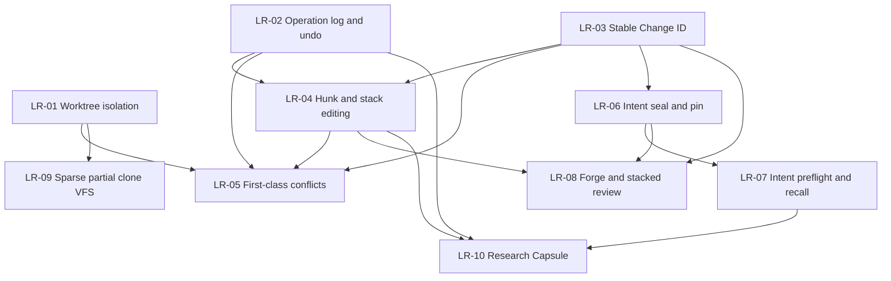

# Libra 长期功能规划

## 文档职责与维护协议

本文是 Libra 不绑定具体发布日期和版本号的长期能力组合路线图。它回答“哪些能力值得长期投资、为什么、依赖什么、何时具备进入日期计划的条件”，不是 release 承诺、owner 清单或逐项实施任务表。具体设计、迁移、拆分、发布和回滚只进入按日期计划或后续 RFC/ADR。

本文从真实开发者工作流出发，持续审计以下版本管理与相邻项目：

- Sapling：Smartlog、提交栈编辑、mutation lineage、undo/redo、EdenFS。
- Jujutsu：operation log、稳定 Change ID、一等冲突、自动 descendant rebase、并发 operation DAG。
- GitButler：并行 branch workspace、hunk assignment、图形化历史编辑、operation snapshots、Forge 集成。
- Grit：Rust Git 引擎、上游 Git 测试套件驱动的兼容性治理。
- Lore：大型二进制、dirty-set、sparse/virtual clone、shared store、dependency hydration、FastCDC。
- Entire：外部 Agent session/checkpoint、commit linkage、rewind/resume、多 Agent review。
- Mainline：sealed intent、commit pin、preflight、intent-first review、coverage/gaps。
- research-git：Feature Capsule、实验谱系、recall/compose、compare/ablation/provenance。
- git-sync：ref/object 复制、plan/policy、pack relay、仓库格式迁移。
- Grok Build：可移植 Agent 定义、ACP/headless/PTY、hooks，以及 hermetic/fault-injection 测试基础设施。

`agenta-ai/agenta` 的版本能力面向 prompt、workflow、evaluator、testset 和 environment 等领域对象，Grok Build 的主要事实模型则是 coding Agent runtime 与交互/测试基础设施；二者都不是源码版本控制系统，因此只作为相邻领域参考，不作为 Libra VCS 功能对标基线。

状态定义如下：

| 状态 | 含义 |
|---|---|
| 候选 | 有问题线索，但 Libra 缺口、架构适配或证据尚不足 |
| 已验证 | 已同时核对竞品证据与 Libra 当前源码/测试，确认问题和可执行缺口真实存在 |
| 已排期 | 已有按日期计划覆盖该 LR 的明确范围，并从本文链接 |
| 实施中 | 日期计划已有已合入和未完成切片，长期完成判据仍未全部满足 |
| 已实现 | 当前可发布版本中的代码、测试、用户/兼容文档共同证明完成判据已满足 |
| 已替代 | 原问题仍有效，但由另一 LR 或更合适的机制承接 |
| 不采纳 | 经审计确认不适合 Libra，保留编号与理由 |

只有当前 checkout 的代码、测试、兼容性与用户文档，以及可发布版本证据共同成立时，LR 才能标记“已实现”。日期计划写完、竞品已有、存在 schema 或文档声明都不构成实现证明。LR 编号一经引用不重编号；详细章节不承担排序，唯一排序入口是“长期功能总览”。

## 本次竞品审计快照

审计时间：**2026-07-20**。发现范围严格限定为 `/Volumes/Data/competition/*/*`；未扫描内部嵌套仓库、vendor 或 submodule。本轮发现 14 个直接仓库；表中 revision 是实际审计 checkout。`blocked-*` 只表示本地 revision 可读，**不**表示已更新到远端最新版本。

| 竞品 | 类型 | 分支 | 审计 revision | 更新结果 | 最后审计 | 证据入口 |
|---|---|---|---|---|---|---|
| `agenta-ai/agenta` | Libra | `main` | `650d4ed` | `blocked-pull-timeout`；拉取无诊断挂起后终止，本地 revision 不是“最新”声明 | 2026-07-20 | `README.md`、`docs/`、agent session/HITL/runner 源码与测试 |
| `cursor/agent-trace` | Git | `main` | `2754f07` | 已是最新 | 2026-07-20 | `README.md`、`schemas.ts`、`reference/` |
| `entireio/cli-checkpoints` | Libra | `entire/checkpoints/v1` | `620170f` | `blocked-status-timeout`；无法重新证明干净，未运行 pull，本地 revision 不是“最新”声明 | 2026-07-20 | checkpoint object tree |
| `entireio/cli` | Libra | `main` | `c6fc04f` | fast-forward：`df765ab` → `c6fc04f` | 2026-07-20 | `CHANGELOG.md`、`docs/`、`api/checkpoint/`、`cmd/entire/cli/`、测试 |
| `entireio/git-sync` | Libra | `main` | `298c7f1` | 已是最新 | 2026-07-20 | `README.md`、`docs/`、`client.go`、`internal/` |
| `epicgames/lore` | Git | `main` | `4c523df` | fast-forward：`370536a` → `4c523df` | 2026-07-20 | `docs/`、`lore-revision/src/`、`lore-revision/tests/` |
| `facebook/sapling` | Git | `main` | `20e74055285` | fast-forward：`16befcd5849` → `20e74055285` | 2026-07-20 | `eden/mononoke/derived_data/`、`servers/slapi/`、`tests/integration/edenapi/` |
| `GitButler/gitbutler` | Git | `master` | `9f96a23e82` | fast-forward：`e1f599d2f4` → `9f96a23e82` | 2026-07-20 | `crates/but-workspace/src/{worktrees.rs,branch/move_branch.rs}`、`crates/but/src/id/mod.rs`、`crates/but-api/tests/api/branch_move.rs` |
| `GitButler/grit` | Git | `main` | `dfb079967` | 已是最新 | 2026-07-20 | `TESTING.md`、`data/tests/`、`scripts/run-tests.sh`、`docs/progress/` |
| `graphwisdom/perstate` | Git | `master` | `3fa6eec` | fast-forward：`db3cf36` → `3fa6eec`；本轮首次纳入 | 2026-07-20 | `README.md`、`scripts/perstate-{prepare,commit,prune}.sh` |
| `jj-vcs/jj` | Git | `main` | `fd3fdb090` | fast-forward：`3efc18b54` → `fd3fdb090` | 2026-07-20 | `lib/src/{repo.rs,transaction.rs,converge.rs}`、`lib/tests/{test_view.rs,test_converge.rs}` |
| `mainline/mainline` | Git | `main` | `6025c45` | 已是最新 | 2026-07-20 | `README.md`、`docs/specs/`、`internal/engine/`、测试 |
| `StepzeroLab/research-git` | Libra | `main` | `dddcacd` | fast-forward：`76f45b5` → `dddcacd` | 2026-07-20 | `README.md`、`src/rgit/`、`tests/`、v2/v3 设计文档 |
| `xai-org/grok-build` | Git | `main` | `ba76b0a` | fast-forward：`c68e39f` → `ba76b0a` | 2026-07-20 | `README.md`、`crates/codegen/xai-grok-agent/README.md`、`xai-grok-test-support/`、`xai-grok-hooks/`、`xai-grok-pager-pty-harness/` |

最近审计记录最多保留 12 次；超过上限后把更早记录压缩为 revision 集合与优先级结论，不保留逐仓 pull 日志。

| 审计日期 | 仓库数 | 更新摘要 | 路线图结论 |
|---|---:|---|---|
| 2026-07-20 | 14 | 8 个 fast-forward，4 个已是最新，`agenta` pull timeout、`cli-checkpoints` status timeout 后安全跳过；首次纳入 Perstate | 无优先级变化；LR-01 的 sequencer 隔离缺口按当前源码收窄 |
| 2026-07-17 | 13 | GitButler、Sapling、Jujutsu 快进；其余已是最新；首次纳入 Grok Build | 无优先级变化 |
| 2026-07-16 | 12 | 10 个快进/已最新，2 个 `blocked-dirty` | 无优先级变化 |

**本次结论：无长期优先级变化。** GitButler `9f96a23e82` 新增 active/archived worktree projection，并把 Change ID 继续推进到 status/JSON/命令主身份；其 branch-move 测试仍严格区分 dry-run preview 与 materialize 后的 order/HEAD 持久化。这强化 LR-01/LR-03/LR-04 的已有顺序，而非要求复制其 UI。Jujutsu `fd3fdb090` 新增 converge 与 Git SHA-256 初始化/clone 覆盖；Libra 已具备 SHA-256 基础，converge 也未替代 LR-02/LR-05 所需的可恢复 operation/conflict 模型。Entire CLI `c6fc04f` 将新 checkpoint setup 默认改为 git-refs，并以 `0600` 文件而非 argv 注入 API helper，强化了“checkpoint/外部 Agent 连接必须保留 provenance 与秘密边界”的既有判断，但不形成 capsule 或 Forge 新 LR。Lore 的 presigned URL 限制到 service account 只强化 SB-02 的 fail-closed 发布边界。Perstate 的 branch-as-identity/worktree 脚本可作为 LR-01 场景样本，却有自动 pull/push 与 shell 管理假设，不适合作为 Libra SQLite/AgentRuntime 的事实模型。Grok Build 本轮同步未改变 SB-04 的统一资源/故障注入缺口；其 hook fail-open 默认仍不适合作为 Libra 安全边界。

## 规划原则

以下原则适用于 LR-01 至 LR-10：

1. **开发者价值优先于命令数量。** 优先解决并行开发、数据丢失、历史重写、恢复、评审和上下文复用问题，不以补齐 Git 长尾 flag 数量衡量进展。
2. **Libra-native，不复制竞品实现。** 复用 Libra 的 Git 对象和 pack 兼容、SQLite 可变状态、稳定错误码、结构化输出、对象存储、AgentRuntime、sandbox 和 cloud 能力。
3. **Git 互操作仍是底线。** 新的 change、conflict、intent、research 等元数据可以是 Libra 扩展，但普通代码提交、对象传输和远端协作不能无故破坏 Git 兼容。
4. **所有 mutation 必须可观察、可恢复。** 新的历史编辑、workspace 组合、Agent mutation 和自动修复能力必须进入 operation log，并具有 preview、原子提交和失败恢复语义。
5. **机器接口先于交互外壳。** hunk、stack、conflict、preflight、Forge 和 research 等能力先冻结可测试的 Rust API 与 `--json`/`--machine` 契约，再构建 Web/TUI 交互。
6. **逻辑身份与存储身份分离。** commit OID 仍是内容身份；change、intent、review、task 和 capsule 使用自己的稳定逻辑身份，并记录与 commit rewrite 的关系。
7. **共享数据必须经过安全发布。** 原始 prompt、tool call、transcript、ContextFrame、Evidence 和私有路径不能因为存储在 Git 对象中就自动成为团队可共享数据。
8. **先确定性、后智能化。** preflight、hunk identity、overlap、recall、capsule capture 等先提供确定性基线；LLM judgment 只作为带 provenance、可撤销的增强层。
9. **不重复建设事实源。** operation、Agent session、intent、research、Forge projection 各自可以有读模型，但不能在 CLI、Web 和 Agent adapter 中复制状态机。
10. **计划状态必须据代码更新。** 每次开始实施前重新核对当前代码、`COMPATIBILITY.md`、命令文档和测试；已有能力只补缺口，不按本文历史快照重复实现。

## 当前基础

以下事实已在 2026-07-20 以当前 Libra checkout 的源码、测试与兼容文档复核；历史计划不作为实现证据：

| 基础能力 | 当前事实 | 长期规划中的用途 |
|---|---|---|
| Git 对象、index、pack、wire protocol | Git/SHA-1/SHA-256 兼容基础已存在 | 所有代码历史和远端互操作 |
| SQLite refs、HEAD、reflog 与 sequencer/advisory state | 可变状态可事务化存储；新 migration `2026071901_sequencer_worktree_scope` 已为 sequencer/advisory 表加入 `worktree_id`，但 operation snapshot 和 conflict 模型仍未统一 | worktree 隔离、operation restore、conflict 和 rewrite |
| `libra op log/show/restore` | operation graph 已公开；生产 mutation 接入目前仅 branch create/reset 与 `op restore`，snapshot 只含 HEAD/refs | LR-02 的基础 |
| linked worktree 新布局 | `worktree.rs`、`WorktreeScope` 与 sequencer migration 已提供 private HEAD/index/HEAD reflog 及 worktree-scoped sequencer/advisory 记录；仍须逐命令核验 pseudo-ref、Agent lease、崩溃恢复和旧布局迁移 | LR-01 的基础；剩余 mutable-state 边界与并行运行仍需完成 |
| merge/rebase/cherry-pick/revert/rerere | Git-compatible conflict-stop、index stages、status/diff/restore 与 whole-file rerere 已存在 | LR-05 的兼容入口；一等 conflict object/modeless 模型仍缺失 |
| Agent session/checkpoint/review/investigate | 外部 Agent capture、只读 review、redaction、artifact objectization 已存在 | LR-06、LR-07、LR-10 的证据源 |
| `--json`/`--machine` 和稳定 `LBR-*` | Agent 可驱动的 CLI 基础已存在 | 十项能力的公共机器契约 |
| tiered storage、cloud、alternates、deps、hydrate | 大仓库和跨机器对象读取基础已存在 | LR-09 的基础 |
| AI history、IntentSpec、Decision、projection | 本地 AI 工作流对象已存在 | LR-06、LR-07 的私有源 |
| `diff --json` hunk、semantic extractor、skills、AgentRuntime | 已有只读 hunk range/lines、Rust symbol 抽取和受控 Agent 执行基础；无稳定 hunk identity/ownership/mutation | LR-04、LR-07、LR-10 |

## 长期功能总览

| ID | 能力 | 优先级 | 状态 | 当前判断 | 主要竞品证据 | 已关联日期计划 | 最近验证 |
|---|---|---:|---|---|---|---|---|
| UP-01 | 自动升级签名发布链（officially signed auto-upgrade） | P0 | 实施中（**下一个执行任务**） | 客户端子系统 code-complete 但构造性 inert（`PRODUCTION_TRUSTED_KEYS` 为空）；剩余 release-key ceremony、§A.9 发布/签名 job、§A.4 install.sh 验签与官方 marker | —（横切 release safety，非竞品对标项；规格见本文 UP-01 节） | 原 [`plan-20260714.md`](plan-20260714.md) Part A（2026-07-22 已迁移至本文） | 2026-07-22 |
| LR-01 | 完整多工作区隔离与并行 Agent 工作区 | P0 | 已验证 | private HEAD/index/reflog 与 sequencer/advisory scope 已在源码/migration 中；pseudo-ref、Agent lease、跨工作区故障恢复与 parallel lanes 未完成 | GitButler `9f96a23e82` `crates/but-workspace/src/worktrees.rs`；Lore `4c523df` `lore-revision/src/state.rs` | 无；`plan-20260708.md` 仅覆盖相邻 Git compatibility | 2026-07-20 |
| LR-02 | 全命令 Operation Log、完整快照与 Undo/Redo | P0 | 已验证 | `op log/show/restore` 存在，但仅少量 mutation 接入且 snapshot 不含 index/worktree/sequencer | Jujutsu `fd3fdb090` `lib/src/{repo.rs,transaction.rs,converge.rs}`；GitButler `9f96a23e82` branch dry-run/oplog | 无 | 2026-07-20 |
| LR-03 | 稳定 Change ID 与历史重写谱系 | P0 | 已验证 | Libra 无 stable change identity 或持久 lineage；review/intent/Forge 仍依赖 commit/session 身份 | GitButler `9f96a23e82` `crates/but/src/id/mod.rs`、legacy status/JSON；Jujutsu evolution predecessor tests | 无 | 2026-07-20 |
| LR-04 | 非交互 Hunk API、Hunk 归属与 Stack 编辑 | P0 | 已验证 | `diff --json` 可读 hunks；稳定 ID、assignment、hunk mutation 与 stack rewrite 缺失 | GitButler `9f96a23e82` `crates/but-workspace/src/branch/move_branch.rs`、branch-move tests；Sapling `20e74055285` `eden/scm/lib/linelog/` | 无；`plan-20260708.md` 明确保留 D15 延后 | 2026-07-20 |
| LR-05 | 一等冲突对象与 Modeless Sequencer | P1 | 已验证 | Git-compatible conflict 基础较完整；versioned conflict object、record-conflicts 和 descendant rebase 缺失 | Jujutsu `fd3fdb090` operation/view/converge tests；Sapling `20e74055285` linelog/stacks | 无 | 2026-07-20 |
| LR-06 | Intent Seal、Intent-Commit Pin 与安全团队发布 | P1 | 已验证 | 本地 Intent/Decision/checkpoint 已有；seal、stable pin 与白名单团队 publication 缺失 | Mainline `6025c45` `internal/engine/seal.go`、`merge.go`、property tests | `plan-20260713.md` 覆盖 capture/coverage 基础，不覆盖 seal/publication | 2026-07-20 |
| LR-07 | 开工前意图检索与语义冲突 Preflight | P1 | 已验证 | skill/session/context 基础存在；团队 intent projection、确定性 overlap receipt 与 pre-edit gate 缺失 | Mainline `6025c45` `internal/engine/preflight.go`、`context_retrieval.go`、tests | `plan-20260713.md` 覆盖 transcript import/coverage；`plan-20260715.md` 覆盖 Code runtime/UI，均非本 LR 完成计划 | 2026-07-20 |
| LR-08 | Forge/PR/CI 集成与 Stacked Review | P1 | 已验证 | remote/auth/open/local Agent review 已有；Forge trait、PR/CI 状态与 stacked mapping 缺失 | GitButler `9f96a23e82` `crates/but-api/src/legacy/forge.rs`、capability gates、workspace projection | 无 | 2026-07-20 |
| LR-09 | Materializing Sparse Checkout、Partial Clone 与 VFS Hydration | P2 | 已验证 | sparse-view、explicit hydrate、alternates/tiered storage 已有；materialization、promisor 和 transparent VFS 缺失 | Lore `4c523df` `lore-revision/src/projfs/`、parallel state tests；Sapling `20e74055285` `eden/fs/` | 无；`plan-20260708.md` 保留 D10/D18 延后 | 2026-07-20 |
| LR-10 | Feature/Research Capsule 与实验谱系 | P2 | 已验证 | Agent artifacts/semantic extraction 可复用；capsule lifecycle、run lineage、compare/ablation 缺失 | research-git `dddcacd` `src/rgit/{curation,runner,recall,provenance}.py`、`tests/test_e2e.py`；Entire CLI `c6fc04f` checkpoint git-refs | 无；`plan-20260713.md` 仅提供 capture source，非 capsule 实施 | 2026-07-20 |

## 工程安全基线

以下项目不新增 LR 产品能力编号，而是 LR-01 至 LR-10 进入实施和发布前必须持续满足的工程门禁。它们来自对当前生产错误路径、AI 工具边界、数据库迁移和测试隔离的代码审计。优先级表示修复紧迫度；完成状态必须由代码、回归测试和故障注入证明，不能仅以文档或人工约定关闭。

| ID | 修复主题 | 优先级 | 当前判断 | 阻断范围 |
|---|---|---:|---|---|
| SB-01 | 消除生产路径可触发 panic | P1 | Git pkt-line 网络输入、数据库打开和损坏 HEAD 等路径仍可 panic | 网络协议、仓库打开、所有 CLI 可靠性 |
| SB-02 | 统一 AI Tool、MCP 与 sandbox 信任边界 | P1 | 已有较强输入防护，但认证、授权、秘密隔离和 mutation 声明仍有缺口 | `libra code`、MCP、AgentRuntime、外部 Agent |
| SB-03 | D1 schema 迁移原子性与单一事实源 | P1 | SQLite runner 基本健全；CLI D1 逐语句迁移可留下半迁移 schema | publish、cloud、Worker 部署和数据完整性 |
| SB-04 | 测试进程共享状态与资源生命周期隔离 | P1/P2 | 主 harness 隔离良好，但环境变量、固定临时路径、连接缓存和子进程生命周期仍不统一 | CI 稳定性、并行测试和回归可信度 |

### SB-01：消除生产路径可触发 panic

#### 当前风险

- `git_protocol::read_pkt_line` 对不足四字节、非 UTF-8、非十六进制、声明长度小于四字节或超过剩余响应的远端 pkt-line 可能 panic；该 helper 被 fetch/clone/ls-remote/push 的网络响应路径直接调用。
- `get_db_conn_instance` 在数据库缺失、打开失败或 migration 失败时 panic，而不是向 CLI 返回带上下文的可操作错误。
- `Head::current_with_conn`、`remote_current_with_conn` 等便利入口在持久化 HEAD 行损坏时 `expect`；虽然已有 Result 版本，但生产调用尚未全部迁移。
- `ToolRegistry::new` 在当前目录无法解析时 panic；所有生产初始化入口必须使用 fallible 构造并补充用户可理解的上下文。

#### 修复要求

- 将 pkt-line 解码改为完全 fallible 的边界 parser，返回明确的 protocol error，不允许网络字节触发 `panic!`、`unwrap()`、`expect()`、整数下溢或越界切片。
- 在读取 payload 前依次验证 header 长度、ASCII hex、Git 特殊长度、`length >= 4` 和剩余字节数；错误信息包含协议阶段和远端类型，但不得回显无界响应内容。
- 将数据库、HEAD、ToolRegistry 及其他生产便利 API 的 panic 调用迁移到 `Result`，通过 `?` 和 `anyhow::Context`/领域错误提供资源路径、失败动作和修复建议。
- 建立生产代码 panic 守卫：新增或修改的 `panic!`、`unwrap()`、`expect()` 必须被 CI 拒绝，测试代码和带 `// INVARIANT:` 的真正不可失败逻辑除外。
- 协议错误必须映射到稳定 `LBR-NET-*`/`LBR-REPO-*`/`LBR-IO-*` 错误，并同步 `docs/error-codes.md` 和相关命令文档。

#### 完成判据

- malformed pkt-line 测试覆盖短 header、非法 UTF-8、非法 hex、`0001` 至 `0003`、声明长度超过 buffer、截断 payload 和连续 malformed frame；HTTP、Git、SSH 和 receive-pack 调用均返回错误而不终止进程。
- 数据库缺失、权限拒绝、migration 失败、损坏 local/remote HEAD 和失效 CWD 均产生稳定、可操作的 CLI 错误。
- 对网络 parser 运行 fuzz/property test，任意输入不 panic、不无界分配、不死循环。
- 全仓生产目标通过 panic 守卫，遗留例外有最小范围和可验证 invariant。

### SB-02：统一 AI Tool、MCP 与 Sandbox 信任边界

#### 当前风险

- AI tool registry 已有 typed payload、tool allowlist、workspace path containment、命令分类、approval、sandbox、VCS argv allowlist 和网络限制，因此“所有模型输入都被直接信任”的泛化判断不成立。
- MCP HTTP listener 可绑定非 loopback 地址，但当前 transport 没有强制认证；`LibraMcpServer` 默认不安装 authorizer，缺少 authorizer 时采用 allow-all。
- `update_intent_impl` 可写入持久化 IntentEvent，却没有经过统一 MCP authorization gate。
- MCP/tool 参数可以携带 actor 信息；授权 principal 不得由不可信调用方自报，尤其不得允许外部调用声明 `system` 身份。
- Linux shell 子进程默认继承 Libra 环境，允许的只读命令可读取 `/proc/self/environ`，tool output 随后可能发送给模型 provider，形成 API key、cloud token 和其他秘密的泄露路径。
- `ApplyPatchHandler` 未声明 `is_mutating = true`；generic hardening 记录 `approval_required`，但 registry 不负责实际执行 approval。
- `apply_patch` 在预先 canonicalize 后使用普通路径 I/O，存在验证与使用之间的 symlink-swap TOCTOU 窗口。

#### 修复要求

- MCP 默认只允许 loopback；绑定非 loopback 必须显式启用远程模式并配置认证凭据。缺少、无效或过期凭据时 fail closed，不启动可远程访问的服务。
- 从认证 transport/session 派生 principal，禁止 tool 参数决定授权身份；记录 actor 与授权 principal 分离，外部调用不能声明或委托 `system`，除非经过独立、可审计的 delegation policy。
- 生产必须安装 fail-closed authorizer；所有 resource、`tools/list` 和 `tools/call` 路径统一授权，尤其覆盖 `update_intent`、所有 `create_*` 和 VCS bridge，不保留单方法旁路。
- Shell 子进程默认 `env_clear()`，只注入最小 PATH、locale 和任务明确需要的变量；provider key、D1/R2/S3 credential、control token、vault secret 等不得进入模型控制的子进程。
- 显式拒绝读取 `/proc/*/environ`、`/proc/*/cmdline` 等进程秘密入口，并在 tool output 进入 model history 前执行有界 secret detection/redaction；audit redaction 不能代替 model-bound output redaction。
- 所有 handler 必须显式声明 mutability、network 和 approval strategy；默认值采取保守策略。Registry 必须执行 `approval_required`，不能只记录审计字段后继续调用 handler。
- `ApplyPatchHandler` 必须标记为 mutating；文件 mutation 使用 descriptor-relative/no-follow 操作或平台等价能力，保证每一步都位于已打开的 workspace root 下，不能只依赖操作前 canonicalization。
- 对安全敏感 tool 在 dispatch 前执行可执行的 schema validation；未知字段、兼容修复和 alias normalization 的顺序必须唯一且有测试。
- workspace 内常见 credential 文件的读取策略必须明确：至少支持项目级 deny pattern、显式 confirmation 或发送模型前 redaction，并在用户文档中说明哪些内容可能传给 provider。

#### 完成判据

- 非 loopback MCP 在无 credential、错误 credential、过期 credential 和无 authorizer 时均无法启动或无法访问任何资源；loopback 默认体验保持可用且有明确安全提示。
- deny-all 和角色 authorizer 的集成测试覆盖每一个 MCP resource/tool；`update_intent` 不再能绕过策略。
- 外部 caller 和模型提供 `actor_kind=system` 时被拒绝，存储 provenance 仍能记录经验证的 logical actor。
- Linux/macOS sandbox 测试注入 sentinel secret，执行环境读取、proc 读取、shell、read-file 和异常输出场景后，sentinel 不出现在 child-visible env、ToolOutput、model history 或普通日志中。
- Observer/read-only principal 无法 dispatch `apply_patch` 或任何 mutation；需要 approval 的调用在没有明确批准时不执行。
- 并发 symlink-swap 测试不能让 add/update/delete/move 越过 workspace root。
- MCP 认证、授权、秘密处理和 remote bind 行为同步到 `libra code` 文档、配置说明和威胁模型。

### SB-03：D1 Schema 迁移原子性与单一事实源

#### 当前风险

- SQLite `MigrationRunner` 已具备严格版本注册、每 migration 事务、DDL 与版本记录原子提交以及并发竞争处理；后续修改不得退化这些保证。
- `D1Client::ensure_publish_schema` 当前将每个 SQL migration 拆分为 statement，并通过 REST 单独执行。任一中间请求失败都会留下部分 schema。
- `0003_publish_max_preview_trigger_replace.sql` 先 DROP 再 CREATE trigger；两个请求之间失败会使在线数据库暂时失去约束。`0002` 的多组约束 trigger 也可能只应用一部分。
- Worker deploy 使用 Wrangler migration tracking，而 CLI publish sync 又隐式执行 include-str SQL，形成两个迁移执行器；CLI 路径没有等价的 version ledger、checksum 或 transaction contract。

#### 修复要求

- 为 publish D1 schema 选择并记录单一生产迁移事实源。优先由 Wrangler/D1 migrations 负责 schema mutation，CLI 只执行只读 schema/version preflight；不得长期维护两套语义不同的生产 runner。
- 如果 CLI 必须保留 migration 能力，则必须提供 migration ledger、版本顺序、内容 checksum、in-progress/failed 状态、并发 ownership 和可恢复重试语义。
- 一个逻辑 migration 要么原子提交，要么设计为任何 statement 前缀都保持业务安全；不能依赖“下次运行通常会自愈”作为在线约束缺失的恢复策略。
- DROP/CREATE replacement 必须通过 D1 支持的原子机制执行，或采用先创建新对象、切换、再删除旧对象的兼容序列；失败期间 Worker 仍须保持旧约束有效。
- Worker 在服务依赖新 schema 的请求前检查兼容版本；发现 schema 落后、迁移中或 checksum 不匹配时 fail closed，并返回可诊断错误。
- SQL source、Worker mirror、Rust include、Wrangler registry 和文档之间继续保持自动 drift 检查；新增 migration 不允许只更新其中一处。
- 为 schema 变更定义 rollout 和 rollback：先部署兼容读写代码还是先迁移、旧 Worker 与新 schema 的兼容窗口、失败后的恢复命令和监控信号必须明确。

#### 完成判据

- 故障注入在每一条 D1 statement 前后中断请求，数据库最终保持旧 schema 可用或完整新 schema，不存在约束永久缺失、版本误报已完成或 Worker 按错误 shape 读写。
- 两个 deploy/sync 进程并发运行时，每个 migration 只被一个 owner 提交，其他调用安全等待、跳过或重试。
- 已应用 migration 被修改时 checksum drift 被明确拒绝，不通过 `IF NOT EXISTS` 静默接受不同 schema。
- publish sync 不再无记录地修改生产 schema；schema preflight 错误包含当前版本、期望版本和运维修复命令。
- SQLite migration transaction、并发和 rollback 测试继续通过，并增加防退化测试，防止 D1 修复反向削弱本地 migration runner。

### SB-04：测试进程共享状态与资源生命周期隔离

#### 当前风险

- 主 command harness 已通过 `env_clear`、独立 HOME/XDG/config DB、固定 locale 和显式 CWD 提供良好子进程隔离；`ChangeDirGuard` 也对使用该 helper 的 CWD mutation 加锁。
- 部分测试直接删除 identity/config 环境变量且不恢复原值；部分 `ScopedEnvVar` 使用没有统一环境锁。Rust 2024 的 `set_var`/`remove_var` 安全前提不能由注释或零散 `#[serial]` 保证。
- `#[serial]`、不同命名的 serial group、未标记测试和独立 Cargo test 进程之间不是同一个锁域，无法替代共享状态 API 自身的同步与恢复。
- 部分测试直接构造 Libra 子进程，只替换 HOME 或完全继承 ambient env，可能读取真实 config、identity、telemetry 和 credential。
- 全局数据库连接 cache 会保留临时仓库连接；fixture teardown 没有统一关闭连接并清理路径相关 cache。
- 固定 `/tmp/*.db` 名称可在 IDE、CI shard、不同 worktree 或两个 Cargo 进程并行时互相删除和覆盖。
- 个别子进程、mock server 和端口探测采用手工 cleanup 或 bind-drop-connect，测试 panic 后可能泄漏 child/thread/port，或产生 TOCTOU 端口竞争。
- Grok Build `ba76b0a` 的 `xai-grok-test-support` 把 hermetic process spawn、`kill_on_drop`、协议帧级 drop/delay/duplicate/sever fault injection 和 PTY resume 场景做成共享设施；Libra 已在 review launcher、provider mocks、Code PTY harness 和若干 `env_clear` fixture 中分别具备部分能力，但尚未形成同等统一的资源/故障注入层。该证据强化本 SB，不新增产品 LR。

#### 修复要求

- 建立仓库唯一的 process-environment guard：获取全局 mutex、保存每个 key 的精确旧值、panic-safe Drop 恢复；所有不可避免的 in-process env 读写测试必须通过该 API。
- 优先停止修改父进程环境。测试子进程通过统一 command builder 设置自己的最小环境；禁止在测试中散落直接 `Command::new(CARGO_BIN_EXE_libra)`。
- 统一 command builder 必须 `env_clear`，显式设置 HOME、USERPROFILE、XDG、global/system config DB、PATH、locale 和 test mode，额外变量逐项 opt in。
- 用 fixture owner 管理 CWD、临时仓库、数据库连接、对象/config cache、child process、server thread 和 listener；Drop/async teardown 必须 kill/wait、shutdown/join、close/evict 后再删除目录。
- 所有数据库测试使用唯一 `TempDir` 父目录，不得创建或删除固定全局临时文件名。
- Server 优先绑定端口 0 并从保留 listener 获取地址；不得先探测端口、释放后再启动真实 server。必须使用显式 shutdown channel 和 RAII child guard。
- 进程级 atomic flag、static cache、telemetry 和 runtime policy 的测试必须通过同一类全局状态 guard，或重构为依赖注入的 per-test 配置。
- 增加自动卫生守卫，检查未经批准的 `set_var`、`remove_var`、`set_current_dir`、固定 `/tmp` 路径、原始 Libra subprocess 和 probe-then-release 端口分配。

#### 完成判据

- 在调用 shell 预设 identity、config、OTel、provider 和 cloud 变量时运行完整测试，执行前后父进程环境值完全一致。
- 默认线程数、高并发线程数、随机测试顺序、两个并行 Cargo 进程和重复运行下无共享状态 flake；CI 至少包含一种并发/重复压力配置。
- 每个临时仓库结束后，对应 SQLite pool、文件句柄、cache entry、child process、server thread 和 listener 均被释放。
- Windows/macOS/Linux 支持平台上临时目录可在测试结束时删除，不依赖进程退出释放句柄。
- 测试 panic 和 timeout 注入后没有遗留 child/server，后续同套测试可立即复跑。
- 新测试默认使用统一 fixture/harness；绕过必须有局部注释、审查理由和针对性隔离证明。

---

## UP-01：自动升级签名发布链（原 plan-20260714 Part A；下一个执行任务）

> **迁移与例外说明（2026-07-22）**：本节按用户决定从 [`plan-20260714.md`](plan-20260714.md) Part A **整体迁移**至本文，并登记为**下一个执行的任务**；规格正文逐字保留（仅把小节编号统一为 A.1–A.12，与代码、CI、CHANGELOG 中既有 `plan-20260714 §A.x` 历史引用同形）。本文档「具体设计只进日期计划」的惯例对本节记一次显式例外，直至任务完成或另立日期计划承接。评审历史（第 1–17 轮，最终 PASS）见下文 A.12 与 plan-20260714「最终复核结论」的历史记录。

### 当前实现状态（2026-07-22，v0.19.42 源码核实）

**已实现（客户端子系统，code-complete 但构造性 inert）**：§A.2–A.3、§A.5–A.8、§A.10–A.11 已于 v0.18.94–v0.19.2 分片落地——`internal::upgrade::{settings,home,manifest,trusted_keys,platform,http,state,lock,marker,txn,probe,flow,orchestrator}`、`src/command/upgrade.rs`、`cli.rs` 启动接线（`__upgrade-probe` 前置识别、txn 恢复门、`upgrade.mode=auto` 检查）、保留命名空间 config router（`LBR-UPGRADE-001`）、`upgrade_auto_test`/`upgrade_publish_contract_test`（`test-upgrade` feature 门控，release workflow 明确拒绝）、`docs/auto-upgrade.md`。`PRODUCTION_TRUSTED_KEYS` 为空（`src/internal/upgrade/trusted_keys.rs:39`），因此整个子系统在任何 `upgrade.mode` 下都不联网、不安装。

**剩余执行范围（即本任务要做的「签名发布链」）**：

1. **Release-key ceremony**：在 protected-environment/KMS 中生成官方 Ed25519 签名密钥，把公钥/generation 填入 `PRODUCTION_TRUSTED_KEYS` 与 `install.sh` 预置公钥（§A.6 信任表/轮换水位约束）。
2. **§A.9 发布侧**：per-tag conditional publish、stable manifest 签名 job（私钥隔离，遵 §A.6「签名 job 隔离」）、每周 renew job、紧急 pause/revocation protected job——当前 `release.yml` 无任何签名/manifest job。
3. **§A.4 `install.sh`**：Ed25519 验签、official marker 写入、`__upgrade-bootstrap-install` 严格入口调用——当前 `install.sh` 仅有 sha256 checksum，不建立官方来源。
4. **端到端启用与验收**：真实 endpoint 首发签名 manifest、升级/回滚/撤回演练、README/CHANGELOG/config 双语文档同步（§A.11 文档面）。

以下 A.1–A.12 为迁移的完整规格正文。

### A.1. 目标与结论

为官方安装提供可选自动升级（`upgrade.mode=auto`）。在本计划限定的平台、信任引导和回滚约束下**可行**；未满足这些前置条件的安装只能使用 `manual`/`off`，不得静默升级为“官方安装”。

**首期支持矩阵**：Linux x86_64、Linux aarch64、macOS aarch64。Windows x86_64 继续发布但首期自动升级明确返回 `UnsupportedPlatform` 并保持原二进制；Windows 需独立 helper/`ReplaceFile` 设计通过后才能启用。macOS x86_64 当前不在 release matrix，安装器和 manifest 均不得宣称支持。

### A.2. 安装目录与官方判定

```text
exe = canonical(current_exe())           // 正常已安装模式必须名为 libra
INSTALL_DIR = parent(exe)
MARKER = INSTALL_DIR/.libra-official-install.json
```

专用入口有互斥模式：`version/pre-install/bootstrap` 只允许从 `INSTALL_DIR/.dl-<random>` 启动，验证父目录 fd、candidate inode 与父进程 fd 相同、no-follow regular、名称匹配 `.dl-[A-Za-z0-9]{16,}`；`post-install` 只允许 basename=`libra`，并验证 current_exe inode 与锁内固定 target fd 相同。任一模式错配均拒绝。普通命令路径仍只允许已安装目标名 `libra`。

官方：MARKER 有效、`marker.version`/`marker.sha256` 匹配 TARGET、`marker.install_source=official_signed_manifest`，且 `INSTALL_DIR` 通过 §A.5 所有权/权限/no-follow 校验。仅“文件位于默认目录”或“当前二进制给自己计算 hash”均**不能**建立官方来源。

存量 bootstrap 仅允许默认 `~/.libra/bin/libra`，且必须重新获取并用**安装器内预置公钥**验证与当前 `(version, platform, sha256, size)` 完全一致的签名 manifest；验证工具不可用、manifest 过期或当前版本已不在受信发布记录中时保持无 marker、warning 一次并视为 `off`。`LIBRA_BASE_URL`、测试 endpoint、手工复制和第三方包管理器安装均不得写官方 marker；包管理器若需接入，必须由各自签名/receipt 适配器单独定义。

### A.3. 配置 `upgrade.mode`

文件：`{LIBRA_HOME}/upgrade/settings.json`。新增 Rust 侧唯一 `resolve_libra_home()`，与 `install.sh` 的 `LIBRA_HOME`/`HOME` 规则及 `LIBRA_CONFIG_GLOBAL_DB` 测试隔离契约一致；升级配置是保留命名空间，不得同时落入 SQLite config。

| 操作 | 行为 |
|---|---|
| `set --global upgrade.mode V` | 仅接受 `auto`/`off`/`manual`（大小写不敏感）；非法值 CLI 报错；原子写 `mode` |
| `set`（无 global） | 拒绝 |
| `get --global` | 读 `mode`；缺失→`off` |
| `unset --global` | 写 `mode=off`（**保留文件**，不删除） |
| `list --global --show-origin` | `file:{path}` |

读取时 `mode` 非三枚举之一→get 报错；文件损坏→get 错；升级路径未知/损坏均视 `off` 并 warning（一次）。

所有可到达同一 key 的 config 拼写（legacy action、`--get-all`、`--get-regexp`、`--add`、类型转换、JSON）必须经过同一 reserved-namespace router：只允许上述单值操作；local/system/multivalue 操作 fail-closed。`list` 不得再从 SQLite 输出第二份 `upgrade.mode`。

### A.4. Marker

```json
{ "schema_version":1, "installed_at":"<RFC3339>", "install_source":"official_signed_manifest", "platform":"<enum>", "version":"<SemVer>", "sha256":"<64hex>", "size":123, "manifest_key_id":"<id>" }
```

`install.sh`：先用脚本内预置公钥和系统受支持的 Ed25519 verifier 验签，再把 artifact 写入 `INSTALL_DIR` 内同文件系统的唯一临时文件并验证 size/hash。已有支持新协议的 Libra 时调用其隐藏命令完成 no-follow 校验、锁、替换和 marker；**fresh install 或 legacy binary 不支持隐藏命令时**，仅在独立验签已建立候选信任后调用候选的严格入口 `__upgrade-bootstrap-install --signed-envelope-fd …`。候选必须再次用内置 trust table 验 envelope/hash，入口只允许安装自身已打开的 inode 到已验证目录，不接受任意 source/target/command；同样执行 §A.5/§A.7 的锁、fsync、backup 和 marker 协议。不能独立验签时可按现有手工安装路径完成安装，但不得生成官方 marker，也不得默认开启 auto。禁止让未通过独立签名链的下载物为自己背书。

### A.5. 锁

`libra __upgrade-lock exec --install-dir <canonical_dir> -- <cmd>`：Unix 使用 advisory file lock；校验目录绝对路径、owner 为当前 euid、非 group/world-writable（sticky 私有目录例外须单列）、目标与状态文件均为 regular file 且 no-follow。打开并持有目录 fd，后续 target/lock/marker/txn/retry 操作全部相对该 fd，防目录替换与 symlink TOCTOU。文件权限：状态 `0600`、候选/target `0755`、目录 `0700`。升级用 `try_lock`（忙=Skip）。隐藏命令跳过升级检查。Windows 首期不进入该路径。

### A.6. Manifest

**端点**：`https://download.libra.tools/libra/releases/stable/manifest-v1.json`

**信任表**（`trusted_keys.rs`）：`key_id`、`ed25519_pubkey`、`not_before`、`not_after`、`generation`，以及客户端版本编译期固定的 `MIN_TRUSTED_KEY_GENERATION`。签名数组拒绝重复 `key_id`；有效签名 generation 必须 `>= max(manifest.min_key_generation, MIN_TRUSTED_KEY_GENERATION)`，manifest 和墙钟都不能降低/提前改变水位。先做纯密码学验签，再要求签名 key 的有效区间覆盖签名 payload 的 `published_at`，且 `expires_at <= key.not_after`。轮换 overlap 通过旧客户端继续携带较低编译期 floor、新客户端发布时提高 floor 实现；不依赖本地/HTTP 时间触发 generation。

**签名 job 隔离**：私钥只能进入独立、最小权限、protected-environment/KMS 签名 job；该 job 只消费已完成构建的不可变 hash/size 元数据。所有 actions 固定 commit SHA；secret 可见后禁止下载/执行 rclone 安装器、Homebrew、Chocolatey 或其它网络脚本；build/upload matrix 永不接触任一签名私钥，轮换时也不得把两把私钥暴露给构建 job。

**URL 解析**：结构化 URL 解析后校验：scheme=https、host=download.libra.tools、port 空或 443、path 四段 `/libra/releases/v{tag}/libra-{platform}`（Unix 无后缀；Windows `.exe` 后缀为 R0 后项，首期 auto-upgrade 明确返回 `UnsupportedPlatform` 不进入下载路径）、query/fragment 为空、tag 为 release SemVer；并强制 `tag == payload.version`、URL `platform == artifact.platform`、artifact platform 唯一且覆盖精确 release matrix。所有跨字段校验在任何 anti-rollback/control/time state 写入前完成。禁重定向。

**信封**：`schema_version`、`payload`（base64）、`signatures[]`。验签字节：`b"libra-upgrade-manifest-v1\0" || payload_bytes`。

**payload**：`channel=stable`；`version`（无 prerelease/build）；`control_revision:u64`；`published_at`；`expires_at`；`min_key_generation`；`paused`；`revoked_versions[]`；`artifacts` 与 release matrix 一致的四平台 `{platform,url,sha256,size}`。每次新版本、续签、暂停/恢复或撤回变更都必须严格递增 `control_revision`。客户端只选择自身精确 platform；首期 Windows 选择后返回 unsupported，不下载。`paused=true` 禁止任何新下载/安装；目标版本在 `revoked_versions` 中时，即使 retry/cache 命中也禁止安装。

**时间**：HTTPS `Date` 先仅作本轮 provisional 值；必须满足 `published_at-300s <= https_date < expires_at`，且 envelope 完成密码学验签、key/payload/URL/size/control 全量校验后，才与 anti-rollback state **同一原子写**推进 `trusted_time_floor=max(old_floor,published_at,https_date)`。错误状态码、无效 envelope 或异常未来 Date 绝不写 state。expiry 判断用 `effective_now=max(local_wall_clock, trusted_time_floor, https_date)`；本地未来时间只会拒绝当轮，不写 floor，修正后可恢复。本地低于 floor 超 300s 时禁止 cache 安装并强制在线刷新。测试覆盖无效 envelope + 未来 Date 不毒化 state、跨重启回拨和未来墙钟恢复。

**体积**：manifest ≤1MiB；artifact `size` 必须满足 `0 < size <= 128MiB`（**在持久化 `max_seen` 之前**校验；超限拒 manifest 且不写 state）。Stable job 发布前同样校验。

**缓存/节流**：成功接受 manifest 后，以 validated HTTPS Date 持久化 `next_success_check_not_before = https_date + 15min + deterministic_jitter(0..120s)`；正常时钟下跨进程可在此冷却期直接 Skip，故成功联网时暂停/撤回的最大检查传播延迟为 17 分钟。若本地墙钟不在 `[trusted_time_floor-300s, trusted_time_floor+24h]`、冷却早于 floor 或超过 `floor+17min`，忽略冷却并联网。冷却只能跳过检查：任何 artifact 新下载、复用候选或安装，都必须在同一进程先在线接受不低于当前 control revision 的 manifest。失败 backoff 最大 1 小时并使用同样可信上界；`last_good_envelope` 仅诊断，不跨进程授权安装。

**HTTP client**：专用 reqwest client，`https_only(true)`、rustls 主机名/证书校验、`redirect::Policy::none()`、connect/header/body 总 deadline；收到 3xx 即失败，并在读 body 前复核 effective URL。测试覆盖 HTTP downgrade、非 443、query/fragment、redirect loop、TLS hostname、stalled header/body、chunked overflow 和错误 `Content-Length`。

**下载**：流式读取；若 `Content-Length` 存在且 `>size` 或 `>128MiB` 立即中止；逐块计数，超过 `size` 立即中止；结束字节数**必须等于** `size` 且 sha256 匹配。

**测试**：`test-upgrade` feature + `LIBRA_TEST=1`；release 禁用。

### A.7. 版本与 Phase

- anti-rollback/control state：持久化 `max_seen`、每平台 artifact identity、`max_control_revision`、该 revision 的 envelope digest、`trusted_time_floor`。版本 `<` 拒；同版本只允许 artifact identity 相同。control revision `<` 一律拒；`==` 仅接受 envelope digest 完全相同；`>` 才接受续签/紧急控制。该状态在 manifest 全量语义校验、平台选择、size、签名和时间策略通过后于锁内 durable 写入。测试必须覆盖“先接受撤回，再收到仍未过期的旧未撤回 envelope”。
- 下载条件：`manifest.version > installed_target_version`；候选 `--version` 必须等于 manifest.version。
- Phase A（5s manifest + 10s 下载软预算）：下载到 `${INSTALL_DIR}/.dl-*`（同文件系统；`TempGuard` RAII）→流式 sha256+精确 size→`sync_all`→chmod 0755→以候选执行专用隐藏入口 `__upgrade-probe --kind version|pre-install --expected-version …`。该入口在 argv 解析最前端识别，只执行无副作用自检，**明确绕过自动升级、txn 恢复、repo preflight、配置写入和后台任务**，不能转发任意用户命令。各 probe 有独立硬超时；子进程启用 kill-on-drop，并以进程组/job object 终止所有后代后 `wait` 回收。timeout/cancel 必须中止 body stream、回收进程并清理，禁止 detached 任务。
- Phase B：txn 显式记录 `old_target: Absent | Present { hash, marker_snapshot }`。Present 分支先 durable backup 再原子覆盖；Absent 分支不要求 backup。覆盖后执行固定目标模式的 post-probe；成功后 durable 写 `PostProbePassed`、marker/state、`Committed`。写 `Committed` 后核验 target/marker/state identity，删除 backup/candidate并 fsync目录，再删除 txn并再次 fsync；txn 必须最后删除。probe 失败按 Present 回滚、Absent 删除 new target。恢复失败保留材料并返回 FatalRecovery。

**Txn 恢复**（输出模式解析后、仓库 preflight 前、marker 检查前）：先取得升级独占锁并持有至最后 fsync。状态机为 `Prepared`、`BackupDurable`、`CandidateInstalled`、`PostProbePassed`、`RollbackIntent`、`AbortAbsentIntent`、`Committed`。probe 失败后在修改 target **之前** durable 写 intent：Absent 写 `AbortAbsentIntent` 后才删除 new target；Present 写 `RollbackIntent` 后才以 backup 原子恢复 old target。intent 恢复同时接受修改前/后 identity，幂等完成 target 修改、清理残留、fsync，最后删 txn。`CandidateInstalled` 必须重新 post-probe；`PostProbePassed` 继续提交；`Committed` 幂等提交清理。只有 identity 不匹配已声明状态时 FatalRecovery。

恢复决策表（所有存在文件先做 owner/regular/no-follow/hash 校验；其它组合 FatalRecovery）：

| txn state | old_target | 实测 identity | 动作 |
|---|---|---|---|
| Prepared | Absent | target absent + candidate=new | 删除 candidate/txn，fsync，恢复未安装 |
| Prepared | Absent | target=new + candidate absent | 说明 rename 已完成但状态未落盘；写 CandidateInstalled 后执行 post-probe |
| Prepared | Present | target=old + candidate=new + backup absent | 删除 candidate/txn，保持 old |
| Prepared | Present | target=old + candidate=new + backup=old | 补写 BackupDurable 后继续原子覆盖 |
| BackupDurable | Present | target=old + candidate=new + backup=old | 继续原子覆盖并写 CandidateInstalled |
| BackupDurable | Present | target=new + candidate absent + backup=old | 补写 CandidateInstalled 后执行 post-probe |
| CandidateInstalled | Absent/Present | target=new；Present 时 backup=old | 重新 post-probe；成功→PostProbePassed，失败→按分支删除/回滚 |
| PostProbePassed | Absent/Present | target=new；marker/state 可旧或新 | 幂等写 marker/state 后写 Committed |
| AbortAbsentIntent | Absent | target=new 或 absent；candidate 可有/无 | 若 target=new 则删除；幂等删 candidate，fsync，最后删 txn |
| RollbackIntent | Present | target=new + backup=old，或 target=old + backup 可有/无 | 若 target=new 则原子恢复 backup；核对 target=old 后清残留、fsync，最后删 txn |
| Committed | Absent/Present | target/marker/state=new | 幂等清理 backup/candidate，最后删除 txn |

### A.8. 输出

human 失败 warning；json/machine 无中途 stderr；`--exit-code-on-warning` 仅末尾单 envelope（stdout 保留命令 JSON）。

### A.9. 发布

- Per-tag：所有平台先完成构建与 hash/size 汇总，再由单一 publish job 使用 storage `If-None-Match:*` 条件创建；禁止 prerelease tag；同 tag 已存在对象逐一核对 identity，不符 fail，禁止覆盖。只有全部必需 artifact 可读且 identity 正确后才允许签 stable manifest。
- Stable job：读当前并验签；`new < current` fail；`new > current` 且双方为 release SemVer。普通新版本发布必须从当前 payload 逐字节继承 `paused`/`revoked_versions`；任何控制字段变化只能走 protected 紧急 job。新发布 `expires_at=published_at+90d`；按轮换策略签名；对象存储使用 ETag/version CAS。
- 续签（`new == current`）：除 `control_revision`、`published_at`、`expires_at`、`signatures` 外，`version`/`artifacts`/`channel`/`min_key_generation`/**`paused`/`revoked_versions` 必须逐字节不变**；时间与 revision 单调增大。普通 renew job 不得恢复/撤回紧急控制。
- 每周 renew job 执行续签分支。
- 紧急控制：独立 protected job 可只修改 `paused`/`revoked_versions` 并提升 `published_at`，仍须满足当前 key-generation 签名与 CAS。恢复发布需更高 `published_at` 且显式审计记录。客户端若已运行撤回版本，不自动降级；每次成功检查输出高优先级 warning 和升级到更高修复版本的指引。测试锁定旧 cache 不得绕过撤回。

### A.10. CLI

```rust
let output = OutputConfig::resolve_from_cli_args(&args)?;
match tokio::time::timeout(UPGRADE_BUDGET, upgrade::phase_a(&args, &output)).await {
    Ok(Ok(PhaseAOutcome::Ready(job))) => {
        match upgrade::phase_b(job, &output).await {
            Ok(PhaseBOutcome::Installed) => {}
            Ok(PhaseBOutcome::RolledBackWarning(w)) => upgrade::report_upgrade_outcome(w, &output),
            Err(PhaseBError::FatalRecovery(e)) => return Err(e),
        }
    }
    Ok(Ok(PhaseAOutcome::Skip)) => {}
    Ok(Err(e)) => upgrade::report_upgrade_outcome(e, &output),
    Err(_) => upgrade::report_upgrade_outcome(Outcome::Timeout, &output),
}
```

`FatalRecovery`、启动时 txn 损坏、回滚失败和标准 target hash 无法归类时，必须在仓库 preflight/用户命令 dispatch **之前**退出；只有已确认 target 恢复到旧 hash 的 `RolledBackWarning` 才能继续原命令。测试用 side-effect sentinel 断言 fatal 路径未执行 `commit`/`add` 等用户命令。

### A.11. 测试与文档

`upgrade_auto_test.rs`、`upgrade_publish_contract_test.rs` 使用新增 `test-upgrade` feature，并在 `Cargo.toml` 以 `required-features` 注册、`tests/INDEX.md` 和 CI 专用 job 同步；endpoint/key 注入仅在 compile-time test module 可见，生产构建即使设置 `LIBRA_TEST=1` 也不能改变 trust root 或 endpoint。release workflow 明确拒绝 `test-upgrade` feature。

README/CHANGELOG/config 中英文需说明：支持平台、第三方/手工安装默认不 auto、网络与 warning 行为、恢复/回滚位置、Windows 首期限制。

除原列表外必须包含：`upgrade_fresh_and_legacy_bootstrap_after_independent_signature`、`upgrade_fresh_absent_txn_crash_matrix`、`upgrade_present_txn_crash_matrix`、`upgrade_recovery_state_identity_matrix`、`upgrade_recovery_reprobes_candidate_installed`、`upgrade_abort_and_rollback_cleanup_crash_matrix`、`upgrade_committed_cleanup_crash_matrix`、`upgrade_manifest_url_version_platform_binding_before_state`、`upgrade_same_version_artifact_identity_immutable`、`upgrade_compiled_generation_floor_rejects_old_key`、`upgrade_invalid_envelope_future_date_does_not_poison_time`、`upgrade_future_local_clock_cache_then_corrected_refreshes`、`upgrade_symlink_and_directory_swap_rejected`、`upgrade_concurrent_recovery_single_writer`、`upgrade_fatal_recovery_prevents_user_command_dispatch`、`upgrade_probe_bypasses_parent_held_recovery_lock`、`upgrade_hung_probe_kills_process_group_and_rolls_back`、`upgrade_revocation_replay_rejected_by_control_revision`、`upgrade_new_release_and_renew_preserve_pause_revocations`、`upgrade_clock_rollback_after_restart_blocks_install`、`upgrade_publish_is_conditional_and_complete`、`upgrade_windows_is_explicitly_unsupported`、`upgrade_cached_envelope_revalidated`、`upgrade_redirect_and_stall_rejected`、`upgrade_release_binary_has_no_test_trust_root`。

### A.12. Codex Review Log（自动升级）

| 轮次 | 范围 | VERDICT |
|---|---|---|
| 1–15 | Part A | FAIL |
| 16 | Part A | FAIL |
| 17 | Part A | **PASS** |

## LR-01：完整多工作区隔离与并行 Agent 工作区

### 开发者问题

多个开发者、Agent 或自动化任务需要同时处理同一仓库时，每个任务必须拥有独立的工作状态。仅隔离目录但共享 sequencer、pseudo-ref 或 mutation owner，会导致一个工作区中的 merge/rebase/commit 影响另一个工作区，或使并发任务只能退回到多个独立 clone。

当前 Libra 的新 linked-worktree 布局已经具备 per-worktree HEAD、index、HEAD reflog，且 `WorktreeScope`/`2026071901_sequencer_worktree_scope` 已把 sequencer/advisory 行纳入 worktree scope；剩余限制必须按实际 mutation 面逐项验证：

- `ORIG_HEAD`、`MERGE_HEAD`、bisect/worktree refs 等 pseudo-ref/namespace 是否随每条 mutation 正确隔离，尚未形成完整可发布的跨 worktree 验证矩阵。
- merge、rebase、cherry-pick、revert、bisect 的 continue/abort/crash recovery 必须证明只读取和写入当前 `worktree_id`；不能仅以 schema migration 或单个命令通过就标记完成。
- 旧 symlink-layout worktree 仍可能共享 HEAD/index，文档和迁移体验需要收口。
- 当前工作区模型仍是“一目录一分支/提交状态”，尚不支持 GitButler 式一个 workspace 内的多 task lane 组合。

### 目标能力

- 所有新 worktree 拥有独立 HEAD、index、HEAD reflog、sequencer state 和 pseudo-refs。
- linked worktree 可安全执行 merge、rebase、cherry-pick、revert、bisect 和 Agent mutation。
- `worktree add <path> <branch>`、`--detach`、branch collision 和 worktree ownership 语义完整。
- 提供旧 layout 的检测、doctor、迁移和失败回滚。
- Agent task 可申请独立 workspace lease；task、agent、worktree、change 和 operation 具有可查询关联。
- 多 worktree 继续共享 immutable object store、packs、tiered cache、refs/tags/remotes 和仓库级配置。
- 在完成独立 worktree 后，再评估 GitButler 式 parallel lanes；parallel lanes 必须构建在 LR-04 hunk ownership 和 LR-03 Change ID 之上，不能用共享 index 模拟。

### 非目标

- 不通过禁止并发、全局大锁或“建议用户不要同时操作”来伪装隔离。
- 不为每个 Agent 默认复制完整对象库。
- 不在 per-worktree state 完成前实现多 branch 合成 workspace。

### 完成判据

- 两个 linked worktree 可在不同分支上同时 commit/rebase，互不移动对方 HEAD、index 或 sequencer。
- 一个 worktree 的冲突、abort、continue 和 operation undo 不影响另一个 worktree。
- crash/restart 后可从各自 worktree 恢复 sequencer 和 operation 状态。
- 旧 layout 有明确迁移结果，不存在静默继续共享状态的未知模式。
- 并发测试覆盖人类 CLI、内部 AgentRuntime 和外部 Agent task workspace。

### 审计证据、真实缺口与提升条件

- **竞品证据**：Lore `4c523df` 的 `lore-revision/src/state.rs` 与 `lore-revision/tests/node_add_parallel.rs` 把并发 sibling publish、parallel staging 和 tree corruption 回归作为存储正确性问题；GitButler `9f96a23e82` 的 `crates/but-workspace/src/worktrees.rs` 将 active/archived worktree projection 与稳定 worktree name 明确建模，说明 lane/worktree 展示必须建立在隔离后的 mutable state 之上。
- **Libra 现状证据**：`src/command/worktree.rs`、`src/internal/worktree_scope.rs`、`src/internal/sequencer/mod.rs` 与 migration `2026071901_sequencer_worktree_scope` 已提供 private HEAD/index/reflog 和 sequencer/advisory `worktree_id` scope；`tests/command/worktree_isolation_test.rs` 仍是正在扩展的回归面，未构成所有 mutation/pseudo-ref 已发布的证明。
- **最小可验证第一阶段**：以既有 schema 为基础，补齐 pseudo-ref 归属和双 linked-worktree 的 commit、冲突、continue/abort、crash/restart 故障注入；不引入 parallel lanes。进入日期计划前必须冻结旧布局迁移、命令覆盖清单与跨 worktree 证据矩阵。
- **风险与边界**：共享 immutable objects/refs 不等于共享 mutable sequencer；不得用全局锁或独立 clone 冒充本 LR 完成。parallel lanes 继续等待 LR-03/LR-04。

### 依赖与顺序

LR-01 先完成已有 per-worktree sequencer scope 的端到端验证、pseudo-ref/恢复收口；parallel lanes 依赖 LR-02、LR-03 和 LR-04。

---

## LR-02：全命令 Operation Log、完整快照与 Undo/Redo

### 开发者问题

开发者和 Agent 需要按“操作”恢复仓库，而不仅是按 commit 或 reflog 恢复某个 ref。典型问题包括：

- 撤销刚才的 rebase、branch rewrite 或 Agent mutation。
- 恢复操作前的 index、working tree、冲突和 sequencer。
- 查看哪个命令、Agent、task 或 intent 改变了仓库。
- 在 undo 后 redo，或在历史 operation 上运行只读诊断。

Libra 已有 `libra op log/show/restore`、operation graph 和 transaction wrapper，但当前开发文档明确记录命令接入仍是增量的，现阶段不能把它视为 Jujutsu/GitButler 级的统一安全网。

### 目标能力

- 所有会修改 refs、HEAD、index、working tree、sequencer、stash、worktree registry 或 AI mutation state 的命令统一接入 operation wrapper。
- operation view 包含仓库共享 refs，以及每个 worktree 的 HEAD、index、pseudo-ref、sequencer 和 conflict 状态。
- 增加 `libra op undo`、`op redo`、`op diff` 和历史 operation 只读视图。
- `--at-op <op>` 或等价 API 支持在历史 operation 上执行 status/log/diff/show 等只读查询。
- operation metadata 记录 command、argv 摘要、actor、agent、task、worktree、change、intent/checkpoint、开始/结束时间和结果。
- mutation 前后 view 与 object references 原子发布；失败 operation 可诊断但不能成为可恢复的成功 view。
- working-tree 快照采用内容寻址、增量和资源上限，不无界复制整个仓库。

### 非目标

- 不用 operation log 替代 code commit history。
- 不把每次文件系统事件都记录成用户可见 operation。
- 不允许 `op restore --force` 在没有明确 preview 和受保护路径检查时覆盖未知用户数据。

### 完成判据

- 主要 mutating command coverage 由机器守卫维护，新增命令默认必须声明是否进入 operation log。
- merge/rebase/cherry-pick/commit/reset/checkout/switch/stash/worktree/Agent mutation 均可操作级 undo。
- undo/redo 恢复 refs、index、worktree 和 sequencer 的一致状态。
- 多 worktree restore 只修改目标 scope，除非用户明确选择 repository-wide view restore。
- 故障注入覆盖 snapshot、object write、DB transaction、worktree publish 和 final view publish 的崩溃窗口。

### 审计证据、真实缺口与提升条件

- **竞品证据**：Jujutsu `fd3fdb090` 的 `lib/src/transaction.rs`、`lib/src/repo.rs`、`lib/src/converge.rs` 与 view/converge tests 保持 operation/view 与显式 graph convergence 的边界；GitButler `9f96a23e82` 的 `crates/but-workspace/src/branch/move_branch.rs` 与 branch-move tests 把 dry-run preview、oplog snapshot 和真正 materialize/persist 分开。
- **Libra 现状证据**：`src/internal/operation_wrapper.rs` 的 workspace snapshot 当前只有 HEAD pointer；`with_operation_log` 生产调用仅见 `src/command/branch.rs` 和 `src/command/op.rs`，`op restore` 只恢复 HEAD/local branches。
- **最小可验证第一阶段**：建立 mutating-command coverage registry，并把 index、目标 worktree 内容摘要、pseudo-ref 和 sequencer 纳入 versioned snapshot；先交付 preview + 单步 undo，不先承诺任意 DAG redo。
- **风险与边界**：working-tree snapshot 必须内容寻址、有容量上限且不覆盖未知用户文件。进入日期计划前需完成 snapshot schema、作用域和 restore collision policy RFC。

### 依赖与顺序

LR-02 应在 LR-04、LR-05 和任何自动历史重写功能大规模开放前完成核心覆盖。

---

## LR-03：稳定 Change ID 与历史重写谱系

### 开发者问题

Commit OID 是内容身份，不是开发者心中的逻辑变更身份。amend、rebase、autosquash、split、fold、cherry-pick 和 merge 后，如果所有 review、intent、task 和 checkpoint 都只绑定 SHA，则关联会断裂。

### 目标能力

- 为逻辑 change 分配稳定 `change_id`，与 commit OID 分离。
- 创建、amend、rebase、autosquash、split、fold、move、cherry-pick 时写入 mutation lineage。
- lineage 支持一对一、一对多、多对一和跨分支复制关系，并区分 successor、derived、copied、abandoned。
- 增加 `libra change list/show/log/trace` 或等价公共 API。
- 所有结构化输出在适用位置同时返回 `commit_id` 和 `change_id`。
- PR、review、task、intent pin、checkpoint 和 operation 可以绑定 change ID，并保留具体 commit snapshot。
- rewrite mapping 可由 operation log、sequencer 和 commit metadata 重建或验证；不能只依赖易丢失的临时文件。
- 与普通 Git 远端互操作时，commit 仍是标准 Git commit；Change ID side metadata 丢失时必须明确降级，不伪造连续 identity。

### 关键设计问题

- Change ID 是否写入 commit trailer、Libra side ref、SQLite projection，或采用组合模型。
- 外部 Git rewrite 后如何重建 lineage。
- cherry-pick 是同一 change 的副本还是新 change，必须有明确可配置/可审计语义。
- split/fold 后默认主 successor 如何选择，调用方不能假设永远一对一。

### 完成判据

- amend/rebase 后 `change_id` 保持稳定，旧 commit 可追踪到新 commit。
- split/fold/cherry-pick 关系可机器查询，且不会覆盖旧历史证据。
- Forge、intent pin 和 Agent task 可在 commit rewrite 后自动重新关联或明确进入 ambiguous 状态。
- side metadata 缺失、冲突或分叉时 fail loud，并提供 doctor/repair，而不是静默选一个 SHA。

### 审计证据、真实缺口与提升条件

- **竞品证据**：GitButler `9f96a23e82` 的 `crates/but/src/id/mod.rs` 和 legacy status/JSON 路径把 Change ID 作为首要命令身份，commit SHA 退为辅助提示，并继续用于 undo/redo、agent target 和 Forge association；Jujutsu 的 evolution predecessor tests 记录 rewrite predecessor 与 operation。
- **Libra 现状证据**：`src/` 与 SQL 中没有 `change_id` schema、命令或 machine-output 字段；rebase 的 commit mapping 只服务单次 sequencer，不是持久逻辑身份。
- **最小可验证第一阶段**：先定义 change identity 与一对一 amend/rebase successor，提供 `change show/trace --json` 和 doctor；split/fold/copy 等多值关系后置。
- **风险与边界**：不能把 commit subject、tree equality 或 PR number当稳定身份。进入日期计划前必须决定 trailer/ref/SQLite 的真源与 Git-only clone 的降级行为。

### 依赖与顺序

LR-03 是 LR-04 stack editing、LR-06 intent pin 和 LR-08 stacked review 的共同前置。

---

## LR-04：非交互 Hunk API、Hunk 归属与 Stack 编辑

### 开发者问题

人类和多个 Agent 经常在同一个文件中产生不同逻辑任务的修改。file-level staging 无法可靠分离这些变更，传统交互式 `add -p` 又不适合 Agent、Web 和自动化。

Libra 当前把跨命令 patch mode 作为 D15 延后项；长期方向不应先复制 Git TTY patch editor，而应先建立稳定、非交互、可恢复的 hunk/change API。

### 目标能力

- `hunk list --json` 返回稳定 hunk descriptor：path、old/new range、context hash、patch hash、mode、assignment、staleness。
- hunk 可分配给 task、agent、change、branch lane 或暂存目标。
- 文件继续编辑后，通过明确的 fuzzy reconciliation 规则保留或失效原 assignment。
- 支持按 hunk stage、unstage、discard、move 和 commit。
- 支持 sub-hunk selection，但每次选择必须可序列化、可 preview、可重放。
- 提供 stack editing：split、fold/squash、move、reword、drop、absorb、amend-to-change。
- `absorb` 根据 blame/change lineage 把工作区 hunk 吸收到最可能引入相邻代码的 change，并要求 dry-run/confirmation。
- stack rewrite 产生完整 old commit -> new commit 和 change lineage mapping，并由 operation log 包裹。
- Web UI、CLI 和 AgentRuntime 只消费同一 hunk/stack engine。

### 建议命令形态

以下仅用于表达目标，具体 CLI 需单独设计：

```text
libra hunk list --json
libra hunk assign <hunk-id> --task <task-id>
libra add --hunk <hunk-id>...
libra commit split <change> --spec <file-or-json>
libra commit absorb --dry-run
libra stack move <change> --after <change>
```

### 非目标

- 第一阶段不实现依赖终端编辑器的 Git 风格 patch UI。
- 不把行号当作稳定 hunk identity。
- 不允许 hunk fuzzy match 在有歧义时静默选择目标。

### 完成判据

- 同一文件中的两个 task 可独立提交，未选 hunk 保持原状。
- hunk 扩大、缩小、相邻合并、上下文漂移和文件 rename 有明确 reconciliation 测试。
- split/fold/move/absorb 全部可 preview、undo，并维护 Change ID lineage。
- Agent 只使用 JSON contract 即可完成细粒度 staging，不依赖 TTY。

### 审计证据、真实缺口与提升条件

- **竞品证据**：GitButler `9f96a23e82` 的 `crates/but-workspace/src/branch/move_branch.rs`、`crates/but-api/tests/api/branch_move.rs` 与两层 branch-move tests 新增单分支 stack 重排：dry-run 返回 overlay preview 且不写 order/oplog/HEAD，成功路径才 materialize、持久化 order 并移动 tip；既有 diff/workspace/status detail 测试继续覆盖 file/hunk selection、move/discard/commit。Sapling `20e74055285` 的 `eden/scm/lib/linelog/` 与 stacks 仍提供可重写提交栈基础，本轮服务端变化不改变本 LR 判断。
- **Libra 现状证据**：`src/command/diff.rs::DiffHunk` 已向 JSON 暴露 old/new range 与 lines，但没有 stable ID、hash、assignment、staleness 或 mutation API；D15 仍延后交互 patch mode。
- **最小可验证第一阶段**：在既有 diff engine 上新增 deterministic hunk descriptor、list/preview 与按 descriptor stage/unstage；不先实现 TTY editor、absorb 或完整 stack UI。
- **风险与边界**：行号不是 identity，fuzzy reconciliation 有歧义必须 fail loud。进入日期计划前需 LR-02 undo safety 与 LR-03 一对一 lineage 可用。

### 依赖与顺序

依赖 LR-02 和 LR-03。parallel workspace lanes 还依赖 LR-01。

---

## LR-05：一等冲突对象与 Modeless Sequencer

### 开发者问题

当前 Git 风格 sequencer 遇冲突后停止，要求用户 resolve 后执行 `--continue`、`--skip` 或 `--abort`。这种模型兼容且熟悉，但会阻塞并行 Agent、提交栈重写和跨 worktree automation。

### 目标能力

- 定义 versioned conflict object，记录 base/ours/theirs、path、mode、hunk identity、producer operation 和 resolution lineage。
- commit/tree 或 Libra side metadata 可合法表示 unresolved conflict，而不是只依赖临时 marker 和 index stage。
- merge/rebase/cherry-pick 支持两个明确模式：Git-compatible stop-on-conflict 和 Libra-native record-conflicts。
- `record-conflicts` 模式完成 graph rewrite，并把 conflicted change 作为可继续移动、review、diff 和后续 rebase 的状态。
- 增加 `conflict list/show/resolve` 的机器接口。
- 修改早期 change 后，descendant 可自动 rebase；产生的冲突保留在对应 change 上。
- rerere 从 whole-file byte-identical 基线升级为规范化 per-hunk conflict/resolution，并记录适用证据。
- conflict resolution 本身进入 operation log，可 undo/redo。

### 兼容策略

- 默认行为在兼容窗口内继续保持现有 conflict-stop 语义。
- 一等冲突首先作为显式 Libra-native mode 发布。
- 标准 Git checkout/push 必须得到普通 Git commit；未解决 conflict 不能被伪装成普通 clean Git tree 推送。

### 完成判据

- rebase 可以完成并留下 conflicted changes，无全局阻塞 sequencer。
- conflicted change 可被继续 rebase、move、inspect 和 review。
- conflict object 在 restart、cloud backup 和 worktree 切换后保持完整。
- resolve 后生成可验证 lineage，rerere 可在等价 hunk 上复用且不误应用。

### 审计证据、真实缺口与提升条件

- **竞品证据**：Jujutsu `fd3fdb090` 的 operation/view 与 converge tests 展示冲突/并发 view 应以图状态继续处理，并将 descendant rewrite 保持为可观察、可选择的上层步骤，而非 operation merge 的隐藏副作用。Sapling `20e74055285` 的 linelog/stacks 继续强化 descendant rewrite 的工程价值。
- **Libra 现状证据**：`COMPATIBILITY.md` 与 conflict compat tests 证明 index stages、status/diff/restore、stop/continue 和 rerere 已较完整；`src/internal/sequencer/mod.rs` 同时说明状态存储仍非完全统一，无 conflict object/record-conflicts 命令面。
- **最小可验证第一阶段**：先定义只读 versioned conflict descriptor 与 `conflict list/show --json`，由现有 index/sequencer 投影生成；随后再评估显式 `record-conflicts` mode。
- **风险与边界**：默认 Git-compatible stop-on-conflict 不变，未解决 conflict 不得伪装为可推送 clean tree。进入日期计划前要求 LR-01/02/03 的对应基础达到可用门槛。

### 依赖与顺序

依赖 LR-01 per-worktree state、LR-02 operation safety 和 LR-03 Change ID。与 LR-04 stack engine 共同设计。

---

## LR-06：Intent Seal、Intent-Commit Pin 与安全团队发布

### 开发者问题

Libra 已经保存 Intent、Plan、Decision、Run、PatchSet、Evidence、ContextFrame 和 Agent checkpoint，但普通完成路径尚未稳定回答：

- 哪个 intent 授权并产生了这个 code change？
- 这个 intent 在何时冻结，最终范围和决策是什么？
- rebase、squash 或 merge 后，intent 应绑定哪个 commit/change？
- 哪些工程判断可以安全地与团队共享？

原始 AI history 混合了 prompt、tool call、context、run 和证据，不适合作为团队 intent channel 直接推送。

### 目标能力

- `seal` 在 commit/PR 边界冻结 IntentSpec、summary、fingerprint、decision、rejected alternatives、constraints、risks 和 followups。
- `pin` 同时绑定 stable Change ID、code commit OID、tree OID 和 seal digest。
- rewrite 后通过 Change ID、tree、commit mapping、merge parent、subject/goal 等受控 cascade 重新关联。
- 支持存量 intent/commit backfill 和 manual pin，并记录 provenance。
- 新建安全的 `refs/libra/intent-team` publication plane；私有 `libra/intent` 永远不直接 mirror。
- publication 只允许 approved、team-visible、policy-compatible、字段白名单且已脱敏的 sealed intent/decision/pin。
- 接收端先验证 manifest/schema/policy/content hash，再构建隔离 team projection；远端记录不得自动提升为本地 Policy/Constraint 或直接注入 prompt。
- 支持 publication lease、tracking watermark、revocation/tombstone 和 doctor/repair。
- Decision 增加一等 `alternatives[]` 和 rejected reason，而不是只保存单 verdict 或不透明 summary。

### 安全边界

- Run、ToolInvocation、Evidence、ContextFrame、ContextSnapshot、raw hook/session payload、完整 prompt/query/attachment 默认禁止进入 team ref。
- local seal 不等于 team approval。
- tombstone 只保证未来默认读取/注入停止；不能虚假承诺从所有 remote、backup 和 clone 物理删除。

### 完成判据

- 正常完成 workflow 后 intent 不再长期停留在 `commit_sha=None` 或等价未绑定状态。
- amend/rebase/squash/merge 后 pin 能自动迁移或明确报告 ambiguous/dangling。
- 两仓库之间可以 publish/sync 经批准 intent，而 outgoing tree/pack 不含私有 AI 对象。
- coverage 可区分 local-covered、team-covered、skipped 和 uncovered。
- `intent doctor` 可检测 pin dangling、projection stale、manifest/policy mismatch 和 revocation 漏应用。

### 已有计划关系

以 [`../gap/mainline.md`](../gap/mainline.md) 的 ML-01、ML-02、ML-03、ML-06、ML-13 为主要设计输入。实施前必须与当时的 Memory、AgentRuntime 和 Change ID 设计重新收敛。

### 审计证据、真实缺口与提升条件

- **竞品证据**：Mainline `6025c45` 的 `internal/engine/seal.go` 实现 prepare/submit、HEAD/branch drift 与 validation-before-mutation；`merge.go` 和 pin strategy/property tests 提供多策略 pin 与 manual fallback。
- **Libra 现状证据**：IntentSpec、Decision、Agent checkpoint 与安全 objectization 已存在，但没有 immutable seal、stable Change ID pin 或独立 team-safe publication plane；原始 AI history 仍不能直接成为共享事实。
- **最小可验证第一阶段**：只做 local seal + explicit commit/tree pin + doctor，不做 team publication；seal payload 必须字段白名单、可重建 fingerprint 且失败不推进状态。
- **风险与边界**：Mainline 的“near-100% auto-pin”缺代表性数据，Libra 不复制该承诺。提升为日期计划依赖 LR-03 identity 决策与 publication threat model。

---

## LR-07：开工前意图检索与语义冲突 Preflight

### 开发者问题

传统 VCS 通常在代码已经写完、merge 已开始时才暴露 line conflict。多 Agent 开发更常见的是语义冲突：修改不同文件但实现相同目标、恢复已被否决的方案、违反历史约束、基于过时团队状态工作，或同时改变同一 API 行为。

### 目标能力

- `intent preflight` 在编辑前检查初始化、身份、sync freshness、branch/base drift、dirty state、active intent base、proposed overlap、upstream merged overlap 和 goal overlap。
- `intent context --current|--files|--query` 检索相关 sealed intents、decisions、rejected alternatives、constraints、risks 和 followups。
- fingerprint 至少覆盖 files、symbols、subsystems、architecture、behavior、API 和 tags。
- 第一阶段使用确定性、可解释的加权 scoring，不依赖 embedding。
- 检索前先执行 visibility、trust、sensitivity、ACL 和 stale filtering。
- 输出 hard stop、warning、related records、overlap evidence 和 recommended next actions。
- 生成 versioned selection receipt：记录 as-of commit/ref、projection watermark、policy/scorer version、selected IDs、分数、原因、遗漏原因和 bundle hash。
- SessionStart 可向外部 Agent 注入经过授权和脱敏的只读 context bundle；注入不能创建 intent 或改变 policy。
- phase-2 Agent semantic judge 只消费 phase-1 candidates，并把判断写为可撤销、带 provenance 的事件。

### 非目标

- 不把文本相似度直接当作阻断性真相。
- 不允许未验证 remote intent 自动进入 prompt。
- 不因 embedding 服务不可用而使确定性 preflight 不可用。

### 完成判据

- stale sync、base behind 和高置信 proposed overlap 能在 mutation 前阻断。
- rejected route 和高优先级 constraint 能在相关文件开工前出现。
- 同一冻结输入生成相同 selection receipt；ref/config/policy 改变时 receipt 可解释地改变。
- context injection 全程不写 intent，不泄露私有 record，并可从 audit 中追踪选择依据。

### 已有计划关系

以 [`../gap/mainline.md`](../gap/mainline.md) 的 ML-04、ML-05、ML-08、ML-11 为设计输入。依赖 LR-06；推荐同时消费 LR-03 Change ID 和 LR-04 symbol/hunk 基础。

### 审计证据、真实缺口与提升条件

- **竞品证据**：Mainline `6025c45` 的 `internal/engine/preflight.go` 以 typed severity/evidence/next-action 区分 exact overlap blocker 与 heuristic goal warning；`context_retrieval.go` 提供 lifecycle-aware recall、supersession 和 current-code verification 提示。
- **Libra 现状证据**：skills、semantic Rust extractor、Agent session/context 与 projection 可作为输入，但没有 team intent trust/visibility projection、selection receipt 或 mutation 前统一 gate。
- **最小可验证第一阶段**：基于 local sealed intents 做纯确定性 file/symbol/base freshness preflight，输出可复现 receipt；不依赖 embedding，不自动注入 remote records。
- **风险与边界**：文本相似度只可 warning，store/read failure 不得静默降低阻断等级。提升为日期计划依赖 LR-06 local seal 与明确的 policy/versioned scorer。

---

## LR-08：Forge/PR/CI 集成与 Stacked Review

### 开发者问题

真实团队工作流不会在 `push` 后结束。开发者需要创建和更新 PR、查看 reviewer/approval/CI/mergeability、维护 stacked changes，并在 rewrite 后保留 review identity。Libra 当前具备 remote、push/pull、`open` 和内部 Agent review，但尚无完整 Forge 工作流。

### 目标能力

- 定义 provider-neutral Forge trait，首批支持 GitHub 和 GitLab，后续评估 Bitbucket/Gitea。
- `forge status` 或等价命令展示当前 branch/change 对应 PR、review、CI 和 mergeability。
- 提供 PR create/update/open/checkout/merge/close 的 CLI 与机器 API。
- stack publish 将多个 logical changes 映射为有依赖关系的 PR 链。
- PR identity 优先绑定 LR-03 Change ID，同时记录当前 head/base commit。
- split/fold/rebase 后更新 PR mapping，不静默创建重复 PR 或丢失 review。
- Smartlog/change view 合并本地 stack、remote branch、PR、review 和 CI 状态。
- Libra Agent review findings 可经显式授权附加为 PR comment/check/artifact；默认保持本地私有。
- 复用现有 vault/auth/token、安全输出和 rate-limit 基础，不新建散落凭据系统。
- Forge API 失败不能破坏本地 refs、change mapping 或 operation state。

### 非目标

- 不把 GitHub 特有字段写死为核心 change model。
- 不要求使用 Forge 才能使用本地 stack/change 工作流。
- 不自动公开 transcript、prompt 或未经确认的 AI finding。

### 完成判据

- 一个三层 change stack 可创建、更新和重排对应 PR 链。
- amend/rebase 后 PR 仍关联同一 Change ID。
- CI/review 状态可在 CLI JSON 和 Web UI 中一致查询。
- GitHub/GitLab adapter 使用同一核心 contract，provider-specific 差异显式建模。
- 网络超时、权限失败、部分更新和 rate limit 有幂等重试/恢复语义。

### 审计证据、真实缺口与提升条件

- **竞品证据**：GitButler `9f96a23e82` 将 PR association 保持为 Forge cache 派生 projection，见 `crates/but-forge/association.rs`、`crates/but-api/tests/api/forge_pr_association.rs` 和 workspace enrichment；其 provider capability gate 与 Change-ID-first status 继续证明 Forge 不应成为本地 change/operation 真源。
- **Libra 现状证据**：`src/command/auth.rs`、remote/push/pull、`open.rs` 和 local Agent review 是相邻原语，但没有 Forge provider trait、PR/CI schema 或 stacked mapping。
- **最小可验证第一阶段**：只读 GitHub/GitLab status adapter，把 branch/commit 映射到 PR、review、CI、mergeability，并提供 JSON；任何写操作和 stacked publish 后置。
- **风险与边界**：Forge cache 是可丢失 projection，不能成为 change/operation 真源；token、rate limit、partial failure 不得影响本地 refs。提升为日期计划至少依赖 LR-03，并需 provider-neutral API 设计。

### 依赖与顺序

依赖 LR-03；stacked review 强依赖 LR-04。推荐在 LR-06 pin 可用后将 intent summary 作为可选 PR 描述来源。

---

## LR-09：Materializing Sparse Checkout、Partial Clone 与 VFS Hydration

### 开发者问题

大型 monorepo 的关键体验指标是首次下载量、工作区磁盘占用、status 成本、按需文件访问延迟和多 workspace 缓存复用。只过滤 `ls-files`/`diff` 输出不能解决这些问题。

当前 Libra 已有 read-only `sparse-view`、dependency graph、显式 `hydrate`、tiered storage、alternates、dirty cache 和 FUSE/task-worktree 基础，但仍缺真正 materializing sparse checkout、promisor/partial clone 和透明 on-access hydration。

### 目标能力

#### 阶段 A：Materializing sparse checkout

- 增加 skip-worktree 或等价索引状态，保证 full HEAD + narrow worktree 时 status/add/commit 不误报删除或丢文件。
- 支持 cone 和 non-cone patterns，并与现有 `sparse-view` 明确区分。
- checkout/switch/merge/rebase/reset/restore 对 sparse paths 具有一致、安全语义。
- `clone --sparse` 和 dependency-filtered materialization 复用同一引擎。

#### 阶段 B：Partial clone/promisor

- clone/fetch 支持对象过滤和 promisor metadata。
- missing object 的读取路径可以按 policy 从 remote/tiered storage 获取，并做 OID 验证。
- negotiation、GC、fsck、bundle、alternates 和 offline 模式理解 promised objects。
- 不把“完整下载后只隐藏文件”宣称为 partial clone。

#### 阶段 C：VFS/on-access hydration

- 文件首次访问时透明 hydrate，支持 whole-object 起步，后续与 LFS/media range/chunk 对齐。
- 多 worktree/Agent workspace 共享 immutable cache，但保持独立 mutable state。
- IDE/watcher/service 可主动报告 dirty paths，避免每次全树扫描。
- dependency graph 可驱动 task-specific prefetch 和 hydration。
- hydration 失败保持原文件不变，不留下半写文件。

### 非目标

- 不通过窄 index 构造不完整 commit。
- 不在无 promised-object 语义时简单忽略 missing object。
- 不把 feature-gated FastCDC client 宣称为已有跨机器 media 服务。

### 完成判据

- narrow worktree commit 仍生成完整、正确的 HEAD tree。
- 典型大型仓库 clone 和工作区磁盘占用可按 filter/pattern 实际下降。
- offline/local/remote read policy 下 missing object 行为明确且可测试。
- 多 workspace 共享对象缓存，不重复下载同一 immutable content。
- VFS crash、remote timeout、OID mismatch 和 cache eviction 有故障注入覆盖。

### 已有计划关系

延续 `docs/development/commands/_compatibility.md` 的 D10/D18 和 [`../gap/lore.md`](../gap/lore.md) 的 sparse/VFS/shared-store 方向。FastCDC server 只能在此基础和 LFS/fsck/heal 能力稳定后推进。

### 审计证据、真实缺口与提升条件

- **竞品证据**：Lore `4c523df` 的 `lore-revision/src/projfs/`、parallel state/staging tests 与 corruption fixes 证明 VFS 之前必须先解决并发 tree mutation 正确性；Sapling `20e74055285` 的 `eden/fs/` 继续提供大仓库按需读取参照。本轮 Sapling 服务端变化没有证明 Libra 应跳过 materializing sparse/promisor 基础直接建设同类服务。
- **Libra 现状证据**：`sparse-view` 只过滤展示，`hydrate` 是显式 whole-object 原子 materialization，`clone --filter` 仍 warning/no-op full clone；无 promisor metadata、skip-worktree 或透明 on-access hydrate。
- **最小可验证第一阶段**：materializing sparse checkout 独立成第一日期计划，先保证 full HEAD + narrow worktree 的 status/add/commit 正确；partial clone 与 VFS 不与其捆绑发布。
- **风险与边界**：missing object 不可被当作删除，offline/read policy 和 object verification 必须贯穿。提升为日期计划依赖 LR-01 mutable-state isolation 与大型仓库基准。

---

## LR-10：Feature/Research Capsule 与实验谱系

### 开发者问题

Commit、branch、intent 和 checkpoint 都不能完整表达“一个未来值得重新使用的实验想法”：

- commit 可能混有重构、测试和多个实验。
- branch 会随主线演进而腐化。
- checkpoint 保存会话，但粒度通常过大。
- intent 描述目标，但不一定包含 code slices、knobs、assumptions、metric 和 resurrection guide。

### 目标能力

- `ResearchCapsule`：name、intent、status、base commit/change、source diff、code slices、knobs、data assumptions、result summary、resurrection guide。
- `ResearchRun`：command、artifact tree/checkpoint、metrics、return code、environment summary、active capsules。
- `ResearchEdge`：variant_of、depends_on、overlaps、alternative_to、composable_with、supersedes、conflicts_with、derived_from。
- `ResearchProposal`：从 session、checkpoint、run、staged/worktree diff 捕获的候选，必须经 review 才能成为 approved capsule。
- 确定性 capture 先按 file/hunk，复用并扩展 semantic extractor 生成 symbol slice；未知语言保留 raw diff fallback。
- lexical + graph-aware recall，返回 score、reason 和 provenance；embedding 只作可选索引。
- compose 生成旧 capsule + 当前代码 + dependency/conflict context 的 regeneration brief。
- regeneration 由受控 AgentRuntime author，不能直接自动 commit。
- byte-exact artifact、metrics 和 provenance 由 Libra 确定性存储，不依赖 Agent 重放。
- 提供 compare、ablation、provenance、metric direction 和 graph read APIs。
- MCP 第一阶段只读；所有写入、approve、regenerate 和 run 继续走 CLI/AgentRuntime approval/sandbox。
- 团队共享必须经过 namespace、trust、sensitivity 和 redaction policy，不能直接暴露私有 code slices 或环境数据。

### 非目标

- 不导入 `.rgit/graph.db` 作为 Libra 事实源。
- 不 shell out 到 Git 实现核心 capture/diff/history。
- 不自动把每个 diff 或 Agent session 提升为长期知识。
- 不让 LLM 生成的高语义 edge 覆盖确定性证据；默认先写 neutral overlap。

### 完成判据

- 在没有 `.git` 的纯 Libra 仓库中可 capture/review/list capsule。
- approved capsule 可从 ref/object 真源重建 projection。
- recall/compose 返回受限、可解释、带 provenance 的结果。
- regeneration 后可比较 clean/adapted/missing slices，并关联新 run/variant。
- compare/ablation 能基于真实 metric lineage 运行，而不是把 token usage 当实验指标。
- secret/redaction failure 在 persist、MCP 和 publication 前 fail-closed。

### 已有计划关系

以 [`../gap/research-git.md`](../gap/research-git.md) 的 Phase 0-5 为设计输入。依赖 LR-02 operation safety；推荐消费 LR-03 Change ID、LR-04 slice/hunk 和 LR-06/LR-07 的安全 publication/retrieval primitives。

### 审计证据、真实缺口与提升条件

- **竞品证据**：research-git `dddcacd` 的 `src/rgit/curation.py`、`runner.py`、`recall.py` 与 `tests/test_e2e.py` 提供 proposal→approval→run→recall→compose→replay；`provenance.py` 仅证明选定 Python symbol slice 的 clean/adapted/missing，不是语义正确性证明。Entire CLI `c6fc04f` 的 git-refs checkpoint default 与受限 API-helper 传递只补强安全连接层，不替代 capsule lifecycle。
- **Libra 现状证据**：checkpoint/artifact objectization、semantic Rust extractor、AgentRuntime 与 usage/goal 基础可复用，但没有 capsule lifecycle、typed research edges、metric lineage 或 compare/ablation API。
- **最小可验证第一阶段**：只做 local proposal capture + human approval + immutable artifact/run link，slice 先 file/hunk、未知语言 raw diff fallback；recall/regenerate 后置。
- **风险与边界**：不把 Agent 生成的 intent/resurrection guide 当已验证事实，不把 token usage 当实验 metric。提升为日期计划依赖 LR-02，并建议等待 LR-04 stable slices。

---

## 实施顺序

十项功能按四个阶段推进。阶段之间是架构依赖，不要求每个阶段的所有增强都完全结束后才开始下一阶段的设计，但不得绕过前置安全能力直接开放高风险 mutation。

### 下一个执行任务：UP-01 自动升级签名发布链（2026-07-22 排定）

UP-01（见上文专节）是当前排定的下一个执行任务：客户端子系统已 code-complete 且构造性 inert，剩余工作集中在发布侧签名链——release-key ceremony、§A.9 发布/签名 job、§A.4 `install.sh` 验签与官方 marker。其实施不依赖也不阻塞 SB-01..SB-04，可与阶段零并行推进；但密钥保管与签名 job 的 fail-closed 边界须满足 SB-02 同级约束（私钥只进 protected-environment/KMS，构建/上传 matrix 永不接触私钥）。

### 阶段零：工程安全基线

1. SB-01 先关闭网络输入和仓库损坏可触发的生产 panic，并建立生产 panic CI 守卫。
2. SB-02 完成 MCP 认证与统一授权、shell secret 隔离、tool mutation/approval 契约和 apply-patch containment。
3. SB-03 统一 D1 migration 事实源，消除逐语句半迁移窗口，并补齐故障注入与 rollout/rollback 契约。
4. SB-04 统一环境、CWD、数据库、子进程、server 和临时资源测试 fixture，恢复并行测试结果的可信度。

阶段零不要求阻塞纯文档、只读研究或与风险路径无关的小型兼容修复，但以下变更在对应 SB 完成前不得扩大发布范围：

- 不得新增使用 infallible pkt-line parser 的网络协议入口，或新增生产 `unwrap()`/`expect()`/`panic!()`。
- 不得开放新的非 loopback MCP 部署、新的未声明 mutation tool 或依赖 generic `approval_required` 但无执行器的能力。
- 不得新增第二套 D1 schema runner，或添加需要多条非原子 statement 才能维持约束的在线 migration。
- 不得新增直接修改父进程环境、固定全局临时路径或无 RAII teardown 的测试基础设施。

### 阶段一：安全并发基础

1. LR-01 完成 per-worktree sequencer 和 mutable state 隔离。
2. LR-02 把 operation log 扩展为所有 mutation 的安全网。
3. LR-03 建立稳定 Change ID 和 rewrite lineage。

阶段完成后，Libra 应能够安全支持多个 worktree/Agent 并行工作、按操作恢复，并在 rewrite 后保持逻辑变更身份。

### 阶段二：变更组织与冲突模型

1. LR-04 建立 hunk ownership、非交互 staging 和 stack editing。
2. LR-05 建立 first-class conflict 和 modeless rewrite。

阶段完成后，Libra 应能够把同一文件中的修改分配给不同任务，安全编辑提交栈，并允许冲突作为可版本化状态存在。

### 阶段三：团队协作和工程意图

1. LR-06 建立 seal、pin 和安全 `intent-team` publication。
2. LR-07 建立 intent recall、preflight 和上下文注入。
3. LR-08 建立 Forge/PR/CI 和 stacked review。

阶段完成后，团队应能把逻辑 change、工程意图、PR 和评审关联在一起，并在开工前发现重复工作和语义冲突。

### 阶段四：规模与长期知识复用

1. LR-09 完成 materializing sparse、partial clone 和 VFS hydration。
2. LR-10 完成 Research Capsule、实验谱系和 regeneration loop。

阶段完成后，Libra 应能服务大型 monorepo/资产仓库，并把有价值的实验想法作为可审查、可召回、可再生的一等资产。

## 依赖图



## 跨功能验收门禁

任何 LR 项进入实施时，除具体功能验收外，还必须满足以下共同门禁：

### 数据正确性

- 所有 refs/HEAD/index/sequencer/worktree mutation 要么完整成功，要么回滚到可验证的旧状态。
- 支持 SHA-1 和 SHA-256，不硬编码 OID 长度。
- side projection 可从对象/ref 真源重建，不能成为唯一不可恢复事实源。
- crash window、并发 CAS、重复请求和 idempotency 有故障注入测试。

### 安全与隐私

- 外部 Agent、Forge、remote intent 和 capsule 内容全部视为不可信输入。
- 进入终端、prompt、对象库、SQLite、日志、MCP 或 publication 前执行对应的 cap、validation、redaction、provenance 和 authorization。
- mutation 复用 AgentRuntime hardening、approval、sandbox 和 tool ACL，不建立旁路执行器。
- 删除、revocation 和 tombstone 的保证范围必须诚实说明，不宣称无法证明的跨 clone 物理擦除。

### 机器接口

- 所有新公共命令提供稳定 `--json`/`--machine` schema。
- 新错误使用稳定 `LBR-*`，同步 `docs/error-codes.md`。
- 列表有分页、limit 和资源上限；graph/recall 不做无界遍历。
- CLI、Web 和 Agent adapter 使用同一核心 service，不复制业务状态机。

### 兼容与迁移

- Git-compatible 默认行为的改变必须有显式兼容窗口和迁移说明。
- 新 Libra metadata 丢失时明确降级或 fail loud，不伪造完整 lineage/intent/conflict。
- 老 worktree、老 operation、老 checkpoint、老 intent 和老 repository schema 有明确读取、迁移或拒绝策略。
- `COMPATIBILITY.md`、用户命令文档、开发文档、`tests/INDEX.md` 和 compat/integration tests 同步。

### 性能

- status/add/commit/diff 等热路径不因长期元数据默认退化为全历史扫描。
- operation snapshots、hunk reconciliation、preflight、Forge sync、partial clone 和 capsule recall 均有容量上限和大仓库基准。
- 大对象、transcript、findings、capsule artifact 和 VFS 数据采用 streaming/chunking 或内容引用，避免无界内存加载。

## 不进入本长期 Top 10 的兼容增强

以下能力仍可按用户需求推进，但当前不应优先于 LR-01 至 LR-10：

- submodule 命令族和 `clone --recurse-submodules`。
- octopus merge 和更多自定义 merge strategies。
- `bisect replay`、`bisect terms`。
- `stash create`、`stash store`。
- `commit --allow-empty-message`。
- Git GPG 外部 keyring 全互操作。
- `blame --reverse`、高级 copy/move detection。
- `cat-file --follow-symlinks`。
- 更多非首批 external Agent roster。

这些项目继续由 `COMPATIBILITY.md`、`docs/development/commands/_compatibility.md` 和对应命令开发文档管理。若实际用户需求、生态互操作或生产阻塞证明其优先级上升，可以另行调整，但不应以“更接近 100% Git flag parity”为理由自动抢占长期架构项目。

## 日期计划索引

日期计划只承接明确切片；它完成后仍须回到本表按 LR 完成判据复核。没有对应 LR 的计划表示它治理兼容性、交付或横切工程问题，不应被强行归入长期产品能力。

本次复核未发现新增日期计划，也没有代码/测试证据足以改变既有映射：`plan-20260713.md` 仍只明确 M1-M3 已实现、M4-M6 未声明完成；`plan-20260714.md` 仍是已通过评审但未声明实现的规格；`plan-20260715.md` 仍明确“只规划后续实现”。因此 LR 状态与链接保持不变。（2026-07-22 更新：`plan-20260714.md` Part A 已迁移至本文 UP-01 并排定为下一个执行任务，其客户端子系统经源码核实已 code-complete 但构造性 inert；下表对应行已同步。）

| 日期计划 | 对应 LR | 当前状态 | 范围与长期剩余缺口 |
|---|---|---|---|
| [`plan-20260708.md`](plan-20260708.md) | LR-04、LR-05、LR-09 的相邻基础；不等于这些 LR 已排期 | 实施中/多切片已完成 | 已交付大量 Git compatibility、conflict display、noninteractive history controls、Agent tracing 基础；D15 patch mode、D10/D18 sparse/VFS 仍明确延后，未覆盖 stable hunk identity、first-class conflict 或 materializing sparse |
| [`plan-20260713.md`](plan-20260713.md) | LR-06、LR-07、LR-10 的 capture/coverage 前置 | 实施中（M1-M3 已实现，M4-M6 未在当前计划中标完成） | 已有 coverage claim/revision、source discovery、OpenCode export bridge；剩余 import/tombstone/subagent content/agent graph 不等于 seal、preflight 或 capsule 本体 |
| [`plan-20260714.md`](plan-20260714.md) | 无直接 LR；横切 release safety 与 status compatibility；Part A 已迁移至本文 UP-01 | Part A 已迁出（客户端 code-complete 但 inert，剩余签名发布链由 UP-01 跟踪）；Part B/C 已通过评审，Part D 为 plan-20260708 残留承接 | Part B status rename、Part C worktree isolation（W0–W4）、Part D（PD-00..PD-10）仍由该计划承载；Part A 规格与执行入口见本文 UP-01 |
| [`plan-20260715.md`](plan-20260715.md) | LR-06/LR-07 的 AgentRuntime/交互承载前置 | 已排期 | 规划 UI-neutral runtime、Web adapter 与 TUI 迁移；不覆盖 intent team publication、stable pin 或 deterministic preflight |

## 已替代 / 不采纳 / 已实现摘要

### 已替代

- 当前无 LR 被替代。若未来合并能力，保留原 ID，并在此记录替代 LR 与迁移理由。

### 不采纳

- **不新增 LR：Agenta prompt/workflow/evaluator/testset/environment 版本化。** `agenta-ai/agenta@650d4ed` 本轮 `blocked-pull-timeout`，所以它只代表本地可读 revision，而非远端最新结论；其事实模型仍是 Agent 应用平台，不是源码历史、workspace 或 Git 互操作问题。Libra 只参考 schema/versioning 与安全交互模式。
- **不新增 LR：Grok Build 的 portable Agent definition 与 TUI/ACP 外壳。** `xai-org/grok-build@ba76b0a` 的 `xai-grok-agent/README.md` 提供 tool/skill/permission/completion/retry 可移植定义，`xai-grok-pager-pty-harness/` 覆盖 plan approval resume；Libra 当前 `src/internal/ai/{goal,skills,agent}/` 与 `ai_goal_completion_gate_test`、`ai_skill_test`、`ai_multi_agent_e2e_test` 已有相邻核心，剩余 Code UI/runtime 迁移由 `plan-20260715.md` 承接，测试资源统一由 SB-04 承接，不值得复制成新的长期 VCS 能力。
- **不新增 LR：Perstate 的 branch-as-identity 记忆仓与 shell worktree 管理。** `graphwisdom/perstate@3fa6eec` 把 agent state 绑定到 Git branch，并让 read/write 自动 pull/push；它可作为 LR-01 的并行工作区场景样本，却没有 Libra 的 SQLite 事务、object/storage policy、AgentRuntime lease、secret/redaction 或失败恢复边界。不得把自动网络写入或 shell 脚本约定当作 Libra 的并发安全模型。
- **不采纳 Grok hook failure 的通用 fail-open 默认。** `xai-grok-hooks/src/dispatcher.rs` 明确把 timeout、crash、malformed output 等失败视为 allow，前提是其“受保护环境”威胁模型；Libra 的 MCP、外部 Agent、approval 和 mutation tool 面向不可信输入，SB-02 要求 authorizer/approval/secret boundary fail closed。可参考其 Claude-compatible envelope 与 matcher，但不能照搬失败策略。
- **不新增 LR：纯 Turn Inspector、视觉样式或前端交互模式。** 这些可改进 `libra code`，但不应占用长期 VCS 组合名额；由 `plan-20260715.md` 和前端计划治理。
- **不采纳未经限定的竞品指标。** Mainline 的“near-100% pin”、Grit 的 unskipped pass rate、research-git 的 provenance 都只能作为特定机制证据，不能直接成为 Libra 完成或优先级依据。
- **不采用 Grit 的二元 skip 元数据和“绝不修改测试”原文策略。** `GitButler/grit@dfb079967` 的 per-file ledger、上游套件和隔离 runner 值得继续用于兼容治理，但 skip 应记录 reason/category/owner/review date，机械适配、上游 expected failure 与 Libra defect 必须分型。

### 已实现

- 当前无 LR-01..LR-10 满足全部长期完成判据。已有 worktree、operation、conflict、Agent capture、sparse-view/hydrate 等基础已在“当前基础”和各 LR 中据实记录，不因部分能力成熟而提前关闭整个 LR。

## 路线图维护

- 每次竞品审计先同步可安全更新的直接两层仓库；dirty、无 upstream、非快进、权限或网络失败必须按实际 revision 记录，不把 blocked 版本描述为最新。
- 每季度、重大架构变更或日期计划完成后，重新读取当前 `src/`、SQL/model、`COMPATIBILITY.md`、命令文档、`tests/INDEX.md` 和相关测试；不得复制上次“当前基础”文字代替复核。
- LR 编号一经被执行计划或 issue 引用，不重新编号；废弃项使用“已替代”或“不采纳”，并记录替代项、理由和证据。
- 新候选必须同时给出竞品 revision/path、Libra 代码/测试缺口、价值、风险、依赖和最小可验证切入点；纯 UI、语言偏好、无 Libra 场景或已充分实现的能力不进入高优先级。
- 某项进入日期计划时，仅更新总览状态、链接和剩余长期缺口；详细章节不复制 owner、日期或任务列表。
- 功能完成只以当前可发布代码、测试、兼容/用户文档和迁移证据为准；本文文字、日期计划完成声明或 checkbox 不是完成证明。
- 竞品能力只作为问题和设计参考；最终接口、数据模型、安全边界和兼容策略必须由 Libra 自身 RFC/ADR 决定。
