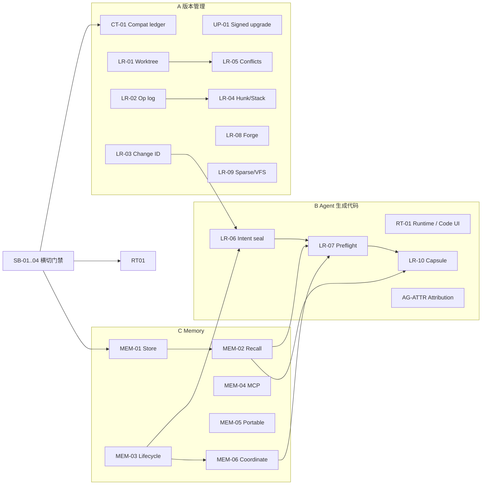

# Libra 长期功能规划

## 文档职责与维护协议

本文是 Libra 不绑定具体发布日期和版本号的长期能力组合路线图。它回答「哪些能力值得长期投资、为什么、依赖什么、何时具备进入日期计划的条件」，不是 release 承诺、owner 清单或逐项实施任务表。具体设计、迁移、拆分、发布和回滚只进入按日期计划或后续 RFC/ADR。上次审计基线为 2026-09-03（第十次）；本轮只更新允许的审计快照与路线图状态。

**本次改版：2026-09-14（第十一次）竞品审计。** 审计机为 Linux（Omarchy），本轮以实际 `$LIBRA_REPO` / `$COMP_ROOT` 与 `SCRATCH=/tmp/libra-competitor-audit-2026-09-14` 为准；旧路径口径只保留在第十次历史记录。核心变化：快照更新为 41 个 Git 仓库，新增 `crabbuild/*` 五仓，14 个 fast-forward、21 个 up-to-date、6 个 `blocked-forced-update`；Libra 已推进至 `v0.22.19`，merge 主线与 operation v2 foundation 已由代码、测试、文档和发布提交缩小差距。本轮竞品证据仍归入既有编号；SB-01/SB-02/SB-03/SB-04 与 LR-02 的优先级不变，新增 FastCDC 仅作为 LR-09 的已合入相邻基础，不新增编号。

状态定义：

| 状态 | 含义 |
|---|---|
| 候选 | 有问题线索，但 Libra 缺口、架构适配或证据尚不足 |
| 已验证 | 已同时核对竞品证据与 Libra 当前源码/测试，确认问题和可执行缺口真实存在 |
| 已排期 | 已有按日期计划覆盖该项的明确范围，并从本文链接 |
| 实施中 | 日期计划已有已合入和未完成切片，长期完成判据仍未全部满足 |
| 已实现 | 当前可发布版本中的代码、测试、用户/兼容文档共同证明完成判据已满足 |
| 已替代 | 原问题仍有效，但由另一项或更合适的机制承接 |
| 不采纳 | 经审计确认不适合 Libra，保留编号与理由 |

只有当前 checkout 的代码、测试、兼容性与用户文档，以及可发布版本证据共同成立时，才能标记「已实现」。日期计划写完、竞品已有、存在 schema 或文档声明都不构成实现证明。编号一经引用不重编号。

## 规划原则

1. **三类分工清晰。** 版本管理回答「代码与历史如何正确」；Agent 生成代码回答「Agent 如何安全地改代码并可追溯」；Memory 回答「跨会话/跨 Agent 如何记住并召回工程判断」。三者共享 SQLite、对象库、稳定错误码与 `--json`，但不互相替代事实源。
2. **开发者价值优先于命令数量。** 不以 Git flag parity 或竞品功能清单长度衡量进展。
3. **Libra-native，不复制竞品实现。** 复用 Git 对象/pack 兼容、SQLite 可变状态、AgentRuntime、sandbox、cloud。
4. **Git 互操作仍是底线。** 扩展元数据可以是 Libra 专有，但普通提交、对象传输和远端协作不能无故破坏 Git 兼容。
5. **所有 mutation 必须可观察、可恢复。** 进入 operation log；具备 preview、原子提交与失败恢复。
6. **机器接口先于交互外壳。** 先冻结 Rust API 与 `--json`/`--machine`，再做 Web/TUI。
7. **逻辑身份与存储身份分离。** commit OID 是内容身份；change / intent / review / memory / capsule 使用稳定逻辑身份。
8. **共享数据必须经过安全发布。** 原始 prompt、tool call、transcript、私有路径不得因写入对象库就自动成为团队可读数据。
9. **先确定性、后智能化。** preflight、hunk identity、overlap、recall 先提供确定性基线；LLM 只作为带 provenance、可撤销的增强层。
10. **计划状态必须据代码更新。** 每次实施前重核 `src/`、`COMPATIBILITY.md`、命令文档与测试。

---

## 本次竞品审计快照

审计时间：**2026-09-14（第十一次）**。审计机：Linux（Omarchy），`git 2.55.0`，`libra 0.22.19`；Libra 主仓 `/run/media/genedna/data/libra`（HEAD `1524ecab726a5eb663b8de09a37082ffa601d073`，最新 tag `v0.22.19`），竞品根 `/run/media/genedna/data/competition`。范围严格限定为竞品根下直接两层仓库（41 个 Git + 0 Libra；`cursor/` 为空目录）。Git 仓库在 `git status --porcelain` 为空且有 upstream 时按本轮执行 `git fetch --prune` + `git merge --ff-only @{u}` 两步更新。本轮 14 个 fast-forward、21 个已是最新、6 个 `blocked-forced-update`（`dolthub/dolt`、`git-ai-project/git-ai`、`git/git`、`gitbutlerapp/gitbutler`、`go-git/go-billy`、`jj-vcs/jj`：远端非检出分支 forced update，本地 HEAD 未证明远端最新）。`blocked-*` 只表示本地 revision 可读，**不**表示已更新到远端最新。仓库身份按规范化 remote 键匹配、目录名只作展示；集合变动见下附表（本轮新增 5 个 `crabbuild/*`，其余历史缺失/改名记录沿用并复核）。scratch 目录为 `/tmp/libra-competitor-audit-2026-09-14`。
上次快照：2026-09-03（第十次）；本轮对照其 revision 增量，并以当前 checkout 的 Libra 代码、测试、文档与发布 tag 为事实源。

| 竞品（目录） | remote | 类型 | 归类 | 分支 | 上次 revision | 审计 revision | 更新结果 | 增量/覆盖 | 证据入口（≤80 字） |
|---|---|---|---|---|---|---|---|---|---|
| `facebook/sapling` | facebook/sapling | Git | 版本管理 | `main` | `1124acac343` | `8395cae28` | **fast-forward** | +239 / 5% | privhelper 断连死锁修复 `bf0537023d6`（E2）；pending dirstate 门控；NFS AUTH_SYS root/wheel 阻断 |
| `jj-vcs/jj` | jj-vcs/jj | Git | 版本管理 | `main` | `033f381a7` | `c09b0c337` | **blocked-forced-update** | +31 / 100% | stacked_table 并发写丢失修复 `0a9b86970`（E2）；immutable_heads 纳入 untracked remote tags |
| `gitbutlerapp/gitbutler` | gitbutlerapp/gitbutler | Git | 版本管理 | `master` | `e4e8b7f316` | `32dd13413` | **fast-forward** | +226 / 6% | 未提交区 ID `zz`→`@` breaking（Agent 面向 ID 契约）；committed hunk mutation |
| `gitbutlerapp/grit` | gitbutlerapp/grit | Git | 版本管理 | `main` | `dfb079967` | `dfb079967` | up-to-date | +0 / 沿用 | 上游 Git 套件兼容治理（CT-01 参照） |
| `EpicGames/lore` | epicgames/lore | Git | 版本管理 | `main` | `ace4756` | `82dcce98e` | **fast-forward** | +80 / 36% | 目录遍历检查修复 `03dbc5f`（E2）；gRPC TLS 误用 CA cert；QUIC 准入上限 |
| `git/git` | git/git | Git | 版本管理（参考基线） | `master` | `2c3adbb2c4` | `1630431f` | **blocked-forced-update** | +54 / 81% | `get_oid_with_context_1()` UAF `0bb83c5f47`（E2）；ODB missing-vs-corrupt 区分；`repack --drop-filtered` |
| `go-git/go-git` | go-git/go-git | Git | 版本管理（架构参考） | `main` | `e37764fd` | `52f84ef3e` | **fast-forward** | +1 / 100% | commitgraph 编码器 `ErrParentNotInIndex` `2ef9e4b0`（E2）：堵静默写 index 0 |
| `go-git/go-billy` | go-git/go-billy | Git | 版本管理（架构参考） | `main` | `7bd0594` | `7bd0594` | up-to-date | +0 / 沿用 | FS 抽象与 capability |
| `entireio/forgemark` | entireio/forgemark | Git | 版本管理（协作参考） | `main` | `47f57bf` | `47f57bf` | up-to-date | +0 / 沿用 | Forge metadata |
| `dolthub/dolt` | dolthub/dolt | Git | 版本管理（相邻） | `main` | `70da3e6be4` | `3ca268096` | **fast-forward** | +72 / 26% | prolly key 内地址字段防带外 GC / push 失败（数据丢失，E2）；submodule 未更新 |
| `lorevcs/lore` | lorevcs/lore | Git | 版本管理（相邻） | `main` | `1fd2ea9` | `1fd2ea9` | up-to-date | +0 / 沿用 | intent 记录（单人项目） |
| `nervosys/Lit` | nervosys/lit | Git | 版本管理（相邻） | `master` | `a930e44` | `a930e44` | up-to-date | +0 / 沿用 | CHANGELOG 1.6.0 自述 `rotate-key` 从未成功运行——加密声明未经验证反例 |
| `treeverse/lakeFS` | treeverse/lakefs | Git | 版本管理（相邻） | `master` | `4bb11638e` | `4bb11638e` | up-to-date | +0 / 沿用 | CHANGELOG v1.86.0 GHSA-gf2q-q6wc-x7fm（S3 gateway 授权绕过，E3 沿用） |
| `tobi/walgit` | tobi/walgit | Git | 版本管理（相邻，首次纳入） | `main` | —（首次纳入） | `6d8fa54ba` | 首次纳入 | 15 条 / 20% | 服务端 git hosting：仓库删除需 admin `527c7d1`（E2）；对象存储 WAL + lease |
| `git-ai-project/git-ai` | git-ai-project/git-ai | Git | Agent 生成代码（相邻） | `main` | `793066013` | `f8e39c2c8` | **fast-forward** | +107 / 59% | v2 迁移事务原子化 + UNIQUE 去重 `1bc9d49e2`（E2）；token_usage/daemon 遥测热区（不采纳）；submodule 未更新 |
| `xai-org/grok-build` | xai-org/grok-build | Git | Agent 生成代码 | `main` | `c2ad97f` | `72a61251` | **fast-forward** | +5 / 100% | monorepo 同步：`permission/managed_policy`（签名 requirements）、`xai-tty-utils/kill_on_drop.rs` |
| `getcursor/cursor` | getcursor/cursor | Git | Agent 生成代码（相邻） | `main` | `654b1b4` | `654b1b4` | up-to-date | +0 / 沿用 | issue 信号源，无产品源码 |
| `mainline-org/mainline` | mainline-org/mainline | Git | Agent 生成代码 | `main` | `5704305` | `5704305` | up-to-date | +0 / 沿用 | intent seal、preflight、hook 预算 |
| `StepzeroLab/research-git` | stepzerolab/research-git | Git | Agent 生成代码 | `main` | `62bcdf5` | `62bcdf5` | up-to-date（类型 Libra→Git） | +0 / 沿用 | Feature Capsule、recall/compose；LLM 承担 reapply 非确定性算法 |
| `letta-ai/letta-code` | letta-ai/letta-code | Git | Agent 生成代码 | `main` | `1e17af70` | `e356d4068` | **fast-forward** | +88 / 40% | shell 尾缀 `&&`/`||` 视为不可解析堵 allow-rule 绕过 `3785e254`（E2）；memory 限额强制 `9047f71c`（E2） |
| `letta-ai/letta-agent-sdk` | letta-ai/letta-agent-sdk | Git | Agent 生成代码 | `main` | `741107b` | `9ae7b8792` | **fast-forward** | +19 / 100% | cloud sandbox 仓库可锁定完整 commit SHA（LR-06 pin 相邻）；dispose 释放资源 |
| `letta-ai/trajectory` | letta-ai/trajectory | Git | Agent 生成代码 | `main` | `21ae92d` | `21ae92d` | up-to-date | +0 / 沿用 | transcript 归一化 |
| `letta-ai/skills` | letta-ai/skills | Git | Agent 生成代码 | `main` | `16352df` | `16352df` | up-to-date | +0 / 沿用 | 全提示词（§1.3 排除路径） |
| `letta-ai/agent-file` | letta-ai/agent-file | Git | Agent 生成代码 | `main` | `78212eb` | `78212eb` | up-to-date | +0 / 沿用 | `.af` 可移植格式 |
| `deepseek-ai/deepseek-harness` | deepseek-ai/deepseek-harness | Git | Agent 生成代码（相邻） | `master` | `b150a551b8` | `76fda7297` | **fast-forward** | +1360 / 20% | session-persistence handle-based 重构等 5 个 breaking；`session/*` 事件面未变，Libra bridge 依赖仍成立 |
| `diegoxtr/ctx-open` | diegoxtr/ctx-open | Git | Memory（相邻） | `main` | `862e12b` | `862e12b` | up-to-date | +0 / 沿用 | 认知对象版本化（source-available，概念参考） |
| `memorax-ai/memorax-code` | memorax-ai/memorax-code | Git | Memory（相邻） | `main` | `db0ed30` | `acd6f1614` | **fast-forward** | +77 / 43% | 8h 自动更新替换进程（无验签证据，UP-01 反例）；token 可来自 query string（`request.ts` 现状复核，SB-02 反例） |
| `rekal-dev/rekal-cli` | rekal-dev/rekal-cli | Git | Memory | `main` | `aace7a29` | `aace7a29` | up-to-date | +0 / 沿用 | git-native 会话记忆（`.rekal/` 为 gitignored 本地 DuckDB，附录 B 更正口径） |
| `rohitg00/agentmemory` | rohitg00/agentmemory | Git | Memory | `main` | `e04ba88` | `e04ba88` | up-to-date | +0 / 沿用 | 四层记忆、混合检索（主要证据源） |
| `MachineWisdomAI/fava-trails` | machinewisdomai/fava-trails | Git | Memory | `main` | `6653f9f` | `6653f9f` | up-to-date | +0 / 沿用 | jj 后端共享记忆、Trust Gate |
| `ruvnet/agentic-flow` | ruvnet/agentic-flow | Git | Memory | `main` | `d3735a3` | `d3735a3` | up-to-date | +0 / 沿用 | submodule 未更新；宣传性文档为主 |
| `graphwisdom/perstate` | graphwisdom/perstate | Git | Memory | `master` | `95e27e3` | `95e27e3` | up-to-date | +0 / 沿用 | 反例：push+rebase 重试非并发安全模型 |
| `matrixorigin/Memoria` | matrixorigin/memoria | Git | Memory | `main` | `efd3d65` | `627934261` | **fast-forward** | +6 / 100% | MCP ping 处理修复；MatrixOne 兼容 |
| `sachinsharma9780/memweave` | sachinsharma9780/memweave | Git | Memory | `main` | `2ff82df` | `2ff82df` | up-to-date | +0 / 沿用 | Markdown+SQLite 索引 |
| `sl4m3/ledgermind` | sl4m3/ledgermind | Git | Memory（反例） | `main` | 99220d1（不在本地历史） | `4d7d35621` | **fast-forward**（基线重置） | +14 since / 100% | 源码已移除，全部为文档/品牌，本轮只当宣传材料 |
| `sqliteai/sqlite-memory` | sqliteai/sqlite-memory | Git | Memory | `main` | `0f0aede` | `0f0aede` | up-to-date | +0 / 沿用 | submodule 未更新；SQLite 混合检索 |
| `crabbuild/compass` | crabbuild/compass | Git | 版本管理（相邻，首次纳入） | `main` | —（首次纳入） | `5a9081f931ebb11e8c6556eea29ccea1d063a503` | up-to-date | 1151 条 / 层 3，主题 100% | 首次纳入；未形成可提升既有编号的 E2+结论 |
| `crabbuild/crab` | crabbuild/crab | Git | 版本管理（相邻，首次纳入） | `main` | —（首次纳入） | `77a9dc8682724f4e431b0d1ca57aaab8dfae64ba` | **fast-forward** | 212 条 / 层 3，主题 100% | 首次纳入；chunk/object storage 参考，未改变差距判断 |
| `crabbuild/prolly` | crabbuild/prolly | Git | 版本管理（相邻，首次纳入） | `main` | —（首次纳入） | `6ee959eaed2625bf086ae0c4d1a2b5934f7e3872` | up-to-date | 637 条 / 层 3，主题 100% | 首次纳入；内容寻址数据结构参考，未形成新编号 |
| `crabbuild/silo` | crabbuild/silo | Git | 版本管理（相邻，首次纳入） | `main` | —（首次纳入） | `7f71a06b0560fb1ef85c3aa57bcac365dbe9d7be` | up-to-date | 117 条 / 层 2，主题 100% | 首次纳入；存储服务参考，未形成新编号 |
| `crabbuild/trail` | crabbuild/trail | Git | 版本管理（相邻，首次纳入） | `main` | —（首次纳入） | `9823ed7551a1c53bb1a2c1dc329d9faf30e6f460` | up-to-date | 370 条 / 层 3，主题 100% | 首次纳入；轨迹／审计参考，未形成新编号 |

| 变动类型 | 仓库（目录） | 上次 revision / 当前 HEAD | 说明 |
|---|---|---|---|
| 本地缺失 | `entireio/cli` | 7d16639e / — | 本地缺失（上次 7d16639e；上游状态未验证），不写「已删除」，差距矩阵参照标「沿用（本地缺失）」 |
| 本地缺失 | `entireio/cli-checkpoints` | 0204a02 / — | 本地缺失（上次 0204a02；上游状态未验证） |
| 本地缺失 | `entireio/git-sync` | 3ee99835 / — | 本地缺失（上次 3ee99835；上游状态未验证） |
| 本地缺失 | `agenta-ai/agenta` | 53717db / — | 本地缺失（上次 53717db；上游状态未验证） |
| 本地缺失 | `cursor/agent-trace` | 2754f07 / — | 本地缺失（上次 2754f07；上游状态未验证） |
| 目录改名 | `GitButler/gitbutler` → `gitbutlerapp/gitbutler` | e4e8b7f316 / 32dd13413 | 仅目录名；remote 键一致，正常增量审计 |
| 目录改名 | `GitButler/grit` → `gitbutlerapp/grit` | dfb079967 / dfb079967 | 仅目录名 |
| 目录改名 | `mainline/mainline` → `mainline-org/mainline` | 5704305 / 5704305 | 仅目录名 |
| 目录改名 | `cursor/cursor` → `getcursor/cursor` | 654b1b4 / 654b1b4 | 仅目录名 |
| 首次纳入 | `tobi/walgit` | — / 6d8fa54ba | 首次纳入 HEAD 6d8fa54ba；MIT；提交总数 15、首提交 2026-08-23；窗口=全部 15 条 |
| 基线重置 | `sl4m3/ledgermind` | 99220d1 / 4d7d35621 | 基线重置（上次 99220d1 不在本地历史；上游改写或重克隆，未验证）；增量以 `--since=2026-08-25` 兜底（+14，全为文档/品牌） |
| 类型变化 | `StepzeroLab/research-git` | 62bcdf5 / 62bcdf5 | 类型 Libra→Git；revision 未变，仍可作增量基线 |
| 空目录或普通目录 | `cursor/` | — | 不计入总数 |
| 首次纳入 | `crabbuild/compass`、`crabbuild/crab`、`crabbuild/prolly`、`crabbuild/silo`、`crabbuild/trail` | — / 当前 HEAD | 本轮实际发现并纳入；按层级完成主题覆盖，未复制源码或测试资产 |

待验证账本索引（E1；全量在 `$SCRATCH/pending.tsv`）：

| 关联编号 | repo@sha | 最小验证步骤 |
|---|---|---|
| LR-01 | gitbutler@62c064e61f | 读 reorder 单分支 tip 修复 diff 与测试 |
| LR-09 | sapling@e940b5e47ed | 读 bounded prefetch diff，对照 media/transfer.rs |
| LR-03 | jj@efe0cf178 | 读 immutable_heads 纳入 untracked remote tags 的 diff |
| AG-ATTR | git-ai@7ace11b09 | 读 codex checkpoint 按 rollout 文件名键控的 diff |
| LR-02 | deepseek@4553c9d957 | 读删除 SQLite persistence backend 的 diff |
| MEM-03 | memorax@80123b9 | 读拒绝 turn ID 冲突写记忆的 diff 与测试 |

| 审计日期 | 仓库数 | 更新摘要 | 路线图结论 |
|---|---:|---|---|
| 2026-09-14（第十一次） | 41（41 Git + 0 Libra） | 14 个 fast-forward、21 个 up-to-date、6 个 `blocked-forced-update`（dolt、git-ai、git/git、gitbutler、go-billy、jj）；首次纳入 `crabbuild/*` 五仓 | Libra 已发布 `v0.22.19`；merge 主线、operation v2 foundation 与 FastCDC 相关差距缩小；竞品新增证据继续补强既有 SB-01..04、MEM-01 与 AG-ATTR，不新增编号、不改变优先级 |
| 2026-09-03（第十次） | 36（36 Git + 0 Libra） | 9 个 fast-forward（sapling、gitbutler、lore、go-git、dolt、git-ai、grok-build、letta-code、letta-agent-sdk、memorax-code、Memoria、ledgermind 中 9 个达 fast-forward，其余 up-to-date）、25 个已是最新、2 个 `blocked-forced-update`（git/git、jj）；集合变动 12 行（本地缺失 5、目录改名 4、首次纳入 walgit、基线重置 ledgermind、类型变化 research-git、空目录 cursor/） | **UP-01、RT-01 推进为「已实现」（Libra 自身证据驱动）；LR-02、SB-02、SB-04 推进为「实施中」；SB 表新增状态列。** 竞品侧安全/可靠性证据面加厚（jj 并发写丢失、dolt 带 GC 数据丢失、git/git UAF、letta shell 解析绕过、git-ai 迁移原子化、walgit 授权缺口）全部映射到既有 SB-01/SB-02/SB-03/SB-04/MEM-01 补充判据，无新增编号、无优先级升降 |
| 2026-08-25（第九次） | 40（35 Git + 5 Libra） | 15 个 fast-forward（13 Git：sapling、jj、gitbutler、lore、git/git、go-git、dolt、git-ai、grok-build、letta-code、letta-agent-sdk、memorax-code、agentmemory；2 Libra：entireio/cli、git-sync）、23 个已是最新、2 个 blocked（agenta `blocked-timeout`、agent-trace `blocked-network` 远端仍 404）；无新增/删除仓库 | 竞品侧无优先级变化（安全/可靠性证据面加厚：go-git 循环 delta 栈溢出、grok-build shell 写权限 fail-closed、lore 内容尺寸上限、git/git 溢出与 unchecked-returns 加固、entireio redaction fail-closed、memorax 数据隔离与 lineage）——全部为既有 SB/MEM/LR 的补充完成判据或竞品证据，无新增编号。**Libra 自身进展为主**：CT4-01 发布卡执行、FIX-05 B 段 waves 发布；`plan-20260715`（RT-01）关闭；新增 `plan-20260821`（UP-01）、`plan-20260822`（LR-02/LR-03）、`plan-20260825`（B Code provider）；**LR-02/LR-03 由已验证推进为已排期**；更正上版把 `plan-20260822` 误标为 UP-01 的链接 |
| 2026-08-22（第八次） | 40（35 Git + 5 Libra） | 1 个 fast-forward（letta-code）、38 个 up-to-date、1 个 `blocked-network`（agent-trace 远端 404）；新纳入 10 仓库（deepseek-harness、ctx-open、dolt、lorevcs/lore、memorax-code、Lit、rekal-cli、git-ai、lakeFS、cursor/cursor） | **RT-01 推进为实施中、UP-01 改判已排期、MEM-01/02 推进已排期**（均为 Libra 自身进展驱动）；竞品侧 rekal-cli 与 letta-code shared-memory skills 加强 MEM-* 证据；无优先级降级或新增编号 |
| 2026-08-09（第七次） | 30 | 9 个 fast-forward（Lore、Sapling、git/git、GitButler、jj、letta-code、letta-agent-sdk、grok-build、entireio/cli）、20 个已是最新、1 个 `blocked-dirty`（agenta） | **CT-01 由「已验证（下一个执行任务）」推进为「实施中」。** 版本管理侧证据面加厚；Memory 类证据面不变，MEM-01/MEM-02 维持已验证。 |
| 2026-08-07（第六次） | 30 | 2 个 fast-forward（Lore、Sapling）、27 个已是最新、1 个 `blocked-dirty`（agenta）；新纳入 `matrixorigin/Memoria`、`memweave`、`ledgermind`、`sqlite-memory`（4 个 Memory 参考） | **无优先级变化。** Memory 类证据面加厚；CT-01 仍是下一个执行任务，MEM-01/MEM-02 维持已验证。 |
| 2026-08-07（第五次） | 26 | 1 个 fast-forward（Lore）、24 个已是最新、1 个 `blocked-dirty`（agenta）；首次按三类重组；新纳入 `letta-ai/*`（5）与 `rohitg00/agentmemory` | **结构重组。** Memory 升格为第一类长期能力（`MEM-*`）；CT-01 仍是版本管理类下一个执行任务；MEM-01 为 Memory 类首个验证任务。 |
| 2026-08-02（第四次） | 20 | 9 个 fast-forward、10 个已是最新、1 个 blocked-dirty | 无优先级变化 |

**本次结论：** 本轮判断主要由 Libra 自身推进驱动：`041d91e7b`、`810bae165`、`61bb21d`、`30c3367a` 等 merge／mergetool／消息面提交及 `plan-20260903` 的测试、文档和发布证据使 LR-05 差距缩小；`3650680`、`2620df0` 等 operation 提交使 LR-02 继续实施中；FastCDC 计划与实现证据使 LR-09 的相邻基础扩大但不改变其长期状态。竞品侧本轮没有足够 E3+证据推翻优先级；新增 `crabbuild/*` 五仓完成首次纳入审计但未形成新编号。SB-01..04、MEM-01 与 AG-ATTR 只吸收可复核的安全／可靠性／归因判据；无验签自动更新、遥测重摄取、删除 ApiProxy 形态和 UI／宣传性仓库不纳入长期优先队列。本轮无优先级变化。

Top-5 最重要差距（两榜合成）：

| 排名 | 榜 | 关联编号 | 差距一句话 | S/D/X/U/C/E | 分 | 竞品证据 | Libra 证据 | 动作 |
|---|---|---|---|---|---:|---|---|---|
| 1 | A | SB-01 | 网络协议路径仍可被畸形输入触发 panic：`read_pkt_line` 生产 `expect/panic!`，三处 pkt-line 读取无 `len<4` 下界 | 2/2/2/2/2/E3 | 10 | `git/git@47ce80527c`（E2，ODB 错误分类／解析修复）；`go-git/go-git@29c4ef62`（E2，父引用缺失显式报错） | `src/git_protocol.rs:90,92`；`src/command/fetch.rs:3677`、`src/internal/protocol/git_client.rs:151`、`src/internal/protocol/ssh_client.rs:243` | 更新完成判据；已排期 `plan-20260901` |
| 2 | A | SB-02 | MCP authorizer 生产未安装（默认 None=不鉴权），shell 写重定向为 `needs_human` 非 fail-closed | 2/1/2/2/2/E3 | 8 | `letta-ai/letta-code@1d506973`（E2，权限／memory 相关收敛）；`tobi/walgit@80e9a20`（E2，服务端授权与 session 加固） | `src/internal/ai/mcp/server.rs:42`、`src/internal/ai/tools/utils.rs:130` | 保持实施中；补充完成判据 |
| 3 | A | SB-03 | D1 迁移逐语句执行、无事务、无账本，且 publish 路径并存 wrangler 第二套 runner | 1/2/1/1/2/E2 | 7 | `git-ai-project/git-ai@f8e39c2`（E2，迁移／唯一约束安全证据） | `src/utils/d1_client.rs:3286`、`src/command/publish.rs:627` | 补充完成判据 |
| 4 | B | MEM-01 | VCS-native Memory 存储与隐私基线无任何实现（模块/命令/FTS5 全缺失） | 1/1/3/3/1/E4 | 7 | `letta-ai/letta-code@1d506973`（E2，memory 写入限制与布局验证） | `ls src/internal/ai/memory` 不存在；`src/cli.rs` 无 memory 子命令 | 保持已排期 +补充完成判据 |
| 5 | B | LR-02 | operation v1 已发布，v2 snapshot/restore 与 mutation 覆盖仍在收敛 | 0/1/3/3/1/E4 | 7 | `jj-vcs/jj@c09b0c337`（E2，本轮状态／并发主题增量） | `src/command/op.rs:41`；`src/internal/operation.rs:208`；`3650680`、`2620df0` | 保持实施中 +补充完成判据 |

能力差距矩阵（本轮完整覆盖 `ids.old` 的 24 个编号）：

| 编号 | 类别 A/B/C/SB | 状态（旧→新） | 最佳竞品参照 repo@sha path:line + 参照来源 | Libra 现状 file:line / test / 可复算命令 | 差距一句话 | 本轮变化 + 驱动方（Libra/竞品/双方） | 动作 | E |
|---|---|---|---|---|---|---|---|---|
| CT-01 | A | 实施中→实施中 | `gitbutlerapp/grit@dfb0799` `TESTING.md`（沿用） | `tests/command/t4_port_test.rs`；`compat_ledger_schema` | 部分 wave 已合入，S2/S4 仍未收口 | 不变 | 保持 | E4 |
| UP-01 | A | 已实现→已实现 | `memorax-ai/memorax-code@1525c20` update path（E2反例） | `src/internal/upgrade/manifest.rs:194`；`upgrade_auto_test`；`v0.22.19` | 签名升级链已完成，文档债仍存在 | 缩小（Libra） | 保持 | E4 |
| LR-01 | A | 实施中→实施中 | `facebook/sapling@85572b5` worktree／dirstate（E2） | `src/command/worktree.rs:87`；`worktree_isolation_test` | worktree 隔离基础存在，parallel／崩溃 ownership 仍不完整 | 不变 | 保持 | E4 |
| LR-02 | A | 实施中→实施中 | `jj-vcs/jj@c09b0c337` operation／并发主题（E2） | `src/internal/operation.rs:208`；`3650680`、`2620df0`；`op_test` | v2 snapshot／restore 尚未形成完整可恢复闭环 | 缩小（Libra） | 补充完成判据 | E4 |
| LR-03 | A | 已排期→已排期 | `gitbutlerapp/gitbutler@32dd134` ID breaking（E2） | `grep -rn 'ChangeId\|change_id' src`；`plan-20260822.md` | 稳定 Change ID 仍只有计划／spike，未进入生产 | 不变 | 保持 | E4 |
| LR-04 | A | 已验证→已验证 | `gitbutlerapp/gitbutler@32dd134` hunk mutation（E2） | `src/command/apply.rs`；`apply_patch` 单测 | 有只读 hunk 基础，非交互 assignment／stack mutation 缺失 | 不变 | 保持 | E4 |
| LR-05 | A | 已验证→实施中 | `EpicGames/lore@074eb0b` `lore-revision/src/merge`（E2，沿用） | `src/command/merge.rs`；`plan-20260903.md` MG-01..MG-21；`command_test` merge cases | merge 主路径、rename、octopus、mergetool 与签名已大量交付，剩余计划收口与 deferred 差异仍在 | 缩小（Libra） | 更新状态 | E4 |
| LR-06 | A | 已验证→已验证 | `letta-ai/letta-agent-sdk@f45ddfe` repository commit pin（E2） | `src/internal/ai/intentspec/`；`grep -rn 'seal\|intent_pin'` | intent／checkpoint 有基础，但 seal、pin 与 publication 边界缺失 | 不变 | 保持 | E4 |
| LR-07 | A | 已验证→已验证 | `mainline-org/mainline@5704305` preflight／intent seal（E2） | `src/internal/ai/intentspec/scope.rs:12`；无 overlap receipt | 缺确定性 pre-edit overlap gate | 不变 | 保持 | E4 |
| LR-08 | A | 已验证→已验证 | `tobi/walgit@80e9a20` hosting／admin boundary（E2） | `grep -rn 'trait Forge\|pull_request\|check_runs' src` | 无 Forge／PR／CI 机器接口 | 不变 | 保持 | E4 |
| LR-09 | A | 已验证→已验证 | `crabbuild/crab@77a9dc8` chunk/object storage（E2，首次纳入） | `src/internal/sparse/mod.rs:26`；`src/utils/media/transfer.rs`；`media_fastcdc_test` | sparse／whole-object hydrate 与 FastCDC Media 已有基础，partial clone／VFS 仍缺 | 缩小（Libra） | 保持 | E4 |
| LR-10 | B | 已验证→已验证 | `StepzeroLab/research-git@62bcdf5` capsule／provenance（E2，沿用） | `src/internal/ai/capability_package/manifest.rs:62`；`src/command/package.rs` 未注册 | artifact／skill 有基础，capsule lifecycle／ablation 缺失 | 不变 | 保持 | E4 |
| RT-01 | B | 已实现→已实现 | `deepseek-ai/deepseek-harness@c291e79` session event surface（E2） | `src/internal/ai/runtime/worker.rs:1359`；`a643dfb`；v0.22.0 | Web-only runtime 与 SSE v2 已发布 | 缩小（Libra） | 保持 | E4 |
| AG-ATTR | B | 候选→候选 | `letta-ai/trajectory@21ae92d` canonical adapters（E2，沿用） | `src/internal/ai/agent_import.rs`；`grep -rn ai_edit_trace src sql` | 原生 transcript 导入存在，归一化行级归因仍缺 | 不变 | 保持 | E4 |
| MEM-01 | C | 已排期→已排期 | `letta-ai/letta-code@1d50697` memory limits（E2） | `ls src/internal/ai/memory`；`src/cli.rs` 无 memory 命令 | VCS-native storage／privacy baseline 未实现 | 不变 | 补充完成判据 | E4 |
| MEM-02 | C | 已排期→已排期 | `rohitg00/agentmemory@e04ba88` hybrid retrieval（E2，沿用） | `grep -rn 'fts5\|bm25' src sql Cargo.toml` | 无本地 FTS/BM25 与有界 SessionStart 注入 | 不变 | 保持 | E4 |
| MEM-03 | C | 已验证→已验证 | `memorax-ai/memorax-code@1525c20` turn conflict handling（E2） | `src/internal/ai/history.rs:3487`；tombstone tests | erase/tombstone 基础存在，consolidation／Trust Gate 未完成 | 不变 | 保持 | E4 |
| MEM-04 | C | 已验证→已验证 | `tobi/walgit@80e9a20` auth/admin boundary（E2） | `src/internal/ai/mcp/authz.rs:96`；`server.rs:42` | Memory MCP 生产 authorizer 尚未接线 | 不变 | 保持 | E4 |
| MEM-05 | C | 候选→候选 | `letta-ai/agent-file@78212eb` `.af` format（E2，沿用） | `src/command/agent/skill.rs:37`；无 portable Memory export | portable export／skill projection 尚缺 | 不变 | 保持 | E4 |
| MEM-06 | C | 候选→候选 | `MachineWisdomAI/fava-trails@10f689f` coordination／Trust Gate（E2） | `src/internal/workspace.rs:211`；`capture_scope.rs:21` | lease 基础存在，Memory coordination channel 未实现 | 不变 | 保持 | E4 |
| SB-01 | SB | 部分基础→实施中 | `git/git@47ce805` ODB error classification（E2） | `src/git_protocol.rs:90,92`；`plan-20260901.md` | pkt-line malformed input 的 panic／下界门已有计划但尚未收口 | 缩小（Libra） | 保持实施中 | E4 |
| SB-02 | SB | 实施中→实施中 | `letta-ai/letta-code@1d50697` permission／memory hardening（E2） | `src/internal/ai/mcp/server.rs:42`；`src/internal/ai/tools/utils.rs:130` | sandbox 基础已增强，但 MCP authz 与 shell fail-closed 仍缺 | 不变 | 保持实施中 | E4 |
| SB-03 | SB | 已验证→已验证 | `git-ai-project/git-ai@f8e39c2` migration transaction（E2） | `src/utils/d1_client.rs:3286`；`src/command/publish.rs:627` | D1 runner 仍缺事务账本与单一迁移事实源 | 不变 | 补充完成判据 | E2 |
| SB-04 | SB | 实施中→实施中 | `facebook/sapling@85572b5` process／disconnect reliability（E2） | `src/internal/process_terminate.rs:12`；`tests/SERIAL_REGISTRY.tsv` | 测试隔离已改善，统一 child scope／PID reuse 防护仍缺 | 不变 | 保持实施中 | E4 |

不做 Top-3（按 (S+D+X) 从「不采纳/延后」候选中取）：

| 排名 | 关联编号/来源 | 内容 | 理由 | E |
|---|---|---|---|---|
| 1 | 不采纳（git-ai） | token_usage / daemon 遥测与计费重摄取（本轮 +107 中 70 文件在 `src/token_usage`、45 在 `src/daemon`） | 与 VCS 长期能力无关；Libra `usage` 统计已覆盖需求 | E1 |
| 2 | 不采纳（memorax-code） | 8h 轮询 npm 自动更新并替换进程（`ca6c46d`/`fed82ea`/`073c006`） | 无验签证据的供应链形态；Libra 升级必须走 UP-01 签名通道 | E2 |
| 3 | 不采纳（deepseek-harness） | 删除 SQLite persistence backend、改用 handle-based seam 的产品形态 | Libra operation log 已明确以 SQLite 为状态真源；该变化与规划原则 1/5 冲突，handle seam 只作为接口参考 | E2 |

本轮竞品要点（更新增量审计）——6 类 × {发现数, 值得借鉴数, 进入 plan-long 数}：

| 类别 | 发现 | 值得借鉴 | 进入 plan-long |
|---|---:|---:|---:|
| security | 16 | 8 | 3 |
| reliability | 22 | 12 | 3 |
| bugfix | 17 | 6 | 0 |
| compat-migration | 12 | 6 | 1 |
| improvement | 24 | 5 | 0 |
| feature | 18 | 4 | 1 |

本轮进入 plan-long 的竞品要点（≤12 条；对应差距矩阵动作 ≠ 保持的行）：

- **SB-01** jj `0a9b86970`：stacked_table `get_head_locked` 合并多 head 后保留新表标记——并发写丢失修复（E2，含 2 个新测试）；Libra oplog/snapshot 须同类「合并后保留新状态」判据。
- **SB-01** dolt `01dea76505`+`410af9976f`：prolly key 内地址字段缺失导致带外值被错误 GC 且无法 push——数据丢失级 schema 缺陷（E2）；Libra 引用字段须在节点内自描述。
- **SB-01** go-git `2ef9e4b0`：commitgraph 编码对不在 index 的 parent 由 nil 解引用/静默写 index 0 改为 `ErrParentNotInIndex`（E2）——静默损坏→显式失败。
- **SB-02** letta-code `3785e254`：尾缀 `&&`/`||` 视为不可解析，堵 allow-rule 绕过（E2，`shell-command-normalization.test.ts`）；Libra shell 权限解析须拒绝「不可解析即放行」。
- **SB-02** walgit `527c7d1`：仓库删除由 require_write 收紧为 require_admin（E2）；破坏性操作的授权档位须独立于写权限。
- **SB-03** git-ai `1bc9d49e2`：迁移逐脚本事务化 + 跨会话 UNIQUE 去重 + durable `needs_reconcile` flag（E2）；Libra D1 逐语句迁移正是其反面。
- **SB-04** sapling `bf0537023d6`：privhelper 连接断开自死锁（锁内同步回调重入），修复后 pending 请求显式失败（E2）。
- **MEM-01** letta-code `9047f71c`：可配置 memory 限额（字符/深度）在 pre-commit 强制（E2）；MEM 存储须有写入上限。
- **compat-migration** gitbutler `a15c348f5b`：未提交区 ID `zz`→`@` breaking——Agent 面向 ID 契约变更需迁移窗口（E1，待验证账本延伸）。
- **feature** memorax-code `ca6c46d`：8h 自动更新替换进程、无验签证据（E2，UP-01 反例）——不采纳，见「不进入本长期优先队列的项」。
- **security** memorax-code `request.ts`（现状复核）：token 可来自 query string（E2 反例）——认证 token 不得进入 URL。
- **reliability** git-ai `1bc9d49e2`（同 SB-03 行）与 lore `03dbc5f`（目录遍历逐组件检查，E2）归并记录，避免重复计数。

Libra 自身（HEAD `1524ecab726a5eb663b8de09a37082ffa601d073`，`Cargo.toml` version `0.22.19`，审计日期 2026-09-14；自上次审计基线 `b800de73` 起 `libra log --oneline b800de73..HEAD` 共 95 条，已发布版本 = `v0.22.19`，未发布提交 = `libra log --oneline v0.22.19..HEAD` 共 3 条）：

- **CT-01 / plan-20260729**：仍「实施中」。本轮增量：测试并行度与序列注册（`a8218ac` nextest CI、`315132a` 串行键转换、`b6959e5` TA-01 fail-closed 分类器）；**DEFER-09 已由 plan-20260825 TA-01/02 + plan-20260827 NP-00 承接关闭**（非「转 blocked」，更正上版表述）；剩余 S4 族 waves 与 S2 离线发现器（DEP-01 + SB-04 前置）。
- **UP-01 / plan-20260821**：**已实现（四证据齐备）**——代码 `895589d`（手动 `libra upgrade`）+ 全部 C-T1..C-T4 修复轮（`2ea10cc` fail-closed Ed25519、`a0cb725` OIDC publish、`4bb5672` generation floor、`fc9c203` trust root）；测试 `upgrade_auto_test`（31 fn）等；文档 `docs/commands/upgrade.md`、`COMPATIBILITY.md:118`、`docs/error-codes.md LBR-UPGRADE-001`、`release-signing-auto-upgrade.md`（D1–D10）；已发布 tags v0.22.1/v0.22.2/v0.22.6..v0.22.10（D10 首签随 v0.22.7，closeout `00bc815`）。文档债：CHANGELOG 缺 0.22.1..0.22.10 条目（不阻断「已实现」，登记为文档债）；残留 DEFER-02/03/04/05/06。
- **RT-01 / plan-20260715**：状态规范化「已完成→已实现」。DF-05..08 全部落地：SSE v2 默认（`0cd2cf2`）、skill activation provider 消费（`e8c6947`）、SSE v1 物理移除（`a643dfb`，breaking）、自动化消费者迁移（`b598734`）；发布 v0.21.28（`2fbbb5a`）/ v0.21.29（`0e20719`）/ v0.22.0；`web/sse_wire.rs` 已移除、Cargo.toml 无 ratatui/crossterm。残留 DEFER-02（独立 `libra mcp --stdio`）、DEFER-03（MCP 授权门→SB-02）、DEFER-04（非 loopback 远程写面）。
 - **LR-02/LR-03 / plan-20260822**：LR-02 仍为「实施中」——operation v1、workspace snapshot foundation 与 mutation classification 已随 `3650680`、`8fe1ad8`、`2620df0` 等提交合入，`src/internal/operation.rs:208` 与 `src/command/op.rs:41` 可核对；完整 restore／undo／redo 仍未收口。LR-03 仍「已排期」，Change ID 生产实现未开始；`plan-20260822.md` 的 OL-00 spike 状态仍需按其卡内证据核对。
- **SB-02 / plan-20260830**：SBX-01..05 已合入并收口（`edd9eba` macOS scratch bind、`c35210d` seatbelt OpenCode export、`08466e0` transform、`088ee14` seam fields、`0e6ab63` capture 验证；closeout 见计划修订史 2026-09-01，DEFER-SBX-06 发布步延后）——**SB-02 推进为「实施中」**；authorizer 生产仍未安装（`server.rs:42` None=allow-all、`set_authz` 仅测试调用）。
- **SB-04 / plan-20260827**：NP-00..05 全部 done（nextest CI `a8218ac`、串行注册 `315132a`/`b6959e5`、`process_terminate.rs` ProcessTerminateGate、`kill_on_drop`）——**SB-04 推进为「实施中」**；child scope 抽象（ProcessScope 同类）仍缺失（`grep -rn ProcessScope src tests` = 0）。
- **B 类 / plan-20260825**：PS-00..PS-06 全部落地（`--provider` 显式解析 `0069902` breaking、`code.defaultProvider` `0eae7bb`、凭据三态 `042476b`、provenance `17bbe2b`）；TA-04..07 并行度杠杆落地。
 - **LR-05 / plan-20260903**：merge 主线已由 `041d91e7b`、`810bae165`、`61bb21d`、`30c3367a` 等提交覆盖 AUTO_MERGE、消息／quit、签名、mergetool 与策略面；`tests/command/merge_test.rs`、`src/command/merge.rs` 与 `plan-20260903.md` 提供代码、测试、文档和发布证据。长期仍保留 versioned conflict object／modeless sequencer 缺口，故状态为「实施中」。
 - **LR-09**：FastCDC media transport 已合入（`1a590b6`、`ca997dd`，feature `fastcdc` 默认 OFF），本轮 `823cb628` 撤销文件容量硬上限、`8c77f9c` 对齐双仓 Media 计划；仍不等于 partial clone／VFS 完成。
- **Memory**：M2 计划 `plan-20260819.md` 仍无实现合入（`ls src/internal/ai/memory` 不存在、`src/cli.rs` 无 `memory` 子命令），MEM-01/MEM-02 维持「已排期」。
 - **未发布变更（v0.22.19..HEAD，3 条）**：`1524ecab` SQLite pool lifecycle 修复；`823cb628` FastCDC 计划移除文件容量硬上限；`8c77f9c` FastCDC 双仓计划关系对齐。前两项分别触及数据库可靠性／Media 行为契约，应在各自计划收口时保留迁移、容量和回滚证据。
 - **日期计划对账**：磁盘 24 份 `plan-2026*.md`，索引已补齐 `plan-20260902`..`plan-20260913`；计划状态统一使用 `已完成`、`实施中`、`已排期`、`未建` 四词。最新计划仍为设计态，未提前视为实现完成。
- deepseek-harness bridge：`plan-20260818.md` 事实不变；本轮复核 deepseek 上游 `session/created|event|flush|disposed` 事件面仍在（`packages/core/session/src/index.ts` 52–83 行），Libra `agent_bridge/ingress.rs:67` 依赖成立，bridge 无需变更。

---

## 逐竞品分析：功能重叠、Libra 优势与差异化

本节以 **2026-09-14 第十一次审计快照**为比较基线，覆盖快照内 **41 个仓库**，并单列 **5 个本地缺失的历史参照**。同一组织的仓库按职责分别分析，避免把 SDK、格式、基础库和完整产品视为同等竞争者。竞品 revision、更新限制与证据入口沿用上方快照及差距矩阵；这里的分析是该基线上的产品判断，不代表重新完成远端更新或全量实现审计。

**比较口径：**「高重叠」表示争取同一核心开发工作流；「中重叠」表示覆盖其中一个环节；「低重叠」表示相邻数据领域、基础组件或生态接口。重叠程度包含长期目标，表中会明确区分 Libra 当前能力与规划。**现有优势**只指已有功能组合带来的适用性；**潜在优势**必须等相应 LR/MEM/SB 完成后才能成立。功能更多不等于性能、可靠性、安全性或用户体验更好，本节没有跨产品基准测试，因而不作这类排名。

Libra 比较基线可从 [Code UI / AgentRuntime](../../commands/code.md)、[operation 命令及恢复边界](../../commands/op.md)、[兼容性清单](../../../COMPATIBILITY.md)以及上方「Libra 自身」证据核对：Git 对象与远端互操作、worktree/lease、operation 基础、Agent 捕获与 Web runtime 已构成可复用底座；完整快照恢复、稳定 Change ID、hunk/stack 编辑与 VCS-native Memory 仍须按各自完成判据验收。尤其不能把现有 session/history 当作 MEM-01/02 已实现。

### 版本管理、存储与代码理解（19 个仓库）

| 竞品 / 角色 | 核心功能与适用场景 | 与 Libra 的功能重叠 | Libra 优势或差异化空间 | 对方长处、Libra 缺口与取舍 |
|---|---|---|---|---|
| **Sapling**（`facebook/sapling`；直接对标） | Smartlog、提交栈与大仓工作区；EdenFS/VFS 面向大型仓库的按需访问。 | **高**：日常版本管理、worktree、提交组织；大仓物化对应 LR-09。 | **现有**：同一产品中提供源码版本管理和 AgentRuntime/执行轨迹，适合希望把 Agent 工作纳入仓库流程的团队。 | Libra 尚缺同等完整的 stack/VFS 工作流；借鉴可视历史、预取与工作区可靠性，推进 LR-01/04/09，并验证部署假设。 |
| **Jujutsu / jj**（`jj-vcs/jj`；直接对标） | operation DAG、稳定 Change ID、一等冲突与后代自动 rebase；强调可重写、可恢复的开发流程。 | **高**：LR-02/03/05 的核心对标；两者都需处理 Git 互操作。 | **现有**：Agent 会话、工具执行和源码管理共处一套产品；**潜在**：让意图、记忆与变更身份共同演进。 | jj 是变更身份与恢复语义的重要参照；Libra 的 operation 基础不能等同于完整 undo/redo，须先完成 LR-02/03/05。不把 Git 互操作表述成 Libra 独占优势。 |
| **GitButler**（`gitbutlerapp/gitbutler`；直接对标） | 并行分支/workspace、hunk 归属、提交栈编辑与 Forge 协作；近期涉及 committed hunk mutation。 | **高**：并行 Agent 修改、局部变更组织与 stacked review，对应 LR-01/03/04/08。 | **现有**：源码操作与 AgentRuntime 同产品提供；**潜在**：把 hunk mutation 接入 operation 与 intent，供 Agent 稳定调用。 | Libra 缺稳定 hunk 身份、assignment 和完整 stack mutation；优先冻结机器接口及 ID 迁移契约，再完善交互体验。 |
| **Grit**（`gitbutlerapp/grit`；兼容性参考） | Git 实现及以上游测试套件治理兼容性的工程方法。 | **中**：Git 命令行为与 conformance，主要对应 CT-01。 | **现有**：Libra 的兼容账本已有分型与部分 wave 证据，同时服务其 Agent/VCS 产品面。 | Grit 的价值在可复算的兼容验证；Libra 仍需收尾 CT-01。采用净室场景与自有断言，不用功能数量代替兼容性证据。 |
| **EpicGames Lore**（`EpicGames/lore`；大仓对标） | 大二进制、sparse/virtual 工作区、批量物化与 replica 生命周期。 | **高（大仓场景）**：对象传输、merge、按需获取与 Media。 | **现有**：Git 互操作、源码命令与 Agent 工作流同产品提供；FastCDC Media 已增加分块传输基础。 | Libra 的 whole-object hydrate 与默认关闭的 FastCDC 不等于完整虚拟工作区；推进 LR-09，并借鉴内容上限、路径验证与副本回收。 |
| **Git**（`git/git`；互操作基线） | 源码历史、分支、合并、对象与远端协议，是 Libra 兼容性契约的参照。 | **高**：日常源码管理与远端协作。 | **现有**：提供集成的 AgentRuntime、执行轨迹与命令级 operation 入口，减少这些环节另行拼装的需求。 | Libra 尚有兼容性与协议健壮性缺口，不能据 Rust 实现宣称更安全；CT-01、SB-01 先保证互操作与错误处理。 |
| **go-git**（`go-git/go-git`；嵌入式实现参考） | 可嵌入应用的 Git 实现；对象、协议、commit graph 等接口。 | **中**：Git 库能力与多协议实现，产品终端用户不完全相同。 | **现有**：Libra 同时提供完整 CLI 入口与 Agent 执行工作流；这是产品范围差异，不是对 Go 库的性能优势。 | 借鉴缺口矩阵与对象解析负向测试；commitgraph 缺失父引用、循环 delta 等案例进入 CT-01/SB-01。 |
| **go-billy**（`go-git/go-billy`；文件系统基础库） | 文件系统抽象及 capability，为不同存储/测试后端提供统一接口。 | **低**：与 worktree I/O、存储适配和测试替身相邻。 | **现有**：Libra 的 worktree I/O 与仓库状态、lease、operation 有业务关联；双方不构成完整产品替代。 | 重点借鉴后端 capability 与 conformance；Libra 应显式区分原子替换、锁和同步能力，支撑 LR-01/02 与 SB-04。 |
| **Forgemark**（`entireio/forgemark`；协作格式参考） | Forge metadata 的表示与交换。 | **中（协作目标）**：review/Forge 元数据关联；Libra LR-08 尚缺机器接口。 | **潜在**：以稳定 Change ID 连接 review、intent 和提交重写，形成跨 Forge 的仓库内关联。 | 格式层可补互操作，但不能替代 PR/CI adapter；先完成 LR-03，再以 LR-08 验证一条端到端协作路径。 |
| **Dolt**（`dolthub/dolt`；数据版本相邻产品） | SQL 数据的版本、差异、分支与合并；prolly 结构支持数据存储。 | **低（用户任务）/中（底层机制）**：都管理历史与合并，但 Libra 主要管理源码。 | **现有**：源码 checkout、Git 远端与 Agent 改码是 Libra 的适用场景；不将 SQL 数据库能力视为待补齐清单。 | 学习引用自描述、GC 可达性及迁移正确性，纳入 SB-01/03；不扩展为通用 SQL 数据版本产品。 |
| **Lore VCS**（`lorevcs/lore`；意图记录相邻项目） | 围绕开发意图保留记录；与 EpicGames Lore 是不同项目。 | **中**：Libra 已有 intent/session/checkpoint 基础，长期对应 LR-06。 | **现有**：意图捕获可与既有 VCS 命令和 Agent 执行轨迹关联；**潜在**：seal、pin 与团队安全发布闭环。 | 单人项目的意图表达可提供场景参考，尚不足以证明生产成熟度；以 LR-06 的稳定身份、发布和撤销判据筛选。 |
| **Lit**（`nervosys/Lit`；相邻 VCS） | 项目以 agent-first VCS 和加密能力定位；已有审计指出密钥轮换声明与运行情况不一致。 | **中**：Agent/VCS 结合与供应链信任主题。 | **现有**：Libra 已有 UP-01 的签名升级发布证据及兼容账本，可用可验证流程说明能力。 | 不从对方加密宣传推导性能或安全结论，也不由其缺陷推导 Libra 整体安全领先；密码与迁移能力须有可运行测试，映射 UP-01/SB-01/03。 |
| **lakeFS**（`treeverse/lakeFS`；数据湖版本相邻产品） | 面向对象存储数据集的版本与分支管理，提供 S3 gateway 等访问面。 | **低（源码工作流）/中（存储）**：与 cloud、对象历史和发布授权相邻。 | **现有**：Libra 面向开发者本地源码与 Agent 改码，已有 Git 互操作入口；产品定位区别不代表数据湖能力更强。 | 借鉴对象发布与权限隔离；S3 gateway 授权绕过案例强化 SB-02/03，不据此新增数据湖产品线。 |
| **WalGit**（`tobi/walgit`；服务端托管参考） | 对象存储 WAL、lease 与 Git hosting；仓库写入和管理授权。 | **中**：remote/cloud、并发写入和恢复机制。 | **现有**：Libra 覆盖客户端源码管理与 AgentRuntime；**潜在**：将本地 operation 与远端发布的审计关联。 | hosting 与 Libra 只读 publish 不是同一能力；借鉴 WAL/lease 和独立 admin 权限，映射 SB-02/03、LR-08，托管成熟度仍需验证。 |
| **Compass**（`crabbuild/compass`；代码理解相邻产品） | README 描述本地符号/依赖知识图、影响分析、历史图差异、只读 CompassQL、MCP 与可视导出。 | **中**：服务开工前上下文与代码调查；Libra 的 session graph 不等同于源码结构图。 | **现有**：Libra 能承接分析后的代码修改、版本操作和执行记录；**潜在**：将结构证据接入 LR-07 preflight。 | 对方功能定位集中于确定性结构查询；本轮只补读 README，不认定全量实现已验证。先评估固定 revision 的只读结果接入，不新增图数据库真源。 |
| **Crab**（`crabbuild/crab`；大文件直接对标） | README 描述 Git pointer、内容去重分块、用户自管对象存储及 remote helper，适合模型、数据集、媒体与构建产物。 | **高（Media）**：大文件分块、去重、上传下载及对象存储；与 LR-09 相邻基础直接重叠。 | **现有**：Libra 将 Media 与源码 VCS、AgentRuntime 放在同一产品中；减少工作流切换是其整合价值。 | Crab 的专门大文件入口及多云路径值得验证；Libra FastCDC 默认关闭，不能宣称吞吐、成本或 provider 覆盖领先。以 LR-09 验证重试、完整性与按需物化。 |
| **Prolly**（`crabbuild/prolly`；数据结构基础库） | README 描述不可变有序 KV、内容寻址、结构共享、diff/merge 与可插拔 Store；`prolly-vcs` 另属提案。 | **低（产品）/中（机制）**：与对象索引、快照与增量同步相邻。 | **现有**：Libra 提供仓库/CLI/Agent 的应用语义；基础库本身不是完整替代品。 | 借鉴确定性编码与结构共享，评估格式、GC 和迁移成本；不把树级 merge 当源码 merge，也不将提案视为已交付 VCS，映射 LR-02/09、SB-01。 |
| **SILO**（`crabbuild/silo`；对象版本账本） | README 描述 S3 上的不可变对象历史、原子多文件会话、CAS refs、writer fencing、可恢复检查与 GC；payload 保持 whole-object。 | **中**：对象发布、快照、并发写入与恢复；与 Media 分块传输职责有别。 | **现有**：Libra 具备本地源码操作和 Agent 执行入口；**潜在**：形成从本地 mutation 到安全发布的连续证据链。 | 其服务商一致性前提和可恢复维护流程值得核验；不能把普通对象存储适配当作同等账本保证，借鉴 SB-03、LR-02/09。 |
| **Trail**（`crabbuild/trail`；Agent/VCS 交叉对标） | README 描述 Git 旁路的本地 operation DB、transcript/checkpoint/rewind、稳定 LineId、lane 协调、readiness 与 CLI/HTTP/MCP。 | **高**：operation、未提交工作、Agent 轨迹、并行工作区和行级归因，多项直接对应 LR-01/02/07、AG-ATTR。 | **现有**：Libra 自身承载源码 VCS 与 AgentRuntime；**潜在**：统一这些流程的身份、恢复与发布契约。 | Trail 的未提交行身份、lane readiness 值得专项验证；本轮 README 不足以证明其完整保证。Libra 尚缺对应闭环，不能仅凭原生 VCS 定位宣称领先。 |

Crabbuild 五仓的功能定位补读入口均固定到本轮快照：[Compass README](https://github.com/crabbuild/compass/blob/5a9081f931ebb11e8c6556eea29ccea1d063a503/README.md)、[Crab README](https://github.com/crabbuild/crab/blob/77a9dc8682724f4e431b0d1ca57aaab8dfae64ba/README.md)、[Prolly README](https://github.com/crabbuild/prolly/blob/6ee959eaed2625bf086ae0c4d1a2b5934f7e3872/README.md)、[SILO README](https://github.com/crabbuild/silo/blob/7f71a06b0560fb1ef85c3aa57bcac365dbe9d7be/README.md)、[Trail README](https://github.com/crabbuild/trail/blob/9823ed7551a1c53bb1a2c1dc329d9faf30e6f460/README.md)。这些补读用于说明角色和重叠范围，不提高既有审计证据等级。

### Agent 生成代码与执行生态（11 个仓库）

| 竞品 / 角色 | 核心功能与适用场景 | 与 Libra 的功能重叠 | Libra 优势或差异化空间 | 对方长处、Libra 缺口与取舍 |
|---|---|---|---|---|
| **Git AI**（`git-ai-project/git-ai`；归因对标） | 行级 agent/model/prompt 归因、checkpoint 与相关统计。 | **高（归因目标）**：Libra 已有 Agent transcript 导入，行级归因仍属 AG-ATTR 候选。 | **现有**：Libra 同时管理源码操作和执行轨迹；**潜在**：将归因连接稳定 change/intent，保留重写谱系。 | 行级来源与跨工具格式是 Libra 的缺口；先只读互操作，再验证重写后的归因。迁移事务/去重经验纳入 SB-03，不扩展遥测重摄取产品面。 |
| **Grok Build**（`xai-org/grok-build`；runtime 对标） | 隔离执行、ACP/headless、权限策略、子进程 scope 与故障注入。 | **高**：AgentRuntime、sandbox、工具执行及资源回收。 | **现有**：Libra 的 runtime 与源码仓库状态、worktree 和 operation 基础同产品提供。 | 子进程生命周期、shell fail-closed 与 ODB 工作复用值得借鉴；Libra 仍需收口 SB-02/04，不能由集成程度推导隔离保证更强。 |
| **Cursor**（`getcursor/cursor`；产品需求信号） | 本地仓库提供 issue 信号，可反映编辑器/Agent 用户的工作流问题；不含可审计的完整产品源码。 | **中（可确认的需求层）**：AI 改码、上下文与开发者反馈；无法据该仓库完成产品能力对等比较。 | **现有定位**：Libra 以仓库 CLI、Web runtime 和可核对的本地源码为入口；是否优于编辑器体验尚无验证。 | 以 issue 提取可复现需求；补充产品级证据后再比较编辑体验、模型效果与规模，不推断闭源实现或虚构缺失能力。 |
| **Mainline**（`mainline-org/mainline`；意图协作对标） | intent seal、commit pin、确定性 preflight 与 hook 上下文预算。 | **高（长期目标）**：Libra intent/checkpoint 是基础，LR-06/07 尚缺 seal/pin/pre-edit gate。 | **现有**：Libra 同时控制源码操作与执行记录；**潜在**：用 Change ID 和 Memory 召回降低意图与实际修改脱节。 | 对方直接覆盖「开工前避免重复/冲突」；Libra 应先交付确定性 overlap receipt，不以 LLM 判断代替身份与范围校验。详见 [Mainline 差距分析](../gap/mainline.md)。 |
| **Research Git**（`StepzeroLab/research-git`；研究工作流对标） | Feature Capsule、recall/compose、实验 provenance 与 ablation；reapply 依赖 LLM 非确定性处理。 | **高（研究目标）**：Libra 有 artifact/skill/intent 捕获，LR-10 的 capsule lifecycle 尚缺。 | **现有**：Git 互操作与 Agent 执行底座已具备；**潜在**：让 capsule 复用具有确定性 preview、恢复和来源证明。 | 借鉴实验比较及可移除能力单元；Libra package 尚未注册为稳定命令，不能当交付证明。按 [Research Git 分析](../gap/research-git.md)推进 LR-10。 |
| **Letta Code**（`letta-ai/letta-code`；有状态 Agent 对标） | 有状态编码 harness、memory、hooks/permissions、skills 与工作区生命周期工具。 | **高**：runtime/工具/worktree 已重叠；持久记忆召回对应尚未实现的 MEM-01/02。 | **现有**：Libra 以源码版本操作和 Agent 执行为共同入口；**潜在**：把记忆与 change/operation 的生命周期绑定。 | memory 写入限额、shell 解析和离开工作区的保护值得借鉴；先收口 SB-02/04 与 MEM-01/02，再谈跨会话体验优势。 |
| **Letta Agent SDK**（`letta-ai/letta-agent-sdk`；集成参考） | 程序化 Agent/session 使用、cloud sandbox 仓库 commit pin 与 dispose 资源释放。 | **中**：Libra runtime 控制、bridge 与工作区资源生命周期。 | **现有**：Libra 直接提供源码仓库语义和 CLI/Web 工作流；SDK 更偏宿主应用集成。 | 借鉴精确 revision pin 和资源释放契约；Libra 的 bridge 不自动等于 SDK 生态覆盖，映射 LR-06、SB-04。 |
| **Trajectory**（`letta-ai/trajectory`；轨迹格式参考） | 将多个 runtime 的 transcript 归一为可分析记录。 | **中**：Libra capture/import 已有基础，跨格式归一仍属 AG-ATTR。 | **现有**：Libra 可将导入轨迹放入仓库与 session 上下文；**潜在**：关联具体变更及重写谱系。 | 归一 adapter 是互补入口；先验证只读导入、来源保留与重复导入幂等，不强制替换现有 capture schema。 |
| **Letta Skills**（`letta-ai/skills`；内容生态） | skills/提示词材料，提供技能组织与加载使用场景。 | **低（实现）/中（入口）**：Libra 已有 skill 注册与 activation，Memory→skill 投影仍属 MEM-05。 | **现有**：Libra 能把 skill activation 纳入实际 runtime 和捕获流程；功能优势不能由提示词数量衡量。 | 此仓主要是提示词，不是安全或检索实现证据；参考分层加载需求，MEM-05 再验证可移植子集。 |
| **Agent File**（`letta-ai/agent-file`；可移植格式） | `.af` Agent 状态交换格式。 | **中（导出目标）**：Libra 有 Agent/skill 基础，portable Memory export 尚缺。 | **潜在**：导出受控子集时携带仓库来源、逻辑身份与隐私边界。 | 格式可移植性是对方直接价值；Libra 需完成 MEM-05 往返测试和兼容范围文档，导入默认成为私有 draft。 |
| **DeepSeek Harness**（`deepseek-ai/deepseek-harness`；runtime 及互操作参考） | session 事件、持久化接口与 handle 生命周期；为外部 Agent 宿主提供运行时集成面。 | **高（runtime）**：Libra RT-01 与 bridge 已有实现，session 事件可进入 Libra。 | **现有**：Libra 已提供 bridge 入站契约，并结合自身 VCS、SQLite 状态与 Web runtime；可作为跨 runtime 的仓库记录层。 | 上游 breaking 变化要求持续契约测试；保持 session 事件适配，借鉴 handle 生命周期，保留 Libra 自己的 operation 状态真源，映射 RT-01/SB-04。 |

### Memory 与跨 Agent 记忆（11 个仓库）

本组多数功能与 Libra 的**规划**重叠。当前没有 MEM-01/02 实现证据，因此「VCS-native」在这里主要是差异化机会；已有 SQLite、对象库和 session 只能证明具备建设基础。

| 竞品 / 角色 | 核心功能与适用场景 | 与 Libra 的功能重叠 | Libra 优势或差异化空间 | 对方长处、Libra 缺口与取舍 |
|---|---|---|---|---|
| **ctx-open**（`diegoxtr/ctx-open`；认知对象概念参考） | 对工程认知对象进行版本化；source-available，沿用审计的概念参考边界。 | **中（规划）**：intent/decision 基础与 Memory 生命周期目标相邻。 | **潜在**：让认知对象与源码 change、operation 和证据引用共同演进。 | 参考对象身份与版本语义，映射 LR-06、MEM-01/03；不把概念文档视为实现成熟度或复制实现的依据。 |
| **Memorax Code**（`memorax-ai/memorax-code`；编码记忆相邻产品） | 编码记忆层、按仓隔离、turn lineage 与上下文压缩；npm 分发。 | **高（记忆目标）**：跨会话上下文与来源保留；Libra 目前仍以 history/capture 为基础。 | **现有**：UP-01 提供签名升级证据；**潜在**：记忆使用仓库原生身份、可恢复操作与显式晋升。 | 仓隔离、压缩保留来源和冲突 turn 拒写值得学习；MEM-01/03 待落地。query token 与无验签自动更新作为 SB-02/UP-01 反例，不等于整体产品比较结论。 |
| **Rekal CLI**（`rekal-dev/rekal-cli`；会话记忆对标） | commit 时捕获、写前 secret 脱敏/home 匿名化、本地索引与 embedding、仅 merged 工作的共享边界；`.rekal/` 为 gitignored DuckDB 本地库。 | **高（记忆目标）**：Libra 已有轨迹捕获，缺记忆检索与共享晋升。 | **潜在**：通过类型化证据引用连接源码、记忆和 operation，复用统一写入器与隐私门禁。 | 对方提供会话到记忆的具体链路；Libra 应先交付 MEM-01/02，再补 MEM-03。不得沿用「`.rekal/` 原文全量入 Git」的旧误述。 |
| **Agentmemory**（`rohitg00/agentmemory`；Memory 主对标） | 四层记忆、BM25/vector/graph 混合检索、hook 捕获、预算注入、遗忘与跨 Agent MCP。 | **高（规划）**：覆盖 MEM-01..04 的主要用户任务；Libra 当前缺检索与巩固层。 | **潜在**：将记忆来源与源码变更、意图和可恢复操作绑定；以本地确定性召回提供基础路径。 | 功能链路是 Libra 主要缺口参照；先实现有界 FTS5/BM25 与 citation，再评估向量/图，不追逐工具数量。 |
| **Fava Trails**（`MachineWisdomAI/fava-trails`；共享记忆对标） | jj 后端共享记忆、draft/Trust Gate/晋升、op_restore 与结构化冲突。 | **高（规划）**：记忆版本化、晋升和多 Agent 协调，映射 MEM-01/03/06。 | **潜在**：直接复用 Libra 仓库、worktree/lease 与 operation，连接代码修改和记忆晋升。 | 对方已有 VCS-backed 方向，故「使用 VCS 存记忆」并非 Libra 独有；应以跨代码/记忆的一致性证明差异，避免单仓全局锁和单一 LLM Trust Gate。 |
| **Agentic Flow**（`ruvnet/agentic-flow`；编排需求参考） | 多 Agent 编排、共享记忆与 trajectory 的需求信号；本轮以宣传性材料为主，submodule 未更新。 | **中（需求层）**：Agent 编排、共享上下文与协调目标。 | **现有**：Libra 有可核对的 runtime/worktree 基础；**潜在**：用有界协调记录连接工作所有权与代码写入。 | 未验证的性能/QuantumDAG 指标不纳入比较；MEM-06 只吸收 claim/handoff/冲突声明等可测场景。 |
| **Perstate**（`graphwisdom/perstate`；状态持久化参考） | branch-as-identity、人格与状态持久化，使用 Git 同步。 | **中（规划）**：长期 Agent 身份与记忆状态；不等同于源码工作区隔离。 | **现有基础**：Libra 已有 workspace lease；**潜在**：协调条目采用 CAS、TTL 与来源身份。 | push+rebase 重试不能提供并发安全保证；借鉴使用场景，以 MEM-03/06 的冲突与过期判据验证，不能把 lease 当已完成 Memory 协调。 |
| **Memoria**（`matrixorigin/Memoria`；记忆版本对标） | 记忆 snapshot/branch/merge/rollback 与 MCP；本轮含 MatrixOne 兼容修复。 | **高（规划）**：版本化记忆、恢复与跨 Agent 访问。 | **潜在**：把记忆与源码/operation 放入关联生命周期，减少平行状态的对账。 | 「Git for memory」定位已有同类探索；Libra 需通过 MEM-01/03/04 证明晋升、恢复、隔离和召回，不把 SQLite 选型本身当优势。 |
| **Memweave**（`sachinsharma9780/memweave`；本地检索参考） | Markdown + SQLite 索引、零外部服务的 recall 基线。 | **高（首切片目标）**：本地可解释检索，直接对应 MEM-01/02。 | **潜在**：在本地检索之外加入源码来源、历史重写关联与团队晋升。 | 离线和 SQLite 都不是 Libra 独有；对方的简单本地路径值得借鉴，Libra 应先交付可用召回，再增加生命周期复杂度。 |
| **LedgerMind**（`sl4m3/ledgermind`；宣传材料/反例） | 自演进记忆管理的产品叙述；本轮源码已移除，当前可读内容为文档/品牌。 | **中（概念）**：自动巩固与遗忘目标相邻，无法核验运行行为。 | **潜在**：采用可审计晋升、确定性规则与 tombstone 形成可验证替代路径。 | 无法比较召回质量、性能或实现完整度；MEM-03 只吸收「自主变异必须可追溯、可撤销」的风险问题，不据宣传增加能力编号。 |
| **SQLite Memory**（`sqliteai/sqlite-memory`；存储/召回参考） | Markdown + SQLite 混合检索与离线同步；submodule 未更新，验证范围受限。 | **高（首切片目标）**：本地存储、混合召回与可移植数据，对应 MEM-01/02/05。 | **潜在**：结合仓库来源、白名单晋升和 operation 恢复；本地 SQLite 架构本身不是独有差异。 | 借鉴索引可重建与离线体验，核验同步边界；Libra 先保证无 embedding 配置仍可召回，再评估导出与同步。 |

### 本地缺失的历史参照（5 个仓库）

下表仅沿用历史 revision 与既有分析，**未验证上游现状**；本地缺失不表示项目停止或功能被删除，也不计入上述 41 个仓库。Agenta 与 agent-trace 的旧 dirty/network 描述不作为本节当前状态。

| 历史参照 / revision | 功能与 Libra 重叠 | Libra 优势或差异化空间 | 缺口、证据限制与后续方向 |
|---|---|---|---|
| **Entire CLI**（`entireio/cli`；`7d16639e`） | session↔commit 链接、多 Agent review 与工作区歧义处理；与 Libra capture/runtime **高重叠**。 | **现有**：Libra 自身提供 VCS 和 AgentRuntime；**潜在**：以稳定 change/intent 关联跨会话证据。 | 沿用历史分析；seal/pin、完整 rewind 仍需 LR-02/06，不声称对方当前能力弱于 Libra。 |
| **Entire Checkpoints**（`entireio/cli-checkpoints`；`0204a02`） | refs checkpoint、rewind/resume；与 Libra checkpoint/operation **高重叠**。 | **潜在**：用统一恢复视图覆盖源码、工作区和 Agent 上下文，减少状态错配。 | Libra 现有 checkpoint 不等于完整工作区恢复；LR-02 需验证未提交改动、并发 workspace 与崩溃路径，竞品实现沿用历史证据。 |
| **Entire Git Sync**（`entireio/git-sync`；`3ee99835`） | pack relay/同步；与 Libra remote/cloud **中重叠**。 | **现有**：Libra 提供客户端源码工作流及自身协议/存储实现，具备端到端集成入口。 | 不以 relay 替代自身 remote/cloud；恢复可读 revision 后再核验认证、重试、幂等和传输能力，映射 SB-01/03、LR-09。 |
| **Agenta**（`agenta-ai/agenta`；`53717db`） | prompt/workflow 版本化；与 Libra intent/artifact/研究工作流 **中重叠**，不属源码 VCS 同类产品。 | **现有**：Libra 管理实际代码修改及对应执行轨迹；**潜在**：把实验结论连接 capsule 与变更历史。 | 仅参考实验谱系、评估结果和版本关联，不扩展成 prompt 应用平台；见 [Agenta 分析](../gap/libra-improvements-from-agenta-versioning.md)，映射 LR-10。 |
| **Agent Trace**（`cursor/agent-trace`；`2754f07`） | 文件/行级 AI 归因互操作格式；与 AG-ATTR **高重叠（目标）**。 | **现有**：Libra 有原生轨迹导入；**潜在**：把外部归因作为有来源的只读仓库证据。 | RFC 与当前实现未复核；先按 [Agent Trace 分析](../gap/agent-trace.md)验证只读适配，不写入默认 commit 语义或宣称兼容完成。 |

### 对 Libra 产品投资的含义

| 竞争主题 | 可成立的 Libra 价值 | 必须补齐的证明 | 路线图落点 |
|---|---|---|---|
| **版本管理与 Agent 执行一体化** | 已有 VCS、worktree、operation 基础与 Web runtime，用户能在同一产品中管理修改及执行来源。 | 完整恢复、稳定身份、并行 mutation 和授权闭环；jj、GitButler、Trail 已使「有操作历史」不足以构成差异。 | CT-01、LR-01..05、SB-01/02/04 |
| **开工前减少重复劳动与冲突** | intent/checkpoint、bridge 可作为输入基础；Compass 的结构证据和 Mainline 的确定性 gate 提供互补参照。 | 有界检索、精确 revision、overlap receipt 与误报/漏报基线；目前属于待交付价值。 | LR-06/07、MEM-01/02/06 |
| **跨 Agent 的仓库原生记忆** | 潜在价值是代码、意图、记忆共用可追溯身份与生命周期；Fava Trails、Rekal、Memoria 表明 VCS-backed 并非独有概念。 | 先交付本地存储/召回，再证明晋升不泄漏、遗忘可解释、重写后来源仍有效；不能用架构设计替代可用体验。 | MEM-01..06、LR-03/06、SB-02/03 |
| **源码与大文件共同协作** | 已有 Git 互操作、对象存储及 FastCDC Media 基础，适合同时涉及源码与媒体/模型产物的项目。 | 对照 Lore/Crab 验证传输完整性、重试、容量与成本，再推进 sparse/partial clone/VFS；目前无性能领先证据。 | LR-09、SB-01/03 |
| **开放格式与可靠交付** | 已有 bridge、原生轨迹导入、兼容账本和签名升级证据，可支撑生态接入。 | 格式往返、幂等、版本迁移和负向测试；Forge/PR/CI 与可移植 Memory 仍有明显缺口。 | CT-01、UP-01、LR-08、AG-ATTR、MEM-05 |

维护本节时，每个新增仓库都应补齐上述比较维度；每次将「潜在优势」改为「现有优势」须链接代码、测试、文档和发布证据。竞品功能宣告只有在完成实现核验后，才能用于调整差距等级与执行优先级。

---

## 三类能力总览

| 类 | 最要完成（按执行优先） | 既有/新增编号 |
|---|---|---|
| **A. 版本管理** | CT-01 收尾 -> LR-01 收尾 -> LR-02 -> LR-03 -> LR-04/LR-05 -> LR-08 -> LR-09（UP-01 已实现） | CT-01, UP-01, LR-01..05, LR-08, LR-09 |
| **B. Agent 生成代码** | 工程安全 SB-02/SB-04 收口 -> LR-06 -> LR-07 -> LR-10 -> 归因/trajectory -> harness bridge（plan-20260818）（RT-01 已实现） | LR-06, LR-07, LR-10, RT-01, AG-ATTR；横切 SB；日期计划 plan-20260715 / plan-20260818 |
| **C. Memory** | MEM-01 存储与隐私 → MEM-02 混合召回 → MEM-03 巩固/晋升 → MEM-04 MCP 面 → MEM-05 可移植导出 → MEM-06 并行协调 | MEM-01..MEM-06 |

横切工程门禁 **SB-01..SB-04** 适用于三类，不单独占一类名额。

```mermaid
flowchart LR
  subgraph VCS[A 版本管理]
    CT01[CT-01 Compat ledger]
    UP01[UP-01 Signed upgrade]
    LR01[LR-01 Worktree]
    LR02[LR-02 Op log]
    LR03[LR-03 Change ID]
    LR04[LR-04 Hunk/Stack]
    LR05[LR-05 Conflicts]
    LR08[LR-08 Forge]
    LR09[LR-09 Sparse/VFS]
  end
  subgraph AG[B Agent 生成代码]
    LR06[LR-06 Intent seal]
    LR07[LR-07 Preflight]
    RT[RT-01 Runtime / Code UI]
    LR10[LR-10 Capsule]
    AGATTR[AG-ATTR Attribution]
  end
  subgraph MEM[C Memory]
    MEM01[MEM-01 Store]
    MEM02[MEM-02 Recall]
    MEM03[MEM-03 Lifecycle]
    MEM04[MEM-04 MCP]
    MEM05[MEM-05 Portable]
    MEM06[MEM-06 Coordinate]
  end
  SB[SB-01..04 横切门禁]
  SB --> CT01
  SB --> RT01
  SB --> MEM01
  LR01 --> LR05
  LR02 --> LR04
  LR03 --> LR06
  LR06 --> LR07
  MEM01 --> MEM02
  MEM02 --> LR07
  MEM03 --> LR06
  LR07 --> LR10
  MEM02 --> LR10
  MEM06 --> LR07
  MEM03 --> MEM06
```

---

## A. 版本管理

### 竞品角色

| 竞品 | Libra 应学的问题 | 不应照搬 |
|---|---|---|
| Jujutsu | operation DAG、稳定 Change ID、一等冲突、descendant rebase | 放弃 Git 默认互操作 |
| GitButler | 并行 workspace、hunk 归属、change-keyed Forge、diff-anchored 元数据 | 复制其 UI 产品形态 |
| Sapling | Smartlog、提交栈、EdenFS/VFS | 绑定 Facebook 内部部署假设 |
| Lore | 大二进制、sparse/virtual、batch materialization、replica lifecycle | 另起一套对象格式 |
| Grit + git/git | 外部兼容证据账本、conformance 测试模式 | 逐字 vendor GPLv2 `t*.sh` |
| go-git / go-billy | 缺口矩阵、多后端 conformance、FS capability | 用 Go 实现替换 Libra |
| git-sync / forgemark | pack relay、Forge metadata | 替代 Libra remote/cloud |

### A 类最要完成的任务

| ID | 任务 | 优先级 | 状态 | 一句话缺口 |
|---|---|---:|---|---|
| **CT-01** | 上游 Git 套件驱动的兼容性证据账本 | P0 | 实施中 | 首个 t4 wave 与 FIX-01..05 B 段 waves 已合入并发布；**DEFER-09 已由 plan-20260825 TA-01/02 + plan-20260827 NP-00 承接关闭**（更正：非「转 blocked」）；测试并行度已落地（`a8218ac` nextest、`b6959e5`/`315132a` 序列注册）；剩余 S4 族 waves 与 S2 离线发现器（DEP-01 + SB-04 前置）；机制归 [`../gap/grit-gap.md`](../gap/grit-gap.md) GGT-00A |
| **UP-01** | 官方签名自动升级链 | P0 | 已实现 | 四证据齐备：代码 `895589d`（手动 `libra upgrade`）+ `2ea10cc`/`a0cb725`/`4bb5672`/`fc9c203`；测试 `upgrade_auto_test`（31 fn）等；文档 `docs/commands/upgrade.md`、`COMPATIBILITY.md:118`、`docs/error-codes.md LBR-UPGRADE-001`、`release-signing-auto-upgrade.md`（D1–D10）；tags v0.22.1/2/6..10（D10 首签 v0.22.7，closeout `00bc815`）。残留 DEFER-02..06 与 CHANGELOG 0.22.1..0.22.10 条目文档债 |
| **LR-01** | 完整多工作区隔离与并行 Agent 工作区 | P0 | 实施中 | W1–W2/lease/list\|show/doctor（`run_worktree_doctor`、`begin_repair_operation`）已合入；缺 parallel lanes、崩溃矩阵完整性、capture/export ownership 复核 |
| **LR-02** | 全命令 Operation Log、完整快照与 Undo/Redo | P0 | 实施中 | v1 已发布（`src/command/op.rs:41`、五表 schema、`command_test::op_test` 22 test）；OL-01 worktree I/O 已合入（merge `dad35f2`）；v2（`RepoViewV2`/`WorkspaceSnapshotV2`/`RestoreEngine`、OL-02..OL-15）未开始；[`plan-20260822.md`](plan-20260822.md) 已建 |
| **LR-03** | 稳定 Change ID 与历史重写谱系 | P0 | 已排期 | [`plan-20260822.md`](plan-20260822.md)（Change ID v2，CH-*）+ `[OL-00]` sidecar Change ID spike 状态为 `in-progress / remote-pending`（更正：非「已冻结」）；`grep -rn 'ChangeId\|change_id' src` 除 `log/trailer.rs` 外 = 0，实现未开始 |
| **LR-04** | 非交互 Hunk API、归属与 Stack 编辑 | P0 | 已验证 | 有只读 hunk；无稳定 ID、assignment、mutation；gitbutler 本轮把未提交区 ID `zz`→`@` 并支持 committed hunk mutation（Agent 面向 ID 契约变更，E1 线索） |
| **LR-05** | 一等冲突对象与 Modeless Sequencer | P1 | 实施中 | merge 主路径、rename/D-F/octopus/mergetool/签名已随 `plan-20260903` 交付；versioned conflict object / descendant rebase 仍无 |
| **LR-08** | Forge/PR/CI 与 Stacked Review | P1 | 已验证 | 无 Forge trait、PR/CI 状态、stack mapping |
| **LR-09** | Materializing Sparse、Partial Clone、VFS Hydration | P2 | 已验证 | sparse-view 只读；hydrate 为 whole-object；无 promisor/VFS；FastCDC media transport 已合入（`ca997dd`，feature `fastcdc` 默认 OFF，`COMPATIBILITY.md:116 media`） |

### A 类完成判据（摘要）

- **CT-01**：按命令族可复算的证据账本入库；`direct`/`adapted`/`declined`/`blocked` 分型；净室边界不被突破；首批 wave 有回归。**当前进度**：首个 t4 wave 与 FIX-01..05 B 段 waves（CT1-01..CT3-06、CTF-P01..P05）已合入；**CT4-01 发布卡已执行**；DEFER-09 已关闭；测试并行度已落地（`a8218ac`）；剩余 S4 族 waves 与 S2 离线发现器待推进。
- **UP-01**：非空 `PRODUCTION_TRUSTED_KEYS`、发布签名 job、官方 install 验签；未签名包 fail closed。**已实现**（v0.22.10 四证据齐备）。
- **LR-01**：linked worktree 的 HEAD/index/sequencer/lease 崩溃与并行矩阵通过；`worktree doctor` 可诊断/修复（doctor/repair 已合入）。
- **LR-02**：生产 mutation 默认进 operation log；snapshot 含恢复所需状态；`op restore` 可验证；restore/undo 不得覆盖已被 worktree checkout 且 ref 不一致的 ref（GitButler `95527608ec` 拒绝此类 oplog 恢复，防数据丢失）；oplog/snapshot 合并并发 head 后必须保留最新已保存状态、不得丢失新写入（jj `0a9b86970` stacked_table 并发写丢失修复，E2）。
- **LR-03**：rewrite 后 review/intent/Forge 仍能锚定同一 change。
- **LR-04**：Agent 可非交互完成 hunk 归属与 stack 编辑，且进 operation log。
- **LR-05**：冲突可作为可版本化对象存在；modeless 继续工作；推送冲突有显式策略。
- **LR-08**：至少一个 Forge 的 PR/CI/stack 状态可从 Libra 机器接口读写。
- **LR-09**：materializing sparse + partial clone 在大仓基准下正确；失败可诊断。

### CT-01 分阶段契约（摘要）

CT-01 的可执行切片与任务卡在 [`plan-20260729.md`](plan-20260729.md)；机制与净室边界在 [`../gap/grit-gap.md`](../gap/grit-gap.md) 的 `GGT-00A`。本文只固定阶段名与准入关系，避免与日期计划漂移。

| 阶段 | 含义 | 本日期计划是否承接 |
|---|---|---|
| **S0** | 范围裁定与合规边界（无生产行为变更） | 是（CT0-*） |
| **S1** | **预先计划的** test-oracle / 兼容前提修复（不是「唯一」可改 Libra 行为的阶段） | 是（前两项：`config` 裸读、`update-ref` 值操作数；`.libraignore` 抑制随 S2 延后） |
| **S2** | 离线 gap 发现器（代码入库、上游语料不入库）；五分列统计随本阶段 | 否（DEFER；前置 DEP-01 许可 + **SB-04**） |
| **S3** | 兼容证据账本 schema 与守卫 | 是（CT2-*） |
| **S4** | 逐族 clean-room wave；**可经评审的 `CTF-0n` 修复迁移暴露的实现缺陷**，wave 在全绿前不得准出 | 是（t4 首个 wave：CT3-*） |
| **S5** | CI 落点与证据面（非默认阻断门） | 否（后续日期计划） |

S4 不要求 S1 全部候选项先发布：每个 wave 只以其候选集实际触及的 S1 项为行为前置。不得把 Grit/上游通过率当作完成判据；排除项必须带 `reason` / `category` / `owner` / `review_date`（实施面见 S3）。

### A 类详细规格入口

- CT-01 阶段契约见上表；任务卡、ADR、净室门与发布模型以 [`plan-20260729.md`](plan-20260729.md) 为准。
- UP-01 / LR-01..LR-05 / LR-08 / LR-09 的细规格以对应日期计划与当前代码复核为准；本文总览只保留状态与一句话缺口。
- 日期计划：[`plan-20260708.md`](plan-20260708.md)、[`plan-20260714.md`](plan-20260714.md)、[`plan-20260729.md`](plan-20260729.md)、[`plan-20260821.md`](plan-20260821.md)（UP-01）、[`plan-20260822.md`](plan-20260822.md)（LR-02/LR-03）、[`plan-20260825.md`](plan-20260825.md)（B 类 `libra code` provider 解析与凭据文案收口；其测试并行度轴由 [`plan-20260827.md`](plan-20260827.md) 承接完成）。

---

## B. Agent 生成代码

### 竞品角色

| 竞品 | Libra 应学的问题 | 不应照搬 |
|---|---|---|
| Entire CLI + checkpoints | session↔commit 链接、refs checkpoint、rewind/resume、multi-agent review、worktree ambiguity | 复制其云端产品与默认 branch 策略 |
| Mainline | sealed intent、commit pin、确定性 preflight、hook 上下文预算 | 「near-100% pin」宣传指标 |
| Grok Build | hermetic runtime、ACP/headless、ProcessScope 子进程回收、fault injection、进程级 git ODB 门控（status/diff 串行 + 快照复用） | 复制 TUI/品牌外壳为 VCS 能力 |
| Letta Code / SDK | 有状态 harness、hooks/permissions、subagent、skill 加载、`EnterWorktree`/`ExitWorktree` 工作区生命周期工具 | 把 Libra 变成通用 chatbot 平台 |
| research-git | Feature Capsule、recall/compose、ablation/provenance | 实验 DSL 绑定单一 Agent |
| agent-trace | 文件/行级 AI 归因互操作 | 未冻结 RFC 前当完成标准 |
| trajectory | 多 runtime transcript 归一为可验证记录 | 强制替换 Libra 既有 capture schema |
| Agenta | prompt/workflow 版本化（相邻） | 当作源码 VCS 对标；且本轮 dirty |

### B 类最要完成的任务

| ID | 任务 | 优先级 | 状态 | 一句话缺口 |
|---|---|---:|---|---|
| **SB-02** | 统一 AI Tool / MCP / sandbox 信任边界 | P1 | 实施中 | SBX-01..05 已合入（共享 SandboxManager transform、macOS seatbelt，plan-20260830）；authorizer 生产仍未安装（`server.rs:42` 默认 None=不鉴权）、shell 写重定向为 `needs_human` 非 fail-closed、secret 隔离仍有缺口 |
| **SB-04** | 测试与子进程资源生命周期隔离 | P1/P2 | 实施中 | nextest CI 与序列注册已落地（`a8218ac`、`315132a`）；child scope（ProcessScope 同类：closed-scope / late-spawn kill / PID-reuse 防护）未统一 |
| **LR-06** | Intent Seal、Intent-Commit Pin、安全团队发布 | P1 | 已验证 | 本地 Intent/Decision/checkpoint 有；seal/pin/白名单 publication 无 |
| **LR-07** | 开工前意图检索与语义冲突 Preflight | P1 | 已验证 | 缺团队 intent projection、确定性 overlap receipt、pre-edit gate |
| **RT-01** | AgentRuntime / Code UI 中立承载（日期计划） | P1 | 已实现 | [`plan-20260715.md`](plan-20260715.md) 完成判据与 Checkpoint A–D 全部满足并经 DF-05..08（v0.21.28/29、v0.22.0 breaking SSE v1 移除 `a643dfb`）收口：Code TUI 已删除、`libra code` 默认 Web Code UI、runtime 为唯一状态机 owner；剩余仅 DEFER-01..10，按各自重启条件独立立项 |
| **LR-10** | Feature/Research Capsule 与实验谱系 | P2 | 已验证 | 有 artifact/skill 捕获；无 capsule lifecycle / compare / ablation |
| **AG-ATTR** | Agent 代码归因与 transcript 归一（候选） | P2 | 候选 | agent-trace / trajectory / **git-ai（行级 agent/model/prompt 归因）**证明互操作需求；先只读导出，不改 Git 对象默认语义 |

### B 类完成判据（摘要）

- **SB-02 / SB-04**：见下文「工程安全基线」；Agent 新 mutation 不得绕过。
- **LR-06**：intent 可 seal；与 commit/change 稳定 pin；团队发布经白名单与 redaction；可撤销/tombstone。
- **LR-07**：开工前确定性 overlap receipt；可注入有界上下文；误报/漏报有可测基线。
- **RT-01**：runtime 与 TUI/Web 解耦（TUI 已退场）；审批/preflight/lease 单一事实源；plan-20260715 完成判据全部满足才算关闭。**已实现**（DF-05..08 收口，v0.22.0）。
- **LR-10**：capsule 可捕获、召回、在今日代码上安全 reapply/remove，并带 provenance。
- **AG-ATTR**：至少一种外部 transcript/归因格式可导入为只读证据；默认不污染 Git 历史。

### B 类与 Memory 的边界

- Agent **session / checkpoint / transcript** 属于 B（执行轨迹）。
- 从轨迹中**巩固出的长期事实、技能、决策偏好**属于 C（Memory）。
- Intent seal（LR-06）发布到团队前，应走 Memory 的晋升/Trust 门禁（MEM-03），避免原始 transcript 直接共享。

---

## C. Memory

### 竞品角色

| 竞品 | Libra 应学的问题 | 不应照搬 |
|---|---|---|
| **agentmemory** | 四层巩固、混合检索（BM25+vector+graph）、hook 自动捕获、token 预算注入、隐私过滤、跨 Agent MCP、遗忘/矛盾解决 | 54 工具堆砌；默认外部 embedding SaaS；与 VCS 脱节的平行数据库 |
| **fava-trails** | draft→Trust Gate→原子晋升、op_log/op_restore、结构化冲突、doctor | 单仓全局锁；把 LLM Trust Gate 当唯一安全边界 |
| **Letta agent-file / MemFS / skills** | 可移植 Agent 状态（`.af`）、git 跟踪的 memory blocks、skill 分层加载 | 把 harness 自改造成产品主线 |
| **perstate** | branch-as-identity、人格/状态持久化场景 | shell 自动 pull/push 当并发安全模型 |
| **agentic-flow** | 编排侧对共享记忆/trajectory 的需求信号 | 宣传性 QuantumDAG；不可移植封装 |
| **Memoria** | 记忆的 snapshot/branch/merge/rollback 与 MCP 面 | 「Git for memory」宣传口径；平行 DB 默认同步 |
| **memweave** | Markdown 文件 + SQLite 索引、零外部服务、recall 基线 | 单机库形态不替代 Libra VCS-native 边界 |
| **ledgermind** | 自演进记忆管理（反例：自主变异不可审计） | 无监督自主改写当默认行为 |
| **sqlite-memory** | Markdown + SQLite 混合检索、离线同步 | 默认上传托管服务 |
| **rekal-cli**（新纳入，Apache-2.0） | git-native 会话记忆全链路：commit 时自动捕获、`.rekal/` 即存储、仅 merged 共享、写入前 secret 脱敏 + home 匿名化、本地背景索引/embedding | 单仓 git-hook 捕获不含对象库/SQLite 双层与 Trust Gate；复制其「raw 会话全量入 git」形态 |
| **ctx-open** / **memorax-code**（新纳入，相邻） | 认知对象版本化（ctx-open，source-available 许可只作概念参考）；npm 记忆层产品形态（memorax-code） | 作为 Memory 主线证据；不复制实现 |

### 为什么现在升格

旧版将 Memory 竞品标为「不新增 LR」。第五次审计后变更理由：

1. agentmemory / Letta MemFS 证明「编码 Agent 的长期记忆」已是独立产品面，不再只是 VCS 的附属注释。
2. Libra 已有 session/checkpoint/skill/intent 捕获，但**没有**可检索的巩固层与跨 Agent 共享召回——LR-07 preflight 会持续缺燃料。
3. Libra 的差异化应是 **VCS-native Memory**：记忆对象、晋升与遗忘进入 SQLite/对象库/operation log，而不是再挂一个与仓库无关的记忆 SaaS。

### C 类最要完成的任务

| ID | 任务 | 优先级 | 状态 | 主要竞品证据 |
|---|---|---:|---|---|
| **MEM-01** | VCS-native Memory 存储与隐私基线 | P0 | 已排期 | agentmemory 管道；fava-trails draft 隔离；**rekal-cli `.rekal/` 本地 DuckDB + 写入前 secret 脱敏/home 匿名化**（更正：`.rekal/` 为 gitignored 本地库，非「入 git」）；letta-code `9047f71c` memory 限额 pre-commit 强制（E2）；M2 计划 [`plan-20260819.md`](plan-20260819.md)（MemoryNote/MemoryEvent、MemoryWriter 单一写入器），尚无实现合入 |
| **MEM-02** | 混合召回与会话注入（有界 token） | P0 | 已排期 | agentmemory BM25+vector+graph + provenance；SessionStart 注入；M2 首切片固定 SQLite FTS5 + `bm25()`（`libra memory search/show/status/rebuild`），尚无实现合入 |
| **MEM-03** | 巩固、衰减、遗忘与团队晋升门禁 | P1 | 已验证 | agentmemory 四层 + decay；fava-trails Trust Gate；rekal-cli「仅 merged 工作才随 push 共享」作为晋升边界证据；memorax-code `80123b9` 拒绝 turn ID 冲突写记忆（E1，待验证账本） |
| **MEM-04** | 经鉴权的 Memory MCP / 机器接口 | P1 | 已验证 | agentmemory 54 tools（规模作反例）；须服从 SB-02 |
| **MEM-05** | 可移植导出（`.af` / MemFS 子集）与 skill 投影 | P2 | 候选 | Letta agent-file、skills、MemFS |
| **MEM-06** | 并行多 Agent 协调 Memory（协调通道） | P1 | 候选 | 并行工作区需求；Libra worktree/lease 基础；复用 MEM-01/03（「新增」标记移入说明：第五次审计后登记的候选能力，非本轮新增） |

### MEM-01：VCS-native Memory 存储与隐私基线

**开发者问题：** Agent 每天产生大量 tool 观察与决策，但重启或换 Agent 后只能靠 `MEMORY.md` 或口头重述；且原始 transcript 含秘密，不能直接当团队记忆。

**目标能力：**

- 以 Libra 仓库为边界，持久化 Memory 记录（逻辑 ID、来源 session/checkpoint、时间、层级、内容摘要、可选 embedding 引用）。
- 写入前强制隐私过滤（密钥、token、`<private>`、凭证路径）；过滤失败则拒绝入库。
- 原始观察与巩固后的事实分层存储；原始层默认私有。
- 所有写入可审计，并可选进入 operation log（至少晋升/删除/遗忘必须）。

**非目标：** 替换云端向量数据库产品；默认上传第三方 embedding；无鉴权的全局共享记忆。

**完成判据：**

- 本地单仓可记录、列出、删除 Memory；秘密探针不出现在存储与日志。
- 与现有 `agent session/checkpoint` 可链接，不复制第二套 session 真源。
- schema/migration 有 forward + 测试；损坏数据 fail loud。
- Memory 存储路径锚定绝对化，不得用 cwd-relative 存数据（agentmemory `e04ba88` 曾因 engine 无 cwd 导致「数据全丢」）。
- 多仓 / worker 级 Memory 数据隔离（memorax-code `5498144` 把 repo-memory worker DB 按仓隔离）。
- redaction 失败路径 fail-closed 为全量脱敏，不泄漏私密（本轮以 `letta-ai/letta-code@1d506973` 的权限／memory 边界测试作为 E2 参照）。
- Memory 写入有可配置上限（单文件字符数、目录深度）且在提交入口强制，超限写入被拒绝（letta-code `9047f71c` pre-commit 强制 memory 限额，E2）。

### MEM-02：混合召回与会话注入

**开发者问题：** 全量塞进上下文既贵又噪声；纯关键词漏语义；纯向量丢文件名/符号。

**目标能力：**

- 确定性基线：路径/符号/BM25（或等价）检索，不依赖外部模型即可工作。
- 可选向量通道与实体图通道；融合排序（如 RRF）并做 session 去重。
- `libra code` / AgentRuntime SessionStart（或等价钩子）按 token 预算注入 top-K；预算可配置且有硬上限。
- `--json` 返回命中、分数分量、来源 citation（可追溯到 observation/session）。

**完成判据：**

- 无 embedding 配置时召回仍可用且可测。
- 注入不超过预算；citation 可人工核验。
- 与 LR-07 preflight 共享同一检索服务，不各写各的。

### MEM-03：巩固、衰减、遗忘与团队晋升

**开发者问题：** 原始观察不能当真理；过时记忆会误导；团队共享需要显式晋升而非默认同步。

**目标能力：**

- 四层或等价模型：working → episodic → semantic → procedural（命名可 Libra-native，语义对齐）。
- 巩固任务可本地、可调度；矛盾检测与 supersession 有确定性规则，LLM 仅增强。
- 衰减/遗忘 API：TTL、重要性、显式 `forget`；遗忘写 tombstone，不假装跨 clone 物理擦除。
- 团队晋升：draft → review/Trust Gate（可插拔，默认确定性规则 + 可选 LLM）→ 白名单 publication；复用 LR-06 安全发布边界。

**完成判据：**

- 巩固与遗忘有单测 + 集成测；晋升失败不泄漏私有原文。
- doctor 可报告记忆健康（膨胀、矛盾、过期）。
- 巩固 / compaction 必须保留 turn lineage 与 provenance 证据，不因压缩丢失溯源（memorax-code `039f2ec`/`1af0359`）。

### MEM-04：经鉴权的 Memory MCP / 机器接口

**开发者问题：** 多 Agent（Claude/Codex/Cursor/…）需要同一记忆面，但开放 MCP 无认证不可接受。

**目标能力：**

- 小而稳定的 Memory tool 面（search/get/put/forget/promote 量级），不是几十个平铺工具。
- 默认 loopback；非 loopback 必须认证 + fail-closed authorizer（SB-02）。
- principal 不来自模型自报；mutation 声明 approval。

**完成判据：**

- deny-all / 角色 authorizer 覆盖全部 Memory tools。
- 与 `libra agent` CLI 同源服务。

### MEM-05：可移植导出与 skill 投影

**开发者问题：** 用户希望带走 Agent 人格/技能子集，或与 Letta 等生态交换，但不想绑定单一 vendor。

**目标能力：**

- 可选导出 Memory/技能子集为开放格式（评估 `.af` 子集或 Libra 自有包）；导入为新私有 draft。
- skill 注册表与仓库内 `.agents/skills` / 捕获 skill 事件投影对齐（已有 `libra agent skill` 基础）。

**非目标：** 完整兼容 Letta 云；自动双向 sync 任意 GitHub memory repo。

**完成判据：** 至少一条导出→清空→导入→召回仍命中的往返测试；文档明确兼容范围。

### MEM-06：并行多 Agent 协调 Memory（协调通道）

**开发者问题：** 多个 Agent 在同一仓库并行执行开发工作时，缺一个共享、有界、可审计、可过期的通道来协调**所有权（谁改什么）**、**移交（做完交给谁）**、**冲突声明（哪里撞了）**与**同步点**；靠猜测、共享文件或 merge 后撞冲突都会造成重复劳动、覆盖与延迟发现。完整设计见 [`tracing/memory.md`](../tracing/memory.md) §19。

**目标能力：**

- 新增保留 namespace `coordination` 与 `MemoryCoordinator` Module（`claim`/`release`/`handoff`/`progress`/`conflict_declare`/`sync_point`），复用 `MemoryWriter` 单一 seam（§4.2.1）。
- 所有权声明用 cell CAS 保证**单写者赢**；协调条目带短 TTL 自动过期，不毒化后续工作。
- `CoordinationView` 在 SessionStart 注入（活跃声明、待处理移交、未解冲突、同步点），TurnEnd 经 Working 缓冲回写。
- 协调条目默认 ephemeral，仅达到晋升门槛（sync-point 复用、handoff 稳定）才经 consolidation + Trust Gate 巩固为持久 note。

**非目标：** 实时消息总线 / agent IM；分布式锁替代（写入冲突仍由 ref CAS / 冲突检测兜底）；默认进入 `default` 持久团队知识；复制 mainline intent-team publication。

**依赖：** MEM-01（存储/隐私）、MEM-03（Trust Gate / 巩固）；与 LR-01 worktree/lease 与 SB-02 授权边界相容。

**完成判据：**

- 单写者赢：并发 `claim` 同一 cell 恰一成功，释放后可重 claim。
- 移交闭环：A handoff → B（或 `any`）在 SessionStart 注入，B ack 后 A 释放。
- 过期不毒化：TTL 过期条目从 `CoordinationView` 排除，历史可审计、不阻塞新 claim。
- 冲突声明触发 `contradicts` 链接并进入隔离；`SecretLike`/`Confidential` 不进协调通道，actor 不信任自报。
- 协调条目从 `refs/libra/memory/*` 可重建；`MemoryCoordinator` 不绕过 `MemoryWriter`。

---

## 工程安全基线（横切）

以下不占用三类产品名额，但是 A/B/C 进入实施与发布前的门禁。

| ID | 主题 | 优先级 | 状态 | 阻断范围 |
|---|---|---:|---|---|
| SB-01 | 消除生产路径可触发 panic | P1 | 实施中 | 网络协议、仓库打开、全部 CLI |
| SB-02 | 统一 AI Tool、MCP、sandbox 信任边界 | P1 | 实施中 | `libra code`、MCP、AgentRuntime、Memory MCP |
| SB-03 | D1 schema 迁移原子性与单一事实源 | P1 | 已验证 | publish、cloud、Worker |
| SB-04 | 测试进程共享状态与资源生命周期隔离 | P1/P2 | 实施中 | CI、并行测试、Agent child 回收 |

要点（完整修复要求仍以代码审计为准）：

- **SB-01**：pkt-line / DB / HEAD / ToolRegistry 全面 fallible；生产 `unwrap`/`expect`/`panic!` CI 守卫；pack/delta 路径须环检测 + 深度上限 + 溢出防护（go-git `e258d68a` 循环 delta 栈溢出、git/git pack/delta `size_t` 宽化 `d50ac11724`/`58f35eea9b`）、对象/内容尺寸上限（lore `07b75f6`/`fd6d075`）、未检查返回值须显式处理（git/git Coverity 批次）、协议 v2 服务端解析须防 NULL 解引用（git/git `serve` NULL-deref 崩溃修复）。Libra 的 `src/utils/storage/load_cost/pack.rs:15` 已有 `MAX_DELTA_DEPTH` + 环检测 + `MAX_VALIDATED_DELTA_BYTES` + `checked_add`，写/`index-pack` 路径须保持同级别防护。**本轮新增**（聚合 ≤3）：① 畸形输入不得 panic——`src/git_protocol.rs:90,92` 生产 `expect/panic!` 与三处 pkt-line `len-4` 无下界（`src/command/fetch.rs:3677`、`src/internal/protocol/git_client.rs:151`、`src/internal/protocol/ssh_client.rs:243`）仍在，须改显式错误；② 并发合并共享结构后必须保留最新已保存状态，不得丢失新写入（jj `0a9b86970`，E2）；③ 编码/引用外部对象时对「不在索引内的引用」显式报错，禁止静默写零值或 nil 解引用（go-git `2ef9e4b0`，E2）；带外引用值须在节点内自描述，防被 GC 误回收（dolt `01dea76505`，E2）。
- **SB-02**：非 loopback MCP 强制认证；authorizer fail closed；shell `env_clear`；写权限对「无法提取目标的写重定向」（`> $OUT`）fail-closed（grok-build `shell_access.rs` `unextracted_write_redirect`）；secret 集中管理面（letta-code `letta secret` `70955190`）；mutating tool 真审批；apply_patch TOCTOU 收敛。**本轮新增**（聚合 ≤3）：① shell 命令解析遇「不可解析片段」（如尾缀 `&&`/`||`）必须 fail-closed 拒绝而非放行（letta-code `3785e254`，E2）；② 破坏性操作的授权档位须独立于写权限（walgit `527c7d1` 仓库删除 require_admin，E2）；③ 认证 token 不得接受来自 URL query string（memorax-code `request.ts` 现状反例，E2）。SBX-01..05 已合入（plan-20260830），authorizer 生产接线仍缺。
- **SB-03**：D1 迁移单一事实源；禁止逐语句半迁移窗口。**本轮新增**：迁移脚本必须逐脚本原子提交（崩溃后不得留下「半迁移永久失败」状态），且去重约束升级须先迁移存量数据（git-ai `1bc9d49e2`，E2）——`src/utils/d1_client.rs:3286` 逐语句执行正是其反面；wrangler 第二套 runner（`src/command/publish.rs:627`）须收口。
- **SB-04**：统一 env/CWD/DB/child/server fixture；对齐 Grok `ProcessScope` 的 closed-scope / late-spawn kill / PID-reuse 防护；中断/取消时清理阻塞子任务与流（letta-code `ff0e2158`/`356d54fb`/`46c23664`、`d490443f` silent stream 恢复）。**本轮新增**：连接/子进程断开不得在持锁状态下触发同步回调重入自死锁；断开后 pending 请求须显式失败并可诊断（sapling `bf0537023d6`，E2）。nextest CI 与序列注册已落地（`a8218ac`、`315132a`）；child scope 抽象仍缺。

---

## 实施顺序

### 下一个执行任务（全局）

1. **CT-01 收尾**（版本管理）：CT4-01 发布卡已执行（v0.21.21）；DEFER-09 已承接关闭；剩余 CT 后续 S4 族 waves 与 S2 离线发现器（DEP-01 + SB-04 前置）。
2. ~~**UP-01**（版本管理）~~：**已实现**（v0.22.10，四证据齐备）；残留 DEFER-02..06 与 CHANGELOG 文档债按各自条件处置，不再占据执行队列。
3. **LR-02/LR-03**（版本管理）：按 [`plan-20260822.md`](plan-20260822.md)（Operation Log v2 + Change ID）执行；v1 已发布（OL-01 合入 `dad35f2`），v2 替换 v1 operation 前保留兼容窗口。
4. ~~**RT-01 收尾**（Agent 生成代码）~~：已实现——plan-20260715 完成判据全勾选并经 plan-20260824（DF-01..DF-09，v0.22.0）收口；后续按 DEFER-08 等重启条件独立立项。
5. **SB-01/SB-02/SB-04 收口**（横切）：SB-01 的 pkt-line 切片已由 [`plan-20260901.md`](plan-20260901.md) 承接（已排期）；SBX（SB-02）与 NP（SB-04）计划已交付一半，authorizer 生产接线与 child scope 抽象是下一批日期计划候选。
6. **B 类 Code provider / 凭据 UX**：plan-20260825 已完成（逐卡 review-PASS，发布按 2026-08-30 豁免裁决闭合）。
7. **MEM-01/MEM-02**（Memory）：按 M2 计划 [`plan-20260819.md`](plan-20260819.md) 执行首个纵向切片；不得在 SB-02 完成前开放非 loopback Memory MCP。
8. ~~deepseek-harness bridge（plan-20260818）按其任务卡排期执行~~：Libra 侧已完成（LB-01..LB-07，`v0.21.1`）；本轮复核 deepseek 上游 session 事件面未变，bridge 无需变更；TypeScript `@libra-tools/dsh-bundle` 在兄弟仓 `REL-TS-01`。M2 不得再抢 `agent bridge` 面。

### 阶段零：工程安全

SB-01 → SB-02 → SB-03 → SB-04（可部分并行；负向门禁见旧审计：禁止新 panic、禁止无认证远程 MCP、禁止第二套 D1 runner、禁止散落测试 env mutation）。

### 阶段一：版本管理安全并发

LR-01 收尾 → LR-02 → LR-03。

### 阶段二：版本管理变更组织

LR-04 → LR-05；并行推进 LR-08 设计。

### 阶段三：Agent 意图与运行时

LR-06 -> LR-07（RT-01 / plan-20260715 已完成，不再是本阶段前置）；Memory MEM-01/MEM-02（plan-20260819 M2 切片）向 LR-07 供数；deepseek-harness bridge（plan-20260818）按任务卡独立排期。

### 阶段四：Memory 巩固与规模

MEM-03 → MEM-04；LR-09；LR-10；MEM-05 / AG-ATTR 按需；MEM-06（并行协调）依赖 MEM-01/03，可与 LR-01 worktree/lease 并行推进设计。

---

## 跨功能验收门禁

### 数据正确性

- refs/HEAD/index/sequencer/worktree/memory 晋升 mutation 要么完整成功要么可验证回滚。
- SHA-1 与 SHA-256；不硬编码 OID 长度。
- side projection 可从真源重建。

### 安全与隐私

- 外部 Agent、Forge、Memory 导入、远端 intent 均不可信。
- 进终端/prompt/对象库/SQLite/日志/MCP/publication 前：cap、validation、redaction、provenance、authorization。
- 不宣称无法证明的跨 clone 物理擦除。

### 机器接口

- 新公共命令稳定 `--json`/`--machine`；新错误稳定 `LBR-*` 并同步 `docs/error-codes.md`。
- 列表有界；检索有 token/超时上限。

### 兼容与迁移

- Git 默认行为变更有显式窗口；新元数据丢失时降级或 fail loud。
- `COMPATIBILITY.md`、命令文档、`tests/INDEX.md`、compat 测试同步。

### 性能

- 热路径不因 Memory/intent 默认全历史扫描。
- 大 transcript/embedding/VFS 流式或内容引用；承接 plan-20260713 DEFER-DR-02 的存储重构约束。

---

## 不进入本长期优先队列的项

- 以「更接近 100% Git flag parity」为唯一理由的长尾 flag（submodule 全家桶、octopus、reftable 互操作等）——登记在兼容文档与 CT-01 账本 `declined`，不自动提级。
- 复制 Agenta 的 prompt/workflow 应用版本平台。
- 复制 Grok/Letta 的完整产品外壳或自修改 harness 哲学。
- 把 fava-trails 单仓锁或 agentmemory / Memoria / ledgermind 的平行 DB 当 Libra 并发/存储模型。
- 逐字迁移 Grit/Git GPLv2 测试资产（CT-01 净室边界）。
- 未冻结的 agent-trace RFC 直接写进默认 commit 元数据。

---

## 日期计划索引

| 日期计划 | 主要归属 | 当前状态 | 说明 |
|---|---|---|---|
| [`plan-20260708.md`](plan-20260708.md) | A（LR-04/05/09 相邻基础） | 已完成 | 主线记为历史完成，活跃残留另行排期；不关闭对应 LR |
| [`plan-20260713.md`](plan-20260713.md) | B（LR-06/07/10 捕获前置） | 已完成 | 不覆盖 seal/preflight/capsule |
| [`plan-20260714.md`](plan-20260714.md) | A（UP-01、LR-01）+ 横切 | 已完成 | Part A 已迁移至 plan-long UP-01（已实现）；Part C W1–W4 已勾选、Part D 残留由 LR-01/LR-02 承接 |
| [`plan-20260715.md`](plan-20260715.md) | B（RT-01） | 已完成 | W0–W6 主线、W5-01 家族（v0.20.0 breaking minor）与正交 WIO-01..03 / W6-03 全部合入；W5-04/05/10 与 W6-01/02 已收口（v0.21.19 正式关闭），完成判据与 Checkpoint A–D 全部勾选；不覆盖 DEFER-01..10（含 SSE v1 物理移除 DEFER-08，部分由 plan-20260824 承接） |
| [`plan-20260729.md`](plan-20260729.md) | A（CT-01） | 实施中 | 首个 t4 wave（含 `t4_port_test.rs`）与 FIX-01..05 B 段 waves（CT1-01..CT3-06、CTF-P01..P05）已合入；**CT4-01 发布卡已执行**（v0.21.21）；DEFER-09 已由 plan-20260825 TA-01/02 + plan-20260827 NP-00 承接关闭；不覆盖 S2 离线发现器、S5 CI 落点与其余族 wave |
| [`plan-20260818.md`](plan-20260818.md) | B（deepseek-harness bridge） | 已完成 | `libra agent bridge --stdio` 唯一标准入站面；LB-01..LB-07 全部合入，protocol v1 的 20 个 method 自 `v0.21.1` 起全部实现（`v0.21.0` 首发）；不覆盖 MCP/旧工具服务器恢复，TypeScript 侧 `@libra-tools/dsh-bundle` 归兄弟仓 `REL-TS-01` |
| [`plan-20260819.md`](plan-20260819.md) | C（MEM-01/02） | 已排期 | M2 研发历程记忆首个纵向切片（MemoryNote/MemoryEvent、MemoryWriter、FTS5/BM25、`libra memory` 命令面）；实现未开始；不覆盖 MCP 面、向量检索、团队同步与 MEM-03..06 |
| [`plan-20260821.md`](plan-20260821.md) | A（UP-01） | 已完成 | 客户端与发布 CI 侧全部落地（trust table、generation floor、`release.yml` OIDC publish、install 验签）；closeout `00bc815`（2026-09-01）；D10 首签随 v0.22.7、v0.22.8 收全绿 run；残留 DEFER-02..06 与 CHANGELOG 0.22.1..0.22.10 文档债 |
| [`plan-20260822.md`](plan-20260822.md) | A（LR-02/LR-03） | 已排期 | Operation Log v2 + Working Copy 快照 + 稳定 Change ID 实施计划（OL-01..OL-12、CH-*）；OL-01 worktree I/O 已合入（merge `dad35f2`）、v1 `libra op` 已发布；`[OL-00]` spike `in-progress / remote-pending`；v2 未开始 |
| [`plan-20260824.md`](plan-20260824.md) | B（RT-01 延后项收口） | 已完成 | 承接 0715 的 DEFER-01/08/10 与 skill activation 残差；DF-01..DF-09 九卡全部 done/complete（文档事实源、fix bridge、SSE v2 默认、skill activation provider 消费、v1 物理删除）；DEP-02 以 v0.21.29 满足，v0.22.0（minor，breaking：SSE 仅支持 wire v2）已发布 |
| [`plan-20260825.md`](plan-20260825.md) | B（Code provider / RT-01 后续） | 已完成 | `libra code` provider 解析与凭据文案收口全部落地（凭据探测三态、`code.defaultProvider`、生效 provider 标签单源、会话 provenance 与 `--resume` 继承）；TA-03/06/07 由 plan-20260827 承接完成；发布面按用户 2026-08-30 豁免裁决闭合（代码已随 v0.21.28..v0.22.0 实际发布） |
| [`plan-20260827.md`](plan-20260827.md) | 横切（SB-04 测试并行度与序列注册） | 已完成 | NP-00..05 六卡全部 complete（nextest 离线 CI face `a8218ac`、串行注册 `315132a`、TA-03/06/07 承接）；D 组 CI 证据环境受阻部分按 backfill 窗口记录 |
| [`plan-20260830.md`](plan-20260830.md) | 横切（SB-02 sandbox export） | 已完成 | SBX-01..05 五卡 done/locally-accepted（共享 SandboxManager transform、macOS seatbelt OpenCode export）；ER-13 全量收口门绿（2026-09-01）；DEFER-SBX-06 发布步延后 |
| [`plan-20260901.md`](plan-20260901.md) | 横切（SB-01 pkt-line fail-closed） | 实施中 | 承接第十次审计 Top-1：PKT-01 帧长校验 helper 与 marker 常量、PKT-02/03/04 家族卡（同步解析器 + discovery 传播/capability 收口 + `PushError::Protocol`）经 PKT-05 统一发布、PKT-04/06/10 边界 marker 适配（`LBR-NET-002`，8 映射点：push-discovery 归 PKT-04，其余 7 点归 PKT-06/10）与异步下界/EOF 语义、PKT-09 push 状态行归类、PKT-08/12/11 git-ssh 下界与 SSH 全部用户可见 stderr 面脱敏、PKT-13 异步头解析 marker 化、PKT-14 push `ng` 输入校验与渲染卫生；ADR-PKT-01 三层机制、ADR-PKT-02 `ng` reason 净化口径、ADR-PKT-03 SSH BatchMode/host-key fail-closed（DEFER-07 终端中介）；2026-09-15：FIX-PKT-01 v0.22.29已完整验收，PKT-01 v0.22.30也已完整C/D验收；PKT-02/03/04的97项focused与两guard全绿、双评审PASS、三笔本地签名提交已建立；PKT-05的0.22.31 post-bump完整默认full 10083/10083零失败/重试，发布前发现远端#486已占用v0.22.31，现无冲突整合至0.22.32且新full 10094/10094零失败/重试通过，C/D已完整实证（v0.22.32/3927c299，8+2jobs、实际sentinel/二进制/安装脚本/签名manifest），PKT02/03/04/05均done/complete；PKT06修正版本机门/双审及v0.22.33完整默认full 10098/10098零失败/重试通过，签名1bcd8320与main/tag/gh/网站C、实际8+2jobs和sentinel/二进制/安装脚本/签名manifest D均完成，PKT06 done/complete；PKT07修正版39/39+1/1及双审PASS保留，完整full10104最终通过但含1flaky，严格验收拒绝，未发布补丁已精确归档；用户指定FIX-PKT-02独立整合exporter子程序RLIMIT_CORE=0，受控red/修正后21模块+3guard+5文档guard、限定Clippy/网站门与双源码审查均通过；v0.22.34完整前两次编译被终止但原因未知，rootless编译诊断成功后相同来源正常第三次10099/10099零失败/重试通过，签名main/tag/gh/网站C及实际8+2jobs/sentinel/二进制/安装脚本/签名manifest D完整通过，FIX02 done/complete；PKT07恢复后39/39+3/3、网站门和来源审查延续及v0.22.35完整默认10105/10105零失败/重试通过，signed main/tag/gh/网站C与实际8+2jobs/sentinel/平台下载/installer/签名manifest D通过，PKT07 done/complete；PKT10实际131+15本地门及网站门通过，独立Claude源码/文档复审与Codex核验PASS，初轮fixture和R2文档guard失败保留；v0.22.36完整默认10130/10130零失败/重试、signed C及实际8+2jobs/sentinel/平台下载/installer/签名manifest D通过，PKT10 done/complete；PKT09实际77+15本地门/网站门与双审PASS，七项P2由Codex具名处置；v0.22.37完整默认10134/10134零失败/重试、signed C及实际8+2jobs/sentinel/平台下载/installer/签名manifest D通过，PKT09 done/complete；restore同cached binary的64组诊断均通过但原因未明，新完整full仍须验证；后继卡及最终全量收口仍未完成；PKT08 实际 38+15 本地门/网站门与双审 PASS，v0.22.38 完整默认 10144/10144 零失败/重试、signed C及实际8+2jobs/sentinel/平台下载/installer/签名manifest D通过，PKT08 done/complete；PKT12历史R2本地126+15及双审PASS，但完整10155终态100、2失败/2flaky，已归档实现/版本/网站并置blocked；新增FIX-PKT-03先修发布v38确定性重现的log签名误匹配，ls-files原因未明；原十四卡113门及最终全量/C/D仍待；FIX03 R1本地90+35通过但真实CLI确认前导空白回归，未接受；同轴R2已登记保留原始正文与105查询矩阵，重新验收待完成；FIX03 R2实际90+35/网站/双审PASS；外部main发布cherry-pick/revert修复v39，保留本卡补丁后刷新至9be09，候选v40、完整10159待验收；v0.22.40 完整默认 10159/10159 零失败/重试、signed C及实际8+2jobs/sentinel/平台下载/installer/签名manifest D通过，FIX03 done/complete；rev-list既有签名匹配缺陷已以发布v38实证登记DEFER-08，独立后续处理；PKT11 264+15/网站/双审与v0.22.43完整10187零失败/重试通过，进入signed C，D待实证（R95.2仅并入上游issues/477计划与网站cherry-pick文档，运行字节不变；外部Mac失败归因未定且不作为验收）；R93.2在R2测试/审查FAIL后登记28路径修正，R3待实证；R93.3保留R3实际178+15绿但Claude生产阻塞P1使双审拒绝/Codex PASS撤回，登记五生产async链与30路径、264+15待实证；R93.4保留R4旧门FAIL与两审查P1，登记零stdout分类/HTTPS指引/旧门同步，R5待实证；R93.5保留R5实际264+15绿与文档/完整提示pin两审查P1，R6同写集补齐后待fresh验证；v0.22.41 完整默认 10170/10170 零失败/重试、signed C及实际8+2jobs/sentinel/平台下载/installer/签名manifest D通过，PKT12 done/complete |
| [`plan-20260902.md`](plan-20260902.md) | B（OpenCode artifact／memory） | 实施中 | 计划仍有未完成卡；以当前计划状态为准 |
| [`plan-20260903.md`](plan-20260903.md) | A（LR-05 merge） | 实施中 | MG-01..MG-21 已有代码、测试与发布提交；最终计划收口与 deferred 差异仍待完成 |
| [`plan-20260904.md`](plan-20260904.md) | B（Codex reasoning） | 已排期 | 设计计划，任务卡尚未完成 |
| [`plan-20260905.md`](plan-20260905.md) | B（Claude hooks/reasoning） | 已排期 | 设计计划，任务卡尚未完成 |
| [`plan-20260906.md`](plan-20260906.md) | 横切（安全扫描） | 已排期 | 设计计划，任务卡尚未完成 |
| [`plan-20260907.md`](plan-20260907.md) | 横切（BLAKE3 object format） | 已排期 | 设计计划，任务卡尚未执行；与 Media 计划的边界见其关系表 |
| [`plan-20260910.md`](plan-20260910.md) | 横切（数据库迁移作用域） | 已排期 | 设计计划，任务卡尚未执行 |
| [`plan-20260911.md`](plan-20260911.md) | B（hook boundary） | 已排期 | 设计计划，任务卡尚未执行 |
| [`plan-20260912.md`](plan-20260912.md) | B（memory boundary） | 已排期 | 设计计划，任务卡尚未执行 |
| [`plan-20260913.md`](plan-20260913.md) | A（LR-09 FastCDC Media） | 已排期 | 设计计划，任务卡尚未执行；Libra 侧以前置 `plan-20260907` 完整收口为准 |
| （待建）Memory 后续日期计划 | C（MEM-03..06） | 未建 | 待用户独立编写；M2 切片落地后按证据再议 |

---

## 已替代 / 不采纳 / 已实现摘要

### 已替代

- 无整项替代。旧表述「Memory 竞品不新增 LR」被本版 **MEM-*** 升格替代；原「相邻参考」判断对实现细节仍有效。

### 不采纳

- 不把 Agenta 当源码 VCS 对标（本轮工作区 clean、可更新，但其本地 revision 前移过程非本审计执行，仍不作强证据）。
- 不把 Grok portable agent definition / TUI 复制为新 VCS LR（可作 SB-02/SB-04 证据）。
- 不采用 Grok hook 通用 fail-open。
- 不采用 Grit 二元 skip 元数据与「绝不修改测试」原文策略；CT-01 用分型账本。
- 不逐字 vendor GPLv2 测试。
- 不采纳未经限定的竞品宣传指标作为完成判据（含 Lit 的「agent-first VCS / 后量子密码」口径、agentic-flow 宣传指标）。
- 不复制 ctx-open（source-available 许可）的认知对象实现，也不复制 dolt 的 SQL 数据版本面为 Libra 能力（相邻参考）。
- 不把 rekal-cli 的「raw 会话全量入 git」当 Libra 存储形态--Libra 保存有界摘要 + 类型化证据引用（M2 计划口径）；rekal 的「仅 merged 才共享、写入前脱敏」作为 MEM-01/03 边界证据。
- 不把 Grok 进程级 git ODB 门控（`git_odb.rs`/`git_gate.rs`）当作 Libra 的并发模型照搬——Libra 的 SQLite 状态与对象库访问路径不同；其「相同 in-flight 工作 join + 短快照复用 + 超时不取消」可作 SB-04 资源生命周期与 LR-01 并行工作区性能的参考。
- 不把 Letta `EnterWorktree`/`ExitWorktree` 的「跨 Agent 锁释放 + 拒绝未合入改动删除」直接复制为 Libra 的 worktree 语义——Libra 已有 `worktree doctor`/lease 模型；其「离开前释放锁、删除前拒绝未合入改动」是 LR-01 完成判据的补充证据。
- 不把 MEM-06 协调通道实现为实时消息总线 / agent IM / 分布式锁替代：它只协调工作所有权（CAS 单写者赢），真正写入冲突仍由 ref CAS / 冲突检测兜底；不承诺实时投递，也不替代 mainline intent-team publication。
- 不把 git-ai 的 `reingest` 遥测 daemon / usage 计费重摄取当 Libra 能力（Libra 已有 `usage` 统计，遥测 daemon 与重摄取 DB 与 VCS 长期能力无关；第十次审计复核：本轮 +107 提交中 `src/token_usage` 70 文件、`src/daemon` 45 文件，均为该面）；其 claude hook 工具名大小写、zizmor CI 门禁为低价值参考，不纳入。
- 不采纳 memorax-code 的 8h 轮询 npm 自动更新并替换进程形态（`ca6c46d`/`fed82ea`/`073c006`，无验签证据）：Libra 升级必须走 UP-01 签名 stable 通道，禁止无验签的运行中自更新。
- 不采纳 deepseek-harness 删除 ApiProxy / SQLite persistence backend 的形态作为 Libra operation 存储参照（`4553c9d957`/`4f00a8b82a`）：Libra operation log 以 SQLite 为真源（规划原则 1/5），其 handle-based seam 只作接口设计参考。

### 已实现

- 无 LR-01..LR-10 / MEM-01..MEM-06 满足全部长期完成判据。部分基础（worktree、operation、Agent capture、sparse-view、Code Web-only UI 默认化）据实记录在总览，不提前关闭整项。
- **CT-01 部分落地**：首个 t4 wave（含 `t4_port_test.rs`）与 FIX-01..05 B 段 waves、**CT4-01 发布卡**均已合入/执行；仍余 S4 族 waves 与 S2 离线发现器，故 CT-01 仍为「实施中」，不标「已实现」。
- **RT-01 已实现**：plan-20260715 完成判据与 Checkpoint A–D 全部满足（v0.21.19 正式关闭），TUI 已退场、`libra code` 默认 Web Code UI、runtime 为唯一状态机 owner；DF-05..08 经 plan-20260824 收口（v0.21.28/v0.21.29/v0.22.0 发布，SSE v1 物理移除 `a643dfb`）；不覆盖 DEFER-01..10（部分按重启条件承接）。
- **UP-01 已实现**（第十次审计登记）：代码（手动 `libra upgrade` `895589d`；fail-closed Ed25519 安装验签 `2ea10cc`；OIDC broker/publish `a0cb725`；generation floor `4bb5672`；trust root `fc9c203`）+ 测试（`upgrade_auto_test` 31 fn、`upgrade_publish_contract_test`、`install_smoke_test`）+ 文档（`docs/commands/upgrade.md`、`COMPATIBILITY.md:118`、`docs/error-codes.md LBR-UPGRADE-001`、`release-signing-auto-upgrade.md` D1–D10）+ 已发布 tags v0.22.1/2/6..10（D10 首签 v0.22.7）。文档债：CHANGELOG 缺 0.22.1..0.22.10 条目，不阻断但须补；残留 DEFER-02..06。

---

## 路线图维护

- 每次竞品审计：同步可安全更新的直接两层仓库；按 **版本管理 / Agent 生成代码 / Memory** 三类归表；dirty/失败按实际 revision 记录。
- **每次竞品更新后，先审计 revision 增量中的新功能、改进、Bug 与安全修复，再分析整体能力**；不得只读最新 commit，也不得只凭 commit message 下结论。
- **审计机切换（Linux 发行版 ↔ macOS）或路径迁移时，快照必须记录机器事实、路径与集合变动**。
- **仓库身份按规范化 remote 键匹配，目录名只作展示**。
- **每编号每轮新增完成判据 ≤2、竞品证据 ≤1；验证性修复（Libra 已有同类防护且有测试）只进汇报账本，不进本文**。
- 每季度或重大架构变更后重核代码与文档；不得复制上次「当前基础」文字代替复核。
- 编号不重编；废弃用「已替代/不采纳」。
- 新候选必须同时给出竞品 revision、Libra 缺口、价值、风险、依赖与最小切入点。
- 进入日期计划时只更新总览状态与链接；完成只以可发布代码+测试+文档为准。
- 日期计划推进（如 CT-01 的 `plan-20260729.md` 首个 wave 合入）时，须据当前 checkout 复核并把对应 LR/CT 状态从「已验证/已排期」推进为「实施中」，不得停留在旧状态；反向亦然：竞品变化只能改竞品证据、完成判据与候选，不得单独改变编号状态（例外见本文状态迁移规则）。
