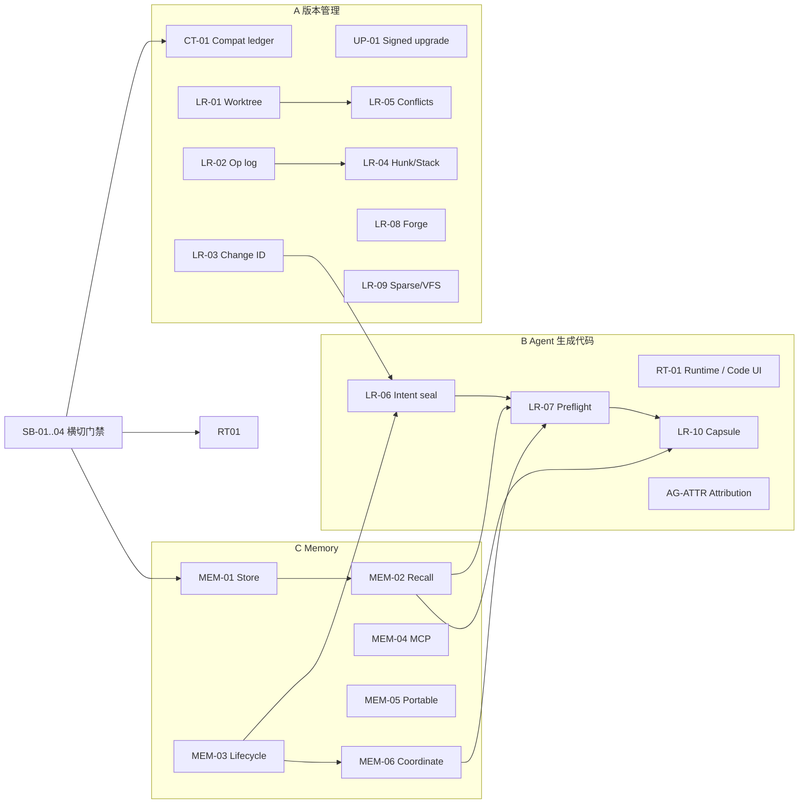

# Libra 长期功能规划

## 文档职责与维护协议

本文是 Libra 不绑定具体发布日期和版本号的长期能力组合路线图。它回答「哪些能力值得长期投资、为什么、依赖什么、何时具备进入日期计划的条件」，不是 release 承诺、owner 清单或逐项实施任务表。具体设计、迁移、拆分、发布和回滚只进入按日期计划或后续 RFC/ADR。

**本次改版：2026-09-03（第十次）竞品审计。** 审计机已从 macOS（`/Volumes/Data`，第九次）切换至 Linux（Arch）；旧路径口径作废，以审计机 `$COMP_ROOT` 为准——这是全文唯一允许出现旧路径的位置。核心变化：快照按迁移后路径与仓库集合重写（36 仓，集合变动 12 行）；UP-01/RT-01 推进「已实现」，LR-02/SB-02/SB-04 推进「实施中」；SB 表新增状态列；日期计划索引补 `plan-20260827/0830` 并规范化状态；竞品安全修复全部归入既有 SB 判据，本轮无新增编号、无优先级升降。

状态定义：

| 状态 | 含义 |
|---|---|
| 候选 | 有问题线索，但 Libra 缺口、架构适配或证据尚不足 |
| 已验证 | 已同时核对竞品证据与 Libra 当前源码/测试，确认问题和可执行缺口真实存在 |
| 已排期 | 已有按日期计划覆盖该项的明确范围，并从本文链接 |
| 实施中 | 日期计划已有已合入和未完成切片，长期完成判据仍未全部满足 |
| 已实现 | 当前可发布版本中的代码、测试、用户/兼容文档共同证明完成判据已满足 |
| 已替代 | 原问题仍有效，但由另一项或更合适的机制承接 |
| 不采纳 | 经审计确认不适合 Libra，保留编号与理由 |

只有当前 checkout 的代码、测试、兼容性与用户文档，以及可发布版本证据共同成立时，才能标记「已实现」。日期计划写完、竞品已有、存在 schema 或文档声明都不构成实现证明。编号一经引用不重编号。

## 规划原则

1. **三类分工清晰。** 版本管理回答「代码与历史如何正确」；Agent 生成代码回答「Agent 如何安全地改代码并可追溯」；Memory 回答「跨会话/跨 Agent 如何记住并召回工程判断」。三者共享 SQLite、对象库、稳定错误码与 `--json`，但不互相替代事实源。
2. **开发者价值优先于命令数量。** 不以 Git flag parity 或竞品功能清单长度衡量进展。
3. **Libra-native，不复制竞品实现。** 复用 Git 对象/pack 兼容、SQLite 可变状态、AgentRuntime、sandbox、cloud。
4. **Git 互操作仍是底线。** 扩展元数据可以是 Libra 专有，但普通提交、对象传输和远端协作不能无故破坏 Git 兼容。
5. **所有 mutation 必须可观察、可恢复。** 进入 operation log；具备 preview、原子提交与失败恢复。
6. **机器接口先于交互外壳。** 先冻结 Rust API 与 `--json`/`--machine`，再做 Web/TUI。
7. **逻辑身份与存储身份分离。** commit OID 是内容身份；change / intent / review / memory / capsule 使用稳定逻辑身份。
8. **共享数据必须经过安全发布。** 原始 prompt、tool call、transcript、私有路径不得因写入对象库就自动成为团队可读数据。
9. **先确定性、后智能化。** preflight、hunk identity、overlap、recall 先提供确定性基线；LLM 只作为带 provenance、可撤销的增强层。
10. **计划状态必须据代码更新。** 每次实施前重核 `src/`、`COMPATIBILITY.md`、命令文档与测试。

---

## 本次竞品审计快照

审计时间：**2026-09-03（第十次）**。审计机：Linux（Arch/Omarchy），`git 2.55.0`，`libra 0.22.10`；Libra 主仓 `/run/media/genedna/data/libra`（HEAD `b800de7`），竞品根 `/run/media/genedna/data/competition`（第九次在 macOS 执行，旧路径口径作废）。范围严格限定为竞品根下直接两层仓库（36 个 Git + 0 Libra；`cursor/` 为空目录）。Git 仓库在 `git status --porcelain` 为空且有 upstream 时 `git fetch --prune` + `git merge --ff-only @{u}` 两步更新。本轮 9 个 fast-forward、25 个已是最新、2 个 `blocked-forced-update`（`git/git`、`jj`：远端非检出分支 forced update，本地 HEAD 未证明远端最新）。`blocked-*` 只表示本地 revision 可读，**不**表示已更新到远端最新。仓库身份按规范化 remote 键匹配、目录名只作展示；集合变动见下附表（本地缺失 5、目录改名 4、首次纳入 1、基线重置 1、类型变化 1、空目录 1）。

| 竞品（目录） | remote | 类型 | 归类 | 分支 | 上次 revision | 审计 revision | 更新结果 | 增量/覆盖 | 证据入口（≤80 字） |
|---|---|---|---|---|---|---|---|---|---|
| `facebook/sapling` | facebook/sapling | Git | 版本管理 | `main` | `1124acac343` | `8395cae28` | **fast-forward** | +239 / 5% | privhelper 断连死锁修复 `bf0537023d6`（E2）；pending dirstate 门控；NFS AUTH_SYS root/wheel 阻断 |
| `jj-vcs/jj` | jj-vcs/jj | Git | 版本管理 | `main` | `033f381a7` | `c09b0c337` | **blocked-forced-update** | +31 / 100% | stacked_table 并发写丢失修复 `0a9b86970`（E2）；immutable_heads 纳入 untracked remote tags |
| `gitbutlerapp/gitbutler` | gitbutlerapp/gitbutler | Git | 版本管理 | `master` | `e4e8b7f316` | `32dd13413` | **fast-forward** | +226 / 6% | 未提交区 ID `zz`→`@` breaking（Agent 面向 ID 契约）；committed hunk mutation |
| `gitbutlerapp/grit` | gitbutlerapp/grit | Git | 版本管理 | `main` | `dfb079967` | `dfb079967` | up-to-date | +0 / 沿用 | 上游 Git 套件兼容治理（CT-01 参照） |
| `EpicGames/lore` | epicgames/lore | Git | 版本管理 | `main` | `ace4756` | `82dcce98e` | **fast-forward** | +80 / 36% | 目录遍历检查修复 `03dbc5f`（E2）；gRPC TLS 误用 CA cert；QUIC 准入上限 |
| `git/git` | git/git | Git | 版本管理（参考基线） | `master` | `2c3adbb2c4` | `1630431f` | **blocked-forced-update** | +54 / 81% | `get_oid_with_context_1()` UAF `0bb83c5f47`（E2）；ODB missing-vs-corrupt 区分；`repack --drop-filtered` |
| `go-git/go-git` | go-git/go-git | Git | 版本管理（架构参考） | `main` | `e37764fd` | `52f84ef3e` | **fast-forward** | +1 / 100% | commitgraph 编码器 `ErrParentNotInIndex` `2ef9e4b0`（E2）：堵静默写 index 0 |
| `go-git/go-billy` | go-git/go-billy | Git | 版本管理（架构参考） | `main` | `7bd0594` | `7bd0594` | up-to-date | +0 / 沿用 | FS 抽象与 capability |
| `entireio/forgemark` | entireio/forgemark | Git | 版本管理（协作参考） | `main` | `47f57bf` | `47f57bf` | up-to-date | +0 / 沿用 | Forge metadata |
| `dolthub/dolt` | dolthub/dolt | Git | 版本管理（相邻） | `main` | `70da3e6be4` | `3ca268096` | **fast-forward** | +72 / 26% | prolly key 内地址字段防带外 GC / push 失败（数据丢失，E2）；submodule 未更新 |
| `lorevcs/lore` | lorevcs/lore | Git | 版本管理（相邻） | `main` | `1fd2ea9` | `1fd2ea9` | up-to-date | +0 / 沿用 | intent 记录（单人项目） |
| `nervosys/Lit` | nervosys/lit | Git | 版本管理（相邻） | `master` | `a930e44` | `a930e44` | up-to-date | +0 / 沿用 | CHANGELOG 1.6.0 自述 `rotate-key` 从未成功运行——加密声明未经验证反例 |
| `treeverse/lakeFS` | treeverse/lakefs | Git | 版本管理（相邻） | `master` | `4bb11638e` | `4bb11638e` | up-to-date | +0 / 沿用 | CHANGELOG v1.86.0 GHSA-gf2q-q6wc-x7fm（S3 gateway 授权绕过，E3 沿用） |
| `tobi/walgit` | tobi/walgit | Git | 版本管理（相邻，首次纳入） | `main` | —（首次纳入） | `6d8fa54ba` | 首次纳入 | 15 条 / 20% | 服务端 git hosting：仓库删除需 admin `527c7d1`（E2）；对象存储 WAL + lease |
| `git-ai-project/git-ai` | git-ai-project/git-ai | Git | Agent 生成代码（相邻） | `main` | `793066013` | `f8e39c2c8` | **fast-forward** | +107 / 59% | v2 迁移事务原子化 + UNIQUE 去重 `1bc9d49e2`（E2）；token_usage/daemon 遥测热区（不采纳）；submodule 未更新 |
| `xai-org/grok-build` | xai-org/grok-build | Git | Agent 生成代码 | `main` | `c2ad97f` | `72a61251` | **fast-forward** | +5 / 100% | monorepo 同步：`permission/managed_policy`（签名 requirements）、`xai-tty-utils/kill_on_drop.rs` |
| `getcursor/cursor` | getcursor/cursor | Git | Agent 生成代码（相邻） | `main` | `654b1b4` | `654b1b4` | up-to-date | +0 / 沿用 | issue 信号源，无产品源码 |
| `mainline-org/mainline` | mainline-org/mainline | Git | Agent 生成代码 | `main` | `5704305` | `5704305` | up-to-date | +0 / 沿用 | intent seal、preflight、hook 预算 |
| `StepzeroLab/research-git` | stepzerolab/research-git | Git | Agent 生成代码 | `main` | `62bcdf5` | `62bcdf5` | up-to-date（类型 Libra→Git） | +0 / 沿用 | Feature Capsule、recall/compose；LLM 承担 reapply 非确定性算法 |
| `letta-ai/letta-code` | letta-ai/letta-code | Git | Agent 生成代码 | `main` | `1e17af70` | `e356d4068` | **fast-forward** | +88 / 40% | shell 尾缀 `&&`/`||` 视为不可解析堵 allow-rule 绕过 `3785e254`（E2）；memory 限额强制 `9047f71c`（E2） |
| `letta-ai/letta-agent-sdk` | letta-ai/letta-agent-sdk | Git | Agent 生成代码 | `main` | `741107b` | `9ae7b8792` | **fast-forward** | +19 / 100% | cloud sandbox 仓库可锁定完整 commit SHA（LR-06 pin 相邻）；dispose 释放资源 |
| `letta-ai/trajectory` | letta-ai/trajectory | Git | Agent 生成代码 | `main` | `21ae92d` | `21ae92d` | up-to-date | +0 / 沿用 | transcript 归一化 |
| `letta-ai/skills` | letta-ai/skills | Git | Agent 生成代码 | `main` | `16352df` | `16352df` | up-to-date | +0 / 沿用 | 全提示词（§1.3 排除路径） |
| `letta-ai/agent-file` | letta-ai/agent-file | Git | Agent 生成代码 | `main` | `78212eb` | `78212eb` | up-to-date | +0 / 沿用 | `.af` 可移植格式 |
| `deepseek-ai/deepseek-harness` | deepseek-ai/deepseek-harness | Git | Agent 生成代码（相邻） | `master` | `b150a551b8` | `76fda7297` | **fast-forward** | +1360 / 20% | session-persistence handle-based 重构等 5 个 breaking；`session/*` 事件面未变，Libra bridge 依赖仍成立 |
| `diegoxtr/ctx-open` | diegoxtr/ctx-open | Git | Memory（相邻） | `main` | `862e12b` | `862e12b` | up-to-date | +0 / 沿用 | 认知对象版本化（source-available，概念参考） |
| `memorax-ai/memorax-code` | memorax-ai/memorax-code | Git | Memory（相邻） | `main` | `db0ed30` | `acd6f1614` | **fast-forward** | +77 / 43% | 8h 自动更新替换进程（无验签证据，UP-01 反例）；token 可来自 query string（`request.ts` 现状复核，SB-02 反例） |
| `rekal-dev/rekal-cli` | rekal-dev/rekal-cli | Git | Memory | `main` | `aace7a29` | `aace7a29` | up-to-date | +0 / 沿用 | git-native 会话记忆（`.rekal/` 为 gitignored 本地 DuckDB，附录 B 更正口径） |
| `rohitg00/agentmemory` | rohitg00/agentmemory | Git | Memory | `main` | `e04ba88` | `e04ba88` | up-to-date | +0 / 沿用 | 四层记忆、混合检索（主要证据源） |
| `MachineWisdomAI/fava-trails` | machinewisdomai/fava-trails | Git | Memory | `main` | `6653f9f` | `6653f9f` | up-to-date | +0 / 沿用 | jj 后端共享记忆、Trust Gate |
| `ruvnet/agentic-flow` | ruvnet/agentic-flow | Git | Memory | `main` | `d3735a3` | `d3735a3` | up-to-date | +0 / 沿用 | submodule 未更新；宣传性文档为主 |
| `graphwisdom/perstate` | graphwisdom/perstate | Git | Memory | `master` | `95e27e3` | `95e27e3` | up-to-date | +0 / 沿用 | 反例：push+rebase 重试非并发安全模型 |
| `matrixorigin/Memoria` | matrixorigin/memoria | Git | Memory | `main` | `efd3d65` | `627934261` | **fast-forward** | +6 / 100% | MCP ping 处理修复；MatrixOne 兼容 |
| `sachinsharma9780/memweave` | sachinsharma9780/memweave | Git | Memory | `main` | `2ff82df` | `2ff82df` | up-to-date | +0 / 沿用 | Markdown+SQLite 索引 |
| `sl4m3/ledgermind` | sl4m3/ledgermind | Git | Memory（反例） | `main` | 99220d1（不在本地历史） | `4d7d35621` | **fast-forward**（基线重置） | +14 since / 100% | 源码已移除，全部为文档/品牌，本轮只当宣传材料 |
| `sqliteai/sqlite-memory` | sqliteai/sqlite-memory | Git | Memory | `main` | `0f0aede` | `0f0aede` | up-to-date | +0 / 沿用 | submodule 未更新；SQLite 混合检索 |

| 变动类型 | 仓库（目录） | 上次 revision / 当前 HEAD | 说明 |
|---|---|---|---|
| 本地缺失 | `entireio/cli` | 7d16639e / — | 本地缺失（上次 7d16639e；上游状态未验证），不写「已删除」，差距矩阵参照标「沿用（本地缺失）」 |
| 本地缺失 | `entireio/cli-checkpoints` | 0204a02 / — | 本地缺失（上次 0204a02；上游状态未验证） |
| 本地缺失 | `entireio/git-sync` | 3ee99835 / — | 本地缺失（上次 3ee99835；上游状态未验证） |
| 本地缺失 | `agenta-ai/agenta` | 53717db / — | 本地缺失（上次 53717db；上游状态未验证） |
| 本地缺失 | `cursor/agent-trace` | 2754f07 / — | 本地缺失（上次 2754f07；上游状态未验证） |
| 目录改名 | `GitButler/gitbutler` → `gitbutlerapp/gitbutler` | e4e8b7f316 / 32dd13413 | 仅目录名；remote 键一致，正常增量审计 |
| 目录改名 | `GitButler/grit` → `gitbutlerapp/grit` | dfb079967 / dfb079967 | 仅目录名 |
| 目录改名 | `mainline/mainline` → `mainline-org/mainline` | 5704305 / 5704305 | 仅目录名 |
| 目录改名 | `cursor/cursor` → `getcursor/cursor` | 654b1b4 / 654b1b4 | 仅目录名 |
| 首次纳入 | `tobi/walgit` | — / 6d8fa54ba | 首次纳入 HEAD 6d8fa54ba；MIT；提交总数 15、首提交 2026-08-23；窗口=全部 15 条 |
| 基线重置 | `sl4m3/ledgermind` | 99220d1 / 4d7d35621 | 基线重置（上次 99220d1 不在本地历史；上游改写或重克隆，未验证）；增量以 `--since=2026-08-25` 兜底（+14，全为文档/品牌） |
| 类型变化 | `StepzeroLab/research-git` | 62bcdf5 / 62bcdf5 | 类型 Libra→Git；revision 未变，仍可作增量基线 |
| 空目录或普通目录 | `cursor/` | — | 不计入总数 |

待验证账本索引（E1；全量在 `$SCRATCH/pending.tsv`）：

| 关联编号 | repo@sha | 最小验证步骤 |
|---|---|---|
| LR-01 | gitbutler@62c064e61f | 读 reorder 单分支 tip 修复 diff 与测试 |
| LR-09 | sapling@e940b5e47ed | 读 bounded prefetch diff，对照 media/transfer.rs |
| LR-03 | jj@efe0cf178 | 读 immutable_heads 纳入 untracked remote tags 的 diff |
| AG-ATTR | git-ai@7ace11b09 | 读 codex checkpoint 按 rollout 文件名键控的 diff |
| LR-02 | deepseek@4553c9d957 | 读删除 SQLite persistence backend 的 diff |
| MEM-03 | memorax@80123b9 | 读拒绝 turn ID 冲突写记忆的 diff 与测试 |

| 审计日期 | 仓库数 | 更新摘要 | 路线图结论 |
|---|---:|---|---|
| 2026-09-03（第十次） | 36（36 Git + 0 Libra） | 9 个 fast-forward（sapling、gitbutler、lore、go-git、dolt、git-ai、grok-build、letta-code、letta-agent-sdk、memorax-code、Memoria、ledgermind 中 9 个达 fast-forward，其余 up-to-date）、25 个已是最新、2 个 `blocked-forced-update`（git/git、jj）；集合变动 12 行（本地缺失 5、目录改名 4、首次纳入 walgit、基线重置 ledgermind、类型变化 research-git、空目录 cursor/） | **UP-01、RT-01 推进为「已实现」（Libra 自身证据驱动）；LR-02、SB-02、SB-04 推进为「实施中」；SB 表新增状态列。** 竞品侧安全/可靠性证据面加厚（jj 并发写丢失、dolt 带 GC 数据丢失、git/git UAF、letta shell 解析绕过、git-ai 迁移原子化、walgit 授权缺口）全部映射到既有 SB-01/SB-02/SB-03/SB-04/MEM-01 补充判据，无新增编号、无优先级升降 |
| 2026-08-25（第九次） | 40（35 Git + 5 Libra） | 15 个 fast-forward（13 Git：sapling、jj、gitbutler、lore、git/git、go-git、dolt、git-ai、grok-build、letta-code、letta-agent-sdk、memorax-code、agentmemory；2 Libra：entireio/cli、git-sync）、23 个已是最新、2 个 blocked（agenta `blocked-timeout`、agent-trace `blocked-network` 远端仍 404）；无新增/删除仓库 | 竞品侧无优先级变化（安全/可靠性证据面加厚：go-git 循环 delta 栈溢出、grok-build shell 写权限 fail-closed、lore 内容尺寸上限、git/git 溢出与 unchecked-returns 加固、entireio redaction fail-closed、memorax 数据隔离与 lineage）——全部为既有 SB/MEM/LR 的补充完成判据或竞品证据，无新增编号。**Libra 自身进展为主**：CT4-01 发布卡执行、FIX-05 B 段 waves 发布；`plan-20260715`（RT-01）关闭；新增 `plan-20260821`（UP-01）、`plan-20260822`（LR-02/LR-03）、`plan-20260825`（B Code provider）；**LR-02/LR-03 由已验证推进为已排期**；更正上版把 `plan-20260822` 误标为 UP-01 的链接 |
| 2026-08-22（第八次） | 40（35 Git + 5 Libra） | 1 个 fast-forward（letta-code）、38 个 up-to-date、1 个 `blocked-network`（agent-trace 远端 404）；新纳入 10 仓库（deepseek-harness、ctx-open、dolt、lorevcs/lore、memorax-code、Lit、rekal-cli、git-ai、lakeFS、cursor/cursor） | **RT-01 推进为实施中、UP-01 改判已排期、MEM-01/02 推进已排期**（均为 Libra 自身进展驱动）；竞品侧 rekal-cli 与 letta-code shared-memory skills 加强 MEM-* 证据；无优先级降级或新增编号 |
| 2026-08-09（第七次） | 30 | 9 个 fast-forward（Lore、Sapling、git/git、GitButler、jj、letta-code、letta-agent-sdk、grok-build、entireio/cli）、20 个已是最新、1 个 `blocked-dirty`（agenta） | **CT-01 由「已验证（下一个执行任务）」推进为「实施中」。** 版本管理侧证据面加厚；Memory 类证据面不变，MEM-01/MEM-02 维持已验证。 |
| 2026-08-07（第六次） | 30 | 2 个 fast-forward（Lore、Sapling）、27 个已是最新、1 个 `blocked-dirty`（agenta）；新纳入 `matrixorigin/Memoria`、`memweave`、`ledgermind`、`sqlite-memory`（4 个 Memory 参考） | **无优先级变化。** Memory 类证据面加厚；CT-01 仍是下一个执行任务，MEM-01/MEM-02 维持已验证。 |
| 2026-08-07（第五次） | 26 | 1 个 fast-forward（Lore）、24 个已是最新、1 个 `blocked-dirty`（agenta）；首次按三类重组；新纳入 `letta-ai/*`（5）与 `rohitg00/agentmemory` | **结构重组。** Memory 升格为第一类长期能力（`MEM-*`）；CT-01 仍是版本管理类下一个执行任务；MEM-01 为 Memory 类首个验证任务。 |
| 2026-08-02（第四次） | 20 | 9 个 fast-forward、10 个已是最新、1 个 blocked-dirty | 无优先级变化 |

**本次结论：** 本轮最重要的路线图变化来自 **Libra 自身**：UP-01 四证据齐备（`895589d` 手动升级命令 + `upgrade_auto_test` 31 fn + `docs/commands/upgrade.md`/`LBR-UPGRADE-001` + tags 至 `v0.22.10`）推进「已实现」；RT-01 经 DF-05..08（SSE v1 物理移除 `a643dfb`，v0.21.28/v0.21.29/v0.22.0 发布）规范化为「已实现」；LR-02 的 OL-01 worktree I/O 已合入（`dad35f2`）推进「实施中」。竞品侧没有推翻既有优先级的新能力：安全/可靠性修复（jj `0a9b86970` 并发写丢失、dolt `01dea76505` 带 GC 数据丢失、go-git `2ef9e4b0` 静默损坏、git/git `0bb83c5f47` UAF、letta-code `3785e254` shell 解析绕过、git-ai `1bc9d49e2` 迁移原子化、sapling `bf0537023d6` 死锁、walgit `527c7d1` 授权缺口）全部作为既有 **SB-01/SB-02/SB-03/SB-04/MEM-01** 的补充完成判据或竞品证据吸收；不适用项（git-ai token_usage 遥测、memorax 无验签自动更新、deepseek ApiProxy 删除形态）只进快照与「不进入本长期优先队列的项」。Libra 自身进展比竞品更新更影响优先级：下一个执行任务顺延为 CT-01 收尾与 LR-02/LR-03（`plan-20260822`）。

Top-5 最重要差距（两榜合成）：

| 排名 | 榜 | 关联编号 | 差距一句话 | S/D/X/U/C/E | 分 | 竞品证据 | Libra 证据 | 动作 |
|---|---|---|---|---|---:|---|---|---|
| 1 | A | SB-01 | 网络协议路径仍可被畸形输入触发 panic：`read_pkt_line` 生产 `expect/panic!`，三处 pkt-line 读取无 `len<4` 下界 | 2/2/2/2/2/E3 | 10 | jj@0a9b86970（E2）、dolt@01dea76505（E2）、go-git@2ef9e4b0（E2） | `src/git_protocol.rs:90,92`；`src/command/fetch.rs:3677`、`src/internal/protocol/git_client.rs:151`、`src/internal/protocol/ssh_client.rs:243` | 补充完成判据 |
| 2 | A | SB-02 | MCP authorizer 生产未安装（默认 None=不鉴权），shell 写重定向为 `needs_human` 非 fail-closed | 2/1/2/2/2/E3 | 8 | letta-code@3785e254（E2）、walgit@527c7d1（E2）、memorax-code（request.ts 现状反例） | `src/internal/ai/mcp/server.rs:42`、`src/internal/ai/tools/utils.rs:130` | 更新状态（已验证→实施中）+补充完成判据 |
| 3 | A | SB-03 | D1 迁移逐语句执行、无事务、无账本，且 publish 路径并存 wrangler 第二套 runner | 1/2/1/1/2/E2 | 7 | git-ai@1bc9d49e2（E2：每脚本事务 + UNIQUE 去重 + durable reconcile flag） | `src/utils/d1_client.rs:3286`、`src/command/publish.rs:627` | 补充完成判据 |
| 4 | B | MEM-01 | VCS-native Memory 存储与隐私基线无任何实现（模块/命令/FTS5 全缺失） | 1/1/3/3/1/E4 | 7 | letta-code@9047f71c（E2：可配置 memory 限额 pre-commit 强制） | `ls src/internal/ai/memory` 不存在；`src/cli.rs` 无 memory 子命令 | 保持已排期 +补充完成判据 |
| 5 | B | LR-02 | op v1 已发布（`dad35f2` OL-01），但 v2 snapshot/restore 引擎未开始，mutation 覆盖不完整 | 0/1/3/3/1/E3 | 7 | jj@0a9b86970（E2，oplog 并发写丢失同类）+ gitbutler undo/switch 快照（E1） | `src/command/op.rs:41`；`ls src/internal/operation` 不存在 | 更新状态（已排期→实施中）+补充完成判据 |

不做 Top-3（按 (S+D+X) 从「不采纳/延后」候选中取）：

| 排名 | 关联编号/来源 | 内容 | 理由 | E |
|---|---|---|---|---|
| 1 | 不采纳（git-ai） | token_usage / daemon 遥测与计费重摄取（本轮 +107 中 70 文件在 `src/token_usage`、45 在 `src/daemon`） | 与 VCS 长期能力无关；Libra `usage` 统计已覆盖需求 | E1 |
| 2 | 不采纳（memorax-code） | 8h 轮询 npm 自动更新并替换进程（`ca6c46d`/`fed82ea`/`073c006`） | 无验签证据的供应链形态；Libra 升级必须走 UP-01 签名通道 | E2 |
| 3 | — | **不足**：第三条候选（deepseek ApiProxy 删除形态、walgit 服务端 hosting 形态）仅 E1，不足 E≥2 门槛 | 本轮证据深度未达不做列表门槛，留待验证账本 | — |

本轮竞品要点（更新增量审计）——6 类 × {发现数, 值得借鉴数, 进入 plan-long 数}：

| 类别 | 发现 | 值得借鉴 | 进入 plan-long |
|---|---:|---:|---:|
| security | 16 | 8 | 3 |
| reliability | 22 | 12 | 3 |
| bugfix | 17 | 6 | 0 |
| compat-migration | 12 | 6 | 1 |
| improvement | 24 | 5 | 0 |
| feature | 18 | 4 | 1 |

本轮进入 plan-long 的竞品要点（≤12 条；对应差距矩阵动作 ≠ 保持的行）：

- **SB-01** jj `0a9b86970`：stacked_table `get_head_locked` 合并多 head 后保留新表标记——并发写丢失修复（E2，含 2 个新测试）；Libra oplog/snapshot 须同类「合并后保留新状态」判据。
- **SB-01** dolt `01dea76505`+`410af9976f`：prolly key 内地址字段缺失导致带外值被错误 GC 且无法 push——数据丢失级 schema 缺陷（E2）；Libra 引用字段须在节点内自描述。
- **SB-01** go-git `2ef9e4b0`：commitgraph 编码对不在 index 的 parent 由 nil 解引用/静默写 index 0 改为 `ErrParentNotInIndex`（E2）——静默损坏→显式失败。
- **SB-02** letta-code `3785e254`：尾缀 `&&`/`||` 视为不可解析，堵 allow-rule 绕过（E2，`shell-command-normalization.test.ts`）；Libra shell 权限解析须拒绝「不可解析即放行」。
- **SB-02** walgit `527c7d1`：仓库删除由 require_write 收紧为 require_admin（E2）；破坏性操作的授权档位须独立于写权限。
- **SB-03** git-ai `1bc9d49e2`：迁移逐脚本事务化 + 跨会话 UNIQUE 去重 + durable `needs_reconcile` flag（E2）；Libra D1 逐语句迁移正是其反面。
- **SB-04** sapling `bf0537023d6`：privhelper 连接断开自死锁（锁内同步回调重入），修复后 pending 请求显式失败（E2）。
- **MEM-01** letta-code `9047f71c`：可配置 memory 限额（字符/深度）在 pre-commit 强制（E2）；MEM 存储须有写入上限。
- **compat-migration** gitbutler `a15c348f5b`：未提交区 ID `zz`→`@` breaking——Agent 面向 ID 契约变更需迁移窗口（E1，待验证账本延伸）。
- **feature** memorax-code `ca6c46d`：8h 自动更新替换进程、无验签证据（E2，UP-01 反例）——不采纳，见「不进入本长期优先队列的项」。
- **security** memorax-code `request.ts`（现状复核）：token 可来自 query string（E2 反例）——认证 token 不得进入 URL。
- **reliability** git-ai `1bc9d49e2`（同 SB-03 行）与 lore `03dbc5f`（目录遍历逐组件检查，E2）归并记录，避免重复计数。

Libra 自身（HEAD `b800de7`，`Cargo.toml` version `0.22.10`，审计日期 2026-09-03；自上次审计 `dadc5a4e6` 起 +200 提交，已发布版本 = `v0.22.10`，未发布提交 = `libra log --oneline v0.22.10..HEAD` 共 5 条）：

- **CT-01 / plan-20260729**：仍「实施中」。本轮增量：测试并行度与序列注册（`a8218ac` nextest CI、`315132a` 串行键转换、`b6959e5` TA-01 fail-closed 分类器）；**DEFER-09 已由 plan-20260825 TA-01/02 + plan-20260827 NP-00 承接关闭**（非「转 blocked」，更正上版表述）；剩余 S4 族 waves 与 S2 离线发现器（DEP-01 + SB-04 前置）。
- **UP-01 / plan-20260821**：**已实现（四证据齐备）**——代码 `895589d`（手动 `libra upgrade`）+ 全部 C-T1..C-T4 修复轮（`2ea10cc` fail-closed Ed25519、`a0cb725` OIDC publish、`4bb5672` generation floor、`fc9c203` trust root）；测试 `upgrade_auto_test`（31 fn）等；文档 `docs/commands/upgrade.md`、`COMPATIBILITY.md:118`、`docs/error-codes.md LBR-UPGRADE-001`、`release-signing-auto-upgrade.md`（D1–D10）；已发布 tags v0.22.1/v0.22.2/v0.22.6..v0.22.10（D10 首签随 v0.22.7，closeout `00bc815`）。文档债：CHANGELOG 缺 0.22.1..0.22.10 条目（不阻断「已实现」，登记为文档债）；残留 DEFER-02/03/04/05/06。
- **RT-01 / plan-20260715**：状态规范化「已完成→已实现」。DF-05..08 全部落地：SSE v2 默认（`0cd2cf2`）、skill activation provider 消费（`e8c6947`）、SSE v1 物理移除（`a643dfb`，breaking）、自动化消费者迁移（`b598734`）；发布 v0.21.28（`2fbbb5a`）/ v0.21.29（`0e20719`）/ v0.22.0；`web/sse_wire.rs` 已移除、Cargo.toml 无 ratatui/crossterm。残留 DEFER-02（独立 `libra mcp --stdio`）、DEFER-03（MCP 授权门→SB-02）、DEFER-04（非 loopback 远程写面）。
- **LR-02/LR-03 / plan-20260822**：**LR-02 推进为「实施中」**——v1 已发布：`src/command/op.rs:41 OpCommand{Log,Show,Restore}`、`operation_wrapper.rs` with_operation_log、五表 schema、`command_test::op_test`（22 test）；OL-01 worktree I/O 已合入（PR #460 merge `dad35f2`，`src/internal/worktree_io/`）。v2 未开始：`ls src/internal/operation` 不存在、`RepoViewV2`/`WorkspaceSnapshotV2`/`RestoreEngine` 零命中、OL-02..OL-15 pending。LR-03：`[OL-00]` spike 状态为 `in-progress / remote-pending`（`plan-20260822.md:650`，**非「已冻结」**，更正）；`grep -rn 'ChangeId\|change_id' src` 除 `log/trailer.rs` 外 = 0。
- **SB-02 / plan-20260830**：SBX-01..05 已合入并收口（`edd9eba` macOS scratch bind、`c35210d` seatbelt OpenCode export、`08466e0` transform、`088ee14` seam fields、`0e6ab63` capture 验证；closeout 见计划修订史 2026-09-01，DEFER-SBX-06 发布步延后）——**SB-02 推进为「实施中」**；authorizer 生产仍未安装（`server.rs:42` None=allow-all、`set_authz` 仅测试调用）。
- **SB-04 / plan-20260827**：NP-00..05 全部 done（nextest CI `a8218ac`、串行注册 `315132a`/`b6959e5`、`process_terminate.rs` ProcessTerminateGate、`kill_on_drop`）——**SB-04 推进为「实施中」**；child scope 抽象（ProcessScope 同类）仍缺失（`grep -rn ProcessScope src tests` = 0）。
- **B 类 / plan-20260825**：PS-00..PS-06 全部落地（`--provider` 显式解析 `0069902` breaking、`code.defaultProvider` `0eae7bb`、凭据三态 `042476b`、provenance `17bbe2b`）；TA-04..07 并行度杠杆落地。
- **LR-09**：FastCDC media transport 已合入（PR #461 merge `1a590b6`，feat `ca997dd`，feature `fastcdc` 默认 OFF，`src/utils/media/transfer.rs`，`compat_fastcdc_feature_gate_guard`，`COMPATIBILITY.md:116 media`）——本轮此前未记录，已补录。
- **Memory**：M2 计划 `plan-20260819.md` 仍无实现合入（`ls src/internal/ai/memory` 不存在、`src/cli.rs` 无 `memory` 子命令），MEM-01/MEM-02 维持「已排期」。
- **未发布变更（v0.22.10..HEAD，5 条）**：`d57a908` **SSH host key 策略变更**（默认 `ask` 不再强制 `StrictHostKeyChecking=yes`；`ssh.strictHostKeyChecking` 四值）——用户可见的兼容/安全姿态变更，触及「兼容与迁移」「安全与隐私」门禁；`COMPATIBILITY.md` 与 `docs/commands/{clone,fetch,config}.md` 均未记录（`grep -c strictHostKeyChecking` = 0，按 P1 线索处理）；`b800de7` docs(agents) 同步；`ea585f4` fix(ci)；`3b28038` chore(web)；`ff9033b` merge。
- 日期计划对账：磁盘 13 份 `plan-2026*.md`；索引缺 `plan-20260827`、`plan-20260830` 两行（本轮已补）；`plan-20260714` 规范化为「已完成」、`plan-20260821/24/25` 规范化为「已完成」。
- deepseek-harness bridge：`plan-20260818.md` 事实不变；本轮复核 deepseek 上游 `session/created|event|flush|disposed` 事件面仍在（`packages/core/session/src/index.ts` 52–83 行），Libra `agent_bridge/ingress.rs:67` 依赖成立，bridge 无需变更。

---

## 三类能力总览

| 类 | 最要完成（按执行优先） | 既有/新增编号 |
|---|---|---|
| **A. 版本管理** | CT-01 收尾 -> LR-01 收尾 -> LR-02 -> LR-03 -> LR-04/LR-05 -> LR-08 -> LR-09（UP-01 已实现） | CT-01, UP-01, LR-01..05, LR-08, LR-09 |
| **B. Agent 生成代码** | 工程安全 SB-02/SB-04 收口 -> LR-06 -> LR-07 -> LR-10 -> 归因/trajectory -> harness bridge（plan-20260818）（RT-01 已实现） | LR-06, LR-07, LR-10, RT-01, AG-ATTR；横切 SB；日期计划 plan-20260715 / plan-20260818 |
| **C. Memory** | MEM-01 存储与隐私 → MEM-02 混合召回 → MEM-03 巩固/晋升 → MEM-04 MCP 面 → MEM-05 可移植导出 → MEM-06 并行协调 | MEM-01..MEM-06 |

横切工程门禁 **SB-01..SB-04** 适用于三类，不单独占一类名额。

```mermaid
flowchart LR
  subgraph VCS[A 版本管理]
    CT01[CT-01 Compat ledger]
    UP01[UP-01 Signed upgrade]
    LR01[LR-01 Worktree]
    LR02[LR-02 Op log]
    LR03[LR-03 Change ID]
    LR04[LR-04 Hunk/Stack]
    LR05[LR-05 Conflicts]
    LR08[LR-08 Forge]
    LR09[LR-09 Sparse/VFS]
  end
  subgraph AG[B Agent 生成代码]
    LR06[LR-06 Intent seal]
    LR07[LR-07 Preflight]
    RT[RT-01 Runtime / Code UI]
    LR10[LR-10 Capsule]
    AGATTR[AG-ATTR Attribution]
  end
  subgraph MEM[C Memory]
    MEM01[MEM-01 Store]
    MEM02[MEM-02 Recall]
    MEM03[MEM-03 Lifecycle]
    MEM04[MEM-04 MCP]
    MEM05[MEM-05 Portable]
    MEM06[MEM-06 Coordinate]
  end
  SB[SB-01..04 横切门禁]
  SB --> CT01
  SB --> RT01
  SB --> MEM01
  LR01 --> LR05
  LR02 --> LR04
  LR03 --> LR06
  LR06 --> LR07
  MEM01 --> MEM02
  MEM02 --> LR07
  MEM03 --> LR06
  LR07 --> LR10
  MEM02 --> LR10
  MEM06 --> LR07
  MEM03 --> MEM06
```

---

## A. 版本管理

### 竞品角色

| 竞品 | Libra 应学的问题 | 不应照搬 |
|---|---|---|
| Jujutsu | operation DAG、稳定 Change ID、一等冲突、descendant rebase | 放弃 Git 默认互操作 |
| GitButler | 并行 workspace、hunk 归属、change-keyed Forge、diff-anchored 元数据 | 复制其 UI 产品形态 |
| Sapling | Smartlog、提交栈、EdenFS/VFS | 绑定 Facebook 内部部署假设 |
| Lore | 大二进制、sparse/virtual、batch materialization、replica lifecycle | 另起一套对象格式 |
| Grit + git/git | 外部兼容证据账本、conformance 测试模式 | 逐字 vendor GPLv2 `t*.sh` |
| go-git / go-billy | 缺口矩阵、多后端 conformance、FS capability | 用 Go 实现替换 Libra |
| git-sync / forgemark | pack relay、Forge metadata | 替代 Libra remote/cloud |

### A 类最要完成的任务

| ID | 任务 | 优先级 | 状态 | 一句话缺口 |
|---|---|---:|---|---|
| **CT-01** | 上游 Git 套件驱动的兼容性证据账本 | P0 | 实施中 | 首个 t4 wave 与 FIX-01..05 B 段 waves 已合入并发布；**DEFER-09 已由 plan-20260825 TA-01/02 + plan-20260827 NP-00 承接关闭**（更正：非「转 blocked」）；测试并行度已落地（`a8218ac` nextest、`b6959e5`/`315132a` 序列注册）；剩余 S4 族 waves 与 S2 离线发现器（DEP-01 + SB-04 前置）；机制归 [`../gap/grit-gap.md`](../gap/grit-gap.md) GGT-00A |
| **UP-01** | 官方签名自动升级链 | P0 | 已实现 | 四证据齐备：代码 `895589d`（手动 `libra upgrade`）+ `2ea10cc`/`a0cb725`/`4bb5672`/`fc9c203`；测试 `upgrade_auto_test`（31 fn）等；文档 `docs/commands/upgrade.md`、`COMPATIBILITY.md:118`、`docs/error-codes.md LBR-UPGRADE-001`、`release-signing-auto-upgrade.md`（D1–D10）；tags v0.22.1/2/6..10（D10 首签 v0.22.7，closeout `00bc815`）。残留 DEFER-02..06 与 CHANGELOG 0.22.1..0.22.10 条目文档债 |
| **LR-01** | 完整多工作区隔离与并行 Agent 工作区 | P0 | 实施中 | W1–W2/lease/list\|show/doctor（`run_worktree_doctor`、`begin_repair_operation`）已合入；缺 parallel lanes、崩溃矩阵完整性、capture/export ownership 复核 |
| **LR-02** | 全命令 Operation Log、完整快照与 Undo/Redo | P0 | 实施中 | v1 已发布（`src/command/op.rs:41`、五表 schema、`command_test::op_test` 22 test）；OL-01 worktree I/O 已合入（merge `dad35f2`）；v2（`RepoViewV2`/`WorkspaceSnapshotV2`/`RestoreEngine`、OL-02..OL-15）未开始；[`plan-20260822.md`](plan-20260822.md) 已建 |
| **LR-03** | 稳定 Change ID 与历史重写谱系 | P0 | 已排期 | [`plan-20260822.md`](plan-20260822.md)（Change ID v2，CH-*）+ `[OL-00]` sidecar Change ID spike 状态为 `in-progress / remote-pending`（更正：非「已冻结」）；`grep -rn 'ChangeId\|change_id' src` 除 `log/trailer.rs` 外 = 0，实现未开始 |
| **LR-04** | 非交互 Hunk API、归属与 Stack 编辑 | P0 | 已验证 | 有只读 hunk；无稳定 ID、assignment、mutation；gitbutler 本轮把未提交区 ID `zz`→`@` 并支持 committed hunk mutation（Agent 面向 ID 契约变更，E1 线索） |
| **LR-05** | 一等冲突对象与 Modeless Sequencer | P1 | 已验证 | Git-compat conflict 有；versioned conflict object / descendant rebase 无 |
| **LR-08** | Forge/PR/CI 与 Stacked Review | P1 | 已验证 | 无 Forge trait、PR/CI 状态、stack mapping |
| **LR-09** | Materializing Sparse、Partial Clone、VFS Hydration | P2 | 已验证 | sparse-view 只读；hydrate 为 whole-object；无 promisor/VFS；FastCDC media transport 已合入（`ca997dd`，feature `fastcdc` 默认 OFF，`COMPATIBILITY.md:116 media`） |

### A 类完成判据（摘要）

- **CT-01**：按命令族可复算的证据账本入库；`direct`/`adapted`/`declined`/`blocked` 分型；净室边界不被突破；首批 wave 有回归。**当前进度**：首个 t4 wave 与 FIX-01..05 B 段 waves（CT1-01..CT3-06、CTF-P01..P05）已合入；**CT4-01 发布卡已执行**；DEFER-09 已关闭；测试并行度已落地（`a8218ac`）；剩余 S4 族 waves 与 S2 离线发现器待推进。
- **UP-01**：非空 `PRODUCTION_TRUSTED_KEYS`、发布签名 job、官方 install 验签；未签名包 fail closed。**已实现**（v0.22.10 四证据齐备）。
- **LR-01**：linked worktree 的 HEAD/index/sequencer/lease 崩溃与并行矩阵通过；`worktree doctor` 可诊断/修复（doctor/repair 已合入）。
- **LR-02**：生产 mutation 默认进 operation log；snapshot 含恢复所需状态；`op restore` 可验证；restore/undo 不得覆盖已被 worktree checkout 且 ref 不一致的 ref（GitButler `95527608ec` 拒绝此类 oplog 恢复，防数据丢失）；oplog/snapshot 合并并发 head 后必须保留最新已保存状态、不得丢失新写入（jj `0a9b86970` stacked_table 并发写丢失修复，E2）。
- **LR-03**：rewrite 后 review/intent/Forge 仍能锚定同一 change。
- **LR-04**：Agent 可非交互完成 hunk 归属与 stack 编辑，且进 operation log。
- **LR-05**：冲突可作为可版本化对象存在；modeless 继续工作；推送冲突有显式策略。
- **LR-08**：至少一个 Forge 的 PR/CI/stack 状态可从 Libra 机器接口读写。
- **LR-09**：materializing sparse + partial clone 在大仓基准下正确；失败可诊断。

### CT-01 分阶段契约（摘要）

CT-01 的可执行切片与任务卡在 [`plan-20260729.md`](plan-20260729.md)；机制与净室边界在 [`../gap/grit-gap.md`](../gap/grit-gap.md) 的 `GGT-00A`。本文只固定阶段名与准入关系，避免与日期计划漂移。

| 阶段 | 含义 | 本日期计划是否承接 |
|---|---|---|
| **S0** | 范围裁定与合规边界（无生产行为变更） | 是（CT0-*） |
| **S1** | **预先计划的** test-oracle / 兼容前提修复（不是「唯一」可改 Libra 行为的阶段） | 是（前两项：`config` 裸读、`update-ref` 值操作数；`.libraignore` 抑制随 S2 延后） |
| **S2** | 离线 gap 发现器（代码入库、上游语料不入库）；五分列统计随本阶段 | 否（DEFER；前置 DEP-01 许可 + **SB-04**） |
| **S3** | 兼容证据账本 schema 与守卫 | 是（CT2-*） |
| **S4** | 逐族 clean-room wave；**可经评审的 `CTF-0n` 修复迁移暴露的实现缺陷**，wave 在全绿前不得准出 | 是（t4 首个 wave：CT3-*） |
| **S5** | CI 落点与证据面（非默认阻断门） | 否（后续日期计划） |

S4 不要求 S1 全部候选项先发布：每个 wave 只以其候选集实际触及的 S1 项为行为前置。不得把 Grit/上游通过率当作完成判据；排除项必须带 `reason` / `category` / `owner` / `review_date`（实施面见 S3）。

### A 类详细规格入口

- CT-01 阶段契约见上表；任务卡、ADR、净室门与发布模型以 [`plan-20260729.md`](plan-20260729.md) 为准。
- UP-01 / LR-01..LR-05 / LR-08 / LR-09 的细规格以对应日期计划与当前代码复核为准；本文总览只保留状态与一句话缺口。
- 日期计划：[`plan-20260708.md`](plan-20260708.md)、[`plan-20260714.md`](plan-20260714.md)、[`plan-20260729.md`](plan-20260729.md)、[`plan-20260821.md`](plan-20260821.md)（UP-01）、[`plan-20260822.md`](plan-20260822.md)（LR-02/LR-03）、[`plan-20260825.md`](plan-20260825.md)（B 类 `libra code` provider 解析与凭据文案收口；其测试并行度轴由 [`plan-20260827.md`](plan-20260827.md) 承接完成）。

---

## B. Agent 生成代码

### 竞品角色

| 竞品 | Libra 应学的问题 | 不应照搬 |
|---|---|---|
| Entire CLI + checkpoints | session↔commit 链接、refs checkpoint、rewind/resume、multi-agent review、worktree ambiguity | 复制其云端产品与默认 branch 策略 |
| Mainline | sealed intent、commit pin、确定性 preflight、hook 上下文预算 | 「near-100% pin」宣传指标 |
| Grok Build | hermetic runtime、ACP/headless、ProcessScope 子进程回收、fault injection、进程级 git ODB 门控（status/diff 串行 + 快照复用） | 复制 TUI/品牌外壳为 VCS 能力 |
| Letta Code / SDK | 有状态 harness、hooks/permissions、subagent、skill 加载、`EnterWorktree`/`ExitWorktree` 工作区生命周期工具 | 把 Libra 变成通用 chatbot 平台 |
| research-git | Feature Capsule、recall/compose、ablation/provenance | 实验 DSL 绑定单一 Agent |
| agent-trace | 文件/行级 AI 归因互操作 | 未冻结 RFC 前当完成标准 |
| trajectory | 多 runtime transcript 归一为可验证记录 | 强制替换 Libra 既有 capture schema |
| Agenta | prompt/workflow 版本化（相邻） | 当作源码 VCS 对标；且本轮 dirty |

### B 类最要完成的任务

| ID | 任务 | 优先级 | 状态 | 一句话缺口 |
|---|---|---:|---|---|
| **SB-02** | 统一 AI Tool / MCP / sandbox 信任边界 | P1 | 实施中 | SBX-01..05 已合入（共享 SandboxManager transform、macOS seatbelt，plan-20260830）；authorizer 生产仍未安装（`server.rs:42` 默认 None=不鉴权）、shell 写重定向为 `needs_human` 非 fail-closed、secret 隔离仍有缺口 |
| **SB-04** | 测试与子进程资源生命周期隔离 | P1/P2 | 实施中 | nextest CI 与序列注册已落地（`a8218ac`、`315132a`）；child scope（ProcessScope 同类：closed-scope / late-spawn kill / PID-reuse 防护）未统一 |
| **LR-06** | Intent Seal、Intent-Commit Pin、安全团队发布 | P1 | 已验证 | 本地 Intent/Decision/checkpoint 有；seal/pin/白名单 publication 无 |
| **LR-07** | 开工前意图检索与语义冲突 Preflight | P1 | 已验证 | 缺团队 intent projection、确定性 overlap receipt、pre-edit gate |
| **RT-01** | AgentRuntime / Code UI 中立承载（日期计划） | P1 | 已实现 | [`plan-20260715.md`](plan-20260715.md) 完成判据与 Checkpoint A–D 全部满足并经 DF-05..08（v0.21.28/29、v0.22.0 breaking SSE v1 移除 `a643dfb`）收口：Code TUI 已删除、`libra code` 默认 Web Code UI、runtime 为唯一状态机 owner；剩余仅 DEFER-01..10，按各自重启条件独立立项 |
| **LR-10** | Feature/Research Capsule 与实验谱系 | P2 | 已验证 | 有 artifact/skill 捕获；无 capsule lifecycle / compare / ablation |
| **AG-ATTR** | Agent 代码归因与 transcript 归一（候选） | P2 | 候选 | agent-trace / trajectory / **git-ai（行级 agent/model/prompt 归因）**证明互操作需求；先只读导出，不改 Git 对象默认语义 |

### B 类完成判据（摘要）

- **SB-02 / SB-04**：见下文「工程安全基线」；Agent 新 mutation 不得绕过。
- **LR-06**：intent 可 seal；与 commit/change 稳定 pin；团队发布经白名单与 redaction；可撤销/tombstone。
- **LR-07**：开工前确定性 overlap receipt；可注入有界上下文；误报/漏报有可测基线。
- **RT-01**：runtime 与 TUI/Web 解耦（TUI 已退场）；审批/preflight/lease 单一事实源；plan-20260715 完成判据全部满足才算关闭。**已实现**（DF-05..08 收口，v0.22.0）。
- **LR-10**：capsule 可捕获、召回、在今日代码上安全 reapply/remove，并带 provenance。
- **AG-ATTR**：至少一种外部 transcript/归因格式可导入为只读证据；默认不污染 Git 历史。

### B 类与 Memory 的边界

- Agent **session / checkpoint / transcript** 属于 B（执行轨迹）。
- 从轨迹中**巩固出的长期事实、技能、决策偏好**属于 C（Memory）。
- Intent seal（LR-06）发布到团队前，应走 Memory 的晋升/Trust 门禁（MEM-03），避免原始 transcript 直接共享。

---

## C. Memory

### 竞品角色

| 竞品 | Libra 应学的问题 | 不应照搬 |
|---|---|---|
| **agentmemory** | 四层巩固、混合检索（BM25+vector+graph）、hook 自动捕获、token 预算注入、隐私过滤、跨 Agent MCP、遗忘/矛盾解决 | 54 工具堆砌；默认外部 embedding SaaS；与 VCS 脱节的平行数据库 |
| **fava-trails** | draft→Trust Gate→原子晋升、op_log/op_restore、结构化冲突、doctor | 单仓全局锁；把 LLM Trust Gate 当唯一安全边界 |
| **Letta agent-file / MemFS / skills** | 可移植 Agent 状态（`.af`）、git 跟踪的 memory blocks、skill 分层加载 | 把 harness 自改造成产品主线 |
| **perstate** | branch-as-identity、人格/状态持久化场景 | shell 自动 pull/push 当并发安全模型 |
| **agentic-flow** | 编排侧对共享记忆/trajectory 的需求信号 | 宣传性 QuantumDAG；不可移植封装 |
| **Memoria** | 记忆的 snapshot/branch/merge/rollback 与 MCP 面 | 「Git for memory」宣传口径；平行 DB 默认同步 |
| **memweave** | Markdown 文件 + SQLite 索引、零外部服务、recall 基线 | 单机库形态不替代 Libra VCS-native 边界 |
| **ledgermind** | 自演进记忆管理（反例：自主变异不可审计） | 无监督自主改写当默认行为 |
| **sqlite-memory** | Markdown + SQLite 混合检索、离线同步 | 默认上传托管服务 |
| **rekal-cli**（新纳入，Apache-2.0） | git-native 会话记忆全链路：commit 时自动捕获、`.rekal/` 即存储、仅 merged 共享、写入前 secret 脱敏 + home 匿名化、本地背景索引/embedding | 单仓 git-hook 捕获不含对象库/SQLite 双层与 Trust Gate；复制其「raw 会话全量入 git」形态 |
| **ctx-open** / **memorax-code**（新纳入，相邻） | 认知对象版本化（ctx-open，source-available 许可只作概念参考）；npm 记忆层产品形态（memorax-code） | 作为 Memory 主线证据；不复制实现 |

### 为什么现在升格

旧版将 Memory 竞品标为「不新增 LR」。第五次审计后变更理由：

1. agentmemory / Letta MemFS 证明「编码 Agent 的长期记忆」已是独立产品面，不再只是 VCS 的附属注释。
2. Libra 已有 session/checkpoint/skill/intent 捕获，但**没有**可检索的巩固层与跨 Agent 共享召回——LR-07 preflight 会持续缺燃料。
3. Libra 的差异化应是 **VCS-native Memory**：记忆对象、晋升与遗忘进入 SQLite/对象库/operation log，而不是再挂一个与仓库无关的记忆 SaaS。

### C 类最要完成的任务

| ID | 任务 | 优先级 | 状态 | 主要竞品证据 |
|---|---|---:|---|---|
| **MEM-01** | VCS-native Memory 存储与隐私基线 | P0 | 已排期 | agentmemory 管道；fava-trails draft 隔离；**rekal-cli `.rekal/` 本地 DuckDB + 写入前 secret 脱敏/home 匿名化**（更正：`.rekal/` 为 gitignored 本地库，非「入 git」）；letta-code `9047f71c` memory 限额 pre-commit 强制（E2）；M2 计划 [`plan-20260819.md`](plan-20260819.md)（MemoryNote/MemoryEvent、MemoryWriter 单一写入器），尚无实现合入 |
| **MEM-02** | 混合召回与会话注入（有界 token） | P0 | 已排期 | agentmemory BM25+vector+graph + provenance；SessionStart 注入；M2 首切片固定 SQLite FTS5 + `bm25()`（`libra memory search/show/status/rebuild`），尚无实现合入 |
| **MEM-03** | 巩固、衰减、遗忘与团队晋升门禁 | P1 | 已验证 | agentmemory 四层 + decay；fava-trails Trust Gate；rekal-cli「仅 merged 工作才随 push 共享」作为晋升边界证据；memorax-code `80123b9` 拒绝 turn ID 冲突写记忆（E1，待验证账本） |
| **MEM-04** | 经鉴权的 Memory MCP / 机器接口 | P1 | 已验证 | agentmemory 54 tools（规模作反例）；须服从 SB-02 |
| **MEM-05** | 可移植导出（`.af` / MemFS 子集）与 skill 投影 | P2 | 候选 | Letta agent-file、skills、MemFS |
| **MEM-06** | 并行多 Agent 协调 Memory（协调通道） | P1 | 候选 | 并行工作区需求；Libra worktree/lease 基础；复用 MEM-01/03（「新增」标记移入说明：第五次审计后登记的候选能力，非本轮新增） |

### MEM-01：VCS-native Memory 存储与隐私基线

**开发者问题：** Agent 每天产生大量 tool 观察与决策，但重启或换 Agent 后只能靠 `MEMORY.md` 或口头重述；且原始 transcript 含秘密，不能直接当团队记忆。

**目标能力：**

- 以 Libra 仓库为边界，持久化 Memory 记录（逻辑 ID、来源 session/checkpoint、时间、层级、内容摘要、可选 embedding 引用）。
- 写入前强制隐私过滤（密钥、token、`<private>`、凭证路径）；过滤失败则拒绝入库。
- 原始观察与巩固后的事实分层存储；原始层默认私有。
- 所有写入可审计，并可选进入 operation log（至少晋升/删除/遗忘必须）。

**非目标：** 替换云端向量数据库产品；默认上传第三方 embedding；无鉴权的全局共享记忆。

**完成判据：**

- 本地单仓可记录、列出、删除 Memory；秘密探针不出现在存储与日志。
- 与现有 `agent session/checkpoint` 可链接，不复制第二套 session 真源。
- schema/migration 有 forward + 测试；损坏数据 fail loud。
- Memory 存储路径锚定绝对化，不得用 cwd-relative 存数据（agentmemory `e04ba88` 曾因 engine 无 cwd 导致「数据全丢」）。
- 多仓 / worker 级 Memory 数据隔离（memorax-code `5498144` 把 repo-memory worker DB 按仓隔离）。
- redaction 失败路径 fail-closed 为全量脱敏，不泄漏私密（entireio/cli `aa5ddb4`）。
- Memory 写入有可配置上限（单文件字符数、目录深度）且在提交入口强制，超限写入被拒绝（letta-code `9047f71c` pre-commit 强制 memory 限额，E2）。

### MEM-02：混合召回与会话注入

**开发者问题：** 全量塞进上下文既贵又噪声；纯关键词漏语义；纯向量丢文件名/符号。

**目标能力：**

- 确定性基线：路径/符号/BM25（或等价）检索，不依赖外部模型即可工作。
- 可选向量通道与实体图通道；融合排序（如 RRF）并做 session 去重。
- `libra code` / AgentRuntime SessionStart（或等价钩子）按 token 预算注入 top-K；预算可配置且有硬上限。
- `--json` 返回命中、分数分量、来源 citation（可追溯到 observation/session）。

**完成判据：**

- 无 embedding 配置时召回仍可用且可测。
- 注入不超过预算；citation 可人工核验。
- 与 LR-07 preflight 共享同一检索服务，不各写各的。

### MEM-03：巩固、衰减、遗忘与团队晋升

**开发者问题：** 原始观察不能当真理；过时记忆会误导；团队共享需要显式晋升而非默认同步。

**目标能力：**

- 四层或等价模型：working → episodic → semantic → procedural（命名可 Libra-native，语义对齐）。
- 巩固任务可本地、可调度；矛盾检测与 supersession 有确定性规则，LLM 仅增强。
- 衰减/遗忘 API：TTL、重要性、显式 `forget`；遗忘写 tombstone，不假装跨 clone 物理擦除。
- 团队晋升：draft → review/Trust Gate（可插拔，默认确定性规则 + 可选 LLM）→ 白名单 publication；复用 LR-06 安全发布边界。

**完成判据：**

- 巩固与遗忘有单测 + 集成测；晋升失败不泄漏私有原文。
- doctor 可报告记忆健康（膨胀、矛盾、过期）。
- 巩固 / compaction 必须保留 turn lineage 与 provenance 证据，不因压缩丢失溯源（memorax-code `039f2ec`/`1af0359`）。

### MEM-04：经鉴权的 Memory MCP / 机器接口

**开发者问题：** 多 Agent（Claude/Codex/Cursor/…）需要同一记忆面，但开放 MCP 无认证不可接受。

**目标能力：**

- 小而稳定的 Memory tool 面（search/get/put/forget/promote 量级），不是几十个平铺工具。
- 默认 loopback；非 loopback 必须认证 + fail-closed authorizer（SB-02）。
- principal 不来自模型自报；mutation 声明 approval。

**完成判据：**

- deny-all / 角色 authorizer 覆盖全部 Memory tools。
- 与 `libra agent` CLI 同源服务。

### MEM-05：可移植导出与 skill 投影

**开发者问题：** 用户希望带走 Agent 人格/技能子集，或与 Letta 等生态交换，但不想绑定单一 vendor。

**目标能力：**

- 可选导出 Memory/技能子集为开放格式（评估 `.af` 子集或 Libra 自有包）；导入为新私有 draft。
- skill 注册表与仓库内 `.agents/skills` / 捕获 skill 事件投影对齐（已有 `libra agent skill` 基础）。

**非目标：** 完整兼容 Letta 云；自动双向 sync 任意 GitHub memory repo。

**完成判据：** 至少一条导出→清空→导入→召回仍命中的往返测试；文档明确兼容范围。

### MEM-06：并行多 Agent 协调 Memory（协调通道）

**开发者问题：** 多个 Agent 在同一仓库并行执行开发工作时，缺一个共享、有界、可审计、可过期的通道来协调**所有权（谁改什么）**、**移交（做完交给谁）**、**冲突声明（哪里撞了）**与**同步点**；靠猜测、共享文件或 merge 后撞冲突都会造成重复劳动、覆盖与延迟发现。完整设计见 [`tracing/memory.md`](../tracing/memory.md) §19。

**目标能力：**

- 新增保留 namespace `coordination` 与 `MemoryCoordinator` Module（`claim`/`release`/`handoff`/`progress`/`conflict_declare`/`sync_point`），复用 `MemoryWriter` 单一 seam（§4.2.1）。
- 所有权声明用 cell CAS 保证**单写者赢**；协调条目带短 TTL 自动过期，不毒化后续工作。
- `CoordinationView` 在 SessionStart 注入（活跃声明、待处理移交、未解冲突、同步点），TurnEnd 经 Working 缓冲回写。
- 协调条目默认 ephemeral，仅达到晋升门槛（sync-point 复用、handoff 稳定）才经 consolidation + Trust Gate 巩固为持久 note。

**非目标：** 实时消息总线 / agent IM；分布式锁替代（写入冲突仍由 ref CAS / 冲突检测兜底）；默认进入 `default` 持久团队知识；复制 mainline intent-team publication。

**依赖：** MEM-01（存储/隐私）、MEM-03（Trust Gate / 巩固）；与 LR-01 worktree/lease 与 SB-02 授权边界相容。

**完成判据：**

- 单写者赢：并发 `claim` 同一 cell 恰一成功，释放后可重 claim。
- 移交闭环：A handoff → B（或 `any`）在 SessionStart 注入，B ack 后 A 释放。
- 过期不毒化：TTL 过期条目从 `CoordinationView` 排除，历史可审计、不阻塞新 claim。
- 冲突声明触发 `contradicts` 链接并进入隔离；`SecretLike`/`Confidential` 不进协调通道，actor 不信任自报。
- 协调条目从 `refs/libra/memory/*` 可重建；`MemoryCoordinator` 不绕过 `MemoryWriter`。

---

## 工程安全基线（横切）

以下不占用三类产品名额，但是 A/B/C 进入实施与发布前的门禁。

| ID | 主题 | 优先级 | 状态 | 阻断范围 |
|---|---|---:|---|---|
| SB-01 | 消除生产路径可触发 panic | P1 | 实施中 | 网络协议、仓库打开、全部 CLI |
| SB-02 | 统一 AI Tool、MCP、sandbox 信任边界 | P1 | 实施中 | `libra code`、MCP、AgentRuntime、Memory MCP |
| SB-03 | D1 schema 迁移原子性与单一事实源 | P1 | 已验证 | publish、cloud、Worker |
| SB-04 | 测试进程共享状态与资源生命周期隔离 | P1/P2 | 实施中 | CI、并行测试、Agent child 回收 |

要点（完整修复要求仍以代码审计为准）：

- **SB-01**：pkt-line / DB / HEAD / ToolRegistry 全面 fallible；生产 `unwrap`/`expect`/`panic!` CI 守卫；pack/delta 路径须环检测 + 深度上限 + 溢出防护（go-git `e258d68a` 循环 delta 栈溢出、git/git pack/delta `size_t` 宽化 `d50ac11724`/`58f35eea9b`）、对象/内容尺寸上限（lore `07b75f6`/`fd6d075`）、未检查返回值须显式处理（git/git Coverity 批次）、协议 v2 服务端解析须防 NULL 解引用（git/git `serve` NULL-deref 崩溃修复）。Libra 的 `src/utils/storage/load_cost/pack.rs:15` 已有 `MAX_DELTA_DEPTH` + 环检测 + `MAX_VALIDATED_DELTA_BYTES` + `checked_add`，写/`index-pack` 路径须保持同级别防护。**本轮新增**（聚合 ≤3）：① 畸形输入不得 panic——`src/git_protocol.rs:90,92` 生产 `expect/panic!` 与三处 pkt-line `len-4` 无下界（`src/command/fetch.rs:3677`、`src/internal/protocol/git_client.rs:151`、`src/internal/protocol/ssh_client.rs:243`）仍在，须改显式错误；② 并发合并共享结构后必须保留最新已保存状态，不得丢失新写入（jj `0a9b86970`，E2）；③ 编码/引用外部对象时对「不在索引内的引用」显式报错，禁止静默写零值或 nil 解引用（go-git `2ef9e4b0`，E2）；带外引用值须在节点内自描述，防被 GC 误回收（dolt `01dea76505`，E2）。
- **SB-02**：非 loopback MCP 强制认证；authorizer fail closed；shell `env_clear`；写权限对「无法提取目标的写重定向」（`> $OUT`）fail-closed（grok-build `shell_access.rs` `unextracted_write_redirect`）；secret 集中管理面（letta-code `letta secret` `70955190`）；mutating tool 真审批；apply_patch TOCTOU 收敛。**本轮新增**（聚合 ≤3）：① shell 命令解析遇「不可解析片段」（如尾缀 `&&`/`||`）必须 fail-closed 拒绝而非放行（letta-code `3785e254`，E2）；② 破坏性操作的授权档位须独立于写权限（walgit `527c7d1` 仓库删除 require_admin，E2）；③ 认证 token 不得接受来自 URL query string（memorax-code `request.ts` 现状反例，E2）。SBX-01..05 已合入（plan-20260830），authorizer 生产接线仍缺。
- **SB-03**：D1 迁移单一事实源；禁止逐语句半迁移窗口。**本轮新增**：迁移脚本必须逐脚本原子提交（崩溃后不得留下「半迁移永久失败」状态），且去重约束升级须先迁移存量数据（git-ai `1bc9d49e2`，E2）——`src/utils/d1_client.rs:3286` 逐语句执行正是其反面；wrangler 第二套 runner（`src/command/publish.rs:627`）须收口。
- **SB-04**：统一 env/CWD/DB/child/server fixture；对齐 Grok `ProcessScope` 的 closed-scope / late-spawn kill / PID-reuse 防护；中断/取消时清理阻塞子任务与流（letta-code `ff0e2158`/`356d54fb`/`46c23664`、`d490443f` silent stream 恢复）。**本轮新增**：连接/子进程断开不得在持锁状态下触发同步回调重入自死锁；断开后 pending 请求须显式失败并可诊断（sapling `bf0537023d6`，E2）。nextest CI 与序列注册已落地（`a8218ac`、`315132a`）；child scope 抽象仍缺。

---

## 实施顺序

### 下一个执行任务（全局）

1. **CT-01 收尾**（版本管理）：CT4-01 发布卡已执行（v0.21.21）；DEFER-09 已承接关闭；剩余 CT 后续 S4 族 waves 与 S2 离线发现器（DEP-01 + SB-04 前置）。
2. ~~**UP-01**（版本管理）~~：**已实现**（v0.22.10，四证据齐备）；残留 DEFER-02..06 与 CHANGELOG 文档债按各自条件处置，不再占据执行队列。
3. **LR-02/LR-03**（版本管理）：按 [`plan-20260822.md`](plan-20260822.md)（Operation Log v2 + Change ID）执行；v1 已发布（OL-01 合入 `dad35f2`），v2 替换 v1 operation 前保留兼容窗口。
4. ~~**RT-01 收尾**（Agent 生成代码）~~：已实现——plan-20260715 完成判据全勾选并经 plan-20260824（DF-01..DF-09，v0.22.0）收口；后续按 DEFER-08 等重启条件独立立项。
5. **SB-01/SB-02/SB-04 收口**（横切）：SB-01 的 pkt-line 切片已由 [`plan-20260901.md`](plan-20260901.md) 承接（已排期）；SBX（SB-02）与 NP（SB-04）计划已交付一半，authorizer 生产接线与 child scope 抽象是下一批日期计划候选。
6. **B 类 Code provider / 凭据 UX**：plan-20260825 已完成（逐卡 review-PASS，发布按 2026-08-30 豁免裁决闭合）。
7. **MEM-01/MEM-02**（Memory）：按 M2 计划 [`plan-20260819.md`](plan-20260819.md) 执行首个纵向切片；不得在 SB-02 完成前开放非 loopback Memory MCP。
8. ~~deepseek-harness bridge（plan-20260818）按其任务卡排期执行~~：Libra 侧已完成（LB-01..LB-07，`v0.21.1`）；本轮复核 deepseek 上游 session 事件面未变，bridge 无需变更；TypeScript `@libra-tools/dsh-bundle` 在兄弟仓 `REL-TS-01`。M2 不得再抢 `agent bridge` 面。

### 阶段零：工程安全

SB-01 → SB-02 → SB-03 → SB-04（可部分并行；负向门禁见旧审计：禁止新 panic、禁止无认证远程 MCP、禁止第二套 D1 runner、禁止散落测试 env mutation）。

### 阶段一：版本管理安全并发

LR-01 收尾 → LR-02 → LR-03。

### 阶段二：版本管理变更组织

LR-04 → LR-05；并行推进 LR-08 设计。

### 阶段三：Agent 意图与运行时

LR-06 -> LR-07（RT-01 / plan-20260715 已完成，不再是本阶段前置）；Memory MEM-01/MEM-02（plan-20260819 M2 切片）向 LR-07 供数；deepseek-harness bridge（plan-20260818）按任务卡独立排期。

### 阶段四：Memory 巩固与规模

MEM-03 → MEM-04；LR-09；LR-10；MEM-05 / AG-ATTR 按需；MEM-06（并行协调）依赖 MEM-01/03，可与 LR-01 worktree/lease 并行推进设计。

---

## 跨功能验收门禁

### 数据正确性

- refs/HEAD/index/sequencer/worktree/memory 晋升 mutation 要么完整成功要么可验证回滚。
- SHA-1 与 SHA-256；不硬编码 OID 长度。
- side projection 可从真源重建。

### 安全与隐私

- 外部 Agent、Forge、Memory 导入、远端 intent 均不可信。
- 进终端/prompt/对象库/SQLite/日志/MCP/publication 前：cap、validation、redaction、provenance、authorization。
- 不宣称无法证明的跨 clone 物理擦除。

### 机器接口

- 新公共命令稳定 `--json`/`--machine`；新错误稳定 `LBR-*` 并同步 `docs/error-codes.md`。
- 列表有界；检索有 token/超时上限。

### 兼容与迁移

- Git 默认行为变更有显式窗口；新元数据丢失时降级或 fail loud。
- `COMPATIBILITY.md`、命令文档、`tests/INDEX.md`、compat 测试同步。

### 性能

- 热路径不因 Memory/intent 默认全历史扫描。
- 大 transcript/embedding/VFS 流式或内容引用；承接 plan-20260713 DEFER-DR-02 的存储重构约束。

---

## 不进入本长期优先队列的项

- 以「更接近 100% Git flag parity」为唯一理由的长尾 flag（submodule 全家桶、octopus、reftable 互操作等）——登记在兼容文档与 CT-01 账本 `declined`，不自动提级。
- 复制 Agenta 的 prompt/workflow 应用版本平台。
- 复制 Grok/Letta 的完整产品外壳或自修改 harness 哲学。
- 把 fava-trails 单仓锁或 agentmemory / Memoria / ledgermind 的平行 DB 当 Libra 并发/存储模型。
- 逐字迁移 Grit/Git GPLv2 测试资产（CT-01 净室边界）。
- 未冻结的 agent-trace RFC 直接写进默认 commit 元数据。

---

## 日期计划索引

| 日期计划 | 主要归属 | 当前状态 | 说明 |
|---|---|---|---|
| [`plan-20260708.md`](plan-20260708.md) | A（LR-04/05/09 相邻基础） | 已完成 | 主线记为历史完成，活跃残留另行排期；不关闭对应 LR |
| [`plan-20260713.md`](plan-20260713.md) | B（LR-06/07/10 捕获前置） | 已完成 | 不覆盖 seal/preflight/capsule |
| [`plan-20260714.md`](plan-20260714.md) | A（UP-01、LR-01）+ 横切 | 已完成 | Part A 已迁移至 plan-long UP-01（已实现）；Part C W1–W4 已勾选、Part D 残留由 LR-01/LR-02 承接 |
| [`plan-20260715.md`](plan-20260715.md) | B（RT-01） | 已完成 | W0–W6 主线、W5-01 家族（v0.20.0 breaking minor）与正交 WIO-01..03 / W6-03 全部合入；W5-04/05/10 与 W6-01/02 已收口（v0.21.19 正式关闭），完成判据与 Checkpoint A–D 全部勾选；不覆盖 DEFER-01..10（含 SSE v1 物理移除 DEFER-08，部分由 plan-20260824 承接） |
| [`plan-20260729.md`](plan-20260729.md) | A（CT-01） | 实施中 | 首个 t4 wave（含 `t4_port_test.rs`）与 FIX-01..05 B 段 waves（CT1-01..CT3-06、CTF-P01..P05）已合入；**CT4-01 发布卡已执行**（v0.21.21）；DEFER-09 已由 plan-20260825 TA-01/02 + plan-20260827 NP-00 承接关闭；不覆盖 S2 离线发现器、S5 CI 落点与其余族 wave |
| [`plan-20260818.md`](plan-20260818.md) | B（deepseek-harness bridge） | 已完成 | `libra agent bridge --stdio` 唯一标准入站面；LB-01..LB-07 全部合入，protocol v1 的 20 个 method 自 `v0.21.1` 起全部实现（`v0.21.0` 首发）；不覆盖 MCP/旧工具服务器恢复，TypeScript 侧 `@libra-tools/dsh-bundle` 归兄弟仓 `REL-TS-01` |
| [`plan-20260819.md`](plan-20260819.md) | C（MEM-01/02） | 已排期 | M2 研发历程记忆首个纵向切片（MemoryNote/MemoryEvent、MemoryWriter、FTS5/BM25、`libra memory` 命令面）；实现未开始；不覆盖 MCP 面、向量检索、团队同步与 MEM-03..06 |
| [`plan-20260821.md`](plan-20260821.md) | A（UP-01） | 已完成 | 客户端与发布 CI 侧全部落地（trust table、generation floor、`release.yml` OIDC publish、install 验签）；closeout `00bc815`（2026-09-01）；D10 首签随 v0.22.7、v0.22.8 收全绿 run；残留 DEFER-02..06 与 CHANGELOG 0.22.1..0.22.10 文档债 |
| [`plan-20260822.md`](plan-20260822.md) | A（LR-02/LR-03） | 已排期 | Operation Log v2 + Working Copy 快照 + 稳定 Change ID 实施计划（OL-01..OL-12、CH-*）；OL-01 worktree I/O 已合入（merge `dad35f2`）、v1 `libra op` 已发布；`[OL-00]` spike `in-progress / remote-pending`；v2 未开始 |
| [`plan-20260824.md`](plan-20260824.md) | B（RT-01 延后项收口） | 已完成 | 承接 0715 的 DEFER-01/08/10 与 skill activation 残差；DF-01..DF-09 九卡全部 done/complete（文档事实源、fix bridge、SSE v2 默认、skill activation provider 消费、v1 物理删除）；DEP-02 以 v0.21.29 满足，v0.22.0（minor，breaking：SSE 仅支持 wire v2）已发布 |
| [`plan-20260825.md`](plan-20260825.md) | B（Code provider / RT-01 后续） | 已完成 | `libra code` provider 解析与凭据文案收口全部落地（凭据探测三态、`code.defaultProvider`、生效 provider 标签单源、会话 provenance 与 `--resume` 继承）；TA-03/06/07 由 plan-20260827 承接完成；发布面按用户 2026-08-30 豁免裁决闭合（代码已随 v0.21.28..v0.22.0 实际发布） |
| [`plan-20260827.md`](plan-20260827.md) | 横切（SB-04 测试并行度与序列注册） | 已完成 | NP-00..05 六卡全部 complete（nextest 离线 CI face `a8218ac`、串行注册 `315132a`、TA-03/06/07 承接）；D 组 CI 证据环境受阻部分按 backfill 窗口记录 |
| [`plan-20260830.md`](plan-20260830.md) | 横切（SB-02 sandbox export） | 已完成 | SBX-01..05 五卡 done/locally-accepted（共享 SandboxManager transform、macOS seatbelt OpenCode export）；ER-13 全量收口门绿（2026-09-01）；DEFER-SBX-06 发布步延后 |
| [`plan-20260901.md`](plan-20260901.md) | 横切（SB-01 pkt-line fail-closed） | 已排期 | 承接第十次审计 Top-1：PKT-01 帧长校验 helper 与 marker 常量、PKT-02/03/04 家族卡（同步解析器 + discovery 传播/capability 收口 + `PushError::Protocol`）经 PKT-05 统一发布、PKT-04/06/10 边界 marker 适配（`LBR-NET-002`，8 映射点：push-discovery 归 PKT-04，其余 7 点归 PKT-06/10）与异步下界/EOF 语义、PKT-09 push 状态行归类、PKT-08/12/11 git-ssh 下界与 SSH 全部用户可见 stderr 面脱敏、PKT-13 异步头解析 marker 化、PKT-14 push `ng` 输入校验与渲染卫生；ADR-PKT-01 三层机制、ADR-PKT-02 `ng` reason 净化口径、ADR-PKT-03 SSH BatchMode/host-key fail-closed（DEFER-07 终端中介）；Codex/Claude 双评审 PASS 后执行 |
| （待建）Memory 后续日期计划 | C（MEM-03..06） | 未建 | 待用户独立编写；M2 切片落地后按证据再议 |

---

## 已替代 / 不采纳 / 已实现摘要

### 已替代

- 无整项替代。旧表述「Memory 竞品不新增 LR」被本版 **MEM-*** 升格替代；原「相邻参考」判断对实现细节仍有效。

### 不采纳

- 不把 Agenta 当源码 VCS 对标（本轮工作区 clean、可更新，但其本地 revision 前移过程非本审计执行，仍不作强证据）。
- 不把 Grok portable agent definition / TUI 复制为新 VCS LR（可作 SB-02/SB-04 证据）。
- 不采用 Grok hook 通用 fail-open。
- 不采用 Grit 二元 skip 元数据与「绝不修改测试」原文策略；CT-01 用分型账本。
- 不逐字 vendor GPLv2 测试。
- 不采纳未经限定的竞品宣传指标作为完成判据（含 Lit 的「agent-first VCS / 后量子密码」口径、agentic-flow 宣传指标）。
- 不复制 ctx-open（source-available 许可）的认知对象实现，也不复制 dolt 的 SQL 数据版本面为 Libra 能力（相邻参考）。
- 不把 rekal-cli 的「raw 会话全量入 git」当 Libra 存储形态--Libra 保存有界摘要 + 类型化证据引用（M2 计划口径）；rekal 的「仅 merged 才共享、写入前脱敏」作为 MEM-01/03 边界证据。
- 不把 Grok 进程级 git ODB 门控（`git_odb.rs`/`git_gate.rs`）当作 Libra 的并发模型照搬——Libra 的 SQLite 状态与对象库访问路径不同；其「相同 in-flight 工作 join + 短快照复用 + 超时不取消」可作 SB-04 资源生命周期与 LR-01 并行工作区性能的参考。
- 不把 Letta `EnterWorktree`/`ExitWorktree` 的「跨 Agent 锁释放 + 拒绝未合入改动删除」直接复制为 Libra 的 worktree 语义——Libra 已有 `worktree doctor`/lease 模型；其「离开前释放锁、删除前拒绝未合入改动」是 LR-01 完成判据的补充证据。
- 不把 MEM-06 协调通道实现为实时消息总线 / agent IM / 分布式锁替代：它只协调工作所有权（CAS 单写者赢），真正写入冲突仍由 ref CAS / 冲突检测兜底；不承诺实时投递，也不替代 mainline intent-team publication。
- 不把 git-ai 的 `reingest` 遥测 daemon / usage 计费重摄取当 Libra 能力（Libra 已有 `usage` 统计，遥测 daemon 与重摄取 DB 与 VCS 长期能力无关；第十次审计复核：本轮 +107 提交中 `src/token_usage` 70 文件、`src/daemon` 45 文件，均为该面）；其 claude hook 工具名大小写、zizmor CI 门禁为低价值参考，不纳入。
- 不采纳 memorax-code 的 8h 轮询 npm 自动更新并替换进程形态（`ca6c46d`/`fed82ea`/`073c006`，无验签证据）：Libra 升级必须走 UP-01 签名 stable 通道，禁止无验签的运行中自更新。
- 不采纳 deepseek-harness 删除 ApiProxy / SQLite persistence backend 的形态作为 Libra operation 存储参照（`4553c9d957`/`4f00a8b82a`）：Libra operation log 以 SQLite 为真源（规划原则 1/5），其 handle-based seam 只作接口设计参考。

### 已实现

- 无 LR-01..LR-10 / MEM-01..MEM-06 满足全部长期完成判据。部分基础（worktree、operation、Agent capture、sparse-view、Code Web-only UI 默认化）据实记录在总览，不提前关闭整项。
- **CT-01 部分落地**：首个 t4 wave（含 `t4_port_test.rs`）与 FIX-01..05 B 段 waves、**CT4-01 发布卡**均已合入/执行；仍余 S4 族 waves 与 S2 离线发现器，故 CT-01 仍为「实施中」，不标「已实现」。
- **RT-01 已实现**：plan-20260715 完成判据与 Checkpoint A–D 全部满足（v0.21.19 正式关闭），TUI 已退场、`libra code` 默认 Web Code UI、runtime 为唯一状态机 owner；DF-05..08 经 plan-20260824 收口（v0.21.28/v0.21.29/v0.22.0 发布，SSE v1 物理移除 `a643dfb`）；不覆盖 DEFER-01..10（部分按重启条件承接）。
- **UP-01 已实现**（第十次审计登记）：代码（手动 `libra upgrade` `895589d`；fail-closed Ed25519 安装验签 `2ea10cc`；OIDC broker/publish `a0cb725`；generation floor `4bb5672`；trust root `fc9c203`）+ 测试（`upgrade_auto_test` 31 fn、`upgrade_publish_contract_test`、`install_smoke_test`）+ 文档（`docs/commands/upgrade.md`、`COMPATIBILITY.md:118`、`docs/error-codes.md LBR-UPGRADE-001`、`release-signing-auto-upgrade.md` D1–D10）+ 已发布 tags v0.22.1/2/6..10（D10 首签 v0.22.7）。文档债：CHANGELOG 缺 0.22.1..0.22.10 条目，不阻断但须补；残留 DEFER-02..06。

---

## 路线图维护

- 每次竞品审计：同步可安全更新的直接两层仓库；按 **版本管理 / Agent 生成代码 / Memory** 三类归表；dirty/失败按实际 revision 记录。
- **每次竞品更新后，先审计 revision 增量中的新功能、改进、Bug 与安全修复，再分析整体能力**；不得只读最新 commit，也不得只凭 commit message 下结论。
- **审计机切换（Linux 发行版 ↔ macOS）或路径迁移时，快照必须记录机器事实、路径与集合变动**。
- **仓库身份按规范化 remote 键匹配，目录名只作展示**。
- **每编号每轮新增完成判据 ≤2、竞品证据 ≤1；验证性修复（Libra 已有同类防护且有测试）只进汇报账本，不进本文**。
- 每季度或重大架构变更后重核代码与文档；不得复制上次「当前基础」文字代替复核。
- 编号不重编；废弃用「已替代/不采纳」。
- 新候选必须同时给出竞品 revision、Libra 缺口、价值、风险、依赖与最小切入点。
- 进入日期计划时只更新总览状态与链接；完成只以可发布代码+测试+文档为准。
- 日期计划推进（如 CT-01 的 `plan-20260729.md` 首个 wave 合入）时，须据当前 checkout 复核并把对应 LR/CT 状态从「已验证/已排期」推进为「实施中」，不得停留在旧状态；反向亦然：竞品变化只能改竞品证据、完成判据与候选，不得单独改变编号状态（例外见本文状态迁移规则）。
