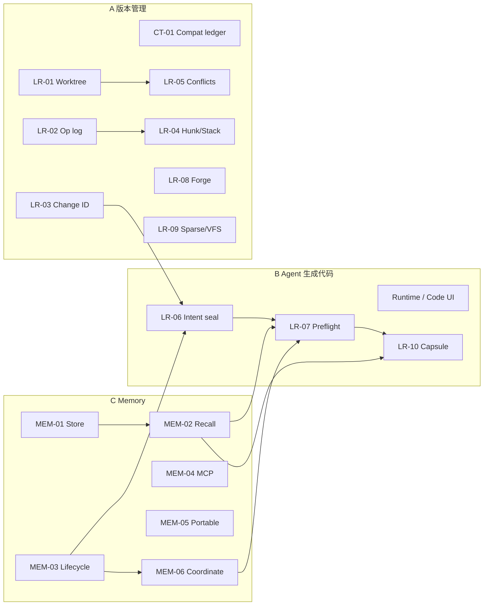

# Libra 长期功能规划

## 文档职责与维护协议

本文是 Libra 不绑定具体发布日期和版本号的长期能力组合路线图。它回答「哪些能力值得长期投资、为什么、依赖什么、何时具备进入日期计划的条件」，不是 release 承诺、owner 清单或逐项实施任务表。具体设计、迁移、拆分、发布和回滚只进入按日期计划或后续 RFC/ADR。

**本次改版（2026-08-25，第九次竞品审计；2026-08-31 执行期更正）**：按 `/Volumes/Data/competition` 下全部直接仓库的最新事实刷新。本轮 15 个仓库 fast-forward（13 Git + 2 Libra）、2 个 blocked（`agenta` `blocked-timeout`、`agent-trace` `blocked-network` 远端仍 404）、23 个已是最新；无仓库被删除或迁移。竞品侧无推翻既有优先级的新能力：安全与可靠性证据面加厚（go-git 修复循环 delta 链导致的 push 栈溢出；grok-build 把 shell 写权限中「无法提取目标的写重定向」改为 fail-closed；lore 为 Fragment 内容尺寸与恶意大 S3 payload 加上限；git/git 大量 Coverity unchecked-returns 与 pack/delta `size_t` 溢出加固；entireio/cli 与 memorax-code 的 redaction / memory 数据隔离 / compaction 保 lineage 加固），均为既有 SB/MEM/LR 的补充完成判据或竞品证据，无新增编号。**本轮最重要的路线图变化仍来自 Libra 自身**：CT-01 的 **CT4-01 发布卡已执行**（`plan-20260729` 首个 t4 wave 与 FIX-01..05 B 段 waves 经 v0.21.2..v0.21.21 发布）；`plan-20260715`（RT-01）已正式关闭；新增日期计划 `plan-20260821.md`（**UP-01** 发布签名）、`plan-20260822.md`（**LR-02/LR-03** Operation Log v2 + Change ID）、`plan-20260825.md`（B 类 `libra code` provider 解析与凭据文案收口），因此 **LR-02/LR-03 由「已验证」推进为「已排期」**，**UP-01 已由「已排期」推进为「实施中」**；并更正上版把 `plan-20260822.md` 误标为 UP-01 的链接错误（实际 UP-01 计划为 `plan-20260821.md`）。MEM-01/MEM-02 仍为「已排期」（M2 计划 `plan-20260819.md`，尚无 Memory 代码合入）。

状态定义：

| 状态 | 含义 |
|---|---|
| 候选 | 有问题线索，但 Libra 缺口、架构适配或证据尚不足 |
| 已验证 | 已同时核对竞品证据与 Libra 当前源码/测试，确认问题和可执行缺口真实存在 |
| 已排期 | 已有按日期计划覆盖该项的明确范围，并从本文链接 |
| 实施中 | 日期计划已有已合入和未完成切片，长期完成判据仍未全部满足 |
| 已实现 | 当前可发布版本中的代码、测试、用户/兼容文档共同证明完成判据已满足 |
| 已替代 | 原问题仍有效，但由另一项或更合适的机制承接 |
| 不采纳 | 经审计确认不适合 Libra，保留编号与理由 |

只有当前 checkout 的代码、测试、兼容性与用户文档，以及可发布版本证据共同成立时，才能标记「已实现」。日期计划写完、竞品已有、存在 schema 或文档声明都不构成实现证明。编号一经引用不重编号。

## 规划原则

1. **三类分工清晰。** 版本管理回答「代码与历史如何正确」；Agent 生成代码回答「Agent 如何安全地改代码并可追溯」；Memory 回答「跨会话/跨 Agent 如何记住并召回工程判断」。三者共享 SQLite、对象库、稳定错误码与 `--json`，但不互相替代事实源。
2. **开发者价值优先于命令数量。** 不以 Git flag parity 或竞品功能清单长度衡量进展。
3. **Libra-native，不复制竞品实现。** 复用 Git 对象/pack 兼容、SQLite 可变状态、AgentRuntime、sandbox、cloud。
4. **Git 互操作仍是底线。** 扩展元数据可以是 Libra 专有，但普通提交、对象传输和远端协作不能无故破坏 Git 兼容。
5. **所有 mutation 必须可观察、可恢复。** 进入 operation log；具备 preview、原子提交与失败恢复。
6. **机器接口先于交互外壳。** 先冻结 Rust API 与 `--json`/`--machine`，再做 Web/TUI。
7. **逻辑身份与存储身份分离。** commit OID 是内容身份；change / intent / review / memory / capsule 使用稳定逻辑身份。
8. **共享数据必须经过安全发布。** 原始 prompt、tool call、transcript、私有路径不得因写入对象库就自动成为团队可读数据。
9. **先确定性、后智能化。** preflight、hunk identity、overlap、recall 先提供确定性基线；LLM 只作为带 provenance、可撤销的增强层。
10. **计划状态必须据代码更新。** 每次实施前重核 `src/`、`COMPATIBILITY.md`、命令文档与测试。

---

## 本次竞品审计快照

审计时间：**2026-08-25（第九次）**。范围严格限定为 `/Volumes/Data/competition/*/*` 直接两层仓库（40 个：35 Git + 5 Libra）。Git 仓库在 `git status --porcelain` 为空且有 upstream 时 `git fetch --prune` + `git pull --ff-only`；Libra 仓库在 `libra status --short` 为空且有 tracking 时 `libra pull --ff-only`。本轮 15 个仓库 fast-forward（13 Git + 2 Libra）、23 个已是最新、2 个 blocked。`blocked-*` 只表示本地 revision 可读，**不**表示已更新到远端最新。`agenta` 的 `libra pull --ff-only` 连续 >90s 超时（每次遗留一条 'merge' 控制 claim，下次运行自动释放并记 failed），本地 revision 等于 `origin/main`，按 `blocked-timeout` 记录，本地 revision 未证明远端最新；`agent-trace` 远端仍 404（`blocked-network`）。

| 竞品 | 归类 | 分支 | 审计 revision | 更新结果 | 证据入口 |
|---|---|---|---|---|---|
| `facebook/sapling` | 版本管理 | `main` | `1124acac343` | **fast-forward** `942dd4c6e38`->`1124acac343`（+59：`sl lint` 栈重写、inode FORGET 批计数修复、bookmark rejection 传播、manifest-tree 多 pair diff、pathmatcher 剪枝） | EdenFS / worktree / Smartlog / `sl lint` |
| `jj-vcs/jj` | 版本管理 | `main` | `033f381a7` | **fast-forward** `9d905d543`->`033f381a7`（+26：以模块重构为主；`run` 树未变不重写提交、colocated index cache-tree 清理、non-colocated HEAD 不跟踪） | operation、ChangeId、一等冲突、converge |
| `GitButler/gitbutler` | 版本管理 | `master` | `e4e8b7f316` | **fast-forward** `a085f7ec59`->`e4e8b7f316`（+121：`but diff` 提升、local target 集成后快进一致性、非 UTF-8 冲突崩溃修复、worktree diff） | workspace、change ID、stack、`but diff` |
| `GitButler/grit` | 版本管理 | `main` | `dfb079967` | 已是最新 | 上游 Git 套件驱动的兼容治理 |
| `epicgames/lore` | 版本管理 | `main` | `ace4756` | **fast-forward** `b563f2b`->`ace4756`（+28：Fragment 内容尺寸上限、S3 恶意大 payload 防护、fragment 树无锁 obliterate、并发读防清空、stage 并行解析） | 大二进制、sparse/virtual、storage lifecycle |
| `git/git` | 版本管理（参考基线） | `master` | `2c3adbb2c4` | **fast-forward** `1a3e64c6c4`->`2c3adbb2c4`（+90：Coverity unchecked-returns 加固、pack/delta `size_t` 溢出加固、拒绝无值 promisor-remote capability、object-info type、流式 ODB、merge-base 有界遍历） | protocol / pack / fsck / `t/` 套件 |
| `go-git/go-git` | 版本管理（架构参考） | `main` | `e37764fd` | **fast-forward** `374c3548`->`e37764fd`（+4：修复循环 delta 链导致 push 栈溢出 #2249） | 兼容缺口矩阵、storage conformance、pack delta |
| `go-git/go-billy` | 版本管理（架构参考） | `main` | `7bd0594` | 已是最新 | FS 抽象与 capability |
| `entireio/git-sync` | 版本管理（Libra） | `main` | `3ee99835` | **fast-forward** `2a61c8c`->`3ee99835`（empty-source 收敛：区分空源与未匹配 scope、verified-empty 源可收敛；Scope=push OR prune） | ref/object 复制、pack relay |
| `entireio/forgemark` | 版本管理（协作参考） | `main` | `47f57bf` | up-to-date（上次记录 `d15ceaf`，+44 提交；User-Agent 标记与 transport context-deadline） | Forge metadata |
| `dolthub/dolt` | 版本管理（相邻） | `main` | `70da3e6be4` | **fast-forward** `afd22743ad`->`70da3e6be4`（+12：bats CI 修复、FK rename 查找修复、expression index 重复键修复） | 「Git for Data」：SQL+版本控制融合 |
| `lorevcs/lore` | 版本管理（相邻，新纳入） | `main` | `1fd2ea9` | 已是最新 | 「version control for intent, not code」；MIT |
| `nervosys/Lit` | 版本管理（相邻，新纳入） | `master` | `a930e44` | 已是最新 | agent-first VCS 宣传（JSON 默认、30 MCP tools、后量子密码声明） |
| `git-ai-project/git-ai` | Agent 生成代码（相邻） | `main` | `793066013` | **fast-forward** `c08de56df`->`793066013`（+23：`reingest` 遥测命令/daemon/DB reset、claude hook 工具名大小写、zizmor CI 安全门禁） | git 扩展：AI 生成代码行级归因；AG-ATTR 相邻参考 |
| `treeverse/lakeFS` | 版本管理（相邻，新纳入） | `master` | `4bb11638e` | 已是最新 | 数据湖对象级版本控制（branch/merge/commit over object store）；Apache-2.0；与 LR-09 大仓对象面相邻 |
| `xai-org/grok-build` | Agent 生成代码 | `main` | `c2ad97f` | **fast-forward** `19d42e3`->`c2ad97f`（+2 monorepo 同步：shell 写权限 fail-closed 写重定向、process_resources、worktree、hunk-tracker） | TUI/ACP/headless、ProcessScope、shell_access、hunk-tracker |
| `entireio/cli` | Agent 生成代码（Libra） | `main` | `7d16639e` | **fast-forward** `6bf587d`->`7d16639e`（redaction fail-closed 全量脱敏、tool_use 提取 modified files、install.sh reftable probe、missed-opportunity 遥测） | session/checkpoint、rewind/resume、review、redact |
| `entireio/cli-checkpoints` | Agent 生成代码（Libra） | `entire/checkpoints/v1` | `0204a02` | 已是最新 | checkpoint object/refs 形态 |
| `mainline/mainline` | Agent 生成代码 | `main` | `5704305` | 已是最新 | intent seal、preflight、hook 预算 |
| `StepzeroLab/research-git` | Agent 生成代码（Libra） | `main` | `62bcdf5` | 已是最新 | Feature Capsule、recall/compose |
| `cursor/agent-trace` | Agent 生成代码 | `main` | `2754f07` | **blocked-network**（`git fetch` 404：远端 `cursor/agent-trace` 仓库仍已删除/迁移） | AI 代码归因规范（RFC）；本地 revision 未证明是远端最新 |
| `cursor/cursor` | Agent 生成代码（相邻，新纳入） | `main` | `654b1b4` | 新克隆（getcursor/cursor 官方仓库；issue-tracker 性质，无产品源码） | Cursor 公开反馈仓库：需求/缺陷信号来源，不作实现证据 |
| `letta-ai/letta-code` | Agent 生成代码 | `main` | `1e17af70` | **fast-forward** `8b65ca27`->`1e17af70`（+38：`letta secret` 子命令、MemFS 同步后才执行 memory、skill 激活暴露 bundle 资源、中断/取消清理、silent stream 恢复） | 有状态 coding harness、skills、hooks、worktree 工具 |
| `letta-ai/letta-agent-sdk` | Agent 生成代码 | `main` | `741107b` | **fast-forward** `8ca21c4`->`741107b`（+2：session model scope 文档、版本 0.7.5） | 有状态 Agent SDK、Cloud 会话恢复、forks |
| `letta-ai/trajectory` | Agent 生成代码 | `main` | `21ae92d` | 已是最新 | 多 runtime transcript 归一化 |
| `deepseek-ai/deepseek-harness` | Agent 生成代码（相邻，新纳入） | `master` | `b150a551b8` | 已是最新 | 全插件架构 agent harness（Cordis）；MIT；Libra 已有对接计划 `plan-20260818.md` |
| `diegoxtr/ctx-open` | Memory（相邻，新纳入） | `main` | `862e12b` | 已是最新 | 「认知版本控制」：goal/hypothesis/decision 作为版本化对象；source-available（非 OSI）许可证 |
| `memorax-ai/memorax-code` | Memory（相邻） | `main` | `db0ed30` | **fast-forward** `071e4d2`->`db0ed30`（+40：repo-memory worker DB 隔离、compaction 保 turn lineage、bounded reminders、Windows cwd/lifecycle 修复） | npm memory 层产品；MIT |
| `rekal-dev/rekal-cli` | Memory（新纳入） | `main` | `aace7a29` | 已是最新 | **git-native 会话记忆**：每次 commit 捕获 AI 会话、`.rekal/` 入 git、仅 merged 工作共享、本地 secret 脱敏 + 本地 embedding；Apache-2.0 |
| `agenta-ai/agenta` | Agent 生成代码（相邻，Libra） | `main` | `53717db` | **blocked-timeout**（`libra pull --ff-only` >90s 超时、遗留 'merge' 控制 claim 后下次运行自动释放并记 failed；本地=origin/main，未证明远端最新，仍不作强证据） | LLMOps |
| `rohitg00/agentmemory` | Memory | `main` | `e04ba88` | **fast-forward** `2d38daf`->`e04ba88`（+1：fresh install 可移植持久化，engine cwd 锚定 + 绝对路径，防「数据全丢」） | 四层记忆、混合检索、MCP、hooks |
| `MachineWisdomAI/fava-trails` | Memory | `main` | `6653f9f` | 已是最新 | jj 上的共享记忆、Trust Gate |
| `ruvnet/agentic-flow` | Memory | `main` | `d3735a3` | 已是最新 | 编排 + agentic-jujutsu 记忆/trajectory |
| `graphwisdom/perstate` | Memory | `master` | `95e27e3` | 已是最新 | git-native personality/state |
| `letta-ai/agent-file` | Memory | `main` | `78212eb` | 已是最新 | `.af` 有状态 Agent 可移植格式 |
| `letta-ai/skills` | Memory | `main` | `16352df` | 已是最新 | 社区 skill 知识库 |
| `matrixorigin/Memoria` | Memory | `main` | `efd3d65` | 已是最新 | 记忆 snapshot/branch/merge/rollback、MCP |
| `sachinsharma9780/memweave` | Memory | `main` | `2ff82df` | 已是最新 | Markdown+SQLite 索引、零外部服务 |
| `sl4m3/ledgermind` | Memory | `main` | `99220d1` | 已是最新 | 自演进记忆管理（反例） |
| `sqliteai/sqlite-memory` | Memory | `main` | `0f0aede` | 已是最新 | SQLite 混合检索、离线同步 |

| 审计日期 | 仓库数 | 更新摘要 | 路线图结论 |
|---|---:|---|---|
| 2026-08-25（第九次） | 40（35 Git + 5 Libra） | 15 个 fast-forward（13 Git：sapling、jj、gitbutler、lore、git/git、go-git、dolt、git-ai、grok-build、letta-code、letta-agent-sdk、memorax-code、agentmemory；2 Libra：entireio/cli、git-sync）、23 个已是最新、2 个 blocked（agenta `blocked-timeout`、agent-trace `blocked-network` 远端仍 404）；无新增/删除仓库 | 竞品侧无优先级变化（安全/可靠性证据面加厚：go-git 循环 delta 栈溢出、grok-build shell 写权限 fail-closed、lore 内容尺寸上限、git/git 溢出与 unchecked-returns 加固、entireio redaction fail-closed、memorax 数据隔离与 lineage）——全部为既有 SB/MEM/LR 的补充完成判据或竞品证据，无新增编号。**Libra 自身进展为主**：CT4-01 发布卡执行、FIX-05 B 段 waves 发布；`plan-20260715`（RT-01）关闭；新增 `plan-20260821`（UP-01）、`plan-20260822`（LR-02/LR-03）、`plan-20260825`（B Code provider）；**LR-02/LR-03 由已验证推进为已排期**；更正上版把 `plan-20260822` 误标为 UP-01 的链接 |
| 2026-08-22（第八次） | 40（35 Git + 5 Libra） | 1 个 fast-forward（letta-code）、38 个 up-to-date、1 个 `blocked-network`（agent-trace 远端 404）；新纳入 10 仓库（deepseek-harness、ctx-open、dolt、lorevcs/lore、memorax-code、Lit、rekal-cli、git-ai、lakeFS、cursor/cursor） | **RT-01 推进为实施中、UP-01 改判已排期、MEM-01/02 推进已排期**（均为 Libra 自身进展驱动）；竞品侧 rekal-cli 与 letta-code shared-memory skills 加强 MEM-* 证据；无优先级降级或新增编号 |
| 2026-08-09（第七次） | 30 | 9 个 fast-forward（Lore、Sapling、git/git、GitButler、jj、letta-code、letta-agent-sdk、grok-build、entireio/cli）、20 个已是最新、1 个 `blocked-dirty`（agenta） | **CT-01 由「已验证（下一个执行任务）」推进为「实施中」。** 版本管理侧证据面加厚；Memory 类证据面不变，MEM-01/MEM-02 维持已验证。 |
| 2026-08-07（第六次） | 30 | 2 个 fast-forward（Lore、Sapling）、27 个已是最新、1 个 `blocked-dirty`（agenta）；新纳入 `matrixorigin/Memoria`、`memweave`、`ledgermind`、`sqlite-memory`（4 个 Memory 参考） | **无优先级变化。** Memory 类证据面加厚；CT-01 仍是下一个执行任务，MEM-01/MEM-02 维持已验证。 |
| 2026-08-07（第五次） | 26 | 1 个 fast-forward（Lore）、24 个已是最新、1 个 `blocked-dirty`（agenta）；首次按三类重组；新纳入 `letta-ai/*`（5）与 `rohitg00/agentmemory` | **结构重组。** Memory 升格为第一类长期能力（`MEM-*`）；CT-01 仍是版本管理类下一个执行任务；MEM-01 为 Memory 类首个验证任务。 |
| 2026-08-02（第四次） | 20 | 9 个 fast-forward、10 个已是最新、1 个 blocked-dirty | 无优先级变化 |

**本次结论：** 竞品格局仍三分；本轮竞品无新能力推翻既有优先级。安全与可靠性证据面显著加厚：多个竞品在本轮修复「未检查返回值 / 整数溢出 / 循环引用 / 无界资源 / 静默失败 / 数据隔离」类缺陷，全部可映射到既有 **SB-01 / SB-02 / SB-04** 与 **MEM-01 / MEM-03** 的补充完成判据或竞品证据，无需新增编号。**本轮最重要的路线图变化来自 Libra 自身**：CT4-01 发布卡执行、`plan-20260715`（RT-01）关闭、LR-02/LR-03 因 `plan-20260822` 推进为「已排期」、UP-01 计划链接更正为 `plan-20260821`、新增 `plan-20260825`（B Code provider）。下一个执行任务顺延为 **plan-20260821（UP-01）与 plan-20260822（LR-02/LR-03）的实施**（plan-20260824 的 0715 DEFER 收口已于 2026-08-30 完成，v0.22.0；plan-20260825 已于 2026-08-29 完成）。

本轮竞品要点（更新增量审计）：

- **go-git `e37764fd`（+4，本轮 fast-forward）**：修复循环 delta 链导致的 push 栈溢出（#2249，`plumbing/format/packfile` 递归改为有界 break）。Libra 的 `src/utils/storage/load_cost/pack.rs` 已有 `MAX_DELTA_DEPTH` + delta 环检测 + `MAX_VALIDATED_DELTA_BYTES` + `checked_add`，thin_pack 单流 `delta_apply` 天然有界——该修复**验证而非推翻** Libra 现有做法，作为 **SB-01** 补充完成判据（读写 pack 路径均须环检测与深度上限）。
- **grok-build `c2ad97f`（+2 monorepo 同步）**：`shell_access.rs` 把写重定向目标（`> f`）与命令字写操作数（`touch f`/`sed -i`）分离，且「无法提取目标的写重定向」（`> $OUT`）改为 **fail-closed**（`unextracted_write_redirect`）——**SB-02** shell 写权限的补充完成判据；process_resources / worktree / hunk-tracker 同步为 SB-04 / LR-01 / LR-04 补充证据。
- **lore `ace4756`（+28）**：Fragment 内容尺寸上限（`07b75f6`）与恶意大 S3 payload 防护（`fd6d075`）；fragment 树无锁 obliterate（`b0a9774`）、并发读防清空（`9dee43e`）——**SB-01**（无界资源）与 **LR-01/LR-09**（并发、大对象）补充证据。
- **git/git `2c3adbb2c4`（+90）**：大量 Coverity unchecked-returns 修复（bisect、reftable `deflateInit`/block-writer、compat/pread）、pack/delta `size_t` 溢出加固、`serve` 拒绝无值 promisor-remote capability（`dd6b35ff71`）、object-info type、任意对象类型流式 ODB（`8a51f6e8c5`）、merge-base 单侧 paint 耗尽即停（`02d7ba092d`）——**CT-01** 上游语料与 **SB-01** / LR-09 补充证据；无 CVE。
- **letta-code `1e17af70`（+38）**：新增 `letta secret` 子命令（`70955190`，**SB-02** secret 处理面）、MemFS 同步后才执行 memory 命令（`fd02fe14`，MEM 证据）、skill 激活暴露 bundle 资源（`bca29419`，MEM-05 证据）、中断时取消剩余阻塞工作（`ff0e2158`/`356d54fb`/`46c23664`，**SB-04** 资源生命周期）、silent stream 恢复（`d490443f`）。
- **entireio/cli `7d16639e`（Libra）**：redaction 缓存条目无 payload 时降级为**全量脱敏**而非失败 checkpoint（`aa5ddb4`，**MEM-01** / SB-02 隐私 fail-closed 完成判据）、增量 finalize redaction（`4eda10c`）。
- **memorax-code `db0ed30`（+40）**：repo-memory worker DB 隔离（`5498144`，**MEM-01** 数据隔离完成判据）、compaction 保留 turn lineage 与证据（`039f2ec`/`1af0359`，**MEM-03** 巩固须保留 provenance 的完成判据）、reminders 有界且 connection-scoped（`db7ce49`）。
- **agentmemory `e04ba88`（+1）**：fresh install 可移植持久化，engine cwd 锚定 + 绝对路径，防「数据全丢」——**MEM-01** 存储路径锚定完成判据（不得用 cwd-relative 存数据）。
- **gitbutler `e4e8b7f316`（+121）**：`but diff` 提升、local target 集成后快进一致性（`43657faa5d` 等，**LR-04** stack 集成证据）、非 UTF-8 冲突不崩溃不撒谎（`83b6ba7720`，**LR-05** 补充完成判据）、oplog restore 拒绝覆盖已 checkout ref 的数据丢失守卫（`95527608ec`，**LR-02/LR-01** 完成判据）、graph segment swap 的 `todo!()` 崩溃修复（`209e9a69ba`/`c2d518335c`，**LR-03**）。
- **sapling `1124acac343`（+59）**：`sl lint` 栈重写系列（LR-04 栈编辑相邻参考）、inode FORGET 批计数修复与 bookmark rejection 传播（静默失败修复）、manifest-tree 多 pair diff 与 pathmatcher 剪枝（大仓性能）。
- **jj `033f381a7`（+26）**：以模块重构为主；`run` 树未变不重写提交、colocated index cache-tree 清理、non-colocated HEAD 不跟踪（少量正确性改进）。
- **git-ai `793066013`（+23）**：`reingest` 遥测命令/daemon（usage/telemetry，与 Libra 定位无关，**不采纳**）、claude hook 工具名大小写、zizmor CI 门禁（低价值）。
- **dolt / letta-agent-sdk**：bats CI 修复、FK rename / expression index 修复、session model scope 文档——常规演进，无优先级影响。
- **agenta `53717db`**：`blocked-timeout`——本地=origin/main 但 `libra pull --ff-only` 连续 >90s 超时并遗留/自动释放 'merge' 控制 claim（Libra operation-lock 自愈观察）；本地 revision 未证明远端最新，不作强证据。
- **agent-trace**：远端仍 404（`blocked-network`），上游状态未知。

Libra 自身（`HEAD` `dadc5a4e6`，`Cargo.toml` version `0.21.27`，本地与 origin/main 一致，自上次审计 `917eea8c` 起 +53 提交）：

- **CT-01 / plan-20260729**：**CT4-01 发布卡已执行**（`67cb831e4` closeout、`cc47f9071` v0.21.21）；FIX-01..05 B 段 waves（CT1-01..CT3-06、CTF-P01..P05）经 v0.21.2..v0.21.21 发布；仍「实施中」，剩余 S4 族 waves 与 S2 离线发现器（DEP-01 + SB-04 前置）。
- **RT-01 / plan-20260715**：已正式关闭（`1aacd08ae` v0.21.19），完成判据全勾选；后续按 DEFER-08 等重启条件经 `plan-20260824`（0715 DEFER 收口，DF-01..DF-09）承接。
- **LR-02/LR-03 / plan-20260822**：新增「Operation Log、Working Copy 快照与稳定 Change ID 实施计划」（OL-01..OL-12，v2 schema 替换 v1 operation、`RepoViewV2`/`WorkspaceSnapshotV2`、`change_identity` 表族、`libra op` 机器接口、Web Operation/Change 图）；另有 `[OL-00]`（`05d6294bf`）冻结 sidecar-only Change ID 持久化 spike。**LR-02/LR-03 推进为「已排期」**（实现未开始）。
- **UP-01 / plan-20260821**：**已完成（2026-09-01）**。D9 trust root 随 `v0.22.1`（前滚 `v0.22.2`）；acceptance-floor、契约向量消费、安装器 fail-closed 验签、OIDC broker/publish workflow 全部落地并经 codex gpt-5.6-luna 四线评审 PASS（C-T1 x10 / C-T2 x4 / C-T3 x5 / C-T4 x5）；**D10 首签随 `v0.22.7` 落地**（`libra-release-1` 签名 stable manifest 线上验签通过、生产 install.sh 端到端装出 0.22.7），`v0.22.8` 收全绿 run；长期 `R2_*` 凭据已删除（GC-UP01-1）。残留：DEFER-02/03/04（原登记延后）与 DEFER-05/06（并发存储工作流辖区预存在缺陷）。**文档债登记：不回填已失的 A.1–A.12 正文，[`release-signing-auto-upgrade.md`](../internal/release-signing-auto-upgrade.md)（D1–D10 / §10）为唯一事实源。**
- **B 类 / plan-20260825**：新增 `libra code` provider 解析与凭据文案收口计划（`code.defaultProvider` 配置键、凭据「命中层」信息、生效 provider 单一事实源、`--resume` 继承）——B 类 Code provider / 凭据 UX 后续。
- **Memory**：M2 计划 `plan-20260819.md` 无实现合入（`src/cli.rs` 无 `memory` 子命令、`src/internal/ai/` 无 memory 模块），MEM-01/MEM-02 维持「已排期」；MEM-06 设计仍候选。
- **deepseek-harness bridge**：`plan-20260818.md` 已完成（LB-01..LB-07，protocol v1 20 method 自 v0.21.1 起全部实现）；TypeScript `@libra-tools/dsh-bundle` 在兄弟仓 `REL-TS-01`。
- Part B R0 / Agent lease / W4 list|show 等已合入事实不变；LR-01 仍实施中。
- SB-01..SB-04 优先级不变（本轮竞品安全修复为其补充完成判据，见上文）。

---

## 三类能力总览

| 类 | 最要完成（按执行优先） | 既有/新增编号 |
|---|---|---|
| **A. 版本管理** | CT-01 收尾 -> UP-01 -> LR-01 收尾 -> LR-02 -> LR-03 -> LR-04/LR-05 -> LR-08 -> LR-09 | CT-01, UP-01, LR-01..05, LR-08, LR-09 |
| **B. Agent 生成代码** | 工程安全 SB-02/SB-04 -> RT-01 收尾 -> LR-06 -> LR-07 -> LR-10 -> 归因/trajectory -> harness bridge（plan-20260818） | LR-06, LR-07, LR-10, RT-01；横切 SB；日期计划 plan-20260715 / plan-20260818 |
| **C. Memory** | MEM-01 存储与隐私 → MEM-02 混合召回 → MEM-03 巩固/晋升 → MEM-04 MCP 面 → MEM-05 可移植导出 → MEM-06 并行协调 | MEM-01..MEM-06（MEM-06 新增） |

横切工程门禁 **SB-01..SB-04** 适用于三类，不单独占一类名额。

```mermaid
flowchart LR
  subgraph VCS[A 版本管理]
    CT01[CT-01 Compat ledger]
    LR01[LR-01 Worktree]
    LR02[LR-02 Op log]
    LR03[LR-03 Change ID]
    LR04[LR-04 Hunk/Stack]
    LR05[LR-05 Conflicts]
    LR08[LR-08 Forge]
    LR09[LR-09 Sparse/VFS]
  end
  subgraph AG[B Agent 生成代码]
    LR06[LR-06 Intent seal]
    LR07[LR-07 Preflight]
    RT[Runtime / Code UI]
    LR10[LR-10 Capsule]
  end
  subgraph MEM[C Memory]
    MEM01[MEM-01 Store]
    MEM02[MEM-02 Recall]
    MEM03[MEM-03 Lifecycle]
    MEM04[MEM-04 MCP]
    MEM05[MEM-05 Portable]
    MEM06[MEM-06 Coordinate]
  end
  LR01 --> LR05
  LR02 --> LR04
  LR03 --> LR06
  LR06 --> LR07
  MEM01 --> MEM02
  MEM02 --> LR07
  MEM03 --> LR06
  LR07 --> LR10
  MEM02 --> LR10
  MEM06 --> LR07
  MEM03 --> MEM06
```

---

## A. 版本管理

### 竞品角色

| 竞品 | Libra 应学的问题 | 不应照搬 |
|---|---|---|
| Jujutsu | operation DAG、稳定 Change ID、一等冲突、descendant rebase | 放弃 Git 默认互操作 |
| GitButler | 并行 workspace、hunk 归属、change-keyed Forge、diff-anchored 元数据 | 复制其 UI 产品形态 |
| Sapling | Smartlog、提交栈、EdenFS/VFS | 绑定 Facebook 内部部署假设 |
| Lore | 大二进制、sparse/virtual、batch materialization、replica lifecycle | 另起一套对象格式 |
| Grit + git/git | 外部兼容证据账本、conformance 测试模式 | 逐字 vendor GPLv2 `t*.sh` |
| go-git / go-billy | 缺口矩阵、多后端 conformance、FS capability | 用 Go 实现替换 Libra |
| git-sync / forgemark | pack relay、Forge metadata | 替代 Libra remote/cloud |

### A 类最要完成的任务

| ID | 任务 | 优先级 | 状态 | 一句话缺口 |
|---|---|---:|---|---|
| **CT-01** | 上游 Git 套件驱动的兼容性证据账本 | P0 | 实施中 | 首个 t4 wave 与 FIX-01..05 B 段 waves 已合入（`tests/command/t4_port_test.rs`、CT1-01..CT3-06、CTF-P01..P05，经 v0.21.2..v0.21.21 发布）；**CT4-01 发布卡已执行**；CT3-07 转 blocked（DEFER-09）；剩余 S4 族 waves 与 S2 离线发现器（DEP-01 + SB-04 前置）；机制归 [`../gap/grit-gap.md`](../gap/grit-gap.md) GGT-00A |
| **UP-01** | 官方签名自动升级链 | P0 | 实施中 | 设计稿 D1–D10 冻结 + [`plan-20260821.md`](plan-20260821.md) 已建（更正：上版误标 `plan-20260822.md`）；D9 trust root 已随 `v0.22.1`/`v0.22.2` 发布，`libra-backend`（`cf`）公钥配对 smoke proof 已部署验收；缺 generation floor 发布（`0.22.3`）、签名 publish job、broker 与安装器验签 |
| **LR-01** | 完整多工作区隔离与并行 Agent 工作区 | P0 | 实施中 | W1–W2/lease/list\|show 已合入；缺 capture/export ownership、doctor、崩溃矩阵、parallel lanes |
| **LR-02** | 全命令 Operation Log、完整快照与 Undo/Redo | P0 | 已排期 | [`plan-20260822.md`](plan-20260822.md)（Operation Log v2，OL-*）已建；mutation 覆盖与 index/worktree/sequencer snapshot 不完整，实现未开始 |
| **LR-03** | 稳定 Change ID 与历史重写谱系 | P0 | 已排期 | [`plan-20260822.md`](plan-20260822.md)（Change ID v2，CH-*）+ `[OL-00]`（`05d6294bf`）sidecar-only Change ID 持久化 spike 已冻结；无稳定 change identity / 持久 lineage，实现未开始 |
| **LR-04** | 非交互 Hunk API、归属与 Stack 编辑 | P0 | 已验证 | 有只读 hunk；无稳定 ID、assignment、mutation |
| **LR-05** | 一等冲突对象与 Modeless Sequencer | P1 | 已验证 | Git-compat conflict 有；versioned conflict object / descendant rebase 无 |
| **LR-08** | Forge/PR/CI 与 Stacked Review | P1 | 已验证 | 无 Forge trait、PR/CI 状态、stack mapping |
| **LR-09** | Materializing Sparse、Partial Clone、VFS Hydration | P2 | 已验证 | sparse-view 只读；hydrate 为 whole-object；无 promisor/VFS |

### A 类完成判据（摘要）

- **CT-01**：按命令族可复算的证据账本入库；`direct`/`adapted`/`declined`/`blocked` 分型；净室边界不被突破；首批 wave 有回归。**当前进度**：首个 t4 wave 与 FIX-01..05 B 段 waves（CT1-01..CT3-06、CTF-P01..P05）已合入；**CT4-01 发布卡已执行**；剩余 S4 族 waves 与 S2 离线发现器待推进。
- **UP-01**：非空 `PRODUCTION_TRUSTED_KEYS`、发布签名 job、官方 install 验签；未签名包 fail closed。
- **LR-01**：linked worktree 的 HEAD/index/sequencer/lease 崩溃与并行矩阵通过；`worktree doctor` 可诊断/修复。
- **LR-02**：生产 mutation 默认进 operation log；snapshot 含恢复所需状态；`op restore` 可验证；restore/undo 不得覆盖已被 worktree checkout 且 ref 不一致的 ref（GitButler `95527608ec` 拒绝此类 oplog 恢复，防数据丢失）。
- **LR-03**：rewrite 后 review/intent/Forge 仍能锚定同一 change。
- **LR-04**：Agent 可非交互完成 hunk 归属与 stack 编辑，且进 operation log。
- **LR-05**：冲突可作为可版本化对象存在；modeless 继续工作；推送冲突有显式策略。
- **LR-08**：至少一个 Forge 的 PR/CI/stack 状态可从 Libra 机器接口读写。
- **LR-09**：materializing sparse + partial clone 在大仓基准下正确；失败可诊断。

### CT-01 分阶段契约（摘要）

CT-01 的可执行切片与任务卡在 [`plan-20260729.md`](plan-20260729.md)；机制与净室边界在 [`../gap/grit-gap.md`](../gap/grit-gap.md) 的 `GGT-00A`。本文只固定阶段名与准入关系，避免与日期计划漂移。

| 阶段 | 含义 | 本日期计划是否承接 |
|---|---|---|
| **S0** | 范围裁定与合规边界（无生产行为变更） | 是（CT0-*） |
| **S1** | **预先计划的** test-oracle / 兼容前提修复（不是「唯一」可改 Libra 行为的阶段） | 是（前两项：`config` 裸读、`update-ref` 值操作数；`.libraignore` 抑制随 S2 延后） |
| **S2** | 离线 gap 发现器（代码入库、上游语料不入库）；五分列统计随本阶段 | 否（DEFER；前置 DEP-01 许可 + **SB-04**） |
| **S3** | 兼容证据账本 schema 与守卫 | 是（CT2-*） |
| **S4** | 逐族 clean-room wave；**可经评审的 `CTF-0n` 修复迁移暴露的实现缺陷**，wave 在全绿前不得准出 | 是（t4 首个 wave：CT3-*） |
| **S5** | CI 落点与证据面（非默认阻断门） | 否（后续日期计划） |

S4 不要求 S1 全部候选项先发布：每个 wave 只以其候选集实际触及的 S1 项为行为前置。不得把 Grit/上游通过率当作完成判据；排除项必须带 `reason` / `category` / `owner` / `review_date`（实施面见 S3）。

### A 类详细规格入口

- CT-01 阶段契约见上表；任务卡、ADR、净室门与发布模型以 [`plan-20260729.md`](plan-20260729.md) 为准。
- UP-01 / LR-01..LR-05 / LR-08 / LR-09 的细规格以对应日期计划与当前代码复核为准；本文总览只保留状态与一句话缺口。
- 日期计划：[`plan-20260708.md`](plan-20260708.md)、[`plan-20260714.md`](plan-20260714.md)、[`plan-20260729.md`](plan-20260729.md)、[`plan-20260821.md`](plan-20260821.md)（UP-01）、[`plan-20260822.md`](plan-20260822.md)（LR-02/LR-03）、[`plan-20260825.md`](plan-20260825.md)（B 类 `libra code` provider 解析与凭据文案收口；其测试并行度轴由 [`plan-20260827.md`](plan-20260827.md) 承接完成）。

---

## B. Agent 生成代码

### 竞品角色

| 竞品 | Libra 应学的问题 | 不应照搬 |
|---|---|---|
| Entire CLI + checkpoints | session↔commit 链接、refs checkpoint、rewind/resume、multi-agent review、worktree ambiguity | 复制其云端产品与默认 branch 策略 |
| Mainline | sealed intent、commit pin、确定性 preflight、hook 上下文预算 | 「near-100% pin」宣传指标 |
| Grok Build | hermetic runtime、ACP/headless、ProcessScope 子进程回收、fault injection、进程级 git ODB 门控（status/diff 串行 + 快照复用） | 复制 TUI/品牌外壳为 VCS 能力 |
| Letta Code / SDK | 有状态 harness、hooks/permissions、subagent、skill 加载、`EnterWorktree`/`ExitWorktree` 工作区生命周期工具 | 把 Libra 变成通用 chatbot 平台 |
| research-git | Feature Capsule、recall/compose、ablation/provenance | 实验 DSL 绑定单一 Agent |
| agent-trace | 文件/行级 AI 归因互操作 | 未冻结 RFC 前当完成标准 |
| trajectory | 多 runtime transcript 归一为可验证记录 | 强制替换 Libra 既有 capture schema |
| Agenta | prompt/workflow 版本化（相邻） | 当作源码 VCS 对标；且本轮 dirty |

### B 类最要完成的任务

| ID | 任务 | 优先级 | 状态 | 一句话缺口 |
|---|---|---:|---|---|
| **SB-02** | 统一 AI Tool / MCP / sandbox 信任边界 | P1 | 已验证 | 非 loopback 认证、authorizer、secret 隔离、mutation/approval 仍有缺口 |
| **SB-04** | 测试与子进程资源生命周期隔离 | P1/P2 | 已验证 | 环境/临时路径/child scope 未统一；Grok ProcessScope 为证据 |
| **LR-06** | Intent Seal、Intent-Commit Pin、安全团队发布 | P1 | 已验证 | 本地 Intent/Decision/checkpoint 有；seal/pin/白名单 publication 无 |
| **LR-07** | 开工前意图检索与语义冲突 Preflight | P1 | 已验证 | 缺团队 intent projection、确定性 overlap receipt、pre-edit gate |
| **RT-01** | AgentRuntime / Code UI 中立承载（日期计划） | P1 | 已完成 | [`plan-20260715.md`](plan-20260715.md) 完成判据与 Checkpoint A–D 全部满足：Code TUI 已删除、`libra code` 默认 Web Code UI、runtime 为唯一状态机 owner；剩余仅 DEFER-01..10（SSE v1 物理移除 DEFER-08 等），按各自重启条件独立立项 |
| **LR-10** | Feature/Research Capsule 与实验谱系 | P2 | 已验证 | 有 artifact/skill 捕获；无 capsule lifecycle / compare / ablation |
| **AG-ATTR** | Agent 代码归因与 transcript 归一（候选） | P2 | 候选 | agent-trace / trajectory / **git-ai（行级 agent/model/prompt 归因）**证明互操作需求；先只读导出，不改 Git 对象默认语义 |

### B 类完成判据（摘要）

- **SB-02 / SB-04**：见下文「工程安全基线」；Agent 新 mutation 不得绕过。
- **LR-06**：intent 可 seal；与 commit/change 稳定 pin；团队发布经白名单与 redaction；可撤销/tombstone。
- **LR-07**：开工前确定性 overlap receipt；可注入有界上下文；误报/漏报有可测基线。
- **RT-01**：runtime 与 TUI/Web 解耦（TUI 已退场）；审批/preflight/lease 单一事实源；plan-20260715 完成判据全部满足才算关闭。
- **LR-10**：capsule 可捕获、召回、在今日代码上安全 reapply/remove，并带 provenance。
- **AG-ATTR**：至少一种外部 transcript/归因格式可导入为只读证据；默认不污染 Git 历史。

### B 类与 Memory 的边界

- Agent **session / checkpoint / transcript** 属于 B（执行轨迹）。
- 从轨迹中**巩固出的长期事实、技能、决策偏好**属于 C（Memory）。
- Intent seal（LR-06）发布到团队前，应走 Memory 的晋升/Trust 门禁（MEM-03），避免原始 transcript 直接共享。

---

## C. Memory

### 竞品角色

| 竞品 | Libra 应学的问题 | 不应照搬 |
|---|---|---|
| **agentmemory** | 四层巩固、混合检索（BM25+vector+graph）、hook 自动捕获、token 预算注入、隐私过滤、跨 Agent MCP、遗忘/矛盾解决 | 54 工具堆砌；默认外部 embedding SaaS；与 VCS 脱节的平行数据库 |
| **fava-trails** | draft→Trust Gate→原子晋升、op_log/op_restore、结构化冲突、doctor | 单仓全局锁；把 LLM Trust Gate 当唯一安全边界 |
| **Letta agent-file / MemFS / skills** | 可移植 Agent 状态（`.af`）、git 跟踪的 memory blocks、skill 分层加载 | 把 harness 自改造成产品主线 |
| **perstate** | branch-as-identity、人格/状态持久化场景 | shell 自动 pull/push 当并发安全模型 |
| **agentic-flow** | 编排侧对共享记忆/trajectory 的需求信号 | 宣传性 QuantumDAG；不可移植封装 |
| **Memoria** | 记忆的 snapshot/branch/merge/rollback 与 MCP 面 | 「Git for memory」宣传口径；平行 DB 默认同步 |
| **memweave** | Markdown 文件 + SQLite 索引、零外部服务、recall 基线 | 单机库形态不替代 Libra VCS-native 边界 |
| **ledgermind** | 自演进记忆管理（反例：自主变异不可审计） | 无监督自主改写当默认行为 |
| **sqlite-memory** | Markdown + SQLite 混合检索、离线同步 | 默认上传托管服务 |
| **rekal-cli**（新纳入，Apache-2.0） | git-native 会话记忆全链路：commit 时自动捕获、`.rekal/` 即存储、仅 merged 共享、写入前 secret 脱敏 + home 匿名化、本地背景索引/embedding | 单仓 git-hook 捕获不含对象库/SQLite 双层与 Trust Gate；复制其「raw 会话全量入 git」形态 |
| **ctx-open** / **memorax-code**（新纳入，相邻） | 认知对象版本化（ctx-open，source-available 许可只作概念参考）；npm 记忆层产品形态（memorax-code） | 作为 Memory 主线证据；不复制实现 |

### 为什么现在升格

旧版将 Memory 竞品标为「不新增 LR」。第五次审计后变更理由：

1. agentmemory / Letta MemFS 证明「编码 Agent 的长期记忆」已是独立产品面，不再只是 VCS 的附属注释。
2. Libra 已有 session/checkpoint/skill/intent 捕获，但**没有**可检索的巩固层与跨 Agent 共享召回——LR-07 preflight 会持续缺燃料。
3. Libra 的差异化应是 **VCS-native Memory**：记忆对象、晋升与遗忘进入 SQLite/对象库/operation log，而不是再挂一个与仓库无关的记忆 SaaS。

### C 类最要完成的任务

| ID | 任务 | 优先级 | 状态 | 主要竞品证据 |
|---|---|---:|---|---|
| **MEM-01** | VCS-native Memory 存储与隐私基线 | P0 | 已排期 | agentmemory 管道；fava-trails draft 隔离；**rekal-cli `.rekal/` 入 git + 写入前 secret 脱敏/home 匿名化**；M2 计划 [`plan-20260819.md`](plan-20260819.md)（MemoryNote/MemoryEvent、MemoryWriter 单一写入器），尚无实现合入 |
| **MEM-02** | 混合召回与会话注入（有界 token） | P0 | 已排期 | agentmemory BM25+vector+graph + provenance；SessionStart 注入；M2 首切片固定 SQLite FTS5 + `bm25()`（`libra memory search/show/status/rebuild`），尚无实现合入 |
| **MEM-03** | 巩固、衰减、遗忘与团队晋升门禁 | P1 | 已验证 | agentmemory 四层 + decay；fava-trails Trust Gate；rekal-cli「仅 merged 工作才随 push 共享」作为晋升边界证据 |
| **MEM-04** | 经鉴权的 Memory MCP / 机器接口 | P1 | 已验证 | agentmemory 54 tools（规模作反例）；须服从 SB-02 |
| **MEM-05** | 可移植导出（`.af` / MemFS 子集）与 skill 投影 | P2 | 候选 | Letta agent-file、skills、MemFS |
| **MEM-06** | 并行多 Agent 协调 Memory（协调通道） | P1 | 候选（新增） | 并行工作区需求；Libra worktree/lease 基础；复用 MEM-01/03 |

### MEM-01：VCS-native Memory 存储与隐私基线

**开发者问题：** Agent 每天产生大量 tool 观察与决策，但重启或换 Agent 后只能靠 `MEMORY.md` 或口头重述；且原始 transcript 含秘密，不能直接当团队记忆。

**目标能力：**

- 以 Libra 仓库为边界，持久化 Memory 记录（逻辑 ID、来源 session/checkpoint、时间、层级、内容摘要、可选 embedding 引用）。
- 写入前强制隐私过滤（密钥、token、`<private>`、凭证路径）；过滤失败则拒绝入库。
- 原始观察与巩固后的事实分层存储；原始层默认私有。
- 所有写入可审计，并可选进入 operation log（至少晋升/删除/遗忘必须）。

**非目标：** 替换云端向量数据库产品；默认上传第三方 embedding；无鉴权的全局共享记忆。

**完成判据：**

- 本地单仓可记录、列出、删除 Memory；秘密探针不出现在存储与日志。
- 与现有 `agent session/checkpoint` 可链接，不复制第二套 session 真源。
- schema/migration 有 forward + 测试；损坏数据 fail loud。
- Memory 存储路径锚定绝对化，不得用 cwd-relative 存数据（agentmemory `e04ba88` 曾因 engine 无 cwd 导致「数据全丢」）。
- 多仓 / worker 级 Memory 数据隔离（memorax-code `5498144` 把 repo-memory worker DB 按仓隔离）。
- redaction 失败路径 fail-closed 为全量脱敏，不泄漏私密（entireio/cli `aa5ddb4`）。

### MEM-02：混合召回与会话注入

**开发者问题：** 全量塞进上下文既贵又噪声；纯关键词漏语义；纯向量丢文件名/符号。

**目标能力：**

- 确定性基线：路径/符号/BM25（或等价）检索，不依赖外部模型即可工作。
- 可选向量通道与实体图通道；融合排序（如 RRF）并做 session 去重。
- `libra code` / AgentRuntime SessionStart（或等价钩子）按 token 预算注入 top-K；预算可配置且有硬上限。
- `--json` 返回命中、分数分量、来源 citation（可追溯到 observation/session）。

**完成判据：**

- 无 embedding 配置时召回仍可用且可测。
- 注入不超过预算；citation 可人工核验。
- 与 LR-07 preflight 共享同一检索服务，不各写各的。

### MEM-03：巩固、衰减、遗忘与团队晋升

**开发者问题：** 原始观察不能当真理；过时记忆会误导；团队共享需要显式晋升而非默认同步。

**目标能力：**

- 四层或等价模型：working → episodic → semantic → procedural（命名可 Libra-native，语义对齐）。
- 巩固任务可本地、可调度；矛盾检测与 supersession 有确定性规则，LLM 仅增强。
- 衰减/遗忘 API：TTL、重要性、显式 `forget`；遗忘写 tombstone，不假装跨 clone 物理擦除。
- 团队晋升：draft → review/Trust Gate（可插拔，默认确定性规则 + 可选 LLM）→ 白名单 publication；复用 LR-06 安全发布边界。

**完成判据：**

- 巩固与遗忘有单测 + 集成测；晋升失败不泄漏私有原文。
- doctor 可报告记忆健康（膨胀、矛盾、过期）。
- 巩固 / compaction 必须保留 turn lineage 与 provenance 证据，不因压缩丢失溯源（memorax-code `039f2ec`/`1af0359`）。

### MEM-04：经鉴权的 Memory MCP / 机器接口

**开发者问题：** 多 Agent（Claude/Codex/Cursor/…）需要同一记忆面，但开放 MCP 无认证不可接受。

**目标能力：**

- 小而稳定的 Memory tool 面（search/get/put/forget/promote 量级），不是几十个平铺工具。
- 默认 loopback；非 loopback 必须认证 + fail-closed authorizer（SB-02）。
- principal 不来自模型自报；mutation 声明 approval。

**完成判据：**

- deny-all / 角色 authorizer 覆盖全部 Memory tools。
- 与 `libra agent` CLI 同源服务。

### MEM-05：可移植导出与 skill 投影

**开发者问题：** 用户希望带走 Agent 人格/技能子集，或与 Letta 等生态交换，但不想绑定单一 vendor。

**目标能力：**

- 可选导出 Memory/技能子集为开放格式（评估 `.af` 子集或 Libra 自有包）；导入为新私有 draft。
- skill 注册表与仓库内 `.agents/skills` / 捕获 skill 事件投影对齐（已有 `libra agent skill` 基础）。

**非目标：** 完整兼容 Letta 云；自动双向 sync 任意 GitHub memory repo。

**完成判据：** 至少一条导出→清空→导入→召回仍命中的往返测试；文档明确兼容范围。

### MEM-06：并行多 Agent 协调 Memory（协调通道）

**开发者问题：** 多个 Agent 在同一仓库并行执行开发工作时，缺一个共享、有界、可审计、可过期的通道来协调**所有权（谁改什么）**、**移交（做完交给谁）**、**冲突声明（哪里撞了）**与**同步点**；靠猜测、共享文件或 merge 后撞冲突都会造成重复劳动、覆盖与延迟发现。完整设计见 [`tracing/memory.md`](../tracing/memory.md) §19。

**目标能力：**

- 新增保留 namespace `coordination` 与 `MemoryCoordinator` Module（`claim`/`release`/`handoff`/`progress`/`conflict_declare`/`sync_point`），复用 `MemoryWriter` 单一 seam（§4.2.1）。
- 所有权声明用 cell CAS 保证**单写者赢**；协调条目带短 TTL 自动过期，不毒化后续工作。
- `CoordinationView` 在 SessionStart 注入（活跃声明、待处理移交、未解冲突、同步点），TurnEnd 经 Working 缓冲回写。
- 协调条目默认 ephemeral，仅达到晋升门槛（sync-point 复用、handoff 稳定）才经 consolidation + Trust Gate 巩固为持久 note。

**非目标：** 实时消息总线 / agent IM；分布式锁替代（写入冲突仍由 ref CAS / 冲突检测兜底）；默认进入 `default` 持久团队知识；复制 mainline intent-team publication。

**依赖：** MEM-01（存储/隐私）、MEM-03（Trust Gate / 巩固）；与 LR-01 worktree/lease 与 SB-02 授权边界相容。

**完成判据：**

- 单写者赢：并发 `claim` 同一 cell 恰一成功，释放后可重 claim。
- 移交闭环：A handoff → B（或 `any`）在 SessionStart 注入，B ack 后 A 释放。
- 过期不毒化：TTL 过期条目从 `CoordinationView` 排除，历史可审计、不阻塞新 claim。
- 冲突声明触发 `contradicts` 链接并进入隔离；`SecretLike`/`Confidential` 不进协调通道，actor 不信任自报。
- 协调条目从 `refs/libra/memory/*` 可重建；`MemoryCoordinator` 不绕过 `MemoryWriter`。

---

## 工程安全基线（横切）

以下不占用三类产品名额，但是 A/B/C 进入实施与发布前的门禁。

| ID | 主题 | 优先级 | 阻断范围 |
|---|---|---:|---|
| SB-01 | 消除生产路径可触发 panic | P1 | 网络协议、仓库打开、全部 CLI |
| SB-02 | 统一 AI Tool、MCP、sandbox 信任边界 | P1 | `libra code`、MCP、AgentRuntime、Memory MCP |
| SB-03 | D1 schema 迁移原子性与单一事实源 | P1 | publish、cloud、Worker |
| SB-04 | 测试进程共享状态与资源生命周期隔离 | P1/P2 | CI、并行测试、Agent child 回收 |

要点（完整修复要求仍以代码审计为准）：

- **SB-01**：pkt-line / DB / HEAD / ToolRegistry 全面 fallible；生产 `unwrap`/`expect`/`panic!` CI 守卫；pack/delta 路径须环检测 + 深度上限 + 溢出防护（go-git `e258d68a` 循环 delta 栈溢出、git/git pack/delta `size_t` 宽化 `d50ac11724`/`58f35eea9b`）、对象/内容尺寸上限（lore `07b75f6`/`fd6d075`）、未检查返回值须显式处理（git/git Coverity 批次）、协议 v2 服务端解析须防 NULL 解引用（git/git `serve` NULL-deref 崩溃修复）。Libra 的 `src/utils/storage/load_cost/pack.rs` 已有 `MAX_DELTA_DEPTH` + 环检测 + `MAX_VALIDATED_DELTA_BYTES` + `checked_add`，写/`index-pack` 路径须保持同级别防护。
- **SB-02**：非 loopback MCP 强制认证；authorizer fail closed；shell `env_clear`；写权限对「无法提取目标的写重定向」（`> $OUT`）fail-closed（grok-build `shell_access.rs` `unextracted_write_redirect`）；secret 集中管理面（letta-code `letta secret` `70955190`）；mutating tool 真审批；apply_patch TOCTOU 收敛。
- **SB-03**：D1 迁移单一事实源；禁止逐语句半迁移窗口。
- **SB-04**：统一 env/CWD/DB/child/server fixture；对齐 Grok `ProcessScope` 的 closed-scope / late-spawn kill / PID-reuse 防护；中断/取消时清理阻塞子任务与流（letta-code `ff0e2158`/`356d54fb`/`46c23664`、`d490443f` silent stream 恢复）。

---

## 实施顺序

### 下一个执行任务（全局）

1. **CT-01 收尾**（版本管理）：CT4-01 发布卡已执行（v0.21.21）；剩余 CT3-07（DEFER-09）处置 + 后续 S4 族 waves 与 S2 离线发现器（DEP-01 + SB-04 前置）。
2. **UP-01**（版本管理）：按 [`plan-20260821.md`](plan-20260821.md) 执行客户端 trust table、单调 generation floor、`release.yml` 签名、`install.sh/ps1` fail-closed 验签（更正：上版误标 plan-20260822）。
3. **LR-02/LR-03**（版本管理）：按 [`plan-20260822.md`](plan-20260822.md)（Operation Log v2 + Change ID）执行；v2 替换 v1 operation 前保留兼容窗口。
4. ~~**RT-01 收尾**（Agent 生成代码）~~：已完成——plan-20260715 完成判据全勾选（v0.21.19）；后续按 DEFER-08 等重启条件经 `plan-20260824`（DF-01..DF-09）独立立项。
5. **B 类 Code provider / 凭据 UX**：plan-20260825 已完成（2026-08-29，逐卡 review-PASS）；plan-20260824（0715 DEFER 收口）亦已完成（2026-08-30，v0.22.0）。
6. **MEM-01/MEM-02**（Memory）：按 M2 计划 [`plan-20260819.md`](plan-20260819.md) 执行首个纵向切片；不得在 SB-02 完成前开放非 loopback Memory MCP。
7. ~~deepseek-harness bridge（plan-20260818）按其任务卡排期执行~~：Libra 侧已完成（LB-01..LB-07，`v0.21.1`）；TypeScript `@libra-tools/dsh-bundle` 在兄弟仓 `REL-TS-01`（已发布，npm 包 `@libra-tools/dsh-bundle@0.1.0`）。M2 不得再抢 `agent bridge` 面。

### 阶段零：工程安全

SB-01 → SB-02 → SB-03 → SB-04（可部分并行；负向门禁见旧审计：禁止新 panic、禁止无认证远程 MCP、禁止第二套 D1 runner、禁止散落测试 env mutation）。

### 阶段一：版本管理安全并发

LR-01 收尾 → LR-02 → LR-03。

### 阶段二：版本管理变更组织

LR-04 → LR-05；并行推进 LR-08 设计。

### 阶段三：Agent 意图与运行时

LR-06 -> LR-07（RT-01 / plan-20260715 已完成，不再是本阶段前置）；Memory MEM-01/MEM-02（plan-20260819 M2 切片）向 LR-07 供数；deepseek-harness bridge（plan-20260818）按任务卡独立排期。

### 阶段四：Memory 巩固与规模

MEM-03 → MEM-04；LR-09；LR-10；MEM-05 / AG-ATTR 按需；MEM-06（并行协调）依赖 MEM-01/03，可与 LR-01 worktree/lease 并行推进设计。

---

## 跨功能验收门禁

### 数据正确性

- refs/HEAD/index/sequencer/worktree/memory 晋升 mutation 要么完整成功要么可验证回滚。
- SHA-1 与 SHA-256；不硬编码 OID 长度。
- side projection 可从真源重建。

### 安全与隐私

- 外部 Agent、Forge、Memory 导入、远端 intent 均不可信。
- 进终端/prompt/对象库/SQLite/日志/MCP/publication 前：cap、validation、redaction、provenance、authorization。
- 不宣称无法证明的跨 clone 物理擦除。

### 机器接口

- 新公共命令稳定 `--json`/`--machine`；新错误稳定 `LBR-*` 并同步 `docs/error-codes.md`。
- 列表有界；检索有 token/超时上限。

### 兼容与迁移

- Git 默认行为变更有显式窗口；新元数据丢失时降级或 fail loud。
- `COMPATIBILITY.md`、命令文档、`tests/INDEX.md`、compat 测试同步。

### 性能

- 热路径不因 Memory/intent 默认全历史扫描。
- 大 transcript/embedding/VFS 流式或内容引用；承接 plan-20260713 DEFER-DR-02 的存储重构约束。

---

## 不进入本长期优先队列的项

- 以「更接近 100% Git flag parity」为唯一理由的长尾 flag（submodule 全家桶、octopus、reftable 互操作等）——登记在兼容文档与 CT-01 账本 `declined`，不自动提级。
- 复制 Agenta 的 prompt/workflow 应用版本平台。
- 复制 Grok/Letta 的完整产品外壳或自修改 harness 哲学。
- 把 fava-trails 单仓锁或 agentmemory / Memoria / ledgermind 的平行 DB 当 Libra 并发/存储模型。
- 逐字迁移 Grit/Git GPLv2 测试资产（CT-01 净室边界）。
- 未冻结的 agent-trace RFC 直接写进默认 commit 元数据。

---

## 日期计划索引

| 日期计划 | 主要归属 | 当前状态 | 说明 |
|---|---|---|---|
| [`plan-20260708.md`](plan-20260708.md) | A（LR-04/05/09 相邻基础） | 主线已完成 | 不关闭对应 LR |
| [`plan-20260713.md`](plan-20260713.md) | B（LR-06/07/10 捕获前置） | 已完成 | 不覆盖 seal/preflight/capsule |
| [`plan-20260714.md`](plan-20260714.md) | A（UP-01、LR-01）+ 横切 | Part A→UP-01；Part C/D 残留 | LR-01 仍实施中 |
| [`plan-20260715.md`](plan-20260715.md) | B（RT-01） | 已完成 | W0–W6 主线、W5-01 家族（v0.20.0 breaking minor）与正交 WIO-01..03 / W6-03 全部合入；W5-04/05/10 与 W6-01/02 已收口（v0.21.19 正式关闭），完成判据与 Checkpoint A–D 全部勾选；不覆盖 DEFER-01..10（含 SSE v1 物理移除 DEFER-08，部分由 plan-20260824 承接） |
| [`plan-20260729.md`](plan-20260729.md) | A（CT-01） | 实施中 | 首个 t4 wave（含 `t4_port_test.rs`）与 FIX-01..05 B 段 waves（CT1-01..CT3-06、CTF-P01..P05）已合入；**CT4-01 发布卡已执行**（v0.21.21）；CT3-07 转 blocked（DEFER-09）；不覆盖 S2 离线发现器、S5 CI 落点与其余族 wave |
| [`plan-20260818.md`](plan-20260818.md) | B（deepseek-harness bridge） | 已完成 | `libra agent bridge --stdio` 唯一标准入站面；LB-01..LB-07 全部合入，protocol v1 的 20 个 method 自 `v0.21.1` 起全部实现（`v0.21.0` 首发）；不覆盖 MCP/旧工具服务器恢复，TypeScript 侧 `@libra-tools/dsh-bundle` 归兄弟仓 `REL-TS-01` |
| [`plan-20260819.md`](plan-20260819.md) | C（MEM-01/02） | 已排期 | M2 研发历程记忆首个纵向切片（MemoryNote/MemoryEvent、MemoryWriter、FTS5/BM25、`libra memory` 命令面）；实现未开始；不覆盖 MCP 面、向量检索、团队同步与 MEM-03..06 |
| [`plan-20260821.md`](plan-20260821.md) | A（UP-01） | 实施中 | 客户端与发布 CI 侧（trust table、generation floor、`release.yml`、install 验签）；Backend Workers 侧由 `libra-backend` `cf` 交付线承接；私钥不在本仓库，ceremony public-key pairing smoke 已部署验收；trust table 与 CI 卫生已随 `v0.22.1`/`v0.22.2` 发布（A1-02/A1-03 done），floor/broker/publish/install 验签在途（更正：上版误标为 plan-20260822） |
| [`plan-20260822.md`](plan-20260822.md) | A（LR-02/LR-03） | 已排期 | Operation Log v2 + Working Copy 快照 + 稳定 Change ID 实施计划（OL-01..OL-12、CH-*；v2 替换 v1 operation、`RepoViewV2`/`WorkspaceSnapshotV2`、`change_identity` 表族、`libra op` 机器接口、Web Operation/Change 图）；另有 `[OL-00]` sidecar Change ID spike；实现未开始 |
| [`plan-20260824.md`](plan-20260824.md) | B（RT-01 延后项收口） | 完成（2026-08-30） | 承接 0715 的 DEFER-01/08/10 与 skill activation 残差；DF-01..DF-09 九卡全部 done/complete（文档事实源、fix bridge、SSE v2 默认、skill activation provider 消费、v1 物理删除）；DEP-02 以 v0.21.29 满足，v0.22.0（minor，breaking：SSE 仅支持 wire v2）已发布 |
| [`plan-20260825.md`](plan-20260825.md) | B（Code provider / RT-01 后续） | 完成（2026-08-29） | `libra code` provider 解析与凭据文案收口全部落地（凭据探测三态、`code.defaultProvider`、生效 provider 标签单源、会话 provenance 与 `--resume` 继承）；TA-03/06/07 由 plan-20260827 承接完成；发布面按用户 2026-08-30 豁免裁决闭合（代码已随 v0.21.28..v0.22.0 实际发布） |
| （待建）Memory 后续日期计划 | C（MEM-03..06） | 未建 | 待用户独立编写；M2 切片落地后按证据再议 |

---

## 已替代 / 不采纳 / 已实现摘要

### 已替代

- 无整项替代。旧表述「Memory 竞品不新增 LR」被本版 **MEM-*** 升格替代；原「相邻参考」判断对实现细节仍有效。

### 不采纳

- 不把 Agenta 当源码 VCS 对标（本轮工作区 clean、可更新，但其本地 revision 前移过程非本审计执行，仍不作强证据）。
- 不把 Grok portable agent definition / TUI 复制为新 VCS LR（可作 SB-02/SB-04 证据）。
- 不采用 Grok hook 通用 fail-open。
- 不采用 Grit 二元 skip 元数据与「绝不修改测试」原文策略；CT-01 用分型账本。
- 不逐字 vendor GPLv2 测试。
- 不采纳未经限定的竞品宣传指标作为完成判据（含 Lit 的「agent-first VCS / 后量子密码」口径、agentic-flow 宣传指标）。
- 不复制 ctx-open（source-available 许可）的认知对象实现，也不复制 dolt 的 SQL 数据版本面为 Libra 能力（相邻参考）。
- 不把 rekal-cli 的「raw 会话全量入 git」当 Libra 存储形态--Libra 保存有界摘要 + 类型化证据引用（M2 计划口径）；rekal 的「仅 merged 才共享、写入前脱敏」作为 MEM-01/03 边界证据。
- 不把 Grok 进程级 git ODB 门控（`git_odb.rs`/`git_gate.rs`）当作 Libra 的并发模型照搬——Libra 的 SQLite 状态与对象库访问路径不同；其「相同 in-flight 工作 join + 短快照复用 + 超时不取消」可作 SB-04 资源生命周期与 LR-01 并行工作区性能的参考。
- 不把 Letta `EnterWorktree`/`ExitWorktree` 的「跨 Agent 锁释放 + 拒绝未合入改动删除」直接复制为 Libra 的 worktree 语义——Libra 已有 `worktree doctor`/lease 模型；其「离开前释放锁、删除前拒绝未合入改动」是 LR-01 完成判据的补充证据。
- 不把 MEM-06 协调通道实现为实时消息总线 / agent IM / 分布式锁替代：它只协调工作所有权（CAS 单写者赢），真正写入冲突仍由 ref CAS / 冲突检测兜底；不承诺实时投递，也不替代 mainline intent-team publication。
- 不把 git-ai 的 `reingest` 遥测 daemon / usage 计费重摄取当 Libra 能力（Libra 已有 `usage` 统计，遥测 daemon 与重摄取 DB 与 VCS 长期能力无关）；其 claude hook 工具名大小写、zizmor CI 门禁为低价值参考，不纳入。

### 已实现

- 无 LR-01..LR-10 / MEM-01..MEM-06 满足全部长期完成判据。部分基础（worktree、operation、Agent capture、sparse-view、Code Web-only UI 默认化）据实记录在总览，不提前关闭整项。
- **CT-01 部分落地**：首个 t4 wave（含 `t4_port_test.rs`）与 FIX-01..05 B 段 waves、**CT4-01 发布卡**均已合入/执行；仍余 S4 族 waves 与 S2 离线发现器，故 CT-01 仍为「实施中」，不标「已实现」。
- **RT-01 已实现**：plan-20260715 完成判据与 Checkpoint A–D 全部满足（v0.21.19 正式关闭），TUI 已退场、`libra code` 默认 Web Code UI、runtime 为唯一状态机 owner；不覆盖 DEFER-01..10（部分由 plan-20260824 按重启条件承接）。

---

## 路线图维护

- 每次竞品审计：同步可安全更新的直接两层仓库；按 **版本管理 / Agent 生成代码 / Memory** 三类归表；dirty/失败按实际 revision 记录。
- **每次竞品更新后，先审计 revision 增量中的新功能、改进、Bug 与安全修复，再分析整体能力**；不得只读最新 commit，也不得只凭 commit message 下结论。
- 每季度或重大架构变更后重核代码与文档；不得复制上次「当前基础」文字代替复核。
- 编号不重编；废弃用「已替代/不采纳」。
- 新候选必须同时给出竞品 revision、Libra 缺口、价值、风险、依赖与最小切入点。
- 进入日期计划时只更新总览状态与链接；完成只以可发布代码+测试+文档为准。
- 日期计划推进（如 CT-01 的 `plan-20260729.md` 首个 wave 合入）时，须据当前 checkout 复核并把对应 LR/CT 状态从「已验证/已排期」推进为「实施中」，不得停留在旧状态。
