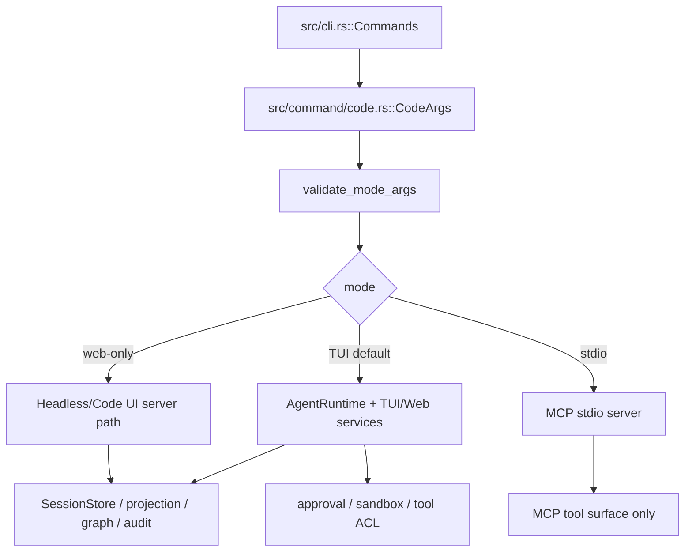

# `libra code` 开发设计

## 文档职责

本文是 `docs/development/tracing/plan.md` 的 Code 阶段目标文档，承接 C1~C8。它只描述 `libra code` 的内部 AgentRuntime、TUI/Web/headless/MCP、approval/sandbox/tool gate、session persistence 与 mutating fix bridge；`libra agent` 的 observed external-agent 捕获、hook、transcript、checkpoint 和 read-only review/investigate evidence 由 [`agent.md`](agent.md) 负责。

内部 AgentRuntime / Web-only 迁移的完整历史计划在 `docs/development/internal/code-agent-runtime.md`。本文只引用该文档中的源码锚点和 fix-bridge 证据，不恢复旧 `docs/development/code-agent-runtime.md`、`docs/development/agent.md` 或 `docs/development/web-only.md`。

## 命令实现目标

`libra code` 的目标是启动人类开发者与 AI agent 协作的受控编码会话。默认模式仍是交互式 TUI + 后台服务；普通请求先进入可审阅的 IntentSpec / 执行计划流程，再由用户确认是否执行。Code 阶段的核心目标不是发明新命令，而是把现有 mode、provider、Web/headless、MCP、session、approval、sandbox 和文档测试契约按源码事实收敛。

## 对比 Git 与兼容性

- 兼容级别：`intentionally-different`。Libra AI extension, not a Git command。
- 该命令属于 Libra 扩展；重点是清晰边界、结构化输出、稳定错误和可测试的 mode/provider 约束，不追求 Git 同形。

## 当前源码事实

- 入口与分发：`src/cli.rs::Commands` 公开接入；`src/command/mod.rs` 导出；主要实现文件是 `src/command/code.rs`，入口为 `execute`。
- 参数模型：`CodeArgs`、`CodeProvider`。`validate_mode_args` 当前负责三类 mode 校验：TUI 默认、`--web`/`--web-only`、`--stdio`。
- `--stdio` 是 MCP stdio transport。源码在 `validate_mode_args` 中明确拒绝 `--control write` 并提示使用 `libra code-control --stdio` 做本地 automation。
- 非 TUI mode 调用 `reject_non_tui_flags(args, mode, web_only)`，该函数按 mode 区分放宽（C2 已落地 C1 对 GAP-1/GAP-3 的 **code behavior** 分类）：
  - `--web`/`--web-only`（`web_only = true`）**放宽** `--provider`（全部 7 个 provider + Codex 分支）、`--model`、`--api-base`、`--temperature` 和 provider-specific tuning flags，使已构建的 headless web runtime / Codex web 分支 CLI 可达；这些 flag 转由 `validate_mode_args` 中的 cross-provider match gate 校验（不匹配的 provider-specific flag 仍拒绝，`--api-base` 在 `--provider=codex` 下仍拒绝）。banner/`BrowserControlMode` 注释/用户文档中的 `--web-only --provider <ollama|codex>` 示例因此变为真实可用。
  - `--stdio`（`web_only = false`）保持**完全锁定** provider/model/api-base/temperature 和 provider-specific flags —— 它是 MCP transport，没有 provider surface。
  - `--web`/`--web-only` 对 **非 Codex provider** 接受 `--resume`：它经 `load_or_create_headless_web_session_state` 读取同一工作目录的持久化会话，再由有界 JSONL projection fold 重建 Code UI。`--stdio` 和 managed Codex app-server 仍拒绝该 flag，因为两者不使用这套 headless session protocol。两种非 TUI mode 仍拒绝 `--env-file`、`--network-access allow`、`--context`、`--approval-policy`、`--approval-ttl`；web-only 的 `--env-file` **公开兼容决策**仍延后，但其 provider bootstrap 已复用同一 env-file → process → Vault lookup，不能再分叉默认值。
- provider-specific 约束：`--codex-bin`、`--codex-port`、`--plan-mode=true` 只允许 `--provider=codex`；`--api-base` 在 `--provider=codex` 下被拒绝；Ollama/DeepSeek/Kimi 的 thinking/stream/compact flags 只能用于对应 provider。
- `--control write` 要求 loopback host；control token、control info、browser control 和 Code UI API 的安全边界必须继续由 Code UI / code-control 相关测试守卫。



## Code 阶段契约

| 面向 | 当前结论 | 必须保持 / 补强 |
|---|---|---|
| Mode 与参数 | TUI、web-only、stdio 已共用 `CodeArgs` 和 `validate_mode_args`；C1 审计出的 help/banner 与 web-only provider 校验漂移已由 C2 放宽 web-only provider/model/api-base/temperature + provider-specific flags 消除（`--stdio` 保持锁定）。 | C2 已落地放宽并有 CLI regression（`code_cli_dispatch_test` + `src/command/code.rs::tests` web-only accept/reject 矩阵）；后续任何 mode 变更仍必须带 CLI regression。 |
| Provider / env | provider-specific flags 和 `--api-base` 规则已有校验；live/provider tests 依赖 `.env.test` 时不得泄露 key。 | C3 固定 provider factory、env-file 优先级、Vault/env lookup、missing-key 错误和 feature-gated live tests。 |
| Web-only / Code UI | Code UI API、SSE、browser control、control token、diagnostics redaction 是用户可见接口。 | C4 固定 `/api/code/*` observe-only contract；control token 0600；diagnostics/SSE/control info 不泄露 secrets。 |
| Session / graph | non-Codex `--web-only --resume` 已走 headless JSONL projection fold；TUI resume 仍走 `SessionState`；`--stdio`/managed Codex 继续拒绝 resume。projection、graph handoff、audit sink 不能与 user transcript 混用。 | C5/W1-06 固定 SessionStore JSONL unknown-event-safe、truncated-tail recovery、统一 event fold；TUI/managed-Codex/graph 尚未共用同一 fold。 |
| MCP / code-control | `libra code --stdio` 是 MCP stdio server；`libra code-control --stdio` 是 automation/control client。 | C6 禁止把 MCP stdio 当 turn control plane；双入口 tool set、shutdown、token/lease gate 都要有测试。 |
| Sandbox / approval / fix bridge | workspace mutation 只能走内部 AgentRuntime serialized queue、approval、sandbox 和 tool ACL。 | C7 是 `review --fix` / `investigate fix` 的唯一解锁点；证据不足时 Agent 阶段必须返回 `ERR_AGENT_FIX_BRIDGE_UNAVAILABLE` 对应错误码。 |
| Docs / compat | `libra code` 是 Libra-only extension；用户文档、compat matrix、tests/INDEX 必须与源码同步。 | C8 收敛 `docs/commands/code.md`、zh-CN、`COMPATIBILITY.md`、`tests/INDEX.md`、release notes。 |

## W0-01 runtime 命名空间与写入面审计（2026-08-09 重刷）

> 基线：已提交 `main` @ `25c8f6aee0ebe967d51cb0cba1b89031b0548b18`（v0.19.104）。
> 本轮只刷新锚点与冲突/漂移表；未把工作区未提交改动计为完成证据。

**决策：** UI-neutral 的 `AgentRuntimeHandle`、`AgentRuntimeWorker`、turn queue、
interaction state、event cursor 与 runtime snapshot 的唯一归属是
`src/internal/ai/runtime/`。`src/internal/ai/agent/runtime/` 只保留 provider/model
组装、`ChatAgent` 和 `run_tool_loop_with_history_and_observer` 等一次 turn 的执行
机械；它不得拥有 session queue、pending interaction、长期 snapshot 或新的 phase
持久化面。TUI、headless Web、MCP 和将来的 review/investigate bridge 均为薄 adapter：
只可 submit/respond/cancel/observe/snapshot，不能各自维护一份 workflow 状态机。

此决策避免在既有 `runtime` 与 `agent/runtime` 之外增设第三个持久化或 mutation
queue。新的 worker 在执行 mutating tool 前必须复用现有 `ToolRegistry` 的
`ToolBoundaryRuntime`（`src/internal/ai/tools/registry.rs:82,143-149`）及
`ToolRuntimeContext` 的 sandbox/approval 通道；不得复刻 policy 表、approval store
或 shell 执行路径。

| 面 / 事实源 | 已核对锚点（2026-08-09） | W1+ 的收敛动作 |
|---|---|---|
| Runtime contracts 与 safety boundary | `src/internal/ai/runtime/mod.rs` 导出 contracts、event、hardening、phase0..4、`worker`/`controller`/`durability`；`hardening.rs:540,548` 的 `ToolBoundaryRuntime`。 | worker/state-machine 已落在该 module；所有 mutating turn 以既有 hardening 为唯一判定来源。 |
| Provider/tool-loop 执行 | `src/internal/ai/agent/runtime/mod.rs`；`tool_loop.rs` 的 `run_tool_loop_with_history_and_observer`；headless executor 在 `headless.rs:815` 调用该 loop。 | worker 持有/接收 executor adapter，执行层仍调用该 loop，不把 queue 反向塞进 provider 模块。 |
| Phase 0 Intent | `phase0.rs:67` 的 `write_intent`；TUI 在 `app.rs:106` 导入、`app.rs:11486` 调用。 | Intent interaction 由 worker 统一推进，并继续调用 `write_intent`；不复制 `persist_intentspec`。 |
| Phase 1 Plan | `phase1.rs:401` 的 `write_plan_set` 委派 orchestrator persistence。 | Plan review/approval 通过 worker 后调用该入口；不得写新的 plan 表。 |
| Phase 2 Attempt | `phase2.rs:160,191` 的 start/finish；orchestrator `persistence.rs:727,859` 已桥接。 | worker/executor lifecycle 只经这些 bridge 记录 attempt。 |
| Phase 3 / Phase 4 | `phase3`/`phase4` ValidationReportStore / FinalDecisionStore 仍为 formal write 面。 | validation/terminal decision 继续由既有 store 写入；worker 只发布 normalized event/snapshot。 |
| 当前 adapter 漂移 | non-Codex headless browser submit 已经 `AgentRuntimeWorker::spawn`（`headless.rs:718`）；TUI/managed Codex/workflow interactions 仍未完全迁入。共享面拆分：`CodeAgentServicesBuilder`（`code.rs:1616,2338`）统一 **tool registry + hardening boundary**；provider/env/model 仍经 `build_any_completion_model_for_args`（`:1209`）；sandbox/approval 仍经 `tui_approval_config_from_args`（`:3832`）与 `default_tui_runtime_context`（`:3730`，返回 `ToolRuntimeContext`）。不得把后两者误并入 builder 所有权。 | W1-04/W1-06/W1-08 与 W2 继续把 cancel/projection/shutdown/workflow 收敛到 runtime-only；禁止新增平行状态机或第三条 bootstrap。 |

三态所有权图：

```text
TUI / Web / MCP / review-invoke adapter
        │ submit / respond / cancel / observe / snapshot
        ▼
src/internal/ai/runtime::AgentRuntimeWorker
        │ state + serialized turn queue + normalized events
        ├── runtime::phase0..4 (formal writes)
        └── agent::runtime tool-loop → ToolRegistry hardening + ToolRuntimeContext
```

`AgentRuntimeWorker` 的 UI-neutral queue/state-machine 位于
`src/internal/ai/runtime/worker.rs`。W2-01 已把 non-Codex headless direct chat 的 browser
submit 改接到该 worker；TUI、managed Codex、workflow interactions 和 durable command-id
bridge 仍未迁入，不能把这条 direct-chat 链路当作 Web-only completion 或 A0-05 bridge
完成证据。

### C1–C10 契约冲突表（W0-01）

本表以开工时已提交的 `main`（`25c8f6a` / v0.19.104）的 A0 产物为前提；当前工作区的
未提交改动绝不作为 A0 已完成的证据。2026-08-09 的源码重验确认下列冲突仍存在，且
每一项都有唯一后续 owner；这里登记冲突，不提前宣布其已解决。

| C | 当前源码/文档契约 | 与目标态的冲突或风险 | breaking / owner |
|---|---|---|---|
| C1 | `src/command/code.rs:694-707` 三路分发；`ControlMode`/`BrowserControlMode`/`WebOnlyRuntimeKind` 在 `:233/:248/:790`。 | 直接改默认分支会绕开既有行为矩阵。 | W4-01；默认切换是 public 行为变更。 |
| C2 | web-only 已可选 provider，且 non-Codex headless 已接受 `--resume`；仍拒绝 `--env-file`、approval/network 等 TUI flags（`reject_non_tui_flags` @ `:4571`）。 | Web default 仍会删除既有可配置能力。 | W3-03/W3-13 → W4-01；若删除 flag 必须 breaking migration。 |
| C3 | TUI/headless 共享三层 bootstrap：`CodeAgentServicesBuilder`（`:1616,2338`）→ registry/hardening；`build_any_completion_model_for_args`（`:1209`）→ env/model；`tui_approval_config_from_args` + `default_tui_runtime_context`（`:3832/:3730`）→ approval/sandbox。 | Web-only 仍拒绝公开 `--env-file`，但不得再靠独立 default bootstrap 形成隐式分叉。 | W3-13/W4-01 决定公开 flag parity。 |
| C4 | `code_ui.rs:674-685` `broadcast_snapshot` 仍发送完整 `CodeUiSessionSnapshot`；browser control/SSE 是公开 wire。 | 全量 snapshot 与有界 cursor/replay 目标不相容。 | W3-01/W3-06/W3-08；v2 须保留 v1 兼容窗口。 |
| C5 | non-Codex headless 已经由公开 `--web-only --resume` 进入 JSONL fold；stdio 与 managed Codex 仍不共享该协议。 | TUI/managed-Codex/graph 的 resume/recovery 尚未收敛为一个 runtime owner。 | W1-06 → W3-03、W4-01/W4-05。 |
| C6 | `code --stdio`（`execute_stdio` @ `:4309`）是 MCP transport，`code-control --stdio` 仍是独立 automation/control 入口；`ControlMode` 仅 `Observe\|Write`。 | `--control stdio` 尚不能由当前 `ControlMode` 表达，二者不可混作 turn control plane。 | W4-02/W4-09/W4-10；breaking command migration。 |
| C7 | `runtime::hardening` 是 mutating policy；A0-05 fix 仍 fail-closed `LBR-AGENT-010`（`review.rs:23,74` / `investigate.rs:22,77`）。 | 不能把不存在的 bridge 当可复用实现，也不能另建 mutation/approval 表。 | W1-01/W2-04/W6-02；bridge 仍 deferred。 |
| C8 | command docs、compat matrix、tests index 尚描述 TUI/current commands。 | 源码迁移会留下错误的公开行为承诺。 | W4-05/W6-01/W6-02；用户可见文档为发布门禁。 |
| C9 | MCP authorizer 仍是显式 deferred，生产没有 handler 时不可视为完整 authz。 | Web write security 不能依赖 MCP authorization 的不存在保证。 | W3-05/W4-03；保持 loopback/token/lease/tool ACL 的独立边界。 |
| C10 | headless direct-turn 已通过 `AgentRuntimeWorker` 执行（`headless.rs:718`），但仍跳过 Phase 0/1 IntentSpec/Plan 审阅（TUI 仍拥有 `pending_intent_review`/`pending_plan_revision` @ `app.rs:524,526`）。 | 这不是 Web-only completion，也不能安全替换 TUI workflow。 | W2-02/W2-03；完成后才更新 C10 文案。 |

### A0 接口漂移登记表（W0-01）

下表是消费接口核对，不是对 20260708 全计划重验。所有行均按当前源码定位；若后续
锚点或语义失效，只能补最小 adapter 或更新消费方，禁止在 Code 路径复制 queue、trust、
retention、artifact store 或 fix bridge。

| A0 产物 | 已核对接口（2026-08-09） | Code 消费决定 / 漂移处置 |
|---|---|---|
| A0-02 subagent checkpoint | `src/command/agent/hooks.rs:61-78` 的 `SubagentStart/SubagentEnd`；`src/internal/ai/history.rs:4764-4780` 的 `CheckpointScope::Subagent`；agent.md `:1057` 记录消费关系。 | 非 Code turn queue；Code 不复制 checkpoint writer。 |
| A0-03 stable error emit | `src/command/agent/hooks.rs:133-141` 映射 `HookEnvelopeInvalid` → `LBR-AGENT-008`；`src/command/agent/checkpoint.rs:337,351` 映射 `LBR-AGENT-009`/`AgentCheckpointStoreInconsistent`。 | 保留 agent error model；Code runtime 只返回其自己的 typed worker error。 |
| A0-04 run admission | `src/internal/ai/run_admission.rs:82,132,147` 的 `decide`、`RunSlot`、`QueueTicket`。 | 仅 review/investigate run 粒度；W1 worker 另行拥有 session turn 串行化。 |
| A0-05 fix bridge | `src/command/agent/review.rs:23,74` 与 `investigate.rs:22,77` 保持 `LBR-AGENT-010` fail-closed。 | 不等待、不伪造 bridge；W1 绑定 hardening/tool-loop，W6-02 再登记 bridge restart。 |
| A0-06 findings artifacts | `src/internal/ai/review/store.rs:608-618` 与 `src/internal/ai/investigate/store.rs:691-701` 均写 `findings_oid`；doctor/attach 为 agent 路径。 | Code session 不拥有或 GC agent artifacts。 |
| A0-07 skill projection | `observed_agents/skill_projection.rs:85` 的 `SkillEventProjection`；`extract.rs:40` 的 `skill_registry_for`。 | W2-06 只消费 registry/projection，不重建 discovery store。 |
| A0-08 trust | `observed_agents/trust.rs:195` `read_trusted_dirs`；`:297-305` `env_name_is_forbidden`；`:311` `env_allowlist_extra`。 | W3-05 复用 trust/redaction policy，禁止重写 secret allowlist。 |
| A0-09 retention | `src/command/agent/clean.rs:766` 的 `gc_expired_findings_runs`。 | Code JSONL lifecycle 归 W1-03；不混入 agent findings GC。 |
| A0-10 cloud tombstone | `src/command/cloud.rs:4186-4193` 发布 import tombstone；restore 路径约 `:4699` 起。R2 物理删除仍 deferred（agent.md A0-11/A0-10 事实）。 | 非 Code worker ownership；不得在 Code 路径复制 tombstone store。 |
| A0-11 deferred parity | `docs/development/tracing/agent.md:2115,2122-2136` 固定 remaining non-goals。 | 不以 Web migration 偷渡 external RPC/provider parity。 |

### W1-03 Code 会话事件边界

Code workflow 的唯一会话事件日志仍是
`.libra/sessions/{session_id}/events.jsonl`（`SessionJsonlStore`）。W1-03 只在既有
`SessionEvent` 上新增顶层 `code_workflow` 信封：旧 binary 将未知顶层 kind 整行跳过；
新 binary 以 `event_id` 去重、以 session-scoped `sequence: u64` 排序并显式报告 cursor
gap，绝不按 UUID 字典序推断顺序。`CommandAccepted`、interaction/intent、terminal
success/failure 与 `IndeterminateSideEffect` 都是此信封的 schema；最后一行 JSONL
损坏继续按既有规则 warning 后跳过，下一次 append 只丢弃该不完整尾部。W1-06 在同一
信封的 additive `CodeUiProjectionDelta.payload` 中存放逐项 Code UI projection：其内容与
既有 session transcript 同属本地 session retention boundary，绝不复制到 runtime event
summary、diagnostics 或 control audit；Web SSE 的既有完整 snapshot wire 契约不因该落盘格式
而改变。

本卡不实现 mutation 的 fsync/write-before-dispatch、command idempotency 或 recovery
reconciliation；这些均是 W1-05 的 durable boundary，也不在这里新增 projection/resume
路径（W1-06）。该日志只服务 Code 会话，**不拥有、不 GC、也不镜像为** A0-02 subagent
checkpoint、A0-06 review/investigate findings、external-agent capture retention 或 A0-10
cloud tombstone；上述 store 的 owner 与 GC policy 保持不变。

### W1-05 Runtime command durability boundary

`runtime::RuntimeCommandDurability` 是 Code command 的唯一 durable admission service。它以
`(repo_id, session_id, principal_id, command_id)` 和 `command_kind` + canonical request hash
识别 command；相同 payload 只返回已有 durable state，hash/kind 不同则 conflict fail-closed。
它只向上述 session JSONL 追加 `command_intent_persisted`、terminal 或
`command_indeterminate_side_effect` 事件，并在持有 session append lock 时 `sync_data`：
intent fsync 在 dispatch 前，terminal fsync 在结果后。

restart 时 pending read-only command 只能经显式 recovery/retry；pending mutating command
立即持久化为 `Indeterminate`，要求 reconciliation，绝不自动重放。W1-05 不接管 Code UI
projection/resume（W1-06），也不取代 W1-04 cancel/reconciliation state。当前 W1 runtime
foundation 暴露该 service；W2-01 的 non-Codex headless direct-chat adapter 已在 worker
start gate 打开前经它写 intent，并在 executor terminal/shutdown timeout 写 result 或
`Indeterminate`，不自建第二份 command log。当前 browser wire 尚无 caller-supplied stable
command id，故该 adapter 临时使用 worker turn id；W3 的 versioned control wire 必须提供
跨请求 retry 的稳定 id，届时才能完成公开 de-duplication contract。

### W1-07 Controller lease 与 fencing boundary

`runtime::ControllerService` 是每个 Code session 的 controller owner：它持有 remote
browser/automation lease、TTL、opaque fence generation 与 local-TUI reclaim state。Web、TUI
和 control client 只能请求 attach/detach/reclaim 或将现有 token 交给 service；它们不保存
可写 owner 的第二份本地状态。每次 mutating adapter dispatch 都先取得
`ControllerWritePermit`，permit 在 dispatch 边界内保持 controller-state lock，因此
detach、expiry replacement 或 local-TUI reclaim 不能在「token 校验成功」与「开始写入」之间
插入。permit 释放后旧 token 即不可再写入。

remote attach 只接受 browser/automation；同一 client 的 attach 只续期，其他 live owner 返回
稳定 `CONTROLLER_CONFLICT`。detach 必须同时匹配 controller kind、client ID 与 lease token；
local reclaim 仅对以 `LocalTui` 启动的 runtime 开放。该内存内 runtime fence 不替代
W3-10 的跨 worktree sidecar/file fence，且不承担 turn serialization（仍归 W1-01）。

### W1-06 projection/resume 当前边界（进行中）

headless Web persistence 目前将相邻的 `CodeUiSessionSnapshot` 比较后写为有序的
`CodeUiProjectionDelta`（status/controller/transcript/interaction/plan/task/tool/patchset），
并在 legacy `SessionSnapshot` metadata 中存储最后 durable workflow cursor。resume 只读取
cursor 之后、最多 1,024 个 event 和 8 MiB 的 JSONL tail；无法证明 sequence 连续时
fail-closed。`IndeterminateSideEffect` fold 到公开的
`indeterminate_side_effect` 状态，前端提示 reconciliation required，而非成功或普通
cancelled。对持久化 non-Codex headless Web session，首次用户消息的 snapshot/JSONL 写入是
spawn tool loop 的前置条件；失败时不创建 live turn。任一后续 projection/session 写失败都以
error 记录并将 live session 标为 `IndeterminateSideEffect`，阻止新的 submit/interaction reply，
而不是仅 warning 后继续执行。

headless 的临时 cancel 路径已不再 `JoinHandle::abort`：共享 tool loop 在 model/read-only
工作与 mutation dispatch 前检查 `ToolLoopCancellation`；一旦保守分类的 mutation 已跨过
dispatch boundary，cancel 返回可操作的拒绝并等待 handler 的可判定结果。turn finalize 会先
drain 本 turn 的异步 tool projection，防止迟到的 `Thinking` 状态覆盖 terminal 状态。这是
W1-04 的局部安全修复，不是 runtime worker/durability bridge 的替代品。

headless shutdown 现先关闭 adapter admission，再等待 active turn 的 terminal state（30 秒
上限）；read-only/model work 接收 cooperative cancellation，已开始的 mutation 不被 abort。
超时前会将 snapshot 持久化为 `indeterminate_side_effect`，并由 `execute_web_only` 作为
显式 CLI error 返回，而不是被吞掉或允许自动 replay。此路径尚未与 runtime worker 的
shutdown owner、Web/MCP/provider child 的资源 owner 合并，不能作为 W1-08 完成证据。

这仍不是 W1-06 完成证据：`--web-only --resume` 现已让非 Codex headless 路径可达，但
TUI/managed-Codex 的 live projection 与 graph read model 尚未接入同一 fold，`CodeUiSession`
仍保留内存 cache 供现有 SSE 使用。因此不得以 headless resume 已通就宣称所有 Code UI
projection 已事件化。

### 非 Code TUI 消费者登记

W5-03（模块退场）与 W5-10（依赖摘除）必须覆盖下列当前实际命中（2026-08-09 `rg`
重验）；它们不是 W1 的删除范围。`agent/graph.rs` 仍是额外编译期 consumer，不能因旧
清单漏列而被静默遗忘。

| 路径 | 当前依赖 | 后续 owner |
|---|---|---|
| `src/command/graph.rs:12-13,34,1129` | 直接 `crossterm`/`ratatui` 与 `internal::tui::{Tui,tui_init,tui_restore}`。 | W4-04/W5-08 → W5-10。 |
| `src/command/agent/graph.rs:16-17,31,721` | 同样直接创建 TUI。 | W5-03/W5-10 必须单独迁移或明确保留兼容策略。 |
| `src/internal/ai/web/code_ui.rs:1266` | `TuiControlError` downcast 是 Web API 的编译期耦合。 | W5-02 先迁为 UI-neutral error。 |
| `src/command/code.rs` `execute_tui` @ `:1561` | Code TUI startup/adapter。 | W5-01/W5-06，不能在 W1 删除。 |
| `src/internal/ai/agent/format.rs:6` | 仅 rustdoc intra-doc link，非编译依赖。 | W5-03 清理链接即可。 |

## Web-only completion gate（W0-03）

**当前 Web-only direct-turn 不是完成态。** headless/`--web-only` 仍可跳过
IntentSpec/Plan human gates（见 C10）；不得据此删除默认 TUI 或宣称 Web-only
parity closeout。

`src/internal/tui` 仍在 production 编译图中时，下列清单是迁移契约，不代表已经
达到 Web-only。任何删除 `internal::tui` 的变更必须在同一发布组把所有行更新为
`[x]`，并在对应 target 中留下可复跑证据；`code_web_only_completion_gate` 会拒绝
没有完整清单的 TUI 移除。

| Gate | 删除 TUI 前的不可省略条件 | 证据 target / source of truth |
|---|---|---|
| [ ] GATE-WEB-PLAN | **plan workflow parity**：IntentSpec、plan review、repair state 由 worker 的单一 typed interaction state 推进，未确认时不执行 mutation。 | `ai_runtime_contract_test`、`ai_code_ui_wire_test`；`runtime::phase0..2` formal writes。 |
| [ ] GATE-WEB-GOAL | **goal/task parity**：goal、task、sub-agent promotion 和 automation/trigger 输入全经 serialized turn queue。 | `ai_goal_*`、`ai_multi_agent_e2e_test`。 |
| [ ] GATE-WEB-RESUME | **resume parity**：worker crash/cancel 后从 JSONL authoritative event log 恢复 interaction/snapshot，截断尾行 fail-closed。 | `ai_session_jsonl_test`、`code_resume_test`。 |
| [ ] GATE-WEB-APPROVAL | **approval/cancel parity**：所有 mutating tools 同时受 hardening、ToolRuntimeContext sandbox 与 approval 约束；取消不与下一 mutation 并发。 | `code_tool_acl_test`、`code_ui_remote_approval_matrix`、runtime worker tests。 |
| [ ] GATE-WEB-SSE | **SSE gap/backpressure**：cursor scoped to one session；慢消费者收到 gap/lagged 并从持久化状态恢复，不造成无界内存。 | `ai_code_ui_wire_test`、SSE regression target。 |
| [ ] GATE-WEB-CODEX | **Codex normalization**：Codex 和 generic provider 的 adapter 都输出同一 AgentEvent/snapshot 形状。 | `ai_code_ui_wire_test`、`code_codex_runtime_test`。 |
| [ ] GATE-WEB-MCP | **MCP / `code --control stdio` boundary**：MCP tools/resources 不成为 turn control plane；control 的 token/lease/approval 仍经 runtime。 | `code_mcp_dual_entry_test`、`code_ui_remote_security_matrix`。 |
| [ ] GATE-WEB-DOCS | **docs/compat closeout**：用户文档、compat matrix、tests index、release notes 不再把 TUI 当 runtime owner。 | `compat_matrix_alignment`、`compat_agent_architecture_guard`。 |

Gate 的 A0 输入是上表 A0-02..A0-11 的已核对消费接口；它们不因为本清单而被复制或
重验。非 Code TUI consumer 的迁移状态同样由上一表约束，不能以删除 `internal::tui`
的方式绕过 `graph` 或 Web API error 兼容。

以下产品决定也属于 gate 的固定输入，不能在删除阶段重新解释：

- **GATE-WEB-DECISION-WEB-ONLY**：`--web-only` 的兼容期和废弃路径有明确版本界限。
- **GATE-WEB-DECISION-BAKE**：breaking removal 前完成连续 **3 patch** 烘焙期。
- **GATE-WEB-DECISION-STDIO**：`--stdio` 保持 MCP transport，绝不回流成 worker/control 替代品。
- **GATE-WEB-DECISION-SSH**：远程 SSH 的权衡不降低 loopback/token/lease 安全边界。
- **GATE-WEB-DECISION-GRAPH**：`libra graph` TUI 仅在 Web graph 已接替且兼容文档完成迁移后退场。

## C1~C8 任务映射

| 任务 | 目标 | 关键验证 |
|---|---|---|
| C1 source-grounded audit | 核对 `CodeArgs`、`CodeProvider`、`validate_mode_args`、Code UI routes、MCP stdio、resume、graph、audit sink；输出 code behavior / docs drift / test gap / deliberate difference 清单。 | `rg -n "validate_mode_args|reject_non_tui_flags|CodeUi|HeadlessCodeRuntime|LibraMcpServer|TracingAuditSink|SessionStore" src/command/code.rs src/internal/ai` |
| C2 mode/argument hardening | 固定 TUI/web-only/stdio 的互斥、provider-specific flags、错误消息和 JSON/quiet 行为。 | `cargo test --test code_cli_dispatch_test` |
| C3 provider/runtime/env | 固定 provider factory、Codex runtime、agent profile override、dotenv/Vault/env lookup 和 missing-key errors。 | `cargo test --test code_provider_boot_test`; `cargo test --test code_codex_runtime_test` |
| C4 Web/control/SSE | 固定 Code UI observe-only API、SSE、browser control、control token、diagnostics redaction。 | `cargo test --features test-provider --test code_ui_remote_security_matrix -- --test-threads=1`; `cargo test --test ai_code_ui_wire_test` |
| C5 session/graph/persistence | 固定 resume、SessionStore JSONL、projection bundle、graph handoff 和 audit sink。 | `cargo test --features test-provider --test code_resume_test -- --test-threads=1`; `cargo test --test ai_session_jsonl_test` |
| C6 MCP/code-control | 分离 `libra code --stdio` 与 `libra code-control --stdio`。 | `cargo test --features test-provider --test code_mcp_dual_entry_test -- --test-threads=1`; `cargo test --features test-provider --test code_ui_remote_security_matrix -- --test-threads=1` |
| C7 sandbox/approval/tool gate | 固定 mutating path 的 approval/sandbox/tool ACL；控制 review/investigate fix bridge。 | `cargo test --test code_tool_acl_test`; `cargo test --features test-provider --test code_ui_remote_approval_matrix -- --test-threads=1` |
| C8 docs/compat closeout | 同步 tracing/code、用户文档、compat matrix、tests/INDEX 和 release notes。 | `cargo test --test compat_matrix_alignment`; `cargo test --all` |

（`code_ui_remote_*`、`code_resume_test`、`code_mcp_dual_entry_test` 的真实用例逐项被 `#[cfg(feature = "test-provider")]` 门控，裸跑只编译并通过 1 个 `*_requires_test_provider_feature` 跳过占位测试、未执行任何真实用例；`ai_code_ui_headless_test` 则是整文件 `#![cfg(feature = "test-provider")]` 门控，裸跑编译为 0 个测试。两种形态裸跑都显示"通过"，均不得计为验收证据；完整验证命令口径以 plan.md §6/§9 为准。）

## 还未闭环的功能与风险

| 类别 | 风险 | 当前处理 |
|---|---|---|
| Mode 文档漂移 | ~~help/banner 示例、`docs/commands/code.md` 或本文声称某 web-only provider 组合可用，但 `validate_mode_args` 实际拒绝一切非 Gemini provider~~。**已在 C2 解决**：按 C1 的 code-behavior 分类放宽了 web-only 的 provider/model/api-base/temperature 与 provider-specific flags，Codex + 非 Gemini headless web 分支现已 CLI 可达，banner/文档示例变为真实。 | C2 已落地放宽 + CLI regression（`code_cli_dispatch_test`、`src/command/code.rs::tests` 的 web-only accept/reject 矩阵）；non-Codex web-only `--resume` 已接入 durable projection fold，`--stdio` 与 managed Codex 保持锁定；web-only `--env-file` 的**公开**支持延后但 bootstrap 已统一。C4 复核端到端可达性。 |
| Mutating fix bridge | observed external agent 的 review/investigate findings 不能直接改工作区。 | 未找到内部 serialized fix bridge 证据前，Agent 阶段 fix/action 统一 unsupported。 |
| MCP/control 混同 | 把 MCP stdio 当 live turn/control plane 会绕过 token/lease/approval 边界。 | C6 固定 `code --stdio` 与 `code-control --stdio` 分工。 |
| MCP 授权门（Phase-5 scaffold，**延期**，Task C9） | `McpAuthorizer` 门在生产**仅部分接入**：`resources/{list,read,templates}`（`server.rs:186/194/479`）与**部分** `tools/call` 站点（`resource.rs` 至 :2297 一带）走 `authorize_or_error[_with_actor]`，但 **`tools/list` 未接入**（`McpOperation::ListTools` 仅存在于 `authz.rs` 枚举与测试），且**若干 tool impl 完全无 authz 调用**（如 `create_patchset_impl:2354`、`list_patchsets_impl:2423`、`create_evidence_impl:2483`、`create_tool_invocation_impl:2608` 等）。**最关键**：**生产从不安装 handler**（`set_authz` 仅测试调用），`authorize_with_principal_or_error`（`server.rs:144`）在无 handler 时无条件 `Ok(())`——即便对已接入站点，**当前生产 MCP 授权也是 allow-all no-op**。（principal 侧：actor-aware 的 `authorize_or_error_with_actor`（`server.rs:130`）已用 `PrincipalContext::from_actor`；非 actor 的 `authorize_or_error` 仍跑 system principal，见 `server.rs:116`。）C6 只固定 stdio/HTTP 分工与 token/lease，未安装真实授权策略。 | **显式延期**：安装真实授权策略（当前无 handler=allow-all）+ 补齐未接入的 tool impl 与 `tools/list` 授权门 + 非 actor 站点的 principal threading，均为 Phase-5 后续工作；重启条件为落地 `McpAuthorizer` 生产实现并接入 serve 全路径。C6/C7「完成」仅覆盖 stdio 边界与 approval/sandbox/tool-ACL，**不**声称 MCP 授权门已闭环。当前安全边界由 loopback-only + control token/lease + tool ACL 承担。 |
| Web-only headless IntentSpec 审批环（**延期**，Task C10） | `--web-only --provider <非 codex>` 的 headless runtime（`src/internal/ai/web/headless.rs:23-31,78`）把每次 browser submit 当单次直连 turn，**跳过** TUI 的 Phase 0/1 IntentSpec/Plan 审阅-审批环（`code.md`「命令实现目标」的默认契约）。tool ACL/sandbox 仍生效，属 workflow/approval-UX 差异而非裸安全洞。 | **显式延期，非漏实现**：headless 为 direct-turn 契约，Full IntentSpec plan approval 为后续工作（源码注释已注明 will land in subsequent phases）。重启条件为把 TUI Phase 0/1 审批环接入 headless 路径并补 CLI/UI regression。C4「完成」覆盖 observe-only API/SSE/browser-control/diagnostics，**不**覆盖 headless 的 IntentSpec 审批环。 |
| Secret 泄露 | `.env.test`、provider key、control token、diagnostics、SSE、raw transcript 都可能泄露。 | live tests 关闭 xtrace；输出只保留 redacted summary；diagnostics/control/SSE 必测 redaction。 |

## 实现历史

- 2026-02-20 `5bef0a9e`（`invoke mcp interfaces in command code (#212)`）：基础实现节点。
- 2026-06-02 `37d0568c`（`feat(code): activate live-run registry end-to-end (child runner writes, /agents pane reads) (v0.17.1264, CEX-S2-16)`）：live-run registry 演进。
- 2026-06-02 `1723ed00`（`feat(code): wire sub-agent PatchSet store; persist merge candidates from libra code (v0.17.1232, CEX-S2-16)`）：PatchSet / merge candidate 持久化演进。
- 2026-05-31 `a94ee7d0`（`fix(code): record resume audit`）：resume audit 修正。
- 2026-05-30 `8ce6cedd`（`test(code): pin browser control matrix`）：browser control 测试契约。

历史条目只作为背景；当前行为以 C1 当轮源码复核和测试结果为准。

## 维护要求

- 改进本命令前，必须先阅读并遵循 [docs/development/commands/_general.md](../commands/_general.md)。
- 任何行为变更都要先核对实现源码，再同步 `COMPATIBILITY.md`、`docs/commands/code.md`、`docs/commands/zh-CN/code.md` 和相关测试。
- 新增或改变 public flag、JSON 字段、MCP tool、Code UI route、control file、approval/sandbox 行为时，必须明确兼容层级、稳定错误码、用户提示、测试 target 和回滚方式。
